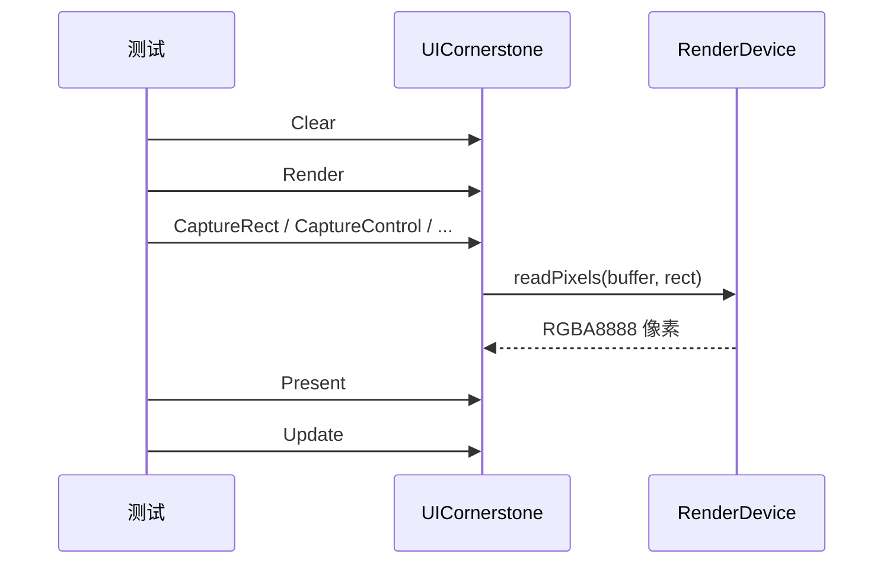

# 截图 API 设计（Capture API）

> 编制 2026-08-17 | 状态：**已评审（三轮源码核实）· 待实施**
> 关联：[BackendAbstraction_Design.md](BackendAbstraction_Design.md)、[CABI_MultiInstance_Design.md](CABI_MultiInstance_Design.md)

## 目录

1. [动机](#1-动机)
2. [问题背景](#2-问题背景)
3. [备选方案与决策](#3-备选方案与决策)
4. [最终决策总览](#4-最终决策总览)
5. [详细设计](#5-详细设计)
6. [后端改造方案](#6-后端改造方案)
7. [文档与用户手册修改](#7-文档与用户手册修改)
8. [测试策略](#8-测试策略)
9. [风险与开放项](#9-风险与开放项)

---

## 1. 动机

视觉回归测试目前依赖内部状态断言（hover/选中态等），无法验证**实际渲染像素**。`RenderDevice::readPixels` 自存在起无任何调用方，三后端实现未经真实场景验证（其中 sfml 实现恒返回空画布）。提供截图 API 为测试补上"像素级断言"能力。

支持四种目标：整个视口（viewport / 窗口）、Bench（顶层面板）、指定控件（任意 Control）、屏幕坐标系 rect 范围。

---

## 2. 问题背景

### 2.1 readPixels 接口现状

| 后端 | 现状 | 问题 |
|---|---|---|
| 接口 | `include/RenderDevice.h:62` 纯虚，无任何调用方 | 未经真实场景验证 |
| sdl3 | `sdl3/RenderDevice.cpp:284-301`：`SDL_RenderReadPixels` → **ABGR8888** 转换（SDL3 RGBA8888 命名在 LE 内存为 A,B,G,R；ABGR8888 得 R,G,B,A，已实测）→ 逐行拷贝 | 基本可用；rect 越界返回 NULL 静默失败 |
| sfml | `sfml/RenderDevice.cpp:613-630`：创建**空** `RenderTexture` 后 `copyToImage` | **缺陷**——读回恒为空画布；`getPixel` 越界行为未定义 |
| raylib | `raylib/RenderDevice.cpp:672-689`：`LoadImageFromScreen` 全屏读回 + 逐像素拷贝 | 正确但全屏读回；越界 `continue` 不写 dst；**无帧内检查**（`m_frameActive` 仅由 `clear()`:696-698 / `present()`:703-715 管理） |
| Callback | 原 `CallbackAdapters.cpp:190` 空实现、回调表无 readPixels 入口 | **已解决**——回调表新增 `readPixels` 入口（`UICornerstoneAPI.h:207` 结构末尾、capabilities 之后），`CallbackRenderDevice::readPixels`（`CallbackAdapters.cpp:190`）转发，三后端 `GetUIBackendCallbacks` 注册（经 `BackendBridge` 桥接到原生实现） |

三后端 `readPixels` 均无帧内检查，调用时机完全依赖调用方。

### 2.2 能力位与坐标体系

- `UICORN_BACKEND_CAP_READBACK` 已定义（`include/UICornerstoneAPI.h:110`），`UICornerstone_GetBackendCapabilities`（:224）可查；三原生后端均已声明（sdl3/sfml `BackendPlugin.cpp:67-68,141-142 / 53-54,95-96`、raylib `:55,96-97`）
- **三层模型**（`src/UICornerstoneAPI.cpp:532-550`）：viewport 恒为屏幕可见区域（数据层），bench 恒为画布顶层（布局空间）；viewport 偏移由 `recomputeViewportTransform`（`src/Bench.cpp:137-178`）携带进 anchor
- **像素级覆盖语义（实测确认）**：渲染顺序为 ① 视口背景（`SetViewportBackgroundColor`，仅 alpha>0 填充）→ ② bench 根容器背景（默认 `ConstDef::DEFAULT_NORMAL_COLOR = (23,23,24,255)`，铺满视口）→ ③ 控件。**默认布局下根容器背景覆盖视口背景**，截图像素以根容器/控件为准；视口背景仅在画布留白（fit/stretch 缩放）处可见
- `getDrawRect()` 链输出即为**窗口像素坐标**：`Bench::getDrawRect()`（`src/Bench.cpp:226-229`）返回 `{m_rect.left + anchorX, ...}`，子控件递归累加父链（`src/ControlBase.cpp:602-614`）
- 视觉测试已有先例（`test_multiviewport_visual_cabi.cpp` 等），主循环 `uiClear → uiRender → uiPresent`（:293-301）

---

## 3. 备选方案与决策

### 3.1 落盘形式：两步式内存缓冲 + 文件接口

| 方案 | 说明 | 结论 |
|---|---|---|
| A. 直接落盘 | 截图 API 直接写文件，不暴露内存缓冲 | **排除**——测试需在内存中逐像素断言，文件往返无谓 |
| B. **两步式（采纳）** | `Capture*` 输出内存缓冲 + `SavePixelsToFile` 落盘 | 与"断言读内存 + 需要时落盘"解耦；落盘接口不接收矩形 |

### 3.2 缓冲区管理：调用方分配

与 C ABI 既有风格一致（`GetString` 等均由调用方分配）。输出尺寸可由 GetViewport / getDrawRect 推算，无需 API 内部管理生命周期。

### 3.3 坐标空间：CaptureRect = 屏幕像素坐标原语

| 方案 | 说明 | 结论 |
|---|---|---|
| A. 逻辑坐标 | 与控件布局坐标一致，API 内换算 | **排除**——需要在 API 内引入第二套换算（scale + anchor），且 sdl3 后端无 `SDL_RenderSetScale`（绘制 1:1 像素），逻辑坐标语义在缩放场景下需额外实测 |
| B. **像素坐标原语（采纳）** | 与 `readPixels`/`SDL_Rect` 一致，零换算 | 三个薄封装（viewport/bench/control）内部经 `getDrawRect` 链 / GetViewport **直接透传像素坐标**；逻辑→像素换算（`坐标×scale + anchor`）留给调用方（`GetViewportScale` :593 返回 `getScaleXX/YY`） |

### 3.4 越界语义：统一裁剪

| 方案 | 说明 | 结论 |
|---|---|---|
| A. 越界即失败 | rect 越出视口返回 0 | **排除**——控件部分出界是常态，断言需截断区域 |
| B. **部分越界裁剪（采纳）** | rect 与视口求交集，`outW/outH` 返回裁剪后尺寸；**交集为空返回 0** | API 层统一处理，不依赖后端各自的越界行为（sdl3 失败返回 / raylib 留空 / sfml 未定义） |

### 3.5 sfml 读回路径：`Texture::update(window)` 首选

| 方案 | 说明 | 结论 |
|---|---|---|
| A. `glReadPixels` | 直接读 GL 帧缓冲 | 可行但需手动 `setActive` + y 翻转 |
| B. **`sf::Texture::update(window)` + `copyToImage`（采纳）** | 内部 `glCopyTexSubImage2D` 读 back buffer | SFML 3 保留该重载（官方推荐替代 `Window::capture()`）；内部自动 `setActive`；`copyToImage` 已处理 GL 翻转（`m_pixelsFlipped` 分支）→ 输出 top-down；**全窗口读回**，按 rect 裁剪拷贝 |

### 3.6 时序违规语义：未定义（读旧帧）

sdl3/sfml 后端无帧状态标记，无法可靠返回失败；仅 raylib 能凭 `m_frameActive` 防御返回 0。设计为：**正确时序由调用方保证（文档约束），违规行为未定义**。

### 3.7 Callback 能力位：回调表新增 readPixels 通道

回调表原无 readPixels 入口，Callback 托管路径**结构上无法读回**——三后端回调表 `cb.capabilities` 声明 READBACK 属"声明超前于实现"。而**项目自身的 DLL 动态加载模式（全部 cabi 测试形态）走的就是回调表路径**：`CreateInstanceFromPlugin` → `GetUIBackendCallbacks` → `BackendManager::initialize(callbacks)`，renderDevice 为 `CallbackRenderDevice`。因此摘除声明会连 DLL 模式的截图一并关掉，方案不可行。

**采纳：回调表增加 readPixels 通道**：
- `UIBackendCallbacks` 结构末尾（capabilities 之后）新增 `void (*readPixels)(UIRenderDeviceHandle dev, void* buffer, int left, int top, int width, int height)`（`UICornerstoneAPI.h:207`）；追加在末尾，不改变既有字段偏移
- `CallbackRenderDevice::readPixels`（`CallbackAdapters.cpp:190`）转发到该入口
- 三后端 `GetUIBackendCallbacks` 注册实现：`static_cast<RenderDevice*>(dev)->readPixels(buffer, SRect(...))`（handle 即原生 `RenderDevice*`，与 `createRenderDevice` 返回一致）
- 三后端回调表保留 READBACK 声明；能力位声明与实现从此一致

### 3.8 编译开关：不设 _DEBUG 限制

| 方案 | 说明 | 结论 |
|---|---|---|
| A. `_DEBUG` 编译开关 | 与 `Debug_SetMousePosition` 等注入类测试辅助一致，Release 恒返回 0 | **排除**——像素断言是正式能力（能力位门控已足够），Release 回归测试同样需要 |
| B. **正式 API（采纳）** | 无 `_DEBUG` 限制，由 READBACK 能力位门控 | 与 `GetRect`/`GetViewport` 等查询类辅助一致，测试与诊断均可用 |

---

## 4. 最终决策总览

- 5 个 C ABI 函数：`UICornerstone_CaptureRect`（原语）+ `CaptureViewport / CaptureBench / CaptureControl`（薄封装）+ `UICornerstone_SavePixelsToFile`（落盘）
- 坐标：像素（原语零换算）；裁剪：部分越界裁剪、交集为空返回 0；取整：截断
- 像素契约：RGBA8888（R,G,B,A）、top-down 行序、little-endian
- 时机：Render 后、Present 前（帧内读回）
- 门控：READBACK 能力位；三后端（编译期 + 回调表）均已声明且实现可用（含 Callback 路径，§3.7）
- 编译：正式 API，无 `_DEBUG` 限制（§3.8，能力位门控已足够）

---

## 5. 详细设计

### 5.1 核心原语

```c
/* 截取屏幕坐标系 rect 范围；返回 RGBA8888 像素到 outPixels（调用方分配 w*h*4 字节）
   需在 UICornerstone_Render 之后、下一次 Clear/Present 之前调用（§5.5） */
UICORNERSTONE_API int UICornerstone_CaptureRect(UIInstance instance,
    float x, float y, float w, float h,
    uint8_t* outPixels, int* outW, int* outH);
```

- 返回 1 成功 / 0 失败：instance 无效、READBACK 能力位未声明、rect 与视口**交集为空**（完全越出视口）、**outPixels 为空**、**w/h ≤ 0**
- **坐标空间：屏幕像素坐标**（原语零换算，与 `readPixels` 一致）；调用方若持逻辑坐标，经 `GetViewportScale` 换算（`坐标×scale + anchor`，见 §3.3）
- **instance 窗口归属**：rect 为 instance 所属窗口的屏幕像素坐标——每实例独立窗口（多窗口各自读回）；子视口实例（`CreateViewport`）与父共享窗口，其 viewport 为父窗口内像素区域，rect 按父窗口坐标
- 部分越界 → 裁剪：`outW/outH` 返回裁剪后实际尺寸（≤ 输入 w/h）；**outW/outH 可传 NULL**（与 `GetViewport` 惯例一致，调用方已自行推算尺寸时）
- float → int 取整：**截断**（与 sdl3 内部 `SDL_Rect` 一致）；断言容差覆盖亚像素差异

### 5.2 薄封装

```c
UICORNERSTONE_API int UICornerstone_CaptureViewport(UIInstance instance, uint8_t* out, int* w, int* h);
UICORNERSTONE_API int UICornerstone_CaptureBench(UIInstance instance, uint8_t* out, int* w, int* h);
UICORNERSTONE_API int UICornerstone_CaptureControl(UIInstance instance, UIControlHandle ctl,
    uint8_t* out, int* w, int* h);
```

| 目标 | rect 来源 | 备注 |
|---|---|---|
| Viewport | `UICornerstone_GetViewport`（:543） | 已是窗口像素坐标，零换算 |
| Bench | `Bench::getDrawRect()`（`Bench.h:10`，`Bench.cpp:226-229`） | 含 anchor 偏移 |
| Control | `getDrawRect()`（`ControlBase.cpp:602`） | 递归绝对坐标；ctl 为空或不属于该 instance → 返回 0 |

三个封装共用 §5.1 的裁剪/失败语义。

### 5.3 像素格式契约（RGBA8888）

- 每像素 4 字节连续，内存字节序 **R,G,B,A**（little-endian 上即 `uint32 = 0xAABBGGRR`）
- 行序 **top-down**：sdl3（SDL surface 原点左上）、raylib（Image 原点左上）天然满足；sfml 视路径而定（§3.5 首选路径 SFML 已翻转，无需处理；裸 `glReadPixels` 路径须 y 翻转）
- 三端均输出此格式（sdl3 `SDL_ConvertSurface(ABGR8888)` 转换——SDL3 的 `RGBA8888` 命名在 little-endian 上内存为 A,B,G,R，须用 `ABGR8888` 得到 R,G,B,A（实测确认）；sfml/raylib 逐字节 `dst[0..3]=r,g,b,a` `:626-627` / `:684-685`）
- 边界：面向 little-endian 平台（big-endian 下 sdl3 RGBA8888 变体）；sfml 窗口帧缓冲通常无 alpha（恒 255），alpha 断言需知晓

**平台字节序**：ARM64/ARMv7 在 Android 全 ABI、Linux 主流发行版均为 little-endian，与 x86 一致，无需特判；ARM bi-endian（armeb）明确排除支持范围；GLES 读回 `GL_RGBA + GL_UNSIGNED_BYTE` 为 GLES 2.0/3.0 通用组合，y 翻转逻辑无平台差异。

### 5.4 落盘接口

```c
/* 将内存中的 RGBA8888 像素缓冲保存为文件（当前格式：BMP 32 位 BGRA，零依赖自编码；
   按扩展名扩展后续格式）。与后端无关，不需要 instance。 */
UICORNERSTONE_API int UICornerstone_SavePixelsToFile(
    const uint8_t* pixels, int w, int h, const char* filePath);
```

- 典型用法：`CaptureControl(...) → SavePixelsToFile(pixels, w, h, "x.bmp")`
- BMP 自编码（约 40 行，无第三方依赖，PIL/stb 可直接读）；**注意字节序**：内存 RGBA8888（R,G,B,A）→ BMP 文件字节序 B,G,R,A，写入时交换（自编码内处理）
- PNG 需 zlib/stb_image_write，列为后续项
- 返回 1/0：空指针、尺寸非法、写文件失败

### 5.5 调用时机与帧语义

**正确时序：`UICornerstone_Render` 之后、下一次 `Clear`/`Present` 之前**。三后端 `present()` 均交换缓冲（raylib `SwapScreenBuffer` :703-715、sdl3 `SDL_RenderPresent` :308-309、sfml `display` :641-644）——交换后 back buffer 已是旧帧。

**时序违规语义：未定义（读旧帧）**；仅 raylib 因 `m_frameActive` 防御（实施后）返回 0。



### 5.6 能力位门控

- `Capture*` 前置检查 `UICORN_BACKEND_CAP_READBACK`（`GetBackendCapabilities` :224）；未声明 → 返回 0
- 三后端（编译期 + 回调表）均声明 READBACK 且实现可用；回调表路径经 §3.7 通道转发到原生实现，门控与实现一致

---

## 6. 后端改造方案

| 后端 | 改动 | 风险 |
|---|---|---|
| sdl3 | 基本可用；API 层补空指针/裁剪防御 | 低 |
| sfml | **已重写 readPixels**：`Texture::update(window)` + `copyToImage` 全窗口读回 → 按 rect 裁剪拷贝 → 逐字节 RGBA8888（SFML3 无 `Texture::create`，改用 `Texture(Vector2u)` 构造）；render target 回退 `getTexture().copyToImage()`（Texture::update 无 RenderTexture 重载） | 中——GL 读回是 sfml 短板 |
| raylib | `readPixels` 加 `if (!m_frameActive) return;` 防御（已完成）；按 rect 裁剪读回（当前全屏读）列为可选优化 | 低 |
| Callback | **回调表新增 readPixels 入口**（结构末尾，`UICornerstoneAPI.h:207`）+ `CallbackRenderDevice::readPixels` 转发（`CallbackAdapters.cpp:190`）+ 三后端 `GetUIBackendCallbacks` 注册（经 `BackendBridge` 桥接到原生实现） | — |

**实施顺序**：① 回调表加 readPixels 入口（§3.7）→ ② raylib 帧防御 → ③ API 层（`UICornerstoneAPI.h` 声明 + Capture\* + SavePixelsToFile，`__declspec(dllexport)` 声明即导出，无需 .def）→ ④ sfml readPixels 重写 → ⑤ 测试用例 → ⑥ 用户手册 CABI 速查表同步 + Binding 动态解析槽位（可选）。

### 6.1 实现要点（源码修改轮廓）

**CaptureRect 核心**（`src/UICornerstoneAPI.cpp`，置于"控件通用操作"区之后）：

```cpp
int UICornerstone_CaptureRect(UIInstance instance, float x, float y, float w, float h,
                              uint8_t* outPixels, int* outW, int* outH) {
    if (!instance || !instance->initialized || instance->destroying) return 0;
    if (!outPixels || w <= 0.0f || h <= 0.0f) return 0;
    if (!(instance->backendManager->capabilities() & UICORN_BACKEND_CAP_READBACK)) return 0;
    // 与视口求交集（部分越界裁剪；交集为空 → 0）
    SRect vp = instance->viewport;
    float ix = fmaxf(x, vp.left), iy = fmaxf(y, vp.top);
    float iw = fminf(x + w, vp.left + vp.width) - ix;
    float ih = fminf(y + h, vp.top + vp.height) - iy;
    if (iw <= 0.0f || ih <= 0.0f) return 0;
    SRect r{ ix, iy, iw, ih };   // float→int 截断由后端 readPixels 处理
    instance->renderDevice->readPixels(outPixels, r);
    if (outW) *outW = (int)iw;
    if (outH) *outH = (int)ih;
    return 1;
}
```

**薄封装**：`CaptureViewport` 取 `instance->viewport` 后转调 CaptureRect（零换算）；`CaptureBench` 取 `instance->bench->getDrawRect()`；`CaptureControl` 校验 ctl 归属（`instance->bench` 子树内）后取 `ctl->getDrawRect()`。

**sfml readPixels 重写**（`src/backend/sfml/RenderDevice.cpp:613-630` 整段替换）：

```cpp
void readPixels(void* buffer, const SRect& rect) override {
    flushBatches();
    if (!m_target || !buffer) return;
    sf::Image img;
    if (m_target == m_window) {                   // 窗口：update(window) 读 back buffer
        sf::Texture tex;                          // （内部自动 setActive，copyToImage
        tex.create(m_window->getSize().x, m_window->getSize().y);
        tex.update(*m_window);                    //   已翻转 → top-down）
        img = tex.copyToImage();                  // 须在 display() 前调用（§5.5）
    } else {                                      // render target：纹理内容直接读
        img = static_cast<sf::RenderTexture*>(m_target)->getTexture().copyToImage();
    }
    // 按 rect 裁剪拷贝 → 逐字节 r,g,b,a（与现实现 :626-627 同款）
    for (int y = 0; y < (int)rect.height; ++y)
        for (int x = 0; x < (int)rect.width; ++x) {
            sf::Color c = img.getPixel({(unsigned)(rect.left + x), (unsigned)(rect.top + y)});
            uint8_t* dst = (uint8_t*)buffer + (y * (int)rect.width + x) * 4;
            dst[0] = c.r; dst[1] = c.g; dst[2] = c.b; dst[3] = c.a;
        }
}
```

**raylib 帧防御**（`src/backend/raylib/RenderDevice.cpp:672` readPixels 函数入口处）：

```cpp
void readPixels(void* buffer, const SRect& rect) override {
    if (!m_frameActive) return;   // 帧内（BeginDrawing 后）才可读
    if (!buffer) return;
    Image img = LoadImageFromScreen();   // 全屏读（按 rect 裁剪优化列为可选）
    ...
}
```

**回调表 readPixels 通道**（§3.7）：
- `include/UICornerstoneAPI.h`：`UIBackendCallbacks` 结构末尾（capabilities 之后）新增 `readPixels` 字段（追加不改偏移）
- `src/CallbackAdapters.cpp:190`：`CallbackRenderDevice::readPixels` 转发 `m_cbs->readPixels(m_handle, buffer, left, top, w, h)`
- 三后端 `GetUIBackendCallbacks`：`cb.readPixels = [](UIRenderDeviceHandle dev, void* buf, int l, int t, int w, int h){ if (dev) static_cast<RenderDevice*>(dev)->readPixels(buf, SRect(l,t,w,h)); }`

---

## 7. 文档与用户手册修改

### 7.1 用户手册 CABI 速查表（`docs/appendix/capi.html`）

新增 **8.10 截图（Capture_*）** 小节（置于 8.9 调试工具之后；Capture 为正式测试辅助 API，与 Debug_\* 区分）。内容草案：

```html
<h2>8.10 截图（Capture_*）</h2>

<p>像素级测试辅助：截取渲染结果（RGBA8888）。能力位
<code>UICORN_BACKEND_CAP_READBACK</code> 未声明时返回 0。
需在 <code>UICornerstone_Render</code> 之后、下一次
<code>Clear</code>/<code>Present</code> 之前调用（帧内读回）；
Present 后调用行为未定义（读到旧帧）。坐标为屏幕像素。</p>

<table>
<tr><th>函数</th><th>说明</th></tr>
<tr><td><code>UICornerstone_CaptureRect(inst, x, y, w, h, out, &amp;w, &amp;h)</code></td>
    <td>截取屏幕坐标系 rect（部分越界裁剪；交集为空返回 0；outPixels 空或 w/h≤0 返回 0）</td></tr>
<tr><td><code>UICornerstone_CaptureViewport(inst, out, &amp;w, &amp;h)</code></td>
    <td>整个视口（GetViewport 区域，窗口像素坐标）</td></tr>
<tr><td><code>UICornerstone_CaptureBench(inst, out, &amp;w, &amp;h)</code></td>
    <td>Bench（顶层画布，含视口缩放/锚点变换）</td></tr>
<tr><td><code>UICornerstone_CaptureControl(inst, ctl, out, &amp;w, &amp;h)</code></td>
    <td>指定控件（getDrawRect 绝对坐标；ctl 空/跨实例返回 0）</td></tr>
<tr><td><code>UICornerstone_SavePixelsToFile(pixels, w, h, path)</code></td>
    <td>RGBA8888 内存缓冲落盘为 BMP 32 位（自编码，无第三方依赖；PNG 后续）</td></tr>
</table>

<pre><code>// 帧内读回示例（与视觉测试主循环对齐）
uiClear(inst);
uiRender(inst);
UICornerstone_CaptureControl(inst, panel, pixels, &amp;w, &amp;h);
UICornerstone_SavePixelsToFile(pixels, w, h, "capture.bmp");
uiPresent(inst);</code></pre>
```

### 7.2 C++ Binding（可选同步）

`binding/src/DynamicApi.h` 加 5 个槽位（`fnCaptureRect` 等，`RESOLVE(CaptureRect)` 模式），`binding/src/UICornerstone.cpp` 暴露 `UICornerstone::CaptureRect(...)` 等静态封装；测试优先走 C ABI，Binding 封装按需补充。

### 7.3 其他文档

- 本设计文档定稿后，于 `design/guidelines/history.md` 补 2026-08-17 会话条目
- 三后端 `RenderDevice.cpp` 重写后，本设计文档 §2/§5.3 引用的现状行号随之失效——更新为"设计时勘察依据"注记即可，不承诺随实现刷新

---

## 8. 测试策略

新建 `test/test_capture_cabi.cpp`（视觉断言沿用 `test_multiviewport_visual_cabi.cpp` 风格）：

1. 纯色背景 + 已知位置控件 → `CaptureControl` 断言中心像素 == 控件颜色（控件选纯色块 Panel，避免文本/边框抗锯齿干扰）
2. `CaptureViewport` 断言四角/中心像素（实测语义：默认布局下可见色为 bench 根容器背景 `ConstDef::DEFAULT_NORMAL_COLOR (23,23,24)`，视口背景被覆盖，见 §2.2）
3. `CaptureRect` 断言边界裁剪：部分出视口 → `outW/outH` 收窄、像素对应裁剪后区域；完全出视口 → 返回 0
4. 能力位门控：READBACK 未声明 → 返回 0（三后端均声明且实现可用；Callback 路径经 §3.7 通道可读）
5. 时序：仅在正确时序（Render 后、Present 前）断言；不依赖违规行为
6. 落盘：`SavePixelsToFile` 输出 BMP → 读回断言像素（BMP 为 BGRA 字节序 + bottom-up，读回时按行反转）

流程模式：`Clear → Render → Capture* → Present → Update`（与现有视觉测试主循环 :293-301 对齐）。

---

## 9. 风险与开放项

| 项 | 说明 | 处置 |
|---|---|---|
| sfml readPixels 重写 | GL 读回是 SFML 短板，`Texture::update(window)` 行为需平台验证 | 平台实测；失败则回退裸 `glReadPixels`（需 y 翻转） |
| 缩放场景换算 | sdl3 后端无 `SDL_RenderSetScale`，绘制 1:1 像素；fit/stretch 下 anchor+scale 已由 `getDrawRect` 链携带 | 1:1 场景先行，缩放场景实测补测 |
| high-DPI / Android | SDL 窗口物理像素与 rect 语义、EGL surface 可带 alpha、raylib `LoadImageFromScreen` 行序在 GLES 上的一致性 | 设备实测；alpha 断言跨平台语义需知晓 |
| ARM 字节序 | little-endian 全覆盖，armeb 排除 | 无代码适配 |
| 亚像素差异 | ARM NEON 浮点与 x86 的差异 | 测试断言容差覆盖 |