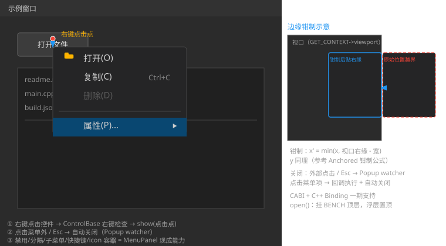

# 右键菜单（ContextMenu）需求分析

> 状态：**已拍板（2026-08-17，决策点 1-8 全部定稿）· 转主设计开发 Session 实施**
> 关联：[Menu_Design.md](Menu_Design.md)、[Menu_Enhancement_Analysis.md](Menu_Enhancement_Analysis.md)（icon 区容器/逐项字体增强直接惠及右键菜单，同一 MenuPanel）、[Dialog_Design.md](Dialog_Design.md)（Popup 浮层机制）
> 效果图：[ContextMenu_Preview.svg](ContextMenu_Preview.svg)（嵌入 §3）

> **修订注记（v1 → v2，决策拍板 + SVG 效果图）**：
> ① 决策点 2：**A（纯 API）+ B（ControlBase setContextMenu）+ C（JSON 键）三期合一，一期全支持**。
> ② 决策点 6：**CABI 一期**；**C++ Binding 一期同步支持**（新增控件需在 Binding 暴露）。
> ③ 决策点 4：键盘导航**后续与 Menu 控件一起实现**（同一 MenuPanel 键盘逻辑，一次做）。
> ④ "共享菜单场景"定义明确（见 §6）：C++ 多控件绑定同一实例 + 运行时动态内容一期已覆盖；
> JSON 顶层 `context-menu` + id 引用仅为 JSON 去重优化，后续追加。
> ⑤ 效果图 [ContextMenu_Preview.svg](ContextMenu_Preview.svg) 展示：右键触发 → show(点击点)、
> 菜单面板（含禁用/分隔/子菜单/快捷键）、外部点击/Esc 关闭、边缘钳制。
> 修订注记（v3，2026-08-17）——**对齐 ListView 一致性补充**：① 新增 §6.1 属性一致性矩阵
> （ContextMenu 无控件级属性，专用 API 仅 4 个 + `SetPtr("context-menu")` 通用绑定，命名核对无违规）；
> ② **源码行号核对修正**（Menu.cpp 系列失准）：recalculateSize=:422、layoutItems=:482、
> hitTest=:497、setOpenSubMenu=:524、MenuPanel::handleEvent=:760-807、isContainsPoint=:808、
> MenuItem 点击回调=:209-213（MenuItem::handleEvent 内，非 MenuPanel::handleEvent）、
> 子菜单 parent=:111-119、子菜单坐标=:547-550（原 370-640/617-624/635-640/490 等引用已失准）；
> ③ 删除无关引用（ControlBase.cpp:841）。

## 1. 需求概述

提供右键菜单控件：在控件上点击鼠标右键弹出菜单浮层，支持菜单项执行操作、嵌套子菜单、禁用项、分隔线、外部点击/Esc 关闭、屏幕边缘自适应。

## 2. 现状调研（关键行号）

| 项目 | 现状 |
|---|---|
| **Popup 浮层框架（可复用，核心）** | `include/Dialog.h:24-86`：`Popup : Panel` 已内置——`m_closeOnClickOutside`（外部点击关闭，:30）、`m_closeOnEsc`（Esc 关闭，:31）、`AnchorMode`（Absolute/Centered/Anchored，:37-40）、`setAbsolute`（:70）、`onEscPressed`/`onOutsideClicked`（:46-47）、`open`/`close`/`isPopupVisible`（:57-59） |
| Popup::open | `Dialog.cpp:132-152`：挂 **BENCH 顶层**（`BENCH->addControl`，:143）→ `computeTargetRect` → `setRect` → `registerWatcher`（:148）→ 焦点边界（:149） |
| Popup::close | `Dialog.cpp:154-169`：`BENCH->removeControl` + 焦点边界注销 + onClose 回调；**watcher 不主动移除**（从 watcher 内部 close 会递归锁 UB，:160-164，靠 getVisible 短路） |
| 外部点击/Esc 拦截 | `Dialog.cpp:228-251`：`beforeEventHandlingWatcher`（EventQueue 全局钩子，注册 KeyDown+MouseDown，:112-119）——Esc → onEscPressed 关闭；MouseDown 在 `isContainsPoint`（**虚函数**）外 → onOutsideClicked 关闭并 return false（事件继续传播 :247-248） |
| 坐标换算 | `Dialog.cpp:61-110`：computeTargetRect——Centered 居中（:77-85）、Anchored 视口钳制 loX/hiX（:86-105）、**Absolute 直接返回**（:106-108）；换算公式：`本地 = (屏幕 - benchDR.left) / benchScale`（:82-83/92-93）——**右键菜单需自行做钳制/翻转（Absolute 无此能力）** |
| MenuPanel 能力（可复用） | `Menu.cpp`：recalculateSize（:422-480）、layoutItems（:482-494）、hitTest（:497-520）、handleEvent（:760-807，hover/点击/子菜单切换）、setOpenSubMenu（:524-536）、isContainsPoint **递归子菜单**（:808） |
| MenuItem 点击 | `MenuItem::handleEvent:186-215`：命中 Normal 项 → `closeMenuChain`（:209）+ `m_onClick(item)`（:210）+ fireCCallback（:213）——**onClick 直接调用，无宿主关闭通知** |
| 右键事件出口 | **项目无任何右键机制**（grep `Right`/`contextMenu` 全库无命中）；`MouseButton::Right=2` 枚举存在（`EventTypes.h:151`），`KeyCode::Escape` 存在（:26） |
| 键盘导航 | MenuPanel 无键盘处理（MenuBar 现状一致）；Esc 由 Popup watcher 覆盖 |
| 测试 | `test_menu.cpp` 为可视化测试（AppCallbacks + Builder 组装，无自动化事件注入）；CABI 测试另有 test_treeview_cabi 模式 |
| 增强联动 | `Menu_Enhancement_Analysis.md` 的 icon 区容器/逐项字体/变行高均为 MenuPanel 级——**右键菜单直接继承** |

## 3. 架构方案（已拍板：决策点 1）

**`ContextMenu : public Popup`**，content = MenuPanel（`Popup::setContent` 挂 children，`Dialog.cpp:171-189`）：



```
ContextMenu : Popup（浮层：挂 BENCH 顶层 / watcher / Esc / 外部点击 / 焦点边界）
└── content = MenuPanel（布局 / 绘制 / hover / 子菜单 / 点击——全部复用）
    ├── items（MenuItem 手动管理，不在 m_children）
    └── 子菜单面板（parent = MenuItem，坐标链现成）
```

- **零新增布局/绘制/事件逻辑**：MenuPanel 作为 Popup 子控件，`Popup::handleEvent`（:213-226）→ Panel::handleEvent → ControlBase 子控件分发 → MenuPanel::handleEvent 手动处理 items ✓（MenuItem 不在 m_children 的现有约束天然满足——分发只到 MenuPanel，其内部手动分发 items）
- **子菜单坐标链现成**：子菜单面板 parent = MenuItem（`MenuItem::setSubMenu`，`Menu.cpp:111-119`，`panel->setParent(this)` :115），setPosition 相对 MenuItem（`:547-550`，`subMenu->setPosition(item->getRect().width, 0)`）——在 Popup 浮层内照常工作，无需改动

### 3.1 打开流程（show）

`ContextMenu::show(float screenX, float screenY)`：

1. `menuPanel->recalculateSize()` 得面板尺寸（w, h）
2. **本地坐标换算**：`localX = (screenX - benchDR.left) / benchScaleX`（computeTargetRect 公式模式）
3. **边缘自适应**（决策点 3）：viewport（`GET_CONTEXT->viewport`）钳制/翻转（见 §4）
4. `setAbsolute(SRect(localX, localY, w, h))` → `Popup::open()`（内部再 computeTargetRect——Absolute 直接返回 m_rect ✓）
5. `menuPanel->setRect(SRect(0, 0, w, h))` + `layoutItems()`（相对 Popup 原点，布局 y 从 0 累加 ✓）

> 注意：open() 内 `computeTargetRect` 用 `m_rect.width` 计算居中/钳制——Absolute 模式直接返回，尺寸由 show 预先 setRect 即可。

### 3.2 关闭语义

| 场景 | 机制 | 说明 |
|---|---|---|
| Esc | Popup watcher → `onEscPressed`（:253-255） | 现成 ✓ |
| 外部点击 | Popup watcher → `onOutsideClicked`（:257-259）→ close，事件继续传播（:247-248） | 现成 ✓，但需重写 isContainsPoint（见 3.3） |
| 点击菜单项 | **包装 onClick**（决策点 7）：`ContextMenu::addItem` 包装 handler = 用户回调后 `close()` | 需 `MenuItem::getOnClick()` getter（一行；`MenuItem::handleEvent:209-213` 现回调路径） |
| 子菜单切换 | MenuPanel::setOpenSubMenu 现有逻辑 | 不关闭 ✓ |

### 3.3 isContainsPoint 重写（必须）

watcher 外部点击判断用 `this->isContainsPoint`（虚函数，:240）——Popup 默认只查自身 rect，**子菜单面板超出 Popup rect**，点击子菜单区会被误判外部 → 关闭。

**ContextMenu 重写 `isContainsPoint`**：自身 rect（`ControlImpl::isContainsPoint`）**或** content MenuPanel 的 `isContainsPoint`（已递归子菜单，`Menu.cpp:808`）→ 点击子菜单区不关闭 ✓

### 3.4 焦点

`Popup::open` 中 `focusFirstContent`（:151）→ MenuPanel 无 focusable 子控件 → 无操作 ✓；`registerBoundary`（:149）Tab 边界无焦点控件，无害 ✓——**无需处理**。

### 3.5 与 MenuBar 并存

独立 watcher/实例，互不干扰 ✓（同一时刻允许多个浮层，语义由应用控制）。

## 4. 边缘自适应（决策点 3）

Absolute 模式无钳制（`Dialog.cpp:106-108`）→ ContextMenu::show 内自行计算：

- 面板屏幕尺寸 = `w×scaleX, h×scaleY`；视口 = `GET_CONTEXT->viewport`
- **方案一（钳制，建议）**：`x' = min(x, vpRight - w×sx)`，`y' = min(y, vpBottom - h×sy)`——菜单不出屏，简单
- **方案二（翻转）**：x + w×sx > vp 右缘 → `x' = x - w×sx`（以鼠标为轴向左翻）；y 同理向上翻；再钳制
- 参考 Anchored 钳制公式（`Dialog.cpp:96-103`）的换算模式；建议**钳制（默认）**，翻转作可选项（Windows 惯例为翻转+钳制混合，第一期从简）

## 5. 右键打开机制（已拍板：A + B + C 全支持）

项目无右键事件出口。**决策点 2 定稿**：三种机制一期全部支持：

- **A. 纯 API**：应用直接调 `contextMenu->show(x, y)`——底层能力，任意调用方（自定义控件/回调/业务逻辑）均可触发
- **B. ControlBase 扩展**：`setContextMenu(shared_ptr<ContextMenu>)` 成员 + `handleEvent` 检查 `MouseDown + MouseButton::Right` 命中 → 自动 `show(鼠标坐标)`——一个成员 + 一处检查，侵入集中，任意标准控件获得右键菜单
- **C. JSON 声明式**：控件 JSON 键 `contextMenu`（内嵌 items）→ 解析时构造 ContextMenu + setContextMenu 绑定（= B 的 JSON 形态）

## 6. JSON 与 CABI / C++ Binding（已拍板：JSON 一期、CABI 一期、Binding 一期）

**决策点 5/6 定稿**：

- **JSON（第一期）**：控件级键 `"contextMenu": { "items": [ {"caption": "...", "shortcut": "...", "checked": ..., "enabled": ..., "items": [子菜单递归], "events": {...} }, ... ] }`——items 结构复用 `populateMenuPanel`（`LayoutParser.cpp:1217-1270`，含事件解析）
- **CABI（第一期）**：`UICornerstone_CreateContextMenu` + `ContextMenuAddItem` + `ContextMenuShow(inst, menu, x, y)` + `ContextMenuClose`（**浮层操作带坐标/副作用语义，专用合理**）；控件绑定走 `UICornerstone_SetPtr(control, "context-menu", menu)`（借用语义，同 TreeView leading-control）
- **C++ Binding（第一期）**：`ContextMenu` 类 + Builder 在 Binding 层暴露（对齐 Menu 三件套的 Binding 覆盖）

### 6.1 属性一致性（C++ API / JSON / CABI / C++ Binding 四层同步，ListView §5.6 同规则）

> **ContextMenu 无控件级属性**（不设字体/行高/方向等独立属性——全部继承自 MenuPanel 菜单项体系）→ 无属性矩阵项；**API 精简结论**：专用 `ContextMenuXxx` 仅 4 个（Create/AddItem/Show/Close，均有参数或副作用语义），控件绑定走既有通用 `SetPtr("context-menu")`（kebab-case 属性名惯例 ✓，`UICornerstoneAPI.h:449-470`）——无需进一步精简。

**数据/绑定类（四层对应）**：

| 操作 | C++ | JSON | CABI | C++ Binding |
|---|---|---|---|---|
| 创建菜单 | `ContextMenu` 构造 | 控件 JSON `"contextMenu"`（内嵌 items，一期） | `UICornerstone_CreateContextMenu` | `Builder` |
| 添加菜单项 | `addItem`（包装 onClick） | `items[]`（复用 populateMenuPanel） | `ContextMenuAddItem` | `Builder.addItem` |
| 显示 | `show(screenX, screenY)` | —（右键/API 触发） | `ContextMenuShow(inst, menu, x, y)` | `menu->show(x, y)` |
| 关闭 | `close()` | — | `ContextMenuClose` | `menu->close()` |
| 绑定控件 | `setContextMenu`（ControlBase） | 控件 JSON `"contextMenu"`（= B 的 JSON 形态） | `SetPtr(inst, ctl, "context-menu", menu)` | `control->setContextMenu(menu)` |

**事件**：菜单项 `onClick`——C++ 包装回调 + JSON `events`（复用 populateMenuPanel/parseEvents）+ CABI 事件注册 + Binding 回调，四层一期。

> 命名核对：JSON `"contextMenu"`（camelCase ✓）/ CABI 属性 `"context-menu"`（kebab ✓）/ C++ `setContextMenu`/`addItem`/`show`/`close`（`Verb+Object` ✓）/ 事件 `onClick`（onXxx ✓）——无违规项。

**"共享菜单场景"定义（决策点 5 解释）**：

1. **C++ 多控件绑定同一实例**：一个 ContextMenu 经 `setContextMenu` 绑定任意多个控件（如文件列表 N 行共用）——一期 A/B 天然支持，`show()` 接收点击点即可
2. **运行时动态内容**：同一实例在 show 前按触发控件调整 items（`MenuPanel::addItem/removeItem` 现成）——如列表"文件行"与"空白区"不同菜单，应用在 show 前切换
3. **JSON 层 DRY 引用**：两个控件 JSON 写相同大段 `contextMenu.items` 有重复——顶层 `context-menu` 控件定义一次 + 控件 `contextMenuId` 引用复用。**纯 JSON 去重便利项，非能力缺口**（C++ 层共享天然支持），后续追加

> 结论：一期 JSON 内嵌 + C++ 多控件绑定已覆盖全部真实场景；"顶层 context-menu + id 引用"为可选优化，不阻塞。

## 7. 键盘导航（已拍板：后续与 Menu 控件一起实现）

**决策点 4 定稿**：第一期不做（MenuPanel 无键盘处理，与 MenuBar 现状一致；Esc 关闭已有——Popup watcher）。**上下键选择 + 回车执行将随 Menu 控件的键盘导航增强一起实现**（同一 MenuPanel 键盘逻辑，一次做，避免两处各自实现 MenuPanel 键盘语义）。

## 8. 涉及文件清单

| 文件 | 改动 |
|---|---|
| `include/ContextMenu.h`（新） | `ContextMenu : Popup`：menuPanel 成员、show()、addItem（包装 onClick）、isContainsPoint 重写、Builder |
| `src/ContextMenu.cpp`（新） | 上述实现 |
| `include/ControlBase.h` + `src/ControlBase.cpp` | `setContextMenu` 成员 + handleEvent 右键检查（MouseDown+Right 命中 → show） |
| `include/Menu.h` | `MenuItem::getOnClick()` getter（包装需要，一行） |
| `src/LayoutParser.cpp` | 控件级 `contextMenu` 键解析（复用 populateMenuPanel） |
| `include/UICornerstoneAPI.h` + `src/UICornerstoneAPI.cpp` | **一期**：CreateContextMenu/ContextMenuAddItem/ContextMenuShow/ContextMenuClose + SetPtr 绑定 |
| Binding（`binding/`） | **一期**：ContextMenu 类 + Builder 暴露 |
| `test/test_contextmenu.cpp`（新）+ `test/CMakeLists.txt` | 可视化测试 + 断言（show 后可见、点 item 回调+关闭、外部点击关闭、Esc 关闭、边缘钳制位置） |

## 9. 决策点（全部已拍板）

1. **架构** → **采纳**：`ContextMenu : Popup` + MenuPanel 复用浮层/菜单两套机制（零新增布局/绘制/事件核心逻辑）
2. **右键打开机制** → **A（纯 API）+ B（ControlBase setContextMenu）+ C（JSON 键）一期全支持**
3. **边缘自适应** → **钳制**（菜单不超出视口；翻转不实现，参考 Anchored 钳制公式 `Dialog.cpp:96-103`）
4. **键盘导航** → **后续与 Menu 控件一起实现**（同一 MenuPanel 键盘逻辑一次做；Esc 关闭一期已有）
5. **JSON** → 控件级 `contextMenu` 键（一期）；"共享菜单场景"定义见 §6（C++ 多控件绑定/动态内容一期已覆盖；JSON DRY 引用后续追加）
6. **CABI / C++ Binding** → **一期同步支持**（Create/AddItem/Show/Close + SetPtr 绑定；Binding 暴露类与 Builder）
7. **点击 item 关闭** → **采纳**：包装 onClick（MenuItem 增加 getOnClick）
8. **isContainsPoint 重写**（覆盖子菜单区域）→ **必须**，已确认

效果图 [ContextMenu_Preview.svg](ContextMenu_Preview.svg) 已嵌入 §3，展示：右键触发点 → show(点击点) 弹出、菜单面板（icon 区容器/禁用项/分隔线/子菜单箭头/快捷键）、外部点击与 Esc 关闭、**边缘钳制示意**四要素。