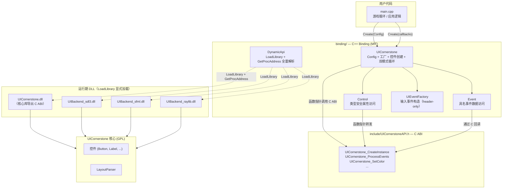
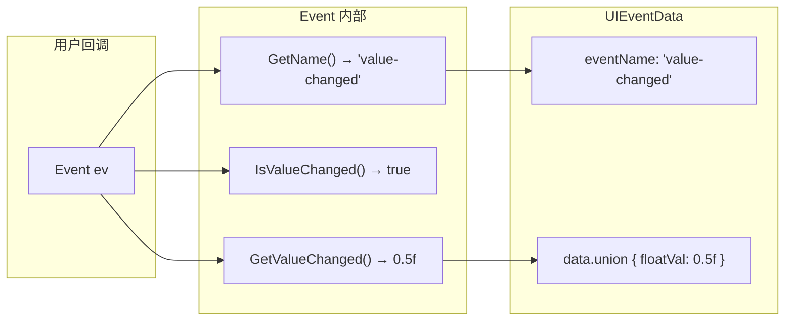
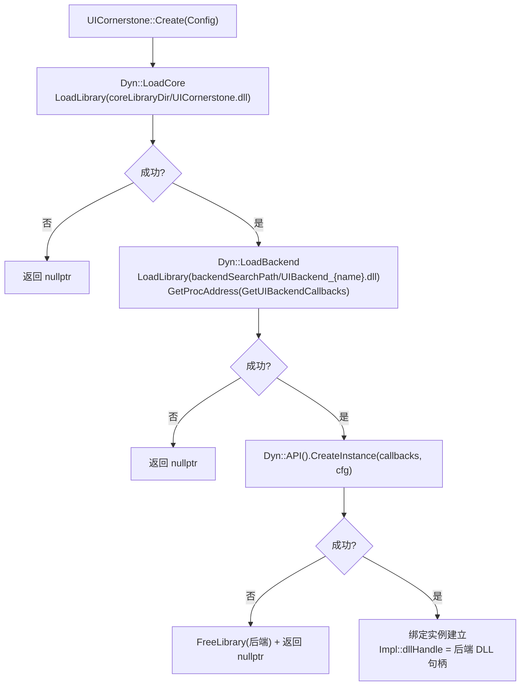
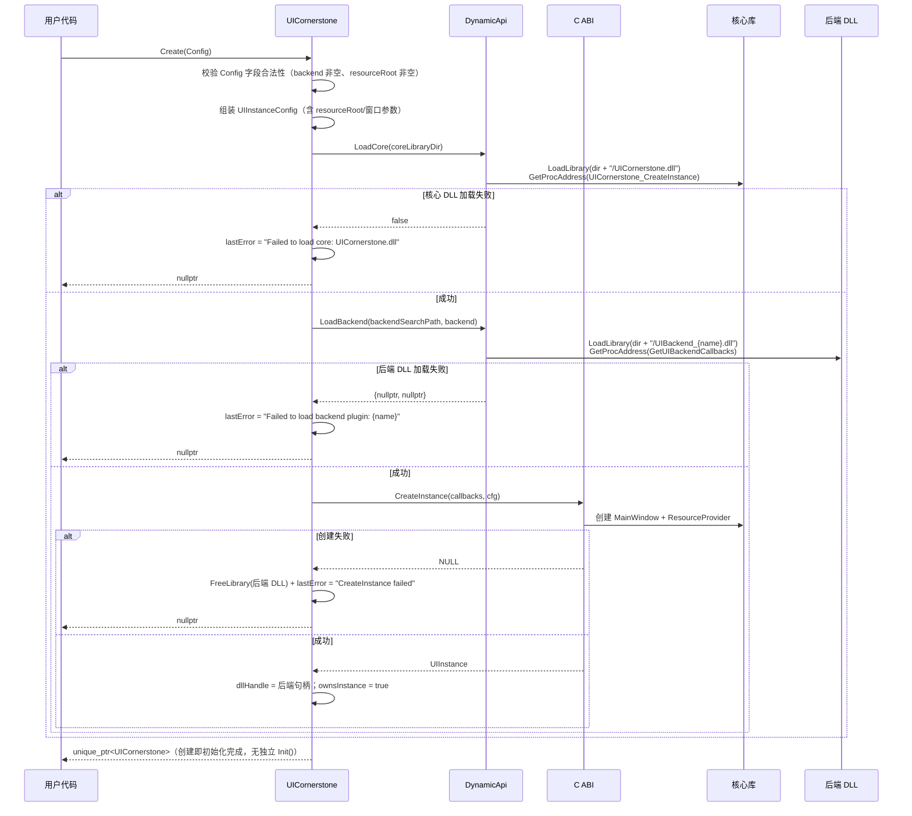
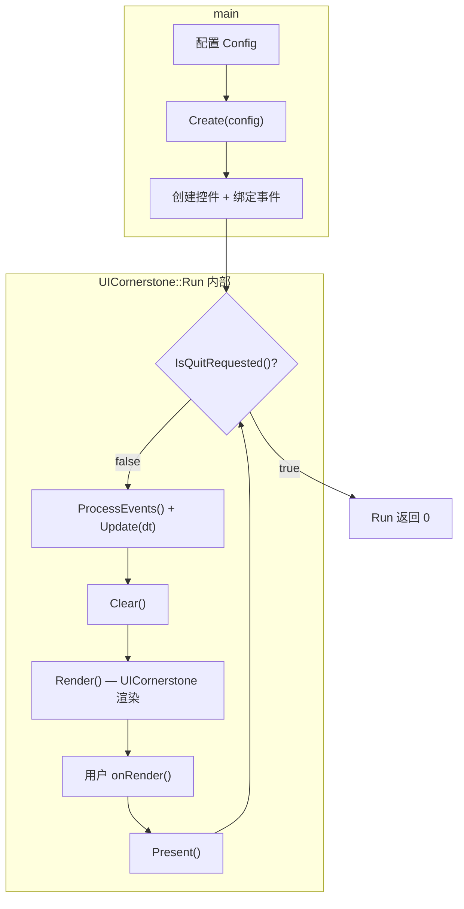
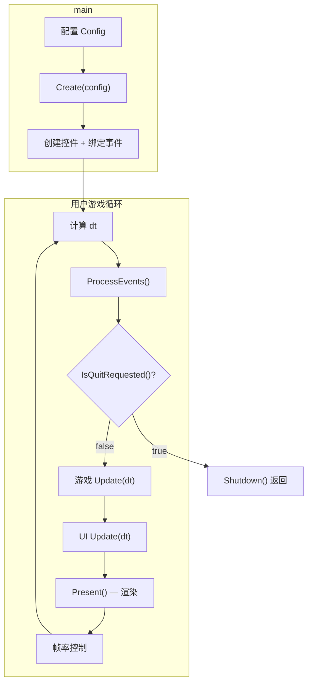

# CAPI C++ Binding 设计

> 对应 Phase 17 | 编制 2026-07-30 | 状态: **草案** | 修订 2026-08-01：对齐多实例改造后的 C ABI（UICornerstoneAPI.h 实测）| 修订 2026-08-04：按实施后代码（a0fcfa7/6064bd5）刷新——windowFlags 正式字段、菜单族/ScrollBar/TreeView/HandleControl 工厂已落地、Debug 辅助 4 件套、句柄归属校验、treeNode 访问器、UIInstanceConfig.debugLabel | 修订 2026-08-06：**P1-P13 全部实施并验证**（sdl3/sfml/raylib 三后端构建+冒烟通过）| 修订 2026-08-07：**P14 纯动态加载模式实施**——核心 DLL + 后端 DLL 全部经 LoadLibrary 显式加载（DynamicApi 层），不再链接任何导入库；Config 新增 coreLibraryDir；删除便捷方法族（SetText/SetVisible 等）；PropertyNames.h 构建时从核心复制（CopyPropertyNames.cmake）；示例改为平铺 cpp | 修订 2026-08-08：**P16 多窗口隔离**——`ProcessEvents()` 返回 bool（handled ≥ 1，多窗口事件泵 §5.6.1）；Config.resourceRoot 默认空串（核心回退 exe 目录/assets）；新增 §7.4 sample_cpp_multiinstance | 修订 2026-08-12：**P18 缩放测试三件套 + 样例统一 auto=<秒>**——新增 §7.5 sample_scale、CreateAnimatedButton 工厂（§5.15/工厂映射表）；五个样例废弃 UICORN_AUTO 环境变量、统一 `auto=<秒>` 命令行（共享 `binding/samples/auto_args.h`，惰性计时）

## 目录

1. [动机](#1-动机)
2. [设计目标](#2-设计目标)
3. [方案分析](#3-方案分析)
   - [3.1 后端选择](#31-后端选择)
   - [3.2 资源路径](#32-资源路径)
   - [3.3 循环嵌入](#33-循环嵌入)
   - [3.4 目录放置与许可证](#34-目录放置与许可证)
4. [整体架构](#4-整体架构)
5. [详细设计](#5-详细设计)
   - [5.1 UICornerstone 主类](#51-uicornerstone-主类)
   - [5.2 Control 代理类](#52-control-代理类)
   - [5.3 事件系统](#53-事件系统)
    - [5.4 资源路径管理](#54-资源路径管理)
    - [5.5 后端管理](#55-后端管理)
    - [5.6 架构约束分析](#56-架构约束分析)
    - [5.7 Control 生命周期管理](#57-control-生命周期管理)
    - [5.8 RegisterAction 实例化重构](#58-registeraction-实例化重构)
    - [5.9 Impl 结构总览](#59-impl-结构总览)
    - [5.10 Create(Config) 全链路（含错误处理）](#510-createconfig-全链路含错误处理)
    - [5.11 Hosted Run 内部实现](#511-hosted-run-内部实现)
    - [5.12 Config 校验规则](#512-config-校验规则)
    - [5.13 CMake 构建集成](#513-cmake-构建集成)
    - [5.14 UIEvent 输入事件构造辅助](#514-uievent-输入事件构造辅助类型安全)
    - [5.15 DynamicApi 纯动态加载层](#515-dynamicapi-纯动态加载层)
6. [文件布局与许可证](#6-文件布局与许可证)
7. [示例程序设计](#7-示例程序设计)
   - [7.1 sample_cpp_hosted](#71-sample_cpp_hosted--在-uicornerstone-循环中嵌入游戏逻辑)
   - [7.2 sample_cpp_embed](#72-sample_cpp_embed--在用户游戏循环中嵌入-uicornerstone)
   - [7.3 sample_cpp_multiview](#73-sample_cpp_multiview--多视口一个窗口两个-bench)
   - [7.4 sample_cpp_multiinstance](#74-sample_cpp_multiinstance--多窗口两独立实例双向通信)
8. [实施计划](#8-实施计划)
9. [与现有 C ABI 的关系](#9-与现有-c-abi-的关系)

---

## 1. 动机

现有 C API（`UICornerstoneAPI.h`）提供了一组纯 C 接口，可供 C、C#、Python 等语言调用。但对于 C++ 开发者，直接使用 C API 存在以下不足：

| 问题 | 表现 |
|------|------|
| **句柄模式** | `UIControlHandle` 是 `void*`，无类型安全，无 IDE 补全 |
| **字符串属性名** | `SetColor(ctl, "selected", ...)` — 拼错只在运行时暴露 |
| **回调原始** | C 函数指针 + `void* userData`，无 lambda/`std::function` 支持 |
| **生命周期手动** | 手动管理句柄生命周期，无 RAII |
| **零散全局函数** | 所有函数在全局命名空间，无封装，无上下文隔离 |

C++ binding 旨在消除这些摩擦，同时**不破坏**现有 C ABI 的兼容性，并允许用户自由修改 binding 源码。

## 2. 设计目标

1. **零开销抽象** — Binding 层为 inline 转发，不引入额外虚拟化或分配
2. **类型安全** — 结构体属性、枚举、回调均用 C++ 类型表达
3. **可配置后端** — 运行时选择后端，不依赖编译宏
4. **可配置资源** — 用户设定字体、图片、布局、DLL 的搜索路径
5. **双模式循环** — 支持"嵌入用户循环"和"托管用户逻辑"两种集成方式
6. **向后兼容** — Binding 完全基于现有 C ABI `extern "C"` 函数，不改变 C 接口
7. **独立许可证** — Binding 源码放置于独立目录，采用宽松许可证（如 MIT）

## 3. 方案分析

### 3.1 后端选择

**问题**：当前后端在编译时通过 `-DUICORNERSTONE_BACKEND=SDL3|SFML|RAYLIB` 选择。每个后端依赖不同的第三方 SDK，无法同时链接到同一二进制中。能否在运行时选择后端？

**选项对比**：

| 方案 | 运行时切换 | 额外依赖 | 复杂度 | 可行性 |
|------|-----------|---------|--------|--------|
| A. 静态编译多个后端 | ❌ | SDK 符号冲突 | 高 | 不可行 |
| B. 插件 DLL 加载 | ✅ | 需编译后端 DLL | 中 | ✅ 可行 |
| C. 调用方提供回调查表 | ✅ | 无 | 低 | ✅ 可行 |
| D. 条件编译 + 全链接 | ❌ | 链接器冲突 | 高 | 不可行 |

**决策**：C++ Binding 采用**纯动态加载（LoadLibrary）**模式（P14，2026-08-07），核心 DLL 与后端 DLL 均由 Binding 显式加载，不链接任何导入库：

- **核心 DLL（方案 B'）**：Binding 自 `LoadLibrary("UICornerstone.dll")`（目录可经 `Config::coreLibraryDir` 指定），经 `GetProcAddress` 全量解析 C ABI 导出函数指针（`DynamicApi` 层，见 §5.15）。**不再调用 `UICornerstone_CreateInstanceFromPlugin`**——它属于核心库 DLL 内部插件加载路径，Binding 侧不使用。
- **后端 DLL（方案 C 变体）**：Binding 自 `LoadLibrary("UIBackend_<name>.dll")`（目录可经 `Config::backendSearchPath` 指定）→ `GetProcAddress("GetUIBackendCallbacks")` → 以回调查表模式调用 `UICornerstone_CreateInstance(callbacks, cfg)`。
- **方案 C（纯回调查表）**：用户自行构造 `UIBackendCallbacks`，经 `Create(callbacks, config)` 传入。核心函数仍动态加载。

两种方式可共存于同一进程（不同实例可各自选择后端）。纯动态加载适用于快速集成（无需 SDK、无需导入库、可自定义 DLL 路径、支持插件热加载）。

### 3.2 资源路径

**问题**：`ConstDef::pathPrefix` 硬编码为 `Platform::GetBasePath() + "assets"`，`fontFiles` 映射表中的路径（如 `"fonts/Asul-Bold.ttf"`）相对此根目录。用户无法自定义资源存放位置。

**选项对比**：

| 方案 | 配置粒度 | 运行时修改 | 与现有兼容 | 易理解 |
|------|---------|-----------|-----------|-------|
| A. 单一根路径（推荐） | 粗 | ✅ | ✅ | ✅ |
| B. 多分类子路径 | 中等 | ✅ | ✅ | ❌ 路径重复陷阱 |
| C. 完全自定义 ResourceProvider | 细 | ❌（编译时） | ✅ | ❌ |
| D. 环境变量 | 粗 | ✅ | ❌ 不可控 | ✅ |

**决策**：采用方案 A（单一根路径）。用户只需设置一个 `resourceRoot`，所有资源路径以此为基础解析。`fontFiles` 表中的相对路径保持不变。

**传递链路（多实例改造后）**：资源根路径经 `UIInstanceConfig.resourceRoot` 字段直接传入核心库（UICornerstoneAPI.h:40；**NULL 或空串 → 核心库默认路径** `ConstDef::pathPrefix`（exe 目录/assets））——核心库 `MainWindow` 创建 `ResourceProvider` 时按 `!resourceRoot.empty() ? resourceRoot : pathPrefix` 选择（MainWindow.cpp:12-13）。**无需新增 `UICornerstone_SetResourceRoot` C ABI 函数**（原方案作废）。Binding 侧 `SetResourceRoot`/`GetResourceRoot`/`ResolveResource` 只负责"用户可见的路径拼接 + 记录根路径"（§5.4），路径解析语义：

用户代码：

```cpp
auto config = UICornerstone::Config{}
    .WithResourceRoot("C:/my_game_data");
// fontFiles 中的 "fonts/A.ttf" 解析为 "C:/my_game_data/fonts/A.ttf"
// 布局文件 "layouts/main.json" 解析为 "C:/my_game_data/layouts/main.json"
```

### 3.3 循环嵌入

**问题**：用户既可能希望将 UICornerstone 嵌入自己现有的游戏循环（Embedded），也可能希望让 UICornerstone 托管循环、自己只提供逻辑回调（Hosted）。

**选项对比**：

| 方案 | 循环所属 | 用户代码量 | 控制粒度 | 与 C ABI 关系 |
|------|---------|-----------|---------|--------------|
| A. 仅 Hosted（Run） | UICornerstone | ~5 行 | 低 | 完全封装 |
| B. 仅 Embedded（Tick） | 用户 | ~15 行 | 高 | 近 C ABI |
| C. 双模式（推荐） | 均可 | ~5-15 行 | 可调 | 同 C ABI |

**决策**：采用方案 C，双模式共存。Hosted 模式在内部调用 Embedded 模式的 tick API，两者共享同一实现核心。

### 3.4 目录放置与许可证

**问题**：C++ Binding 的 License 应与核心库不同。核心库是 GPL v3.0，Binding 源码需要更宽松的许可证以允许用户自由修改和集成。

**选项对比**：

| 方案 | 目录 | 许可证 | 与核心关系 |
|------|------|--------|-----------|
| A. 放在 `include/` 和 `src/` 内 | `include/cpp/` + `src/cpp/` | 与核心相同（GPL） | 紧密耦合 |
| B. 放在 `binding/` 下（推荐） | `binding/` | MIT | 独立，仅依赖 C ABI |
| C. 放在独立仓库 | 外部仓库 | MIT | 完全解耦 |

**决策**：采用方案 B。在项目根目录创建 `binding/` 目录，包含 C++ Binding 的全部源码、CMakeLists 和单独的 LICENSE 文件。Binding 仅依赖 `include/UICornerstoneAPI.h` 中定义的 C ABI 接口，不依赖核心库的内部头文件。

## 4. 整体架构



**层间依赖**：

```
用户代码 → binding/ (MIT) → include/UICornerstoneAPI.h (C ABI，仅类型声明) → UICornerstone.dll / UIBackend_*.dll (LoadLibrary)
```

Binding 层仅依赖 C ABI 头文件中声明的 `extern "C"` 函数签名与 POD 结构体，**不链接任何导入库**（`UICornerstone_dll.lib` / `UICornerstone.lib`），全部 C ABI 调用经 `DynamicApi` 函数指针运行时解析。不 `#include` 任何核心库的内部头文件（`ControlBase.h`、`Bench.h` 等）。

## 5. 详细设计

### 5.1 UICornerstone 主类

```cpp
// binding/include/UICornerstone.h

#include <string>
#include <memory>
#include <functional>
#include "UICornerstoneAPI.h"

class Control;
class Event;

namespace UICornerstone {

class UICornerstone {
public:
    struct Config {
        // 后端选择
        std::string backend = "sdl3";            // "sdl3" | "sfml" | "raylib"
        std::string backendSearchPath;            // 后端 DLL 搜索目录（空=exe 同目录/系统搜索）
        std::string coreLibraryDir;               // 核心 DLL 所在目录（空=exe 同目录/系统搜索）

        // 资源根路径
        // 所有资源相对此路径解析：字体 → {root}/fonts/A.ttf、布局 → {root}/layouts/demo.json
        // 默认空串 → 核心库使用 exe 目录/assets（任意 cwd 可运行；"./assets" 相对 cwd 会导致
        // 工作目录不在项目根时找不到字体）
        std::string resourceRoot   = "";

        // 窗口参数
        std::string windowTitle    = "UICornerstone";
        int windowWidth  = 1024;
        int windowHeight = 768;
        // windowFlags：跨后端统一窗口标志（UIWindowFlags，值对齐 SDL_WINDOW_*），
        // 直接映射 UIInstanceConfig.windowFlags（UICornerstoneAPI.h:44）
        uint32_t windowFlags = 0;

        Config& WithBackend(const std::string& name)          { backend = name; return *this; }
        Config& WithBackendSearchPath(const std::string& p)   { backendSearchPath = p; return *this; }
        Config& WithCoreLibraryDir(const std::string& p)      { coreLibraryDir = p; return *this; }
        Config& WithResourceRoot(const std::string& r)        { resourceRoot = r; return *this; }
        Config& WithWindow(const std::string& t, int w, int h)
            { windowTitle = t; windowWidth = w; windowHeight = h; return *this; }
        Config& WithWindowFlags(uint32_t f)                   { windowFlags = f; return *this; }
    };

    // 通过 Config 创建（纯动态加载：LoadCore → LoadBackend → CreateInstance(callbacks)）
    static std::unique_ptr<UICornerstone> Create(const Config& config);

    // 通过回调查表创建（核心函数仍动态加载，不管理后端生命周期）
    static std::unique_ptr<UICornerstone> Create(const UIBackendCallbacks* callbacks,
                                                 const Config& config = Config{});

    ~UICornerstone();
    UICornerstone(const UICornerstone&) = delete;
    UICornerstone& operator=(const UICornerstone&) = delete;

    // ── 实例句柄 ──
    UIInstance Handle() const;

    // ── Hosted 模式 ──
    using FrameCallback = std::function<void(double deltaTime)>;
    using RenderCallback = std::function<void()>;

    int Run(FrameCallback update, RenderCallback onRender = nullptr);

    // ── Embedded 模式（Create 即完成初始化，无需独立 Init()）──
    // 返回 true 表示本次调用处理了 ≥1 个事件（多窗口场景用返回值驱动所有实例直到队列空，见 §5.6.1）
    bool ProcessEvents();
    void Update(double deltaTime);
    void Render();
    void Clear();
    void Present();
    bool IsQuitRequested() const;
    void Shutdown();

    // ── 子视口（可选）──
    // 在实例窗口中创建子视口：共享后端，独立控制树/事件队列（C ABI: UICornerstone_CreateViewport）
    std::unique_ptr<UICornerstone> CreateViewport(float x, float y, float w, float h);

    // ── 资源路径（仅影响 Binding 侧路径拼接；核心库由 UIInstanceConfig.resourceRoot 固化）──
    void SetResourceRoot(const std::string& path);
    std::string GetResourceRoot() const;
    std::string ResolveResource(const std::string& relativePath) const;

    // ── 内存资源注册表（MemoryResourceProvider，懒创建 + 自动挂载）──
    // 拷贝注册：引擎内部复制 data，调用方可立即释放。需在 Create 之后调用。
    bool RegisterResource(const std::string& name, const void* data, size_t len);
    // 零拷贝注册：引擎不复制、仅引用 data（调用方须保持缓冲有效直至实例销毁；
    // 析构/覆盖时经 freeFn 回调释放，freeFn 空 → 默认 free）。
    bool AdoptResource(const std::string& name, void* data, size_t len,
                       std::function<void(void*)> freeFn = nullptr);

    // ── 布局 ──
    bool LoadLayout(const std::string& jsonContent);
    bool LoadLayoutFromFile(const std::string& filePath);
    Control FindControl(const std::string& id);

    // ── 控件工厂（编程式创建，不全依赖 JSON） ──
    Control CreateButton(const std::string& text, float x, float y, float w, float h);
    Control CreateLabel(const std::string& text, float fontSize, float x, float y, float w, float h);
    Control CreateCheckBox(const std::string& text, float x, float y, float w, float h);
    Control CreateEditBox(float x, float y, float w, float h);
    Control CreateProgressBar(float x, float y, float w, float h);
    Control CreateSlider(float x, float y, float w, float h, float min, float max, float value);
    Control CreatePanel(float x, float y, float w, float h);
    Control CreateTextArea(float x, float y, float w, float h);
    Control CreateWinFrame(const std::string& title, float x, float y, float w, float h);
    Control CreateComboBox(float x, float y, float w, float h);
    Control CreateColorPicker(float x, float y, float w, float h, const std::string& color);
    Control CreateNumericUpDown(float x, float y, float w, float h);
    Control CreateSplitter(float x, float y, float w, float h, int orientation);
    Control CreateImageButton(const std::string& normal, const std::string& hover,
                              const std::string& pressed, float x, float y, float w, float h);
    Control CreateImage(const std::string& image, float x, float y, float w, float h);
    Control CreateAnimation(const std::string& jsoncPath, float x, float y, float w, float h);
    Control CreateAnimatedButton(const std::string& jsoncPath, float x, float y, float w, float h,
                                 float xScale = 1.0f, float yScale = 1.0f);  // xScale/yScale 作用于按钮，内嵌动画恒 1.0
    Control CreateDialog(const std::string& confirmText, const std::string& cancelText,
                         float x, float y, float w, float h);

    // ── 控件工厂（菜单族 / 滚动条 / 树 / 句柄） ──
    // 组装顺序（对齐 C ABI 注释，UICornerstoneAPI.h）：
    //   panel = CreateMenuPanel(); item = CreateMenuItem("Open", 0);
    //   MenuPanelAddItem(panel, item); MenuItemSetSubMenu(item, subPanel);
    //   bar = CreateMenuBar(...); MenuBarAddMenu(bar, "File", panel);
    // type: 0=Normal, 1=Separator, 2=SubMenu
    Control CreateMenuBar(float x, float y, float w, float h);
    Control CreateMenuPanel();
    Control CreateMenuItem(const std::string& caption, int type);
    void    MenuBarAddMenu(Control& bar, const std::string& caption, Control& panel);
    void    MenuPanelAddItem(Control& panel, Control& item);
    void    MenuPanelAddSeparator(Control& panel);
    void    MenuItemSetSubMenu(Control& item, Control& panel);
    Control CreateScrollBar(float x, float y, float w, float h, int orientation);
    Control CreateTreeView(float x, float y, float w, float h);
    Control CreateHandleControl(Control target, float x, float y, float w, float h);

    // ── 视口 ──
    void SetViewport(float x, float y, float w, float h);
    UIRect GetViewport() const;

    // ── 事件注入（外部输入系统 → UICornerstone）──
    // UIEvent 为 type + data[128] 字节缓冲，用 UICornerstone::Input::* 构造辅助（§5.14）
    void PushEvent(const UIEvent& event);
    void PushMouseButton(int button, float x, float y, bool down);
    void PushMouseMove(float x, float y);
    void PushMouseWheel(float dx, float dy, float x, float y);
    void PushKey(int keyCode, uint16_t mod, bool down);
    void PushTextInput(const std::string& text);    // UI_TEXT_MAX=32 字节上限

    // ── JSON 布局动作注册 ──
    using ActionCallback = std::function<void(Control)>;
    void RegisterAction(const std::string& name, ActionCallback callback);

    // ── 后端配置（vsync 等，C ABI: UICornerstone_SetBackendConfig*）──
    bool SetBackendConfig(const char* key, const char* value);
    bool SetBackendConfigBool(const char* key, bool value);
    bool GetBackendConfigBool(const char* key, bool& out) const;

    // ── 后端能力（C ABI: UICornerstone_GetBackendCapabilities）──
    // 返回 UICORN_BACKEND_CAP_* 位组合（按位与），调用方据此决定行为。
    // 典型场景：多窗口渲染前查询 MULTI_WINDOW——单窗口架构后端（raylib）
    // 声明无该位，其非首个实例为 headless，渲染需跳过（防串扰到主实例窗口）
    uint32_t GetBackendCapabilities() const;

    // ── 错误查询 ──
    const std::string& GetLastError() const;

    // ── Debug 辅助 ──
    static int  DebugGetAliveCount();                    // Release 构建返回 0
    static UIInstance DebugGetAliveInstance(int index);  // Release 构建返回 NULL
    static UIInstance DebugGetActiveViewport(UIInstance instance);
    static bool DebugIsControlFocused(UIInstance instance, UIControlHandle control);

private:
    explicit UICornerstone(UIInstance instance, bool ownsInstance);
    Control MakeControl(UIControlHandle h);
    friend class ::Control;

    std::unique_ptr<Impl> m_impl;
};

} // namespace UICornerstone
```

### 5.2 Control 代理类

```cpp
// binding/include/Control.h

#include <string>
#include <memory>
#include <functional>
#include "UICornerstoneAPI.h"

class Event;

// 共享状态（§5.7.1）：句柄有效性追踪。Control 拷贝共享同一状态。
struct ControlState {
    UIInstance instance = nullptr;
    UIControlHandle handle = nullptr;
    void* ownerImpl = nullptr;      // UICornerstone::Impl*（回调 userData 注册表）
    bool alive = true;
};

class Control {
public:
    Control() = default;
    explicit Control(std::shared_ptr<ControlState> state);

    bool IsValid() const;
    UIControlHandle Handle() const { return m_state ? m_state->handle : nullptr; }

    // ── 属性设置（一一对应 C ABI：UICornerstone_Set*）──
    void SetColor(const char* prop, UIColor value);
    void SetStateColor(const char* prop, UIStateColor value);
    void SetBool(const char* prop, bool value);
    void SetInt(const char* prop, int value);
    void SetFloat(const char* prop, float value);
    void SetString(const char* prop, const std::string& value);
    void SetEnum(const char* prop, const std::string& value);
    void SetPtr(const char* prop, void* value);

    // ── 属性读取（一一对应 C ABI：UICornerstone_Get*）──
    UIColor      GetColor(const char* prop) const;
    UIStateColor GetStateColor(const char* prop) const;
    bool         GetBool(const char* prop) const;
    int          GetInt(const char* prop) const;
    float        GetFloat(const char* prop) const;
    std::string  GetString(const char* prop) const;
    std::string  GetEnum(const char* prop) const;
    void*        GetPtr(const char* prop) const;

    // ── 回调（类型安全 lambda 桥接）──
    using EventCallback = std::function<void(const Event&)>;
    void SetCallback(const char* event, EventCallback callback);

    // ── 控件操作（一一对应 C ABI：UICornerstone_*Control / SetRect 等）──
    void SetRect(float x, float y, float w, float h);
    UIRect GetRect() const;
    void AddChild(Control child);
    void Destroy();
    std::string GetId() const;

private:
    std::shared_ptr<ControlState> m_state;

    // C 回调 thunk（静态，经 userData 指向 shared_ptr<EventCallback>）
    static void CallbackThunk(UIControlHandle ctl, const UIEventData* event, void* userData);
};
```

> 注：`IsValid()` 基于 `m_state->alive`（§5.7.1/§5.7.2），`Handle()` 返回原始句柄（可能已失效）。`Control` 经 `ControlState::ownerImpl` 访问 `Impl`（SetCallback 的 userData 注册表），见 §5.7.3。**便捷方法族（SetText/GetText/SetVisible/IsVisible/SetEnabled/IsEnabled）已删除**（2026-08-07）：统一走 `SetString("text"/"visible"/"enabled")` 等通用属性接口，避免与 C ABI 属性系统产生第二套命名。

### 5.3 事件系统

`UIEventData` 是**基于事件名辨别的联合体**：`eventName` 字段标记了 `data` union 中哪个成员有效。裸 C 调用时需要手动判断：

```c
void myHandler(UIControlHandle ctl, const UIEventData* ev, void* user) {
    if (strcmp(ev->eventName, "value-changed") == 0) {
        float val = ev->data.floatVal;  // 手动知道该读 floatVal
    }
}
```

C++ Binding 通过 `Event` 类将这种"手工辨别"封装为**具名推导访问器**，按事件名提供对应的类型安全取值路径：

```cpp
// binding/include/Event.h

#include "UICornerstoneAPI.h"

class Event {
public:
    explicit Event(const UIEventData* raw);

    // 事件名鉴别（所有事件的共同信息）
    std::string GetName() const;

    // ── 按事件类型划分的具名访问器 ──
    // 编译期类型安全：方法名自述含义，调用方不再面对 union

    // "click"（Button/Label/MenuItem）：无数据负载，仅事件本身
    bool IsClick() const;

    // "value-changed"：floatVal（Slider/ProgressBar）
    bool IsValueChanged() const;
    float GetValueChanged() const;

    // "value-changed"（NumericUpDown）：doubleVal
    double GetValueChangedDouble() const;

    // "text-changed"：strVal（EditBox/TextArea）
    bool IsTextChanged() const;
    std::string GetTextChanged() const;

    // "selection-changed"：selection { idx, val }（ComboBox）
    bool IsSelectionChanged() const;
    int  GetSelectedIndex() const;
    std::string GetSelectedValue() const;

    // "check-changed"：intVal（CheckBox 新 CheckState）
    bool IsCheckChanged() const;
    int  GetCheckState() const;

    // "color-changed"：颜色暂不通过 C ABI 回调传回（ColorPicker 用 GetColor 轮询）——
    // 此访问器保留但恒 false，文档注明语义
    bool IsColorChanged() const;
    UIColor GetChangedColor() const;

    // "position-changed"：floatVal（ScrollBar）
    bool IsPositionChanged() const;
    float GetPositionChanged() const;

    // "moved"：floatVal（Splitter）
    bool IsMoved() const;
    float GetMovedPosition() const;

    // "confirm" / "cancel" / "close"：无数据负载
    //   - "close"（Popup）：intVal = DialogResult 映射
    bool IsConfirm() const;
    bool IsCancel() const;
    bool IsClose() const;
    int  GetCloseResult() const;

    // "enter"（EditBox 回车）：无数据负载
    bool IsEnter() const;

    // "select" / "expand" / "collapse"：treeNode { id, userData }（UIEventData 联合体）
    bool IsSelect() const;
    bool IsExpand() const;
    bool IsCollapse() const;
    std::string GetNodeId() const;   // treeNode.id
    void* GetNodeUserData() const;   // treeNode.userData

    // ── 通用原始访问（必要时回退） ──
    const char* GetNameRaw() const { return m_raw ? m_raw->eventName : nullptr; }
    int     GetIntVal() const;
    float   GetFloatVal() const;
    double  GetDoubleVal() const;
    const char* GetStrVal() const;
    void*   GetPtrVal() const;

    // ── 原始数据（必要时回退） ──
    const UIEventData* Raw() const { return m_raw; }

private:
    const UIEventData* m_raw;
};
```

> 事件名/属性名字符串常量由 `PropertyNames.h` 提供（`kEventClick`/`kEventValueChanged` 等）。该头为核心库统一数据源（`include/PropertyNames.h`），binding 构建时经 `cmake/CopyPropertyNames.cmake` 复制到构建目录 `include/` 后引用——字符串值与核心库事件字典（CABI_Property_Design.md §6.9）严格一致，且随核心库常量统一更新。



**典型用法**（在 `Control::SetCallback` 的 lambda 中）：

```cpp
btn.SetCallback("value-changed", [](const Event& ev) {
    if (ev.IsValueChanged()) {
        float val = ev.GetValueChanged();
        // 直接读，不接触 union
    }
});
```

每个具名访问器内部实现类似：

```cpp
bool Event::IsValueChanged() const {
    return strcmp(m_raw->eventName, "value-changed") == 0;
}

float Event::GetValueChanged() const {
    // 可在 Debug 断言事件类型，快速暴露误用
    assert(IsValueChanged());
    return m_raw->data.floatVal;
}
```

### 5.4 资源路径管理

**解析规则**：Binding 对路径做简单拼接 `resourceRoot + "/" + userPath`，**不自动插入任何子目录前缀**。目录结构完全由用户在参数中控制。

```
resourceRoot = "my_assets"    // 示例值；Config 默认空串 → 核心库回退 exe 目录/assets

传参                      → 实际路径
─────────────────────────────────────────────
"btn.png"                 → my_assets/btn.png
"images/btn.png"          → my_assets/images/btn.png
"ui/icons/btn.png"        → my_assets/ui/icons/btn.png
"layouts/demo.json"       → my_assets/layouts/demo.json
```

**API 形态**：无独立 ResourceManager 类——资源路径操作内联为 `UICornerstone` 的 3 个方法：

```cpp
void SetResourceRoot(const std::string& path);              // 修改 Binding 侧解析根
std::string GetResourceRoot() const;                        // 查询当前根
std::string ResolveResource(const std::string& relative) const;  // root + "/" + relative
```

> 核心库侧的 ResourceProvider 由 `UIInstanceConfig.resourceRoot` 驱动（Create 时固化）；Binding 的 `SetResourceRoot` 仅影响 Binding 侧路径拼接查询，不跨库传递（Create 之后再改 root 不影响核心库已建 Provider）。

**三种资源类型的路径出处**：

| 资源类型 | 路径来源 | 示例传参 |
|---------|---------|---------|
| 字体 | `ConstDef::fontFiles` 表已有 `"fonts/"` 前缀 | `"fonts/A.ttf"`（表自带） |
| 图片 | `CreateImageButton("normal", "hover", ...)` 参数 | `"btn.png"` 或 `"ui/btn.png"` |
| 布局 | `LoadLayoutFromFile(path)` 参数 | `"demo.json"` 或 `"layouts/demo.json"` |

用户统一改 `resourceRoot` 即可重定向所有资源。如需把图片移到别处而字体不动，直接在调用 `CreateImageButton` 时传不同的相对路径即可，无需额外配置项。

#### resourceRoot 生效链路

资源根路径经 `UIInstanceConfig.resourceRoot` 在 `CreateInstance` 时传入核心库：

```
Config.resourceRoot = "./my_assets"
        │
        ▼
UICornerstone::Create(Config)
        │
        ├── Dyn::LoadCore("UICornerstone.dll")          ← 纯动态加载（§5.15）
        ├── Dyn::LoadBackend(path, backend)             ← UIBackend_<name>.dll
        └── Dyn::API().CreateInstance(callbacks, &cfg)  ← cfg.resourceRoot = "./my_assets"

核心库内部:
    MainWindow 构造函数:
        m_resourceProvider = ResourceProvider::createFilesystem(resourceRoot)
```

```cpp
// UICornerstone::Create 中的关键步骤（节选）
std::unique_ptr<UICornerstone> UICornerstone::Create(const Config& config) {
    if (!Dyn::LoadCore(coreDllPath.c_str())) return nullptr;      // 核心 DLL
    auto [callbacks, h] = Dyn::LoadBackend(config.backendSearchPath, config.backend);
    if (!callbacks) return nullptr;                               // 后端 DLL

    UIInstanceConfig cfg = UI_INSTANCE_CONFIG_DEFAULT;            // structSize 由宏填好
    cfg.resourceRoot = config.resourceRoot.c_str();
    cfg.windowTitle  = config.windowTitle.c_str();
    cfg.windowWidth  = config.windowWidth;
    cfg.windowHeight = config.windowHeight;
    cfg.windowFlags  = config.windowFlags;

    UIInstance instance = Dyn::API().CreateInstance(callbacks, &cfg);
    if (!instance) { FreeLibrary(h); return nullptr; }
    // ... 构造 UICornerstone 对象，持有 h 为后端 DLL 句柄
}
```

> 注：`UI_INSTANCE_CONFIG_DEFAULT` 宏（UICornerstoneAPI.h:48）自动填充 `structSize`——Binding 必须使用该宏或显式填 `sizeof(UIInstanceConfig)`（版本兼容检查）。

#### 5.4.1 内存资源注册（MemoryResourceProvider）

`provider:` 前缀将文件引用分流到内存注册表，工厂/布局/属性三入口均可使用（核心设计见 `design/ResourceProvider_Design.md`）：

```cpp
// 拷贝注册：引擎内部复制 data，调用方可立即释放。需在 Create 之后调用。
bool RegisterResource(const std::string& name, const void* data, size_t len);
// 零拷贝注册：引擎不复制、仅引用 data；析构/覆盖时经 freeFn 回调释放（空 → free）。
bool AdoptResource(const std::string& name, void* data, size_t len,
                   std::function<void(void*)> freeFn = nullptr);
```

**内部实现**（对齐 C ABI）：

1. **懒创建 + 自动挂载**：首次调用时经 `createMemoryResourceProvider` 创建 provider，立即 `setResourceProvider("resourceProviders", ...)` 挂到实例——用户无需手动挂载。
2. **adopt 契约**：`memoryProviderAdopt` 零拷贝引用调用方 buffer，调用方须保持有效直至销毁/覆盖；覆盖或销毁时引擎回调 `freeFn`（空 → 默认 `free`）。
3. **前缀路由**：`provider:name` 由核心库在字符串层判定（不得经 `fs::path::is_relative`——MSVC 会把 `provider:` 当作相对路径拼 basePath 污染前缀），未命中注册名时回退文件系统查找，最终失败返回空资源。
4. **Binding trampoline**：`std::function` 不能直接作 C 函数指针，`AdoptResource` 的 freeFn 经进程级全局表 `g_adoptFreeFns`（binding/src/UICornerstone.cpp，rawPtr 唯一，进程内单线程用例）转发到 `memoryProviderAdopt` 的 C freeFn 回调；注册失败时回滚擦除。

**Label 字体三形态互斥**（`font` 枚举 < `font-file` 任意路径 < `font-resource` 内存 ID）：

```cpp
label.SetString(PropertyNames::kFontFile, "fonts/maple.ttf");            // 文件（相对 resourceRoot）
label.SetString(PropertyNames::kFontFile, "provider:maple-ttf");         // 内存（provider: 前缀）
label.SetString(PropertyNames::kFontResource, "maple-ttf");              // 内存（直接 ID）
```

> `GetString` 对这两个属性只写不读：Set 后 Get 返回空串（属性系统约定，见 CABI_Property_Design.md 变更注记）。

### 5.5 后端管理（纯动态加载）



**加载顺序与目录语义**（与 `Config` 两字段一一对应）：

| Config 字段 | 为空时 | 非空时 |
|------------|--------|--------|
| `coreLibraryDir` | `LoadLibrary("UICornerstone.dll")`（exe 同目录/系统搜索） | `LoadLibrary(dir + "/UICornerstone.dll")` |
| `backendSearchPath` | `LoadLibrary("UIBackend_<backend>.dll")`（exe 同目录/系统搜索） | `LoadLibrary(dir + "/UIBackend_<backend>.dll")` |

**生命周期**：
- 核心 DLL 句柄由 `DynamicApi` 进程级持有（静态单例，重复 `Create` 幂等；不随实例卸载——与"静态链接"行为等价）。
- 后端 DLL 句柄由 `Impl::dllHandle` 持有，`~UICornerstone()` 时先 `DestroyInstance` 再 `FreeLibrary`。
- 实例级错误路径（LoadBackend 失败 / CreateInstance 失败）均及时 `FreeLibrary` 后端句柄，不泄漏。

> 原设计"核心库内建插件加载（CreateInstanceFromPlugin）+ 自定义路径 BackendResolver"（2026-08-06 及以前）已废弃，Binding 不再调用 `UICornerstone_CreateInstanceFromPlugin`。

### 5.6 架构约束分析

#### 5.6.1 多实例支持（多实例改造完成后已解除限制）

**现状（2026-08-01 实测，核心库侧能力）**：核心库 C ABI 已完成多实例改造并落地实施（提交 a0fcfa7/6064bd5）——`UICornerstone_CreateInstance(callbacks, config)` 一次完成 alloc+init（UICornerstoneAPI.h:178），返回 `UIInstance` 句柄（`struct UIContext*`，:34）；`DestroyInstance` 级联销毁子视口、owner 才 shutdown BackendManager（:183）；`CreateInstanceFromPlugin` 支持插件 DLL + 静态符号回退（:187，src/UICornerstoneAPI.cpp:377-414，**Binding 不使用**，见 §5.5）；`CreateViewport(parent, rect)` 支持子视口（:193）。原"全局单实例（g_initialized）"限制**已不存在**。附加能力：`_DEBUG` 下句柄归属校验（跨实例误用断言，src/UICornerstoneAPI.cpp:79-116）、实例活跃注册表（析构守卫，UIContext.h:93-101）、Debug 辅助 4 件套（:220-226）。

**多窗口事件泵（实施修订 2026-08-08）**：每个窗口实例的 `ProcessEvents()` 只消费**自己窗口**的事件（sdl3 后端按 `windowID` 隔离，`SDL_PumpEvents` + `SDL_PeepEvents` peek + headOne 同 type 检查 + GETEVENT + gotEvent 守卫）。多窗口帧循环须用返回值驱动所有实例**直到全局队列空**：

```cpp
int processedCount;
do {
    processedCount = 0;
    if (winA->ProcessEvents()) processedCount = 1;   // 每实例只消费自己窗口事件
    if (winB->ProcessEvents()) processedCount = 1;
} while (processedCount > 0);
winA->Update(dt);  winB->Update(dt);
winA->Render();    winB->Render();
winA->Present();   winB->Present();
```

（`ProcessEvents()` 返回 bool；忽略返回值时行为与单实例一致，旧代码完全兼容。参考样例：`binding/samples/sample_cpp_multiinstance.cpp`，AUTO 模式双向注入验证通过。）

**Binding 设计**：

```cpp
// binding/src/Impl.h — Impl 结构（多实例版）

struct Impl {
    UICornerstone::Config config;
    UIInstance instance = nullptr;      // C ABI 实例句柄（唯一真源）
    bool ownsInstance = false;          // 由 Binding 创建（析构时 DestroyInstance）
    bool initialized = false;
    std::string lastError;

    // 后端插件 DLL 句柄（纯动态加载模式；实例析构时 FreeLibrary）
    // 核心 DLL 由 DynamicApi 进程级持有（不随实例卸载）
    void* dllHandle = nullptr;

    // 资源根（Binding 侧路径解析；核心库侧由 UIInstanceConfig.resourceRoot 固化）
    std::string resourceRoot;

    // Action 注册表（实例私有）
    std::unordered_map<std::string, std::shared_ptr<UICornerstone::ActionCallback>> actions;

    // Control 生命周期追踪（weak 不保活）
    std::unordered_map<UIControlHandle, std::weak_ptr<ControlState>> liveControls;

    // 回调 userData 注册表（Impl 级持有，与 Control 生命周期解耦——见 §5.7.3）
    std::unordered_map<UIControlHandle, std::vector<std::shared_ptr<void>>> callbackUserData;
};
```

> 多实例语义：每个 `UICornerstone` 对象 ↔ 一个 `UIInstance`（窗口或视口），可多个并存；`CreateViewport` 创建共享后端的子视口实例。实例生命周期由 `UICornerstone` 对象管理（析构时 `DestroyInstance`）。实例的实际创建在 `Create` 静态工厂内完成（LoadCore → LoadBackend → CreateInstance，见 §5.5/§5.10），失败路径返回 nullptr。

#### 5.6.2 线程安全

**C ABI 假设**：所有函数必须在同一线程调用，不接受跨线程并发。核心库内部无锁。

**Binding 约束**：

```cpp
// UICornerstone 类注释
//
// 线程安全：
//   本类的所有方法（ProcessEvents / Update / Render / Present / Shutdown）
//   必须在同一线程调用。不得跨线程并发访问。
//   Create() 和 ~UICornerstone() 必须在同一线程调用。
```

**例外**：`PushEvent` 可以（在有限场景下）从其他线程调用，但需外部同步。当前版本不保证，记录为未来优化。

#### 5.6.3 错误处理策略

C ABI 用 `int` 返回值（1=成功，0=失败）报告错误。Binding 不抛出异常，延续同一风格，并通过 `lastError` 提供可查的错误描述：

```cpp
struct UICornerstone::Impl {
    // ...
    std::string lastError;
};

const std::string& UICornerstone::GetLastError() const {
    return m_impl->lastError;
}
```

**Create 工厂实现（对齐当前代码）**——创建失败返回 `nullptr`，不抛出：

```cpp
// binding/src/UICornerstone.cpp
std::unique_ptr<UICornerstone> UICornerstone::Create(const Config& config) {
    if (config.backend.empty()) return nullptr;

    // 核心 DLL：coreLibraryDir 非空 → 目录 + "UICornerstone.dll"；空 → 系统搜索（exe 同目录）
    std::string coreDll = config.coreLibraryDir.empty()
        ? std::string("UICornerstone.dll")
        : (config.coreLibraryDir + "/UICornerstone.dll");
    if (!Dyn::LoadCore(coreDll.c_str())) return nullptr;

    UIInstanceConfig cfg = UI_INSTANCE_CONFIG_DEFAULT;
    cfg.resourceRoot  = config.resourceRoot.c_str();
    cfg.windowTitle   = config.windowTitle.c_str();
    cfg.windowWidth   = config.windowWidth;
    cfg.windowHeight  = config.windowHeight;
    cfg.windowFlags   = config.windowFlags;

    // 后端插件 DLL：backendSearchPath 非空 → 指定路径；否则系统搜索（exe 同目录）
    auto [callbacks, h] = Dyn::LoadBackend(config.backendSearchPath, config.backend);
    if (!callbacks) return nullptr;

    UIInstance instance = Dyn::API().fnCreateInstance(callbacks, &cfg);
    if (!instance) {
#ifdef _WIN32
        FreeLibrary(h);      // 创建失败：立即释放后端 DLL，不泄漏
#endif
        return nullptr;
    }

    auto ui = std::unique_ptr<UICornerstone>(new UICornerstone(instance, true));
    ui->m_impl->config = config;
    ui->m_impl->resourceRoot = config.resourceRoot;
    ui->m_impl->dllHandle = h;   // 后端 DLL 句柄（~UICornerstone 时 FreeLibrary）
    return ui;
}
```

| 方法 | 错误指示 | 详情查询 |
|------|---------|---------|
| `Create(Config)` | 返回 `nullptr`（核心/后端 DLL 加载失败、CreateInstance 失败） | `GetLastError()`（DLL 加载失败时 lastError 同步设置；若 LoadCore/LoadBackend 失败） |
| `Create(callbacks)` | 返回 `nullptr`（callbacks 非法） | 同上 |
| `ProcessEvents()` | 返回 `bool`：是否处理了 ≥1 个事件；不指示窗口关闭 | 退出判断用 `IsQuitRequested()`（独立查询，:215）；多实例时用返回值驱动"所有实例直到队列空"（§5.6.1） |
| `Run()` | 返回 1（内部循环异常退出） | 正常退出返回 0；创建失败在 `Create` 已返回 nullptr |
| `CreateXxx / FindControl` | 返回 `Control()`（空句柄） | `ctl.IsValid()` 判断 |
| `Control::SetXxx` | 静默失败 | 无（C ABI 返回 0 时忽略） |
| `PushEvent / RegisterAction` | 无返回值 | 无 |

### 5.7 Control 生命周期管理

#### 5.7.1 句柄有效性

C ABI 返回的 `UIControlHandle` 是一个裸指针 `void*`（实际是 `Control*`）。如果核心库销毁了控件（例如 Dialog `close()` 自动销毁），Binding 的 `Control` 对象变成悬挂句柄。

**防护设计**：引入 `ControlState` 共享状态对象，通过 `shared_ptr/weak_ptr` 追踪句柄有效性。

```cpp
// binding/include/Control.h（ControlState 定义，内部）

struct ControlState {
    UIInstance instance = nullptr;
    UIControlHandle handle = nullptr;
    void* ownerImpl = nullptr;      // UICornerstone::Impl*（回调 userData 注册表）
    bool alive = true;
};
```

> `ControlState` 不再存放 `callbackUserData`（原设计缺陷，见 §5.7.3）——`std::function` 的生命周期由 `Impl` 统一管理，避免"Control 对象析构但 C 侧控件仍存活"时 userData 悬垂。`ownerImpl` 使 `Control` 在无 `UICornerstone` 对象引用的情况下也能访问 Impl 级注册表。

**工厂方法更新**——创建/查询 Control 时统一注册到 `Impl::liveControls`（`FindControl` 同样走 `MakeControl`，保证查到的 Control 与工厂创建的一致）：

```cpp
// binding/src/UICornerstone.cpp
Control UICornerstone::CreateButton(const std::string& text,
                                    float x, float y, float w, float h) {
    UIControlHandle h = Dyn::API().fnCreateButton(text.c_str(), x, y, w, h);
    return MakeControl(h);
}

Control UICornerstone::FindControl(const std::string& id) {
    UIControlHandle h = Dyn::API().fnFindControl(id.c_str());
    return MakeControl(h);
}

Control UICornerstone::MakeControl(UIControlHandle h) {
    if (!h) return Control();
    auto it = m_impl->liveControls.find(h);
    if (it != m_impl->liveControls.end()) {
        if (auto state = it->second.lock()) return Control(std::move(state));
        m_impl->liveControls.erase(it);   // 弱引用已死，重注册
    }
    auto state = std::make_shared<ControlState>();
    state->instance = m_impl->instance;
    state->handle = h;
    state->ownerImpl = m_impl.get();
    m_impl->liveControls[h] = state;
    return Control(std::move(state));
}
```

**`Destroy()` 方法更新**——从注册表移除并触发 Impl 级 userData 清理：

```cpp
void Control::Destroy() {
    if (!m_state || !m_state->alive) return;

    UIControlHandle h = m_state->handle;
    auto* impl = static_cast<UICornerstone::Impl*>(m_state->ownerImpl);

    // 清理 Impl 级 callback userData（见 §5.7.3）
    if (impl) impl->callbackUserData.erase(h);
    // 通知核心库销毁控件
    UICornerstone::Dyn::API().fnDestroyControl(h);

    // 标记失效（weak_ptr 同时失效；MakeControl 命中时惰性清理注册表）
    m_state->alive = false;
}
```

**自动失效检测**：核心库在某些场景（如 Popup close）会自动销毁控件。Binding 在调用 C ABI 函数返回后检查句柄是否仍然有效。当前版本不做自动全量同步，而是通过 `UICornerstone_FindControl` 返回空来间接感知；`liveControls` 中的失效项由 `MakeControl` 命中 `weak_ptr::lock()` 失败时惰性清理（不累积泄漏）。

#### 5.7.2 Destroy 后的行为

| 方法 | 已销毁的 Control 上调用 |
|------|----------------------|
| `SetColor / SetString / SetCallback` 等 | 静默跳过（检查 `m_state->alive`） |
| `Destroy()` | 幂等，第二次调用无效果 |
| `GetId()` | 返回空字符串 |
| `IsValid()` | 返回 `false` |
| `Handle()` | 返回原始 `UIControlHandle`（可能已失效） |

#### 5.7.3 回调 userData 生命周期（原设计缺陷修复）

**原设计缺陷**：`callbackUserData` 存放在 `ControlState` 中，随 `Control` 对象析构释放。若用户写出：

```cpp
ui->CreateButton("OK", 0, 0, 100, 30)   // 临时 Control 析构 → state 释放
    .SetCallback([](Control& c){ ... }); // 回调中捕获的 userData 悬垂
```

且按钮仍存活于 C 侧，事件触发时 Binding 回调将访问已释放的 `std::function` → UB。

**修复**：userData 改由 `Impl::callbackUserData` 持有，与 `Control` 对象生命周期解耦：

```cpp
// binding/src/Impl.h
struct UICornerstone::Impl {
    // 回调 userData 注册表：C 侧控件存活期间持续有效
    std::unordered_map<UIControlHandle,
        std::vector<std::shared_ptr<void>>> callbackUserData;
};

// Control::SetCallback 实现（节选，binding/src/Control.cpp）
void Control::SetCallback(const char* event, EventCallback callback) {
    if (!m_state || !m_state->alive) return;

    auto impl = static_cast<UICornerstone::Impl*>(m_state->ownerImpl);
    auto userData = std::make_shared<EventCallback>(std::move(callback));
    if (impl) {
        auto& vec = impl->callbackUserData[m_state->handle];
        vec.clear();                              // 同句柄仅保留最新一个，不堆积
        vec.push_back(userData);
        UICornerstone::Dyn::API().fnSetCallback(
            m_state->handle, event, &Control::CallbackThunk, userData.get());
    }
}

// 清理时机：
//   a) Control::Destroy()          → 通知 Impl 移除该句柄条目
//   b) C 侧自动销毁（Popup close 等）→ 下次事件分发经 handle 时惰性清理；
//      实例析构（~UICornerstone）    → 整体清空
```

> 注：同一句柄重复 SetCallback 时先 `clear()` 再 push，仅保留最新一个 `std::function`（防堆积）。`CallbackThunk` 是 `Control` 的静态成员（`static void CallbackThunk(UIControlHandle, const UIEventData*, void*)`），经 userData 反解出 `EventCallback` 后构造 `Event` 并调用；`friend class ::Control` 使 `UICornerstone` 可将其作为回调函数传入 `fnSetCallback`。

#### 5.7.4 父-子销毁语义（明确约定）

核心库 `UICornerstone_DestroyControl` 只销毁传入句柄本身，**不递归销毁子控件**（子控件由父析构链或显式 Destroy 处理）。Binding 约定：

- `Control::Destroy()` 不级联——调用方自行管理子控件（与核心库语义一致，避免双层生命周期管理冲突）。
- 父被 C 侧销毁（如 Dialog 关闭）后，子句柄随之失效；子 `Control` 的 `IsValid()` 在下次 C ABI 调用返回后更新为 false（惰性感知），**不追踪父子关系**。

### 5.8 RegisterAction 实例化重构

`RegisterAction` 的注册表从全局 `static` 移到 `Impl` 中，保证多实例安全（设计上不引入全局变量）：

```cpp
// binding/src/UICornerstone.cpp

void UICornerstone::RegisterAction(const std::string& name,
                                   ActionCallback callback) {
    auto cb = std::make_shared<ActionCallback>(std::move(callback));
    m_impl->actions[name] = cb;

    // 注册 C 回调（经 DynamicApi 转发）
    Dyn::API().fnRegisterAction(name.c_str(),
        [](UIControlHandle ctl, void* userData) {
            auto& fn = *static_cast<ActionCallback*>(userData);
            fn(Control(ctl));
        },
        cb.get());
}
```

### 5.9 Impl 结构总览

```cpp
// binding/src/Impl.h (内部)

#include <string>
#include <memory>
#include <functional>
#include <unordered_map>
#include <vector>

struct UICornerstone::Impl {
    Config config;
    UIInstance instance = nullptr;      // C ABI 实例句柄（唯一真源）
    bool ownsInstance = false;          // 由 Binding 创建（CreateInstance）
    bool initialized = false;
    std::string lastError;

    // 后端 DLL 句柄（纯动态加载模式；实例析构时 FreeLibrary）
    void* dllHandle = nullptr;          // 核心 DLL 由 DynamicApi 进程级持有

    // Resource（Binding 侧路径解析根；核心库侧由 UIInstanceConfig.resourceRoot 固化）
    std::string resourceRoot;

    // Action 注册表（实例私有）
    std::unordered_map<
        std::string,
        std::shared_ptr<ActionCallback>
    > actions;

    // Control 生命周期追踪
    std::unordered_map<
        UIControlHandle,
        std::weak_ptr<ControlState>
    > liveControls;

    // 回调 userData 注册表（Impl 级持有，见 §5.7.3）
    std::unordered_map<
        UIControlHandle,
        std::vector<std::shared_ptr<void>>
    > callbackUserData;
};
```

> 与 §5.6.1 的 Impl 定义一致；`lastTicks` 已移除——`Run()` 的帧计时改由局部变量完成（§5.11），不再占用 Impl 状态。

### 5.10 Create(Config) 全链路（含错误处理）



> 实例销毁：`~UICornerstone()` 时 `ownsInstance` 为 true 则调用 `Dyn::API().fnDestroyInstance(m_impl->instance)`（级联销毁窗口/资源），随后 `FreeLibrary(m_impl->dllHandle)` 释放后端 DLL；false 则仅解引用不销毁（视口实例共享后端，见 §5.6.1）。核心 DLL 句柄由 DynamicApi 进程级持有，不随实例卸载（§5.5）。

### 5.11 Hosted Run 内部实现

```cpp
// binding/src/UICornerstone.cpp — Run()（节选，帧计时用局部变量 + std::chrono）

static uint64_t nowMillis() {
    return std::chrono::duration_cast<std::chrono::milliseconds>(
        std::chrono::steady_clock::now().time_since_epoch()).count();
}

int UICornerstone::Run(FrameCallback update, RenderCallback onRender) {
    if (!m_impl->initialized) return 1;   // Create 失败时不会产生对象（返回 nullptr）

    auto& api = Dyn::API();               // 纯动态加载（§5.15）
    uint64_t lastTicks = nowMillis();     // 首次 dt≈0，游戏逻辑自行处理首帧

    while (!IsQuitRequested()) {
        ProcessEvents();                  // void；窗口关闭经 IsQuitRequested() 感知

        uint64_t now = nowMillis();
        double dt = (now - lastTicks) / 1000.0;
        lastTicks = now;

        dt = std::min(dt, 0.1);  // 防止长时间挂起后的 dt 暴增（如调试断点）

        Update(dt);
        if (update) update(dt);

        api.fnClear(m_impl->instance);
        api.fnRender(m_impl->instance);
        if (onRender) onRender();
        api.fnPresent(m_impl->instance);
    }

    Shutdown();
    return 0;
}
```

**首帧处理**：`lastTicks` 在进入 Run 前置位，第一帧 dt ≈ 0。游戏逻辑的 update 回调需要处理 dt=0 的情况（跳过或正常处理）。

### 5.12 Config 校验规则

| 字段 | 校验 | 不通过时 |
|------|------|---------|
| `backend` | 非空 | `Create()` 返回 nullptr |
| `coreLibraryDir` | 可选，空 → exe 同目录/系统搜索 `UICornerstone.dll` | — |
| `backendSearchPath` | 可选，空 → exe 同目录/系统搜索 `UIBackend_<name>.dll` | — |
| `resourceRoot` | 非空 | `Create()` 返回 nullptr |
| `windowTitle` | 非空（"UICornerstone" 默认） | 使用默认值 |
| `windowWidth / windowHeight` | > 0 | 使用默认值（0 → 核心库默认 1024x768） |
| `windowFlags` | 无校验 | 直接映射（UIInstanceConfig.windowFlags；核心库按 structSize 守卫兼容旧客户端） |

`windowFlags` 含义（跨后端统一标志，值对齐 SDL_WINDOW_*，核心库注释 :44）：

| 后端 | 常见 flags |
|------|-----------|
| SDL3 | `0x00000020` = 可调整大小，`0x00002000` = 高 DPI 支持 |
| SFML | 通常忽略 |
| Raylib | 通常忽略 |

Binding 不封装 flags 的符号常量，保持与核心库一致的裸值（`Config::WithWindowFlags`）。

### 5.13 CMake 构建集成

```cmake
# binding/CMakeLists.txt（节选，对齐当前实现）

cmake_minimum_required(VERSION 3.16)
project(UICornerstoneBinding)

# 编译绑定实现为静态库（纯动态加载：不链接核心库导入库，仅需 C ABI 头）
add_library(UICornerstoneBinding STATIC
    src/UICornerstone.cpp
    src/Control.cpp
    src/Event.cpp
    src/DynamicApi.cpp
)
target_include_directories(UICornerstoneBinding PUBLIC
    include                      # 公共头
    "${CMAKE_CURRENT_BINARY_DIR}/include"   # CopyPropertyNames.cmake 复制的 PropertyNames.h
)
target_include_directories(UICornerstoneBinding PRIVATE
    ${UICORNERSTONE_API_INCLUDE_DIR}        # 核心库 C ABI 头目录（include/）
)

# PropertyNames.h 复制（事件/属性名字符串常量，源在核心库 include/PropertyNames.h）
include(cmake/CopyPropertyNames.cmake)

# 示例可执行文件（samples/*.cpp 平铺；仅链接 UICornerstoneBinding 静态库）
add_executable(sample_cpp_hosted samples/sample_cpp_hosted.cpp)
target_link_libraries(sample_cpp_hosted PRIVATE UICornerstoneBinding)

# 运行时 DLL 部署（POST_BUILD 拷贝到 exe 同目录）：
#   UICornerstone.dll（核心库，TARGET UICornerstone_dll）
#   UIBackend_<backend>.dll（后端插件，TARGET ${UIBACKEND_TARGET}）
#   BACKEND_DLLS（后端运行库，如 SDL3.dll/SDL3_image.dll/SDL3_ttf.dll）
add_custom_command(TARGET sample_cpp_hosted POST_BUILD ...)
```

> 要点（对齐当前实现）：
> - **不链接 `UICornerstone_dll` 导入库**——exe 运行时经 `LoadLibrary` 加载核心/后端 DLL（§5.15），链接期零依赖核心库；运行期依赖经 POST_BUILD 拷贝到 exe 同目录满足。
> - 构建目录 `include/` 中的 `PropertyNames.h` 由 `CopyPropertyNames.cmake` 从核心库 `include/PropertyNames.h` 复制（字符串常量唯一数据源，见 §5.3）。
> - 两个样例（sample_cpp_hosted / sample_cpp_embed）均为 `samples/` 下平铺的单 `.cpp`；不依赖任何核心库 GPL 头（仅 `UICornerstoneAPI.h`）。

### 5.14 UIEvent 输入事件构造辅助（类型安全）

C ABI 的 `UIEvent` 是 `UIEventType + data[128]` 字节缓冲，通过 `UI_EVENT_*` 便捷宏读写（UICornerstoneAPI.h：`UI_EVENT_MOUSE_X/Y`（float）、`UI_EVENT_BUTTON`（int, data+8）、`UI_EVENT_WHEEL_DELTA/X/Y`（float）、`UI_EVENT_KEY_CODE`（int）、`UI_EVENT_KEY_MOD`（uint16, data+4）、`UI_EVENT_TEXT`（data 即 char 缓冲 ≤ UI_TEXT_MAX=32）、`UI_EVENT_RESIZE_W/H`（int））。事件类型枚举 `UIEventType`：`UI_EVENT_MOUSE_MOVE/DOWN/UP/WHEEL/KEY_DOWN/KEY_UP/TEXT_INPUT/WINDOW_RESIZE/WINDOW_CLOSE/FOCUS_GAINED/LOST`。

Binding 提供类型安全构造函数，内部按上述宏布局填充字节——**header-only**（全部 `inline`，`binding/include/UIEventFactory.h`）：

```cpp
// binding/include/UIEventFactory.h（header-only）

namespace UICornerstone::Input {

// 鼠标：UI_EVENT_MOUSE_DOWN/UP/MOVE（x,y 前 8 字节，button 在 data+8）
inline UIEvent MouseButton(int button, float x, float y, bool down);
inline UIEvent MouseMove(float x, float y);

// 滚轮：UI_EVENT_MOUSE_WHEEL（delta, x, y）
inline UIEvent MouseWheel(float dx, float dy, float x, float y);

// 键盘：UI_EVENT_KEY_DOWN/UP（keyCode 前 4 字节，mod 在 data+4）
inline UIEvent Key(int keyCode, uint16_t mod, bool down);

// 文本：UI_EVENT_TEXT_INPUT（data 即 char 缓冲，上限 UI_TEXT_MAX=32 字节）
inline UIEvent TextInput(const std::string& text);

// 窗口：UI_EVENT_WINDOW_RESIZE / WINDOW_CLOSE
inline UIEvent WindowResize(int w, int h);
inline UIEvent WindowClose();

}
```

> 实现要点：各构造函数内部按上表宏布局填充 `data[128]` 并设置 `type`，头内联实现无独立 .cpp。若后续 C ABI 新增强类型构造辅助，Binding 转为转发。事件名常量（`"click"` 等）来自核心库 `include/PropertyNames.h`（经 CopyPropertyNames 复制，见 §5.3）。

### 5.15 DynamicApi 纯动态加载层

`binding/src/DynamicApi.h/.cpp` 是链接期零核心库依赖的关键（P14）。所有 C ABI 调用统一经 `Dyn::API().fnXxx()` 转发，**不链接 `UICornerstone_dll` 导入库**。

```cpp
// binding/src/DynamicApi.h（节选）

namespace UICornerstone::Dyn {

// Api 结构体：与 UICornerstoneAPI.h 导出函数一一对应，统一 fn 前缀
// （fn 前缀同时规避 windows.h CreateDialogA/W 等宏对同名函数指针的展开冲突）
struct Api {
    UIInstance(*fnCreateInstance)(const UIBackendCallbacks*, const UIInstanceConfig*);
    void(*fnDestroyInstance)(UIInstance);
    UIControlHandle(*fnCreateButton)(const char*, float, float, float, float);
    // ... 全部 C ABI 导出函数
};

// 进程级单一状态（static）：核心 DLL 句柄 + 已解析的 Api
Api& API();
bool LoadCore(const char* dllName);                    // 核心 DLL（"UICornerstone.dll"）
std::pair<const UIBackendCallbacks*, void*> LoadBackend(  // 后端 DLL → 回调查表 + 句柄
    const char* searchPath, const std::string& backend);

}
```

```cpp
// binding/src/DynamicApi.cpp（核心机制）

// RESOLVE 宏：token paste 组装成员名，字符串化导出名恒为 "UICornerstone_<name>"
// （#name 阻止宏展开；CreateDialogA/W 宏只影响成员引用形式 api.fnCreateDialog，安全）
#define RESOLVE(name) \
    api.fn##name = (decltype(api.fn##name))::GetProcAddress(h, "UICornerstone_" #name); \
    if (!api.fn##name) return false;

bool LoadCore(const char* dllName) {
    if (API().fnCreateInstance) return true;          // 已加载，幂等
    HMODULE h = ::LoadLibraryA(dllName ? dllName : "UICornerstone.dll");
    if (!h) return false;
    auto& api = API();
    RESOLVE(CreateInstance) RESOLVE(DestroyInstance) RESOLVE(CreateButton) // ...
    return true;   // 句柄留在进程级 static，不随实例卸载（与静态链接行为等价）
}

std::pair<const UIBackendCallbacks*, void*> LoadBackend(
        const char* searchPath, const std::string& backend) {
    std::string dll = backend.empty() ? "UIBackend_.dll"
                    : (searchPath && *searchPath
                        ? std::string(searchPath) + "/UIBackend_" + backend + ".dll"
                        : "UIBackend_" + backend + ".dll");
    HMODULE h = ::LoadLibraryA(dll.c_str());
    if (!h) return {nullptr, nullptr};
    auto fn = (GetUIBackendCallbacksFn)::GetProcAddress(h, "GetUIBackendCallbacks");
    if (!fn) { ::FreeLibrary(h); return {nullptr, nullptr}; }
    return {fn(), h};                                // 后端句柄由 Impl::dllHandle 持有
}
```

**要点**：

- **调用形态**：`UICornerstone.cpp` 内直接用 `Dyn::API().fnXxx()`（同命名空间）；`Control.cpp` 用 `UICornerstone::Dyn::API().fnXxx()`（全限定，因 Control 在全局命名空间）。
- **windows.h 规避**：不用 `#undef`（用户否决）；`Api` 成员 `fn` 前缀 + token paste（`api.fn##name` 不匹配 `CreateDialogA` 类宏——宏要求紧邻标识符），导出名经 `#name` 字符串化恒精确。
- **FreeLibrary**：UICornerstone.cpp 不再 include windows.h，直接 `extern "C" int __stdcall FreeLibrary(void*);` 声明调用。
- **句柄归属**：核心 DLL → DynamicApi 进程级持有；后端 DLL → `Impl::dllHandle`（随实例析构释放）。

## 6. 文件布局与许可证

```
UIControls/
├── binding/                      ← C++ Binding 独立目录 (MIT)
│   ├── LICENSE                   ← MIT License（与核心 GPL 分开）
│   ├── CMakeLists.txt            ← Binding 构建配置
│   ├── cmake/
│   │   └── CopyPropertyNames.cmake ← 复制核心库 PropertyNames.h（§5.3）
│   │
│   ├── include/                  ← Binding 公共头文件
│   │   ├── UICornerstone.h       ← 主类（应用入口，含 Config）
│   │   ├── Control.h             ← 控件代理（属性访问 + ControlState）
│   │   ├── Event.h               ← 事件包装（类型安全回调数据）
│   │   └── UIEventFactory.h      ← UIEvent 输入事件构造辅助（header-only，§5.14）
│   │
│   ├── src/                      ← Binding 实现
│   │   ├── UICornerstone.cpp     ← 主类（多实例工厂 + 双模式循环 + 资源路径）
│   │   ├── Control.cpp           ← Control 属性转发 + 回调 thunk
│   │   ├── Event.cpp             ← Event 事件数据解析
│   │   ├── DynamicApi.h/.cpp     ← 纯动态加载层（LoadCore/LoadBackend/API()，§5.15）
│   │   └── Impl.h                ← Impl 内部结构（§5.6.1/§5.9）
│   │
│   ├── samples/                  ← Binding 示例（平铺 .cpp，由 binding/CMakeLists.txt 的 BINDING_SAMPLES 注册）
│   │   ├── sample_cpp_hosted.cpp ← Hosted 模式
│   │   ├── sample_cpp_embed.cpp  ← Embedded 模式
│   │   ├── sample_cpp_multiview.cpp ← 多视口（子视口×2 Bench）
│   │   └── sample_cpp_multiinstance.cpp ← 多窗口（两独立实例双向通信，§7.4）
│
├── include/                      ← 核心库公共头文件 (GPL)
│   ├── UICornerstoneAPI.h        ← C ABI（Binding 的唯一 #include 依赖）
│   └── PropertyNames.h           ← 事件/属性名字符串常量（经 CopyPropertyNames 复制）
│
├── src/                          ← 核心库实现 (GPL)
├── samples/                      ← 核心库示例 (GPL)
├── design/                          ← 文档
└── LICENSE                       ← GPL v3.0
```

**依赖关系**：

```
binding/ 只依赖 include/UICornerstoneAPI.h（编译期 #include）
binding/ 不依赖 src/ 或 include/ 中的任何 C++ 内部头文件（PropertyNames.h 为纯字符串常量头，经复制使用）
binding/ 不链接 UICornerstone 核心库（无导入库依赖）；运行期经 LoadLibrary 纯动态加载
binding/ 的 PropertyNames.h 复制自核心库 include/PropertyNames.h（构建时经 CopyPropertyNames.cmake）
```

## 7. 示例程序设计

### 7.1 sample_cpp_hosted — 在 UICornerstone 循环中嵌入游戏逻辑

**文件**：`binding/samples/sample_cpp_hosted.cpp`（平铺单文件，~70 行）

**结构**：



**代码**（节选，展示编程式创建 + 事件绑定 + 双模式切换）：

```cpp
#include "UICornerstone.h"
#include "Control.h"
#include "Event.h"
#include "PropertyNames.h"

int main() {
    auto ui = UICornerstone::UICornerstone::Create(
        UICornerstone::UICornerstone::Config{}
            .WithBackend("sdl3")
            .WithWindow("C++ Hosted Sample", 800, 600));
    if (!ui) return 1;

    // ── 控件（编程式创建）──
    auto button = ui->CreateButton("Click Me", 20, 20, 140, 36);
    auto slider = ui->CreateSlider(20, 70, 260, 32, 0.f, 100.f, 50.f);
    auto label  = ui->CreateLabel("Slider: 50.0", 20.0f, 120, 110, 220, 40);

    int clickCount = 0;
    button.SetCallback(PropertyNames::kEventClick, [&](const Event&) {
        ++clickCount;
        label.SetString(PropertyNames::kCaption,
                        "Clicked " + std::to_string(clickCount) + " times");
    });
    slider.SetCallback(PropertyNames::kEventValueChanged, [&](const Event& e) {
        label.SetString(PropertyNames::kCaption,
                        "Slider: " + std::to_string((int)e.GetValueChanged()));
    });

    return ui->Run(
        [](double dt) { (void)dt; },   // 游戏逻辑更新
        []() { });                     // 每帧绘制后回调
}
```

> 事件名/属性名一律使用 `PropertyNames.h` 常量（`kEventClick`/`kCaption` 等），避免魔法字符串。
>
> **AUTO 回归模式**：与标准测试统一使用命令行参数 `auto=<秒>`（共享解析头 `binding/samples/auto_args.h`），走手动循环每帧注入鼠标点击/拖动（`PushMouseButton`/`PushMouseMove`），渲染满时长后干净退出（exit=0）——供自动化冒烟测试，人工运行时不传该参数。

### 7.2 sample_cpp_embed — 在用户游戏循环中嵌入 UICornerstone

**文件**：`binding/samples/sample_cpp_embed.cpp`（平铺单文件，~70 行）

**结构**：



**代码**（节选，展示在用户循环中精确控制 UI 更新时机）：

```cpp
#include "UICornerstone.h"
#include "Control.h"
#include "Event.h"
#include "PropertyNames.h"

int main() {
    auto ui = UICornerstone::UICornerstone::Create(
        UICornerstone::UICornerstone::Config{}
            .WithBackend("sdl3")
            .WithWindow("C++ Embed Sample", 800, 600));
    if (!ui) return 1;

    auto label  = ui->CreateLabel("Embedded loop", 24.0f, 20, 20, 240, 40);
    auto button = ui->CreateButton("Toggle", 20, 80, 120, 36);
    int count = 0;
    button.SetCallback(PropertyNames::kEventClick, [&](const Event&) {
        bool vis = label.GetBool(PropertyNames::kVisible);
        label.SetBool(PropertyNames::kVisible, !vis);
        label.SetString(PropertyNames::kCaption, "Clicked " + std::to_string(++count));
    });

    // ── 用户主循环（游戏/应用逻辑在前，UI 帧在其中）──
    while (!ui->IsQuitRequested()) {
        ui->ProcessEvents();               // 1. 处理 UI 事件（不阻塞）
        updateGameLogic(dt);               // 2. 游戏逻辑更新
        ui->Update(dt);                    // 3. UI 更新（布局、动画等）
        renderGameScene();                 // 4. 游戏渲染
        ui->Present();                     //    内部 Clear → UI Render → Present
        limitFramerate(60);
    }
    ui->Shutdown();
    return 0;
}
```

> 渲染顺序由用户决定（先游戏后 UI，或反之）。真实样例支持 `auto=<秒>` 参数进入自动冒烟模式（点击切换 label 可见性，满时长干净退出）。

### 7.3 sample_cpp_multiview — 多视口（一个窗口两个 Bench）

**文件**：`binding/samples/sample_cpp_multiview.cpp`（平铺单文件，~120 行）

**要点**（完整讲解与代码见 `design/CppBinding_UserManual.md` §12.3）：

- 一个窗口内两个子视口：左上 `CreateViewport(0, 0, 400, 300)`、右下 `CreateViewport(400, 300, 400, 300)`——各自独立控件树，共享后端
- 每个视口（Bench）内：Label（caption 标明 Bench A/B）、EditBox、Button；按钮点击 → `GetString("text")` 读 EditBox → `CreateDialog("OK", "", ...)` 居中弹窗 + `CreateLabel` 内容 + `dialog.AddChild(label)`（实施修订 2026-08-08：CreateDialog 不再内置文本，内容用 Label 挂入）
- **多视口驱动**：`Run()` 只驱动 owner——主循环必须显式 `vp->ProcessEvents()/Update()/Render()`（Render 按视口区域裁剪），最后 `ui->Present()`
- **事件注入**：`auto=<秒>` 下 `vp->PushMouseButton(...)` 用**视口本地坐标**（注入直达视口队列，不经坐标路由）；owner 注入只进 owner 队列
- **验证**：AUTO 输出 `[Bench A] popup: Hello from Bench A` / `[Bench B] popup: Hello from Bench B`，满时长后 3 实例（owner + 2 视口）干净销毁，exit=0

### 7.4 sample_cpp_multiinstance — 多窗口（两独立实例双向通信）

**文件**：`binding/samples/sample_cpp_multiinstance.cpp`（平铺单文件，~120 行）

**要点**（完整讲解见 `design/CppBinding_UserManual.md` §12.1）：

- 两个独立窗口实例 A/B（各自 `Create(Config)`），每窗口内 Label + EditBox + Button
- **跨实例通信**：A 的按钮 → 把 A 的 EditBox 内容发到 B 的 Label（`B.FindControl("statusB")`），B 的按钮反向——验证多实例并存 + 各自控件树独立
- **多窗口事件泵**（实施修订 2026-08-08）：主循环内层 `do { processed = A.ProcessEvents()?1:0 + B.ProcessEvents()?1:0; } while (processed > 0)` 驱动所有实例直到队列空——每个实例只消费自己窗口的事件（sdl3 按 windowID 隔离），不再跨窗口串扰
- **能力位条件化渲染**（实施修订 2026-08-08）：第二实例的 Clear/Render/Present 包在 `if (uiA->GetBackendCapabilities() & UICORN_BACKEND_CAP_MULTI_WINDOW)` 内——单窗口架构后端（raylib）非首个实例为 headless，无条件渲染会串扰到主实例窗口（内容闪动，见 BackendAbstraction_Design.md §20）；`GetBackendCapabilities()` 封装 C ABI `UICornerstone_GetBackendCapabilities`（§5.1）
- **验证**：AUTO 双向注入输出 `[A] sent to B: hello from A` / `[B] sent to A: hello from B`，exit=0；手动验证 hover/焦点/键盘跨窗口隔离（点击 B 的 EditBox → A 的焦点环消失）

### 7.5 sample_scale — 缩放对照组（1x/2x）

**文件**：`binding/samples/sample_scale.cpp`（平铺单文件）

**要点**：与核心测试 `test_scale_json` / `test_scale_cabi` 相同的三列布局（btn x=60 / img x=580 / ani x=1100，1x 行 y=80、2x 行 y=560），7 项控件的 `GetRect()` 断言与 xScale/yScale 系数无关——覆盖编程式创建（`CreateButton`/`CreateImageButton(3-state)`/`CreateAnimatedButton(luotiAni)`）在缩放下的 rect 一致性；自动模式（`auto=<秒>`）注入点击验证 `CreateAnimatedButton` 内嵌动画按钮的 CLICK 事件（`event=click`）。

## 8. 实施计划

| 阶段 | 内容 | 验收标准 | 状态 |
|------|------|---------|------|
| **P1** | `binding/` 目录结构 + CMakeLists + MIT LICENSE | `cmake -B build/binding` 识别 binding 子项目 | ✅ 2026-08-06 |
| **P2** | `UICornerstone` 主类骨架：Config + 多实例 Create（默认/自定义搜索路径两种）+ ~dtor | 两种 Create 均工作；实例销毁走 DestroyInstance；多实例并存 | ✅ 2026-08-06 |
| **P3** | `UIInstanceConfig` 组装（structSize/resourceRoot/窗口参数）+ CreateViewport 转发 | 窗口尺寸/标题/资源根生效；CreateViewport 返回子实例 | ✅ 2026-08-06 |
| **P4** | `Control` + `ControlState` 共享状态 + 悬挂句柄检测 | Destroy 后 IsValid=false，SetXxx 静默跳过 | ✅ 2026-08-06 |
| **P5** | 全部属性转发（含 SetPtr/GetPtr/GetEnum） | 控件 Set/Get 属性操作正常 | ✅ 2026-08-06 |
| **P6** | `Event` 包装 + SetCallback `std::function` 桥接 + Impl 级 userData 注册表 | lambda 绑定后事件触发、数据读取正确；临时 Control 场景无悬垂 | ✅ 2026-08-06 |
| **P7** | 双模式循环：`Run()` + tick API（ProcessEvents/Update/Present/Shutdown）+ IsQuitRequested | dt 上限 0.1s，两种模式均 60fps 正常运行 | ✅ 2026-08-06 |
| **P8** | `BackendResolver`：自定义搜索路径 DLL 加载 + 错误分支 | 切换 backend 换后端；找不到 DLL 时 lastError 有内容 | ✅ 2026-08-06 |
| **P9** | `Impl` 封装：actions 注册表从全局 static 迁入 + `GetLastError` | 无全局 static 容器；error 可查询 | ✅ 2026-08-06 |
| **P10** | 工厂补全：菜单族（MenuBar/MenuPanel/MenuItem + 4 辅助）、ScrollBar、TreeView、HandleControl | 各工厂创建成功且事件可达 | ✅ 2026-08-06 |
| **P11** | UIEvent 输入构造辅助（§5.14）+ PushEvent 转发 | 外部输入系统可经 PushEvent 注入 | ✅ 2026-08-06 |
| **P12** | `sample_cpp_hosted`：编程式创建 + `Run()` | 编译运行，按钮点击计数更新 Label | ✅ 2026-08-06 |
| **P13** | `sample_cpp_embed`：工厂创建 + 用户循环 + 分步渲染 | 编译运行，用户循环内 UI 交互正常 | ✅ 2026-08-06 |
| **P14** | **纯动态加载重构**：DynamicApi 层（LoadCore/LoadBackend）+ 删除 ResourceManager/BackendResolver + 便捷方法族删除 + PropertyNames 复用 + UIEventFactory header-only | 链接期零核心库依赖（`nm -u UICornerstoneBinding.lib` 无 UICornerstone_ 符号）；核心/后端均 LoadLibrary；两样例 AUTO 冒烟 exit=0 | ✅ 2026-08-07 |
| **P15** | **多视口例程** `sample_cpp_multiview`：一个窗口两个子视口（左上/右下），每视口内 Label/EditBox/Button + 弹窗；用户手册 §12 扩展 | 视口注入点击 → 读 EditBox → 弹窗显示（AUTO 输出 `popup: Hello from Bench A/B`），240 帧 exit=0 | ✅ 2026-08-07 |
| **P16** | **多窗口隔离**：`ProcessEvents()` 返回 bool（handled ≥ 1）；sdl3 pollEvent 窗口级隔离（PumpEvents/PeepEvents/headOne/gotEvent）；FocusLost 清除焦点；hover 全局坐标判定；`sample_cpp_multiinstance` 双窗口例程 | AUTO 双向通信 exit=0；手动验证 hover/焦点/键盘跨窗口隔离 | ✅ 2026-08-08 |
| **P17** | **后端能力位封装**：`GetBackendCapabilities()`（DynamicApi RESOLVE + 主类转发，返回 `UICORN_BACKEND_CAP_*` 组合）；`sample_cpp_multiinstance` 第二实例渲染按 MULTI_WINDOW 能力条件化（raylib 单窗口后端 headless 适配）；sfml FocusLost/FocusGained 事件转换修复 | 三后端样例 AUTO exit=0；raylib 双实例人工模式主窗口无闪动 | ✅ 2026-08-08 |

> 依赖前置：P3 依赖核心库多实例 C ABI（**已完成**：a0fcfa7/6064bd5 提交）；P10 依赖核心库菜单族/ScrollBar/TreeView/HandleControl 工厂（**已存在**：UICornerstoneAPI.h，无缺口）；P14 后 samples 平铺为单 .cpp（空子目录 sample_cpp_embed/、sample_cpp_hosted/ 已删除）。

## 9. 与现有 C ABI 的关系

```
C ABI 函数                        C++ Binding 封装
─────────────────────             ─────────────────────────────
UICornerstone_CreateInstance      Create(Config)（经 DynamicApi 转发）
UICornerstone_DestroyInstance     ~UICornerstone() / Shutdown()
UICornerstone_CreateViewport      CreateViewport(x, y, w, h)
UICornerstone_ProcessEvents       ProcessEvents()
UICornerstone_Update(dt)          Update(dt)
UICornerstone_Render              Render()
UICornerstone_Clear / Present     Present()
UICornerstone_SetViewport         SetViewport(x, y, w, h)
UICornerstone_GetViewport         GetViewport()
UICornerstone_IsQuitRequested     IsQuitRequested()
UICornerstone_GetBackendCapabilities  GetBackendCapabilities()

── 控件工厂 ─────────────────────────────────────────────────
UICornerstone_CreateButton(...)   ui.CreateButton(text, x, y, w, h)
UICornerstone_CreateLabel(...)    ui.CreateLabel(text, fontSize, x, y, w, h)
UICornerstone_CreateCheckBox(...) ui.CreateCheckBox(text, x, y, w, h)
UICornerstone_CreateEditBox(...)  ui.CreateEditBox(x, y, w, h)
UICornerstone_CreatePanel(...)    ui.CreatePanel(x, y, w, h)
UICornerstone_CreateSlider(...)   ui.CreateSlider(x, y, w, h, min, max, val)
UICornerstone_CreateComboBox(...) ui.CreateComboBox(x, y, w, h)
UICornerstone_CreateProgressBar   ui.CreateProgressBar(x, y, w, h)
UICornerstone_CreateTextArea      ui.CreateTextArea(x, y, w, h)
UICornerstone_CreateWinFrame      ui.CreateWinFrame(title, x, y, w, h)
UICornerstone_CreateColorPicker   ui.CreateColorPicker(x, y, w, h, color)
UICornerstone_CreateNumericUpDown ui.CreateNumericUpDown(x, y, w, h)
UICornerstone_CreateSplitter      ui.CreateSplitter(x, y, w, h, orientation)
UICornerstone_CreateImageButton   ui.CreateImageButton(n, h, p, x, y, w, h)
UICornerstone_CreateDialog        ui.CreateDialog(confirm, cancel, x, y, w, h)
UICornerstone_CreateImage / CreateAnimation  ui.CreateImage / CreateAnimation
UICornerstone_CreateAnimatedButton  ui.CreateAnimatedButton(jsoncPath, x, y, w, h, xScale=1, yScale=1)
  // 带动画的按钮：xScale/yScale 作用于按钮本身；内嵌 LuotiAni 构造 scale 恒 1.0
  //   （按钮 scale 经 setParent 复合缩放传导到动画，内嵌动画再乘按钮 scale 会双重缩放）

── 控件工厂（菜单族 / 滚动条 / 树 / 句柄）──
UICornerstone_CreateMenuBar       ui.CreateMenuBar(x, y, w, h)
UICornerstone_CreateMenuPanel     ui.CreateMenuPanel()
UICornerstone_CreateMenuItem      ui.CreateMenuItem(caption, type)  // 0=Normal,1=Separator,2=SubMenu
UICornerstone_MenuBarAddMenu      ui.MenuBarAddMenu(bar, caption, panel)
UICornerstone_MenuPanelAddItem    ui.MenuPanelAddItem(panel, item)
UICornerstone_MenuPanelAddSeparator ui.MenuPanelAddSeparator(panel)
UICornerstone_MenuItemSetSubMenu  ui.MenuItemSetSubMenu(item, subMenu)
UICornerstone_CreateScrollBar     ui.CreateScrollBar(x, y, w, h, orientation)
UICornerstone_CreateTreeView      ui.CreateTreeView(x, y, w, h)
UICornerstone_CreateHandleControl ui.CreateHandleControl(target, x, y, w, h)

── 布局 ─────────────────────────────────────────────────────
UICornerstone_LoadLayout(json)    ui.LoadLayout(json)
UICornerstone_LoadLayoutFromFile  ui.LoadLayoutFromFile(path)
UICornerstone_FindControl(id)     ui.FindControl(id)

── 属性系统（便捷方法族已删除，统一走通用接口）──
UICornerstone_SetColor(prop)      ctl.SetColor("prop", color)
UICornerstone_SetStateColor(prop) ctl.SetStateColor("prop", stateColor)
UICornerstone_SetBool(prop, v)    ctl.SetBool("prop", v)
UICornerstone_SetInt(prop, v)     ctl.SetInt("prop", v)
UICornerstone_SetFloat(prop, v)   ctl.SetFloat("prop", v)
UICornerstone_SetString(prop, s)  ctl.SetString("prop", s)
UICornerstone_SetEnum(prop, s)    ctl.SetEnum("prop", s)
UICornerstone_SetPtr(prop, p)     ctl.SetPtr("prop", p)
UICornerstone_GetColor(prop)      ctl.GetColor("prop")
UICornerstone_GetBool(prop)       ctl.GetBool("prop")
UICornerstone_GetInt(prop)        ctl.GetInt("prop")
UICornerstone_GetFloat(prop)      ctl.GetFloat("prop")
UICornerstone_GetString(prop)     ctl.GetString("prop")
UICornerstone_GetEnum(prop)       ctl.GetEnum("prop")
UICornerstone_GetPtr(prop)        ctl.GetPtr("prop")
UICornerstone_SetCallback         ctl.SetCallback("event", lambda)

── 通用操作 ─────────────────────────────────────────────────
UICornerstone_SetRect             ctl.SetRect(x, y, w, h)
UICornerstone_GetRect             ctl.GetRect()
UICornerstone_AddChildControl     ctl.AddChild(child)
UICornerstone_DestroyControl      ctl.Destroy()
UICornerstone_GetControlId        ctl.GetId()

── 资源与配置 ───────────────────────────────────────────────
UIInstanceConfig.resourceRoot     Config::resourceRoot（Create 时传入）
                                  + SetResourceRoot/GetResourceRoot/ResolveResource（Binding 侧查询）
UIInstanceConfig.windowTitle/Width/Height  Config::WithWindow(...)
UIInstanceConfig.windowFlags      Config::WithWindowFlags(...)
UIInstanceConfig.debugLabel       Config 预留（调试标签，null → "Instance_<id>"）
UIInstanceConfig.structSize       宏 UI_INSTANCE_CONFIG_DEFAULT 自动填充
-- 核心库加载位置                  Config::coreLibraryDir（空=exe 同目录/系统搜索）
-- 后端 DLL 搜索位置               Config::backendSearchPath（空=exe 同目录/系统搜索）

── Debug 辅助 ───────────────────────────────────────────────
UICornerstone_Debug_GetAliveCount     DebugGetAliveCount()（Release 返回 0）
UICornerstone_Debug_GetAliveInstance  DebugGetAliveInstance(i)（Release 返回 NULL）
UICornerstone_Debug_GetActiveViewport DebugGetActiveViewport(inst)
UICornerstone_Debug_IsControlFocused  DebugIsControlFocused(inst, ctl)

── 事件注入与动作注册 ─────────────────────────────────────
UICornerstone_PushUIEvent         ui.PushEvent(event)（§5.14 构造辅助）
UICornerstone_RegisterAction      ui.RegisterAction("name", lambda)

── 后端配置 ────────────────────────────────────────────────
UICornerstone_SetBackendConfig / SetBackendConfigBool / GetBackendConfigBool
                                  ui.SetBackendConfig / SetBackendConfigBool / GetBackendConfigBool
```

> `UICornerstone_CreateInstanceFromPlugin` 已不再被 Binding 使用（P14 后核心库自带函数；Binding 恒走 LoadLibrary + CreateInstance 回调查表模式，见 §5.5）。

**兼容性保证**：

- C++ Binding 仅封装 C ABI，不替换、不绕过
- 同一进程中可混合使用 C ABI 和 C++ Binding（同一 UIInstance 句柄可同时被两者操作）
- `Control::Handle()` 暴露原始 `UIControlHandle`，需要时回退到 C API
- Binding 状态封装在 `UICornerstone::Impl`（多实例安全，见 §5.6.1）
- `include/UICornerstoneAPI.h` 是 Binding 的唯一头文件依赖（不 include 核心库 GPL 内部头；`PropertyNames.h` 为纯字符串常量头，构建期复制，见 §5.3）
- `UIEventData` 的 `treeNode` 联合体由 `Event` 类按事件名解析（§5.3）
- 跨实例句柄误用：`_DEBUG` 下核心库断言失败（src/UICornerstoneAPI.cpp:79-116）——Binding 不做二次校验，以核心库为准
