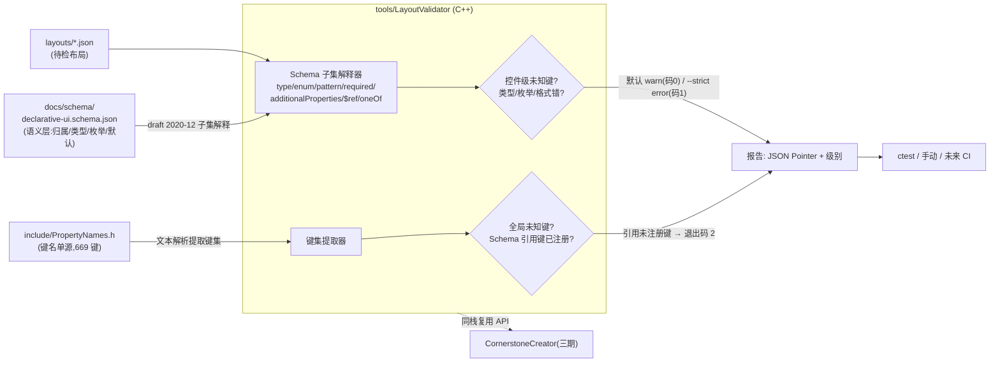

# 声明式 UI JSON 语法限定表（Schema）设计

> 状态：**一期已实施（2026-08-22）**——Schema 21 控件全量、校验器 `tools/validate_layout`（独立子工程）、ctest 9 项（Schema 自检 + 样本 --strict + 7 负例）全部通过；AGENTS.md 第 13 条已解除暂缓并生效。
> 关联：[LayoutSystem_Design.md](LayoutSystem_Design.md)（JSON 布局系统）、[CABI_Property_Design.md](CABI_Property_Design.md)（属性键体系）、[API_Mapping_Table.md](API_Mapping_Table.md)（五层映射交叉核对源）、`include/PropertyNames.h`（**键名唯一来源**）、各控件 `*_Design.md`/`*_Analysis.md`（JSON 语法散点）
> 消费方：① 自动化 JSON 语法检查（校验器）② CornerstoneCreator（后续 JSON 生成器）

## 目录

- [1. 需求概述](#1-需求概述)
- [2. 现状调研](#2-现状调研)
- [3. 总体架构](#3-总体架构)
- [4. 关键设计决策（含结论）](#4-关键设计决策含结论)
- [5. 详细设计](#5-详细设计)
- [6. 分期](#6-分期)
- [7. 涉及文件清单](#7-涉及文件清单)
- [8. 测试策略](#8-测试策略)
- [9. 现状限制](#9-现状限制)

## 1. 需求概述

建立**声明式 UI JSON 的机器可读语法限定表（Schema）**——单一权威规格，供：

1. **自动化语法检查**：对 JSON 布局文件做严格预检（未知属性键/类型错误/枚举非法/缺失必选/颜色与 rect 格式），在运行前/测试/CI 中发现问题
2. **CornerstoneCreator JSON 生成**（后续工具）：按同一规格生成合法 JSON（属性名/类型/枚举/默认值/示例自动正确）

**与现有体系的关系**：LayoutParser 保持**运行时宽容**（未知键忽略、非法值取默认 + `logWarn`）；Schema 是**开发期严格规格**（校验器负责，不改运行时行为）。

## 2. 现状调研

| 项目 | 现状 | 依据 |
|---|---|---|
| 解析入口 | `parseControl` 按 `"type"` 分发（未知 type `logError` 提示后跳过），`LayoutParser.cpp:241` | 类型错误已检 |
| 属性读取 | 全部 `value(key, default)` 静默默认——**未知键/错误类型无警告** | 各 parseXxx |
| 错误报告 | `logError`/`logWarn`（`LayoutParser.cpp:201/206`；JSON 语法错误、rect 缺失、颜色格式、对齐枚举、字体名均有部分校验） | 已有部分校验 |
| 键的权威 | `PropertyNames.h`（818 行，669 个 `PROP_CONSTEXPR const char* kXxx = "..."`，C/C++ 双用）——**仅键名，无类型/枚举/默认值/控件归属** | — |
| 公共属性 | `parseCommonProperties`（`LayoutParser.cpp:2113`，20 处调用）——visible/enabled/transparent/背景/边框等 | 公共属性组已存在 |
| 控件类型 | 25 种 `kControlType*`（`PropertyNames.h:620-644`），与 C ABI `GetControlType` 返回一致 | 类型枚举封闭 |
| 回归样本 | `layouts/` 仅 2 个（test_layout.json / test_layout_advanced.json），覆盖面窄 | 需扩充 |
| 文档 | 用户手册 `docs/index.html`（每控件 JSON 语法章节）+ 各控件设计文档 + 速查表——人类可读、分散 | 无机器可读源 |
| 交叉核对源 | [API_Mapping_Table.md](API_Mapping_Table.md)（22 节控件 × JSON × 属性 × CABI × Binding） | Schema 录入的现成核对清单 |

## 3. 总体架构



三层职责分离：PropertyNames.h 管**键名**（唯一手写源）、Schema 管**语义**（控件 × 键的归属/类型/枚举/默认值）、校验器管**强制**（两层未知键防御 + Schema 自身合法性）。Creator 三期只读前两者。

## 4. 关键设计决策（含结论）

### 4.1 规格载体：标准 JSON Schema draft 2020-12 + `x-` 扩展标注

**结论**：单文件 `docs/schema/declarative-ui.schema.json`，遵循 **draft 2020-12 规范**——`$schema` 显式声明版本、`$id` 唯一标识；类型表达全用标准关键字（`type`/`enum`/`pattern`/`required`/`additionalProperties`/`$ref`/`oneOf`/`allOf`/`const`），不自定义校验语义关键字；项目扩展仅用 `x-` 前缀标注（`x-default` 默认值 / `x-required` 语义必选说明），并在 Schema 头部声明约定。

- 选型理由：生态标准、编辑器补全可用、Creator 可消费；自研子集校验器只需实现 10 个关键字。
- 备选废弃：自定义 JSON 定义（生态为零需自研解析器）；纯 Markdown 表格（机器不可消费）。

### 4.2 校验器实现：C++ 自研子集，Creator 同栈复用

**结论**：校验器用 **C++ 实现**（可执行入口 `tools/validate_layout.cpp` + 可复用模块 `tools/LayoutValidator.h/.cpp`），仅依赖既有 nlohmann/json 单头（`subModules/json`，submodule 已就位，零新增三方依赖）。校验逻辑组织为独立编译单元，头文件暴露 API 供三期 Creator `#include` 直接调用。

- 输出：JSON Pointer 风格错误定位（nlohmann 保留结构路径而非行号，与 LayoutParser 日志互补）；退出码 0=通过 / 1=有错 / 2=Schema 自身非法（引用未注册键）。
- 备选废弃：Python 脚本（Creator 为 C++ 无法复用，语言栈分裂）；第三方库 valijson（依赖管理成本；且键一致性核对需定制逻辑，一期子集够用）。

### 4.3 同步机制：PropertyNames.h 为键名单源，校验器运行时强制

**结论**：键名唯一来源 = `PropertyNames.h`（现有验收约定不变）；Schema 只做语义层。一致性由校验器运行时强制——**无生成链、无额外中间文件**：

1. 校验器文本解析 PropertyNames.h（匹配 `PROP_CONSTEXPR const char* kXxx = "..."`）提取全量键集 → **全局未知键检查**（任何键不在键集 = 未知键，即使 Schema 未列——双层防御）
2. **Schema 合法性内建检查**：Schema 中出现的每个属性键必须已在 PropertyNames.h 注册，否则退出码 2——防止 Schema 引用幽灵键
3. 新增属性固定流程（见 §5.4）：三处缺一即测试失败

**头文件注入（依赖封闭）**：tools/ 对主仓头文件零路径耦合——CMake 构建时将 `include/PropertyNames.h` 拷贝至 `build/tools/generated/`（`DEPENDS` 监视源文件，变更自动重拷），校验器仅 `#include "PropertyNames.h"` 本地解析。拷贝件是**构建产物非第二源**（不入库、每次构建再生），单源地位不受破坏；tools/ 因此可整体拎走，未来拆独立仓库零成本（与 binding 依赖封闭模式一致）。

备选废弃：双源并列+比对测试（仍会漂移）；由 PropertyNames.h 生成 Schema 骨架（键名常量无控件归属维度，生成器无法完成归属，仍须人工）。

### 4.4 一期控件范围：现有 25 种类型（Shape 排除）

**结论**：一期覆盖**现有 25 种 `kControlType*` 控件类型**的全量属性（label/button/.../handle-control），按各控件设计文档 JSON 章节 + [API_Mapping_Table.md](API_Mapping_Table.md) 逐格核对录入。Shape/ListView/TabControl/StatusBar/ContextMenu 等**尚在分析阶段未立项的控件不纳入一期**——立项时按验收清单流程同步扩 Schema（新增属性三处流程天然覆盖）。

- 理由："全部控件"的本意是"机制一次成型，避免部分控件不可校验的断层"；25 种已覆盖全部现存类型，断层不存在。未立项控件无稳定 JSON 语法，提前录入必然返工。

### 4.5 动态语法边界：components/template/bind/占位符一期跳过

**结论**：布局 JSON 的动态机制——`components` 组件定义与实例化、`template`/`props` 模板、`bind` 数据绑定、`{{}}` 占位符——**一期不做严格校验**（宽松放行）。理由：

- 这些节点的键集是用户自定义的（组件 prop 名、绑定路径），`additionalProperties:false` 会大面积误报
- 语法层校验的目标是"笔误早发现"，动态机制的静态分析属于语义层，超出一期范围
- 实现上：校验器遇 `components`/`template`/`bind` 键时整节点跳过；占位符值（`{{xxx}}` 模式）视为通配合法

### 4.6 未知键分级：默认 warn + `--strict` 报错

**结论**：校验器**默认 warn（退出码仍 0）+ `--strict` 报错（退出码 1）**。两级置信度：

- **控件级未知键**（在该控件的 properties 之外，但可能在别的控件）：高置信笔误 → strict 必报
- **全局未知键**（不在 PropertyNames.h 键集）：最高置信错误 → strict 必报，普通模式也 warn

理由：未知键通常是笔误，warn 不阻断存量布局文件；CI/测试用 `--strict` 强制。

### 4.7 LayoutParser 边界：运行时不变

**结论**：LayoutParser 保持宽容现状（未知键忽略、非法值默认 + logWarn），不嵌入 Schema（运行时无收益、成本高）。校验器独立负责开发期严格检查。`--strict-json` 调试开关列后续可选增强（需求出现再做）。

### 4.8 AGENTS.md 联动与实施顺序

**结论**：实施第一步即解除 AGENTS.md「新增控件验收清单」第 13 条的暂缓标注（当前注明"JSON Schema 体系尚未启动"），恢复为生效条款：

> 确认 JSON Schema 已刷新并验证完成（`docs/schema/declarative-ui.schema.json` 同步新增/修改的属性，且 `validate_layout --strict` 校验通过）

同时该条与第 14 条（API_Mapping_Table 刷新）构成互补闭环：映射表的"JSON 键"列与 Schema 的 properties 互为核对。CI workflow 当前不存在——一期以 **CMake 目标 + ctest/手动执行**落地，`.github/workflows` 建立后一行接入（非阻塞项）。

### 4.9 归档、开源协议与构建产物

**归档**：校验器源码留在**主仓库 `tools/` 目录**，不立即拆独立仓库——Schema、样本、校验器需同 PR 原子演进。但通过 4.3 的头文件注入实现**依赖封闭**：tools/ 对主仓的编译期依赖为零（PropertyNames.h 构建期拷贝注入、nlohmann 经 submodule 相对路径），目录可整体拎走；三期 Creator 立项时若需拆仓，仅改一处源路径，其余不动。拆分将引入三处漂移的顾虑由此消解。

**协议**：`tools/` 目录**单独 MIT**（目录内置 `tools/LICENSE`，源文件头注释版权声明），跟随本项目已有的分层先例：

| 层 | 协议 | 先例 |
|---|---|---|
| 核心引擎 | GPLv3（主仓 LICENSE） | src/ include/ |
| 外围可复用层 | MIT（子目录 LICENSE） | binding/（仅依赖 C ABI 头） |
| 开发期工具 | MIT（本次新增） | tools/ |

理由：LayoutValidator 不链接引擎库——仅依赖 nlohmann/json（MIT）、PropertyNames.h 文本解析（读文件非链接）、Schema JSON 文件，**无 GPLv3 传染链**，法律上可独立宽松授权；与 binding/ 同性质同待遇；三期 Creator 复用（无论是否同仓、何种协议）不受主仓 GPL 约束。备选废弃：跟随主仓 GPLv3（Creator 复用被传染绑定）；双许可 GPLv3 OR MIT（对内部工具属多余复杂度）。

**构建产物**：校验器与 backend 完全无关（仅依赖 nlohmann/json + PropertyNames.h 文本 + Schema JSON，不链接引擎库、不涉及 UIBackendCallbacks）——因此**不挂主 CMake**（主工程强制 `UICORNERSTONE_BACKEND` 选择，挂入会被后端选择绑架且三棵树各编一份冗余 exe）。改为 **`tools/` 独立 CMake 子工程**（独立 `project()`，不含后端选项）：

```
cmake -S tools -B build/tools && cmake --build build/tools --config Debug
→ build/tools/Debug/validate_layout.exe
```

单一构建目录、单份 exe；`build/` 已被 `.gitignore` 忽略（:421），二进制不入库；ctest 在 tools 工程内自包含注册（Schema 自检 + 样本回归），与三棵 UI 后端树零耦合；AGENTS.md 验收时直接调用该路径；对外分发走构建树拷贝或未来 CI 附件。

## 5. 详细设计

### 5.1 Schema 文件组织（`docs/schema/declarative-ui.schema.json`）

```json
{
  "$schema": "https://json-schema.org/draft/2020-12/schema",
  "$id": "https://uicornerstone.dev/schema/declarative-ui.schema.json",
  "title": "UICornerstone Declarative UI",
  "oneOf": [
    { "$ref": "#/$defs/layout-root" }
  ],
  "$defs": {
    "layout-root": { "...": "顶层: theme/components/layouts/controls/dialogs/resourceProviders/viewport" },
    "semantic-types": { "...": "color / rect / margin / state-color 四组 / alignment 枚举 / font 枚举 ..." },
    "common": { "...": "全部控件公共属性(id/visible/enabled/rect/scale/colors/events/margin...)" },
    "label":  { "...": "type:const + label 全量属性 + allOf:[common]" },
    "button": { "...": "..." },
    "...": "其余 23 个控件 defs"
  }
}
```

分层约定：

- **语义类型层（$defs 内一组并列 def）**：项目语义类型组合——`color`（正则 `^#([0-9a-fA-F]{6}|[0-9a-fA-F]{8})$` 与 `{normal/hover/pressed/disabled}` 对象的 oneOf）、`rect`（x/y/w/h 整数对象）、`alignment`（9 值枚举，**照抄 PropertyNames.h**：`top-left`/`mid-left`/`bottom-left`/`top-right`/`mid-right`/`bottom-right`/`top-center`/`center`/`bottom-center`）、`font-name`（28 字体枚举）、`font-spec`（{name, size, style}，v1.1.1：common 挂 font/fontSize 两键，未声明时父链继承）等
- **`control-any` 包装 def**：`oneOf` 引用全部 25 个控件 def——供顶层 `controls` 数组元素与 panel `children`、tree-view `items` 的递归 `$ref` 复用
- **`$defs/common`**：公共属性组（对应 `parseCommonProperties`），各控件经 `allOf: [{"$ref": "#/$defs/common"}]` 组合
- **每控件一个 def**：`properties.type` 用 `"const": "<type>"` 锁定；`additionalProperties: false` 使未知键可报
- **递归结构**：panel 的 `children` 数组元素、tree-view `items` 节点的 `children`——用 `$defs` 自引用（`"$ref": "#/$defs/control-any"`）表达，属 draft 2020-12 标准能力，不是 §9 排除的外部循环引用
- **扩展标注**：
  - `x-default`：默认值或说明字符串（如 `"14"`、`"透明"`）——仅供生成器/补全，校验器不作为语义
  - `x-required`：语义必选说明（如 rect 的 `"可整体缺省，缺省全 0；出现时 x/y/w/h 必填"`——修正原稿"必须（可缺省）"的自相矛盾表述）
- **枚举值纪律**：所有 enum 取值一律照抄 PropertyNames.h 对应常量值（原稿示例 `center-left` 系笔误，实际为 `mid-left`，`PropertyNames.h:805`）——校验器的 Schema 合法性检查只查键名注册，枚举值正确性靠录入时对照 + 样本回归兜底
- **动态语法节点**：顶层 `components`、控件级 `template`/`bind`、以及匹配 `^\{\{.*\}\}$` 的字符串值——校验器跳过/放行（决策 4.5）

### 5.2 校验器模块（`tools/LayoutValidator.h/.cpp` + `tools/validate_layout.cpp`）

```
LayoutValidator（可复用模块，Creator 三期 #include 直用）
├─ extractPropertyKeys(headerPath) -> set<string>      // 文本解析 PropertyNames.h（构建期拷贝至 generated/，见 4.3）
├─ loadSchema(schemaPath) -> SchemaDoc                 // nlohmann 解析 + $defs 索引
├─ validateSchema(schema, keys) -> vector<Error>       // 引用键未注册 → 非法(退出码2)
├─ validateLayout(json, schema, keys, strict) -> vector<Error>
│   ├─ 全局未知键检查（键 ∉ PropertyNames.h 键集）
│   ├─ type 分发 → 控件 def 匹配
│   ├─ 控件级未知键（∉ 该 def properties，strict 报错/warn）
│   ├─ 类型/枚举/pattern/required/additionalProperties 校验
│   ├─ 递归 children/items 下钻（深度上限 32 防失控）
│   └─ 动态语法节点跳过
└─ Error { jsonPointer, level(ERROR/WARN/SCHEMA_INVALID), message }
```

可执行入口用法：

```
validate_layout <layout.json...>
    [--schema docs/schema/declarative-ui.schema.json]
    [--property-names include/PropertyNames.h]
    [--strict]
```

输出格式：`<文件>: <JSON Pointer> <级别> <信息>`（例：`hello.json: /controls/2/fontSize ERROR 期望 integer, 实际 string`）。退出码：0=通过 / 1=有错 / 2=Schema 非法。

**Schema 子集**（一期实现范围）：`type` / `required` / `enum` / `const` / `pattern` / `properties` / `additionalProperties` / `oneOf` / `allOf` / `$ref`（限 `$defs` 内引用 + 自引用，深度上限）。明确不做：`format` / `if-then-else` / 外部循环引用 / `$dynamicRef`。

### 5.3 CMake 集成与样本回归

- **独立子工程** `tools/CMakeLists.txt`（`project(validate_layout)`，无后端选项——校验器与 backend 无关，不挂主 CMake 避免后端绑架与三树冗余）；nlohmann 经 `../subModules/json/single_include` 相对路径引用
- **头文件注入**：`add_custom_command` + `copy_if_different` 将 `../include/PropertyNames.h` 拷至 `build/tools/generated/`（`DEPENDS` 监视源文件，主仓改键后下次构建自动重拷），校验器 include 路径指向 generated/——tools/ 对主仓零路径耦合、可整体拎走（决策 4.3/4.9）
- 构建与产物：`cmake -S tools -B build/tools && cmake --build build/tools --config Debug` → `build/tools/Debug/validate_layout.exe`（单份；`build/` 已忽略，二进制与 generated 副本均不入库）
- `layouts/` 样本扩充至**每控件至少一个声明式样例**（从 test/*.cpp 内嵌 LAYOUT_JSON 抽取为独立 .json 文件），全部纳入 `--strict` 回归基线
- ctest 在 tools 工程内自包含注册：①对所有样本跑 `validate_layout --strict` 断言退出码 0；②Schema 合法性自检（对 schema 文件本身跑 validateSchema）
- 未来 CI（`.github/workflows` 出现后）：在构建步骤后追加一行调用

### 5.4 新增属性固定流程（三处，缺一即失败）

```
① include/PropertyNames.h        —— 键名常量（唯一手写源）
② docs/schema/*.schema.json      —— 语义条目（归属控件/类型/枚举/x-default）
③ layouts/ 相关样本              —— --strict 回归通过
（校验器自动验证 ①↔② 一致性，无需人工比对）
```

与 AGENTS.md 验收清单第 13 条对应；第 14 条映射表的"JSON 键"列与本流程互为交叉核对。

## 6. 分期

| 阶段 | 内容 | 依赖 |
|---|---|---|
| ~~一期~~ | ~~AGENTS.md #13 解除 + Schema（draft 2020-12 + `x-` 标注，21 控件 JSON 类型全量）+ C++ 校验器 + 键集一致性强制 + `layouts/` 样本扩充与 `--strict` 回归 + ctest 集成~~ | ✅已完成(2026-08-22) |
| 二期 | `--strict` 分级警告配置；LayoutParser `--strict-json` 调试开关（需求出现再做）；CI workflow 接入（随 workflow 建立一行接入） | 一期 |
| 三期 | CornerstoneCreator 立项（复用 LayoutValidator + 消费 Schema 生成） | 二期 + Creator 立项 |

> 实施说明：oneOf 覆盖 21 个 JSON 控件类型（handle-control 无 JSON 类型、image-button 走 button、menu-item/menu-panel 为运行时类型——均不进 oneOf）；实施中发现并修复：$defs 遍历缺失（幽灵键检查曾形同虚设）、common 规则经 allOf 展开查找（findRule）、组件实例 type=components 键名放行、布局子属性（flowWeight/anchor/grid/row/col 等）入结构性白名单。

## 7. 涉及文件清单

| 文件 | 改动 |
|---|---|
| `docs/schema/declarative-ui.schema.json`（新） | 语法限定表（权威规格，draft 2020-12 + `x-` 标注） |
| `tools/LayoutValidator.h/.cpp`（新） | 校验核心模块（可复用，Creator 消费；MIT） |
| `tools/validate_layout.cpp`（新） | 校验器可执行入口（MIT） |
| `tools/CMakeLists.txt`（新） | 独立子工程 + ctest 自包含注册（无后端选项，决策 4.9/§5.3） |
| `tools/LICENSE`（新） | tools 目录 MIT 协议（决策 4.9） |
| `layouts/*.json`（扩充) | 每控件至少一个样例，`--strict` 回归基线 |
| `AGENTS.md` | 第 13 条解除暂缓（实施首步）；后续验收走该条 |
| `design/JSON_Schema_Design.md`（本文档） | 审核通过后刷新实施状态 |

## 8. 测试策略

1. **校验器自测**（正反例断言，可并入 tools 单测或专用 layout 用例）：
   - 合法最小布局 → 退出码 0
   - 未知键（控件级/全局级）→ warn；`--strict` → 退出码 1
   - 类型错误（fontSize 传 string）/ 枚举非法（align: "center-left"）/ 颜色格式错 / rect 缺字段 / required 缺失（type 缺失）→ 各自报错定位正确
   - 递归结构：三层嵌套 panel children + tree items 深层节点错误指针正确
   - 动态语法：含 components/template/bind/{{}} 的布局放行
2. **Schema 合法性自检**：故意向 Schema 加入未注册键 → 退出码 2（防幽灵键机制有效）
3. **存量回归**：`layouts/` 全部样本 `--strict` 通过（含扩充后的每控件样例）；现有 test_layout/test_layout_advanced 不因 Schema 上线产生新告警（若有 warn 逐条定性：修样本或修 Schema）
4. **三处流程破坏性验证**：模拟"加键不改 Schema"→ 键已入 PropertyNames.h 故通过全局层，但不在任何控件 properties 内，`--strict` 下被控件级未知键检查拦截（退出码 1）——验证双层防御第二层兜底有效；模拟"Schema 引用幽灵键"→ 退出码 2
5. **跨后端无关性**：校验器为纯 JSON 工具，不依赖后端；独立子工程一次构建（build/tools），与三棵后端构建树零耦合

## 9. 现状限制

- 校验器仅支持 Schema 子集（10 关键字，$ref 限 $defs 内，循环外部引用不做，format 不做）
- 递归下钻有深度上限（32），超深嵌套不展开
- 不校验"语义正确性"（事件 handler 引用存在性、组件实例 prop 匹配、id 冲突）——语法层 only
- 动态语法（components/template/bind/占位符）内部不校验（一期边界，见 4.5）
- 枚举值与 PropertyNames.h 的一致性靠录入纪律 + 样本回归，校验器只强制键名层
- CornerstoneCreator 为三期立项，一期仅约定 LayoutValidator 接口