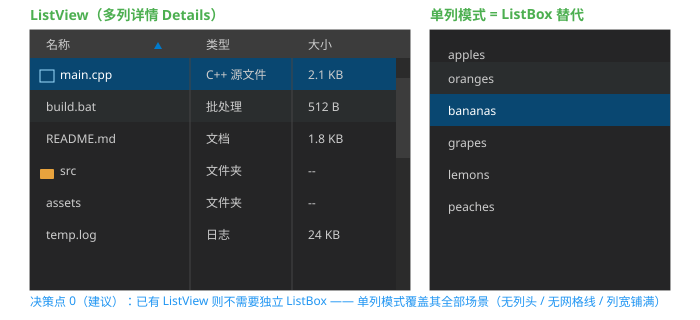

# ListBox / ListView 需求分析

> 状态：**已拍板（2026-08-17）· 转主设计开发 Session 实施**
> 关联：[TreeView_Enhancement_Design.md](TreeView_Enhancement_Design.md)（树形控件先例：选择模型/leadingControl/JSON）、[ComboBox_Design.md](ComboBox_Design.md)（下拉列表先例）、[TabControl_Analysis.md](TabControl_Analysis.md)（键盘导航一期先例）、[StatusBar_Analysis.md](StatusBar_Analysis.md)（icon 机制一期）
> 效果图：[ListView_Preview.svg](ListView_Preview.svg)（嵌入 §5）
> 修订注记：v1（2026-08-17）——数据模型方案拍板（变长行主序 + 写 API 强制补足，§5.0.3/§5.0.5）；视图模式拍板（一期 Report+List，§5.0.6）
> 修订注记：v2（2026-08-17）——决策点 0-9 全部拍板；**扩展拍板**：决策点 2 多选一期（单选+Ctrl 多选）、3 自定义排序回调、4 列宽拖拽一期、5 键盘导航一期、7 垂直+水平滚动一期（详见决策点与 §5.3/§5.4）
> 修订注记：v3（2026-08-17）——**API 扩展**：行插入/列插入（`insertRow`/`insertColumn`）、整行/整列/单格读写（`setRowCells`/`setColumnValues`/`setCell` 等）、**单元格级 leadingControl**（`setCellLeadingControl`）与**单元格样式**（`setCellStyle`：背景色/文字色/字号/字体，稀疏继承语义）——API 全集见 §5.0.3，存储见 §5.1，绘制见 §5.3，CABI 见 §7
> 修订注记：v4（2026-08-17）——**列头 leadingControl**（`ListColumn.leadingControl`，§5.1）：列头图标（标题前，容器边长 = 列头字号×1.4）；控件区命中优先、其余列头区点击 = 排序；JSON `columns.icon` / CABI `ListViewSetColumnIcon` 一期
> 修订注记：v5（2026-08-17）——**列头文本样式**（`HeaderStyle`：文字色/字号/字体，§5.1）：每列可单独设置（缺省继承控件列头默认）；API `setColumnHeaderStyle`/`getColumnHeaderStyle`（§5.0.3）；CABI `ListViewSetColumnHeaderStyle` 一期；JSON 列头样式与单元格样式统一二期
> 修订注记：v6（2026-08-17）——**自检修正**：① §5.0.4/§5.0.1 与决策点 7（水平滚动一期）矛盾措辞已统一（不做的是逐像素平滑滚动）；② SColor 默认构造为黑非透明（`SColor.h:16`），CellStyle 占位默认说明修正、"缺省继承"由稀疏存在性判定；③ 架构图补 m_viewMode/双滚动条/自定义排序器；④ §7 CABI 补 `ListViewSetColumnHeaderStyle`/`ListViewSetRowLeadingControl`/`ListViewSetCellLeadingControl`；⑤ 渲染复杂度改为 O(可见行×可见列)、插入成本补稀疏 map 迁移；⑥ 修复 §5.1 代码块格式；⑦ HeaderStyle 前向引用注释；⑧ 键盘不截获范围明确含单元格控件
> 修订注记：v7（2026-08-17）——**三项拍板**：① 排序后选中集合**跟随行**（按行 id 重映射，§5.4.1）；② **cellControls JSON 一期**（`"cellControls": [{"col", "control"}]`，仿 TreeView `"leadingControl"` 先例，§6）；③ **稳定排序**（`std::stable_sort`，相同 key 保序，§5.4.1/§5.5）
> 修订注记：v8（2026-08-17）——**小项全部可配**（API/JSON/CABI）：hover 高亮（默认开）、列头行高 `headerHeight`（默认 28）、行高 `rowHeight`（仿 TreeView）、最小列宽 `minColumnWidth`（默认 20，拖拽钳制）、网格线 `gridlines`/`horizontalGridlines`——C++ setter + JSON 字段 + CABI 通用属性 setter（§5.3/§5.4/§6/§7）
> 修订注记：v9（2026-08-17）——**属性一致性四层同步（§5.6 矩阵）**：核心属性（mode/multiSelect/selectedIndex/cycleNavigation/rowHeight/headerHeight/gridlines/horizontalGridlines/hover/minColumnWidth/sortColumn）C++/JSON/CABI/Binding **四层全量一期**；`cycleNavigation`/`selectedIndex`/`multiSelect`/`sortColumn`/`sortAscending` 为新增（键名仿 TreeView `PropertyNames.h:431/516`）；`headerStyle`/`cellStyle` JSON 与 Binding 二期（C++/CABI 一期）显式标注；`setColumnSorter` 运行时注入 JSON 无字段显式标注；§5.0.3 补"── 属性 ──"小节；§5.4 补循环/多选开关/初始选中
> 修订注记：v10（2026-08-17）——**API 精简 + 命名规范核对**：① 属性类**走通用接口**——CABI 通用 setter（`SetBool/SetFloat/SetInt/SetEnum`，kebab-case 属性名惯例 `"row-height"`/`"selected-index"` 等，先例 `UICornerstoneAPI.h:449-470`），删除专用 `ListViewSetMode`/`ListViewSetSelectedRow`/`ListViewGetSelectedRow`/`ListViewSetSort`；② C++ Binding **统一属性接口** `setProperty(key, value)`（键名 = JSON camelCase 同串），不建 11 个独立属性 setter；③ 命名规范：C++ `set+UpperCamel` / JSON camelCase / CABI 通用属性 kebab-case / CABI 专用函数 `ListView+Verb+Object`；④ `Mode` 枚举定义（`Mode::Multi/Single`）；⑤ `setSortColumn(int)`+`setSortAscending(bool)` 两独立函数（对齐 JSON 双字段）

## 1. 需求概述

1. 提供 ListBox 控件、ListView 控件（传统 Windows 语义）
2. **核心决策讨论：如果已有 ListView，还需要 ListBox 吗？**（见 §4 决策点 0）

## 2. 现状调研（关键行号）

| 项目 | 现状 |
|---|---|
| 现有实现 | **无 ListBox/ListView**（全库 grep 无命中） |
| 树形列表 | TreeView：树结构 + 单选（`m_selectedId`/`m_selectedRow`，`TreeView.h:82-84`）+ leadingControl 增强（已实施）+ JSON 全链（`"tree-view"`，`PropertyNames.h:575`） |
| 平面列表渲染 | ComboBoxListPanel：可见项渲染（`getVisibleStart/End`、`hitTest`、`m_scrollOffset`，`ComboBox.h:186-219`）——ListView 单列渲染/滚动直接参照 |
| 滚动条 | ScrollBar 独立控件（ComboBox 下拉列表已集成） |
| 选择视觉 | TreeView 选中色（`m_selectedColor`，`TreeView.h:111`） |
| 键盘体系 | FocusManager + Bench Tab 拦截（`Bench.cpp:78-106`）+ Tab 键盘导航一期方案（`TabControl_Analysis.md §3.6`） |
| 测试 | 可视化测试模式先例 |

## 3. 术语定义（传统 Windows 语义，本需求采用）

| 控件 | 语义 |
|---|---|
| **ListBox** | 平面单项文本列表：一行一项文本，单选/多选，可滚动 |
| **ListView** | 多列详情视图（Details 模式）：列头 + 多列单元格 + 排序列；亦可单列 |

## 4. 核心决策：有了 ListView 还需要 ListBox 吗？（决策点 0）

**建议：不需要独立 ListBox 控件**——ListView 提供**单列模式**（无列头/无网格线、列宽自动铺满控件宽）即可覆盖 ListBox 全部场景：

**支持论证（不需 ListBox）**：
1. **功能包含**：ListBox 是 ListView 的退化形态（单列、无列头、无排序）——同一数据模型（行）、同一选择模型、同一渲染管线
2. **代码与维护成本**：独立 ListBox = 双份布局/绘制/事件/JSON/CABI/Binding/测试/文档；单列模式 ≈ 一个布尔开关 + 列宽铺满逻辑
3. **API 兼容**：ListBox 的 `addItem(string)` 即单列模式的 `addRow({string})`——适配薄
4. **一致体验**：选择/滚动/键盘导航/主题全链同一实现，无行为漂移

**反方论证（需要 ListBox）**：
1. 心智负担低（简单列表不暴露列概念）
2. 视觉更简洁（无列头行）
3. ——但均被"单列模式"满足（单列模式**隐藏列头行**、无网格线，视觉等同 ListBox）

**备选方案 B**（若坚持双控件）：ListBox 为基类（单列表格渲染 + 选择/滚动），ListView : ListBox 扩展列头/多列/排序——代码复用但 API 表面仍双控件

**方案 C**（不推荐）：两独立控件，零复用

> 拍板倾向：**方案 A（单一 ListView + 单列模式，无 ListBox）**；若选 A，ListBox 需求由单列模式承接（效果图 §6 演示单列模式视觉等同 ListBox）

## 5. 架构方案（方案 A，若拍板）

```
ListView : ControlImpl
├── m_columns（vector<ListColumn>：title/width/sortable/leadingControl/style）
├── m_rows（vector<ListRow>：id/cells/leadingControl/userData/cellControls/cellStyles）
├── m_selectedRows（选择模型：index 集合，单选 or 多选）
├── m_sortColumn / m_sortAscending（列头排序）+ m_columnSorters（自定义比较器）
├── m_viewMode（模式分派：multi/single，§5.0.6）
├── m_scrollBarV / m_scrollBarH（复用 ScrollBar，垂直+水平；可见行渲染 + 可见列裁剪）
└── 列头行：自绘（标题 + 排序箭头 + leadingControl + 可点击 + 分隔线拖拽）
```



## 5.0 与 Grid / Table 控件的对比（决策点 9）

三者定位光谱：**Table（纯展示）→ ListView（行级交互）→ Grid（单元格级交互/编辑）**

| 维度 | **Table**（如 HTML table） | **ListView**（本设计） | **Grid**（如 DataGridView/QTableView） |
|---|---|---|---|
| 定位 | 静态二维数据展示 | 行级浏览/选择/排序 | 单元格级操作/编辑 |
| 单元格内容 | 文本/内嵌控件 | 文本（+行级 leadingControl） | 文本 + **就地编辑**（EditBox 弹出） |
| 选择模型 | 无 | 行选择（单选/多选） | 单元格/区域选择 |
| 排序 | 无 | 列头排序（字符串比较） | 排序（任意类型比较） |
| 滚动 | 无 | 垂直滚动 | 双向滚动/冻结行列 |
| 列操作 | 静态 | 列宽固定 | 列宽拖拽/移动/冻结 |
| 数据绑定 | 无 | 无（API 填充） | 有（数据源模式） |
| 实现成本 | 低 | 中 | 高 |

**结论**：
- 三者**不冲突、不重叠**——是同一家族的不同定位，各自服务不同场景
- **Table**：若后续需要，可由 ListView"只读展示模式"覆盖（关选择/排序/滚动，列宽固定）——与决策点 0（ListBox 单列模式覆盖）同理；**本期不做独立 Table**
- **Grid**：单元格编辑/区域选择/数据绑定是独立重能力，**本期不做**，如后续需要单独立项（涉及 EditBox 就地表单、双向滚动、冻结列等）
- 本次需求（行级选择/排序/滚动）由 ListView 一期覆盖，不与 Grid/Table 混淆

### 5.0.1 未来 Grid / Table 从 ListView 的继承分析（讨论记录）

**继承度估算**：

| 未来控件 | 继承方式 | 继承度 | 新增部分 |
|---|---|---|---|
| **Table** | `Table : ListView` 只读模式（关选择/排序/滚动/网格线、列宽固定） | ~90% | 仅模式开关 |
| **Grid** | `Grid : ListView` | ~60-70% | ~30-40% 新代码 |

**Grid 直接复用**（ListView 一期已含）：`ListColumn`/`ListRow` 数据模型（cells 二维 = 单元格骨架）、列头绘制、行/列布局、单元格文本绘制+裁剪、可见行渲染、网格线、ScrollBar 集成、排序逻辑、键盘导航、hover/选中/焦点环、事件框架、JSON/CABI/Binding 解析链。

**Grid 需新增**：单元格/区域选择模型、就地编辑（EditBox 浮出）、双向滚动+冻结行列、列宽拖拽/移动、数据绑定。

**影响当前 ListView 设计的两点前瞻**：
1. **选择模型抽象**：选中状态实现为 index 集合（不写死"行"语义）——Grid 扩展为 (row,col) 集合时零重构
2. **可见窗口保持一维**：垂直 = 行窗口；水平 = 整行平移（`hScrollOffset`）+ 可见列裁剪（§5.3，已一期）——**不做二维窗口化**（不按 (行,列) 块调度），Grid 增加冻结列时再扩展——不为未来过度设计

### 5.0.2 列头复用策略（讨论记录，问题 1）

**不拆独立 ColumnHeader 控件**（与 Tab 决策点 1"一体自绘"一致）：

- 拆控件问题：列头与列表体强同步（列宽/水平滚动/排序状态）——控件级拆分 = 双份 Control 生命周期 + 同步复杂度，收益低
- **实质复用**：列头核心 = 列模型（title/width/sortable/leadingControl/HeaderStyle）+ 排序状态 + 绘制函数——在 ListView 内部组织为**独立数据类/绘制函数（非 Control）**，未来 Grid/Table 直接复用
- 独立列头控件场景罕见（如表格外挂排序条），真有需求再升级为控件

### 5.0.3 行/列访问的数据模型（已拍板：变长行主序 + 写 API 强制补足）

**cell 语义（位置映射 + 尾部省略）**：
- `cells[i]` **恒等于第 i 列**（位置映射）——"变长"仅指**尾部可省略**（长度 < 列数 = 后部各列为空），**不支持任意位置稀疏行**（中间列有值、前列为空的行必须显式写全，如 `["", "", "C"]`）
- 反例（陷阱记录）：`["C"]` 是"A 列 = C"，不是"C 列 = C"——`getColumnValues(2)`（C 列）得 `["C","","C"]`，其中行 1 的 C 静默落入 `getColumnValues(0)`（A 列）序列 `["A","C","A"]`
- **列访问按行号对齐**：`getColumnValues(col)` 返回长度**恒 = 总行数**（缺失单元格 = 空串），第 i 条恒为第 i 行——B 列与 C 列的遍历不会出现记录数不同/错位

**写 API 强制补足（拍板）**：行类写入（`addRow`/`insertRow`/`setRowCells`）自动把 cells 补齐到列数（不足补空串、超出截断）；列类写入（`insertColumn`/`removeColumn`）同步调整所有行（列插入 → 每行 index 处插空串；列删除 → 每行对应位删除）——歧义在写路径即消除

**API 全集**：

```cpp
// ── 行 ──
int  addRow(const string& id, const vector<string>& cells = {});                  // 尾插，自动补足
int  insertRow(int index, const string& id, const vector<string>& cells = {});    // 指定位置插
void removeRow(int index);
void removeRowById(const string& id);
int  getRowCount() const;
ListRow& getRow(int index);                       // 行对象引用（含 id/cells/userData）
ListRow* getRowById(const string& id);
vector<string> getRowCells(int index) const;      // 整行读取
void setRowCells(int index, const vector<string>& cells);   // 整行设置（自动补足）
shared_ptr<Control> getRowLeadingControl(int index);
void setRowLeadingControl(int index, shared_ptr<Control> ctl);   // 行级图标（首列前）

// ── 列头（表头行）──
// HeaderStyle 定义见 §5.1
ListColumn& getColumn(int index);                     // 单个表头（引用，可直接改 title/width/sortable/leadingControl）
const vector<ListColumn>& getColumns() const;         // 表头行整体（全部列定义）
void setColumns(const vector<ListColumn>& columns);   // 表头行整体设置（批量重建；所有行 cells 同步补足/截断，写 API 强制补足语义）
void setColumnTitle(int index, const string& title);
void setColumnSortable(int index, bool sortable);
void setColumnWidth(int index, float width);
void setColumnLeadingControl(int index, shared_ptr<Control> ctl);
void setColumnHeaderStyle(int index, const HeaderStyle& style);   // 列头文本样式（文字色/字号/字体）
HeaderStyle getColumnHeaderStyle(int index) const;                // 未设置 → 默认（继承语义）

// ── 列 ──
int  addColumn(const string& title, float width, bool sortable = false);           // 尾插
int  insertColumn(int index, const string& title, float width, bool sortable = false); // 指定位置插（所有行同步插空）
void removeColumn(int index);                     // 所有行同步删除该列
int  getColumnCount() const;
vector<string> getColumnValues(int colIndex) const;      // 整列（恒 = 行数，缺失为空）
void setColumnValues(int colIndex, const vector<string>& values);  // 整列设置：按行对齐 values[i] → 第 i 行该列；不足不扩行、超出忽略

// ── 单元格 ──
string getCell(int row, int col) const;           // 越界空串
void setCell(int row, int col, const string& text);   // cells 越界自动补足
shared_ptr<Control> getCellLeadingControl(int row, int col);
void setCellLeadingControl(int row, int col, shared_ptr<Control> ctl);  // 单元格级控件（稀疏）

// ── 单元格样式（稀疏；缺省字段 = 继承控件默认）──
struct CellStyle {
    SColor bgColor;            // 单元格背景色（占位默认 = 黑，SColor 默认构造 SColor.h:16；"缺省继承"由稀疏存在性判定，见下）
    SColor textColor;          // 文字颜色（占位默认 = 黑）
    FontName fontName = FontName::HarmonyOS_Sans_SC_Regular;  // 与 TreeView 逐项字体同款
    int  fontSize = 0;         // 0 = 继承控件字号
};
void setCellStyle(int row, int col, const CellStyle& style);
CellStyle getCellStyle(int row, int col) const;   // 未设置 → 默认（继承语义）
void clearCellStyle(int row, int col);

// ── 属性（四层一致，见 §5.6 矩阵；C++ setter 为规范实现）──
enum class Mode { Multi, Single };            // JSON "mode" / CABI SetEnum("mode") / Binding setProperty("mode")
void setMode(Mode mode);
void setMultiSelect(bool on);
void setSelectedRow(int index);            // -1 = 清除选中
void setRowHeight(float px);
void setHeaderHeight(float px);
void setGridlines(bool on);
void setHorizontalGridlines(bool on);
void setHoverHighlight(bool on);
void setMinColumnWidth(float px);
void setCycleNavigation(bool on);
void setSortColumn(int colIndex);          // -1 = 清除排序
void setSortAscending(bool ascending);
```

- **单元格样式语义**：仅显式设置的字段生效（缺省 = 继承控件级默认）；背景色绘制于行高亮**之上**（差异着色场景：Git 状态色在选中行仍可见）；文字色/字号/字体随单元格绘制（measureText 按单元格字号，可见行内成本不变）
- **CellStyle 默认值说明**：结构体字段默认值仅占位（`SColor` 默认构造为黑色，`SColor.h:16`，非透明）——"缺省 = 继承"语义由**稀疏 map 存在性**判定（`m_cellStyles` 无该 (row,col) 条目 = 全继承），不依赖字段默认值
- 存储：**行主序**（`rows: vector<ListRow>`，每行 `cells`）——行访问 O(1)，列访问遍历聚合 O(n)
- **`getCell(row,col)`/`setCell(row,col)` 即未来 Grid 的单元格访问原语**（cells 二维 = 单元格骨架），继承零重构
- 展平存储（flatCells）**留待 Grid 立项时评估**（见 §5.0.5）

### 5.0.4 性能分析（讨论记录）

**核心结论：渲染与总行数无关**（可见行窗口化渲染 `getVisibleStart/End`）

| 场景 | 复杂度 | 说明 |
|---|---|---|
| 行访问 | O(1) | `vector<ListRow>` 连续内存随机访问 |
| 列访问 | O(n) | 遍历行聚合 |
| **渲染（每帧）** | **O(可见行 × 可见列)** | 窗口化（行窗口 + 水平偏移裁剪）——万行列表每帧只画 ~20-30 行 |
| 滚动 | O(可见行) | 行级滚动（ComboBox 先例，`m_scrollOffset` 行单位），无逐像素重排 |
| 排序 | O(n log n) | string 比较（`std::sort` + C++ 移动语义）；数值列识别为后续优化 |
| 插入/删除 | O(n) | vector 搬移（ListRow 移动 = cells vector 指针交换 + shared_ptr + 稀疏 map 节点移动，代价低） |
| 内存 | O(n×m×文本) | 万行×3 列 ≈ 数 MB，可接受 |

**规模边界**：
- **万行级（10⁴）**：渲染/滚动不受影响（窗口化）；排序一次性 ~10-100ms（短字符串）可接受；内存数 MB ✓
- **十万行+（10⁵）**：窗口化渲染仍成立，但**存储/排序需分页数据源**（后续增强，单独立项）；频繁中间插入需评估数据结构（vector 搬移成本）
- **局部测量**：`measureText` 每帧每可见行每列 1 次（~60 次/帧，字形度量依赖 TextRenderer 缓存）；文本纹理缓存属 TextRenderer 级全局优化（后续，非 ListView 专属）
- 一期不做**逐像素平滑滚动**（行级滚动，ComboBox 先例）→ 无平滑滚动渲染开销；**水平滚动一期**（决策点 7 拍板）：内容超宽时整行内容左移 + 可见列窗口化，开销 O(可见列)

### 5.0.5 插入性能与存储方案论证（讨论记录，已拍板）

变长行主序 vs 展平存储（flatCells）在结构变更上的差异（n = 行数，m = 列数）：

| 操作 | 变长（方案 A） | 展平（方案 B） | 胜者 |
|---|---|---|---|
| 插入一行 | O(n) 行级移动（行对象整体搬移，万行中间插 ~1.5ms） | **O(n×m) 格级移动**（慢约 m 倍） | **A** |
| 插入一列 | O(n×m) 每行行内局部搬移（+ cellControls/cellStyles 稀疏 map 索引迁移，通常可忽略） | O(n×m) 全局步长搬移（缓存不友好） | A（常数略优） |
| 追加行/列 | O(1) 摊还 / O(n) | O(m) 补足 / O(n) | 平 |
| 读路径 | 窗口化 + 每格间接寻址 | 零间接、缓存友好 | B（纳秒级，被窗口化稀释） |

**结论（拍板依据）**：
1. 写路径（插入）方案 A **全面不劣于 B**；B 优势仅剩读路径纳秒级常数与语义无歧义
2. 语义无歧义**不靠换存储解决**：变长存储 + 写 API 强制补足（§5.0.3）——性能与语义兼得
3. **拍板：变长行主序 + 写 API 强制补足**；展平留待 Grid 立项时评估（矩阵语义 + 高频整列计算场景）
4. 高频插入（日志流/动态列）两者均不擅长，属十万行+ 分段结构增强范畴（后续）

### 5.0.6 视图模式（已拍板：一期 Report + List，Icon/SmallIcon 后续增强）

**Windows ListView 共 4 种视图模式**：Icon（大图标网格）/ SmallIcon（小图标网格）/ List（单列列表）/ Report（多列详情）。本控件现状设计 2 种：`multi`（Report 语义，§5）/ `single`（List 语义，§5.2）。

**同控件多模式的价值分析**：四模式的意义不在四种绘制，而在**同一份数据、同一选中集合、多种展示方式**（资源管理器切视图场景：数据/选中/滚动位置全保留）。拆独立控件（方案 Z）代价 = 双份数据维护 + 切视图丢失选中。

**实现成本分布**：数据模型/选择集合/滚动条/事件/JSON/CABI 四模式全复用；新增部分（流式网格布局、图标绘制、标签截断、格子命中、四向键盘）≈ Report 的 50-70%，且全部落在"按模式分派的布局/绘制/命中"分支。

**拍板（2026-08-17）**：
- 使用场景：**固定视图为主**（无运行时视图切换需求）→ 一期仅 `multi`/`single` 两模式
- **架构预留模式分派接口**：`m_viewMode` 枚举 + 布局/绘制/命中按模式分派（switch 分派，成本近零）——Icon/SmallIcon 后续**同控件内补模式分支**（方案 Y，非新控件）
- 方案 Z（拆 IconView 独立控件）否决：损失数据/选中共享

**模式一览**：

| 模式 | 语义 | 一期 | 后续增强 |
|---|---|---|---|
| `multi` | Report（列头/多列/排序/网格线） | ✓ | — |
| `single` | List（单列，无列头，= ListBox） | ✓ | — |
| `icon` / `small-icon` | 图标网格（标签截断/两行省略） | — | ✓（同控件补分支） |

### 5.1 数据模型

```cpp
struct HeaderStyle {
    SColor textColor;            // 缺省 = 控件列头文字色
    FontName fontName;           // 缺省 = 控件列头字体
    int  fontSize = 0;           // 0 = 继承控件列头字号
};

struct ListColumn {
    string title;          // 列头文本
    float  width;          // 列宽（局部 px）；单列模式自动铺满
    bool   sortable = false;
    shared_ptr<Control> leadingControl;  // 列头图标（标题前，可空；机制同行/单元格）
    HeaderStyle style;                 // 列头文本样式（每列一份，缺省 = 继承控件列头默认）
};

struct ListRow {
    string id;
    vector<string> cells;                    // 每列文本（位置映射 + 尾部省略）
    shared_ptr<Control> leadingControl;      // 可选：行图标（首列前，TreeView/StatusBar 同款机制）
    void* userData = nullptr;
    map<int, shared_ptr<Control>> cellControls;  // 单元格级控件（稀疏，按列索引；行移动/排序/删除跟随行）
    map<int, CellStyle> cellStyles;              // 单元格级样式（稀疏，按列索引）
};
```

- **列头 leadingControl**：列头单元格内布局 = 容器（边长 = 列头字号×1.4）→ 标题 →（sortable）排序箭头右侧；控件区域命中优先（控件事件自理），其余列头区点击 = 排序——互不冲突
- **列头文本样式**（`HeaderStyle`）：每列可单独设置文字色/字号/字体（缺省继承控件列头默认）；绘制按列应用；measureText 按列头字号（列头行固定绘制，成本不变）
- JSON `columns.icon` / CABI `ListViewSetColumnIcon` 一期（StatusBar icon 机制同款）；JSON 列头样式与单元格样式统一二期（CABI `ListViewSetColumnHeaderStyle` 一期）

- **行/列访问接口**：见 §5.0.3（行主序存储；`getRow`/`getColumnValues`/`getCell`/`setCell`/`setCellStyle` 等；**写 API 强制补足**——`addRow`/`insertRow`/`setRowCells` 自动补齐 cells 到列数，`insertColumn`/`removeColumn` 同步调整所有行）
- **单元格级控件与样式随行**：存于 ListRow 内（排序/移动/删除行时自动跟随，无重挂成本）；列插入/删除时按列索引迁移（index ≥ 插入位 +1/-1）

### 5.2 视图模式与单列模式（ListBox 替代）

- 视图模式枚举 `mode`：`multi`（缺省，Report 语义）/ `single`（List 语义）；后续 `icon`/`small-icon`（§5.0.6）
- **布局/绘制/命中按模式分派**（`m_viewMode` switch 分派，预留扩展点）；数据/选择/滚动/事件跨模式共享
- `single` 模式：**隐藏列头行**、列宽 = 控件宽、无网格线——视觉与行为等同 ListBox
- API 便捷层：`addItem(id, text)` 等价 `addRow(id, {text})`（单列模式便捷函数，内部同数据结构）

### 5.3 布局与渲染

- 列头行高默认 ~28（`setHeaderHeight`，JSON `"headerHeight"`，可配）**仅多列模式存在**；行高可配（`setRowHeight`/JSON `"rowHeight"`，默认 24 = `ConstDef::TREEVIEW_DEFAULT_ROW_HEIGHT`，仿 TreeView 先例）
- **可见行渲染**：行数 × 行高 > 内容高 → 垂直滚动条（复用 ScrollBar，ComboBox 集成先例）；仅绘制可见窗口行（`ComboBoxListPanel` 的 `getVisibleStart/End` 模式）
- **水平滚动（拍板一期）**：内容总宽（Σ列宽 + padding）> 控件宽 → 水平滚动条（复用 ScrollBar 横向）；**列头与数据区同步水平滚动**（两者均按 `hScrollOffset` 绘制）；**可见列窗口化**（仅绘制 x 区间内列，渲染 O(可见行 × 可见列)）；垂直/水平滚动条组合布局（右下角交叠）
- 网格线可配开关：`setGridlines(bool)` 竖分隔线（JSON `"gridlines"`，多列模式默认开、单列模式恒关）+ `setHorizontalGridlines(bool)` 横线（JSON `"horizontalGridlines"`，默认关）；选中行高亮（仿 `m_selectedColor`）
- **hover 高亮可配**：`setHoverHighlight(bool)` / JSON `"hover"` / CABI `SetBool(inst, lv, "hover", ...)`，默认开启
- **单元格样式绘制**：行高亮（选中/hover）→ 单元格背景（有设置时覆盖其上）→ 单元格控件（leadingControl）→ 文本（按单元格字号/字体/颜色）——差异着色在选中行仍可见
- `setRect`/`setColumns`/`setColumnWidth` 时 relayout

### 5.4 交互

- MouseMove：hover 高亮；MouseDown 行命中：单选直接选中 / **Ctrl 多选（拍板一期）**——`m_selectedRows` 为 index 集合（§5.0.1 前瞻 1 落地），单选模式集合恒 ≤1
- **列头点击**（sortable）：`setSortColumn` → 重排序 + 箭头方向指示 + `onColumnSort` 回调；排序按列 comparator（缺省字典序，§5.4.1）
- **列宽拖拽（拍板一期）**：列头分隔线 ±4px 命中区（MouseMove 光标切 SizeWE，`m_cursorSizeWE` 先例 `WinFrame.h:56`）→ MouseDown 拖拽 → MouseMove 实时更新列宽（**最小宽度钳制，`setMinColumnWidth`/JSON `"minColumnWidth"`，默认 20px**）→ relayout + 重绘；列头文字超宽截断
- **键盘导航一期**（决策点 5，Tab 先例 §3.6 同款）：方向键上下移动选中（**循环可配，`setCycleNavigation`/JSON `"cycleNavigation"`，默认 true——TreeView 同款**）、Home/End 首尾、焦点环（drawFocusRing）；焦点在行内控件/单元格控件（leadingControl 为可聚焦控件）时不截获；**Shift 范围多选（键盘）后续**（鼠标 Ctrl 多选已一期，`setMultiSelect`/JSON `"multiSelect"` 可关）
- **初始选中**：`setSelectedRow(index)`/JSON `"selectedIndex"`（默认 -1 无选中，键名同 TreeView 先例 `PropertyNames.h:431`）
- 事件：`onSelectionChanged` / `onItemClick` / `onColumnSort`（可空）

### 5.4.1 自定义排序回调（拍板：缺省字符串比较 + 用户回调）

```cpp
using SortComparator = function<bool(const string& a, const string& b)>;
void setColumnSorter(int columnIndex, SortComparator cmp);   // 缺省 std::less<string>（字典序）
void clearColumnSorter(int columnIndex);
```

- 排序流程：`m_sortColumn` + `m_sortAscending` + 该列 comparator（缺省字典序）→ `std::stable_sort`（**稳定排序**，相同 key 保序；rows 移动，§5.0.4 O(n log n)）
- **排序后选中集合跟随行**：按行 id 重映射（排序前记录选中 id 集合 → 排序后重算 index）——与 TreeView `m_selectedId` 语义一致，Windows 资源管理器风格
- JSON 侧：columns 无 sorter 字段——自定义排序为**运行时注入**（JSON 场景用缺省字典序；CABI/Binding 可注入）

### 5.5 排序（拍板：缺省字符串比较 + 自定义回调）

- 列头点击排序，**缺省字符串比较**（`std::less<string>` 字典序）；**自定义排序回调**（`setColumnSorter`，§5.4.1）覆盖缺省；数值列识别排序**不内置**（由用户回调实现）
- 排序只重排行显示顺序（不改数据源顺序，`m_sortColumn` 状态驱动）；C++ `setSortColumn`/`setSortAscending` + JSON `"sortColumn"`/`"sortAscending"` + CABI `ListViewSetSort` + Binding `setSortColumn`（§5.6 矩阵）

### 5.6 属性一致性（C++ API / JSON / CABI / C++ Binding 四层同步）

> **规则：任何属性必须在 C++ setter、JSON 字段、CABI、C++ Binding 四层同步提供**——无静默缺失；层间暂缓（如 JSON 二期）必须在矩阵中显式标注，不得漏层。
> **分层命名惯例**：C++ = `set+UpperCamel`；JSON = camelCase（既有键先例 `PropertyNames.h:515/516/431`）；CABI 通用属性 = **kebab-case**（既有惯例："row-height"/"indent-width"/"font-size"，`UICornerstoneAPI.h:449-470`）；C++ Binding 属性键 = JSON 键（camelCase）同串。
> **API 精简原则**：**属性类 → 通用属性接口**（CABI `Set*`/`Get*` 通用 setter + Binding `setProperty`），不建专用函数；**专用 `ListViewXxx` 仅保留数据/列表/对象类**（需 row/col 定位或对象参数，无法用属性表达）。

**核心属性（全部一期，四层齐全；C++ setter 为规范实现，CABI/Binding 走通用接口）**：

| 属性 | C++（规范实现） | JSON | CABI（通用属性，kebab-case） | C++ Binding（统一属性接口） |
|---|---|---|---|---|
| 视图模式 `mode` | `setMode` | `"mode"` | `SetEnum(inst, lv, "mode", "multi"/"single")` | `setProperty("mode", ...)` |
| 行高 `rowHeight` | `setRowHeight` | `"rowHeight"` | `SetFloat(inst, lv, "row-height", v)` | `setProperty("rowHeight", v)` |
| 列头行高 `headerHeight` | `setHeaderHeight` | `"headerHeight"` | `SetFloat(inst, lv, "header-height", v)` | `setProperty("headerHeight", v)` |
| 竖网格线 `gridlines` | `setGridlines` | `"gridlines"` | `SetBool(inst, lv, "gridlines", v)` | `setProperty("gridlines", v)` |
| 横网格线 `horizontalGridlines` | `setHorizontalGridlines` | `"horizontalGridlines"` | `SetBool(inst, lv, "horizontal-gridlines", v)` | `setProperty("horizontalGridlines", v)` |
| hover 高亮 `hover` | `setHoverHighlight` | `"hover"` | `SetBool(inst, lv, "hover", v)` | `setProperty("hover", v)` |
| 最小列宽 `minColumnWidth` | `setMinColumnWidth` | `"minColumnWidth"` | `SetFloat(inst, lv, "min-column-width", v)` | `setProperty("minColumnWidth", v)` |
| 键盘循环 `cycleNavigation` | `setCycleNavigation` | `"cycleNavigation"` | `SetBool(inst, lv, "cycle-navigation", v)` | `setProperty("cycleNavigation", v)` |
| 多选开关 `multiSelect` | `setMultiSelect` | `"multiSelect"` | `SetBool(inst, lv, "multi-select", v)` | `setProperty("multiSelect", v)` |
| 初始选中 `selectedIndex` | `setSelectedRow` | `"selectedIndex"`（键名同 TreeView，`PropertyNames.h:431`） | `SetInt(inst, lv, "selected-index", v)` / `GetInt` 读 | `setProperty("selectedIndex", v)` |
| 排序状态 `sortColumn`/`sortAscending` | `setSortColumn`/`setSortAscending` | `"sortColumn"`/`"sortAscending"` | `SetInt(inst, lv, "sort-column", v)` + `SetBool(inst, lv, "sort-ascending", v)` | `setProperty("sortColumn", v)`/`setProperty("sortAscending", v)` |

**数据/样式类（层间差异显式标注；专用 API 因需 row/col 定位或对象参数）**：

| 属性 | C++ | JSON | CABI（专用） | C++ Binding |
|---|---|---|---|---|
| 列定义 `columns` | `setColumns`/`setColumnTitle`/`setColumnSortable` 等（§5.0.3） | `"columns"`（一期） | `ListViewAddColumn`/`ListViewSetColumnWidth` 等 | `Builder.setColumns` |
| 行数据 `rows` | `addRow`/`setRowCells`/`getRow`（§5.0.3） | `"rows"`（一期） | `ListViewAddRow`/`ListViewSetRowCells` 等 | `Builder.addRow` |
| 行图标 `rowIcon` | `setRowLeadingControl` | `"icon"`（一期） | `ListViewSetRowLeadingControl` | `Builder.addRow(icon)` |
| 列头图标 `columnIcon` | `setColumnLeadingControl` | `columns.icon`（一期） | `ListViewSetColumnIcon` | `Builder.setColumns(icon)` |
| 单元格控件 `cellControls` | `setCellLeadingControl` | `"cellControls"`（一期） | `ListViewSetCellLeadingControl` | `Builder.addCellControl` |
| 单元格文本 `cell` | `setCell`/`getCell` | `rows.cells`（一期） | `ListViewSetCellText`/`ListViewGetCellText` | `Builder.row(cells)` |
| 自定义排序 `sortCallback` | `setColumnSorter`/`clearColumnSorter` | 无字段（运行时注入，§5.4.1） | `ListViewSetColumnSorter` | `Builder.setColumnSorter` |
| 列头样式 `headerStyle` | `setColumnHeaderStyle` | **二期**（§5.1） | `ListViewSetColumnHeaderStyle`（一期） | **二期**（随 JSON） |
| 单元格样式 `cellStyle` | `setCellStyle`/`clearCellStyle` | **二期**（§6） | `ListViewSetCellStyle`（一期） | **二期**（随 JSON） |

**事件回调（四层同步）**：`onSelectionChanged` / `onItemClick` / `onColumnSort`——C++ 回调 + JSON `events` + CABI 事件注册 + Binding 回调，全部一期。

> 说明：`headerStyle`/`cellStyle` 的 JSON 与 Binding 二期（已拍板）——C++/CABI 一期先行，矩阵显式标注层间差异，不静默缺失。

## 6. JSON（决策点 6，一期）

```json
{
  "type": "list-view",
  "rect": {"x": 0, "y": 0, "w": 420, "h": 260},
  "mode": "multi",                    // multi(缺省) | single（ListBox 替代）
  "multiSelect": true,                // Ctrl 多选允许（缺省 true）
  "selectedIndex": 0,                 // 初始选中行（缺省 -1 无；键名同 TreeView 先例）
  "cycleNavigation": true,            // 键盘上下循环（缺省 true，TreeView 同款）
  "rowHeight": 30,                    // 行高（缺省 24 = TREEVIEW_DEFAULT_ROW_HEIGHT，`ConstDef.cpp:205`）
  "headerHeight": 28,                 // 列头行高（缺省 28；仅 multi 模式）
  "gridlines": true,                  // 竖分隔线（multi 缺省 true；single 恒关）
  "horizontalGridlines": false,       // 横线（缺省 false）
  "hover": true,                      // hover 高亮（缺省 true）
  "minColumnWidth": 20,               // 列宽拖拽最小钳制（缺省 20）
  "sortColumn": 0, "sortAscending": true,  // 初始排序状态（可选）
  "columns": [
    {"title": "名称", "width": 160, "sortable": true, "icon": "provider:icons/name"},
    {"title": "类型", "width": 90},
    {"title": "大小", "width": 70, "sortable": true}
  ],
  "rows": [
    {"id": "f1", "cells": ["main.cpp", "C++ 源文件", "2.1 KB"], "icon": "provider:icons/file"},
    {"id": "f2", "cells": ["build.bat", "批处理", "512 B"]}
  ],
  "events": {"onSelectionChanged": "...", "onColumnSort": "..."}
}
```

- `mode: "single"` 时省略 `columns`（ListBox 语义），行 `cells` 单元素
- `parseListView` 仿 `parseTreeView`；行内 `icon` 复用 StatusBar 一期 icon 机制；缺 `cells` 单列时按 `[id]` 兜底
- **可配属性字段**（一期）：`mode`/`multiSelect`/`selectedIndex`/`cycleNavigation`/`rowHeight`/`headerHeight`/`gridlines`/`horizontalGridlines`/`hover`/`minColumnWidth`/`sortColumn`/`sortAscending`（键名 camelCase，仿 TreeView 惯例 `PropertyNames.h:515/516/431`；**四层一致性见 §5.6 矩阵**）
- **cellControls JSON 一期（拍板）**：`"cellControls": [{"col": 0, "control": {...}}]`——复用控件 JSON（仿 TreeView `"leadingControl"` 先例 `PropertyNames.h:521`）；单元格级控件 rect 由 ListView 按行高/列宽自适应覆盖（解析期仅需占位 rect，同 TreeView 行控件）；cellStyles/列头样式（文本属性）JSON 二期
- 事件复用 parseEvents

## 7. CABI / C++ Binding（决策点 6，一期）

- **CABI**（一期，**属性走通用 setter，专用函数仅数据/列表/对象类**——见 §5.6 矩阵）：
  - 通用属性：`SetEnum(inst, lv, "mode", ...)`、`SetBool(inst, lv, "multi-select"/"hover"/"gridlines"/"horizontal-gridlines"/"cycle-navigation"/"sort-ascending", v)`、`SetFloat(inst, lv, "row-height"/"header-height"/"min-column-width", v)`、`SetInt(inst, lv, "selected-index"/"sort-column", v)` + `GetInt(inst, lv, "selected-index", &out)` 读选中（kebab-case 惯例，`UICornerstoneAPI.h:449-470` 先例）
  - 专用函数（需 row/col 定位或对象/结构参数）：`UICornerstone_CreateListView` + `ListViewAddRow(inst, lv, id, cells...)` + `ListViewInsertRow` + `ListViewRemoveRow` + `ListViewSetCellText` + `ListViewGetCellText` + `ListViewSetRowCells` + `ListViewSetColumnValues` + `ListViewAddColumn`/`ListViewInsertColumn` + `ListViewRemoveColumn` + `ListViewSetColumnWidth` + `ListViewSetColumnSorter` + `ListViewSetColumnIcon` + `ListViewSetColumnHeaderStyle` + `ListViewSetRowLeadingControl` + `ListViewSetCellLeadingControl` + `ListViewSetCellStyle`（**row-id 直接传参定位**；水平滚动自动出现，无独立开关）
- **C++ Binding**（一期，与 C++/JSON/CABI 同步，见 §5.6 矩阵）：ListView 类 + Builder——**属性走统一接口** `setProperty(key, value)`（bool/int/float 重载，**键名 = JSON 键 camelCase 同串**：`"mode"`/`"rowHeight"`/`"headerHeight"`/`"gridlines"`/`"horizontalGridlines"`/`"hover"`/`"minColumnWidth"`/`"cycleNavigation"`/`"multiSelect"`/`"selectedIndex"`/`"sortColumn"`/`"sortAscending"`），**不建 11 个独立属性 setter**；数据/对象/回调类保留专用方法：`addRow`/`setRowCells`/`setColumns`/`addCellControl`/`setColumnSorter`/`setSingleColumnMode`；事件回调 `onSelectionChanged`/`onItemClick`/`onColumnSort`（与 C++ 回调同签名）

## 8. 键盘导航（决策点 5，一期——Tab 先例）

- 焦点模型与视觉复用 `TabControl_Analysis.md §3.6`（setFocusable(true) 注册 FocusManager、focusFirstInScope、焦点环）
- 键位：`↑`/`↓` 上/下移动选中（循环）、`Home`/`End` 首/尾行；焦点在行内控件/单元格控件（leadingControl 为可聚焦控件）时不截获
- 多选：鼠标 Ctrl 多选一期；**Shift 范围多选（键盘）后续**
- 测试：模拟 KeyDown（移动/首尾/焦点留驻/不截获断言）

## 9. 涉及文件清单

| 文件 | 改动 |
|---|---|
| `include/ListView.h`（新） | ListView + ListColumn/ListRow + Builder；ControlType 枚举加 ListView（`ControlBase.h:139-144`） |
| `src/ListView.cpp`（新） | 布局（列/行/单列模式 + 水平滚动窗口化）/绘制（列头+排序箭头+网格线+选中/hover+焦点环）/handleEvent（点击/多选/列头排序/列宽拖拽/键盘）/滚动（垂直+水平 ScrollBar 集成 + 列头同步 + 可见行渲染） |
| `src/LayoutParser.cpp` | `parseListView` + 控件类型注册（`"list-view"`，PropertyNames） |
| `include/UICornerstoneAPI.h` + `src/UICornerstoneAPI.cpp` | 一期 CABI（见 §7） |
| Binding（`binding/`） | 一期 Binding 暴露 |
| `test/test_listview.cpp`（新）+ `test/CMakeLists.txt` | 可视化 + 断言（单列/多列、选择、排序、滚动、键盘） |

## 10. 决策点（2026-08-17 已拍板）

0. **ListBox 必要性**：**不需要独立 ListBox**——ListView 单列模式覆盖 ✅ 同意
1. **架构**：单一 ListView（含单列模式）✅ 同意
2. **选择模式**：**单选 + Ctrl 多选一期**（拍板扩展：原建议多选后续，改为一期）✅ 同意
3. **列头排序**：一期；**缺省字符串比较 + 自定义排序回调**（`setColumnSorter`，§5.4.1）✅ 同意
4. **列宽拖拽调整**：**一期**（拍板扩展：原建议后续，改为一期，§5.4）✅ 同意
5. **键盘导航**：一期（Tab 先例）✅ 同意；Shift 范围多选（键盘）后续
6. **JSON / CABI / C++ Binding**：一期 ✅ 同意
7. **滚动**：**垂直 + 水平滚动一期**（拍板扩展：原建议水平后续，改为一期；列头同步滚动 + 可见列窗口化，§5.3）✅ 同意
8. **网格线/条纹**：网格线开关可配（多列默认开、单列关）；奇偶行条纹后续 ✅ 同意
9. **Grid / Table**：本期不做（对比见 §5.0）——Table 可由 ListView 只读展示模式覆盖（后续）；Grid（单元格编辑/区域选择/数据绑定）单独立项 ✅ 同意
10. **视图模式**：**已拍板**——一期 `multi`（Report）+ `single`（List）两模式（§5.0.6）；Icon/SmallIcon 后续同控件补分支（预留模式分派接口）；拆独立控件否决

## 11. 现状限制（注明，后续增强）

- 数值排序识别不内置（缺省字典序；用户自定义排序回调可覆盖，§5.4.1）
- 奇偶行条纹不做
- Shift 范围多选（键盘）不做（鼠标 Ctrl 多选一期）
- Icon/SmallIcon 视图模式不做（§5.0.6）
- 十万行+ 分页数据源不做（渲染窗口化已支撑；存储/排序需分页，§5.0.4）
- 行内多控件（非 leadingControl 单槽）不做（TreeView 同限）