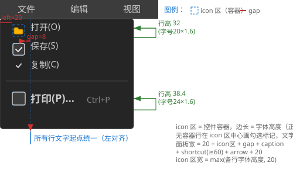

# Menu 增强设计文档（Item 前置控件容器 + 逐 Item 字体）

> 状态：**已实施**（2026-08-17，决策点 1/2/3/4/5/6 全部定稿，实施前复审修订 v5 已并入）· 与源码核对一致
> 关联：[Menu_Design.md](Menu_Design.md)、[TreeView_Enhancement_Design.md](TreeView_Enhancement_Design.md)（同型增强，已实施，本文多处复用其结论）
> 本文档由 Menu_Enhancement_Analysis.md 改写定稿；几何/行为以 `src/Menu.cpp` 实测为准。

## 1. 需求概述

1. **Item 前置控件容器**：每个 MenuItem 前面预留一个控件容器位置，可放置图片（Actor/Image）、CheckBox 等任意控件
2. **逐 Item 字体属性**：每个 MenuItem 可独立设置字体（FontName）与字号，未设置时继承面板级字体

## 2. 视觉效果图



- **icon 区左 padding**（left=20）：面板左缘 → icon 区起点，容器不贴面板左边线（与 ITEM_RIGHT_PADDING=20 右侧留白对称）
- **icon 区 = 控件容器**：正方形，边长 = 该行字体高度，水平居中于 icon 区；icon 区宽 = `max(各行 fontHeight, 20)`（实例状态）
- **leadingGap**（默认 8）：icon 区右缘 → 文字；**有容器行文字起点** = `20 + icon区宽 + leadingGap`（左对齐，有无容器行一致）；**例外：面板内无任何 leadingControl 时不预留 icon 区与 gap**（`hasLeadingControl()=false` 时 `getIconAreaWidth()=0`，文字起点 = 20，Menu.cpp:155-159 标题绘制）
- **勾选标记**：无容器行在 icon 区中心画勾选；有容器行不画（勾选视觉由容器内 CheckBox 承担）
- **变行高**：每行高 = 自身字号×1.6（覆盖项）或面板字号×1.6（继承项）；SVG 展示 32（字号20）vs 38.4（字号24）

> 数值体系（v5 统一）：fontHeight(20号)=20、fontHeight(24号)=24（假设值，示意）→ icon 区宽 = max(20,24,20) = 24、文字起点 = 20+24+8 = 52、勾选中心 = 32；面板宽 = 52 + maxCaption(≈80) + shortcut(60+10) + 20 = 222。fontHeight 实际值由字体文件实测决定，公式不变。
>
> 注：以上矢量图为 SVG 格式，可导入 [draw.io](https://app.diagrams.net) 进行编辑（File → Import → SVG → 选择文件），编辑后可重新导出为 SVG 替换。

## 3. 关键设计决策（含结论）

| # | 决策点 | 结论 |
|---|---|---|
| 1 | 容器槽位：新增槽位还是改造 icon 区？ | **采纳"改造"**：原 icon 区（`ICON_AREA_WIDTH=20`，仅勾选标记使用，`Menu.cpp:39`；勾选绘制 `Menu.cpp:143-150`）直接改造为容器位；icon 区宽改**实例状态** `m_iconAreaWidth = max(各行 fontHeight, 20)`（该实例字段已存在 `Menu.h:186`，现仅构造初始化 `Menu.cpp:265`，属"启用"非"新增"；勾选绘制 `:146-149` 的静态常量统一改用实例值） |
| 2 | 行高：统一（方案 B）还是变行高（方案 A）？ | **采纳方案 A 变行高**：每行高 = `fontSize>0 ? fontSize×ratio : m_fontSize×ratio`。累加结构已逐行（`Menu.cpp:422-480`），但行高源仍统一 `m_itemHeight`（`layoutItems:490`/`hitTest:506`）——实施需三处（recalculateSize `:422-480`/layoutItems `:482-495`/hitTest `:497-514`）将行高源逐项化，**抽统一 helper `itemRowHeight(item)` 防三处漂移**；无滚动条，变高无成本 |
| 3 | 点击前置控件：触发 item onClick 还是控件自身交互？ | **控件自身交互生效，不触发 item onClick、不关闭菜单链**（与 TreeView"点击行控件同时选中行"**相反**——菜单场景点击勾选框不应关闭菜单）；如后续需要"点击容器也触发 item"可加开关 |
| 4 | JSON/CABI 第二期是否立项？ | **立项**，同 TreeView 模式：容器类型 check-box/image 先行，`parseControl` 复用 type 分发；item-id 定位需新增 MenuItem::id 字段 |
| 5 | MenuBar 顶级 entry 是否支持？ | **本期不支持**（顶级 caption 是 MenuEntry 数据而非 MenuItem，无 draw/handleEvent 节点；VSCode 顶级菜单亦无图标惯例） |
| 6 | 容器尺寸？ | **正方形，边长 = 该行字体高度**（水平居中于 icon 区；icon 区宽随各行 fontHeight 取 max 自适应） |

## 4. 详细设计

### 4.1 数据模型（`include/Menu.h:29-106`）

`MenuItem`（本身即 ControlImpl，有 draw/handleEvent）扩展：

```cpp
std::shared_ptr<LeadingControlSlot> leading;  // 前置控件统一由组件承载（几何/对齐/间隙/挂载/命中，见 include/LeadingControlSlot.h）
                                                    // 默认 AM_MID_LEFT 居中、fallback=ICON_AREA_WIDTH(20)、gap 默认 8
FontName fontName = FontName::MapleMono_NF_CN_Regular;  // 与面板默认一致；仅 fontSize>0 时生效
int fontSize = 0;                         // 0 = 继承面板级字号（FontName 枚举无 None，TreeView 4.1 同款）
std::string m_itemId;                     // CABI item-id 定位（第二期）（Menu.h:105，setter/getter 为 setItemId/getItemId）
```

- **挂树方式与 TreeView 的差异**：Menu 的 item 本身就是控件节点，且 item **不在 MenuPanel 的 m_children 中**（`Menu.cpp:296-297` 注释明确，由 addItem 挂入 m_items，`Menu.cpp:368-378`）——leadingControl 直接作为 **MenuItem 的 m_children 子控件**挂树（`setLeadingControl` → `leading->attachTo(this)`，`Menu.cpp:240-257`）；MenuItem 的 `create` 走基类（`Menu.cpp:90-92`），children 的 context/renderDevice 自动传播（`ControlBase.cpp:110-130`、`addControl` `ControlBase.cpp:354`）
- **组件语义**：`leading` 为 `LeadingControlSlot` 实例（懒创建 `ensureLeading()`，fallback 预设 `ICON_AREA_WIDTH(20)`）；公开 API `set/getLeadingControl`、`set/getLeadingGap` 转发到组件；draw/命中/事件全部走组件（`layout`/`containsPoint`/`handleEvent`，`Menu.cpp:137-143`、`202`、`789`、`807`）——与 TreeView 共用同一套几何/对齐语义
- **生命周期**：item 析构自动回收 children；`removeItem` 摘除 item（`Menu.cpp:386-392`）时 children 随 item 释放；运行时 `setLeadingControl` 可安全重入（addControl 幂等，`ControlBase.cpp:354`）
- **无深拷贝问题**：Menu 无 cloneNode 机制（与 TreeView 不同），不涉及

### 4.2 icon 区与容器布局（`src/Menu.cpp:422-480` 改造）

- **icon 区宽**：`m_iconAreaWidth = max(各行 fontHeight, 20)`（recalculateSize 时按 item 实际字体测量 fontHeight 求 max；无字体回退 20）
- **容器尺寸**：边长 = 该行 fontHeight（局部 px）；**水平居中**于 icon 区：`containerX = ITEM_LEFT_PADDING + (m_iconAreaWidth - slotSize) / 2`
- **槽 y**（垂直居中，组件 `LeadingControlSlot::layout`，`Menu.cpp:137-143`）：`(行实际高 − slotH×scale) / 2`——**必须用行实际高**（§3 决策点 2 变行高），不能用面板统一 `m_itemHeight`（覆盖项行会垂直偏位）；对齐语义与 TreeView 共用（默认 `AM_MID_LEFT` 居中）
- **文字起点**（有容器行统一左对齐）：`ITEM_LEFT_PADDING(20) + m_iconAreaWidth + leadingGap`（有容器行从槽右缘 + gap，无容器行同一起点——用户明确要求）；**例外：面板内无任何 leadingControl 时** `hasLeadingControl()=false`，不预留 icon 区与 gap，文字起点 = 20（Menu.cpp:158-159；Menu.h:161 `getIconAreaWidth()` 在有/无容器时返回 `m_iconAreaWidth`/0）
- **勾选标记中心**：`ITEM_LEFT_PADDING + m_iconAreaWidth / 2`；**有容器行不画勾选**（勾选视觉由容器内 CheckBox 承担；item->m_checked 与 CheckBox 自身状态独立可并存）
- **面板宽度公式**（`MenuPanel::recalculateSize`，Menu.cpp:463-470）：`20 + [有 leadingControl 时: m_iconAreaWidth + 各行 leadingGap 最大值(maxGap)] + maxCaptionW + shortcut(>0 时 ≥60 且 +10 间隙) + arrow(20 若有) + 20`；**面板内无任何 leadingControl 时不预留 icon 区与 gap 空间**（`m_hasLeadingControl` 条件，Menu.cpp:465-466）
- rect 为**局部坐标**（子控件 rect 语义相对父，`ControlBase.cpp:612` 双重偏移陷阱——TreeView 修订注记① 同款约束；子菜单 setPosition 绝对坐标错位已由 `Menu.cpp:547-550` 注释实践验证）

### 4.3 绘制（`src/MenuItem::draw`，`Menu.cpp:120-184`）

- 在 `MenuItem::draw` 内：有 leadingControl → 先 `setRect(槽 rect)` 再 `child->draw()`——item 自身绘制路径唯一，MenuPanel 无重复绘制问题（与 TreeView 的行循环+子控件循环排除不同，Menu 结构天然无此问题）
- 有容器跳过勾选标记（`Menu.cpp:143-150` 分支）；标题/快捷键/箭头现有绘制不变（标题/快捷键改用自身字体，见 4.6）
- 绘制顺序（MenuPanel::draw `Menu.cpp:702-758`）：面板背景 → 行循环（hover 背景 `:744-749` 用 itemRect 高度，变行高自动适配 → `item->draw()` `:750`）→ 子菜单面板（`:755-757`）——容器层级在背景之上、子菜单之下，正确
- 标题 textY（`Menu.cpp:153`）：`top + (height − fontHeight)/2`——变行高自动垂直居中

### 4.4 事件路由（`src/MenuPanel::handleEvent` `Menu.cpp:760-806` + `src/MenuItem::handleEvent` `Menu.cpp:186-217`）

改动：MenuPanel::handleEvent 命中 item 后**改为调用 `item->handleEvent(event)`**，按事件类型三分支：

- **MouseDown**：命中行 → `item->handleEvent`——item 内**先做容器命中检测**（对 leadingControl `isContainsPoint`，用 getDrawRect 绝对 rect，检测在 onClick 分支之前）：命中 → `return ControlImpl::handleEvent(event)`（子控件分发，遮挡检测由 `ControlBase.cpp:317-326` 保证）——CheckBox 对 MouseDown 无动作，返回 false；**面板层仍 return true 消费**（防穿透，现 `Menu.cpp:792` 语义保留）；未命中容器 → 现有逻辑（closeMenuChain + item 级 onClick/fireCCallback `Menu.cpp:206-211`）
- **MouseUp（v5 补充，CheckBox 翻转时机）**：**CheckBox 在 MouseUp 左键翻转**（`CheckBox.cpp:211`）——面板现 MouseUp 分支（`Menu.cpp:794-801`）直接 return true 消费、事件到不了 item，**不转发则勾选永远不翻转**。改动：MouseUp 命中带容器行 → 同样调 `item->handleEvent` 转发（CheckBox 翻转后 return true）
- **MouseMove（v5 补充）**：面板现直接 `setHoveredIndex` + return true（`Menu.cpp:776-784`），事件到不了 item——前置 CheckBox 的 hover 态收不到。改动：命中带容器行 → 先 `item->handleEvent` 转发（供容器 hover/视觉态），再执行面板自身 setHoveredIndex（菜单 hover 背景统一由面板管理，两套 hover 互不干扰，TreeView 4.4 同款结论）；无容器行维持现状
- **容器分支返回值语义**：命中容器 → `return ControlImpl::handleEvent(event)` 的**结果**（子控件消费则 true，否则 false）——非固定 false，保证 MouseUp 翻转消费语义正确
- **面板级 fireCCallback**：JSON/CABI 的 kEventClick 绑定在 **item** 上（populateMenuPanel 事件解析 `LayoutParser.cpp:1266-1269`），面板级为历史遗留冗余——改动后走 item 级（`Menu.cpp:209`），面板级移除或保留不影响 JSON/CABI 场景，测试确认

> 约束：前置控件**默认不 focusable**（TreeView 同款：FocusManager Tab 链与菜单交互模式打架）；禁用项（`setEnable(false)`）的前置控件交互不响应（item->handleEvent 首行 getEnable 检查 `Menu.cpp:187` 已覆盖）

### 4.5 子菜单与 MenuBar 顶级

- **子菜单**：子菜单面板 parent = MenuItem（`Menu.cpp:111-118`，仅 setParent 不进 m_children），与 leadingControl（m_children）并存无冲突
- **MenuBar 顶级 entry 本期不支持**（决策点 5）

### 4.6 逐 Item 字体（`src/Menu.cpp:53-67`/`:330-335` 改造）

- **`MenuItem::ensureOwnFont()`**：`fontSize > 0` → 按 `fontName + fontSize` 经 `loadMenuFont(this, ...)`（`:53-67` 复用，字号乘复合缩放 `getScaleXX()`）创建自身字体；否则用面板注入的 `m_font`；渲染器/资源缺失、枚举/文件缺失 → 回退面板字体
- **updateItemsFont 改造**（`Menu.cpp:330-335`）：未覆盖 item 注入面板字体（现逻辑）；**已覆盖 item 重建自身字体**
- **addItem 测量时序（v5）**：现 addItem 为"注入面板字体 → recalculateSize 测量"（`Menu.cpp:373`）——覆盖项首次测量（`Menu.cpp:444-456` 用 item->m_font）会拿到面板字体，icon 区宽/行高/面板宽全部偏差。实施：addItem 时对覆盖项先 ensureOwnFont，再注入/重算
- **失效点**：面板 `setFontSize`（`Menu.cpp:337-347`）/`setFontName`（`:358-366`）/`refreshScaleWith`（`:312-328` 缩放变化）→ updateItemsFont 全量刷新；`addItem` 注入
- recalculateSize 测量已按 item->m_font（`Menu.cpp:444-456`）→ 面板宽度随覆盖项自动更新

### 4.7 变行高（recalculateSize/layoutItems/hitTest 三处，`Menu.cpp:422-514`）

- **统一 helper `itemRowHeight(item)`**：Normal/SubMenu 行 = `fontSize>0 ? fontSize×ratio : m_fontSize×ratio`；Separator 行 = `SEPARATOR_HEIGHT + 2×SEPARATOR_MARGIN`（=21，现状不变）
- recalculateSize 面板高度循环（`Menu.cpp:473-476`）逐项累加；layoutItems 行 rect 高度（`:490`）与 y 累加（`:492`）用 helper；hitTest 行高（`:506`）与累加（`:511`）用 helper——三处共用，防漂移
- 现状 setFontSize 更新 `m_itemHeight`（`Menu.cpp:340`）保留（继承行基准），setItemHeightRatio（`Menu.cpp:349-356`）语义不变

### 4.8 JSON 支持（第二期，`src/LayoutParser.cpp:1217-1296`）

- **C++ API（第一期）**：Builder 扩展 `setLeadingControl/setFontName/setFontSize`；运行时 setLeadingControl 亦可用（addControl 幂等）
- **JSON（第二期，已立项）**：populateMenuPanel item 键扩展：

```json
{ "caption": "保存(S)",
  "leadingControl": { "type": "check-box", "checkState": "checked" },
  "leadingGap": 8,
  "font": "harmonyos-sans-sc-bold",
  "size": 16 }
```

  - `leadingControl`：递归调用 `parseControl` 复用 type 分发（check-box/image 等）；缺 rect 自动补 `{0,0,0,0}` 占位（parseRect 强取 rect 键，否则 nlohmann 抛异常；容器 rect 由 MenuItem::draw 按布局公式覆盖，解析期仅需占位）；parent 传 nullptr；解析失败 logWarn 跳过——TreeView v7 已验证同机制
  - `leadingGap`（float）、`font`（枚举字符串 → `FontNameFromString`，`ConstDef.h:73`）、`size`（int，0=继承）
  - 子菜单递归（`LayoutParser.cpp:1259-1264`）同享

### 4.9 CABI item 级属性（第二期）

**item-id 定位模式**（TreeView v7 先例）：`UICornerstone_SetString(panel, "item-id", id)` 定位（set/get 对称），随后作用于该 item：

| 属性 | 读写 | 语义 |
|---|---|---|
| `item-id` | set/get string | 定位目标 item（**MenuItem 新增 m_itemId 字段**，Menu.h:105；面板 `getItemById` 遍历 m_items 匹配，Menu.cpp:665-671） |
| `item-leading-gap` | set/get float | 控件与文字空隙（局部 px） |
| `item-font-size` | set/get int | 逐 Item 字号（0 = 继承面板级） |
| `item-font` | set/get enum | 逐 Item 字族（`FontNameFromString/ToString`，`ConstDef.h:73-74`） |
| `item-leading-control` | set/get ptr | 前置控件容器；**借用语义**（shared_ptr 无删除器包装，生命周期调用方保证，与 TreeView 同约定）；运行时 SetPtr 立即 `addControl` 挂树 + recalculateSize；**传 NULL 解除容器并摘树** |

- **MenuPanel 属性 override 补全（v5）**：现 MenuPanel 仅实现 `setIntProperty/getIntProperty`（`Menu.h:139-140`）——需新增 `setStringProperty/getStringProperty`（item-id）、`setFloatProperty/getFloatProperty`（item-leading-gap）、`setEnumProperty/getEnumProperty`（item-font）、`setPtrProperty/getPtrProperty`（item-leading-control）override；与 ControlBase 默认属性（visible/enable/rect 等）分支共存——`ControlImpl` 默认 setPtrProperty/getPtrProperty 已存在（`ControlBase.cpp:929/:933`），未识别属性走基类
- 属性常量复用 TreeView 已建的 `kTreeItemId/kTreeItemLeadingGap/kTreeItemFontSize/kTreeItemFont/kTreeItemLeadingControl`（`PropertyNames.h:187-191`，同名属性不同控件独立实现，无冲突）
- 容器类型经 CABI `UICornerstone_GetControlType` / Binding `Control::GetType()` 查询（基类 `m_ctlType` 枚举成员，O(1)）
- 变更后 recalculateSize（icon 区宽/面板宽/行高随字体与容器变化）

## 5. 涉及文件清单

| 文件 | 改动 |
|---|---|
| `include/Menu.h` | MenuItem 扩展：leadingControl/leadingGap/fontName/fontSize/m_itemId + setter/getter + ensureOwnFont；Builder 扩展 setLeadingControl/setFontName/setFontSize；**MenuPanel 新增属性 override（v5）**：setString/getString（item-id）、setFloat/getFloat（item-leading-gap）、setEnum/getEnum（item-font）、setPtr/getPtr（item-leading-control）；m_iconAreaWidth 启用（字段已存在 `Menu.h:186`） |
| `src/Menu.cpp` | MenuItem::draw（icon 区容器绘制 + 自身字体 + 有容器跳过勾选 `Menu.cpp:143-150`）、handleEvent（容器命中分支在 onClick 之前，`return ControlImpl::handleEvent` 结果）、updateItemsFont（覆盖感知 + addItem 先 ensureOwnFont v5）、itemRowHeight helper + recalculateSize/layoutItems/hitTest 行高逐项化（`Menu.cpp:422-514`）；MenuPanel::handleEvent 命中后调 item->handleEvent（MouseDown/MouseUp/MouseMove 三路由 v5）；MenuPanel 属性 override 实现（v5）；勾选绘制 `Menu.cpp:146-149` 静态常量统一改用实例 m_iconAreaWidth；ITEM_LEFT_PADDING 语义改为 icon 区左 padding（文字起点 = 20 + icon区 + leadingGap，统一左对齐）；面板宽度公式（`Menu.cpp:463-470` 加 icon 区与 gap） |
| `src/LayoutParser.cpp` | （第二期）populateMenuPanel item 键扩展：leadingControl/leadingGap/font/size |
| `src/UICornerstoneAPI.cpp` | （第二期）item-id 定位 + item-leading-* 属性分发（控件 override 已实现，API 层按类型分发，`UICornerstoneAPI.cpp:1572-1619` 现状即可，一般无需特判） |
| `test/test_menu.cpp` | 新增断言（见 §6）；必要时仿 test_treeview 的 printf 断言计数模式（`TestInstance.h` 框架，`test_image.cpp` 等已有先例） |

## 6. 测试策略

- **布局断言**：icon 区宽 = max(各行 fontHeight, 20) 且实例状态生效；文字起点统一 = 20 + icon区 + gap（有无容器行一致）；容器边长 = 字体高度、水平居中于 icon 区、垂直居中于行；面板宽度随覆盖字号/容器变化；变行高（覆盖行 38.4 vs 继承行 32，分隔行 21 不变）
- **事件断言**：点容器（MouseDown+MouseUp 完整序列）→ **不关菜单、不触发 item onClick**、CheckBox 勾选翻转生效（**必须注入 MouseUp，CheckBox 在 MouseUp 翻转**）；MouseMove 命中容器 → CheckBox hover 态 + 面板 hover 背景并存；点行非容器区 → 现有 onClick + 关菜单链行为不变
- **字体断言**：覆盖项 fontSize>0 用自身字体绘制/测量；面板 setFontSize → 覆盖项重建、未覆盖项注入；addItem 覆盖项首测正确（icon 区/面板宽）
- **生命周期断言**：removeItem → 容器随 item 释放；setLeadingControl(NULL) → 摘树
- 交互断言先跑一帧 `draw()` 刷新布局
- （第二期）JSON/CABI 断言：parseControl 容器（check-box/image）+ leadingGap/font/size + CABI item-id 定位读写 + SetPtr 运行时挂载/解除

## 7. 实施顺序建议

1. 第一期核心：数据模型 + 容器绘制/勾选跳过 + 事件三路由 + 变行高 + 逐 Item 字体（含 addItem 时序）→ test_menu 断言全过
2. 第二期：JSON 键 + MenuPanel 属性 override + CABI item-id/属性（复用 kTreeItem* 常量）→ test_menu_cabi（仿 test_treeview_cabi）
3. 视觉验证：test_menu 窗口人工查看（三后端）

## 8. 实施状态（2026-08-18）

- **第一期核心全过**：test_menu 核心断言 18/18（菜单宽高/icon 区/行高变高/容器几何与交互/字体覆盖/hover/摘树事件语义）；test_treeview 回归 30/30（Enhanced 14 + json enh 16）不受影响；sdl3 全量构建零错误
- **第二期 JSON + 属性系统全过**：test_menu 45/45（核心 18 + JSON 10 + PROP 17），sdl3/raylib/raylib_dll 三后端一致
  - JSON 键：`leadingControl`（parseControl 复用 type 分发，缺 rect 补占位）/ `leadingGap` / `font` / `size` / `id`（LayoutParser.cpp populateMenuPanel）
  - 属性 override：MenuPanel set/get Int/String/Float/Enum/Ptr 按 item-id 定位（m_itemTargetId），复用 kTreeItem* 常量；item-font-size=0 恢复面板级字体（setMenuFont(m_font, m_fontSize)）；SetPtr 运行时挂载/传 NULL 解除（借用语义，与 TreeView v7 同约定）
  - MenuBar::getMenuPanel(int) / MenuPanel::getItemById 公开；MenuBar::setContext 传播到 m_entries 面板（MenuPanel::setContext 补 ensureFont+updateItemsFont+recalculateSize——挂树前 addItem 的覆盖项字体在挂树后补加载）
- **关键发现**
  - **跨模块指针位模式**：setPtrProperty 的 void* 句柄约定为 **Control* 子对象位模式**（CABI 句柄语义）；若直传派生类指针（CheckBox* 等，虚基下与 Control* 位模式不同）会导致 leadingControl 错位——getPtrProperty 自洽但与真实 Control* 比较失败；测试用 `(Control*)pcb.get()` 模拟 CABI 句柄
  - **addControl 虚调用防御**：`child->setRenderDevice(...)` 依赖 Control* 位模式正确性，位模式错位时 CheckBox 虚调用 C0000005；ControlBase.cpp 新增 `AddControlSetRenderDevice`（dynamic_cast<ControlImpl*> 规范化 + 限定调用，全部 Control 子类均为 ControlImpl 且 setRenderDevice 无派生 override，行为等价）
  - **测试字体选择**：test_menu JSON/PROP 的 `font` 用 maplemono-nf-cn-regular（资源实际存在）；harmonyos-sans-sc-bold 字体文件不在 assets 字体集中，ensureOwnFont 加载失败静默回退面板字体（行高/绘制随之回退，属预期 fallback 行为）
- **后续**：test_menu_cabi（复用属性键走真实 C ABI 绑定层）

### 8.1 补充（2026-08-18 视觉验证轮）

- **parseLayout 菜单栏无法打开菜单的根因修复**：LayoutParser 创建菜单栏挂树顺序 = addControl 内先 setContext 后 setParent → setContext 阶段 ensureFont 时父链不可解析（getTextRenderer 为 null）→ m_font 空 → layoutEntries 算出 entryWidth=0 → hitRect 零宽 → 点击菜单栏永远不命中（面板无法打开）；修复：**MenuBar::setParent override 在 ControlImpl::setParent 之后补调 ensureFont() 再 setRect/layoutEntries**（Menu.cpp），父链就绪后字体正常加载、hitRect 恢复；JSON/PROP 菜单栏点击打开面板由此生效
- **MenuBar 全宽设计确认**：setParent → setRect(0,0,parent宽,barHeight)；setRect → layoutEntries 末尾按父宽重置；菜单栏不可定位（JSON/PROP 测试里 setRect(420,...) 实为无效操作，与设计一致）
- **readPixels 与屏幕显示存在滞后差异**：同帧绘制（fillRect 红色探针）后立即 readPixels 读不到刚画的像素，但窗口实际可见（目视确认）；像素统计（dumpRegion）只作参考，渲染执行以结构断言（45 项）与目视为准
- **视觉呈现定稿**：test_menu 断言结束后 VIS 状态机点击打开“文件(F)”菜单并保持；同时从 BENCH 移除重叠的全宽 JSON/PROP 菜单栏（三条菜单栏均 (0,0,全宽)，保留文件菜单栏供目视干净展示）；人工确认窗口呈现文件菜单（icon 区 checkbox 容器/勾选标记/变行高/快捷键/子菜单箭头）
- **回归终态**：test_menu 45/45（sdl3/raylib/raylib_dll 三后端一致）、test_treeview 30/30、sdl3 全量构建零错误；源码无残留调试输出
### 8.2 补充（2026-08-19 滚动/容器收尾轮）

- **幽灵滚动条修复（TreeView::create 重复创建）**：`ControlImpl::setContext` 无条件 `recreate()`（ControlBase.cpp:119），recreate 置 `m_isCreated=false` 后重跑 `TreeView::create()`——每次重建 2 个新 ScrollBar 且**不清理旧的**（addControl 查重仅防同对象），JSON tree-view 实测 children=6（2 行控件 + 4 滚动条），多余滚动条保持构造初始 rect/visible=true，被 children 循环绘制成"幽灵垂直滚动条"（用户目视报告）；修复：**create() 内创建新滚动条前 `removeControl` 旧对象**（TreeView.cpp，与 CheckBox::createCaption 的既有清理模式一致）；修复后 children=4、vVis 恒 0（内容不满）、垂直滚动条不再出现
- **calcContentWidth 计入 leadingControl**：原实现未计行前置控件宽度 → jsonTv 的 j2 行（图片 + 粗体 16 号）实际超宽但 contentW 低估 → 水平滚动条该出现却隐藏；修复：**contentW 累加 slotW + leadingGap**（slotW 与绘制同公式：Actor 取纹理宽高比、rect 回退 1:1；fontH = renderer->getFontHeight(nodeFont)，回退 m_rowHeight）→ jsonTv hVis=1 生效，水平滚动条出现且拖动/滑道点击可滚动内容（实测 hRect=(0,144,150,16) 点击后 value 变化）
- **CheckBox 盒子不随容器缩放（用户点名）**：盒子尺寸 = caption(空 Label) 行高 × ratio，字号写死 `CHECKBOX_DEFAULT_CAPTION_SIZE=16`（ConstDef.cpp:84）→ 盒子恒 17×17，与容器（如 24 号行 → 32×32）无关；新增 **CheckBox::setCaptionSize/getCaptionSize/effectiveCaptionSize**（`m_captionSize`，0=ConstDef 默认；caption 已建时 setFontSize 经 setBoxSize 回调自动重排），`CheckBoxBuilder::setCaptionSize` 改为委托控件方法；视觉验证：Actor(cross_up.png) 容器 32×32 填满、CheckBox setCaptionSize(24) 后盒子 28×28，用户确认 OK
- **行内居中定案**：leadingControl 容器与手绘勾均**行内垂直居中**（slotTop=(rowH-slotSize)/2、勾 cy=行中心）；早前"全菜单统一中线"方案已撤销（m_maxItemRowHeight 删除）
- **2x TreeView 测试布局（定稿）**：scale 语义 = 位置不变 + 尺寸×2（getDrawRect 位置乘父 scale、宽高乘自身 scale）；早期提出的"rect 减半 (280,10,125,150)"方案**已否决**——实际 2x 树保持原 rect **(280,10,250,300)**（test/test_treeview.cpp `initTestScale2x` 断言 "2x treeview logic rect unchanged (280,10,250,300)"，逻辑矩形不变、绘制矩形 (290,20,500,600)）；JSON 增强面板 rootJsonEnh 已右移至 **left=800**（ENH_JSON `"rect": {"x":800,...}`），g_treeViewEnhanced 位于 **(800,320,300,200)**（test_treeview.cpp `initTestEnhanced`）；各控件互不侵入面板区
- **截图 API 替代手写 BMP**：调试期间手写 readPixels+BMP 头拼图；改用核心库直连 **UICornerstone_CaptureViewport / CaptureControl / SavePixelsToFile**（UICornerstoneAPI.cpp，C++ 测试可直接链接调用；CaptureControl 的 handle 即 Control*），整窗/单控件截图与落盘一步完成
- **回归终态**：test_menu 52/52、test_treeview 30/30（Enhanced 14 + json enh 16），sdl3/raylib/raylib_dll 三后端一致；全部 auto=<秒> 自动关闭运行；源码无调试残留
### 8.3 补充（2026-08-20 缩放目视对比轮）

- **MenuBar 手动定位（manual-position）**：推翻 8.1"菜单栏不可定位"结论——菜单栏全宽布局对单条适用，但同屏多 MenuBar（1x/2x 缩放对比）互相重叠无法目视；新增 **MenuBar::setManualPosition/getManualPosition**（`m_manualPosition`，属性 `manual-position`，JSON 键 `manualPosition`）：layoutEntries 末尾全宽 setRect 加 `if (!m_manualPosition && getParent())` 守卫；setParent 简化为 ensureFont + layoutEntries（注释标明 manual 不重置）；JSON 解析在 manualPosition 落地后**重放 rect**（通用 rect 解析先于特化键，重放使自由定位立即生效）；MenuItem/MenuPanel 不受影响
- **Menu 缩放目视对比（test_menu scale 断言块）**：bar1x（1x 手动 (700,40,300,30)）+ bar2x（2x 手动 (700,140,300,30)）挂 BENCH——同屏目视 2x 条绘制 600×60 vs 1x 条 300×30；pnl1x（1x (40,240)）+ pnl2x（2x (420,240)）显示式面板同屏对比；断言：逻辑高 30/30、绘制高 30/60、manual top 生效 (40/140)、2x 绘制宽 = 1x × 2、2x 项逻辑行高 32、2x 绘制行高 = 逻辑 × 2、2x 面板绘制宽 = 逻辑 × 2、2x 面板绘制高 > 1x；挂树后 getItemAt 使用**绝对坐标**（绘制坐标 = 面板位置 + 局部偏移，未挂树时坐标与局部一致）
- **回归终态**：test_menu 52/52、test_treeview 44/44（Enhanced 14 + json 17 + Scale2x 13）、test_menu_cabi PASSED，raylib/sdl3/sfml 三后端一致
### 8.4 补充（2026-08-20 2x 菜单交互修正轮）

- **hitTest 统一换算（MenuBar/MenuPanel）**：两处 hitTest 输入为全局绘制（像素）坐标、内部为逻辑坐标——各自手写 `x - drawRect.left` 局部偏移，2x 时命中区错位；统一改用 **`ControlBase::mapViewportToCanvas`**（既有逆变换：÷复合缩放 + 扣绘制位置）；`MenuBar::hitTest`/`MenuPanel::hitTest` 提为 public（测试友好）
- **2x 面板条目缩放传播（用户目视报告：hover 一半显示、文字居上一半）**：MenuItem 不在 MenuPanel 的 m_children 中（面板手动管理）——panel 挂 2x bar 时自身复合缩放变 2，但 items 复合缩放恒 1 → item 绘制矩形=逻辑尺寸（158×32 未 ×2）、hover 背景减半；字体经 loadMenuFont 已按复合 scale 生成 32px，绘制矩形 32px 高 → 文字贴顶（"居上一半"）；修复：**MenuPanel::setParent override（原声明无实现，补齐）挂载后显式 `item->refreshScaleWith(m_xxScale, m_yyScale)` + 字体重建 + recalculateSize**；`MenuPanel::refreshScaleWith` 同样显式传播 items（此前只传播子菜单面板）；修复后 item 绘制矩形 (700,200,316×64)=逻辑×2、文字 32px 行内居中
- **新增断言**：2x 面板条目存在、条目绘制高度=逻辑×2、面板 hitTest 命中/区域外、面板 hover 索引、菜单栏 hitTest 命中/区域外；点击 2x 条弹出面板于条正下方 (700,200)
- **回归终态**：test_menu 52/52、test_treeview 44/44、test_menu_cabi PASSED，raylib/sdl3/sfml 三后端一致
