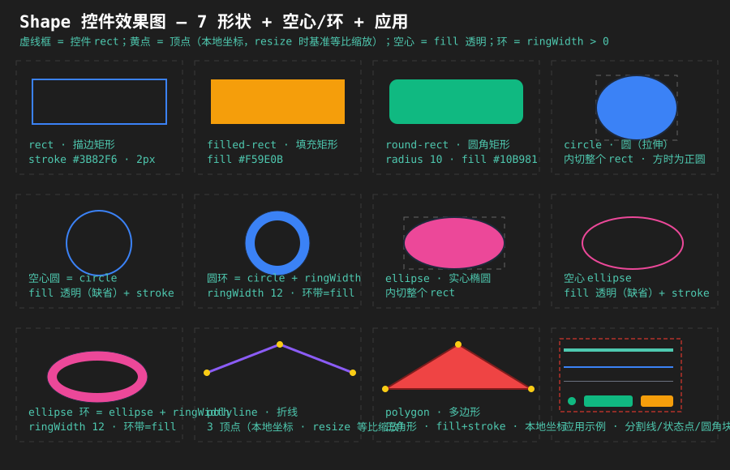

# Shape（形状控件）设计文档

> 状态：**设计定稿 · 已实施（对照源码自检）**
> 修订注记：v1（2026-08-19）——按 Analysis 决策初版设计
> 修订注记：v2（2026-08-25）——**实施期决策回写**：多图元组合（addPrimitive/primitives JSON/CABI 五函数）、背景色（setBackgroundStateColor 自动取消透明）、缩放三层规则（drawRect/local×scale/命中逆变换）、空心圆描边闭合修复（strokePath closed 参数 false→true）、ShapeBuilder；补测试策略（26 项）；对照源码自检 2 遍
> 前身：[Shape_Analysis.md](Shape_Analysis.md)（需求分析，决策点 1-11 已拍板，本文档为其设计化改写）
> 关联：[ListView_Analysis.md](ListView_Analysis.md)（属性四层一致性矩阵规则 §5.6）、[CABI_Property_Design.md](CABI_Property_Design.md)（通用属性系统）、[API_Mapping_Table.md](API_Mapping_Table.md)（验收交叉核对）
> 效果图：[Shape_Preview.svg](Shape_Preview.svg)（嵌入 §5.2）

## 目录

- [1. 需求概述](#1-需求概述)
- [2. 现状盘点与口径统一](#2-现状盘点与口径统一)
- [3. 关键设计决策（含结论）](#3-关键设计决策含结论)
- [4. 详细设计
- [4.9 多图元组合（组合图形）](#49-多图元组合组合图形)
- [4.10 背景色](#410-背景色)
- [4.11 缩放方案（三层规则）](#411-缩放方案三层规则)
- [4.12 Builder（声明式构建）](#412-builder声明式构建)
- [5. 涉及文件清单](#5-涉及文件清单)
- [6. 测试策略](#6-测试策略)
- [7. 现状限制](#7-现状限制)

## 1. 需求概述

提供 Shape 控件：绘制基础几何图形（矩形/圆角矩形/圆/椭圆/折线/多边形），支持填充色、描边色、线宽——方便用户在界面上直接画出所需形状（装饰分割线、色块、示意图、图标底座等）。**含空心（仅描边）与圆环/椭圆环（环带）能力**。

**与现有能力的关系**：Panel 可填背景色 + 边框（矩形色块已可用）；Shape 补充**非矩形几何体**（圆/椭圆/圆角/折线/多边形）与**细粒度描边控制**。

## 2. 现状盘点与口径统一

### 2.1 渲染原语层现状

| 渲染能力 | 现状 | 依据（`RenderDevice.h`） |
|---|---|---|
| 实心矩形 | ✅ 直接支持 | `fillRect`（:31） |
| 描边矩形 | ✅ 直接支持（固定 1px） | `drawRect`（:32） |
| 直线 / 点 | ✅ 直接支持（固定 1px） | `drawLine`（:33）/ `drawPoint`（:34） |
| 单色三角形/四边形 | ✅ 直接支持 | `drawTriangle`/`drawQuad`（:46-47） |
| 任意凸多边形（顶点带色） | ✅ 直接支持 | `drawTriangles`/`Strip`/`Fan`（:41-43） |
| 粗线 / 宽描边 | 🔧 组合：填充四边形边带 | 无 lineWidth 参数，1px 固定 |
| 圆 / 椭圆 / 圆角 / 环带 | 🔧 组合：`drawTriangleFan` 扇形逼近（32 段） | 无曲线原语 |
| 半透明 / 裁剪 | ✅ 顶点色 + BlendMode（:24）；`setClipRect` 系（:25-28） |

### 2.2 口径统一（修正分析文档 §2 与 §8/§10 的表述矛盾）

两层结论并存、不矛盾：

1. **正确性层**：现有原语**可组合表达**全部 7 种形状——即使不新增图元，Shape 在控件内部三角化也能实现全部需求（这是可行性的兜底依据）
2. **架构优化层**：圆/椭圆/圆角/折线/多边形的组合逻辑在全库高频出现（GraphTool 逐段循环、ControlBase 边框手拼等 10+ 处痛点，见 §4.4/§4.9）——一期随 Shape **同步下沉为 RenderDevice 基类默认图元**（决策点 9），Shape 的三角化退化为参数组装

即："无需新增原语"描述的是可行性底线，一期方案选择"新增基类默认图元 + Shape 直接消费"（三后端零改动自动获得，见 §3.9/§4.4）。

### 2.3 属性系统现状（更新至当前源码）

- `setColorProperty` 支持 background/border/text/text-shadow 及状态子键（`ControlBase.cpp:876` 起）；`setBoolProperty` 已含焦点体系/always-on-top（:922 起）；**`setFloatProperty` 基类已有 margin 分发、`setIntProperty` 已有 tab-index、`setEnumProperty` 已有 state/focus-ring-style**（本轮 API 缺口实施后，:910 起）——Shape 特有键（shape/fill/stroke/line-width/radius/ring-width）仍需 Shape override
- 控件注册：`ControlType` 枚举（`ControlBase.h:139`）需新增 `Shape`；JSON 类型名 kebab-case 惯例（`PropertyNames.h:620-644`）

## 3. 关键设计决策（含结论）

> 拍板记录：2026-08-19 决策点 1-10 全部拍板（2/3/7/8 按用户意见修订）；本文档补充决策 12（口径统一）与决策 13（Phase A 范围确认）。

### 3.1 形状集范围（决策点 1，已拍板）

7 种一期：`rect`/`filled-rect`/`round-rect`/`circle`/`ellipse`/`polyline`/`polygon`。triangle 由 polygon 3 点覆盖不单列；arc 与渐变列后续增强。

### 3.2 Circle 语义 = 拉伸（决策点 2，已拍板）

`circle` 与 `ellipse` 同语义——均内切整个控件 rect（各向异性拉伸；rect 为正方形时 circle 即正圆）。两枚举并存，circle 为语义别名。原建议（内切 min(w,h) 保正圆）已废弃。

### 3.3 点坐标体系（决策点 3，已拍板 v2）

polyline/polygon 点 = **控件本地像素坐标**（0,0 = 控件左上，全库坐标一致），**随 rect 缩放**：`setPoints` 记录当前 rect 为基准（baseW/baseH），rect 变化按 `(newW/baseW, newH/baseH)` 各向异性缩放。坐标 API：

- `mapToDrawPoint(float lx, float ly)`（主 API）：本地 → 全局绘制坐标 `(rect.left + lx·sx, rect.top + ly·sy)`
- `getDrawPoint(int index)`：顶点便捷查询，等价 `mapToDrawPoint(points[index])`

v1 归一化已废弃（本质 baseW=baseH=1 特例，且与其他控件坐标系不一致）。JSON 点集为本地像素 `{"x":8,"y":56}`。

### 3.4 描边线宽（决策点 4，已拍板）

任意 `lineWidth`（float ≥ 0；0 = 无描边）：1 用现成 drawRect/drawLine，>1 用填充边带/圆环三角化。

### 3.5 多边形凹性（决策点 5，已拍板）

一期凸语义（顶点扇；凹多边形结果不保证）。凹方案（耳切三角剖分）输出为后续增强计划（§4.10），分阶段落地。

### 3.6 四层支持（决策点 6，已拍板）

JSON `"type":"shape"` + CABI `UICornerstone_CreateShape` + 通用属性 setter + 专用 `ShapeSetPoints`/`ShapeMapToDrawPoint` + Binding 统一接口——一期全做。

### 3.7 缓存策略（决策点 7，已拍板）

几何顶点缓存于 `setShape`/`setRect`/`resized`/`setPoints`/`setRadius`/`setRingWidth` 时重算，绘制零计算；顶点数恒定（圆 32 段、圆角 8 段/角）。**resize 强制重算**（含布局引擎驱动的 resized 回调，非仅 setRect）。

### 3.8 空心与环（决策点 8，已拍板）

不新增形状枚举：

- 空心 = `fill` 缺省透明 + stroke 描边（普通组合）
- 环 = `circle`/`ellipse` + `ringWidth > 0`（float px，缺省 0 = 实心；fill 填充环带、内孔透明、stroke 可选外缘描边）；`ringWidth ≥ 内切半径` 钳制为实心；四层随时可调
- 三角化：外轮廓扇形 − 内轮廓反向扇形；环带宽恒定 px（可变宽列后续）

### 3.9 RenderDevice 图元架构：基类默认实现（决策点 9，已拍板）

新增图元在 `RenderDevice` 基类提供**默认实现**（CPU 顶点生成，内部调用既有纯虚 `drawTriangles`/`drawLine`），声明为非纯虚：

- **三后端（sdl3/raylib/sfml）与 CallbackRenderDevice 零改动自动获得**（回调链路转发 drawTriangles）
- 后端可选 override 原生加速（如 raylib DrawCircleSector/DrawRing）——纯优化非必需
- 无新增 C ABI 回调（旧回调不变；仅新增 `bridge_drawLineEx` 转发宽线）
- 备选废弃：三后端各自实现（代码重复 3 份无收益）；仅 Shape 内部组合不新增图元（全库痛点未释放）

### 3.10 继承关系：Shape : ControlImpl（决策点 10，已拍板）

不继承 Panel——Panel 增量 = 容器语义（addControl/LayoutEngine/子控件事件分派），Shape 为纯绘制控件无此需求；继承引入不必要状态与每帧遍历开销；Panel 背景=矩形底色与 Shape fill 叠层语义混淆。备选（继承 Panel）废弃，理由见上；后续若现"形状容器"需求可重构（单一继承点成本可控）。

### 3.11 mapToDrawPoint 扩展语义（决策点 11，后续增强）

一期仅本地坐标输入；归一化/绝对坐标重载需求出现再做。

### 3.12 口径统一（本文档新增决策）

§2.2 两层结论并存：现有原语组合表达是**可行性底线**；一期图元下沉是**架构优化选型**（决策 3.9）。Shape.cpp 一期直接消费图元（三角化退化为参数组装）；图元代码以基类默认实现形式落地，不在 Shape.cpp 内暂存过渡版本——避免"先内部实现再迁移"的双份维护。

### 3.13 凹多边形 Phase A 随一期（本文档新增确认）

耳切三角剖分 **Phase A（凸性检测 + 简单凹多边形：无自交无洞）随一期交付**，实现在 `drawPolygon` 基类默认实现内（非 Shape 私有）——polygon 凹输入一期即可正确绘制。Phase B（自交）/Phase C(带洞) 后续按需。

## 4. 详细设计
- [4.9 多图元组合（组合图形）](#49-多图元组合组合图形)
- [4.10 背景色](#410-背景色)
- [4.11 缩放方案（三层规则）](#411-缩放方案三层规则)
- [4.12 Builder（声明式构建）](#412-builder声明式构建)

### 4.1 架构与成员

```
Shape : ControlImpl
├── m_shape（ShapeType 枚举：rect/filled-rect/round-rect/circle/ellipse/polyline/polygon）
├── m_fillColor（填充色，缺省透明=空心）/ m_strokeColor（描边色，缺省黑）/ m_lineWidth（缺省 1）
├── m_radius（圆角半径，round-rect 生效，缺省 0）
├── m_ringWidth（环带宽 px，circle/ellipse 生效，缺省 0=实心）
├── m_points / m_baseRect（折线/多边形本地坐标 + 缩放基准）
└── draw()：按形状调图元（fill 先于 stroke）；无布局/无事件/无子控件/无焦点
```

### 4.2 形状语义（7 种）

| 形状 | 枚举值（JSON/CABI） | 绘制 | 关键属性 |
|---|---|---|---|
| 描边矩形 | `rect` | 图元 roundRect(radius=0) 或 drawRect(lineWidth=1) | stroke/lineWidth |
| 填充矩形 | `filled-rect` | fillRect | fill |
| 圆角矩形 | `round-rect` | drawRoundRect | fill/stroke/lineWidth/radius |
| 圆 | `circle` | drawEllipse（内切 rect，正方 rect 时为正圆）；ringWidth>0 画环带 | fill/stroke/lineWidth/ringWidth |
| 椭圆 | `ellipse` | drawEllipse（同语义） | 同上 |
| 折线 | `polyline` | drawPolyline（开放路径，逐段粗线） | stroke/lineWidth/points |
| 多边形 | `polygon` | drawPolygon（闭合：凸顶点扇/凹耳切 + 边带描边） | fill/stroke/lineWidth/points |

空心/环四形态 = fill 透明与 ringWidth 组合表达，无需新枚举（空心圆/圆环/空心椭圆/椭圆环）。

### 4.3 组合维度与默认值

每形状视觉 = fill × stroke × lineWidth 三轴（polyline 无填充轴；polygon/rect/circle/ellipse 各 4 组合；circle/ellipse 另加 ringWidth 轴）。

默认值：fill 透明（缺省空心）、stroke 黑、lineWidth 1、radius 0、ringWidth 0、shape rect、points 空（未设点不绘制）。绘制顺序 fill 先于 stroke。

### 4.4 一期 RenderDevice 图元（基类默认实现，决策 3.9/3.13）

| 图元 | 签名（建议） | 实现要点 |
|---|---|---|
| 圆角矩形（含直角） | `drawRoundRect(rect, radius, fill, stroke, lineWidth)` | 4 角 8 段扇形 + 中部矩形；radius=0 退化为直角 |
| 椭圆 | `drawEllipse(cx, cy, rx, ry, fill, stroke, lineWidth)` | 32 段扇形；rx=ry 即圆；环带=外扇−内反向扇 |
| 宽线 | `drawLine(x1,y1,x2,y2, width=1)`（默认参数，既有调用不变；C ABI 回调新增 bridge_drawLineEx） | 端帽四边形边带 |
| 折线 | `drawPolyline(points, count, color, width)` | 逐段复用宽线 |
| 多边形 | `drawPolygon(points, count, fill, stroke, lineWidth)` | 凸性检测→顶点扇；凹→耳切（Phase A）+边带 |

二期（独立价值，Shape 后续消费）：drawArc/drawPie/drawDashedLine/fillGradientRect。三期评估：抗锯齿（建议全局超采样）、贝塞尔、阴影发光。

### 4.5 属性一致性矩阵（C++/JSON/CABI/Binding 四层）

> 分层命名：C++ `set+UpperCamel` / JSON camelCase（颜色单字键 fill/stroke 循 background/border 惯例）/ CABI kebab-case（line-width 循 row-height 惯例）/ Binding 键名=JSON 键。专用 CABI 仅保留数组参数类。

| 属性 | C++ | JSON | CABI | Binding |
|---|---|---|---|---|
| shape | setShape(ShapeType) | "shape" | SetEnum("shape") | SetProperty("shape") |
| fill | setFillColor | "fill" | SetColor("fill") | SetProperty("fill") |
| stroke | setStrokeColor | "stroke" | SetColor("stroke") | SetProperty("stroke") |
| lineWidth | setLineWidth | "lineWidth" | SetFloat("line-width") | SetProperty("lineWidth") |
| radius | setRadius | "radius" | SetFloat("radius") | SetProperty("radius") |
| ringWidth | setRingWidth | "ringWidth" | SetFloat("ring-width") | SetProperty("ringWidth") |
| points | setPoints(vector<SPointF>) + mapToDrawPoint + getDrawPoint | "points"（本地像素） | ShapeSetPoints(inst,sh,count,x[],y[]) + ShapeMapToDrawPoint(inst,sh,lx,ly,*x,*y) | SetPoints + MapToDrawPoint + GetDrawPoint |

事件：无（纯展示控件，四层均无）。

### 4.6 JSON 示例（parseShape 仿 parsePanel 结构）

```json
{
  "type": "shape",
  "rect": {"x": 10, "y": 10, "w": 64, "h": 64},
  "shape": "circle",
  "fill": "#3B82F6",
  "stroke": "#1E293B",
  "lineWidth": 2,
  "radius": 8,
  "ringWidth": 12,
  "points": [{"x": 8, "y": 56}, {"x": 56, "y": 56}, {"x": 32, "y": 8}]
}
```

颜色复用现有 parseColor 语法；公共属性经 parseCommonProperties；无事件解析。Schema 同步：`docs/schema/declarative-ui.schema.json` 增加 `$defs/shape`（properties 字母序，points 元素 {x:number,y:number} additionalProperties:false）并加入 control-any oneOf；`layouts/all_controls.json` 追加 shape 样例（圆环 + 凹多边形各一，验证耳切）。

### 4.7 CABI / C++ Binding

- CABI：`UICornerstone_CreateShape(inst, x, y, w, h, xScale, yScale)` + 通用 setter（SetEnum("shape")/SetColor("fill"/"stroke")/SetFloat("line-width"/"radius"/"ring-width")）+ `UICornerstone_ShapeSetPoints(inst, sh, count, const float* xs, const float* ys)` + `UICornerstone_ShapeMapToDrawPoint(inst, sh, lx, ly, float* outX, float* outY)`
- Binding：CreateShape 工厂 + `SetProperty` 通用 + `SetPoints(...)`/`MapToDrawPoint(lx,ly)`/`GetDrawPoint(i)`；DynamicApi 增 fnShapeSetPoints/fnShapeMapToDrawPoint + RESOLVE

### 4.8 缓存与重算链路

### 4.9 多图元组合（组合图形，v2 实施新增）

单个 Shape 控件可绘制多个图元拼合复杂图形（如房子：圆角矩形墙 + 多边形屋顶 + 圆形窗）。

```cpp
struct ShapePrimitive {
    ShapeType type = ShapeType::Rect;
    SRect rect;
    SColor fill{0,0,0,0};
    SColor stroke{0,0,0,255};
    float lineWidth=1, radius=0, ringWidth=0;
    vector<SPoint> points;
};
```

- 非空时替代单图元渲染（`m_primitives` 判空分派）
- 坐标本地化：`drawPrimitiveAt` 内 本地×scale + drawRect 原点
- JSON `"primitives":[{shape,rect,fill,stroke,lineWidth,radius,ringWidth,points}]`
- CABI：`ShapeAddPrimitive` / `ShapeSetPrimitiveColor` / `ShapeSetPrimitiveFloat` / `ShapeSetPrimitivePoints` / `ShapeClearPrimitives`

### 4.10 背景色（v2 实施新增）

复用 `setBackgroundStateColor`（ControlBase 状态色体系），override 自动 `setTransparent(false)`（缺省透明）。`draw()` 调用 `ControlImpl::beforeDraw()`（非透明时绘制底色）。

### 4.11 缩放方案（三层规则，v2 实施验证）

| 层 | 规则 | 实现 |
|---|---|---|
| 布局 | 本地空间（rect/points 与 scale 无关） | `relayout` 无缩放逻辑 |
| 自绘 | 绘制坐标 = drawRect 原点 + 本地×scale | `draw()` 单图元用 `getDrawRect()`；`drawPrimitiveAt` 本地×scale |
| 命中 | 本地 = (屏幕 - drawRect 原点) / scale | `mapToDrawPoint(lx,ly)` 返回 `drawRect.left + lx×scaleXX` |

- `mapToDrawPoint` 扩展为缩放映射（v1 为裸 `m_rect.left + lx`，v2 修正）
- 空心圆描边闭合：`drawEllipse` 的 `strokePath` 第三参数 `closed` 误传 `false`（椭圆为闭合曲线）→ 改 `true`（v2 修复，角度 0 处缺口消失）

### 4.12 Builder（声明式构建，v2 实施新增）

`ShapeBuilder(parent,rect,xScale,yScale)`（LabelBuilder 同款惯例）：
`setShape` / `setFillColor` / `setStrokeColor` / `setLineWidth` / `setRadius` / `setRingWidth` / `setPoints` / `setBackgroundStateColor` / `addPrimitive` / `setPrimitive*` → `build()`（内部 create）。

重算触发：setShape/setRect/resized/setPoints/setRadius/setRingWidth → rebuildGeometry()（顶点缓存）；绘制期零计算只提交。resize 链路覆盖布局引擎驱动的 resized 回调（决策 3.7 补充语义）。

### 4.9 图元受益方（一期价值佐证）

| 现有手工组合 | 位置 | 对应图元 |
|---|---|---|
| 矩形边框 = 4 条 drawLine 手拼 | ControlBase.cpp 边框、CheckBox 勾选框、HandleControl 手柄框 | drawRoundRect(radius=0) |
| 折线/多边形逐段 drawLine | GraphTool.cpp DrawingContext（:66/:75/:161 自封装循环） | drawPolyline/drawPolygon |
| 分割线/刻度 1px | Menu 分隔线、Slider 刻度 | drawLine 宽度参数 |
| 圆/椭圆/圆角（无现成） | Shape 需求 | drawEllipse/drawRoundRect |

对勾/箭头小元素保持现状（适合直接三角），不新增图元。

### 4.10 凹多边形增强分期（Phase B/C 后续）

Phase A（随一期，进 drawPolygon 默认实现）：O(n) 凸性检测（叉积符号一致→顶点扇零开销）+ 耳切 O(n²)（UI 顶点 n≤64 成本可忽略）+ 无自交无洞约束。描边沿原始轮廓边（耳切保持边界顶点，不受剖分影响）；points 仍随 rect 缩放（决策 3.3）。Phase B 自交（扫描线）、Phase C 带洞（多边形化）需求出现再做。



## 5. 涉及文件清单

| 文件 | 改动 |
|---|---|
| `include/Shape.h`（新） | Shape + ShapeType 枚举 + Builder；ControlType 加 Shape（ControlBase.h:139） |
| `src/Shape.cpp`（新） | draw（参数组装调图元）、set 系列（rebuildGeometry）、mapToDrawPoint/getDrawPoint、属性 override（setEnumProperty/setFloatProperty/setColorProperty；points 不走字符串属性，走专用 CABI ShapeSetPoints） |
| `include/RenderDevice.h` | 一期 5 图元基类默认实现（非纯虚；三后端零改动） |
| `src/LayoutParser.cpp` | parseShape + "shape" 类型注册 |
| `include/UICornerstoneAPI.h/.cpp` | CreateShape + ShapeSetPoints + ShapeMapToDrawPoint |
| `binding/`（DynamicApi/UICornerstone） | CreateShape + SetPoints/MapToDrawPoint 封装 |
| `include/PropertyNames.h` | kShape="shape"、kFill="fill"、kStroke="stroke"、kLineWidth="line-width"、kRadius="radius"、kRingWidth="ring-width"、kControlTypeShape="shape" |
| `docs/schema/declarative-ui.schema.json` | $defs/shape + control-any oneOf 追加 |
| `layouts/all_controls.json` | 追加 shape 样例（圆环+凹多边形） |
| `test/test_shape.cpp`（新）+ test/CMakeLists.txt | 见 §6 |
| AGENTS.md 验收链 | README/用户手册/API_Mapping_Table 同步（验收清单 11/12/14 条） |

## 6. 测试策略（test_shape.cpp，26 项全过）

1. **CPU 断言**（探针不挂树）：setShape/getShape 回环 / setEnumProperty("shape") / 负例拒绝 / setColorProperty/getColorProperty / lineWidth/radius/ringWidth 钳制 / points 缩放（setRect 后等比） / mapToDrawPoint/getDrawPoint / 多图元 API（addPrimitive/clearPrimitives/setPrimitive*） / 背景色（setBackgroundStateColor 自动取消透明）
2. **CABI**：CreateShape / ShapeAddPrimitive / SetPrimitiveColor / SetPrimitiveFloat / SetPrimitivePoints / 未知类型拒绝（-1）
3. **JSON**：primitives 解析（3 个图元）+ colors.background 取消透明
4. **可视化矩阵**：7 种图元（空心圆闭合）+ 多图元组合（房子：圆角墙+多边形屋顶+圆窗+方门）+ 背景色 + 缩放对照 2.0x（ShapeBuilder 构建，drawRect 断言+截图）
5. **截图**：帧内 CaptureViewport → Temp/shape_capture.bmp，SDL3 优先逐像素核对

1. **单元断言**（test_shape.cpp）：7 形状创建/属性四层读写回环（setShape/SetEnum("shape")/JSON shape 三路一致）；points 缩放（setRect 后 getDrawPoint 等比验证）；ringWidth 钳制（≥内切半径→实心）；mapToDrawPoint 数值断言
2. **可视化挂树**：7 形状 × 空心/实心/环矩阵目视（auto=N 截图人工核对 Shape_Preview.svg）
3. **负例**：未知 shape 枚举拒绝；points 空不崩溃；ringWidth 负值钳制 0
4. **三后端回归**：test_shape + layouts --strict（schema 含新 def）+ 存量测试无破坏
5. **凹多边形**：凸五边形 vs 凹 L 形（耳切路径）均正确填充；描边沿轮廓

## 7. 现状限制

- 无 arc 圆弧/饼图、渐变填充（二期图元）
- 环带宽恒定 px；可变宽环带后续
- 凹多边形一期限无自交无洞（Phase A）；自交/带洞 Phase B/C 按需
- 虚线/点线样式不做；无旋转
- 抗锯齿三期评估（建议全局超采样，三后端能力差异大）
