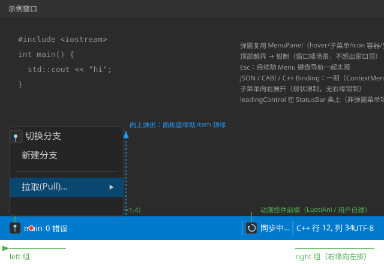

// ============================================================================
// StatusBar_Design.md -- 状态栏控件设计文档
// 上游决策：design/StatusBar_Analysis.md（决策点 1-6 已拍板）
// 实现文件：include/StatusBar.h / src/StatusBar.cpp / src/LayoutParser.cpp(parseStatusBar)
//           src/UICornerstoneAPI.cpp(StatusBar C ABI) / test/test_statusbar.cpp
// ============================================================================

# StatusBar 状态栏控件设计文档

> 状态：**设计定稿 · 已实施（对照源码自检）**
> 前身：[StatusBar_Analysis.md](StatusBar_Analysis.md)（决策点 1-6 拍板；本文档为设计化定稿 + 实施期决策回写）
> 关联：[ContextMenu_Design.md](ContextMenu_Design.md)（MenuPanel 复用先例）、[ListView_Design.md](ListView_Design.md)（leadingControl/属性四层矩阵格式基准）、[Shape_Design.md](Shape_Design.md)（几何图标推荐内容）
> 效果图：[StatusBar_Preview.svg](StatusBar_Preview.svg)（嵌入 §3）
> 修订注记：v1（2026-08-22）——按 Analysis 决策初版实施
> 修订注记：v2（2026-08-25）——**按 ListView_Design 格式重写**：回写实施期决策（缩放三层规则/命中二维逆变换/leadingControl 几何居中与绝对坐标/弹窗共享复用与关闭链/字体懒加载自愈）；修正 JSON 键（实际为 camelCase `fontSize`/`itemHeight`、`align:"right"`）；补属性四层矩阵/焦点系统/测试策略；对照源码自检 2 遍

## 1. 需求概述

VSCode 风格底部状态栏：细长水平条，横向排列若干「段」（segment）——左侧段左对齐、
右侧段右对齐；每段可显示文本、图标（任意控件）、可点击（回调或弹出菜单）。

## 2. 现状调研（关键行号）

| 项目 | 现状 |
|---|---|
| 菜单面板 | MenuPanel（`Menu.h`，hover/子菜单/分隔线/逐项字体）——弹窗直接复用 |
| 弹窗关闭链 | `MenuItem::closeMenuChain()` 向上关闭 MenuPanel/MenuBar（`Menu.cpp:218`） |
| 图标先例 | TreeView leadingControl 增强；StatusBar 一期 icon 机制（Analysis 决策 5/6） |
| 字体加载 | `ConstDef::fontFiles` + ResourceProvider（`StatusBar.cpp:ensureFont`） |
| 测试 | 可视化测试模式 + 帧内 CaptureViewport 截图先例 |

## 3. 架构方案

```
StatusBar : ControlImpl                        （ControlType::StatusBar，一体自绘）
├── m_items（vector<StatusItem>：id/text/rightAlign/leadingControl/onClick/menuPanel/hitRect）
├── m_fontSize（13）/ m_itemHeight（24）/ m_padding / m_spacing
├── m_font（懒加载，字号×scaleXX）
├── m_popupPanel（共享弹窗：直接挂载目标段的 MenuPanel，见 §6.2）
└── m_hoveredItem
```



**关键设计决策**：

| 决策 | 选择 | 理由 / 排除项 |
|---|---|---|
| 弹窗实现 | **直接挂载目标段自带的 MenuPanel**（共享复用） | 零拷贝、菜单项状态天然同步；排除"逐项 addItem 复制到共享空面板"（v1 方案，存在复制遗漏风险，实测曾致空弹窗） |
| 段布局 | 一体自绘（本地空间 relayout） | 段无独立复用价值；排除拆分子控件 |
| 图标对齐 | 槽内**几何居中**（内容无关基准） | 文字型图标内容的基线偏移（Label 行偏移为常量 ≈+8）属内容侧特性，框位补偿治标——建议图标用几何内容（Shape）或内容自行补偿 |

## 4. 数据模型

```cpp
struct StatusItem {
    string id;
    string text;
    bool   rightAlign = false;
    std::shared_ptr<Control> leadingControl;            // 可选图标（不挂树，§5.2）
    std::function<void(std::shared_ptr<StatusItem>)> onClick;
    std::shared_ptr<MenuPanel> menuPanel;               // 可选弹窗菜单
    SRect hitRect;                                      // 段命中/绘制区（本地布局坐标）
};
```

- 段宽 = `m_itemHeight`（图标槽基准）+ 文本宽 + padding/spacing；文本宽优先
  `measureText`（字体就绪时），未就绪按 `text.length() × fontSize × 0.6` 估算，
  字体首次就绪后 relayout 修正（`draw()` 内自愈，`StatusBar.cpp:141`）
- 布局：左组从左向右累加；右组从右向左累加（`relayout`，本地空间）

## 5. 缩放方案（三层规则，TabControl_Design §1.3 同款）

| 层 | 规则 | 实现 |
|---|---|---|
| 布局 | 本地空间（`m_rect.width/height` 内累加 hitRect），与 scale 无关 | `relayout()` |
| 自绘 | `绘制坐标 = drawRect 原点 + 本地×scale`；字体按 `fontSize×scaleXX` 加载 | `draw()`（hover 框/图标框/文字位置全 ×scale） |
| 命中 | `本地 = (屏幕 − drawRect 原点) / scale`，**X/Y 二维**判定 | `hitTestIndex(screenX, screenY)` |

- 字体懒加载自愈：`draw()` 首帧 `ensureFont()`，字体首次就绪触发一次 relayout
  修正估算宽度（`StatusBar.cpp:139-143`）
- 已知约束：字体按加载时 scale 固定；创建后变更 xScale/yScale 不重载字体
  （需 `setFontSize` 触发重建）

## 6. 交互

### 6.1 命中测试与 hover
- `hitTestIndex(screenX, screenY)`：屏幕坐标经 drawRect 原点与 scale **二维逆变换**，
  按 `hitRect` 横向+纵向判定（X/Y 缺一不可——修复记录：原仅判 X，条外垂直区域误触发 hover）
- MouseMove：命中更新 `m_hoveredItem`（hover 提亮 36,142,222）；未命中清除

### 6.2 点击与弹窗
- LMBDown 命中段：带 `menuPanel` → `openPopup`；否则触发 `item.onClick(self)`
- `openPopup`：直接挂载目标段 MenuPanel（`removeControl` 旧 + `addControl` 新 +
  `setContext` + `create`）→ 为无 onClick 的菜单项补 no-op onClick
  （`MenuItem::handleEvent` 仅在 onClick 非空时走 `closeMenuChain`）→ 向上弹出：
  `setPosition(hitRect.left, hitRect.top − panelH)`（**父相对坐标**，子控件
  getDrawRect 自动复合父偏移），顶部越界钳制 → `show()`
- 关闭：点击面板项（`closeMenuChain` 链式 hide，用户回调先于关闭执行）
- 已知约束：弹窗为普通子控件（非 Popup），**外部点击/Esc 不自动关闭**（无 watcher）；
  共享单例语义——同时只弹一个段菜单

### 6.3 焦点系统
- StatusBar **不注册焦点**（纯鼠标交互控件，无 setFocusable）——不参与 Tab 环，
  不绘制焦点环；弹窗内菜单项键盘导航属 MenuPanel 后续增强（Menu 键盘统一项）

## 7. 渲染

- 背景：`m_bgColor`（默认 VSCode 蓝 #007ACC，`fill-color` 可覆盖）——beforeDraw 标准管线
- hover 段：提亮底色 (36,142,222)
- 文本：(235,235,235)，垂直居中于段（`(itemHeight − fontSize)/2`）
- 图标：`leadingControl` **不挂状态栏子树**（无父复合）→ setRect 用**绝对坐标**
  `= drawRect 原点 + 本地×scale`；槽内**几何居中**（方形框 isz = 字号×1.4）。
  对齐基准为几何中心、与内容类型无关——文字型图标的基线偏移（Label 行偏移常量 ≈+8）
  属内容自身特性，建议图标用几何内容（Shape）或内容自行补偿

## 8. 属性一致性（C++ / JSON / CABI / C++ Binding 四层）

> 规则同 ListView_Design §5.6：四层同步无静默缺失；属性类走通用接口，专用函数仅数据/对象类。

| 属性 | C++（规范实现） | JSON | CABI（通用属性，kebab-case） | C++ Binding |
|---|---|---|---|---|
| 字号 `fontSize` | `setFontSize`/`getFontSize` | `"fontSize"` | `SetFloat(inst,bar,"font-size",v)` / `GetFloat` | `Builder.setFontSize` |
| 段高 `itemHeight` | `setItemHeight`/`getItemHeight` | `"itemHeight"` | `SetFloat(inst,bar,"item-height",v)` / `GetFloat` | `Builder.setItemHeight` |

数据/对象类（专用 API，需 id 定位或对象参数）：

| 数据 | C++ | JSON | CABI（专用） | C++ Binding |
|---|---|---|---|---|
| 段列表 `items` | `addStatusItem`/`updateStatusItemText`/`removeStatusItem`/`getStatusItem` | `"items":[{id,text,align,icon,menu,onClick}]` | `StatusBarAddItem`/`StatusBarSetItemText`/`StatusBarRemoveItem` | `Builder.addStatusItem` |
| 段菜单 | `setStatusItemMenu` | `items[].menu`（MenuPanel id 引用） | `StatusBarSetItemMenu` | `Builder.setStatusItemMenu` |
| 段图标 | `setStatusItemLeadingControl` | `items[].icon`（资源引用） | `StatusBarSetItemIcon` | `Builder.setStatusItemLeadingControl` |
| 段回调 | `setStatusItemOnClick` | `items[].onClick`（动作名占位） | —（C++/Binding 层） | `Builder.setStatusItemOnClick` |

## 9. JSON（status-bar）

```json
{
  "type": "status-bar", "id": "status", "rect": [0, 876, 1400, 24],
  "fontSize": 13, "itemHeight": 24,
  "items": [
    {"id": "branch", "text": "main", "icon": "provider:icons/git",
     "menu": "#branchMenu"},
    {"id": "encoding", "text": "UTF-8", "align": "right"}
  ]
}
```

- `parseStatusBar`（`LayoutParser.cpp:1230`）：rect/scale → 构造 → `fontSize`/`itemHeight` →
  逐 item（id/text/`align:"right"` → icon 资源引用 → Actor leadingControl →
  menu → MenuPanel id 引用 → onClick 占位）→ parseEvents → create
- 键名核对：`fontSize`/`itemHeight`/`align`/`icon`/`menu`（`PropertyNames.h:528-536`）

## 10. C ABI / C++ Binding

**C ABI（6 专用函数 + 2 通用属性）**：

| 函数 | 作用 |
|---|---|
| `UICornerstone_CreateStatusBar(inst, x,y,w,h, xs,ys)` | 创建（挂 bench） |
| `UICornerstone_StatusBarAddItem(inst, bar, id, text, rightAlign)` | 添加段 |
| `UICornerstone_StatusBarSetItemText(inst, bar, id, text)` | 改文本 |
| `UICornerstone_StatusBarRemoveItem(inst, bar, id)` | 移除段 |
| `UICornerstone_StatusBarSetItemMenu(inst, bar, id, menuPanel)` | 绑定弹窗（dynamic_pointer_cast 取共享指针） |
| `UICornerstone_StatusBarSetItemIcon(inst, bar, id, ctl)` | 绑定图标控件 |

通用属性：`SetFloat/GetFloat(inst, bar, "font-size"/"item-height", ...)`。

**C++ Binding**：StatusBar 类即规范实现 + `StatusBarBuilder`（LabelBuilder 同款惯例）：
`setFontSize`/`setItemHeight`/`addStatusItem`/`setStatusItemMenu`/`setStatusItemLeadingControl`/
`setStatusItemOnClick` → `build()`（内部 create）。

## 11. 涉及文件清单

| 文件 | 改动 |
|---|---|
| `include/StatusBar.h` / `src/StatusBar.cpp` | StatusBar + StatusItem + StatusBarBuilder |
| `src/LayoutParser.cpp` | `parseStatusBar` + `"status-bar"` 注册 |
| `include/UICornerstoneAPI.h` + `src/UICornerstoneAPI.cpp` | 一期 CABI（§10） |
| `include/PropertyNames.h` | kControlTypeStatusBar / kJsonItemHeight / kJsonAlign / kItemIcon / kJsonMenu / kFontSize / kLineWidthProp 等 |
| `test/test_statusbar.cpp` + `test/CMakeLists.txt` | 断言 + CABI + 缩放 + 点击链路 + 截图 |

## 12. 测试策略（test_statusbar.cpp，20 项全过）

1. **数据断言**（探针不挂树）：addStatusItem×4 / rightAlign / updateStatusItemText /
   removeStatusItem / popup 初始 null / font-size·item-height 回环 / setStatusItemLeadingControl
2. **C ABI**：Create / AddItem / SetItemText / SetItemIcon / SetItemMenu / RemoveItem
3. **缩放**：2.0x 实例（StatusBarBuilder 构建），`getDrawRect = rect×2` 断言 + 截图对照
4. **点击链路**：点分支段 → 弹窗打开（断言）→ 点面板项 → 弹窗关闭（断言）→
   点 encoding 段 → onClick 回调触发（断言）
5. **截图**：normal / popup 双帧 CaptureViewport → Temp/statusbar_*.bmp 逐像素核对
   （文字渲染 / 图标几何居中 / 弹窗面板）

## 13. 决策点（StatusBar_Analysis.md，2026-08-22 拍板）

1. 结构：VSCode 风格一体自绘 ✅
2. 段模型：id/text/rightAlign/leadingControl/onClick/menuPanel ✅
3. 弹窗方向：向上弹出 ✅
4. 图标机制：一期（任意控件 leadingControl）✅
5. 弹窗复用 MenuPanel ✅
6. JSON/CABI/Binding 一期 ✅

## 14. 实施边界与现状限制

- 弹窗 MenuPanel 共享单例：同时只能弹出一个段菜单
- 外部点击/Esc 不自动关闭弹窗（无 watcher）——列后续增强（挂 beforeEventHandlingWatcher）
- 段宽自动按内容，不支持固定宽（后续可加 `width` 属性）
- 段不支持运行时拖拽重排/隐藏
- 字体不随创建后的 scale 变更重载（§5 约束）
