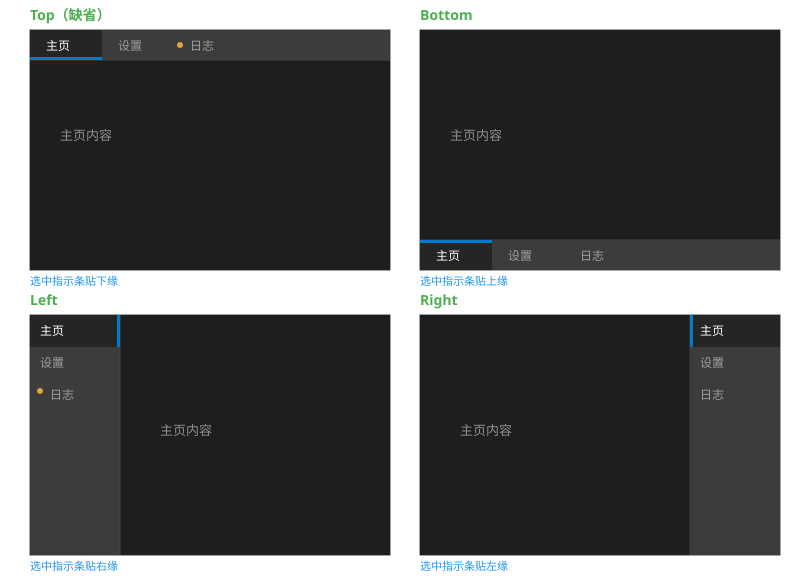

# TabControl（选项卡控件）需求分析

> 状态：**已拍板（2026-08-17）· 转主设计开发 Session 实施**
> 关联：[StatusBar_Analysis.md](StatusBar_Analysis.md)（icon 机制一期拍板，Tab 直接复用）、[TreeView_Enhancement_Design.md](TreeView_Enhancement_Design.md)（JSON item 内嵌控件递归解析先例）、[ComboBox_Design.md](ComboBox_Design.md)（组合控件先例）、[Menu_Enhancement_Analysis.md](Menu_Enhancement_Analysis.md)（键盘导航后续统一）
> 效果图：[TabControl_Preview.svg](TabControl_Preview.svg)（嵌入 §3）
> 修订注记：v1（2026-08-17 拍板）——决策点 1/2/3/5/6/7/8 采纳建议；**决策点 4 否决"后续"，键盘导航一期实现**（方案见 §3.6，本次评审补充）
> 修订注记：v2（2026-08-17）——**对齐 ListView 一致性补充**：① 新增 §8.1 属性一致性矩阵（position/fontSize/currentIndex 四层同步）；② **API 精简**：`TabSetPosition`/`TabSetCurrentIndex`/`TabGetCurrentIndex` 走通用属性接口（`SetEnum("position")`/`SetInt("current-index")`），专用函数仅保留需 index 定位或对象参数的数据操作；③ JSON 补 `"fontSize"`/`"currentIndex"` 字段；④ `WinFrame.h:94` → `:95`（addToClient 实际行号）；⑤ icon 容器边长公式统一"字号×1.4"（与 StatusBar/ListView 一致）

## 1. 需求概述

提供 Tab 控件（选项卡）：

1. 多个页面（页签），一次显示一个
2. 页签条位置四方向可选：**上部（缺省）/ 下部 / 左侧 / 右侧**

## 2. 现状调研（关键行号）

| 项目 | 现状 |
|---|---|
| 现有实现 | **无 Tab**（全库 grep 无命中） |
| 文字旋转 | **TextRenderer 无旋转能力**（`TextRenderer.h:32-37` 仅 drawText(x,y,wrap,color)）→ 竖向页签文字**不旋转**，水平排布（决策点 2） |
| 组合控件先例 | ComboBox : EditBox + Popup + 列表面板 + ScrollBar（`ComboBox.h:24-60`） |
| 主题体系 | StateColor 四态（normal/hover/pressed/disabled，`ControlBase.h:21-56`）+ 主题分类（`parseCommonProperties`） |
| 页面挂载 | Panel/WinFrame 挂子控件先例（`WinFrame::addToClient`，`WinFrame.h:95`） |
| JSON 递归 | `parseControl` type 分发（`LayoutParser.cpp:255-290`）；TreeView item 内嵌控件缺 rect 自动补 `{0,0,0,0}` 占位先例 |
| 事件 | 回调 + JSON `events.onClick` 模式（parseEvents） |
| 测试 | 可视化测试模式（test_menu/test_winframe 先例） |

## 3. 架构方案

```
TabControl : ControlImpl
├── m_tabs（vector<TabPage>）
├── m_currentIndex（当前页）
├── m_position（Top 缺省 / Bottom / Left / Right）
├── tab 条：自绘（矩形 + 标题文字 + hover/选中高亮 + 方向指示条）
└── 内容区：页面控件直接挂 TabControl（setParent），切换 = show/hide + setRect(内容区)
```



### 3.1 数据模型

```cpp
enum class TabPosition { Top, Bottom, Left, Right };   // 缺省 Top

struct TabPage {
    string title;
    shared_ptr<Control> page;           // 页面控件（任意 Control）
    shared_ptr<Control> leadingControl; // 可选：页签图标（StatusBar 同款概念，机制复用）
};

class TabControl : public ControlImpl {
    void setPosition(TabPosition pos);               // 四方向
    int  addTab(const string& title, shared_ptr<Control> page);
    void insertTab(int index, ...) / removeTab(int index);
    void setCurrentIndex(int index);                 // 切换 → 页面 show/hide + onTabChange
    int  getCurrentIndex() const;
    void setTabText(int index, const string& title);
    void setTabLeadingControl(int index, shared_ptr<Control> ctl);
    void setFontSize(float px);                      // 页签文字字号（属性，§8.1 矩阵）
    std::function<void(shared_ptr<TabControl>, int index)> onTabChange;  // 可空
};
```

### 3.2 布局（决策点 1：一体自绘）

- **不拆 TabBar 子控件**：tab 条脱离内容区无独立复用价值，TabControl 一体自绘（对比 ComboBox 拆子面板因列表可滚动复用）——tab 条只画文本/矩形/指示线，无复用需求
- Top（缺省）：tab 条在上，高 = `fontSize×1.4 + 2×padding`；内容区 = 剩余 rect
- Bottom：tab 条在下；Left/Right：tab 条在侧，宽 = `最长标题宽 + 2×padding`，页签竖排堆叠
- `setRect`/`setPosition` 时 relayout：tab 条区 + 内容区（页面控件 `setRect(内容区)` 铺满）

### 3.3 绘制与选中态（VSCode 风格）

- 每页签：文字（+ 可选 leadingControl 容器）居中于 tab 区；hover = StateColor.hover 高亮；**选中 = 高亮底色 + 4px 指示条**（`StateColor.pressed` 变体，颜色可配）
- 指示条位置随方向（贴 tab 条内侧边缘，VSCode 下划线语义）：
  - Top → 指示条贴 tab 条**下缘**；Bottom → 贴**上缘**；Left → 贴**右缘**；Right → 贴**左缘**
- tab 条与内容区间 1px 分隔线（主题 border）
- 选中/未选中文字颜色区分（选中亮色）

### 3.4 交互

- MouseMove：hover 高亮（`hitTest` 遍历 tab 区）
- MouseDown 左键命中页签：`setCurrentIndex` → 旧页 `hide()`、新页 `show()` + `setRect(内容区)` + `onTabChange` 回调
- 页面控件事件由其自身处理（挂 TabControl 子树）
- **键盘导航：一期实现**（决策点 4，方案见 §3.6）

### 3.6 键盘导航方案（一期，决策点 4）

**焦点模型**（仿 WinFrame scope 模式，`WinFrame.cpp:180`）：

- TabControl 构造时 `setFocusable(true)` → 自动注册 FocusManager（`ControlBase.cpp:770`），参与 Tab 循环
- 点击页签/内容区 → `GET_FOCUSMANAGER->focusFirstInScope(this)`（WinFrame 同款）→ `onFocusScopeActivated` 重绘焦点态
- TabControl 为 focus scope：焦点在页签条（TabControl 自身）或页面控件内均属该 scope；Tab/Shift+Tab/Ctrl+Tab 由 Bench 统一拦截（`Bench.cpp:78-106`），TabControl 不处理

**键位**（KeyDown，`TabControl::handleEvent`）：

| 焦点位置 | 键 | 行为 |
|---|---|---|
| TabControl 自身（页签条） | `←`/`→`（Top/Bottom 布局） | 上一/下一页签（循环） |
| TabControl 自身 | `↑`/`↓`（Left/Right 布局） | 上一/下一页签（循环） |
| TabControl 自身 | `Home` / `End` | 首 / 尾页签 |
| 页面控件内 | 方向键 | **不截获**（留给 EditBox 等内部控件） |

- 切换后焦点留在 TabControl（不跳入内容区）；切换行为与鼠标一致（show/hide + onTabChange）

**视觉反馈**：焦点在 TabControl 时页签条绘制焦点环（复用 `drawFocusRing`，Dashed 风格，`ControlBase.cpp:791-797`）；选中页签高亮不变

**与 Menu 键盘的关系**：独立实现——Menu 键盘为 MenuPanel 内部项导航（后续统一），Tab 页签导航不受影响

**测试**：test_tabcontrol 模拟 KeyDown（←/→/Home/End 切换断言、焦点留驻断言、页面控件聚焦时不切换断言）

### 3.5 实施注意点

- 页面控件为 Popup 类浮层（Dialog/WinFrame）时：页面 `hide()` 不自动关闭其弹层（Popup 挂 BENCH 顶层）——与现状 WinFrame hide 行为一致，注明限制
- 页面控件动画 tick：与 StatusBar leadingControl 同链路验证（透传 update/draw）
- `removeTab` 时当前页回退：index 钳制到 `m_tabs.size()-1`

## 4. 竖向页签文字（决策点 2）

- **不旋转**：TextRenderer 无旋转能力（`TextRenderer.h:32-37`），竖向（Left/Right）页签文字水平排布、竖排堆叠，页签宽 = 最长标题 + padding（窄条形）
- 旋转 90° 列**后续增强**（需 TextRenderer 新增旋转绘制或预制竖排文字位图，另行立项）

## 5. 关闭钮（决策点 3）

- VSCode/浏览器标签页惯例带关闭钮（×），**需求未提** → 一期不做，列后续增强（`TabPage.closeable` + 关闭钮绘制/命中 + 关闭后页签重排）

## 6. icon / leadingControl（决策点 6，一期）

- 页签图标复用 **StatusBar 一期已拍板的 icon 机制**（StatusBar_Analysis 决策点 5/6：icon 解析/CABI 随一期落地）——`setTabLeadingControl` + JSON `icon` 字段 + CABI 同款，无需重复设计
- 布局同款：有 → 文字前容器区（边长 = 字号×1.4）；无 → 不留白

## 7. JSON（决策点 7，一期）

```json
{
  "type": "tab-control",
  "rect": {"x": 0, "y": 0, "w": 480, "h": 320},
  "position": "top",
  "fontSize": 13,                // 页签文字字号（缺省对齐 Menu 字号体系）
  "currentIndex": 0,             // 初始选中页（缺省 0）
  "tabs": [
    {"title": "主页", "icon": "provider:icons/home",
     "page": {"type": "panel", "bg": "#F5F5F5"}},
    {"title": "设置", "page": {"type": "panel"}}
  ],
  "events": {"onTabChange": "handleTabChange"}
}
```

- `position`：`top`(缺省)/`bottom`/`left`/`right`
- `tabs` 数组：`title`（键名既有 `kJsonTitle`，`PropertyNames.h:402`）/`icon`（一期，StatusBar 同机制）/`page`（**任意控件 JSON**，复用 `parseControl` type 分发；TreeView 先例：缺 rect 时自动补内容区 rect 铺满——注意与"补 {0,0,0,0} 占位"不同，Tab 页面有确定内容区，直接铺满）
- `events.onTabChange`：复用 parseEvents
- `parseTabControl` 仿 `parseWinFrame`（页面挂载模式）

### 8.1 属性一致性（C++ API / JSON / CABI / C++ Binding 四层同步，ListView §5.6 同规则）

> **规则**：属性四层同步、无静默缺失；分层命名惯例：C++ `set+UpperCamel` / JSON camelCase / CABI 通用属性 kebab-case（既有惯例 "font-size"，`UICornerstoneAPI.h:449-470`）/ Binding `setProperty(key, value)`（键名 = JSON 键）。
> **API 精简原则**：控件级属性 → 通用属性接口；**专用 `TabXxx` 仅保留需 index 定位或对象参数的数据操作**。

| 属性 | C++（规范实现） | JSON | CABI（通用属性） | C++ Binding（统一属性接口） |
|---|---|---|---|---|
| 方向 `position` | `setPosition(TabPosition)` | `"position"` | `SetEnum(inst, tab, "position", "top"/"bottom"/"left"/"right")` | `setProperty("position", ...)` |
| 字号 `fontSize` | `setFontSize` | `"fontSize"` | `SetFloat(inst, tab, "font-size", v)`（"font-size" 为既有 CABI 属性先例） | `setProperty("fontSize", v)` |
| 当前页 `currentIndex` | `setCurrentIndex`/`getCurrentIndex` | `"currentIndex"` | `SetInt(inst, tab, "current-index", v)` / `GetInt` 读 | `setProperty("currentIndex", v)` |

**数据类（专用 API，index 定位）**：

| 操作 | C++ | JSON | CABI | C++ Binding |
|---|---|---|---|---|
| 添加页 | `addTab`/`insertTab` | `"tabs"`（一期） | `TabAddPage(inst, tab, title)` | `Builder.addTab` |
| 改标题 | `setTabText` | `tabs[].title` | `TabSetTitle(inst, tab, index, title)` | `Builder.setTabText` |
| 删除页 | `removeTab` | —（JSON 静态） | —（C++/Binding 层） | `Builder.removeTab` |
| 页图标 | `setTabLeadingControl` | `tabs[].icon`（一期） | `TabSetTabLeadingControl(inst, tab, index, handle)` | `Builder.tabIcon` |
| 页面绑定 | —（`addTab` 已含） | `tabs[].page`（一期） | `TabSetPage(inst, tab, index, page)` | `Builder.addTab(page)` |

**事件**：`onTabChange`——C++ 回调 + JSON `events.onTabChange` + CABI 事件注册 + Binding 回调，四层一期。

> `TabSetPosition`/`TabSetCurrentIndex`/`TabGetCurrentIndex` **不建专用函数**（走通用属性接口，见上表）。

## 8. CABI / C++ Binding（决策点 8，一期）

- **CABI**：`UICornerstone_CreateTabControl` + 数据类专用（`TabAddPage(inst, tab, title)` + `TabSetTitle(inst, tab, index, title)` + `TabSetPage(inst, tab, index, page)` + `TabSetTabLeadingControl(inst, tab, index, handle)`，icon 机制与 StatusBar 共用）+ 控件级属性走通用 setter（`SetEnum("position")`/`SetInt("current-index")`/`SetFloat("font-size")`，§8.1 矩阵）
- **C++ Binding**：TabControl 类 + Builder 暴露（addTab/setTabText/removeTab/tabIcon + 事件 onTabChange + 属性统一 `setProperty` 接口，键名 = JSON camelCase）

## 9. 涉及文件清单

| 文件 | 改动 |
|---|---|
| `include/TabControl.h`（新） | TabControl + TabPage + TabPosition + Builder；ControlType 枚举加 TabControl（`ControlBase.h:139-144`） |
| `src/TabControl.cpp`（新） | 布局（四方向）/绘制（tab 条 + 指示条 + 高亮 + 焦点环）/handleEvent（hover/点击切换/键盘导航 §3.6）/setCurrentIndex 页面 show/hide |
| `src/LayoutParser.cpp` | `parseTabControl` + 控件类型注册（`"tab-control"`，PropertyNames） |
| `include/UICornerstoneAPI.h` + `src/UICornerstoneAPI.cpp` | 一期 CABI（见 §8） |
| Binding（`binding/`） | 一期 Binding 暴露 |
| `test/test_tabcontrol.cpp`（新）+ `test/CMakeLists.txt` | 可视化 + 断言（四方向布局、切换 show/hide、index 钳制、onTabChange） |

## 10. 决策点（2026-08-17 已拍板）

1. **结构**：一体自绘（不拆 TabBar 子控件）✅ 同意
2. **竖向文字**：不旋转（TextRenderer 无旋转能力），旋转列后续增强 ✅ 同意
3. **关闭钮**：一期不做，列后续增强（需求未提）✅ 同意
4. **键盘导航**：~~后续随 Menu 键盘统一~~ → **一期实现**（拍板否决原建议，方案 §3.6 本次评审）✅ 同意
5. **四方向**：一期全做（需求核心）✅ 同意
6. **icon / leadingControl**：一期，复用 StatusBar 已拍板 icon 机制 ✅ 同意
7. **JSON**：一期 `tab-control` + tabs 数组（page 递归 parseControl + 铺满内容区）✅ 同意
8. **CABI / C++ Binding**：一期（StatusBar/ContextMenu 惯例）✅ 同意

## 11. 现状限制（注明，不处理）

- 竖向页签文字不旋转（水平排布）
- 页面内 Popup 浮层不随页面 hide 自动关闭（现状 WinFrame 同行为）
- 页签条无滚动（页签溢出时截断——横向条在窗口过窄时的问题；列后续增强：tab 条滚动/溢出省略）