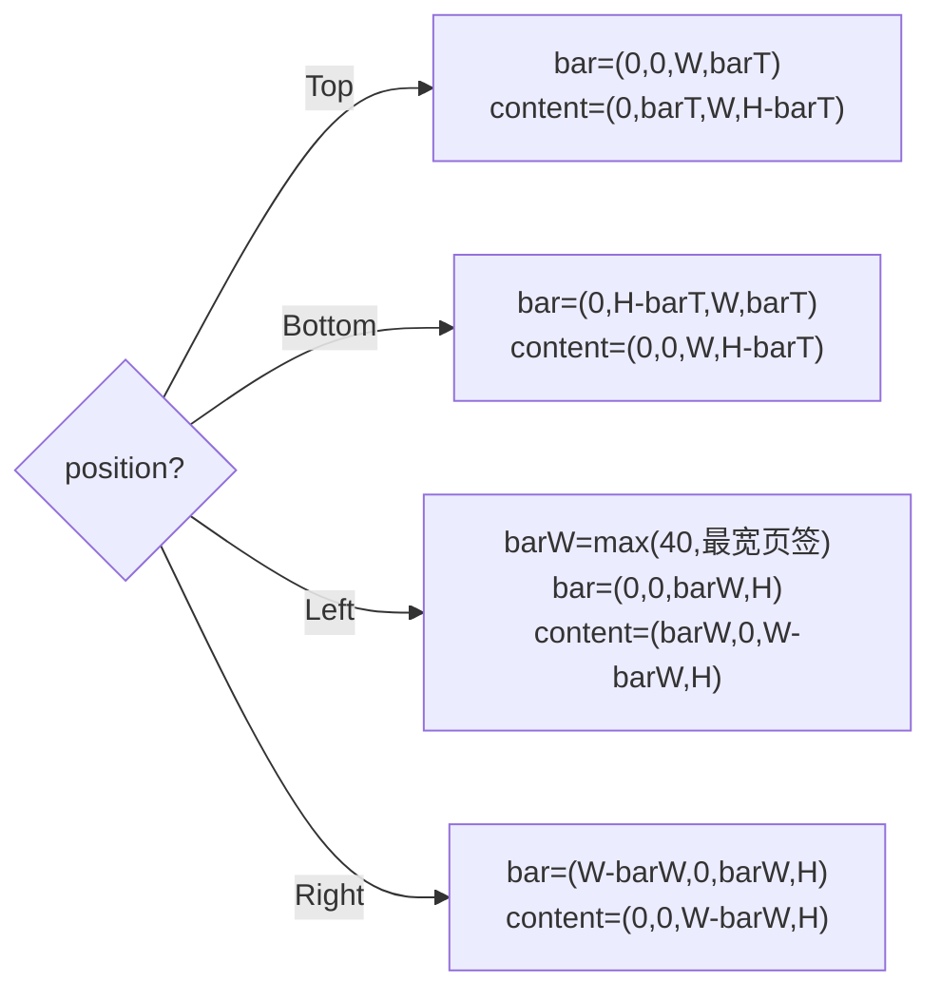

// ============================================================================
// TabControl_Design.md -- 选项卡控件设计文档
// 上游决策：design/TabControl_Analysis.md（决策点 1-8 已拍板，含 v1/v2 修订）
// 实现文件：include/TabControl.h / src/TabControl.cpp / src/LayoutParser.cpp(parseTabControl)
//           src/UICornerstoneAPI.cpp(TabControl C ABI) / test/test_tabcontrol.cpp
// ============================================================================

# TabControl 选项卡控件设计文档

> 状态：**设计定稿 · 已实施（对照源码自检）**
> 前身：[TabControl_Analysis.md](TabControl_Analysis.md)（决策点 1-8 拍板，含 v1/v2 修订；本文档为设计化定稿 + 实施期决策回写）
> 关联：[ListView_Design.md](ListView_Design.md)（格式基准/属性四层矩阵）、[FocusSystem_Design.md](FocusSystem_Design.md)（两层作用域）、[StatusBar_Analysis.md](StatusBar_Analysis.md)（icon 机制）、[TreeView_Enhancement_Design.md](TreeView_Enhancement_Design.md)（页内控件递归先例）
> 效果图：[TabControl_Preview.svg](TabControl_Preview.svg)（嵌入 §3）
> 修订注记：v1（2026-08-21）——按 Analysis 决策初版实施
> 修订注记：v2（2026-08-25）——**重写**：回写实施期决策（坐标系三层规则/焦点作用域边界/命中逆变换/leadingControl 绝对坐标/Builder）；补"架构选择"章节；对照源码自检 2 遍
> 修订注记：v2.1（2026-08-25）——焦点语义精确化（用户拍板）：**边界容器自身归父作用域**——Tab=层内循环、Ctrl+Tab=层切换（页内↔页签条）；Bench 为根边界；FocusManager isEffectivelyVisible 过滤隐藏页控件
> 修订注记：v3（2026-08-25）——**按 ListView_Design 格式重排**：补需求概述/现状调研/效果图嵌入/涉及文件清单/测试策略章节；内容与 v2.1 拍板一致

## 1. 需求概述

1. 多页面（页签）控件：一次显示一个页面
2. 页签条位置四方向可选：**上部（缺省）/ 下部 / 左侧 / 右侧**

## 2. 现状调研（关键行号）

| 项目 | 现状 |
|---|---|
| 现有实现 | 设计时**无 Tab**（全库 grep 无命中；现已实施） |
| 文字旋转 | TextRenderer 无旋转能力（`TextRenderer.h`）→ 竖向页签文字**不旋转**（决策点 2） |
| 组合控件先例 | ComboBox : EditBox + Popup + 列表面板 |
| 页面挂载 | Panel/WinFrame 挂子控件先例（`WinFrame::addToClient`） |
| 焦点体系 | FocusManager 作用域边界 + Bench Tab 拦截（`Bench.cpp:79`）+ FocusSystem_Design §4.3/§4.5 |
| 页内控件递归 | TreeView item 内嵌控件缺 rect 自动补占位先例 |

## 3. 架构方案

```
TabControl : ControlImpl                      （ControlType::TabControl，一体自绘）
├── m_tabs（vector<TabPage>：title/page/leadingControl/tabRect）
├── m_currentIndex / m_position（Top/Bottom/Left/Right）/ m_fontSize(13) / m_padding(8)
├── m_contentRect（内容区，本地）/ m_hoveredTab / m_font（字号×scaleXX）
├── 焦点：setFocusable(true) + setFocusBoundary(true)（两层作用域，§6.2）
└── 页面控件：setParent + addControl 挂 TabControl 子树（切换 = show/hide + setRect 内容区）
```


### 3.1 架构选择（关键设计决策）

| 决策 | 选择 | 理由 / 排除项 |
|---|---|---|
| 整体结构（决策点 1） | **A. 一体自绘**（页签条自绘，页面挂子树） | 页签条脱离内容区无复用价值；排除 B 拆 TabBar 子控件（双份生命周期+同步成本，ComboBox 拆分先例不适用） |
| 焦点模型 | **A. 两层作用域**：TabControl = focus boundary，**边界容器自身归父作用域** | 见 §6.2 键位表；排除 B 无边界全局环（多实例一起动作，实测缺陷）、C 容器自身入内层环（页签条无法与外部同环，v2 实施评审否决） |
| 竖排文字（决策点 2） | 不旋转，水平排布竖排堆叠 | TextRenderer 无旋转能力；旋转列后续增强 |
| 关闭钮（决策点 3） | 一期不做 | 需求未提；`TabPage.closeable` 后续增强 |

## 4. 数据模型

```cpp
enum class TabPosition { Top, Bottom, Left, Right };   // 缺省 Top

struct TabPage {
    std::string title;
    std::shared_ptr<Control> page;            // 页面控件（任意 Control）
    std::shared_ptr<Control> leadingControl;  // 可选页签图标（不挂树，§5.2）
    SRect tabRect;                            // 页签区（本地布局坐标）
};

class TabControl : public ControlImpl {
    std::vector<TabPage> m_tabs;
    int  m_currentIndex = -1;                 // -1 = 无页
    TabPosition m_position = TabPosition::Top;
    float m_fontSize = 13.0f, m_padding = 8.0f;
    int  m_hoveredTab = -1;
    SRect m_contentRect;                      // 内容区（本地）
    OnTabChange m_onTabChange;                // (shared_ptr<TabControl>, int)
    SharedFont m_font;                        // 按 fontSize×scaleXX 加载
};
```

构造：`setFocusable(true)` + `setFocusBoundary(true)` + `relayout()`。

## 5. 数据操作语义

| 操作 | 语义 |
|---|---|
| `addTab(title, page)` | 追加；page `setParent`+`addControl` 挂树；relayout；**首页自动选中**（currentIndex<0 → 0）；返回索引 |
| `insertTab(index, ...)` | index 钳制 [0, count]；插入点 ≤ currentIndex 时 currentIndex++ |
| `removeTab(index)` | 越界静默返回；removeControl 页面；currentIndex>index 时 --；==index 时钳制到 count-1（空表 -1） |
| `setCurrentIndex(i)` | 越界静默返回；**同值 no-op（不触发 onTabChange）**；空表置 -1 |
| `setTabText` / `setTabLeadingControl` | 更新 + relayout（条宽随内容变化） |
| `setTabPage(index, page)` | 旧页 removeControl → 换页挂树 → applyCurrentPage |
| `setPosition` / `setFontSize` / `setRect` | 均触发 relayout；setFontSize 额外重建字体 |
| `getTabCount` / `getTabs` | 只读访问 |

## 6. 布局与渲染

### 6.1 布局（relayout，本地空间）



- `barT = fontSize×1.4 + 2×padding`（Top/Bottom 条厚、Left/Right 页签高）
- 页签尺寸：宽 = `measureText(标题) + 2×padding`（+图标槽 `fontSize×1.4+4`）；字体未就绪按
  `标题长度×fontSize×0.6` 估算，字体就绪后 relayout 修正
- `m_contentRect` 记录内容区；`applyCurrentPage()` 将每页 `setRect(内容区)`（本地，子控件
  自动复合父链）并 `setVisible(i == currentIndex)`

### 6.2 缩放方案（三层规则）

| 层 | 规则 | 实现 |
|---|---|---|
| 布局 | 本地空间（barT/条宽/tabRect/内容区），与 scale 无关 | `relayout()` |
| 自绘 | `绘制坐标 = drawRect 原点 + 本地×scale`；字体按 `fontSize×scaleXX` 加载；指示条厚 `3×scale` | `draw()`/`drawTabBar()` |
| 命中 | `本地 = (屏幕 − drawRect 原点) / scale`（逆变换） | `hitTestTab(screenX, screenY)` |

**leadingControl 特例**：页签图标**不挂 TabControl 子树**（无父复合）→ `setRect` 用
**绝对坐标** `= drawRect 原点 + 本地×scale`，尺寸 `isz×scale`（反例教训：按子控件语义写
父相对坐标会画到屏幕原点）。图标内容须自行保证 RenderDevice 就绪
（未挂树控件：显式 `setContext` + `create`，同 StatusBar 惯例）。

已知约束：字体按加载时 scale 固定；创建后变更 xScale/yScale 不重载字体。

### 6.3 渲染流水线

```
beforeDraw（整体底色/边框，框架默认）
→ 内容区底色 (50,50,56)：drawRect 原点 + m_contentRect×scale
→ drawTabBar：逐页签——
     底色：选中(45,45,52) / hover(60,60,70) / 常态(37,37,42)
     指示条：选中页签，蓝色(0,122,204)，厚 3×scale，贴页签条内侧缘
             （Top→下缘 / Bottom→上缘 / Left→右缘 / Right→左缘）
     图标：leadingControl->setRect(绝对) + draw()
     标题：选中(235,235,235) / 常态(180,180,185)
→ ControlImpl::draw（子控件 = 各页，仅当前页可见；页内控件焦点环由引擎绘制）
→ afterDraw
```

## 7. 交互

### 7.1 鼠标
- MouseMove：`hitTestTab`（逆变换）更新 hover
- MouseDown 左键命中页签：`focusControl(this)`（键盘导航跟随焦点实例）→
  `setCurrentIndex` → `onTabChange` → 消费事件；未命中页签 → 透传子控件

### 7.2 焦点系统（两层作用域，v2.1 拍板）

TabControl = **焦点作用域边界**（`setFocusBoundary(true)`，注册 `m_boundaries`）；
**边界容器自身归父作用域**（`findFocusScope` 自父级起查）——页签条与外部控件同环，
页内控件自成内环：

| 焦点位置 | Tab | Ctrl+Tab |
|---|---|---|
| 页内控件（EditBox 等） | 页内循环（edit1↔edit2…） | **退出**到页签条（TabControl 获焦） |
| 页签条（TabControl 自身） | **外层循环**（页签条 + TabControl 外部控件，不进页内） | **进入**页内（focusFirstInScope，首个页内控件） |
| 外部控件 | 外层循环 | 按作用域轮转进入（focusNextScope/focusPrevScope） |

框架支撑：`findFocusScope` 自父级起查；`setFocusBoundary` 注册 `m_boundaries`；
Bench 为根作用域边界；`FocusManager::isEffectivelyVisible` 过滤隐藏页控件
（任一祖先隐藏即不可达——隐藏页内控件不可经 Tab 聚焦）。

### 7.3 键盘（决策点 4：一期实现）
- **方向键仅 `getFocused()`（页签条获焦）时响应**（多实例互不干扰；未焦点则透传）
  - Top/Bottom：`←/→` 循环切换；Left/Right：`↑/↓` 循环切换；`Home`/`End` 首/尾
- 焦点在页面控件内时方向键由该控件处理（EditBox 等），TabControl 不截获
- 焦点环（页内控件）：引擎 `drawFocusRing`（m_frameDrawRect 缩放正确）；
  测试截图 tab_focus1/2.bmp 验证环随 Tab 迁移

## 8. 属性一致性（C++ / JSON / CABI / C++ Binding 四层）

> 规则同 ListView_Design §5.6：四层同步无静默缺失；属性类走通用接口（不建
> TabSetPosition/TabSetCurrentIndex 专用函数），专用函数仅数据/对象类。

| 属性 | C++（规范实现） | JSON | CABI（通用属性） | C++ Binding |
|---|---|---|---|---|
| 方向 `position` | `setPosition(TabPosition)` | `"position"`: top/bottom/left/right | `SetEnum(inst,tab,"position",...)` / `GetEnum` | `Builder.setPosition` |
| 字号 `fontSize` | `setFontSize`/`getFontSize` | `"fontSize"` | `SetFloat(inst,tab,"font-size",v)` / `GetFloat` | `Builder.setFontSize` |
| 当前页 `currentIndex` | `setCurrentIndex`/`getCurrentIndex` | `"currentIndex"` | `SetInt(inst,tab,"current-index",v)` / `GetInt` | `Builder.setCurrentIndex` |

数据/对象类（专用 API）：

| 数据 | C++ | JSON | CABI（专用） | C++ Binding |
|---|---|---|---|---|
| 页列表 `tabs` | `addTab`/`insertTab`/`removeTab`/`getTabCount`/`getTabs` | `"tabs":[{title,icon,page}]` | `TabAddPage(inst,tab,title)→index` | `Builder.addTab` |
| 页标题 | `setTabText` | `tabs[].title` | `TabSetTitle(inst,tab,i,title)` | —（Builder.addTab 覆盖） |
| 页面绑定 | `setTabPage` | `tabs[].page`（递归 parseControl） | `TabSetPage(inst,tab,i,page)` | —（Builder.addTab 覆盖） |
| 页图标 | `setTabLeadingControl` | `tabs[].icon`（资源引用） | `TabSetTabLeadingControl(inst,tab,i,ctl)` | —（后续 Builder 扩展） |
| 事件 | `setOnTabChange` | `events.onTabChange` | 事件注册 | `Builder.setOnTabChange` |

## 9. JSON（tab-control）

```json
{
  "type": "tab-control", "id": "tabs", "rect": [0, 0, 480, 320],
  "position": "top", "fontSize": 13, "currentIndex": 1,
  "tabs": [
    {"title": "Home", "page": {"type": "panel"}},
    {"title": "Settings", "page": {"type": "panel"}}
  ],
  "events": {"onTabChange": "handleTabChange"}
}
```

- `parseTabControl`（`LayoutParser.cpp`）：rect/scale → 构造 → position/fontSize →
  逐 tab（title + page 递归 `parseControl`，缺 rect 自动补 `{0,0,0,0}` 占位、挂树后由
  applyCurrentPage 铺满内容区 + icon 资源引用 → Actor leadingControl）→
  currentIndex → parseEvents → create

## 10. C ABI / C++ Binding

**C ABI（5 专用函数 + 3 通用属性）**：

| 函数 | 作用 |
|---|---|
| `UICornerstone_CreateTabControl(inst, x,y,w,h, xs,ys)` | 创建（挂 bench） |
| `UICornerstone_TabAddPage(inst, tab, title)` | 添加页（仅标题，页后续 TabSetPage）→ 返回索引 |
| `UICornerstone_TabSetTitle(inst, tab, index, title)` | 改页签标题 |
| `UICornerstone_TabSetPage(inst, tab, index, page)` | 绑定页面控件 |
| `UICornerstone_TabSetTabLeadingControl(inst, tab, index, ctl)` | 绑定页签图标 |

通用属性：`SetEnum/GetEnum("position")`、`SetInt/GetInt("current-index")`、
`SetFloat/GetFloat("font-size")`；`GetControlType` → `"tab-control"`。

**C++ Binding**：TabControl 类即规范实现 + `TabControlBuilder`（LabelBuilder 同款惯例）：
`setPosition`/`setFontSize`/`addTab`/`setCurrentIndex`/`setOnTabChange` → `build()`（内部 create）。
（`setTabLeadingControl` 经类 API 直用；Builder 扩展后续。）

## 11. 涉及文件清单

| 文件 | 改动 |
|---|---|
| `include/TabControl.h` / `src/TabControl.cpp` | TabControl + TabPage + TabPosition + TabControlBuilder |
| `src/LayoutParser.cpp` | `parseTabControl` + `"tab-control"` 注册 |
| `include/UICornerstoneAPI.h` + `src/UICornerstoneAPI.cpp` | 一期 CABI（§10）+ GetControlType 分支 |
| `include/PropertyNames.h` | kControlTypeTabControl / kJsonTabs / kJsonPage / kJsonPosition / kJsonCurrentIndex |
| `src/FocusManager.cpp` + `include/FocusManager.h` | isEffectivelyVisible（两层作用域支撑）+ findFocusScope 父级起查 |
| `src/Bench.cpp` | 根作用域边界（setFocusBoundary(true)） |
| `test/test_tabcontrol.cpp` + `test/CMakeLists.txt` | 断言 + CABI + JSON + 焦点时序 + 缩放对照 + 截图 |

## 12. 测试策略（test_tabcontrol.cpp，40 项全过）

1. **CPU 断言**（探针，setFocused 前置）：addTab 序号/首页自动选中/页面显隐互斥/
   onTabChange/键盘循环(←→HomeEnd)/removeTab 钳制/position·fontSize
2. **C ABI**：Create / TabAddPage 序号 / TabSetPage / TabSetTitle / TabSetTabLeadingControl /
   SetEnum(position) / SetInt(current-index) / SetFloat(font-size) / GetInt 回读
3. **JSON**：解析 / tabs 数 / currentIndex / position
4. **可视化矩阵**：四方向（指示条贴内侧缘）/ 页面差异化底色+标签切换（红→蓝）/
   **缩放对照 normal vs 2.0x**（页签条/文字/指示条/页面等比，TabControlBuilder 构建）/
   **leadingControl**（页签图标 蓝圆/绿方/橙圆）
5. **焦点时序**（同帧派发避免窗口后台失焦干扰）：点击 edit1 获焦 → Tab→edit2（页内循环，
   tab_focus1/2.bmp 焦点环截图）→ Ctrl+Tab 退出到页签条 → 再按进入页内 →
   页签条上 Tab 走外层环（不进页内）
6. **回归**：FocusManager 语义变化影响全局——5 套控件测试 + test_winframe 全绿

## 13. 决策点（TabControl_Analysis.md，2026-08-17 拍板）

1. **结构**：一体自绘（不拆 TabBar 子控件）✅
2. **竖向文字**：不旋转（旋转列后续增强）✅
3. **关闭钮**：一期不做（需求未提）✅
4. **键盘导航**：一期实现（否决"后续随 Menu 统一"，方案 §7.3）✅
5. **四方向**：一期全做 ✅
6. **icon/leadingControl**：一期，复用 StatusBar icon 机制 ✅
7. **JSON**：`tab-control` + tabs 数组（page 递归铺满）✅
8. **CABI/Binding**：一期 ✅
9. **焦点两层作用域**（v2.1 用户拍板）：Tab=层内循环、Ctrl+Tab=层切换 ✅

## 14. 实施边界与现状限制

- 关闭钮不做（决策点 3）
- 竖排页签文字不旋转（决策点 2）
- 页面内 Popup 浮层不随页面 hide 自动关闭（与 WinFrame 现状一致）
- 页签条无滚动：页签总宽超出控件时截断（列后续增强）
- hover 态仅在 MouseMove 到达时更新，鼠标离开不清除（框架无对应广播）
- 字体不随创建后的 scale 变更重载（需 setFontSize 触发）
- 页面内控件获焦后切换页签，焦点不自动迁移（隐藏页控件被 focusNext 过滤）
- 页签图标内容须自行保证 RenderDevice 就绪（不挂树控件，§6.2）
