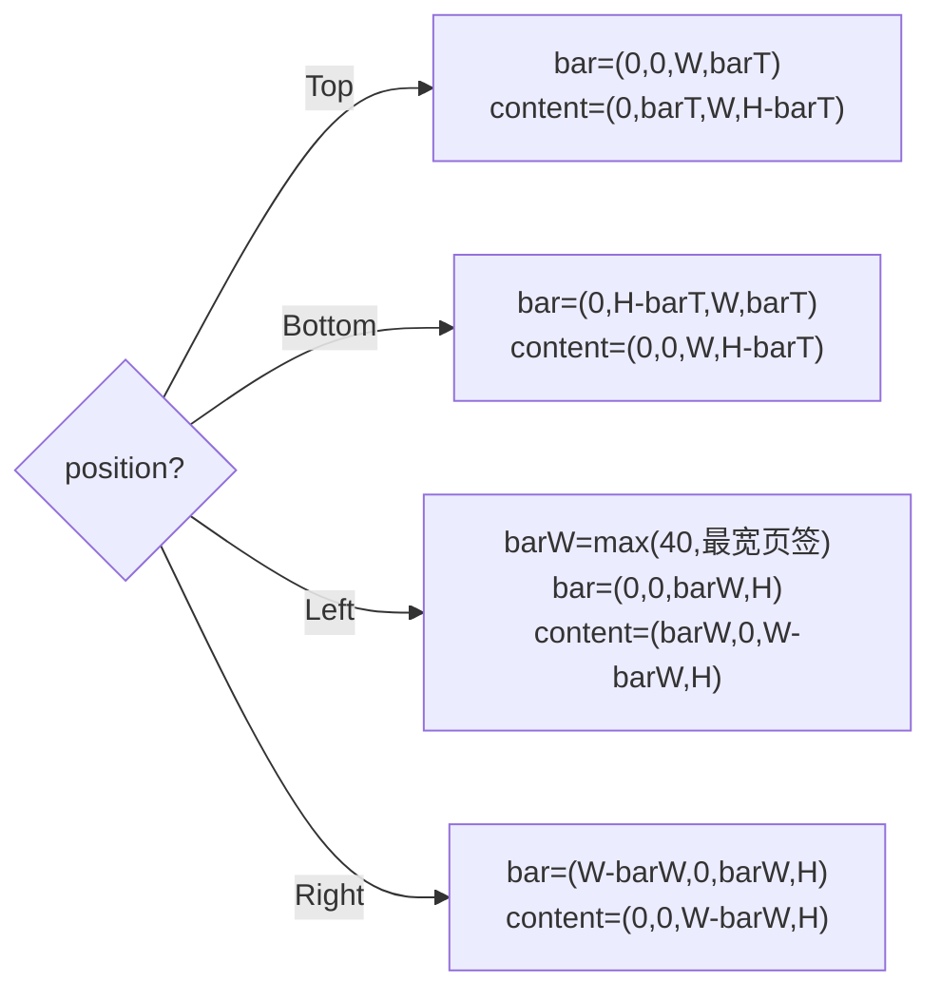

// ============================================================================
// TabControl_Design.md -- 选项卡控件设计文档
// 上游决策：design/TabControl_Analysis.md（决策点 1-8 已拍板，含 v1/v2 修订）
// 实现文件：include/TabControl.h / src/TabControl.cpp / src/LayoutParser.cpp(parseTabControl)
//           src/UICornerstoneAPI.cpp(TabControl C ABI) / test/test_tabcontrol.cpp
// ============================================================================

# TabControl 选项卡控件

## 修订记录

| 版本 | 日期 | 内容 |
|---|---|---|
| v1 | 2026-08-21 | 按 Analysis 决策初版实施 |
| v2 | 2026-08-25 | **重写**：回写实施期验证的关键决策（坐标系与缩放体系、焦点作用域边界、命中逆变换、leadingControl 坐标语义、Builder）；补"架构选择"章节；对照源码自检 2 遍 |

## 1. 架构选择（关键设计决策）

### 1.1 整体结构：一体自绘（决策点 1 ✅）

| 方案 | 优点 | 缺点 | 结论 |
|---|---|---|---|
| **A. 一体自绘**（TabControl 自绘页签条） | 零额外子控件；绘制/命中单点可控；无复用需求（页签条脱离内容区无意义） | 页签条渲染逻辑内聚在控件内 | ✅ 采纳 |
| B. 拆 TabBar 子控件（ComboBox 先例） | 列表可滚动时复用有价值 | 页签条无滚动/无复用场景，徒增子控件管理与事件转发 | ❌ 排除（决策点 1） |

页面挂载采用 **WinFrame::addToClient 同款模式**：页面控件挂 TabControl 子树（`setParent`+`addControl`），
切换 = `setVisible` + `setRect(内容区)`，不销毁重建。

### 1.2 焦点模型：TabControl 为焦点作用域边界

| 方案 | 行为 | 结论 |
|---|---|---|
| **A. TabControl = focus boundary**（`setFocusBoundary(true)`） | Tab 在本控件页内控件循环；Ctrl+Tab 跨到其它作用域；方向键只作用于焦点实例 | ✅ 采纳（FocusSystem_Design §4.3 作用域规则 + TabControl_Analysis §3.6） |
| B. 无边界（全局 Tab 环） | 多实例同屏时 Tab 环互相穿插；键盘导航无法定位实例 | ❌ 排除（实测多实例一起动作缺陷） |

依据：TabControl_Analysis §3.6"TabControl 为 focus scope：焦点在页签条或页面控件内均属该 scope"。

### 1.3 缩放体系：布局本地化 + 绘制/命中双变换

框架坐标语义（ControlBase::getDrawRect）：`m_rect` 为**父相对本地坐标**；绘制区
`drawRect = m_rect×scale + 父 drawRect 偏移`。由此推导三层规则：

| 层 | 规则 | 依据 |
|---|---|---|
| **布局**（relayout） | 全部在本地空间计算（barT/条宽/tabRect/内容区），与 scale 无关 | 子控件经自身 getDrawRect 自动复合父链 |
| **自绘**（draw/drawTabBar） | `绘制坐标 = drawRect 原点 + 本地×scale`；字体按 `fontSize×scaleXX` 加载 | 实测 1.5x/2.0x 对照截图验证 |
| **命中**（hitTestTab） | `本地 = (屏幕 - drawRect 原点) / scale`（逆变换） | hover/点击在缩放实例上定位正确 |

**leadingControl 特例**：页签图标**不挂 TabControl 子树**（无父复合，getDrawRect 即原始 rect），
`setRect` 必须用**绝对坐标** `= drawRect 原点 + 本地×scale`，尺寸 `isz×scale`。
（反例教训：按子控件语义写父相对坐标会画到屏幕原点。）

## 2. 数据模型

```cpp
enum class TabPosition { Top, Bottom, Left, Right };   // 缺省 Top

struct TabPage {
    std::string title;
    std::shared_ptr<Control> page;            // 页面控件（任意 Control）
    std::shared_ptr<Control> leadingControl;  // 可选页签图标（不挂树）
    SRect tabRect;                            // 页签区（本地布局坐标）
};

class TabControl : public ControlImpl {       // ControlType::TabControl
    std::vector<TabPage> m_tabs;
    int  m_currentIndex = -1;                 // -1 = 无页
    TabPosition m_position = TabPosition::Top;
    float m_fontSize = 13.0f;
    float m_padding  = 8.0f;
    int  m_hoveredTab = -1;
    SRect m_contentRect;                      // 内容区（本地）
    OnTabChange m_onTabChange;                // (shared_ptr<TabControl>, int)
    SharedFont m_font;                        // 按 fontSize×scaleXX 加载
};
```

构造：`setFocusable(true)` + `setFocusBoundary(true)` + `relayout()`。

## 3. 数据操作语义

| 操作 | 语义 |
|---|---|
| `addTab(title, page)` | 追加；page `setParent`+`addControl` 挂树；relayout；**首页自动选中**（currentIndex<0 → 0）；返回索引 |
| `insertTab(index, ...)` | index 钳制 [0, count]；插入点 ≤ 当前 currentIndex 时 currentIndex++ |
| `removeTab(index)` | 越界静默返回；removeControl 页面；currentIndex>index 时 --；==index 时钳制到 count-1（空表 -1） |
| `setCurrentIndex(i)` | 越界静默返回；**同值 no-op（不触发 onTabChange）**；空表置 -1 |
| `setTabText` / `setTabLeadingControl` | 更新 + relayout（条宽随内容变化） |
| `setTabPage(index, page)` | 旧页 removeControl → 换页挂树 → applyCurrentPage |
| `setPosition` / `setFontSize` / `setRect` | 均触发 relayout；setFontSize 额外重建字体 |

## 4. 布局（relayout，本地空间）



- `barT = fontSize×1.4 + 2×padding`（Top/Bottom 条厚、Left/Right 页签高）
- 页签尺寸：宽 = `measureText(标题) + 2×padding`（+图标槽 `fontSize×1.4+4`）；字体未就绪时按
  `标题长度×fontSize×0.6` 估算，字体就绪后 relayout 修正
- Top/Bottom 页签横排（x 累进）；Left/Right 竖排（y 累进），条宽取最宽页签（下限 40）
- 竖排**文字不旋转**（决策点 2，TextRenderer 无旋转能力）
- `m_contentRect` 记录内容区；`applyCurrentPage()` 将每页 `setRect(内容区)`（本地，子控件自动复合）
  并 `setVisible(i == currentIndex)`

## 5. 绘制流水线

```
beforeDraw（整体底色/边框，框架默认）
→ 内容区底色 (50,50,56)：drawRect 原点 + m_contentRect×scale
→ drawTabBar：逐页签——
     底色：选中(45,45,52) / hover(60,60,70) / 常态(37,37,42)
     指示条：选中页签，蓝色(0,122,204)，厚 3×scale，贴页签条内侧缘
             （Top→下缘 / Bottom→上缘 / Left→右缘 / Right→左缘）
     图标：leadingControl->setRect(绝对) + draw()
     标题：选中(235,235,235) / 常态(180,180,185)
→ ControlImpl::draw（子控件 = 各页，仅当前页可见；页内控件焦点环由引擎绘制）
→ afterDraw
```

## 6. 交互

### 6.1 鼠标
- **MouseMove**：`hitTestTab`（逆变换）更新 hover
- **MouseDown 左键命中页签**：`focusControl(this)`（键盘导航跟随焦点实例）→ `setCurrentIndex` →
  `onTabChange` 回调 → 消费事件；未命中页签 → 透传子控件（页面交互不受影响）

### 6.2 键盘（焦点门控）
- **仅 `getFocused()` 时响应**（多实例互不干扰；未焦点则透传）
- Top/Bottom：`←/→` 循环切换；Left/Right：`↑/↓` 循环切换；`Home`/`End` 首/尾
- 焦点在页面控件内时方向键由该控件处理（EditBox 等），TabControl 不截获
- `Tab`：Bench 拦截 → focusNext **限制在本作用域**（页内控件循环：页签条 ↔ 页内 EditBox 等）
- `Ctrl+Tab`：跨作用域（FocusSystem_Design §4.5）

### 6.3 焦点环（页内控件）
页面内 EditBox 等可聚焦控件获焦后，焦点环由引擎 `drawFocusRing` 绘制（基于
m_frameDrawRect = getDrawRect，缩放正确）；`Tab` 依次切换，截图验证见测试矩阵。

## 7. 属性（四层同步）

| 属性 | C++ | JSON | C ABI（通用属性） | Binding |
|---|---|---|---|---|
| 方向 | `setPosition(TabPosition)` | `"position"`: top/bottom/left/right | `SetEnum("position")` | `setProperty` |
| 字号 | `setFontSize(float)` | `"fontSize"` | `SetFloat("font-size")` | `setProperty` |
| 当前页 | `setCurrentIndex`/`getCurrentIndex` | `"currentIndex"` | `SetInt`/`GetInt("current-index")` | `setProperty` |

数据类专用 API：`addTab` / `insertTab` / `removeTab` / `setTabText` / `setTabPage` /
`setTabLeadingControl`；`getTabCount` / `getTabs` / `getPosition` / `getFontSize`；
事件 `setOnTabChange`。

**C ABI 一期**：`CreateTabControl` / `TabAddPage(inst,tab,title)→index` / `TabSetTitle(inst,tab,i,title)` /
`TabSetPage(inst,tab,i,page)` / `TabSetTabLeadingControl(inst,tab,i,ctl)`；`GetControlType` → "tab-control"。

**Builder**（LabelBuilder 同款惯例）：`TabControlBuilder(parent,rect,xScale,yScale)` →
`setPosition`/`setFontSize`/`addTab`/`setCurrentIndex`/`setOnTabChange` → `build()`（内部 create）。

## 8. JSON（决策点 7）

```json
{
  "type": "tab-control", "id": "tabs", "rect": [0,0,480,320],
  "position": "top", "fontSize": 13, "currentIndex": 1,
  "tabs": [
    {"title": "Home", "page": {"type": "panel"}},
    {"title": "Settings", "page": {"type": "panel"}}
  ]
}
```

- `parseTabControl`：rect/scale → 构造 → position/fontSize → 逐 tab（title + page 递归
  `parseControl`，缺 rect 自动补 `{0,0,0,0}` 占位、挂树后由 applyCurrentPage 铺满内容区 +
  icon → Actor leadingControl）→ currentIndex → parseEvents（onTabChange）→ create

## 9. 测试矩阵（test_tabcontrol.cpp，35 项全过）

| 组 | 用例 |
|---|---|
| CPU 断言 | addTab 序号 / 首页自动选中 / 页面显隐互斥 / onTabChange / 键盘循环(←→HomeEnd，探针 setFocused 前置) / removeTab 钳制 / position/fontSize |
| C ABI | Create / TabAddPage 序号 / TabSetPage / TabSetTitle / TabSetTabLeadingControl / SetEnum(position) / SetInt(current-index) / SetFloat(font-size) / GetInt 回读 |
| JSON | 解析 / tabs 数 / currentIndex / position |
| 可视化 | 四方向矩阵（指示条贴内侧缘） / 页面差异化底色+标签切换（红→蓝） / **缩放对照 normal vs 2.0x**（页签条/文字/指示条/页面等比） / **焦点环**：主页页 2×EditBox，点击获焦 → Tab 切换（tab_focus1/2.bmp 截图） |

已知测试注意点（非控件缺陷）：
- 合成 KeyDown 必须置 `keyEvent.mod = KeyMod::None`（事件未零化，垃圾 mod 位会被 Bench 误判 Shift→focusPrev）
- auto 无人值守模式下窗口后台化的真实失焦事件会清焦点：焦点断言需与 Tab 派发同帧完成

## 10. 已知约束

- 关闭钮一期不做（决策点 3，需求未提）
- 竖排页签文字不旋转（决策点 2）
- 页面内 Popup 浮层不随页面 hide 自动关闭（与 WinFrame 现状一致）
- 页签条无滚动：页签总宽超出控件时截断（列后续增强）
- hover 态仅在 MouseMove 到达时更新，鼠标离开控件不清除（框架无对应广播，现状）
- 字体按加载时 scale 固定；控件创建后变更 xScale/yScale 不重载字体（需 setFontSize 触发）
- 页面内控件获焦后若切换页签，焦点不自动迁移（隐藏页控件被 focusNext 过滤，Tab 不会到达）
