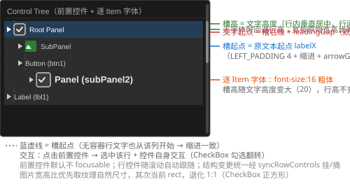

# TreeView 增强设计文档（Item 前置控件容器 + 逐 Item 字体）

> 状态：**已实施**（2026-08-17，提交 73a6f3d）· 与源码一致
> 关联：[TreeView_Design.md](TreeView_Design.md)、[ControlBase_Design.md](ControlBase_Design.md)、[CheckBox_Design.md](CheckBox_Design.md)
> 本文档由 TreeView_Enhancement_Analysis.md 改写定稿；几何/行为以 `src/TreeView.cpp` 实测为准。

## 1. 需求概述

1. **Item 前置控件容器**：每个 TreeView Item 前面预留一个控件容器位置，可放置图片（Actor/Image）、CheckBox 等任意控件
2. **逐 Item 字体属性**：每个 Item 可独立设置字体（FontName）与字号，未设置时继承 TreeView 级字体

## 2. 视觉效果图



- 槽起点 = 原文本起点 `labelX`（= LEFT_PADDING 4 + 缩进 + arrowGap 16），与无容器时文本缩进一致；有箭头行箭头在图片左侧不重叠，局部坐标恒非负
- 槽高 = 行内文字高度（垂直居中，行间留空隙）；无字体时回退行高；宽按原始宽高比等比缩放
- 文字起点 = 槽右缘 + leadingGap（6px 默认）；逐 Item 字体行（font-size 增大/加粗）槽高随之变大，行高不变
- 交互：点击前置控件同时选中该行，控件自身交互（如 CheckBox 勾选翻转）照常生效

> 注：以上矢量图为 SVG 格式，可导入 [draw.io](https://app.diagrams.net) 进行编辑（File → Import → SVG → 选择文件），编辑后可重新导出为 SVG 替换。

## 3. 关键设计决策（含结论）

| # | 决策点 | 结论 |
|---|---|---|
| 1 | 行控件点击是否**不选中行**？ | **采纳"点击控件同时选中行"**：先 `selectNode`，再 `return false` 不消费，事件落入子控件分发完成控件交互 |
| 2 | clip 方案 A（行控件单独 clip）还是 B（整段子控件移入 clip）？ | **采纳方案 A**，定稿实现为"行循环内绘制 + 子控件循环排除"——单独 pushClipRect 的原始写法在 popClipRect 之后无法复用 cr，且会与子控件循环同帧重复绘制 |
| 3 | 行控件尺寸：固定还是自适应？ | **按文字高度自适应**（槽高 = 文字高，无字体回退行高），宽按原始宽高比等比缩放（纹理自然尺寸优先 → 当前 rect → 退化 1:1） |
| 4 | JSON 第二期是否立项？控件类型范围？ | **立项**，复用 `parseControl` type 分发（check-box/image 等任意控件类型），item 内控件缺 rect 自动补 `{0,0,0,0}` 占位 |
| 5 | 需求 2 的继承语义（`fontSize==0` 继承）？ | **可接受**：FontName 枚举无 None 值，`fontSize==0` 即继承 TreeView 级字号，fontName 仅在 fontSize>0 时被读取；字重/字族独立覆盖低频，不做 |
| 6 | 行控件焦点（v2 新增）？ | **默认不 focusable**：`setFocusable(true)` 会注册进全局 FocusManager Tab 链，与 TreeView 自身键盘导航打架；第一期交互仅鼠标 |

## 4. 详细设计

### 4.1 数据模型（`include/TreeView.h:17-28`）

```cpp
struct TreeNode {
    std::string id;
    std::string label;
    bool expanded = false;
    std::vector<std::shared_ptr<TreeNode>> children;
    void* userData = nullptr;
    std::shared_ptr<Control> leadingControl;  // 前置控件（CheckBox/Actor/Image 等）；高度自适应
    float leadingGap = 6.0f;                  // 控件与文字之间的空隙（局部 px，可调）
    AlignmentMode leadingAlign = AlignmentMode::AM_MID_LEFT;  // 槽位垂直对齐（复用 Label 9 宫格；水平分量忽略，槽位贴文本起点）
    FontName fontName = FontName::HarmonyOS_Sans_SC_Regular;  // 与 TreeView 默认一致；仅 fontSize>0 时生效
    int fontSize = 0;                         // 0 = 继承 TreeView 级字号
};
```

- `makeNode` 保持向后兼容（不增加参数，leadingControl 由调用方赋值）
- `cloneNode`（`TreeView.h:43-61`）：复制 `fontName/fontSize/leadingGap/leadingAlign` 新字段，**leadingControl 必须置空**——项目无控件深拷贝机制（`ControlBase.cpp:76-77` 拷贝构造为 Todo），浅拷贝会让两棵树共享同一控件实例（getParent 冲突、双树绘制/事件串扰），调用方按需对新树重新赋值

### 4.2 挂树与生命周期（`src/TreeView.cpp:127-147`）

- **挂/摘统一入口 `syncRowControls()`**：`rebuildFlatRows()` 末尾调用（`TreeView.cpp:499`），遍历 flatRows 收集各节点 leadingControl → 对已摘除节点（收起/删除/替换）`removeControl` 并移出登记 → 对新增控件 `addControl` 并登记进 `m_rowControls`——避免在各操作入口（`setItems`/`addChild`/`removeNode`/`clearItems`）重复实现遗漏
- `addControl` 同父幂等（重复挂载安全）；行控件在 TreeView `create()` 之前挂树安全（参照滚动条在 create() 内挂树，子控件 create 由 `setContext` 递归 `recreate` 驱动，`ControlBase.cpp:110-130`）
- 行控件默认不 focusable（决策点 6）

### 4.3 绘制与滚动跟随（`src/TreeView.cpp:244-296`，行控件绘制段）

行循环内（`pushClipRect(cr)` 区内，天然被裁剪），对可见行若有 `leadingControl`：

- **rect 必须为局部坐标**（子控件 rect 语义为相对父，`getDrawRect = 父drawRect + rect×scale`，`ControlBase.cpp:612`）。**禁止直接 setRect(绝对坐标)**——绝对坐标再经 getDrawRect 叠加父偏移 = 双重偏移，与 2026-08 修复的 Material/Actor bug 同款
- **宽高比优先级**：Actor 取纹理自然尺寸（`Texture::width()/height()`，rect 初始 0 时仍可等比）→ 当前 rect 宽高比 → 退化 1:1（CheckBox 正方形）
- **槽高** = 行内文字高度 `fontH`（`getFontHeight(nodeFont)`，无字体回退行高），行内垂直居中，行间留空隙
- **槽起点** = 原文本起点 `labelX`（= `arrowX + arrowGap×scale`，`arrowX = leftX + LEFT_PADDING×scale + depth×indentWidth×scale`）；**文字起点 = 槽右缘 + leadingGap×scale**
- rect 换算公式（`TreeView.cpp:269-274`，arrowX/y 为绝对坐标且已含滚动偏移；cr 为 m_frameDrawRect 减滚动条宽度的内缩副本，在 beforeDraw 刷新；slotW 为等比缩放后的局部宽度，不乘 scale）：

```
localX = (slotStartX - cr.left) / scaleX
localY = (y + (scaledRowH - slotH*scaleY) * vAlign - cr.top) / scaleY
r.width = slotW;  r.height = slotH
```

其中 `vAlign = LeadingControlSlot::verticalFactor(node->leadingAlign)`：**Top 系列=0 / Mid 系列=0.5 / Bottom 系列=1**（复用 Label 9 宫格；水平分量忽略——槽位始终贴文本起点）。`slotH` 为逻辑值（像素 fontH 先除 scaleY 还原，避免 2x 下垂直错位/尺寸膨胀，2026-08 修复）；垂直计算与尺寸换算统一由 `include/LeadingControlSlot.h` 组件承载（见 4.8）。

逆推 getDrawRect 可精确还原绝对位置；每次 draw 调用 `setRect`（纯赋值无副作用，`ControlBase.cpp:452`；滚动偏移已体现在 labelX/y 中 → 控件自动跟随滚动）

- **绘制归属（防重复绘制）**：行控件在行循环内先 `setRect` 再 `child->draw()`；TreeView::draw 末尾的子控件循环（popClipRect 之后）**跳过 `m_rowControls` 中的行控件**（`TreeView.cpp:288-295`）——否则同帧重复绘制且无 clip 会溢出视口；滚动条不在 m_rowControls 内，照旧在子控件循环绘制（z 序最上层）
- 行绘制顺序：行高亮 → 箭头 → 行控件 → 行文字（行控件与文字无重叠，先画控件保证 CheckBox 视觉一致性）

### 4.4 事件路由（`src/TreeView.cpp:404-417`）

MouseDown 左键分支顺序：滚动条优先 → `hitTestRow` → `hitTestArrow`（展开/折叠并 return true）→ **对行节点 `leadingControl` 做 `isContainsPoint`（控件当前 getDrawRect 绝对 rect）** → 命中则 `selectNode`（点击行控件同时选中该行，决策点 1）并 **return false 不消费**，事件继续落到末尾 `return ControlImpl::handleEvent(event)`（`TreeView.cpp:460`）的子控件分发路径，由 CheckBox 等接收并完成自身交互（遮挡检测由 `ControlBase.cpp:317-326` 保证）→ 未命中则原逻辑 `selectNode` 并 return true

> 行 hover 高亮（MouseMove 分支设 m_hoveredRow）与 CheckBox 自身 hover 互不干扰，无需处理

### 4.5 JSON 支持（`src/LayoutParser.cpp:1786-1860`）

- **C++ API（第一期）**：`makeNode` 后直接赋值 `node->leadingControl = CheckBoxBuilder(...).build()`，`setItems` 生效
- **JSON（第二期，已实施）**：items 项支持：

```json
"items": [{
  "id": "n1", "label": "Root",
  "leadingControl": { "type": "check-box", "checkState": "checked" },
  "leadingGap": 8,
  "font": "harmonyos-sans-sc-bold",
  "size": 16
}]
```

  - `leadingControl`：递归调用 `parseControl` 复用 type 分发（check-box/image 等任意控件类型）；**缺 rect 时解析器自动补 `{0,0,0,0}` 占位**（parseRect 强取 rect 键，否则 nlohmann 抛异常；行控件 rect 由 TreeView 按文字高自适应覆盖，解析期仅需占位）；parent 传 nullptr，由 `syncRowControls` 挂树（create 在挂树后经 setContext→recreate 重放）；解析失败 logWarn 跳过
  - `leadingGap`（float）、`font`（枚举字符串 → `FontNameFromString`）、`size`（int，0=继承 TreeView 级）、`alignment`（复用 Label 的 `alignment` 键与 9 宫格字符串，如 `"bottom-left"`；`LayoutParser::parseAlignment` → `node->leadingAlign`）

### 4.6 CABI item 级属性（`src/TreeView.cpp:818-962`、`include/PropertyNames.h:187-191`）

item 级属性采用 **item-id 定位模式**：先 `UICornerstone_SetString(tv, "item-id", id)` 定位目标节点（`kTreeItemId`，set/get 对称），随后作用于该节点：

| 属性 | 读写 | 语义 |
|---|---|---|
| `item-id` | set/get | 定位目标节点（字符串） |
| `item-leading-gap` | set/get float | 控件与文字空隙（局部 px） |
| `item-leading-align` | set/get enum | 槽位垂直对齐（复用 Label 9 宫格字符串：`top-left`/`mid-left`/`bottom-left` ...；set/get 对称，映射见 `LeadingControlSlot::parseAlignmentString/alignmentString`） |
| `item-font-size` | set/get int | 逐 Item 字号（0 = 继承 TreeView 级） |
| `item-font` | set/get enum | 逐 Item 字族（`FontNameFromString/ToString`） |
| `item-leading-control` | set/get ptr | 前置控件容器；**借用语义**（shared_ptr 无删除器包装，生命周期由调用方保证，与 selected-user-data 同约定）；**运行时 SetPtr 立即触发 `syncRowControls()` 挂树**（create() 之后、结构变更之外亦可挂载）；**传 NULL 解除容器并摘树** |

- item-font-size / item-font 变更时清空 `m_nodeFonts` 并 `updateScrollBar()`（内容宽度随字体变化）
- 容器类型经 CABI `UICornerstone_GetControlType` / Binding `Control::GetType()` 查询（基类 `m_ctlType` 枚举成员，构造时设置，O(1)）
- "相对上一级的缩进" = `indent-width`（TreeView 级，既有 CABI，JSON 键 `indentWidth`）

### 4.7 逐 Item 字体（`src/TreeView.cpp:103-123`）

- **缓存**：`unordered_map<const TreeNode*, SharedFont> m_nodeFonts`（`TreeView.h:106`）；节点指针与节点生命周期相同，缓存无需随 rebuildFlatRows 失效
- **获取 `getNodeFont(node)`**：`node->fontSize <= 0` → 返回 `m_font`（继承）；fontName/fontSize 与 TreeView 级相同 → 返回 `m_font`；否则按节点 fontName+fontSize 走 `ensureFont` 同路径创建（字号乘复合缩放 `getScaleXX()`）并缓存；渲染器/资源缺失、字体枚举或文件缺失 → 回退 `m_font`
- **失效时机**（节点销毁后缓存 key（裸指针）悬空，须同点清理）：
  - `setFont`（`TreeView.cpp:149`）/ `setFontSize`（`TreeView.cpp:157`）——级字体变更
  - `refreshScaleWith`（`TreeView.cpp:166-175`）——复合缩放变化
  - `setItems`（`TreeView.cpp:503`）/ `removeNode`（`TreeView.cpp:552`、`569`）/ `clearItems`（`TreeView.cpp:597`）——旧节点销毁
- **绘制与测量**：`draw()`（`TreeView.cpp:240`）按行取 `nodeFont`，`fontH = getFontHeight(nodeFont)`；`calcContentWidth()`（`TreeView.cpp:713-748`）按行节点字体测量文字宽度（`rowW` 公式 `:725`）

### 4.8 行内前置控件统一组件（`include/LeadingControlSlot.h`、`src/LeadingControlSlot.cpp`）

**决策**：行内前置控件（槽位几何/对齐/间隙/挂载/命中）从 TreeView/Menu 各自的局部实现中**抽象为独立组件 `LeadingControlSlot`**，供后续 ListView、StatusBar、TabControl 等直接持有复用：

- **配置（setter/getter 成对）**：`setControl/getControl`（控件持有）、`setGap/getGap`（空隙，默认 6）、`setAlignmentMode/getAlignmentMode`（Label 9 宫格，默认 `AM_MID_LEFT`）、`setFallbackSize/getFallbackSize`（无字体回退，默认 24）
- **几何**：`naturalRatio`（纹理自然比例 → rect 比例 → 1:1）、`getSlotHeight`（文字高度优先）、`getSlotWidth`（高×宽高比）、`layout`（行内定位，输入像素输出逻辑局部坐标）、`textStartX`（槽右缘+gap）
- **对齐**：`verticalFactor`（Top=0/Mid=0.5/Bottom=1，实例 + 静态两个版本）+ `alignmentString`/`parseAlignmentString`（9 宫格字符串映射）
- **挂载**：`attachTo/detachFrom`（addControl/removeControl 幂等）+ `isAttached`
- **事件**：`containsPoint`（绘制坐标命中）、`handleEvent`（转发给前置控件）
- **使用现状**：TreeView 槽位垂直分量（`verticalFactor` 静态版）与 MenuItem 前置控件（`MenuItem::leading` 组件实例，`Menu.cpp` draw/命中/挂载/事件全部走组件）已接入；TreeNode 暂保留裸字段（`leadingControl/leadingGap/leadingAlign`，测试与 JSON 直接访问），几何公式与组件一致

## 5. 涉及文件清单

| 文件 | 改动 |
|---|---|
| `include/TreeView.h` | TreeNode 扩展 4 字段；TreeView 新增 `m_rowControls`/`m_nodeFonts`/`m_itemTargetId` + `getNodeFont`/`syncRowControls` |
| `src/TreeView.cpp` | draw（行控件局部坐标 + 行循环内绘制 + 子控件循环排除）、handleEvent（箭头后 selectNode 前控件命中）、syncRowControls（挂摘统一）、calcContentWidth（行字体）、m_nodeFonts 失效清理、item-* 属性读写 |
| `src/LayoutParser.cpp` | parseItems 支持 `leadingControl`/`leadingGap`/`font`/`size`/`alignment` |
| `include/PropertyNames.h` | `kTreeItemId`/`kTreeItemLeadingGap`/`kTreeItemLeadingAlign`/`kTreeItemFontSize`/`kTreeItemFont`/`kTreeItemLeadingControl` + JSON 键 `kJsonLeadingControl`/`kJsonLeadingGap`/`kJsonAlignment` |
| `include/LeadingControlSlot.h` `src/LeadingControlSlot.cpp` | 行内前置控件统一组件（几何/对齐/间隙/挂载/命中/序列化） |
| `test/test_treeview.cpp` | 增强断言 14 项 + JSON 断言 17 项 + Scale2x 断言 13 项（挂树/槽几何/点击选中+勾选/移除摘除/cloneNode 语义/CABI item-* 读写/2x 绘制翻倍/垂直居中/bottom-left 对齐） |

## 6. 测试策略（已实施，全过）

- **增强断言 14 项**（`test/test_treeview.cpp`）：行控件挂树（getParent == TreeView）、槽高 = 文字高度（< 行高、宽=高 1:1）、槽起点 = labelX（LEFT_PADDING 4 + arrowGap 16 = 20，局部坐标非负）、点击 CheckBox 中心 → 选中行 + 勾选翻转 + 回调一次、移除节点 → 控件摘除（不再选中/勾选）、cloneNode leadingControl 置空 + 字体字段复制
- **JSON 断言 17 项**（`test/test_treeview.cpp` ENH_JSON）：JSON 解析 leadingControl（check-box/image）/leadingGap/font/size/alignment（`"bottom-left"` → `AM_BOTTOM_LEFT`）生效 + CABI item-id 定位读写
- **Scale2x 断言 13 项**（`test/test_treeview.cpp`）：2x 逻辑 rect 不变/绘制翻倍、绘制坐标命中、1x/2x 增强节点对比（槽位 left==20、尺寸一致、2x 绘制翻倍、垂直居中、`item-leading-align` set/get、bottom-left 槽位贴行底）
- 交互断言先跑一帧 `draw()` 刷新 `m_frameDrawRect` 与行控件 rect
- `test_treeview_cabi` 4 组 CABI 断言（三后端 + DLL 全过）