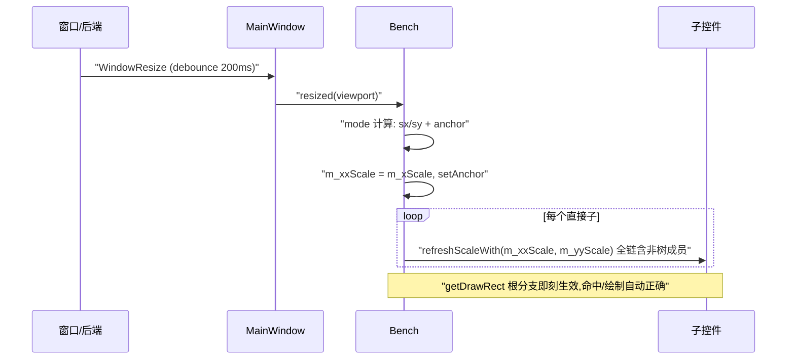

# 视口缩放设计（Bench 视图属性方案 v2）

> 本文档替代 v1（"视口层"方案）。v1 引入"视口层 = 显示空间"独立载体，经评审否决：状态数学上等价于 Bench 自身属性，却多出一层概念。v2 取消视口层，视图状态(scale/anchor/mode)收进 **Bench**——两个坐标空间仍然存在，但只体现在根变换这一个函数中。

## 1. 背景与目标

布局 JSON 以绝对像素坐标排布（基准画布 1920×1080）。窗口 resize 时现状只改 Bench 的 rect（`MainWindow.cpp:134`），子控件绝对坐标不动：窗口小于基准 → 控件被裁出可视区；窗口大于基准 → 界面偏居一角。

目标：
- 窗口与基准画布不一致时,UI **整体等比缩放**（Fit，默认）或按需拉伸（Stretch），实时跟随窗口 resize；
- `off` 模式行为与现状**逐像素一致**（默认关闭，避免既有应用行为漂移）；
- 用户可手动设置 Bench 的 scale/anchor，也可交给 mode 自动计算；
- 事件命中/焦点/图像/动画自动跟随缩放，无需逐控件适配。

## 2. 术语与坐标空间

| 空间 | 说明 | 谁在使用 |
|------|------|----------|
| **画布空间**（布局/逻辑坐标） | Bench rect 的坐标系；基准画布 `W0×H0` | 控件 `getRect()`、百分比 rect、LayoutEngine、resolveChildPercentages、应用/C ABI 读写的坐标 |
| **窗口空间**（显示/命中坐标） | 窗口（或子视口区域）绝对像素 | 事件坐标（鼠标/注入）、`getDrawRect/mapToDrawRect` 输出、`ctx->viewport`、裁剪与绘制 |

**关键定理**：两空间仅经"根变换"互转；命中测试 = 窗口空间比较（`isContainsPoint`/`mapToDrawRect().contains`），因此缩放开启后命中**天然正确**，事件坐标链路零改动。

现状下两者恒等（根偏移 0、scale=1），大量存量代码因此隐式假设二者不分——这些点即 §4.5 契约点清单。

## 3. 方案总览：Bench 视图属性

### 3.1 决策记录

| 方案 | 结论 | 理由 |
|------|------|------|
| v1：独立视口层（UIContext 持 displayRect） | 否决 | 与"Bench 属性化"数学等价，但增加概念层；窗口变化计算本可挂在既有的 `bench->resized` 上 |
| 全树重排（resize 遍历 setRect） | 否决 | 污染全部控件逻辑坐标；与编辑器/热点/持续结构冲突 |
| 渲染矩阵（RenderDevice 变换） | 否决 | 三后端改造 + 命中逆变换，代价与收益不成比例 |
| **Bench 视图属性（scale + anchor + mode）** | **采用** | 根变换机制已存在（`getDrawRect` 根分支），仅需补 anchor 偏移与 mode 计算器；自动继承命中/焦点/图像/拖动链路的正确性 |

### 3.2 三模式与计算规则

Bench 新增只读计算（模式变化时由计算器写入 scale/anchor，见 4.3）。**统一根变换公式（所有模式一致）**：

```text
rootDR = { m_rect.left + anchorX,  m_rect.top + anchorY,
           m_rect.width * sx,      m_rect.height * sy }
输入：viewport 区域 VP（左/上/宽/高），基准画布 W0×H0（= bench rect 尺寸或显式 canvas）
mode = fit:     sx = sy = min(VP.w/W0, VP.h/H0)
                anchor = ( VP.left + (VP.w - W0·sx)/2 ,  VP.top + (VP.h - H0·sy)/2 )   // 等比居中
mode = stretch: sx = VP.w/W0,  sy = VP.h/H0                                            // 独立拉伸
                anchor = ( VP.left, VP.top )
mode = off:     sx = sy = 1, anchor = (0,0)          // 根变换完全退化为现状
```

- **off 模式的位置语义**：`rootDR.left = m_rect.left + anchorX`，anchor=(0,0) → 位置即 `m_rect.left/top`（现状链路：resize → `bench->resized(viewport)`、`SetViewport` → `setRect(viewport)` 写入）；用户要手动平移时 `SetViewportAnchor` 作为**增量**叠加在 m_rect 之上；
- **子级位置等比**（实现确认，§2 修正）：`getDrawRect`（`ControlBase.cpp:607-610`）非根分支 `left = m_rect.left * 父复合 + 父 DR.left` —— 子级相对位置本就**乘父复合等比缩放**，与根变换叠加后即画布整体等比（fit 下控件间相对距离同步缩放，优于"仅内容缩放"）。设计语义 = 画布整体等比变换，无"位置不缩放"特例。
- **fit/stretch 的 anchor 含视口偏移**：`VP.left/top` 已在 anchor 内（子视口嵌入场景），画布 m_rect 原点恒为 0，不重复叠加。

| 模式 | 窗口 < 基准 | 窗口 > 基准 | 比例不同 |
|------|-------------|-------------|----------|
| fit | 等比缩小、居中填满 | 等比放大 | 短边贴边，长边留黑边 |
| stretch | 双向压缩 | 双向放大 | 变形铺满 |
| off | 右下裁剪出窗（现状） | 界面偏居一角偏小（现状） | 同左 |

### 3.3 手动 vs 自动

- `mode = off`：scale 由 `setScaleX/Y`（已有）、位置由 `m_rect`（现状链路）＋ `SetViewportAnchor`（增量，新增）决定——三模式中唯一允许手动覆盖的模式，适合"自己计算适配"的进阶用户；
- `mode = fit/stretch`：scale/anchor 由自动计算器写入；用户仍可读回（`getScaleXX`、`GetViewportAnchor`）；
- 属性系统接入后（§4.8），`viewport-scale-mode` 可运行时切换，三态互切换立即生效。

## 4. 详细设计

### 4.1 根变换改造（唯一实现落点）

`ControlImpl::getDrawRect` 根分支（`ControlBase.cpp:597-602`）现状:

```cpp
return { m_rect.left, m_rect.top,   // ← left/top 携带 SetViewport 偏移（子视口）
         m_rect.width * getScaleXX(), m_rect.height * getScaleYY() };
```

改为（action 仅根分支，子分支不变；所有模式统一公式）：

```cpp
// 根分支：bench 视图变换（统一公式,见 §3.2）
ViewportTransform vt = impl->getViewportTransform();   // bench 提供: mode/scale/anchor
return { m_rect.left + vt.anchorX,  m_rect.top + vt.anchorY,
         m_rect.width * vt.sx,      m_rect.height * vt.sy };
// off 时: sx=sy=1、anchor=(0,0) → 公式退化为原值返回,逐像素兼容
```

- **保留子视口偏移语义**：`m_rect.left/top` 作为基准保留（CreateViewport 写入的 viewport 区域偏移，off 下直接呈现；fit/stretch 下叠加 anchor 中的 VP.left/top 换算，画布原点 0 时无重复）；
- off 模式 sx=sy=1、anchor=(0,0) → 公式退化为原值 → **逐像素兼容**（区分点仅是 mode 开关）；
- `mapToDrawPoint/mapToDrawRect/isContainsPoint` 基于 drawRect 的实现**零改动**，全链路自动级联。

### 4.2 缩放传播机制（定稿：child 视角单虚函数 `refreshScaleWith`）

`m_xxScale/m_yyScale` 是**挂树快照**（`ControlBase.cpp:403` setParent 时 = 自身 × 父复合）。Bench 构造时 scale=1，子控件快照 = 自身 scale。**动态修改 bench scale 后必须主动刷新子树快照**，否则 getDrawRect 用旧快照，缩放宽高失效（位置/尺寸/命中均用快照，见 §2 末尾；已实施 `refreshScaleWith` 全链传播 + Button 非树成员收口）。

#### 4.2.1 接口（child 视角，虚函数按"被刷新的节点"分派）

```cpp
// Control（抽象基类，提供默认空实现；非纯虚，避免波及全部派生类）
virtual void refreshScaleWith(float parentXX, float parentYY) {}

// ControlImpl（真正实现：刷新自身快照 → 递归树内子树）
virtual void refreshScaleWith(float parentXX, float parentYY) override {
    m_xxScale = m_xScale * parentXX;              // 只写快照,不碰 m_xScale/m_rect
    m_yyScale = m_yScale * parentYY;
    for (auto& c : m_children)
        c->refreshScaleWith(m_xxScale, m_yyScale);   // 传"我的新复合"给子
}

// 覆写点示例（Button：非树成员收口）:
void Button::refreshScaleWith(float px, float py) override {
    ControlImpl::refreshScaleWith(px, py);        // 自身 + 树内子树
    if (m_actor)         m_actor->refreshScaleWith(m_xxScale, m_yyScale);   // 状态 Actor
    if (m_hoverActor)    m_hoverActor->refreshScaleWith(m_xxScale, m_yyScale);
    if (m_pressedActor)  m_pressedActor->refreshScaleWith(m_xxScale, m_yyScale);
    if (m_disabledActor) m_disabledActor->refreshScaleWith(m_xxScale, m_yyScale);
    if (m_luotiAni)      m_luotiAni->refreshScaleWith(m_xxScale, m_yyScale); // 内嵌动画
}

// 入口（Bench::resized / mode 计算器,一次完成全链）:
m_xxScale = m_xScale;                                  // 根:自身复合 = 自身布局值
for (auto& c : m_children)
    c->refreshScaleWith(m_xxScale, m_yyScale);
```

选型要点（相对"原语+钩子"两函数方案）：
- **虚函数按 this 分派**——"刷新非树成员"的时机是"本控件被刷新"，child 视角恰好落在正确的对象上；父视角原语（updateChildScale）虚化会分派到父，语义错位；
- **传参代替读父**：`parentXX/parentYY` 即顺序载体，自顶向下天然正确，无需回读 `parent->getScaleXX()`，消除"父是否已刷新"的时序敏感；
- **参数化示例**（A→B→C，A 是根；原 scaleX 1/2/3 → C 快照 6；改 A 为 2）：
  ```text
  A: m_xxScale = 2
  B.refreshScaleWith(2):      B.m_xxScale = 2×2 = 4
    └─ C.refreshScaleWith(4): C.m_xxScale = 3×4 = 12  ✓
  ```

#### 4.2.2 非树成员覆写点全清单（各处"覆写 = 基类 + 逐成员调 refreshScaleWith"）

| 控件 | 非树成员 | 备注 |
|------|----------|------|
| Button | m_actor / m_hoverActor / m_pressedActor / m_disabledActor（状态 Actor）＋ m_luotiAni（内嵌动画） | `Button.cpp:24` 注释确认"setParent 仅挂渲染/事件链"。**已实施**：覆写 = 基类 + 4 状态 Actor + luotiAni 逐成员刷新 |
| LuotiAni | m_frames 帧 Actor（`LuotiAni.cpp:486` 每帧校准改走本接口） | 帧 Actor 无子无覆写 → 每帧一次虚调用开销可忽略。**已实施** |
| ComboBox / ColorPicker / Menu 弹层 | m_popup / m_dialog / m_subMenu | **无需覆写**（实施确认）：弹层 open() 时经 `BENCH->addControl` 挂树（`Dialog.cpp`），挂树后 `Popup::setParent` 向子树传播复合（见 §4.2.4）——弹层作为**画布内容**随根变换缩放（内部字号/尺寸经 refreshScaleWith 链同步），位置经 open 时屏幕坐标反查一次换算收口 |
| EditBox | m_font（字体资源，字号随复合） | **已实施**（2026-08-13）：覆写 = 基类 + 复合变化时 `loadFontInternal()`（字号 = `m_fontSize × getScaleXX()`）+ `updateTextOffset()`——resize 后字号即时重建，不再滞后（原仅在 create/setText 等时机加载）；TextArea 继承自动生效 |
| TextArea | m_lineHeight（默认行高自适应）／滚动范围 | **已实施**（2026-08-13）：覆写 = 基类（EditBox 已重建字号）＋ `refreshLineHeightFromFont()` ＋ `rebuildLines()` 刷新换行 ＋ 滚动条范围重算；`update()` 懒检测字体指针变化（setFont/setFontSize/setText 路径）补重算 |
| 其余（WinFrame/Dialog/NumericUpDown 等） | 无 | 默认实现自动覆盖树内成员 |

#### 4.2.4 弹层随根变换缩放（2026-08-13 修订：原"弹层物理像素面板"机制撤销）

弹层（Popup/Dialog 系：ComboBox 下拉、ColorPicker 弹窗、通用 Dialog）**作为画布内容随根变换缩放**：

- `Popup::setParent` 覆写：基类快照后向 `m_children` 逐子 `refreshScaleWith(m_xxScale, m_yyScale)`——挂树时弹层复合 = 布局缩放 × 父（bench）复合，内部已创建控件（确认按钮/内容面板）的复合随之对齐；
- `Popup::refreshScaleWith`：恢复默认实现（原空覆写已删），弹层子树随画布缩放传播（内部字号/笔宽同步缩放）；
- 位置换算（open 时一次收口）：**先 `BENCH->addControl` 挂树（复合随根变换生效）再 `computeTargetRect` 反查**——屏幕绝对 → 弹层本地 `local = (screen - 根DR偏移) / 根复合`，弹层屏幕宽 = `m_rect.width * 弹层复合`（`ControlBase.cpp` 非根分支 getDrawRect 尺寸乘自身复合）；
- 弹层视觉效果 = 画布内普通控件：fit 缩小 → 弹层及内部内容等比缩小（不再溢出视口）；stretch 独立轴 → 弹层随之拉伸；
- 契约 C1 居中反查补 `vp.left/top`（多视口）+ 根 DR 反查；钳制边界须与本地坐标同单位——`hiX = (vp.left + localW - bx)/bsx - m_rect.width*sx/bsx`（减项除根复合）。
- T6 契约（`test_viewport_scale.cpp`）：fit 0.64 下弹层复合 = 0.64，屏幕 DR = (416, 320, 192, 128)（视口居中且随画布缩小）——区别于旧物理像素断言 (362, 284, 300, 200)。

#### 4.2.3 调用点与约定（实现必须遵守）

1. **现有调用点**：`LuotiAni.cpp:486` 每帧校准改为 `m_frames[frameNo]->refreshScaleWith(m_xxScale, m_yyScale)`——帧 Actor 无后代,虚分派落 ControlImpl 默认实现,实测开销为单次虚调用,注释留档；
2. **`setParent`（`ControlBase.cpp:403`）不动**：直接写快照公式,与刷新路径是独立写入点,后写覆盖先写,最终一致；
3. **幂等约定**：`refreshScaleWith` 可任意重复调用（同一树在不同入口下各刷一次,只产生相同赋值）——非树成员若同时又在 m_children 内,重复刷无害；
4. **不变量**：只写 `m_xxScale/m_yyScale`,不得动 `m_xScale` 与 `m_rect`（与 setParent 不变量一致,代码评审强制点）；
5. **构造/析构期间禁止调用**（虚分派会落到未完成基类）；
6. **接口层次**：`Control` 声明默认空实现（非纯虚）→ `ControlImpl` 覆写；`TopControl` 直接继承 Control 但不实现 —— 默认空实现即可（Bench 本身经 Panel→ControlImpl 链获得真实现,作为根不会被外部刷新,入口只对 children 调用）。



### 4.3 resize 时序

- 现有落点 `MainWindow::update` debounce（`MainWindow.cpp:126-137`）已把最终尺寸传给 `bench->resized`——保持该入口，在 `Bench::resized` 内按 mode 分支：
  - off → 现状逻辑不变（`Panel::resized`，rect 跟随窗口）；
  - fit/stretch → 不重设 bench rect（恒为画布），仅重算 scale/anchor，并按 §4.2.1 入口对直接子各调一次 `refreshScaleWith`；
- 初始化：`UICornerstone_CreateInstance` 尾段（`UICornerstoneAPI.cpp:328`）在写入 viewport 后显式 `bench->resized(viewport)`（现为 bench->resized），模式就绪后首帧即正确；
- 子视口 `CreateViewport`（`UICornerstoneAPI.cpp:355-366`）、`SetViewport`、窗口 resize 事件全部统一走 **`bench->resized(viewport)`** 单入口派发（见 §4.3.1"统一派发"），不再在 API 层直接 setRect bench。

### 4.3.1 三层坐标模型（画布 / 变换 / 视口）

为澄清"Bench 与视口混淆"的疑问，显式如下（**并非新增代码层，三层均已存在**，各自职责独立）：

| 层 | 载体 | 语义 | 变化来源 |
|----|------|------|----------|
| **画布层（布局空间）** | `bench->m_rect` + 控件树 `m_rect` | 用户布局坐标，绝对像素，原点 (0,0) | `SetCanvasSize` → `setRect(0,0,w,h)`（画布原点归零，粗调度：百分比/布局引擎以 m_rect 为基准自动重排） |
| **变换层（根变换）** | `m_xxScale/m_yyScale` + `m_anchorX/Y` | 画布 → 视口的映射：比例缩放 + 偏移 | `recomputeViewportTransform()`（fit/stretch 重算，off 恒 1/0） |
| **视口层（显示空间）** | `m_context->viewport` | 窗口（或多视口嵌入区域）绝对坐标，可带 left/top | 窗口 resize / `CreateViewport` / `SetViewport` |

关键约定：

- **视口变化统一派发**：`SetViewport` / `CreateViewport` / 窗口 resize 全部只更新 `viewport` 数据层后调 `bench->resized(viewport)`（`Bench.cpp:115-126`）——off 时画布 = 视口（`setRect` 全量含偏移），fit/stretch 时画布尺寸不变仅重算变换。API 层不再旁路直写 bench；
- **画布原点恒为 (0,0)**：`SetCanvasSize` 直接 `setRect(0,0,w,h)` 属有意归零——视口偏移（嵌入区域/窗口位置）由变换层 anchor 携带（`m_anchorX = vp.left + (vp.width - canvasW*f)/2`，`Bench.cpp:147`），`getDrawRect` 以 `{m_rect.left + m_anchorX, ...}` 单次叠加不双算（`Bench.cpp:192-195`）。若 setRect 保留旧 left/top，会与 anchor 的 vp 偏移重复相加 → 嵌入场景双重偏移；
- **off 模式画布 = 视口**：`bench->resized` 的 off 分支以 `setRect(viewport)` 将画布置为视口（含 left/top 偏移）、scale=1、anchor=0，与既有版本逐位一致——这就是"看起来 Bench=视口"的根源：off 下画布与视口重合，fit/stretch 下画布与视口分离；
- **fit 只保证画布内内容可见**：布局坐标超出画布（如基准改小后仍按原坐标摆放的控件）属画布外，会被窗口裁剪——这是正确语义，非 fit 缺陷。应用侧应对"基准变化"同步重排布局（百分比布局经 `Panel::setRect → resolveChildPercentages` 自动完成；绝对坐标布局需自行按比例重排，样例即如此演示）。

### 4.4 契约点适配清单（缩放启动后必须修正的存量代码）

性质：以下代码在 1:1 下坐标恒等所以正确，根变换启动后暴露。全部在 4.1-4.3 完成后的**同一帧语义**内修正。

| # | 位置 | 现状 | 失效模式 | 修改方案 |
|---|------|------|----------|----------|
| C1 | `Dialog.cpp:56-80` `computeTargetRect` | 本地坐标定位，clamp 边界直接用 `viewport`（屏幕） | fit 下弹窗钳制范围按屏幕像素比较本地坐标 → 弹窗越界或过早回缩 | clamp 边界换算到画布：`localW = vp.width / sx`（clamp 段已用 bx/by 反拆，同法加深；实测验证居中/锚定两分支） |
| C2 | `ComboBox.cpp:407+` `computePopupRect` | 返回**屏幕绝对**坐标（dr 家族 + viewport 钳制）直接作弹层面板 rect | 面板挂在控件本地坐标系 → 双重缩放 + 位置错位 | 返回值统一转回本地：`local = (screen - benchDrawLeft) / scale`（配 4.2 快照）——**已实施（2026-08-13 修订）**：弹层作为画布内容随根变换缩放（§4.2.4），位置 = 屏幕坐标的本地反查一次换算收口，公式对任意弹层复合自洽（尺寸 pw/sx 为画布单位，显示 = 画布单位×弹层复合） |
| C3 | `ColorPicker.cpp:221+` 弹层定位 | 同 C2 模式 | 同 C2 | 同 C2 方案 |
| C4 | `EditBox.cpp` 光标点击定位 | `mouse.x - drawRect.left`（缩放像素差）→ `getCursorFromPosition`（字体宽度索引） | 缩放 1.5× 点击字符中段，光标索引偏移 | **无需改动（核实确认）**：字号按复合重建后 `getTextWidth/m_textOffsetX` 全为屏幕单位，命中天然自洽；**已实施**（2026-08-13）：`refreshScaleWith` 重建字号（§4.2.2），选择条/光标高度与垂直居中改用 `getFontHeight`（真字高），stretch 下不再用 `fontSize×scaleY` 近似 |

**验证为自动正确的（不列入改动）**：Slider 全链路（`Slider.cpp:95-430` 一律 getDrawRect + getScaleXX 折算）、ScrollBar（`ScrollBar.cpp` 本地坐标定位 + 轴向尺度：垂直轴 `getScaleYY`/水平轴 `getScaleXX`，绘制与命中同式）、Menu 条目渲染（`Menu.cpp:65-414`）、WinFrame 拖动/缩放（`WinFrame.cpp:189-327` parentDraw 反拆）、Label 排版（`Label.cpp` 已折算）、命中/焦点环/Tab（drawRect 族）、`UICornerstone_Render` 裁剪（`pushClipRect(viewport)` 本来就在窗口空间，正确）。

### 4.5 文字缩放

- 图片/动画/矩形：纹理按 drawRect 拉伸（`drawTexture` dstRect），无改动；质量受后端过滤级别限制（可接受）；
- 文字 glyph 位图不随 drawRect 拉伸 → 需**字号重建**：
  - `TextRenderer` 增加字号 helper：`loadFontScaled(path, size, scale)`（内部 `size × scale` 取整 + 字号缓存）＋ `m_fontScaleEpoch` 失效计数；
  - 各文本控件 `create()` 取字号统一改走 helper（Label/Button/CheckBox/Menu/EditBox/TextArea/NumericUpDown/ProgressBar/Slider/ScrollBar/ColorPicker/TreeView）；
  - resize（scale 变化）→ epoch++，下一帧整体重建一次；
- 与 Label 既有的 `measureText / getScaleYY` 折算正交（排版仍在本地坐标，绘制多乘字号尺度），双路径自洽；
- 验收线：2×/0.5× 窗口下文字与控件矩形等比；resize 后单帧完成重建，无逐帧抖动。
- **实施状态（2026-08-13，全部文本控件已落实）**：
  - Label：`refreshScaleWith` 覆写（`include/Label.h` / `src/Label.cpp`）——父链缩放变化时 `releaseFont() + recreate()`，字号随 `getScaleXX()` 重建；Button caption 为树成员 Label（`addControl(m_caption)`，见 `Button.cpp:314`），经递归自动生效；
  - EditBox（含 TextArea/NumericUpDown，后者继承 EditBox）：`refreshScaleWith` 覆写（`EditBox.cpp:533`）——`loadFontInternal()` 按新复合重建字号（`m_fontSize × getScaleXX()`，字体缓存键含 size 自动命中新字号），draw/垂直居中/选择条/光标高度统一用 `getFontHeight`（真字高，`EditBox.cpp:254`）；
  - TextArea 行高：默认 `m_lineHeight = getFontHeight / getScaleYY()`（本地单位，行距屏幕 = 真字高，stretch 下字迹不重叠），`setLineHeight` 显式定制后不再自动跟随（懒检测：`update()` 对比 `getFont()` 指针覆盖 setFont/setFontSize/setText 路径，`TextArea.cpp:403`）；
  - TreeView：`refreshScaleWith` 覆写（字号随复合重建，`TreeView.cpp` setFontSize 同语义）；行高固定不随字号（`m_rowHeight` 独立）
  - Slider：`refreshScaleWith` 覆写——刻度字体（tickFont）按 `m_tickLabelFontSize × getScaleXX()` 重建并重建刻度文本（`ensureTickFont` 复用已读字体数据，避免重复 IO）
  - Menu（MenuBar/MenuPanel）：`refreshScaleWith` 覆写——共享字体重建 + 条目布局重排；下拉面板不在 m_children，手动传播复合缩放（与 setContext 传播一致），子菜单面板同理
  - **可见性过滤（§8 风险项落地）**：Label/EditBox 缩放在不可见控件上延后到可见帧 `update()` 补重建（`m_fontScaleDirty` 标志），resize 时不可见文本零重建成本
- **字宽限制（2026-08-13 决策，暂不实施）**：字形按标量字号（sx）重建，宽高等比——stretch 下字迹不纵向拉伸；三后端能力不对称（raylib `DrawTextEx` 有 spacing、SFML `setScale(x,1)` 可拉伸、SDL3 `TTF_DrawRendererText` 两者皆无），"字宽系数"需先补 SDL3 后端能力或走核心层布局换算（字形不变），本轮未做。

### 4.6 百分比 / 布局引擎语义

- Bench rect 恒为画布（fit/stretch），`resolveChildPercentages` 与 LayoutEngine 以 `m_rect` 为基准 → **百分比和布局全部按画布解析**；
- 比例相同时"画布 50% × fit scale = 窗口 50%"成立，语义直观；比例不同时 fit 按画布比例（留黑边），符合 fit 定义；
- off 模式 rect 跟随窗口 → 现状行为完全保留（文档在 9.1 注明"布局空间 = 画布"为启用 fit/stretch 后的规则）。

### 4.7 公开 API

```jsonc
// 布局 JSON 顶层（替换 declarative-syntax 9.1.1 示例语义,补齐解析缺口）
{
  "viewport": { "width": 1920, "height": 1080, "scale-mode": "fit" },  // 缺省:创建时窗口尺寸 + off
  "controls": [ ... ]
}
```

```c
// C ABI（视口控制段扩充）
UICORNERSTONE_API int UICornerstone_SetViewportScaleMode(UIInstance inst, int mode); // 0=off 1=fit 2=stretch
UICORNERSTONE_API int UICornerstone_GetViewportScaleMode(UIInstance inst, int* mode);
UICORNERSTONE_API int UICornerstone_SetCanvasSize(UIInstance inst, float w, float h); // 显式基准画布
UICORNERSTONE_API int UICornerstone_GetViewportScale(UIInstance inst, float* sx, float* sy);
UICORNERSTONE_API int UICornerstone_SetViewportAnchor(UIInstance inst, float ax, float ay); // 手动锚(off 模式)
UICORNERSTONE_API int UICornerstone_SetViewportBackgroundColor(UIInstance inst, uint8_t r, uint8_t g, uint8_t b, uint8_t a); // RGBA8888,默认透明=不填充
```

- JSON：`LayoutParser::parseLayout` 解析 `viewport` 键 → 写 `ctx->m_canvasBase` + bench mode（先于首次 `resized`），无键回退默认；
- Binding：`SetViewportScaleMode/SetCanvasSize/SetViewportAnchor` 透传 + `UI_FACTORY` 注册（对齐现有 SetViewport 模式）；
- 属性系统（Bench 是 Control 派生，天然可用）：`SetEnum("viewport-scale-mode", "off|fit|stretch")` 等值接入。**已实施（2026-08-13）**：`Bench::setEnumProperty` 覆写（`Bench.cpp`，非法值/未知属性拒绝透传基类），运行时切换即重算根变换并触发子树字号/布局重建（Ta 断言）。

### 4.8 与既有功能的关系

| 功能 | 影响 |
|------|------|
| 弹窗 clamp（viewport） | C1 修正后保持屏幕裁剪兜底语义（钳制边界换算到弹层本地坐标） |
| 焦点环 / Tab 环 | drawRect 族自动正确 |
| 鼠标/事件注入（PushUIEvent） | 事件坐标 = 窗口空间，零改动 |
| 多窗口 / 子视口 | 每实例独立 bench + mode；共享后端；`Debug_GetActiveViewport` 不受影响 |
| 热加载/GraphTool | 布局重载不触 mode（bench 视图属性持久）；GraphTool 画布语义**已核对（2026-08-13）**：GraphTool.cpp 不读取 `ctx->viewport`（全站 grep 复查无画布坐标直接引用），坐标全部经标准 Control API 换算，无需改动 |
| 光标 | Cursor 图像固定像素（P3 可选随缩放）——**已核对（2026-08-13）关闭**：系统光标由 OS 渲染、尺寸不可控，无缩放语义；自定义图像光标出现前不实施 |
| 字号缓存统计 | **已实施（2026-08-13）**：`TextRenderer::getFontCacheEntryCount`（`CallbackTextRenderer` 前端计数——后端字体经 C ABI 句柄加载，无回调透传；零 ABI 侵入） |

## 5. 实施计划

### 阶段 1 — 核心链路（无新 API，off 兼容）

| 步骤 | 内容 | 验收 |
|------|------|------|
| 1.1 | §4.1 根变换分支 + Bench 视图状态（mode/anchor/scale 计算器） | 单测：三模式 scale/anchor 数学断言（含多视口偏移保留） |
| 1.2 | §4.2 `refreshScaleWith` 全虚链（Control/ControlImpl + Button 覆写；弹层经 `Popup::setParent` 传播，§4.2.4）+ §4.3 resize 落点改造 | 5 sample auto=3 回归 rc=0（off 逐像素不变）；手动拖窗 fit/stretch 生效；T11 深层链断言 |
| 1.3 | §4.4 契约点 C1-C3 修正（C4 核实自洽；EditBox/TextArea/ScrollBar 轴向与字号重建已随 §4.5 提前落实） | 缩放态弹窗/下拉/取色器断言正确（T6）；stretch 下编辑类控件字号/行高/滚动条正确（T9x/T9y） |
| 1.4 | `test_viewport_scale`（T0-T11 + T6 弹层契约 + T8x/T9x/T9y + Ta-Tg，81 断言） | 见 §6 测试矩阵 |
| 1.5 | 5 sample + 8 标准测试 + 4 DLL C ABI 测试回归 | 全部 rc=0 / ALL PASS |

### 阶段 2 — 公开 API 与文档

| 步骤 | 内容 | 验收 |
|------|------|------|
| 2.1 | C ABI 四接口 + InstanceConfig(canvasW/H/mode) 扩充 | C ABI 测试：建实例即带缩放、查询一致 |
| 2.2 | JSON `viewport` 键解析（LayoutParser + declarative-syntax 9.1.1 真实化） | 布局测试：键生效、缺省行为不变 |
| 2.3 | Binding 透传 + 样例跑通三模式 | auto 测试 rc=0 |
| 2.4 | 文档：Integration（嵌入适配）、附录 9.3/9.6、declarative-syntax、FAQ（"界面如何适配分辨率"） | 签名/链接一致 |

**状态：全部完成（已实施）** — 2.1：5 个 C ABI（Set/GetViewportScaleMode、SetCanvasSize、
GetViewportScale、SetViewportAnchor，校验非法参数）+ InstanceConfig(canvasWidth/Height/viewportScaleMode)
守卫读取 + CreateInstance 应用（canvas 先、mode 后）+ `SetViewport` 按 mode 分支（非 off 不
动画布 rect 仅重算）；2.2：LayoutParser 顶层 `viewport:{width,height,scale-mode}` 键
（`setViewportTarget` 落点，先 canvas 后 mode），缺省行为不变；2.3：Binding 透传 5 接口
（对齐 SetViewport 模式）+ 新样例 `sample_viewport_scale`（三模式 + canvas + anchor + 非法
参数，16 断言全 PASS）；2.4：integration.html 7.5、capi.html 9.3 视口控制表、declarative-syntax
9.1.1、faq.html Q5b。
**验证**：test_viewport_scale 81 断言全 PASS（T8 C ABI / T9 JSON 键 / T8x 背景色 / T9x-T9y 编辑类缩放与行高 / Ta-Tg 属性·字号重建·过滤·统计·逆变换）；6 binding sample rc=0；
8 标准测试 + 4 DLL C ABI 测试回归 rc=0。
**构建模式**（2026-08-13）：`binding/CMakeLists.txt` 样例段支持两种构建方式——主工程树内
（`add_subdirectory(binding)`，沿用 `TARGET UICornerstone_dll` 引用）与**独立配置**（
`cmake -S binding -B build/binding`，经 `UICORNERSTONE_CORE_OUTPUT` 变量默认指向
`build/sdl3/Debug`，样例依赖 DLL 从该目录全量拷贝）；独立树样例输出到
`build/binding/Debug/`（6 样例 + UICornerstone.dll/后端 DLL/assets 齐备，auto=3 冒烟 rc=0）。
**样例交互强化**（2026-08-13）：1) 窗口加 `UIWindowFlags::Resizable`（0x20），可拖拽改
窗口大小实测 fit/stretch 实时重算；2) 滑块改控画布宽度 600~2400（高恒 900），跨越 4:3
临界点（画布宽 1200 时 fit 恰好满窗）——宽<1200 高度为瓶颈（左右黑边、anchorX>0），
宽>1200 宽度为瓶颈（上下黑边），anchor 变化可视；3) Label 字号随复合缩放重建
（§4.5 实施状态），按钮/标签文字与控件等比。

### 阶段 3 — 打磨（独立排期）

**全部完成（2026-08-13）**：光标图像随缩放（核对关闭：系统光标 OS 托管，无缩放语义）、GraphTool 画布语义核对（无 viewport 引用，无需改动）、字号缓存内存统计（`getFontCacheEntryCount`，Callback 前端计数）、LuotiAni 帧位图双线性过滤开关（`setFrameFilter` + 三后端 `RenderDevice::setTextureFilter`）、`mapCanvasToViewport` 逆变换公开（`ControlBase::mapViewportToCanvas`，窗口→画布，Tf 断言）。

## 6. 测试矩阵（test_viewport_scale）

| # | 用例 | 配置 | 断言 |
|---|------|------|------|
| T1 | fit 缩小 | 1280×720 / 1920×1080 | 控件 `getDrawRect` = 画布 × 0.667 居中；注入点击命中 onClick；黑边=0（等比无黑边） |
| T2 | fit 放大 | 2560×1440 | drawRect × 1.333；右/下边缘控件完全可见 |
| T3 | fit 黑边 | 1280×900（4:3） | 长边黑边 = (1280-720·1.25)/2？等比 min 校验；命中居中控件 |
| T4 | stretch | 1280×900 | sx=0.667 sy=0.833 独立 |
| T5 | 契约点 | fit 64% | 弹窗 clamp 不越界、下拉上下翻转不越界、取色器贴边、光标点击字数精确 |
| T6 | 弹层随缩放契约 | fit 0.64 | 弹层复合=0.64、屏幕 DR=(416,320,192,128)（居中且随画布缩小）；off 与改动前逐像素一致（5 sample 回归） |
| T7 | resize 拖动 | fit 多尺寸序列 | 坐标实时重算；字号 epoch 单调递增且单帧重建 |
| T8 | 子视口嵌入 | 宿主 800×600、子区域 500×300 | 基准 fit 进区域，命中正确 |
| T9 | JSON viewport | 布局带键 | canvasBase/scale-mode 生效，缺省 off |
| T10 | 多窗口 | fit × 2 实例 | 独立缩放互不干扰 |
| T11 | 深层快照链 | 3 层树 scale(1/2/3) + bench 改 2 | 末代复合 = 3×2×2=12；按钮状态 Actor / 内嵌动画同链刷新断言 |
| T9x | 编辑类缩放（stretch） | sx=0.8 sy=1.0667 | EditBox/TextArea 字号随复合重建（`:533`）；滚动范围本地语义恒定（201 行×20 −176=3844）；`getScrollY` clamp 一致 |
| T9y | 行高自适应 | off/stretch | 默认行高 = `getFontHeight/垂直复合`；stretch 下随复合重算；`setLineHeight` 定制优先级 |
| Ta | 属性系统切换 | `setEnumProperty` | stretch/fit/off 三态生效；非法枚举拒绝；未知属性透传基类 |
| Tb | TreeView 字号重建 | 复合 1→2→1 | 字号 14→28→14 即时重建 |
| Tc | Slider 刻度字号重建 | 复合 1→2→1 | tickFont 懒加载随复合 10→20→10（字体数据复用无重复 IO） |
| Td | Menu 字号重建 | MenuBar 复合 1→2 | Bar 12→24；下拉面板随 Bar 传播 14→28 |
| Te | 可见性过滤 | Label 不可见缩放 | 不可见不重建（字体指针不变）；可见帧 update 补重建 16→32 |
| Tf | EditBox 过滤 + 逆变换 | 不可见缩放 | 同 Te；`mapViewportToCanvas` 窗口→画布反查精确（Tf 断言） |
| Tg | 统计 + 过滤开关 | 字体重载 + LuotiAni | `getFontCacheEntryCount > 0`；双线性开关存取往返 |

## 7. 附录 A：实现文件改动清单（阶段 1+2）

| 文件 | 改动 |
|------|------|
| `include/ControlBase.h` | Control 增加 `virtual void refreshScaleWith(float,float) {}`（默认空）；ControlImpl 覆写（含 m_children 递归）；**删除 `updateChildScale`**（唯一调用点迁移，语义专一）；根变换辅助声明 |
| `src/ControlBase.cpp` | `getDrawRect` 根分支（597-602）接 `computeRootTransform`（mode≠off 时新公式，否则原值）；`refreshScaleWith` 实现 |
| `include/Bench.h` / `src/Bench.cpp` | 视图状态（mode/anchor/scale 计算器）、`resized` 按 mode 分支、入口循环（对直接子各调一次 `refreshScaleWith`）、`computeRootTransform` |
| `include/Button.h` / `src/Button.cpp` | `refreshScaleWith` 覆写（4 状态 Actor + m_luotiAni） |
| `src/LuotiAni.cpp:486` | 每帧校准调用点迁移 → `refreshScaleWith(m_xxScale, m_yyScale)`，注释留档 |
| `src/ComboBox.cpp` / `src/ColorPicker.cpp` / `src/Menu.cpp` | 契约点 C2/C3 反查公式核对（**无需覆写 refreshScaleWith**——弹层挂树经 `Popup::setParent` 传播，见 §4.2.4）；C1 在 `Dialog.cpp`，C4 在 `EditBox.cpp` |
| `include/Dialog.h` / `src/Dialog.cpp` | `Popup::setParent` 覆写（继承复合 + 向 m_children 传播）；删除 `Popup::refreshScaleWith` 空覆写；`computeTargetRect` 钳制换算除根复合（C1）；`open()` 先 `addControl` 后算位置 |
| `include/EditBox.h` / `src/EditBox.cpp` | `refreshScaleWith` 覆写（复合变化 → `loadFontInternal` 重建字号 + `updateTextOffset`）；垂直居中/选择条/光标高度改用 `getFontHeight`（真字高）；margin 水平/垂直分量分离（C4） |
| `include/TextArea.h` / `src/TextArea.cpp` | `refreshScaleWith` 覆写（基类后行高自适应 + 重排换行 + 滚动范围）；draw/命中反查垂直分量 `getScaleYY`；默认行高 = 真字高/垂直复合（`setLineHeight` 定制优先，`update()` 懒检测补全路径）；`getVisibleLines`/`scrollToBottom` 统一本地单位 |
| `src/ScrollBar.cpp` | 垂直轴 top/height 与命中反查用 `getScaleYY`（水平轴 `getScaleXX`），stretch 下 thumb/厚度/拖拽正确 |
| `include/TextRenderer.h` + 各文本控件 | 字号 helper `loadFontScaled(path,size,scale)` + `m_fontScaleEpoch` 失效重建（Label/Button/CheckBox/Menu/EditBox/TextArea/NumericUpDown/ProgressBar/Slider/ScrollBar/ColorPicker/TreeView） |
| `include/TreeView.h`/`src/TreeView.cpp` | `refreshScaleWith` 覆写（字号随复合重建）；行高独立不随字号 |
| `include/Slider.h`/`src/Slider.cpp` | `refreshScaleWith` 覆写（tickFont 重建 + 刻度文本重排；`ensureTickFont` 复用已读字体数据）；`getTickFont` 访问器 |
| `include/Menu.h`/`src/Menu.cpp` | MenuBar/MenuPanel `refreshScaleWith` 覆写（共享字体重建 + 布局重排；非树成员面板/子菜单手动传播复合缩放）；`getFont` 访问器 |
| `include/Label.h`/`src/Label.cpp`、`include/EditBox.h`/`src/EditBox.cpp` | 字号重建**可见性过滤**：不可见时 `m_fontScaleDirty` 延后，可见帧 `update()` 补重建 |
| `include/Bench.h`/`src/Bench.cpp` | `setEnumProperty` 覆写：`viewport-scale-mode` off/fit/stretch 运行时切换（§4.7） |
| `include/ControlBase.h`/`src/ControlBase.cpp` | `mapViewportToCanvas`（`mapToDrawPoint` 逆变换，窗口→画布，零缩放保护） |
| `include/TextRenderer.h`/`src/CallbackAdapters.*` | `getFontCacheEntryCount`（字号缓存统计；Callback 前端计数，零 C ABI 侵入） |
| `include/LuotiAni.h`/`src/LuotiAni.cpp`、`include/RenderDevice.h` + 三后端 RenderDevice | LuotiAni `setFrameFilter` 双线性开关；`RenderDevice::setTextureFilter`（SDL3 `SDL_SetTextureScaleMode`、SFML `setSmooth`、raylib `SetTextureFilter`） |
| `include/UIContext.h` | `m_canvasBase`（阶段 2 显式基准用）+ `viewportBackground`（视口背景色，默认透明，渲染时 clip 内填充） |
| `src/UICornerstoneAPI.h/.cpp` | 阶段 2：`SetViewportScaleMode/GetViewportScaleMode/SetCanvasSize/GetViewportScale/SetViewportAnchor` + InstanceConfig 扩充；`SetViewportBackgroundColor`（RGBA8888，`UICornerstone_Render` 内 clip 后填充） |
| `src/LayoutParser.cpp` | 阶段 2：顶层 `viewport` 键解析 |
| `binding/src/*` `binding/include/UICornerstone.h` | 阶段 2：四接口透传 + UI_FACTORY 注册 |
| `test/test_viewport_scale.*` `binding/samples/sample_viewport_scale.*` | T1-T11 + T6 弹层契约 + T8x 背景色 + T9x/T9y 编辑类缩放/行高用例；三模式切换样例（auto=<秒>） |

## 8. 风险清单

| 风险 | 影响 | 应对 |
|------|------|------|
| 根变换分支对"根级 getDrawRect 使用者"（Bench 背景/边框、光标、首个容斥）的语义变化 | 回归 | off 模式原路径原值；fit/stretch 仅显式启用后生效；T6 兜底 |
| 子树快照过期（漏刷新）导致缩放后宽高失效 | 控件错位 | 刷新统一入口 + T1/T2 drawRect 断言；代码评审强制点 |
| 文字重建成本 | resize 卡顿 | epoch 一次性重建 + 字号缓存；**可见性过滤已实施（2026-08-13）**：不可见控件延后重建（Label/EditBox `m_fontScaleDirty`） |
| 契约点遗漏（本地⇄屏幕混用散点） | 弹层错位 | 清单化 C1-C4 + T5；全站 `viewport` 引用 grep 复查——**已核对（2026-08-13）**：仅 Bench 根变换入口 / LayoutParser / MainWindow / UICornerstoneAPI / UIContext 兜底 / 弹层定位换算（Dialog/ComboBox/ColorPicker，均按 §4.2.4 本地反查），无遗漏散点 |
| off 模式行为漂移 | 既有应用回归 | 分支隔离（mode!=off 才走新路径）+ 5 sample 逐像素回归 |
| 百分比语义变化（fit 下按画布） | 布局漂移 | 文档明确 + 仅启用模式后生效 |

## 9. 附：待办确认项（实现前触发）

1. `UICornerstone_CreateInstance` 首帧时序：mode 就绪先于第一次 `bench->resized`（§4.3 初始化段）；
2. C2 方案细节（弹层物理像素 vs 画布坐标）以"位置一次换算收口"为准，若 ComboBox 弹层面板挂 MenuPanel 等既有树节点，需实测确认挂载点坐标系后定案；
3. GraphTool 对 `ctx->viewport` 的读取——**已核对（2026-08-13）**：GraphTool.cpp 无 viewport/画布坐标直接引用，坐标全部经标准 Control API 换算，无需改动。