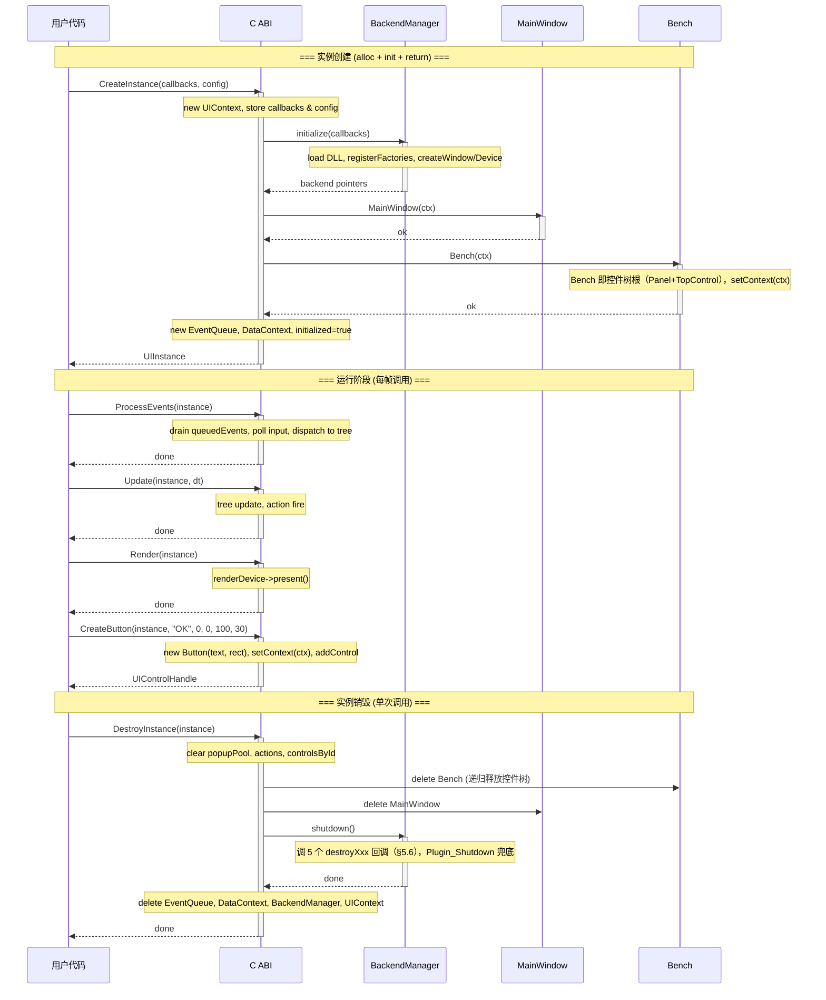
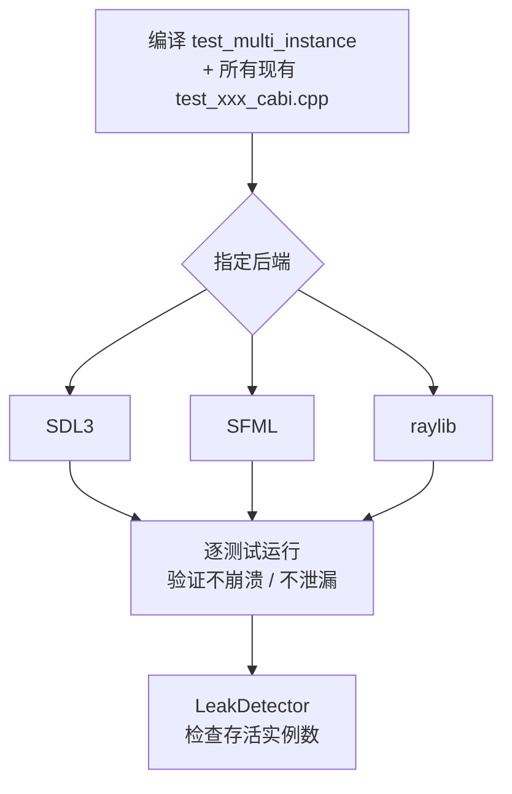
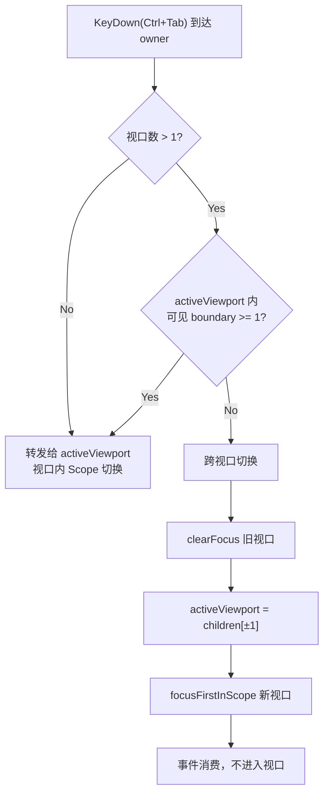

# C ABI 多实例支持改造设计

> 对应 Phase 16ii | 编制 2026-07-30 | 修订 2026-07-31 | 状态: **草案**

## 目录

1. [问题](#1-问题)
2. [全局状态清单](#2-全局状态清单)
3. [改造目标](#3-改造目标)
4. [架构对比](#4-架构对比)
5. [详细设计](#5-详细设计)
   - [5.1 UIContext — 实例上下文](#51-uicontext--实例上下文)
   - [5.2 C ABI 新签名](#52-c-abi-新签名)
   - [5.3 单例改造](#53-单例改造)
   - [5.4 Control 层适配](#54-control-层适配)
   - [5.5 宏重定义](#55-宏重定义)
   - [5.6 后端插件改造](#56-后端插件改造)
   - [5.7 Surface / Cursor 工厂](#57-surface--cursor-工厂)
   - [5.8 生命周期时序](#58-生命周期时序)
   - [5.9 错误处理与事务性回滚](#59-错误处理与事务性回滚)
   - [5.10 所有权模型](#510-所有权模型)
   - [5.11 调试与诊断支持](#511-调试与诊断支持)
   - [5.12 测试方案](#512-测试方案)
   - [5.13 扩展分析：单窗口多 BENCH 视口](#513-扩展分析单窗口多-bench-视口)
6. [实施清单](#6-实施清单)
7. [风险与注意事项](#7-风险与注意事项)

---

## 1. 问题

当前 C ABI 通过**文件作用域静态变量**和**类静态单例**共享状态，进程生命周期内只能存在一个 UICornerstone 实例。

```cpp
// src/UICornerstoneAPI.cpp — 14 个全局变量（修订：补 g_menuPool；static char buf[256] 在 GetControlId 函数体内，非全局，见 §2.1）
namespace {
    const UIBackendCallbacks* g_callbacks = nullptr;
    Window* g_window = nullptr;
    bool g_initialized = false;
    // ... 共 14 个（详见 §2.1）
}

// 5 个单例
BackendManager::instance()   → static BackendManager mgr
MainWindow::getInstance()    → static MainWindow instance
Bench::getInstance()         → static Bench instance
EventQueue::getInstance()    → static EventQueue instance
DataContext::getInstance()   → static shared_ptr<DataContext> s_instance
```

**实际限制**：

| 场景 | 结果 |
|------|------|
| 进程内创建两个 UI 窗口 | `UICornerstone_Init` 第二次直接返回 1，不生效 |
| 先 Init 再 Shutdown 再 Init | Shutdown 不重置标志，无法重新初始化 |
| 从两个线程同时操作 | 无锁，数据竞争 |

## 2. 全局状态清单

### 2.1 UICornerstoneAPI.cpp（实例上下文，14 项）

> 修订说明（2026-07-31）：原清单 13 项，遗漏 `g_menuPool`（Menu C ABI 补齐时加入的保活池），现为 **14 项**。
>
> 复核修订（2026-07-31）：`static char buf[256]` **不在匿名 namespace 中**——它位于 `UICornerstone_GetControlId` 函数体内（src/UICornerstoneAPI.cpp:637），是该函数返回 `const char*` 的静态输出缓冲，**并非 GetString 输出缓冲**（`GetString`/`GetEnum`，cpp:869-885，使用调用者传入的 out 缓冲 + `strncpy_s`）。它属于线程不安全的进程级静态（多实例并发调 GetControlId 会互踩），改造时一并改为 `UIContext` 内 `std::string strBuf`（见 §5.1）。
>
> **以下 14 项全部迁入 UIContext**。

| 变量 | 类型 | 说明 |
|------|------|------|
| `g_callbacks` | `const UIBackendCallbacks*` | 后端回调表 |
| `g_window` | `Window*` | 窗口对象 |
| `g_renderDevice` | `RenderDevice*` | 渲染设备 |
| `g_inputBackend` | `InputBackend*` | 输入后端 |
| `g_textRenderer` | `TextRenderer*` | 文本渲染器 |
| `g_resourceProvider` | `CallbackResourceProvider*` | 资源提供者 |
| `g_initialized` | `bool` | 初始化标志 |
| `g_quit` | `bool` | 退出请求标志 |
| `g_viewport` | `SRect` | 视口矩形 |
| `g_actions` | `unordered_map<string, pair<回调,userData>>` | 动作注册表 |
| `g_controlsById` | `unordered_map<string, UIControlHandle>` | ID→控件映射 |
| `g_queuedEvents` | `queue<UIEvent>` | 注入事件队列 |
| `g_popupPool` | `vector<shared_ptr<Popup>>` | 弹窗生命周期池 |
| `g_menuPool` | `vector<shared_ptr<Control>>` | 菜单保活池（`menuPoolKeep`/`menuPoolTake`） |

### 2.2 单例类（5 个 → 改为实例持有）

| 类 | 持有状态 | 当前引用方式 |
|----|---------|-------------|
| `BackendManager` | 后端 API 表 + 4 个后端对象指针 | `BackendManager::instance()` |
| `MainWindow` | 窗口尺寸/位置、ResourceProvider、FocusManager | `MainWindow::getInstance()` → `MAINWIN` 宏 |
| `Bench` | 控件树根节点、控件列表 | `Bench::getInstance()` → `BENCH` 宏 |
| `EventQueue` | 事件队列 + 观察器映射表 | `EventQueue::getInstance()` |
| `DataContext` | 数据绑定映射表 | `DataContext::instance()` |

### 2.3 宏依赖（7 个宏，散布 ~20 个源文件）

```cpp
#define BENCH              (Bench::getInstance())
#define MAINWIN            (MainWindow::getInstance())
#define GET_RENDERDEVICE   (MAINWIN->getRenderDevice())
#define GET_TEXTRENDERER   (MAINWIN->getTextRenderer())
#define GET_INPUTBACKEND   (MAINWIN->getInputBackend())
#define GET_RESOURCEPROVIDER (MAINWIN->getResourceProvider())
#define GET_FOCUSMANAGER   (MAINWIN->getFocusManager())
```

### 2.4 后端插件缓存（3 个后端 × 5 个创建函数 = 15 个静态变量）

> 修订说明（2026-07-31）：原清单只列 4 个创建函数，**遗漏 `createResourceProvider`**（回调表 `UIBackendCallbacks` 中 Window/RenderDevice/InputBackend/TextRenderer/ResourceProvider 各一个创建函数）。且 **destroy 回调在 `UIBackendCallbacks` 中已全部存在**（`destroyWindow`/`destroyRenderDevice`/`destroyInputBackend`/`destroyTextRenderer`/`destroyResourceProvider`，见 UICornerstoneAPI.h:87-153）——多实例改造无需新增回调，见 §5.6。

每个 `UIBackend_xxx.dll` 缓存在 `static` 变量中，创建第二个实例会覆盖第一个。

```cpp
// backend/sdl3/BackendPlugin.cpp
static Window* g_pluginWin = nullptr;
UIWindowHandle bridge_createWindow(...) {
    if (!g_pluginWin) g_pluginWin = new SDL3Window(...);
    return (UIWindowHandle)g_pluginWin;
}
```

### 2.5 ConstDef 全局常量（1 项，非 blocking 但需关注）

```cpp
// src/ConstDef.cpp
std::string g_pathPrefix = "assets/";
```

当前为进程级全局 `std::string`。多实例场景下，若所有实例共享同一资源根目录，可保持静态；若需不同，则迁入 `UIContext`。见 §7 风险 4。

## 3. 改造目标

1. **`CreateInstance` / `DestroyInstance`** — 进程内可创建多个独立实例
2. **`UIInstance` 显式参数** — 所有 C ABI 函数首参为 `UIInstance`，精确指向目标实例
3. **控件层 `m_context`** — 每个 Control 通过成员变量持有所属上下文
4. **无需过渡层** — 无用户依赖，C ABI 签名一次性改为新形式

## 4. 架构对比


## 5. 详细设计

### 5.1 UIContext — 实例上下文

新增头文件，聚合一个实例的全部状态：

```cpp
// include/UIContext.h
#pragma once
#include <string>
#include <unordered_map>
#include <queue>
#include <memory>
#include <functional>
#include "UICornerstoneAPI.h"

class Window;
class RenderDevice;
class InputBackend;
class TextRenderer;
class ResourceProvider;
class MainWindow;
class Bench;
class EventQueue;
class DataContext;
class FocusManager;
class Popup;
class BackendManager;

struct UIContext {
    // ── Backend 资源 ──
    const UIBackendCallbacks* callbacks = nullptr;
    Window*          window = nullptr;
    RenderDevice*    renderDevice = nullptr;
    InputBackend*    inputBackend = nullptr;
    TextRenderer*    textRenderer = nullptr;
    ResourceProvider* resourceProvider = nullptr;

    // ── 初始化状态 ──
    bool initialized = false;
    bool quit = false;

    // ── 视口 ──
    SRect viewport{0, 0, 1024, 768};

    // ── 原单例（由 UIContext 持有，非静态） ──
    BackendManager* backendManager = nullptr;
    MainWindow*     mainWindow = nullptr;
    Bench*          bench = nullptr;
    EventQueue*     eventQueue = nullptr;
    DataContext*    dataContext = nullptr;

    // ── 动作与控件查找 ──
    std::unordered_map<std::string,
        std::pair<UIActionCallback, void*>> actions;
    std::unordered_map<std::string, UIControlHandle> controlsById;

    // ── 注入事件队列 ──
    std::queue<UIEvent> queuedEvents;

    // ── 弹窗生命周期 ──
    std::vector<std::shared_ptr<Popup>> popupPool;

    // ── 菜单保活池（修订：g_menuPool 迁入，见 §2.1） ──
    std::vector<std::shared_ptr<Control>> menuPool;

    // ── 实例内字符串缓冲（复核修订：替代 GetControlId 的 static char buf[256]（cpp:637）；
    //    非 GetString 缓冲——GetString/GetEnum 用调用者传入的 out，见 §2.1） ──
    std::string strBuf;

    // ── 资源路径（从 ConstDef 迁入，见 §7 风险 4） ──
    // std::string pathPrefix;

    // ── 初始化与销毁 ──
    bool initialize();
    void destroy();
};
```

`initialize()` 的实现（不接收外部参数，callbacks 已在创建时由 C ABI 填写）：

```cpp
// src/UIContext.cpp
bool UIContext::initialize() {
    backendManager = new BackendManager();
    if (!backendManager->initialize(callbacks)) {
        delete backendManager;
        backendManager = nullptr;
        return false;
    }
    window          = backendManager->window();
    renderDevice    = backendManager->renderDevice();
    inputBackend    = backendManager->inputBackend();
    textRenderer    = backendManager->textRenderer();

    mainWindow   = new MainWindow(this);
    bench        = new Bench(this);
    eventQueue   = new EventQueue();
    dataContext  = new DataContext();

    // resourceProvider 从 MainWindow 获取
    resourceProvider = mainWindow->getResourceProvider();

    initialized = true;
    quit = false;
    return true;
}
```

`destroy()` 逆序析构：

```cpp
void UIContext::destroy() {
    quit = true;
    popupPool.clear();
    controlsById.clear();
    actions.clear();

    delete dataContext;     dataContext = nullptr;
    delete eventQueue;      eventQueue = nullptr;
    delete bench;           bench = nullptr;
    delete mainWindow;      mainWindow = nullptr;

    if (backendManager) {
        backendManager->shutdown();
        delete backendManager;
        backendManager = nullptr;
    }

    window          = nullptr;
    renderDevice    = nullptr;
    inputBackend    = nullptr;
    textRenderer    = nullptr;
    resourceProvider = nullptr;
    callbacks       = nullptr;
    initialized     = false;
}
```

### 5.2 C ABI 新签名

句柄类型：

```c
// include/UICornerstoneAPI.h
typedef struct UIContext* UIInstance;
```

新增配置结构体（可选，未来扩展用；`structSize` 用于 C API 版本兼容检查，调用方须填 `sizeof(UIInstanceConfig)`）：

```c
typedef struct {
    uint32_t    structSize;         // sizeof(UIInstanceConfig)
    const char* debugLabel;         // 调试标签（复核修订：§5.11.1 有、此处原缺，已补齐，见下）
    const char* resourceRoot;       // 资源根目录，null→默认
    const char* windowTitle;        // 窗口标题，null→"UICornerstone"
    int         windowWidth;        // 0→默认
    int         windowHeight;       // 0→默认
    uint32_t    reserved[6];        // 未来扩展预留
} UIInstanceConfig;

#define UI_INSTANCE_CONFIG_DEFAULT \
    { sizeof(UIInstanceConfig), NULL, NULL, NULL, 0, 0, {0} }
```

> 修订说明（2026-07-31）：原稿在 §5.2 与 §5.11.1 出现两处不一致定义（`reserved[8]` vs `structSize + reserved[6]`）。本处统一为带 `structSize` 的版本（与 §7.2 的版本兼容策略一致）。
>
> 复核修订（2026-07-31）：统一并不彻底——§5.11.1 的定义比此处多出 `debugLabel` 字段且插在 `structSize` 之后。**两处字段顺序必须完全一致**（`structSize → debugLabel → resourceRoot → windowTitle → windowWidth → windowHeight → reserved[6]`），否则同一结构体在文档两处定义不同，实现时无从取舍。已在本处补齐 `debugLabel`（字段偏移随之变化），`UI_INSTANCE_CONFIG_DEFAULT` 宏已同步为 7 个初值。

实例生命周期——只有两个函数，没有独立的 Init/Shutdown：

```c
UICORNERSTONE_API UIInstance UICornerstone_CreateInstance(
    const UIBackendCallbacks* callbacks,
    const UIInstanceConfig* config);       // NULL → 全默认

UICORNERSTONE_API void UICornerstone_DestroyInstance(
    UIInstance instance);
```

**`InitFromPlugin` 的迁移**：现有 `UICornerstone_InitFromPlugin(const char* pluginName)`（LoadLibrary 加载 `UIBackend_xxx.dll` 后回调 `GetUIBackendCallbacks`）保留能力，改造为实例化入口：

```c
UICORNERSTONE_API UIInstance UICornerstone_CreateInstanceFromPlugin(
    const char* pluginName,
    const UIInstanceConfig* config);       // 内部: LoadLibrary + GetProcAddress
                                           // + GetUIBackendCallbacks → CreateInstance
```

`CreateInstance` 与 `CreateInstanceFromPlugin` 共享同一实现（后者多一步插件解析）。静态链接路径（测试/示例直接调 `GetUIBackendCallbacks`）走前者。

所有功能函数新增 `UIInstance` 首参数，删除旧签名。**完整迁移清单（63 个现有导出 + 4 个新增 Debug 辅助）**：

**帧循环与视口**（旧签名 → 新签名）：

| 现有函数 | 新签名 |
|---------|--------|
| `SetViewport(x, y, w, h)` | `SetViewport(UIInstance, float x, float y, float w, float h)` |
| `GetViewport(float*...)` | `GetViewport(UIInstance, float*...)` |
| `ProcessEvents()` | `ProcessEvents(UIInstance)` |
| `Update(dt)` | `Update(UIInstance, double deltaTime)` |
| `PushUIEvent(const UIEvent*)` | `PushUIEvent(UIInstance, const UIEvent*)` |
| `Render()` | `Render(UIInstance)` |
| `Clear()` | `Clear(UIInstance)` |
| `Present()` | `Present(UIInstance)` |
| `IsQuitRequested()` | `IsQuitRequested(UIInstance)` |

**布局与查找**：

| 现有函数 | 新签名 |
|---------|--------|
| `LoadLayout(json)` | `LoadLayout(UIInstance, const char* jsonContent)` |
| `LoadLayoutFromFile(path)` | `LoadLayoutFromFile(UIInstance, const char* filePath)` |
| `FindControl(id)` | `FindControl(UIInstance, const char* id)` |
| `RegisterAction(name, cb, userData)` | `RegisterAction(UIInstance, const char* name, UIActionCallback, void*)` |

**控件工厂（全部保留原参数，`UIInstance` 作首参）**——注意：不存在"通用 `CreateControl(instance, type)` 工厂"，每个控件一个具体工厂：

| 现有函数 | 新签名 |
|---------|--------|
| `CreateButton(text, x,y,w,h)` | `CreateButton(UIInstance, const char* text, float x, float y, float w, float h)` |
| `CreateLabel(text, fontSize, x,y,w,h)` | `CreateLabel(UIInstance, ...)` |
| `CreateCheckBox(text, x,y,w,h)` | `CreateCheckBox(UIInstance, ...)` |
| `CreateEditBox(x,y,w,h)` | `CreateEditBox(UIInstance, ...)` |
| `CreateProgressBar(x,y,w,h)` | `CreateProgressBar(UIInstance, ...)` |
| `CreateSlider(x,y,w,h,min,max,value)` | `CreateSlider(UIInstance, ...)` |
| `CreatePanel(x,y,w,h)` | `CreatePanel(UIInstance, ...)` |
| `CreateTextArea(x,y,w,h)` | `CreateTextArea(UIInstance, ...)` |
| `CreateWinFrame(title, x,y,w,h)` | `CreateWinFrame(UIInstance, ...)` |
| `CreateMenuBar(x,y,w,h)` | `CreateMenuBar(UIInstance, ...)` |
| `CreateMenuPanel()` | `CreateMenuPanel(UIInstance)` |
| `CreateMenuItem(caption, type)` | `CreateMenuItem(UIInstance, const char* caption, int type)` |
| `MenuBarAddMenu(bar, caption, panel)` | `MenuBarAddMenu(UIInstance, UIControlHandle bar, const char* caption, UIControlHandle panel)` |
| `MenuPanelAddItem(panel, item)` | `MenuPanelAddItem(UIInstance, UIControlHandle, UIControlHandle)` |
| `MenuPanelAddSeparator(panel)` | `MenuPanelAddSeparator(UIInstance, UIControlHandle)` |
| `MenuItemSetSubMenu(item, panel)` | `MenuItemSetSubMenu(UIInstance, UIControlHandle, UIControlHandle)` |
| `CreateColorPicker(x,y,w,h,color)` | `CreateColorPicker(UIInstance, ...)` |
| `CreateNumericUpDown(x,y,w,h)` | `CreateNumericUpDown(UIInstance, ...)` |
| `CreateComboBox(x,y,w,h)` | `CreateComboBox(UIInstance, ...)` |
| `CreateSplitter(x,y,w,h,orientation)` | `CreateSplitter(UIInstance, ...)` |
| `CreateScrollBar(x,y,w,h,orientation)` | `CreateScrollBar(UIInstance, ...)` |
| `CreateTreeView(x,y,w,h)` | `CreateTreeView(UIInstance, ...)` |
| `CreateHandleControl(target, x,y,w,h)` | `CreateHandleControl(UIInstance, UIControlHandle target, float x, float y, float w, float h)` |
| `CreateImageButton(n,h,p, x,y,w,h)` | `CreateImageButton(UIInstance, const char*, const char*, const char*, float x, float y, float w, float h)` |
| `CreateDialog(confirm, cancel, x,y,w,h)` | `CreateDialog(UIInstance, const char* confirmText, const char* cancelText, float x, float y, float w, float h)` |

**控件通用操作**：

| 现有函数 | 新签名 |
|---------|--------|
| `SetRect(ctl, x,y,w,h)` | `SetRect(UIInstance, UIControlHandle, float x, float y, float w, float h)` |
| `GetRect(ctl, float*...)` | `GetRect(UIInstance, UIControlHandle, float*...)` |
| `AddChildControl(parent, child)` | `AddChildControl(UIInstance, UIControlHandle, UIControlHandle)` |
| `DestroyControl(ctl)` | `DestroyControl(UIInstance, UIControlHandle)` |
| `GetControlId(ctl)` | `GetControlId(UIInstance, UIControlHandle)` |

**属性系统（16 个）**——统一模式 `(UIInstance, UIControlHandle, prop, ...)`：

| Setter（8） | Getter（8） |
|------------|------------|
| `SetColor(inst, ctl, prop, UIColor)` | `GetColor(inst, ctl, prop, UIColor*)` |
| `SetStateColor(inst, ctl, prop, UIStateColor)` | `GetStateColor(inst, ctl, prop, UIStateColor*)` |
| `SetBool(inst, ctl, prop, int)` | `GetBool(inst, ctl, prop, int*)` |
| `SetInt(inst, ctl, prop, int)` | `GetInt(inst, ctl, prop, int*)` |
| `SetFloat(inst, ctl, prop, float)` | `GetFloat(inst, ctl, prop, float*)` |
| `SetString(inst, ctl, prop, const char*)` | `GetString(inst, ctl, prop, char*, int maxLen)` |
| `SetEnum(inst, ctl, prop, const char*)` | `GetEnum(inst, ctl, prop, char*, int maxLen)` |
| `SetPtr(inst, ctl, prop, void*)` | `GetPtr(inst, ctl, prop, void**)` |

**事件回调**：

| 现有函数 | 新签名 |
|---------|--------|
| `SetCallback(ctl, event, cb, userData)` | `SetCallback(UIInstance, UIControlHandle, const char* event, UIEventCallback, void*)` |

**新增 Debug 辅助**（复核修订：共 4 个，2 个实例注册表 + 2 个焦点查询；见 §5.11 / §5.13，Debug 构建）：

```c
UICORNERSTONE_API int      UICornerstone_Debug_GetAliveCount(void);
UICORNERSTONE_API UIInstance UICornerstone_Debug_GetAliveInstance(int index);
UICORNERSTONE_API UIInstance UICornerstone_Debug_GetActiveViewport(UIInstance instance);
UICORNERSTONE_API int      UICornerstone_Debug_IsControlFocused(UIInstance instance, UIControlHandle control);
```

> **控件句柄归属校验**：`UIControlHandle` 是裸指针，C ABI 层无法判断句柄属于哪个实例。建议所有带句柄的函数入口校验：句柄为空 → 直接返回 0/NULL；句柄非本实例（遍历 `instance->controlsById` 或控件树，O(n)，仅 Debug 构建开启）→ 断言。Release 构建不做归属校验（性能优先），行为由调用方保证，见 §7 风险 5。

**`CreateInstance` 内部流程**：

```c
UIInstance UICornerstone_CreateInstance(
    const UIBackendCallbacks* callbacks,
    const UIInstanceConfig* config) {

    if (!callbacks) return NULL;

    auto* ctx = new UIContext();
    ctx->callbacks = callbacks;

    // 应用配置
    if (config) {
        // 将 config 中的字段写入 ctx（例如路径前缀、窗口尺寸等）
    }

    if (!ctx->initialize()) {
        delete ctx;
        return NULL;
    }

    return ctx;
}
```

**`DestroyInstance` 内部流程**：

```c
void UICornerstone_DestroyInstance(UIInstance instance) {
    if (!instance) return;
    instance->destroy();
    delete instance;
}
```

### 5.3 单例改造

每个单例取消 `static getInstance()`，改为普通类，由 `UIContext` 持有并管理生命周期。

#### BackendManager

```cpp
// include/BackendPlugin.h
class BackendManager {
public:
    BackendManager();
    ~BackendManager();

    bool initialize(const UIBackendCallbacks* callbacks);
    void shutdown();

    Window* window() const { return m_window; }
    RenderDevice* renderDevice() const { return m_renderDevice; }
    InputBackend* inputBackend() const { return m_inputBackend; }
    TextRenderer* textRenderer() const { return m_textRenderer; }

    // s_registeredAPI 保留为静态（进程级后端注册表，只读）
    static void registerBackend(const BackendAPI& api);
    static const BackendAPI& registeredAPI();

private:
    Window* m_window = nullptr;
    RenderDevice* m_renderDevice = nullptr;
    InputBackend* m_inputBackend = nullptr;
    TextRenderer* m_textRenderer = nullptr;

    static BackendAPI s_registeredAPI;  // 进程级，只读
};
```

**变化**：
- 构造函数不再调用 `initialize`
- `initialize/shutdown` 改为实例方法（原为类静态方法）
- `s_initialized` 移除，初始化状态由 `UIContext::initialized` 体现
- `s_registeredAPI` 仍为 static（后端 DLL 加载后写入一次，后续只读）

#### MainWindow / Bench

```cpp
// include/MainWindow.h
class MainWindow {
public:
    explicit MainWindow(UIContext* ctx);
    ~MainWindow();

    ResourceProvider* getResourceProvider() { return m_resourceProvider.get(); }
    // 复核修订：FocusManager 已移入 UIContext（§5.13.4/§6 第 28-29 项），
    // 不再由 MainWindow 持有；访问经 CONTEXT->focusManager（§5.5 宏）或 instance->focusManager
    // ...

private:
    UIContext* m_context;
    std::unique_ptr<ResourceProvider> m_resourceProvider;
};
```

```cpp
// include/Bench.h — 修订说明（2026-07-31）：Bench 本身就是控件树根，
// 继承 Panel + TopControl（Bench.h:11），不存在 getRootControl()/m_rootControl；
// 其私有构造 + 静态 getInstance() 单例（Bench.h:31-38）改为显式 UIContext 构造
class Bench : public Panel, public TopControl {
public:
    explicit Bench(UIContext* ctx);   // 改造后：替换私有构造 + getInstance()
    ~Bench();

    // getContext() 由 Control 基类提供（§5.4），无需重复持有 m_context
    // 控件树根即为自身：instance->bench->addControl(child)
};
```

#### EventQueue / DataContext

```cpp
// EventQueue.h — 去掉 getInstance()
class EventQueue {
public:
    void push(const UIEvent& event);
    UIEvent pop();
    bool empty() const;
};
```

```cpp
// DataContext.h — 去掉 s_instance
class DataContext {
public:
    // ...
};
```

### 5.4 Control 层适配

基类增加 `UIContext* m_context`：

```cpp
// include/ControlBase.h
class Control {
public:
    explicit Control(UIContext* ctx = nullptr);
    virtual ~Control() = default;

    UIContext* getContext() const { return m_context; }
    void setContext(UIContext* ctx) { m_context = ctx; }

protected:
    UIContext* m_context = nullptr;
};
```

> **修订说明（2026-07-31）——`m_eventQueueInstance` 适配（原稿遗漏）**：
> `ControlImpl`（ControlBase.cpp:657-659）与 `TopControl`（ControlBase.h:515）在**构造时即绑定 `EventQueue::getInstance()`**，是控件树投递事件的唯一通路；`ControlImpl` 析构（ControlBase.cpp:663）还引用 `MAINWIN` 做清理。多实例化后 `EventQueue` 不再是单例（§5.3），因此：
>
> 1. 上述两处构造绑定改为 `ctx->eventQueue`（经 `Control` 基类先持有的 `m_context`，故构造顺序要求：`Control(UIContext*)` 先于 `ControlImpl` 构造体执行）；
> 2. **`setContext` 必须同步更新 `m_eventQueueInstance`**（原稿只改 `m_context` 会导致事件投递仍指向旧实例）：
>    ```cpp
>    void Control::setContext(UIContext* ctx) {
>        m_context = ctx;
>        // 复核修订：UIContext::eventQueue 是指针成员（EventQueue*，见 §5.13.4），
>        // 原稿 `&ctx->eventQueue` 得 EventQueue**，类型错误；直接赋指针本身
>        m_eventQueueInstance = ctx ? ctx->eventQueue : nullptr;
>    }
>    ```
> 3. `ControlImpl` 析构中的 `MAINWIN` 引用同样经 `m_context` 解析（`m_context->mainWindow` 或该实例的控件注册表），杜绝跨实例访问旧单例；
> 4. `Bench::getInstance()` 中 `static Bench instance = Bench(nullptr, ...)`（Bench.h:35）创建的匿名根控件树在改造后必须实例化——`CreateInstance` 时显式 `new Bench(ctx)`，删除该静态对象（Bench 无参构造路径同时删除）。

控件树中的传播规则：

```cpp
// 方式 1：构造函数传入（推荐，显式）
auto* btn = new Button(ctx);

// 方式 2：AddChild 时从父控件继承
void Control::addChild(Control* child) {
    if (!child->m_context) {
        child->m_context = m_context;  // 继承父控件上下文
    }
    m_children.push_back(child);
}

// 方式 3：C ABI 层创建时由 UIContext 设置
// 修订说明（2026-07-31）：不存在通用 CreateControl(type) 工厂，
// 每个控件一个具体工厂（见 §5.2 迁移表），统一创建收口：
// src/UICornerstoneAPI.cpp — 以 CreateButton 为例
UIControlHandle UICornerstone_CreateButton(
    UIInstance instance, const char* text,
    float x, float y, float w, float h) {
    auto* ctl = new Button(text, SRect{x, y, w, h});
    ctl->setContext(instance);   // 同时同步 m_eventQueueInstance（见上）
    instance->bench->addControl(shared_ptr<Control>(ctl));  // 或由布局/容器接管
    return (UIControlHandle)ctl;
}
```

### 5.5 宏重定义

宏从读单例改为读 `m_context`。宏的作用域限定在 Control 派生类中。

```cpp
// 改造前
#define BENCH              (Bench::getInstance())
#define MAINWIN            (MainWindow::getInstance())
#define GET_RENDERDEVICE   (MAINWIN->getRenderDevice())
#define GET_TEXTRENDERER   (MAINWIN->getTextRenderer())
#define GET_INPUTBACKEND   (MAINWIN->getInputBackend())
#define GET_RESOURCEPROVIDER (MAINWIN->getResourceProvider())
#define GET_FOCUSMANAGER   (MAINWIN->getFocusManager())

// 改造后（ControlBase.h 中定义）
#define CONTEXT            (m_context)
#define BENCH              (CONTEXT->bench)
#define MAINWIN            (CONTEXT->mainWindow)
#define GET_RENDERDEVICE   (CONTEXT->renderDevice)
#define GET_TEXTRENDERER   (CONTEXT->textRenderer)
#define GET_INPUTBACKEND   (CONTEXT->inputBackend)
#define GET_RESOURCEPROVIDER (CONTEXT->resourceProvider)
#define GET_FOCUSMANAGER   (CONTEXT->focusManager)   // 修订：FocusManager 移入 UIContext（见 §5.13.6）
```

所有使用了这些宏的 `.cpp` 文件**无需修改源码**，只需确保：
- 宏在 `ControlBase.h` 中定义，所有 Control 派生类包含该头文件
- 调用处位于 Control 成员函数内，自然持有 `m_context`

> 非 Control 的代码（如 `UICornerstoneAPI.cpp`、`MainWindow.cpp`），直接通过 `instance->xxx` 或 `m_context->xxx` 访问，不使用宏。

### 5.6 后端插件改造

#### 移除静态缓存

```cpp
// 改造前
static Window* g_pluginWin = nullptr;
UIWindowHandle bridge_createWindow(...) {
    if (!g_pluginWin) g_pluginWin = new SDL3Window(title, w, h, flags);
    return (UIWindowHandle)g_pluginWin;
}

// 改造后
UIWindowHandle bridge_createWindow(const char* title, int w, int h,
                                    uint32_t flags) {
    return (UIWindowHandle) new SDL3Window(title, w, h, flags);
}
```

#### 销毁入口（修订说明 2026-07-31：基础设施已存在，直接采用方案 A）

原稿假设"原后端插件接口中可能不存在显式的 destroy 入口"。**实际 `UIBackendCallbacks` 已包含全部 5 个销毁回调**（UICornerstoneAPI.h:87-153）：

```c
typedef struct {
    // 创建
    UIWindowHandle      (*createWindow)(const char*, int, int, uint32_t);
    UIRenderDeviceHandle(*createRenderDevice)(UIWindowHandle, int, int);
    UIInputBackendHandle(*createInputBackend)(UIWindowHandle);
    UITextRendererHandle (*createTextRenderer)(UIWindowHandle);
    UIResourceProviderHandle (*createResourceProvider)(void);
    // 销毁（已存在，无需新增）
    void (*destroyWindow)(UIWindowHandle);
    void (*destroyRenderDevice)(UIRenderDeviceHandle);
    void (*destroyInputBackend)(UIInputBackendHandle);
    void (*destroyTextRenderer)(UITextRendererHandle);
    void (*destroyResourceProvider)(UIResourceProviderHandle);
    // ...
} UIBackendCallbacks;
```

因此**不再需要方案选择**：销毁路径直接使用回调表内的 5 个 `destroyXxx`，`DestroyInstance` 时按创建逆序逐个调用。需要核实的只有一点——**当前 `UICornerstoneAPI.cpp` 的旧 `Shutdown()` 是否实际调用过这些回调**（历史上对象由插件静态变量持有、进程结束时随 DLL 卸载销毁，destroy 回调可能未接线）；改造后必须接线并在 `DestroyInstance` 中调用，同时保留 `Plugin_Shutdown` 作为 DLL 卸载兜底（防御：跳过已销毁对象）。

#### 静态缓存移除（复核修订：本小节与上文"移除静态缓存"内容重复，已删除原重复块）

> 改造前后对比如上（见"移除静态缓存"）。要点：`UIBackendCallbacks` 中 **5 个创建函数 + 5 个销毁回调均成对存在**（createWindow↔destroyWindow、createRenderDevice↔destroyRenderDevice、createInputBackend↔destroyInputBackend、createTextRenderer↔destroyTextRenderer、createResourceProvider↔destroyResourceProvider，UICornerstoneAPI.h:86-153），改造只移除静态缓存，不增删回调。

#### 影响范围

3 个后端（SDL3 / SFML / raylib）× **5 个创建函数**（含 `createResourceProvider`）= **15 个静态变量需移除**，每个后端需维护各自的 `s_windows`/`s_devices` 等列表（或直接依赖 destroy 回调，不保留任何静态持有）。

### 5.7 Surface / Cursor 工厂

`Surface::g_createFn` 和 `Cursor::g_createSystemFn` 是**进程级工厂函数指针**，由后端插件在加载时注册：

```cpp
// 在 BackendManager::initialize 中调用
Surface::registerFactories(backend->createSurface,
                           backend->loadSurfaceFile,
                           backend->loadSurfaceMem);
Cursor::registerFactories(backend->createSystemCursor,
                          backend->getDefaultCursor,
                          backend->setCurrentCursor);
```

由于工厂函数指针是 `static`，多次赋值等于最后一次生效。但实际上所有实例使用同一后端 DLL，工厂指针相同，**多次赋值幂等**。

**结论**：工厂保持静态（进程级），不做实例化改造。

### 5.8 生命周期时序

`UICornerstone_CreateInstance` 一次性完成 alloc + init + return。不拆分为独立的 Init 步骤。

#### 参与者说明

| 图中角色 | 对应实体 | 说明 |
|----------|---------|------|
| `User` | 用户代码 | 调用者 |
| `CAPI` | `UICornerstoneAPI.cpp` 中的 C ABI 函数 | **唯一的主动执行者**。UIContext 是被它读写的被动数据结构，不作为独立 participant |
| `BM` | `BackendManager` | 初始化阶段被创建的对象；销毁阶段被 `shutdown` |
| `MW` | `MainWindow` | 同上 |
| `B` | `Bench` | 同上 |

> `EventQueue` / `DataContext` 是轻量对象，不单独在图中展开，用 Note 概括。



### 5.9 错误处理与事务性回滚

`UIContext::initialize()` 是"全有或全无"的——中间任何一步失败，必须回滚全部已分配的资源。

```cpp
bool UIContext::initialize() {
    // 步骤 1: BackendManager
    backendManager = new BackendManager();
    if (!backendManager->initialize(callbacks)) {
        delete backendManager;
        backendManager = nullptr;
        return false;
    }

    // 缓存后端指针（此时后端已初始化成功）
    window          = backendManager->window();
    renderDevice    = backendManager->renderDevice();
    inputBackend    = backendManager->inputBackend();
    textRenderer    = backendManager->textRenderer();

    // 步骤 2: MainWindow
    mainWindow = new MainWindow(this);
    if (!mainWindow->getResourceProvider()) {
        // MainWindow 构造失败（例如资源加载失败）
        delete mainWindow;
        mainWindow = nullptr;
        goto rollback_bm;
    }
    resourceProvider = mainWindow->getResourceProvider();

    // 步骤 3: Bench
    bench = new Bench(this);
    // 修订说明（2026-07-31）：Bench 即控件树根（继承 Panel + TopControl），
    // 无 getRootControl()；校验改为控件树状态（addControl 可用）或省略
    if (!bench) {
        goto rollback_mw;
    }

    // 步骤 4: EventQueue / DataContext（轻量，不可能失败）
    eventQueue = new EventQueue();
    dataContext = new DataContext();

    initialized = true;
    return true;

rollback_mw:
    delete mainWindow;
    mainWindow = nullptr;
rollback_bm:
    backendManager->shutdown();
    delete backendManager;
    backendManager = nullptr;
    window = renderDevice = inputBackend = textRenderer = nullptr;
    return false;
}
```

### 5.10 所有权模型

```
UIContext (owner)
  ├── BackendManager*    → new/delete in initialize/destroy
  │     └── 后端对象 (Window, RenderDevice, ...) → 由 BackendManager::shutdown 释放
  ├── MainWindow*        → new/delete in initialize/destroy
  │     └── ResourceProvider (unique_ptr)  → auto
  ├── FocusManager*      → 复核修订：自 MainWindow 移入 UIContext 直接持有（§5.13.4/§6 第 28-29 项），
  │                        每实例一个，跨视口焦点转移/键盘路由用（5.13.5）
  ├── Bench*             → new/delete in initialize/destroy
  │     └── Control 树 (raw ptr)           → Bench 管理析构
  ├── EventQueue*        → new/delete in initialize/destroy
  ├── DataContext*       → new/delete in initialize/destroy
  └── popupPool          → shared_ptr, clear() in destroy
```

**规则**：
- `UIContext` 是唯一 owner，持有所有子系统指针
- 子系统之间通过 `UIContext*` 互相引用（非拥有）
- 后端对象（Window/RenderDevice/InputBackend/TextRenderer）由 `BackendManager` 通过 `shutdown()` 释放
- 销毁顺序严格逆序：Bench → MainWindow → BackendManager → 最后 delete UIContext
- `g_controlsById` 和 `g_actions` 直接用容器值成员（非指针），destructor 自动清理

### 5.11 调试与诊断支持

多实例场景下日志交叉、状态混杂，需从实例标识、日志标记、断点辅助、泄漏检测四个维度提供支持。

#### 5.11.1 实例标识

每个 `UIInstance` 关联一个调试标签，在 `UIInstanceConfig` 中传入：

```c
typedef struct {
    uint32_t structSize;
    const char* debugLabel;     // 可选，如 "main_menu", "hud"
    const char* resourceRoot;
    const char* windowTitle;
    int windowWidth;
    int windowHeight;
    uint32_t reserved[6];
} UIInstanceConfig;
```

`UIContext` 增加自增 ID 和标签：

```cpp
struct UIContext {
    // ── 调试标识 ──
    uint32_t    instanceId = 0;         // 全局自增 ID
    std::string debugLabel;             // 用户自定义标签或 "Instance_<id>"

    // ... 其余字段不变
};
```

实现中维护一个全局原子计数器：

```cpp
// src/UIContext.cpp
#include <atomic>
static std::atomic<uint32_t> s_nextInstanceId{1};

bool UIContext::initialize() {
    instanceId = s_nextInstanceId++;
    if (debugLabel.empty()) {
        debugLabel = "Instance_" + std::to_string(instanceId);
    }
    // ...
}
```

#### 5.11.2 日志前缀

所有内部日志输出增加实例标签前缀。封装一个日志宏或辅助函数：

```cpp
// include/UIContext.h — 日志辅助
#define UI_LOG(instance, fmt, ...) \
    do { \
        if ((instance) && (instance)->debugLabel.size()) { \
            printf("[%s] " fmt "\n", (instance)->debugLabel.c_str(), ##__VA_ARGS__); \
        } \
    } while(0)

// 或支持级别（复核修订：原稿 `UI_LOG(ctx, "INFO", __VA_ARGS__)` 会把 "INFO" 当作格式串、
// 消息内容当多余参数丢弃；级别应作为 fmt 前缀拼接）
#define UI_LOGI(ctx, fmt, ...) UI_LOG(ctx, "[INFO] " fmt, ##__VA_ARGS__)
#define UI_LOGW(ctx, fmt, ...) UI_LOG(ctx, "[WARN] " fmt, ##__VA_ARGS__)
#define UI_LOGE(ctx, fmt, ...) UI_LOG(ctx, "[ERROR] " fmt, ##__VA_ARGS__)
```

输出示例：

```
[Instance_1] BackendManager: SDL3 window created (1024x768)
[Instance_2] BackendManager: SDL3 window created (800x600)
[Instance_1] Control: Button "OK" clicked
[Instance_2] Control: Button "Cancel" clicked
```

如果现有日志是裸 `printf`/`cout`，改造期间遇到一个改一个，不必一次改完。遗漏的日志在调试时自然就会发现——多实例下没有标签的日志一眼就能看出。

#### 5.11.3 实例注册表（调试器辅助）

维护一个全局的"存活实例表"，用于调试器 watch 和崩溃后分析：

```cpp
// src/UIContext.cpp — 调试用全局表
#include <vector>
#include <mutex>

#ifdef _DEBUG
static std::mutex s_registryMutex;
static std::vector<UIInstance> s_aliveInstances;

void registerInstance(UIInstance instance) {
    std::lock_guard lock(s_registryMutex);
    s_aliveInstances.push_back(instance);
}

void unregisterInstance(UIInstance instance) {
    std::lock_guard lock(s_registryMutex);
    // C++17 项目（CMakeLists.txt 标准为 C++17），不可用 std::erase（C++20）
    s_aliveInstances.erase(
        std::remove(s_aliveInstances.begin(), s_aliveInstances.end(), instance),
        s_aliveInstances.end());
}

// 在调试器中可以调用此函数列出所有存活实例
extern "C" __declspec(dllexport) int UICornerstone_Debug_GetAliveCount() {
    std::lock_guard lock(s_registryMutex);
    return (int)s_aliveInstances.size();
}

extern "C" __declspec(dllexport) UIInstance UICornerstone_Debug_GetAliveInstance(int index) {
    std::lock_guard lock(s_registryMutex);
    if (index >= 0 && index < (int)s_aliveInstances.size())
        return s_aliveInstances[index];
    return NULL;
}
#else
// Release: 注册表摘除，零开销
#define registerInstance(x)
#define unregisterInstance(x)
#endif
```

#### 5.11.4 泄漏检测

进程退出时若仍有未销毁的实例，自动断言或输出警告：

```cpp
// UIContext.cpp — 静态析构检查
// 复核修订：s_aliveInstances 仅在 _DEBUG 定义（§5.11.3），LeakDetector 须同样包裹，
// 否则 Release 编译报"未定义标识符"；原稿"Release 保留、无开销"自相矛盾
#ifdef _DEBUG
struct LeakDetector {
    ~LeakDetector() {
        if (!s_aliveInstances.empty()) {
            printf("LEAK: %zu UICornerstone instance(s) not destroyed!\n",
                   s_aliveInstances.size());
            for (auto* inst : s_aliveInstances) {
                printf("  - %s (ID=%u)\n",
                       inst->debugLabel.c_str(),
                       inst->instanceId);
            }
            // Debug 下触发 break
            __debugbreak();
        }
    }
};
static LeakDetector s_leakCheck;
#endif
```

#### 5.11.5 窗口标题标记

如果后端允许，在窗口标题中追加实例标签（仅 Debug 构建）：

```cpp
// MainWindow.cpp 或 BackendManager
std::string title = config.windowTitle ? config.windowTitle : "UICornerstone";
#ifdef _DEBUG
    title += " [" + ctx->debugLabel + "]";
#endif
callbacks->createWindow(title.c_str(), width, height, flags);  // 复核修订：回调表成员（UIBackendCallbacks），非 backend->
```

各调试功能在 Release 构建中是否保留：

| 功能 | Debug | Release | 原因 |
|------|-------|---------|------|
| instanceId | 保留 | 保留 | 极小开销，用于日志 |
| debugLabel | 保留 | 保留 | 同上 |
| 日志前缀 | 保留 | 可选 | 通过日志级别控制 |
| 实例注册表 | 保留 | 摘除 | 全局锁 + vector，不安全 |
| 泄漏检测 | 保留 | 摘除 | 依赖 `s_aliveInstances`（仅 Debug 定义），Release 无开销（复核修订） |

### 5.12 测试方案

#### 5.12.1 现有测试的改造

> 修订说明（2026-07-31）：调用方清单不止 `test_xxx.cpp`。**samples 目录 4 个示例**（`hello_uicornerstone`、`sample_programmatic`、`sample_fromsource`、`sample_loadlibrary`）与 `test_fromsource_cabi.cpp` 同样依赖单例，需一并列入改造范围（迁移清单见 §6 第 20 项）。其中两个是动态库场景：`sample_fromsource`/`sample_loadlibrary` 走 `InitFromPlugin`，改造后对应 `CreateInstanceFromPlugin`。

当前测试（`test_xxx.cpp`）依赖单例 `MAINWIN->run(&app)`。改造后必须适配为实例模式：

```cpp
// 改造前
class MyApp : public AppCallbacks {
    bool onInit() override { /* ... */ return true; }
    void onUpdate() override { BENCH->eventLoopEntry(); BENCH->update(); }
    void onRender() override { GET_RENDERDEVICE->clear(); BENCH->draw(); }
};
int main() {
    MyApp app;
    return MAINWIN->run(&app);
}

// 改造后（静态链接路径：直接取回调表）
#include "UICornerstoneAPI.h"
#include "BackendPlugin.h"   // 提供 GetUIBackendCallbacks()
int main() {
    UIBackendCallbacks* cb = GetUIBackendCallbacks();
    UIInstance inst = UICornerstone_CreateInstance(cb, NULL);
    // CreateInstance 内部完成 alloc + init，无需额外 Init

    // 帧循环（跑 60 帧后退出）
    for (int i = 0; i < 60; i++) {
        UICornerstone_ProcessEvents(inst);
        UICornerstone_Update(inst, 0.016);
        UICornerstone_Render(inst);
    }

    UICornerstone_DestroyInstance(inst);
    return 0;
}
```

动态库场景（`sample_fromsource`/`sample_loadlibrary`/`test_fromsource_cabi`）则对应：

```cpp
UIInstance inst = UICornerstone_CreateInstanceFromPlugin("sdl3", NULL);
// ... 帧循环同上 ...
UICornerstone_DestroyInstance(inst);
```

所有现有测试（约 15 个 `test_xxx.cpp` + `test_xxx_cabi.cpp` + 4 个 samples）需按此模式改写。这是测试层面的最大工作量。

#### 5.12.2 新增：多实例 C ABI 测试

新建 `test/test_multi_instance.cpp`，专测多实例隔离性。编译为独立可执行文件，与现有测试并列。

##### 测试 1：双实例生命周期

```cpp
#include "UICornerstoneAPI.h"
#include "BackendPlugin.h"   // GetUIBackendCallbacks()（复核修订：原稿遗漏该 include，会编译失败）
#include <cstdio>
#include <cassert>

int main() {
    UIBackendCallbacks* cb = GetUIBackendCallbacks();
    assert(cb);

    // 创建实例 1
    UIInstance inst1 = UICornerstone_CreateInstance(cb, NULL);
    assert(inst1);
    // 创建实例 2（同时存活）
    UIInstance inst2 = UICornerstone_CreateInstance(cb, NULL);
    assert(inst2);

    // 两个实例各自的 handle 不同
    assert(inst1 != inst2);

    // 各自创建控件（每个控件一个具体工厂，见 §5.2）
    UIControlHandle btn1 = UICornerstone_CreateButton(inst1, "OK", 0, 0, 100, 30);
    UIControlHandle btn2 = UICornerstone_CreateButton(inst2, "OK", 0, 0, 100, 30);
    assert(btn1 != btn2);  // 控件 handle 也不相同

    // 独立帧循环（简化：各跑 2 帧）
    for (int i = 0; i < 2; i++) {
        UICornerstone_ProcessEvents(inst1);
        UICornerstone_Update(inst1, 0.016);
        UICornerstone_Render(inst1);

        UICornerstone_ProcessEvents(inst2);
        UICornerstone_Update(inst2, 0.016);
        UICornerstone_Render(inst2);
    }

    // 先销毁实例 2，再销毁实例 1（验证逆序不影响实例 1）
    UICornerstone_DestroyInstance(inst2);
    UICornerstone_DestroyInstance(inst1);

    printf("PASS: dual instance lifecycle\n");
    return 0;
}
```

**验证点**：不崩溃、不报泄漏、两个独立窗口正常显示。

##### 测试 2：实例间事件隔离

向实例 1 注入事件，验证实例 2 不受影响。

```cpp
// 修订说明（2026-07-31）：UIEvent 是 {UIEventType type; uint8_t data[128]}
// （UICornerstoneAPI.h:63-66），不存在 evt.controlId 直接字段，
// 数据须经 UI_EVENT_* 宏读写；PushUIEvent 取 const UIEvent*
UIEvent evt = {};
evt.type = UI_EVENT_MOUSE_DOWN;               // 原始鼠标事件（无 Click，合成事件在控件层）
UI_EVENT_MOUSE_X(&evt) = 50.0f;               // 写入 x
UI_EVENT_MOUSE_Y(&evt) = 20.0f;               // 写入 y
UI_EVENT_BUTTON(&evt)  = 0;                   // 左键
UICornerstone_PushUIEvent(inst1, &evt);
// inst2 不应收到此事件
```
**验证点**：各自 `g_queuedEvents` 独立，不串扰。

##### 测试 3：实例间 Action 隔离

```cpp
int fired1 = 0, fired2 = 0;
UICornerstone_RegisterAction(inst1, "act", cb1, &fired1);
UICornerstone_RegisterAction(inst2, "act", cb2, &fired2);
// 触发 "act"，两个实例各自调用自己的回调
```
**验证点**：同名 action 在不同实例互不覆盖。

##### 测试 4：销毁再创建（资源泄漏）

```cpp
for (int i = 0; i < 100; i++) {
    UIInstance inst = UICornerstone_CreateInstance(cb, NULL);
    UICornerstone_DestroyInstance(inst);
}
// 验证 LeakDetector 报告 0 泄漏
```
**验证点**：反复 create/destroy 不累积泄漏。

##### 测试 5：空值容错

```cpp
UICornerstone_ProcessEvents(NULL);    // 不崩溃
UICornerstone_DestroyInstance(NULL);  // 不崩溃
UICornerstone_CreateButton(NULL, "OK", 0, 0, 100, 30); // 返回 NULL
```
**验证点**：所有 C ABI 函数对 `NULL` instance 安全。

#### 5.12.3 测试执行



执行方式遵循现有模式：编译后独立运行，人工验证窗口正常显示，自动检测崩溃和泄漏。

| 测试 | 自动化 | 人工验证 | 后端覆盖 |
|------|--------|---------|---------|
| 双实例生命周期 | 崩溃即失败 | 检查 2 个窗口正常 | SDL3 / SFML |
| 事件隔离 | 可断言验证 | — | SDL3 |
| Action 隔离 | 可断言验证 | — | SDL3 |
| 销毁再创建 | LeakDetector | — | 三个后端 |
| 空值容错 | 崩溃即失败 | — | 三个后端 |

### 5.13 扩展分析：单窗口多 BENCH 视口

> 这是多实例的**主要应用场景**——一个应用程序/一个窗口内同时显示多个独立的 UI 视口（如编辑器多面板、仪表盘多区块）。当前设计假设 1:1 的"一个 UIInstance = 一个窗口 + 一个控制树"，无法覆盖此场景。

#### 5.13.1 场景描述

```
┌──────────────────────────────────────┐
│          主窗口 (Window)              │
│  ┌─────────────┐  ┌──────────────┐   │
│  │ 视口 A       │  │ 视口 B       │   │
│  │ Bench α     │  │ Bench β     │   │
│  │ 控制树独立   │  │ 控制树独立   │   │
│  │ 事件队列独立  │  │ 事件队列独立  │   │
│  │ rect(0,0,800)│  │ rect(800,0,  │   │
│  │             │  │      400,600)│   │
│  └─────────────┘  └──────────────┘   │
└──────────────────────────────────────┘
     ↑                        ↑
  共享: Window, RenderDevice, InputBackend, TextRenderer
```

#### 5.13.2 核心差异

| 维度 | 当前设计（多窗口） | 多视口场景 |
|------|------------------|-----------|
| BackendManager | 每个 UIInstance 拥有一个 | **共享**——一个窗口一个 |
| Window | 每个 UIInstance 一个 | **共享** |
| InputBackend | 每个 UIInstance 一个 | **共享**，事件需按坐标路由到正确视口 |
| RenderDevice | 每个 UIInstance 一个 | **共享**，渲染时 `pushClipRect`（视口区域）→ `popClipRect`（RenderDevice.h:27-28，与现 `UICornerstone_Render` 实现一致，UICornerstoneAPI.cpp:343-345） |
| Bench（控制树） | 每个 UIInstance 一个 | **每个视口独立** |
| EventQueue | 每个 UIInstance 一个 | **每个视口独立** |
| DataContext | 每个 UIInstance 一个 | **每个视口独立** |
| actions / controlsById | 每个 UIInstance 一组 | **每个视口独立** |
| viewport（SRect） | 固定为窗口尺寸 | **每个视口自己的子区域** |

#### 5.13.3 当前设计的覆盖缺口

当前 `UIContext` 将后端资源和视口状态捆绑在同一个结构体中：

```cpp
struct UIContext {
    BackendManager* backendManager;  // 一对一
    Bench*  bench;                   // 一对一
    SRect   viewport;                // 一对一
    // ...所有绑在一起
};
```

没有"共享后端，独立视口"的模式。以下三个子系统需要改造：

##### 主要瓶颈 1：InputBackend → 事件路由

`InputBackend` 是窗口级别的，产生的是窗口坐标下的原始输入事件。多视口场景下，输入事件需要：

```
InputBackend::pollEvent()
  → 确定事件坐标落在哪个视口的 rect 内
  → 转换为视口本地坐标
  → 推送到对应视口的 EventQueue / 直接 dispatch 到控制树
```

这要求 `UICornerstone_ProcessEvents` 的语义从"处理本实例的输入"变为"处理窗口的输入，分发到所有视口"。

当前 `User->>CAPI: ProcessEvents(instance)` 的实现中（`src/UICornerstoneAPI.cpp`）同时涉及 `g_queuedEvents`（视口级）和 `g_inputBackend->pollEvent()`（窗口级）。若多个视口共享 inputBackend，竞争轮询会导致事件丢失。

##### 主要瓶颈 2：MainWindow::processEvents → 固定 dispatch 到单个 BENCH

`src/MainWindow.cpp:32-76` 中 `MainWindow::processEvents` 硬编码将输入事件 dispatch 到 `BENCH->inputControl()`。在多视口场景下，需要 dispatch 到对应视口的 Bench。

##### 主要瓶颈 3：Render → 缺少视口裁剪

`UICornerstone_Render` 调用 `BENCH->draw()` 绘制整个控制树到全窗口。多视口需要：为每个视口裁剪（`pushClipRect`/`popClipRect` 成对，RenderDevice.h:27-28，与现实现 cpp:343-345 一致），只绘制该视口的控制树到该区域。

#### 5.13.4 推荐方案：UIInstance 层级（父子共享后端）

引入"父 UIInstance（拥有后端）→ 子 UIInstance（共享后端，独立视口）"的层级关系：

```c
// 创建主实例：拥有自己的后端（窗口/GPU/输入）
UIInstance window = UICornerstone_CreateInstance(callbacks, config);

// 在窗口中创建视口：共享主实例的后端，拥有自己的控制树
// UIRect 定义视口在窗口中的位置和大小（复核修订：C ABI 边界用 UIRect——
// UICornerstoneAPI.h:34 的纯 C 结构体，布局与 SRect 相同；SRect 是 C++ 类型不在 C ABI 头中）
UIInstance viewportA = UICornerstone_CreateViewport(
    window, UIRect{0, 0, 800, 600});
UIInstance viewportB = UICornerstone_CreateViewport(
    window, UIRect{800, 0, 400, 600});

// 所有函数仍接受 UIInstance，签名不变
UICornerstone_ProcessEvents(window);       // 轮询输入 + 分发到各视口
UICornerstone_Update(viewportA, dt);       // 更新视口 A 的控制树
UICornerstone_Update(viewportB, dt);       // 更新视口 B 的控制树
UICornerstone_Render(viewportA);           // 绘制视口 A（自动设 clipRect）
UICornerstone_Render(viewportB);           // 绘制视口 B（自动设 clipRect）
```

**内部结构变化**——UIContext 增加 `owner` 和 `ownsBackend`：

> 修订说明（2026-07-31）：原稿结构体遗漏 `children`（`findViewportByCoord` 与 DestroyInstance 都用到）与 `activeViewport`/`focusManager`（5.13.5 使用但未在结构体中定义），并缺 `menuPool`（§2.1 全局清单项）。已补齐。

```cpp
struct UIContext {
    // ── 层级关系 ──
    UIContext*  owner = nullptr;     // 拥有后端的父实例，nullptr = 自己是 owner
    bool        ownsBackend = true;  // false = 共享 owner 的后端
    std::vector<UIContext*> children;  // 修订：子视口列表（CreateViewport 注册，DestroyInstance 级联销毁）

    // ── Backend 资源 ──
    // 当 ownsBackend==false 时，以下指针从 owner 继承
    BackendManager* backendManager = nullptr;
    Window*         window = nullptr;
    RenderDevice*   renderDevice = nullptr;
    InputBackend*   inputBackend = nullptr;
    TextRenderer*   textRenderer = nullptr;
    ResourceProvider* resourceProvider = nullptr;

    // ── 视口状态（每个实例独立） ──
    bool    initialized = false;
    bool    quit = false;
    SRect   viewport{0, 0, 1024, 768};
    UIInstance activeViewport = nullptr;   // 修订：仅 owner 使用，当前焦点视口（见 5.13.5）
    FocusManager* focusManager = nullptr;  // 修订：每实例独立焦点管理（自 MainWindow 移入）

    Bench*        bench = nullptr;
    MainWindow*   mainWindow = nullptr;
    EventQueue*   eventQueue = nullptr;
    DataContext*  dataContext = nullptr;

    std::unordered_map<std::string,
        std::pair<UIActionCallback, void*>> actions;
    std::unordered_map<std::string, UIControlHandle> controlsById;
    std::queue<UIEvent> queuedEvents;
    std::vector<std::shared_ptr<Popup>> popupPool;
    std::vector<std::shared_ptr<Control>> menuPool;  // 修订：菜单保活池（§2.1 g_menuPool）

    // 复核修订：GetControlId 静态输出缓冲迁入（原 static char buf[256]，cpp:637，见 §2.1）
    std::string strBuf;

    // ── 资源路径（从 ConstDef 迁入，与 §5.1 定义保持一致，见 §7 风险 4） ──
    // std::string pathPrefix;

    // ── 调试 ──
    uint32_t    instanceId = 0;
    std::string debugLabel;
};
```

**BackendManager 依旧为单个 static `s_registeredAPI`（进程级）**，但 `BackendManager` 实例本身（拥有 Window/RenderDevice/InputBackend/TextRenderer 对象）由主 UIInstance 持有，子 viewport 通过 `owner->backendManager` 访问。

#### 5.13.5 子系统改造点

##### ProcessEvents 语义分化

```
UIInstance (owner) → ProcessEvents:
  1. 轮询 inputBackend->pollEvent()
  2. 对每个事件，检查所有子 viewport 的 rect
  3. 匹配坐标 → 转视口本地坐标后直接 dispatch 到该 viewport 的 bench（复核修订：新实现为直接 dispatch，不经子视口队列）
  4. 不匹配 → 视为窗口事件（如关闭按钮）

UIInstance (viewport) → ProcessEvents:
  1. 只处理自己的 queuedEvents（不轮询 inputBackend）
  2. dispatch 到自己的 Bench
```

实现策略——`UICornerstone_ProcessEvents` 内部判断 `ownsBackend`。核心新增：**`activeViewport` 追踪 + 焦点转移逻辑**。

> 复核修订（2026-07-31）——**两条事件通路，产出类型不同**（原稿将两条通路混写为 UIEvent，伪代码与真实实现不符）：
> 1. **注入队列通路**：`PushUIEvent(instance, const UIEvent*)` 写入 `queuedEvents`，事件类型为 C ABI 的 `UIEvent`（`{UIEventType type; uint8_t data[128]}`，UICornerstoneAPI.h:63-66），须经 `uiEventToEvent`（UICornerstoneAPI.cpp:223，**两参数**：`static bool uiEventToEvent(const UIEvent&, Event&)`）转为 C++ `Event`；
> 2. **后端轮询通路**：`InputBackend::pollEvent(Event&)`（InputBackend.h:25）**直接产出 C++ `Event`**（StateMachine.h:16：`EventType m_type` + union，鼠标坐标在 `mousePos.x/y`、`mouseButton.x/y`、`mouseWheel.x/y`，EventTypes.h:158-160），不经 UIEvent。
>
> 路由逻辑统一在 **C++ `Event` 层**实现（两条通路经 `uiEventToEvent` 后合流），`bench->inputControl` 接收 `shared_ptr<Event>`（现实现见 UICornerstoneAPI.cpp:293-333）。

```cpp
// 伪代码（owner 层窗口级路由，合流后基于 C++ Event）
void UICornerstone_ProcessEvents(UIInstance instance) {
    if (!instance || !instance->initialized) return;

    if (instance->ownsBackend) {
        // 窗口级别：轮询输入并分发到子视口（产出 C++ Event，非 UIEvent）
        instance->inputBackend->newFrame();                  // InputBackend.h:31
        Event evt;
        while (instance->inputBackend->pollEvent(evt)) {
            switch (evt.m_type) {
            case EventType::MouseMove:
            case EventType::MouseDown:
            case EventType::MouseUp:
            case EventType::MouseWheel: {
                // 坐标类事件：按视口 rect 路由（坐标字段见 EventTypes.h:158-160；
                // MouseDown/Up 的 mouseButton 与 mousePos 同布局，均可经 mousePos 读 x/y）
                float mx = (evt.m_type == EventType::MouseWheel)
                    ? evt.mouseWheel.x : evt.mousePos.x;
                float my = (evt.m_type == EventType::MouseWheel)
                    ? evt.mouseWheel.y : evt.mousePos.y;
                UIInstance target = findViewportByCoord(instance, mx, my);
                if (!target) break;          // 不匹配任何视口 → 丢弃（或视为窗口事件）

                // 跨视口焦点转移（仅按下/抬起触发）
                if (target != instance->activeViewport
                    && (evt.m_type == EventType::MouseDown || evt.m_type == EventType::MouseUp)) {
                    if (instance->activeViewport) {
                        // 清旧视口的焦点 + 触发 onFocusLost
                        instance->activeViewport->focusManager->clearFocus();
                    }
                    instance->activeViewport = target;
                }
                // 转视口本地坐标后 dispatch 到目标视口
                // 注：MouseMove/Down/Up/Wheel 的坐标字段（mousePos/mouseButton/mouseWheel）
                // 均以 x,y 起始（EventTypes.h:158-160），写 mousePos.x/y 即覆盖偏移 0-7，
                // 对三种事件均生效（依赖 union 布局兼容）
                evt.mousePos.x = mx - target->viewport.x;
                evt.mousePos.y = my - target->viewport.y;
                target->bench->inputControl(std::make_shared<Event>(evt));
                break;
            }
            case EventType::KeyDown:
            case EventType::KeyUp:
                // 键盘事件：先经 Ctrl+Tab 智能路由（§5.13.5），未消费则发到当前活动视口
                if (!tryViewportScopeSwitch(instance, evt) && instance->activeViewport) {
                    instance->activeViewport->bench->inputControl(std::make_shared<Event>(evt));
                }
                break;
            default:
                // 窗口事件（WindowClose/WindowResize）→ owner 自身处理（同现实现 cpp:319-324）
                if (evt.m_type == EventType::WindowClose) {
                    instance->quit = true;
                } else if (evt.m_type == EventType::WindowResize) {
                    instance->bench->resized(SRect(0, 0,
                        (float)evt.resizeEvent.width, (float)evt.resizeEvent.height));
                }
                break;
            }
        }
    }

    // 注入队列通路（UIEvent → Event）：所有实例（owner 和 viewport）都处理自己的 queuedEvents
    while (!instance->queuedEvents.empty()) {
        UIEvent ue = instance->queuedEvents.front();
        instance->queuedEvents.pop();
        Event event;
        if (!uiEventToEvent(ue, event)) continue;   // 两参数形式（cpp:223）
        // 复核修订：注入通路与轮询通路行为对齐——WindowClose/Resize 走实例自身
        // （同现实现 cpp:302-305），键盘事件同样先经 Ctrl+Tab 智能路由
        if (event.m_type == EventType::WindowClose) {
            instance->quit = true;
        } else if (event.m_type == EventType::WindowResize) {
            instance->bench->resized(SRect(0, 0,
                (float)event.resizeEvent.width, (float)event.resizeEvent.height));
        } else if (event.m_type == EventType::KeyDown || event.m_type == EventType::KeyUp) {
            if (!tryViewportScopeSwitch(instance, event)) {
                instance->bench->inputControl(std::make_shared<Event>(event));
            }
        } else {
            instance->bench->inputControl(std::make_shared<Event>(event));
        }
    }
}
```

> **注意**（复核修订 2026-07-31）：owner 轮询的输入事件已**直接 dispatch** 到目标视口的 bench，不依赖子视口是否调用 `ProcessEvents`。`queuedEvents` 仅承载**外部注入**（`PushUIEvent(inst, ...)`）的事件，须由各实例自己的 `ProcessEvents` 消费——若外部向子视口 `PushUIEvent(vpA, ...)` 而从不调用 `ProcessEvents(vpA)`，注入事件会积压；owner 轮询输入不受影响。

**`findViewportByCoord` 实现**：

```cpp
UIInstance findViewportByCoord(UIInstance owner, float x, float y) {  // 复核修订：坐标为 C++ Event 的 float 字段（EventTypes.h:158-160）
    // 按 Z-order（创建顺序）遍历，先匹配的优先
    for (auto* child : owner->children) {
        auto& r = child->viewport;
        if (x >= r.x && x < r.x + r.width
         && y >= r.y && y < r.y + r.height) {
            return child;
        }
    }
    return nullptr;
}
```

**子 viewport 的生命周期管理**：owner 维护 `std::vector<UIInstance> children`，创建 viewport 时注册，销毁时摘除。销毁活动视口前先将另一个视口设为 active，或设为 nullptr。

> 修订说明（2026-07-31）：`activeViewport`/`focusManager` 字段已并入 §5.13.4 的 UIContext 结构体（原稿此处重复定义且未纳入主结构体）。

**跨视口焦点转移的完整时序**：

```
1. 视口 A 当前 active，其中 EditBox_A 有焦点
2. 用户点击视口 B 的 Button_B
3. Owner::ProcessEvents 轮询到 MouseDown(coord=视口B区域)
4. findViewportByCoord → 命中视口 B
5. 检测到 target != activeViewport → 进入焦点转移
6. 视口 A 的 FocusManager.clearFocus()
   → 通知 EditBox_A.setFocused(false) → onFocusLost()
   → 视口 A 编辑框关闭输入法、提交未完成编辑
7. 设置 activeViewport = 视口 B
8. 转换为视口 B 本地坐标，直接 dispatch 到视口 B 的 bench（复核修订：新实现不经 queuedEvents）
9. 视口 B 的控件树收到事件（bench->inputControl）
   → dispatch 到 Button_B → setFocused(true, byKeyboard=false)
   → 通知视口 B 的 FocusManager → Button_B 获得焦点
10. 下一帧渲染：视口 A 的 EditBox_A 不画焦点环 ✅
    视口 B 的 Button_B 不画焦点环（鼠标焦点，除非 alwaysVisible）✅
```

**Tab 键 / Ctrl+Tab 的行为**：

| 按键 | 行为 | 处理者 |
|------|------|--------|
| Tab / Shift+Tab | **视口内**控件间循环 | activeViewport 的 FocusManager（`focusNext/focusPrev`） |
| Ctrl+Tab / Ctrl+Shift+Tab | **智能路由**（见下） | owner 层预拦截 + activeViewport 的 FocusManager |

**Ctrl+Tab 智能路由规则**（owner 层键盘事件预拦截）：

```
KeyDown(Ctrl+Tab / Ctrl+Shift+Tab) 到达 owner 层
  │
  ├─ 视口数 == 1 ?
  │    └─ Yes → 原样转发给 activeViewport
  │            （视口内 Scope 切换，单视口行为完全不变）✅
  │
  ├─ activeViewport 内可见 boundary 数 >= 1 ?
  │    └─ Yes → 转发给 activeViewport
  │            （视口内 WinFrame/Dialog 切换优先；复核修订：boundary 仅含 WinFrame/Dialog，
  │             无"Bench 隐含 +1"，故条件为 >=1——1 个 WinFrame 时 Ctrl+Tab 原样聚焦该窗口内，
  │             与单视口原行为一致，不跨视口）
  │
  └─ 否则（视口数 > 1 且视口内无可见 WinFrame/Dialog）
       → 跨视口切换:
           1. oldVp->focusManager.clearFocus()
              → 旧控件 setFocused(false) → onFocusLost()
           2. owner->activeViewport = children[next/prev]
           3. newVp->focusManager.focusFirstInScope(newVp->bench)
              → 聚焦新视口第一个可聚焦控件（byKeyboard=true，显示焦点环）
```

```cpp
// src/UICornerstoneAPI.cpp — owner 层键盘路由（伪代码）
// 复核修订：参数为 C++ Event&（轮询通路产出 Event；键码/修饰经 EventKey{keycode, mod}
// 访问，EventTypes.h:161）
// 修正（2026-07-31 二次复核）：Ctrl 判定须同时接受左右 Ctrl——现实现 Bench.cpp:81 为
// LCtrl||RCtrl；KeyMod::Ctrl = LCtrl|RCtrl（EventTypes.h:131），否则右 Ctrl+Tab 会被误当普通 Tab
bool tryViewportScopeSwitch(UIInstance owner, Event& keyEvent) {
    KeyCode code = keyEvent.keyEvent.keycode;              // KeyCode::Tab = 0x09（EventTypes.h:28）
    KeyMod  mod  = keyEvent.keyEvent.mod;                   // KeyMod::LCtrl = 0x0040（EventTypes.h:120）
    if (code != KeyCode::Tab || !isModSet(mod, KeyMod::Ctrl)) return false;  // 仅 Ctrl+Tab / Ctrl+Shift+Tab
    if (owner->children.size() <= 1) return false;  // 单视口：交给视口内处理

    UIInstance cur = owner->activeViewport;
    if (countVisibleBoundaries(cur) >= 1) return false;  // 视口内有 WinFrame/Dialog：视口内优先

    // 执行跨视口切换
    // 修正（2026-07-31 二次复核）：focusManager 是指针成员（§5.13.4），用 -> 访问
    cur->focusManager->clearFocus();
    bool shift = isModSet(mod, KeyMod::Shift);
    owner->activeViewport = shift ? prevViewport(owner, cur) : nextViewport(owner, cur);
    owner->activeViewport->focusManager->focusFirstInScope(
        owner->activeViewport->bench);
    return true;  // 事件已消费
}
```

设计依据（复核修订 2026-07-31）：原稿"视口内有多窗口时先切窗口；**只有一个窗口时切视口**"与修正后的规则（boundary ≥1 视口内优先，**0 个窗口才跨视口**）矛盾——单 WinFrame 视口下 Ctrl+Tab 在单视口原行为中聚焦该窗口内（FocusManager::focusNextScope，FocusManager.cpp:166-200），跨视口语义忠实于此：**有可见 WinFrame/Dialog 时视口内优先；无任何可见 WinFrame/Dialog 时才跨视口**。与 VS Code 的差异（VS Code 无窗口时切编辑器组，本项目以"无可见窗口"为跨视口条件）。

**键盘路由流程图**：



**countVisibleBoundaries 实现**：遍历 `activeViewport->focusManager` 的 `m_boundaries`，统计 `isVisible()` 的项数。
> 复核修订：`m_boundaries` **仅由 WinFrame（WinFrame.cpp:85）与 Dialog（Dialog.cpp:107）在构造时注册**，Bench 不注册——原稿"Bench 自身是首个 boundary，始终 +1"的断言不成立。故智能路由条件相应修正（见下）：**有可见 boundary（≥1）时视口内优先；无任何可见 WinFrame/Dialog 时才跨视口**。这与单视口原行为一致（`focusNextScope` 无 boundary 时回退到根 scope 首个可聚焦控件，FocusManager.cpp:190-198）。

**`clearFocus()` 实现**：

```cpp
// FocusManager.cpp
void FocusManager::clearFocus() {
    if (m_currentFocused) {
        m_currentFocused->setFocused(false, false);  // 触发 onFocusLost()
        m_currentFocused = nullptr;
    }
}
```

已在现有代码中存在（`FocusManager.cpp:66-71`），无需修改。 ✅

##### Render 语义变化

```cpp
void UICornerstone_Render(UIInstance instance) {
    if (!instance || !instance->initialized) return;
    // 复核修订：现 Render 实现用 pushClipRect/popClipRect 成对裁剪
    // （UICornerstoneAPI.cpp:343-345），无需"恢复整窗"步骤
    instance->renderDevice->pushClipRect(
        SRect{instance->viewport.x, instance->viewport.y,
              instance->viewport.width, instance->viewport.height});
    // 只绘制本视口的控制树
    instance->bench->draw();
    instance->renderDevice->popClipRect();
}
```

注意：`renderDevice` 指针对于子 viewport 是从 `owner` 继承的，所以所有视口共享同一个渲染设备。

##### DestroyInstance 的层级处理

```cpp
void UICornerstone_DestroyInstance(UIInstance instance) {
    if (!instance) return;

    // 先销毁所有子视口
    for (auto* child : instance->children) {
        UICornerstone_DestroyInstance(child);
    }
    instance->children.clear();

    instance->destroy();  // 清理本实例的 Bench/EventQueue/...

    if (instance->ownsBackend) {
        // 只有 owner 才 shutdown BackendManager
        instance->backendManager->shutdown();
        delete instance->backendManager;
    }

    delete instance;
}
```

#### 5.13.6 对现有设计的影响

| 现有章节 | 需要修改 | 原因 |
|---------|---------|------|
| 5.1 UIContext | 新增 `owner`、`ownsBackend`、`children`、`activeViewport` 字段；`FocusManager` 从 MainWindow 移入作为指针成员 | 层级关系 + 跨视口焦点追踪 |
| 5.2 C ABI 新签名 | 新增 `CreateViewport` 函数 | 创建共享后端的视口 |
| 5.3 单例改造 | BackendManager 从"每个实例拥有"改为"owner 实例拥有" | 共享 |
| 5.4 Control 层 | `m_context` 仍是每个 Control 指向自己的 UIContext | 不需改 |
| 5.5 宏 | 宏从 `m_context` 读取，自动指向正确的 UIContext；`GET_FOCUSMANAGER` 改为 `(CONTEXT->focusManager)` | 不需改 |
| 5.8 生命周期 | 新增父子实例的创建/销毁时序；销毁 activeViewport 前需转移 | 需扩展 |
| 5.9 错误处理 | 子视口初始化失败不应影响 owner | 需扩展 |
| 5.10 所有权 | FocusManager 所有权从 MainWindow 移至 UIContext；owner 负责跨视口焦点调度 | 见分析 |
| 5.11 调试 | 实例注册表兼容父子层级 | 不需改 |
| 5.12 测试 | 新增多视口事件隔离测试，含跨视口焦点转移 | 见下文 |
| — | ProcessEvents 输入路由实现 | 坐标类事件按 rect 分发到子视口（C++ `Event` 层，§5.13.5）；键盘事件发到 activeViewport；跨视口点击清旧焦点 | 新增 |
| — | `Dialog/ColorPicker/ComboBox` 中 `MAINWIN->getWindowSize()` → `m_context->viewport` | 弹出窗口定位改为视口相对 |

#### 5.13.7 新增测试：单窗口多视口

新建 `test/test_multiviewport.cpp`：

```cpp
// 测试：1 个窗口 + 2 个视口，独立控制树

UIBackendCallbacks* cb = GetUIBackendCallbacks();
UIInstance win = UICornerstone_CreateInstance(cb, NULL);
assert(win);

// 创建两个视口（复核修订：UIRect 聚合初始化，C++ 中 (SRect){...} 是 C99 compound literal 编译不过）
UIInstance vp1 = UICornerstone_CreateViewport(win, UIRect{0, 0, 640, 480});
UIInstance vp2 = UICornerstone_CreateViewport(win, UIRect{640, 0, 640, 480});
assert(vp1 != vp2);

// 每个视口创建不同的控件（每个控件一个具体工厂，见 §5.2）
UIControlHandle btn1 = UICornerstone_CreateButton(vp1, "OK", 0, 0, 100, 30);
UIControlHandle btn2 = UICornerstone_CreateLabel(vp2, "Hello", 16, 0, 0, 200, 30);

// 帧循环
for (int i = 0; i < 60; i++) {
    UICornerstone_ProcessEvents(win);    // 轮询输入 + 分发到 vp1/vp2
    UICornerstone_Update(vp1, 0.016);
    UICornerstone_Update(vp2, 0.016);
    UICornerstone_Render(vp1);           // 只绘制 vp1 区域
    UICornerstone_Render(vp2);           // 只绘制 vp2 区域
}

// 先销毁视口，再销毁窗口
UICornerstone_DestroyInstance(vp1);
UICornerstone_DestroyInstance(vp2);
UICornerstone_DestroyInstance(win);
```

**验证点**：
- 两个视口独立渲染到各自区域
- 鼠标点击视口 A 不触发视口 B 的回调
- 每个视口有自己的 ID 查找空间
- 销毁顺序：先子后父，不泄漏
- 焦点转移：点击视口 B → 视口 A 旧控件 `onFocusLost()` 触发 → 视口 B 新控件 `onFocusGained()` 触发
- 键盘事件路由：按下 Tab → 只在 activeViewport 内循环
- activeViewport 销毁前转移：析构 active 视口时 owner 将其设为 nullptr 或另一个视口

**新增：键盘跨视口导航测试**（`test_multiviewport.cpp` 追加，或独立 `test_multiviewport_keyboard.cpp`）：

| # | 场景 | 步骤 | 预期 |
|---|------|------|------|
| K1 | 单视口 Ctrl+Tab 行为不变 | 只有 win（默认视口），内含 2 个 WinFrame；Ctrl+Tab | 在 2 个 WinFrame 间切换（原行为） |
| K2 | 双视口 + 各视口单 WinFrame | 首次 Ctrl+Tab；随后隐藏 vp1 的 WinFrame 再 Ctrl+Tab | 首次：vp1 内有 1 个可见 boundary（≥1）→ **视口内优先**，聚焦 vp1 的 WinFrame（与单视口行为一致，不跨视口）；vp1 WinFrame 隐藏后 count==0 → 跨视口切 vp2，焦点落 vp2 第一个可聚焦控件，焦点环显示（byKeyboard=true） |
| K3 | 双视口 + vp1 内 2 个 WinFrame | Ctrl+Tab | 视口内优先：在 vp1 的 2 个 WinFrame 间切换，不跳转视口 |
| K4 | vp1 的 2 个 WinFrame 全部隐藏/关闭后 | 再次 Ctrl+Tab | vp1 内无可见 boundary（复核修订：WinFrame/Dialog 关闭后 count==0，无"Bench 隐含 +1"）→ 跨视口跳 vp2 |
| K5 | 跨视口后 Ctrl+Shift+Tab | Ctrl+Shift+Tab | 反向：vp2 → vp1 |
| K6 | 跨视口后 Tab | Tab | 只在当前 activeViewport（vp2）内循环，不进入 vp1 |
| K7 | 焦点回跳 | 跨视口切到 vp2 后，再切回 vp1 | vp1 的焦点环回到 vp1 内第一个可聚焦控件（focusFirstInScope），不是记忆原焦点 |

K7 的补充说明：跨视口切换使用 `focusFirstInScope`，不记忆原视口内的焦点位置。若未来需要"切回时恢复原焦点"，可在 `UIContext` 增加 `savedFocusControl` 字段，初期不做。

K1 验证点：`tryViewportScopeSwitch` 中 `children.size() <= 1` 直接返回 false，Ctrl+Tab 原样到达视口内 FocusManager。

实现测试桩（K2 的核心断言，已同步二次复核后的行为）：

```cpp
// 键盘事件构造（通过 PushUIEvent 或直接调用内部路由）
// 修订说明（2026-07-31）：UIEvent 无 keycode/mod 直接字段，
// 键码经 UI_EVENT_KEY_CODE/MOD 宏写入；KeyCode/KeyMod 为 C++ 侧枚举
// （EventTypes.h:21,116），Tab=0x09（:28），LCtrl=0x0040（:120）
UIEvent evt = {};
evt.type = UI_EVENT_KEY_DOWN;
UI_EVENT_KEY_CODE(&evt) = (int)KeyCode::Tab;
UI_EVENT_KEY_MOD(&evt)  = (uint16_t)KeyMod::LCtrl;
UICornerstone_PushUIEvent(win, &evt);   // 发到 owner 层

// 首次 Ctrl+Tab：vp1 内有可见 WinFrame（count>=1）→ 视口内优先，不跨视口
assert(UICornerstone_Debug_GetActiveViewport(win) == vp1);
// 复核修订：focusFirstInScope(WinFrame) 聚焦的是 WinFrame 内第一个可聚焦控件
// （FocusManager.cpp:242-250，如标题栏关闭按钮），WinFrame 本身不报 isFocused
assert(vp1 内 WinFrame 中第一个可聚焦控件的 isFocused() == true);

// 隐藏 vp1 的 WinFrame 后再次 Ctrl+Tab → 跨视口切 vp2
vp1WinFrame->hide();                         // vp1 内需先创建 CreateWinFrame 并获得句柄
UI_EVENT_KEY_MOD(&evt) = (uint16_t)KeyMod::LCtrl;  // 复用 evt，仍为 Ctrl+Tab
UICornerstone_PushUIEvent(win, &evt);
assert(UICornerstone_Debug_GetActiveViewport(win) == vp2);
// 断言 vp2 获得焦点环
assert(vp2 内 first focusable control 的 isFocused() == true);
// 断言 vp1 旧焦点被清
assert(vp1 内原聚焦控件的 isFocused() == false);
```

需要为测试暴露两个调试辅助 API（Debug 构建）：

```c
// Debug 辅助：查询当前活动视口
UICORNERSTONE_API UIInstance UICornerstone_Debug_GetActiveViewport(
    UIInstance instance);

// Debug 辅助：查询实例是否拥有焦点
UICORNERSTONE_API int UICornerstone_Debug_IsControlFocused(
    UIInstance instance, UIControlHandle control);
```

#### 5.13.8 多视口 vs 多窗口：选择矩阵

| 场景 | 方案 | API |
|------|------|-----|
| 多个独立窗口 | 多 UIInstance | `CreateInstance` × N |
| 单窗口多面板 | 1 UIInstance + N 视口 | `CreateInstance` × 1 + `CreateViewport` × N |
| 混合（多窗口，每窗口多面板） | 多 UIInstance × N 视口 | 上述组合 |

## 6. 实施清单

| 序号 | 文件 | 操作 | 工作量 |
|------|------|------|--------|
| 1 | 新增 `include/UIContext.h` | 定义 `UIContext` 结构体 + `initialize()/destroy()` 声明 | 小 |
| 2 | 新增 `src/UIContext.cpp` | 实现 `initialize()`（事务性创建 BM/MW/Bench/EQ/DC）、`destroy()`（逆序析构） | 中 |
| 3 | `include/UICornerstoneAPI.h` | 新增 `UIInstance` typedef、`UIInstanceConfig` 结构体（`structSize` 版，见 §5.2）；所有函数增加 `UIInstance` 首参；新增 `CreateInstance`/`DestroyInstance`；`InitFromPlugin` 改造为 `CreateInstanceFromPlugin`（保留插件加载能力）；删除 `Init`/`Shutdown` 及旧无参签名 | 小 |
| 4 | `src/UICornerstoneAPI.cpp` | 14 个全局变量移至 `UIContext`（复核修订：补 `g_menuPool`；`GetControlId` 的 `static char buf[256]`（cpp:637）非全局、线程不安全，改为 `UIContext::strBuf`）；删除 `Init`/`Shutdown`；所有函数实现从 `g_xxx` 改为 `instance->xxx` | 中 |
| 5 | `include/ControlBase.h` | Control 增加 `UIContext* m_context` 成员，构造函数可选接收 `UIContext*`；宏重定义 | 小 |
| 6 | 控件源码 ~20 个 .cpp 文件 | 宏定义变化，调用处代码不动；重新编译即可 | 零修改 |
| 7 | `include/BackendPlugin.h` | BackendManager 取消 singleton，构造函数/initialize/shutdown 改为实例方法 | 小 |
| 8 | `src/BackendManager.cpp` | 适配：移除 `s_initialized`；`initialize` 不再调用 `getInstance()` | 小 |
| 9 | `include/MainWindow.h` | 取消 singleton；构造函数接收 `UIContext*` | 小 |
| 10 | `src/MainWindow.cpp` | 适配：`MAINWIN` 宏不再可用，改为 `m_context->bench`/`m_context->eventQueue` | 小 |
| 11 | `include/Bench.h` | 取消 singleton；构造函数接收 `UIContext*` | 小 |
| 12 | `src/Bench.cpp` | 适配：Bench 持有 `UIContext* m_context` | 小 |
| 13 | `include/EventQueue.h` | 移除 `getInstance()` | 小 |
| 14 | `src/EventQueue.cpp` | 适配 | 小 |
| 15 | `include/DataContext.h` | 移除 `s_instance` | 小 |
| 16 | `src/DataContext.cpp` | 适配 | 小 |
| 17 | 后端插件 x3（~6 个文件） | 移除创建函数中的 `static` 缓存，每次都 new；销毁走回调表 5 个 `destroyXxx`（已存在，见 §5.6），`Plugin_Shutdown` 保留作 DLL 卸载兜底 | 中 |
| 18 | `include/PlatformUtils.h` | 移除旧宏定义检查 | 小 |
| 19 | `src/ConstDef.cpp` | 若需要实例独立路径，将 `g_pathPrefix` 迁入 `UIContext`（见 §7） | 小 |
| 20 | 测试 + samples | 测试 1: `CreateInstance`×1 → 完整运行 → `DestroyInstance`；测试 2: `CreateInstance`×2 → 两个独立窗口循环 → `DestroyInstance`；**samples ×4（hello_uicornerstone/sample_programmatic/sample_fromsource/sample_loadlibrary）与 test_fromsource_cabi 按 §5.12.1 适配**（后两者走 `CreateInstanceFromPlugin`） | 中 |
| 21 | C++ Binding 适配 | `UICornerstone` 类的 `Impl` 中持有 `UIInstance` 成员 | 小 |
| 22 | `include/UIContext.h` | 新增 `owner`、`ownsBackend`、`children` 字段 | 小 |
| 23 | `include/UICornerstoneAPI.h` | 新增 `CreateViewport(UIInstance parent, UIRect rect)`（复核修订：UIRect 为纯 C 结构体，UICornerstoneAPI.h:34；SRect 是 C++ 类型，C ABI 不可用） | 小 |
| 24 | `src/UICornerstoneAPI.cpp` | 实现 `CreateViewport`；`ProcessEvents` 增加：owner 轮询（基于 C++ `Event` 层路由，见 §5.13.5）+ 坐标路由 + `activeViewport` 追踪 + 跨视口焦点转移（`clearFocus`）+ 键盘事件发到 activeViewport | 中 |
| 25 | `src/UICornerstoneAPI.cpp` | `Render` 增加视口裁剪：`pushClipRect`/`popClipRect` 成对（`RenderDevice.h:27-28`，同现实现 cpp:343-345，见 §5.13.5） | 小 |
| 26 | `include/UIContext.h` / `src/UIContext.cpp` | `destroy()` 区分 ownsBackend；`CreateViewport` 的 `initialize()` 跳过 BackendManager | 小 |
| 26a | `src/UICornerstoneAPI.cpp` | 实现 `tryViewportScopeSwitch`（Ctrl+Tab 智能路由）+ `countVisibleBoundaries`；在键盘事件进入视口前预拦截 | 中 |
| 27 | 新增 `test/test_multiviewport.cpp` | 1 窗口 + 2 视口：独立控制树、事件隔离、渲染区域隔离、销毁顺序 + 键盘导航测试（K1-K7） | 中 |
| 28 | `include/MainWindow.h` | 移除 `m_focusManager` 值成员；移除 `getFocusManager()` | 小 |
| 29 | `include/UIContext.h` | 新增 `FocusManager* focusManager` 指针成员（自 MainWindow 的 `unique_ptr` 移入） | 小 |
| 30 | `include/ControlBase.h` | `GET_FOCUSMANAGER` 宏改为 `(CONTEXT->focusManager)` | 小 |
| 31 | `src/Dialog.cpp` / `ColorPicker.cpp` / `ComboBox.cpp` | `MAINWIN->getWindowSize()` → `m_context->viewport`（弹出定位改为视口相对） | 小 |
| 32 | `include/UICornerstoneAPI.h` / `src/UICornerstoneAPI.cpp` | 新增 Debug 辅助 API：`Debug_GetActiveViewport`、`Debug_IsControlFocused`（供测试断言） | 小 |

### 影响范围汇总

| 类别 | 文件数 | 修改性质 |
|------|--------|---------|
| 新增 | 3 | `UIContext.h/.cpp`、`test_multiviewport.cpp` |
| 核心修改 | 8 | `UICornerstoneAPI.h/.cpp`、`ControlBase.h`、`BackendPlugin.h`、`MainWindow.h/.cpp`、`Bench.h/.cpp` |
| 小修改 | 10 | `EventQueue.h/.cpp`、`DataContext.h/.cpp`、`BackendManager.cpp`、`PlatformUtils.h`、`ConstDef.cpp`、`Dialog.cpp`、`ColorPicker.cpp`、`ComboBox.cpp`、`FocusManager.h`（无改动）|
| 后端插件 | ~6 | 3 个后端的创建/销毁逻辑 |
| 零修改 | ~20 | 控件业务 .cpp（宏自动适配）|
| 总改动文件 | ~48 | 含 3 个新增 |

## 7. 风险与注意事项

### 7.1 真实风险

#### 1. 后端插件 Plugin_Shutdown 覆盖不全

改动：创建函数从 `static` 缓存改为每次新建。这意味着：之前一个进程只 new 一次、进程退出时 OS 回收；现在每个 `DestroyInstance` 必须显式清理所有后端对象。

需逐后端确认 `Plugin_Shutdown` 的实现：

| 后端 | 创建函数 | 销毁路径 | 确认状态 |
|------|---------|---------|---------|
| SDL3 | `bridge_createWindow / Device / ...` | destroy 回调 + Plugin_Shutdown 兜底？ | 待查 |
| SFML | 同上 | 同上 | 待查 |
| raylib | 同上 | 同上 | 待查 |

若某个后端的 Plugin_Shutdown 未清理创建对象（例如依赖析构函数自动释放），需追加清理逻辑。修订说明（2026-07-31）：销毁主路径是回调表 5 个 `destroyXxx`（已存在，§5.6），`Plugin_Shutdown` 仅作 DLL 卸载兜底；需逐后端确认 destroy 回调与 Plugin_Shutdown 的重叠销毁不会 double-free（在 DestroyInstance 中置空插件侧引用或由核心侧只调用一次）。

#### 2. 控件构造期间 m_context 空指针

`Control` 在构造后、挂到控件树（`addChild`/`setContext`）之前，宏 `GET_RENDERDEVICE` 等读到 `m_context == nullptr` 会崩溃。

**缓解措施**：
- 宏中加 `assert(m_context)`（Debug 构建）
- Release 中 `if (m_context) { ... }` 跳过
- 所有 Control 构造函数在完成 `setContext` 前不调用依赖上下文的函数
- `addChild` 中自动 setContext，减少遗漏窗口

#### 3. 跨实例 IME 输入法冲突（修订新增）

`startTextInput`/`stopTextInput` 是输入后端的**全局**行为（对应系统 IME 窗口，非 per-window/per-context）。多实例并存时：实例 A 的 EditBox 聚焦启动 IME，实例 B 的 EditBox 聚焦可能关闭 IME，导致双实例无法同时输入。

**缓解**：IME 状态机改为"引用计数 + 最后聚焦实例裁决"——任一实例有焦点编辑框则保持 IME 开启；焦点切换时（跨实例）先提交实例 A 未完成编辑再切换（§5.13.5 焦点转移时序第 6 步已含此动作）。

#### 4. 销毁期回调重入（修订新增）

`DestroyInstance` 逆序析构控件时，`onFocusLost`/`onDestroy` 等回调可能执行用户代码（如 `SetCallback` 注册的 handler），用户代码若回调 `ProcessEvents`/`Render` 或销毁其他实例，会访问已析构对象。

**缓解**：`DestroyInstance` 全程设置 `instance->destroying` 标志；C ABI 函数入口若发现 `destroying` 直接返回（防重入短路）；回调执行顺序在析构控件树之前完成（先通知、后析构）。

#### 5. 裸指针句柄无归属校验（修订新增）

`UIControlHandle` 是裸指针，C ABI 层无法判断句柄属于哪个实例；用户将实例 A 的句柄传入 `instance B 的函数`会造成跨实例野指针。Debug 构建可用 `controlsById`/控件树遍历做 O(n) 校验 + assert（§5.2 已述），Release 不做（性能优先）。

### 7.2 非风险（设计决策 / 已被方案规避）

| 议题 | 为什么不是风险 |
|------|--------------|
| `g_pathPrefix` | `UIInstanceConfig.resourceRoot` 已提供 per-instance 覆盖。全局 base path 是多实例的常态，不存在不确定性 |
| 线程安全 | 设计明确为"单线程 per instance"，是约束不是风险。所有内部不加锁是有意为之 |
| `g_controlsById` 隔离 | 14 个全局移入 UIContext 时自带隔离，无需额外处理。不存在跨实例 ID 查找的 API |
| 后端插件 ABI | 修订（2026-07-31）：destroy 回调 5 个在 `UIBackendCallbacks` 中**已存在**（§5.6），直接采用方案 A，不新增 bridge 回调，ABI 不变 |
| `UIInstanceConfig` 版本兼容 | structSize 字段是 C API 的惯例写法，确定性行为，不存在风险（§5.2/§5.11.1 已统一为同一定义） |
| C++ Binding 适配 | C ABI 函数签名变化 → C++ Binding 同步更新。机械性变更，无不确定因素 |
| 静态析构顺序（收益） | 修订（2026-07-31）：多实例化消除了「静态单例 + 后端 DLL」的进程级静态析构顺序问题——历史上曾出现 raylib DLL 卸载慢退出（2026-07-21 记录），实例化后析构路径显式且确定，不再依赖静态对象析构时序 |
