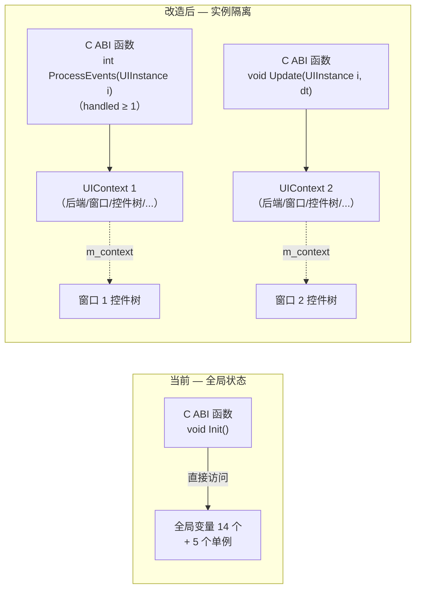
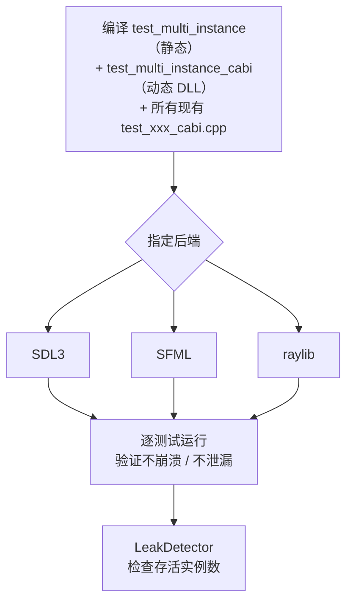
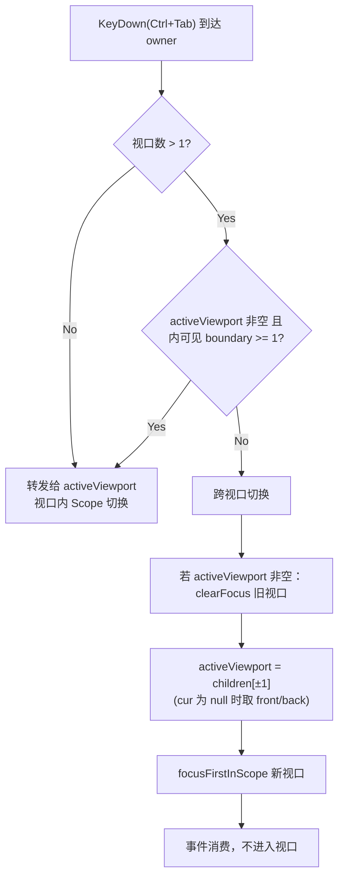

# C ABI 多实例支持改造设计

> 对应 Phase 16ii | 编制 2026-07-30 | 修订 2026-07-31 | **2026-08-03 实施完成（核心框架），状态：已实施** | **2026-08-04 收尾：专项测试 + #17 + 校验 + 标题标记全部落地（见各节 2026-08-04 实施状态注）** | **2026-08-08 能力位 + raylib headless 化（见 §5.2/§5.6/§5.12.2/§6 #34）**

## 目录

1. [问题](#1-问题)
2. [全局状态清单](#2-全局状态清单)
3. [改造目标](#3-改造目标)
4. [架构对比](#4-架构对比)
5. [详细设计](#5-详细设计)
   - [5.1 UIContext — 实例上下文](#51-uicontext--实例上下文)
   - [5.2 C ABI 新签名](#52-c-abi-新签名)
   - [5.3 单例改造](#53-单例改造)
   - [5.4 Control 层适配](#54-control-层适配)
   - [5.5 宏重定义](#55-宏重定义)
   - [5.6 后端插件改造](#56-后端插件改造)
   - [5.7 Surface / Cursor 工厂](#57-surface--cursor-工厂)
   - [5.8 生命周期时序](#58-生命周期时序)
   - [5.9 错误处理与事务性回滚](#59-错误处理与事务性回滚)
   - [5.10 所有权模型](#510-所有权模型)
   - [5.11 调试与诊断支持](#511-调试与诊断支持)
   - [5.12 测试方案](#512-测试方案)
   - [5.13 扩展分析：单窗口多 BENCH 视口](#513-扩展分析单窗口多-bench-视口)
6. [实施清单](#6-实施清单)
7. [风险与注意事项](#7-风险与注意事项)

---

## 1. 问题

> **实施状态（2026-08-03）**：本节描述的历史问题已全部解决——14 个全局变量已迁入 `UIContext`（UIContext.h），5 个单例改为实例持有，C ABI 全部函数已加 `UIInstance` 首参。保留本节作为改造动机的记录。

当前 C ABI 曾通过**文件作用域静态变量**和**类静态单例**共享状态，进程生命周期内只能存在一个 UICornerstone 实例。

```cpp
// src/UICornerstoneAPI.cpp — 14 个全局变量（修订：补 g_menuPool；static char buf[256] 在 GetControlId 函数体内，非全局，见 §2.1）
namespace {
    const UIBackendCallbacks* g_callbacks = nullptr;
    Window* g_window = nullptr;
    bool g_initialized = false;
    // ... 共 14 个（详见 §2.1）
}

// 5 个单例
BackendManager::instance()   → static BackendManager mgr
MainWindow::getInstance()    → static MainWindow instance
Bench::getInstance()         → static Bench instance
EventQueue::getInstance()    → static EventQueue instance
DataContext::getInstance()   → static shared_ptr<DataContext> s_instance
```

**实际限制**：

| 场景 | 结果 |
|------|------|
| 进程内创建两个 UI 窗口 | `UICornerstone_Init` 第二次直接返回 1，不生效 |
| 先 Init 再 Shutdown 再 Init | Shutdown 不重置标志，无法重新初始化 |
| 从两个线程同时操作 | 无锁，数据竞争 |

## 2. 全局状态清单

> **实施状态（2026-08-03）**：以下清单为改造前状态。14 项已全部迁入 `UIContext` 结构体成员（UIContext.h），5 个单例已实例化，宏已改为 `GET_CONTEXT` 版本。**遗留未实施项**：后端插件 3 个 DLL 的静态缓存仍保留（§2.4/§5.6，不影响多实例隔离——BackendManager 单实例缓存窗口对象，子视口共享；仅"同时多窗口"场景受限），`test_multi_instance.cpp` / `test_multiviewport.cpp` 尚未创建。
>
> **实施状态（2026-08-04）**：§2.4 后端插件静态缓存（#17）已移除（三后端 BackendPlugin.cpp 每次 `new`，见 §5.6）；`test_multi_instance.cpp` / `test_multiviewport.cpp` 已创建并在三后端（SDL3/SFML/raylib）全部通过（见 §5.12.2/§5.13.7）。**遗留**：#21（C++ Binding），见 §6（#19 已以 `resourceRoot` 替代关闭跟踪）。

### 2.1 UICornerstoneAPI.cpp（实例上下文，14 项）

> 修订说明（2026-07-31）：原清单 13 项，遗漏 `g_menuPool`（Menu C ABI 补齐时加入的保活池），现为 **14 项**。
>
> 复核修订（2026-07-31）：`static char buf[256]` **不在匿名 namespace 中**——它位于 `UICornerstone_GetControlId` 函数体内（src/UICornerstoneAPI.cpp:913），是该函数返回 `const char*` 的静态输出缓冲，**并非 GetString 输出缓冲**（`GetString`/`GetEnum`，cpp:1173-1183，使用调用者传入的 out 缓冲 + `strncpy_s`）。它属于线程不安全的进程级静态（多实例并发调 GetControlId 会互踩），改造时一并改为 `UIContext` 内 `std::string strBuf`（见 §5.1）。
>
> **以下 14 项全部迁入 UIContext**。

| 变量 | 类型 | 说明 |
|------|------|------|
| `g_callbacks` | `const UIBackendCallbacks*` | 后端回调表 |
| `g_window` | `Window*` | 窗口对象 |
| `g_renderDevice` | `RenderDevice*` | 渲染设备 |
| `g_inputBackend` | `InputBackend*` | 输入后端 |
| `g_textRenderer` | `TextRenderer*` | 文本渲染器 |
| `g_resourceProvider` | `CallbackResourceProvider*` | 资源提供者 |
| `g_initialized` | `bool` | 初始化标志 |
| `g_quit` | `bool` | 退出请求标志 |
| `g_viewport` | `SRect` | 视口矩形 |
| `g_actions` | `unordered_map<string, pair<回调,userData>>` | 动作注册表 |
| `g_controlsById` | `unordered_map<string, UIControlHandle>` | ID→控件映射 |
| `g_queuedEvents` | `queue<UIEvent>` | 注入事件队列 |
| `g_popupPool` | `vector<shared_ptr<Popup>>` | 弹窗生命周期池 |
| `g_menuPool` | `vector<shared_ptr<Control>>` | 菜单保活池（`menuPoolKeep`/`menuPoolTake`） |

### 2.2 单例类（5 个 → 改为实例持有）

| 类 | 持有状态 | 当前引用方式 |
|----|---------|-------------|
| `BackendManager` | 后端 API 表 + 4 个后端对象指针 | `BackendManager::instance()` |
| `MainWindow` | 窗口尺寸/位置、ResourceProvider、FocusManager | `MainWindow::getInstance()` → `MAINWIN` 宏 |
| `Bench` | 控件树根节点、控件列表 | `Bench::getInstance()` → `BENCH` 宏 |
| `EventQueue` | 事件队列 + 观察器映射表 | `EventQueue::getInstance()` |
| `DataContext` | 数据绑定映射表 | `DataContext::instance()` |

### 2.3 宏依赖（7 个宏，散布 ~20 个源文件）

```cpp
#define BENCH              (Bench::getInstance())
#define MAINWIN            (MainWindow::getInstance())
#define GET_RENDERDEVICE   (MAINWIN->getRenderDevice())
#define GET_TEXTRENDERER   (MAINWIN->getTextRenderer())
#define GET_INPUTBACKEND   (MAINWIN->getInputBackend())
#define GET_RESOURCEPROVIDER (MAINWIN->getResourceProvider())
#define GET_FOCUSMANAGER   (MAINWIN->getFocusManager())
```

### 2.4 后端插件缓存（3 个后端 × 5 个创建函数 = 15 个静态变量）

> 修订说明（2026-07-31）：原清单只列 4 个创建函数，**遗漏 `createResourceProvider`**（回调表 `UIBackendCallbacks` 中 Window/RenderDevice/InputBackend/TextRenderer/ResourceProvider 各一个创建函数）。且 **destroy 回调在 `UIBackendCallbacks` 中已全部存在**（`destroyWindow`/`destroyRenderDevice`/`destroyInputBackend`/`destroyTextRenderer`/`destroyResourceProvider`，见 UICornerstoneAPI.h:105-171）——多实例改造无需新增回调，见 §5.6。

每个 `UIBackend_xxx.dll` 缓存在 `static` 变量中，创建第二个实例会覆盖第一个。

```cpp
// backend/sdl3/BackendPlugin.cpp
static Window* g_pluginWin = nullptr;
UIWindowHandle bridge_createWindow(...) {
    if (!g_pluginWin) g_pluginWin = new SDL3Window(...);
    return (UIWindowHandle)g_pluginWin;
}
```

### 2.5 ConstDef 全局常量（1 项，非 blocking 但需关注）

```cpp
// src/ConstDef.cpp
std::string g_pathPrefix = "assets/";
```

当前为进程级全局 `std::string`。多实例场景下，若所有实例共享同一资源根目录，可保持静态；若需不同，则迁入 `UIContext`。见 §7 风险 4。

## 3. 改造目标

1. **`CreateInstance` / `DestroyInstance`** — 进程内可创建多个独立实例
2. **`UIInstance` 显式参数** — 所有 C ABI 函数首参为 `UIInstance`，精确指向目标实例
3. **控件层 `m_context`** — 每个 Control 通过成员变量持有所属上下文
4. **无需过渡层** — 无用户依赖，C ABI 签名一次性改为新形式

## 4. 架构对比



## 5. 详细设计

### 5.1 UIContext — 实例上下文

> **实施状态（2026-08-03）**：`include/UIContext.h` / `src/UIContext.cpp` 已按本设计实现，与实际代码的差异如下（均为实施时的细化，非设计偏离）：
> - 新增实例配置字段：`windowTitle` / `windowWidth` / `windowHeight` / `windowFlags` / `resourceRoot`（`UIInstanceConfig` 透传，见 §5.2）
> - 新增静态辅助：`getLastInstance()`/`setLastInstance()`（浮层控件无 parent 归属时的兜底解析，Dialog.cpp:108 使用）、`registerActive()`/`unregisterActive()`/`isActive()`（实例活跃注册表，进程退出期残留控件析构守卫，见 §5.11.3 修订）
> - 下方伪代码中的 `pathPrefix` 注释字段未实施（`ConstDef::pathPrefix` 保持静态，per-instance 覆盖由 `UIInstanceConfig.resourceRoot` 提供，见 §7.2 非风险表 g_pathPrefix 行）
> - `initialize()` 实际顺序与下方伪代码不同：`EventQueue`/`DataContext` 在 `MainWindow` 之前创建（Bench 构造绑定 `ctx->eventQueue`，须先建）；`FocusManager` + `Bench` 为最后一步；子视口（`ownsBackend=false`）跳过 Backend/MainWindow，从 owner 继承全部后端指针

新增头文件，聚合一个实例的全部状态：

```cpp
// include/UIContext.h
#pragma once
#include <string>
#include <unordered_map>
#include <queue>
#include <memory>
#include <functional>
#include "UICornerstoneAPI.h"

class Window;
class RenderDevice;
class InputBackend;
class TextRenderer;
class ResourceProvider;
class MainWindow;
class Bench;
class EventQueue;
class DataContext;
class FocusManager;
class Popup;
class BackendManager;

struct UIContext {
    // ── Backend 资源 ──
    const UIBackendCallbacks* callbacks = nullptr;
    Window*          window = nullptr;
    RenderDevice*    renderDevice = nullptr;
    InputBackend*    inputBackend = nullptr;
    TextRenderer*    textRenderer = nullptr;
    ResourceProvider* resourceProvider = nullptr;

    // ── 初始化状态 ──
    bool initialized = false;
    bool quit = false;

    // ── 视口 ──
    SRect viewport{0, 0, 1024, 768};

    // ── 原单例（由 UIContext 持有，非静态） ──
    BackendManager* backendManager = nullptr;
    MainWindow*     mainWindow = nullptr;
    Bench*          bench = nullptr;
    EventQueue*     eventQueue = nullptr;
    DataContext*    dataContext = nullptr;

    // ── 动作与控件查找 ──
    std::unordered_map<std::string,
        std::pair<UIActionCallback, void*>> actions;
    std::unordered_map<std::string, UIControlHandle> controlsById;

    // ── 注入事件队列 ──
    std::queue<UIEvent> queuedEvents;

    // ── 弹窗生命周期 ──
    std::vector<std::shared_ptr<Popup>> popupPool;

    // ── 菜单保活池（修订：g_menuPool 迁入，见 §2.1） ──
    std::vector<std::shared_ptr<Control>> menuPool;

    // ── 实例内字符串缓冲（复核修订：替代 GetControlId 的 static char buf[256]（cpp:637）；
    //    非 GetString 缓冲——GetString/GetEnum 用调用者传入的 out，见 §2.1） ──
    std::string strBuf;

    // ── 资源路径（从 ConstDef 迁入，见 §7 风险 4） ──
    // std::string pathPrefix;

    // ── 初始化与销毁 ──
    bool initialize();
    void destroy();
};
```

`initialize()` 的实际实现（src/UIContext.cpp，与上方伪代码的差异见修订说明）：

```cpp
// src/UIContext.cpp
bool UIContext::initialize() {
    instanceId = s_nextInstanceId++;
    setLastInstance(this);
    registerActive(this);
    if (debugLabel.empty()) {
        debugLabel = "Instance_" + std::to_string(instanceId);
    }

    // 步骤 1: Backend（仅 owner 创建；子视口共享 owner 后端）
    if (ownsBackend) {
        backendManager = new BackendManager();
        const char* title = windowTitle.empty() ? nullptr : windowTitle.c_str();
        if (!backendManager->initialize(callbacks, title,
                                        windowWidth, windowHeight, windowFlags)) {
            delete backendManager;
            backendManager = nullptr;
            return false;
        }
        window = backendManager->window();
        renderDevice = backendManager->renderDevice();
        inputBackend = backendManager->inputBackend();
        textRenderer = backendManager->textRenderer();
    } else if (owner) {
        backendManager = owner->backendManager;
        window = owner->window;
        renderDevice = owner->renderDevice;
        inputBackend = owner->inputBackend;
        textRenderer = owner->textRenderer;
        resourceProvider = owner->resourceProvider;
        viewport = owner->viewport;  // 兜底；CreateViewport 已在创建时写入
    }

    // 步骤 2: EventQueue / DataContext（Bench 构造绑定 ctx->eventQueue，须先建）
    eventQueue = new EventQueue();
    dataContext = new DataContext();

    // 步骤 3: MainWindow（仅 owner 创建；子视口共享 owner 的 ResourceProvider）
    if (ownsBackend) {
        mainWindow = new MainWindow(this);
        if (!mainWindow->getResourceProvider()) {
            delete mainWindow;
            mainWindow = nullptr;
            goto rollback;
        }
        resourceProvider = mainWindow->getResourceProvider();
    }

    // 步骤 4: FocusManager + Bench（控件树根）
    focusManager = new FocusManager();
    bench = new Bench(this);
    bench->show();

    initialized = true;
    quit = false;
    return true;

rollback:
    delete dataContext;     dataContext = nullptr;
    delete eventQueue;      eventQueue = nullptr;
    if (backendManager) {
        backendManager->shutdown();
        delete backendManager;
        backendManager = nullptr;
    }
    window = nullptr;
    renderDevice = nullptr;
    inputBackend = nullptr;
    textRenderer = nullptr;
    resourceProvider = nullptr;
    return false;
}
```

`destroy()` 的实际实现（逆序析构 + 活跃注册表摘除）：

```cpp
// src/UIContext.cpp
void UIContext::destroy() {
    quit = true;
    popupPool.clear();
    menuPool.clear();
    controlsById.clear();
    actions.clear();
    while (!queuedEvents.empty()) queuedEvents.pop();

    delete dataContext;     dataContext = nullptr;
    delete eventQueue;      eventQueue = nullptr;
    delete bench;           bench = nullptr;
    delete mainWindow;      mainWindow = nullptr;
    delete focusManager;    focusManager = nullptr;

    if (ownsBackend && backendManager) {
        backendManager->shutdown();
        delete backendManager;
    }
    backendManager = nullptr;
    window = nullptr;
    renderDevice = nullptr;
    inputBackend = nullptr;
    textRenderer = nullptr;
    resourceProvider = nullptr;
    callbacks = nullptr;
    initialized = false;
    unregisterActive(this);
}
```

> 注：`destroy()` 不负责子视口（`children`）的销毁——由 `UICornerstone_DestroyInstance` 在调用 `destroy()` 前快照遍历递归销毁（见 §5.2/§5.13.5）。

### 5.2 C ABI 新签名

句柄类型：

```c
// include/UICornerstoneAPI.h
typedef struct UIContext* UIInstance;
```

新增配置结构体（可选，未来扩展用；`structSize` 用于 C API 版本兼容检查，调用方须填 `sizeof(UIInstanceConfig)`）：

```c
typedef struct {
    uint32_t    structSize;         // 必须填 sizeof(UIInstanceConfig)
    const char* debugLabel;         // 调试标签
    const char* resourceRoot;       // 资源根目录，null→默认
    const char* windowTitle;        // 窗口标题，null→"UICornerstone"
    int         windowWidth;        // 0→默认
    int         windowHeight;       // 0→默认
    uint32_t    windowFlags;        // 跨后端统一窗口标志（UIWindowFlags，值对齐 SDL_WINDOW_*）
    uint32_t    reserved[6];        // 未来扩展预留
} UIInstanceConfig;

#define UI_INSTANCE_CONFIG_DEFAULT \
    { sizeof(UIInstanceConfig), NULL, NULL, NULL, 0, 0, 0, {0} }
```

> **实施状态（2026-08-03）**：实际 `UIInstanceConfig`（UICornerstoneAPI.h:37-46）比原稿多出 `windowFlags` 字段（第 7 个，位于 `windowHeight` 与 `reserved[6]` 之间），`UI_INSTANCE_CONFIG_DEFAULT` 为 7 个初值。`CreateInstance` 读取该字段时按 `structSize` 守卫（旧客户端 structSize 更小时不读取，保证向后兼容）：
> ```cpp
> if (config->structSize >= offsetof(UIInstanceConfig, windowFlags) + sizeof(config->windowFlags)) {
>     ctx->windowFlags = config->windowFlags;
> }
> ```

> **修订说明（2026-07-31）**：原稿在 §5.2 与 §5.11.1 出现两处不一致定义（`reserved[8]` vs `structSize + reserved[6]`）。本处统一为带 `structSize` 的版本（与 §7.2 的版本兼容策略一致）。**2026-08-03 已实施**：§5.11.1 的定义已与本处完全一致（实际定义见上，含 `windowFlags`）。

实例生命周期——只有两个函数，没有独立的 Init/Shutdown：

```c
UICORNERSTONE_API UIInstance UICornerstone_CreateInstance(
    const UIBackendCallbacks* callbacks,
    const UIInstanceConfig* config);       // NULL → 全默认

UICORNERSTONE_API void UICornerstone_DestroyInstance(
    UIInstance instance);
```

**`InitFromPlugin` 的迁移**：现有 `UICornerstone_InitFromPlugin(const char* pluginName)`（LoadLibrary 加载 `UIBackend_xxx.dll` 后回调 `GetUIBackendCallbacks`）保留能力，改造为实例化入口：

```c
UICORNERSTONE_API UIInstance UICornerstone_CreateInstanceFromPlugin(
    const char* pluginName,
    const UIInstanceConfig* config);       // 内部: LoadLibrary + GetProcAddress
                                           // + GetUIBackendCallbacks → CreateInstance
```

`CreateInstance` 与 `CreateInstanceFromPlugin` 共享同一实现（后者多一步插件解析）。静态链接路径（测试/示例直接调 `GetUIBackendCallbacks`）走前者。

所有功能函数新增 `UIInstance` 首参数，删除旧签名。**完整迁移清单（63 个现有导出 + 4 个新增 Debug 辅助）**：

**帧循环与视口**（旧签名 → 新签名）：

| 现有函数 | 新签名 |
|---------|--------|
| `SetViewport(x, y, w, h)` | `SetViewport(UIInstance, float x, float y, float w, float h)` |
| `GetViewport(float*...)` | `GetViewport(UIInstance, float*...)` |
| `ProcessEvents()` | `ProcessEvents(UIInstance) → int`（handled ≥ 1；调用者驱动所有实例直到队列空，见 §5.13.5） |
| `Update(dt)` | `Update(UIInstance, double deltaTime)` |
| `PushUIEvent(const UIEvent*)` | `PushUIEvent(UIInstance, const UIEvent*)` |
| `Render()` | `Render(UIInstance)` |
| `Clear()` | `Clear(UIInstance)` |
| `Present()` | `Present(UIInstance)` |
| `IsQuitRequested()` | `IsQuitRequested(UIInstance)` |

**布局与查找**：

| 现有函数 | 新签名 |
|---------|--------|
| `LoadLayout(json)` | `LoadLayout(UIInstance, const char* jsonContent)` |
| `LoadLayoutFromFile(path)` | `LoadLayoutFromFile(UIInstance, const char* filePath)` |
| `FindControl(id)` | `FindControl(UIInstance, const char* id)` |
| `RegisterAction(name, cb, userData)` | `RegisterAction(UIInstance, const char* name, UIActionCallback, void*)` |

**控件工厂（全部保留原参数，`UIInstance` 作首参）**——注意：不存在"通用 `CreateControl(instance, type)` 工厂"，每个控件一个具体工厂：

| 现有函数 | 新签名 |
|---------|--------|
| `CreateButton(text, x,y,w,h)` | `CreateButton(UIInstance, const char* text, float x, float y, float w, float h)` |
| `CreateLabel(text, fontSize, x,y,w,h)` | `CreateLabel(UIInstance, ...)` |
| `CreateCheckBox(text, x,y,w,h)` | `CreateCheckBox(UIInstance, ...)` |
| `CreateEditBox(x,y,w,h)` | `CreateEditBox(UIInstance, ...)` |
| `CreateProgressBar(x,y,w,h)` | `CreateProgressBar(UIInstance, ...)` |
| `CreateSlider(x,y,w,h,min,max,value)` | `CreateSlider(UIInstance, ...)` |
| `CreatePanel(x,y,w,h)` | `CreatePanel(UIInstance, ...)` |
| `CreateTextArea(x,y,w,h)` | `CreateTextArea(UIInstance, ...)` |
| `CreateWinFrame(title, x,y,w,h)` | `CreateWinFrame(UIInstance, ...)` |
| `CreateMenuBar(x,y,w,h)` | `CreateMenuBar(UIInstance, ...)` |
| `CreateMenuPanel()` | `CreateMenuPanel(UIInstance)` |
| `CreateMenuItem(caption, type)` | `CreateMenuItem(UIInstance, const char* caption, int type)` |
| `MenuBarAddMenu(bar, caption, panel)` | `MenuBarAddMenu(UIInstance, UIControlHandle bar, const char* caption, UIControlHandle panel)` |
| `MenuPanelAddItem(panel, item)` | `MenuPanelAddItem(UIInstance, UIControlHandle, UIControlHandle)` |
| `MenuPanelAddSeparator(panel)` | `MenuPanelAddSeparator(UIInstance, UIControlHandle)` |
| `MenuItemSetSubMenu(item, panel)` | `MenuItemSetSubMenu(UIInstance, UIControlHandle, UIControlHandle)` |
| `CreateColorPicker(x,y,w,h,color)` | `CreateColorPicker(UIInstance, ...)` |
| `CreateNumericUpDown(x,y,w,h)` | `CreateNumericUpDown(UIInstance, ...)` |
| `CreateComboBox(x,y,w,h)` | `CreateComboBox(UIInstance, ...)` |
| `CreateSplitter(x,y,w,h,orientation)` | `CreateSplitter(UIInstance, ...)` |
| `CreateScrollBar(x,y,w,h,orientation)` | `CreateScrollBar(UIInstance, ...)` |
| `CreateTreeView(x,y,w,h)` | `CreateTreeView(UIInstance, ...)` |
| `CreateHandleControl(target, x,y,w,h)` | `CreateHandleControl(UIInstance, UIControlHandle target, float x, float y, float w, float h)` |
| `CreateImageButton(n,h,p, x,y,w,h)` | `CreateImageButton(UIInstance, const char*, const char*, const char*, float x, float y, float w, float h)` |
| —（新增，无旧签名） | `CreateImage(UIInstance, const char* image, float x, float y, float w, float h)`——Image 图片控件（零架构改动复用 Actor，见 doc/Image_Design.md 2026-08-05）；image 可 NULL、w/h=0 → 纹理自然尺寸 |
| `CreateDialog(confirm, cancel, x,y,w,h)` | `CreateDialog(UIInstance, const char* confirmText, const char* cancelText, float x, float y, float w, float h)` |

**控件通用操作**：

| 现有函数 | 新签名 |
|---------|--------|
| `SetRect(ctl, x,y,w,h)` | `SetRect(UIInstance, UIControlHandle, float x, float y, float w, float h)` |
| `GetRect(ctl, float*...)` | `GetRect(UIInstance, UIControlHandle, float*...)` |
| `AddChildControl(parent, child)` | `AddChildControl(UIInstance, UIControlHandle, UIControlHandle)` |
| `DestroyControl(ctl)` | `DestroyControl(UIInstance, UIControlHandle)` |
| `GetControlId(ctl)` | `GetControlId(UIInstance, UIControlHandle)` |

**属性系统（16 个）**——统一模式 `(UIInstance, UIControlHandle, prop, ...)`：

| Setter（8） | Getter（8） |
|------------|------------|
| `SetColor(inst, ctl, prop, UIColor)` | `GetColor(inst, ctl, prop, UIColor*)` |
| `SetStateColor(inst, ctl, prop, UIStateColor)` | `GetStateColor(inst, ctl, prop, UIStateColor*)` |
| `SetBool(inst, ctl, prop, int)` | `GetBool(inst, ctl, prop, int*)` |
| `SetInt(inst, ctl, prop, int)` | `GetInt(inst, ctl, prop, int*)` |
| `SetFloat(inst, ctl, prop, float)` | `GetFloat(inst, ctl, prop, float*)` |
| `SetString(inst, ctl, prop, const char*)` | `GetString(inst, ctl, prop, char*, int maxLen)` |
| `SetEnum(inst, ctl, prop, const char*)` | `GetEnum(inst, ctl, prop, char*, int maxLen)` |
| `SetPtr(inst, ctl, prop, void*)` | `GetPtr(inst, ctl, prop, void**)` |

**事件回调**：

| 现有函数 | 新签名 |
|---------|--------|
| `SetCallback(ctl, event, cb, userData)` | `SetCallback(UIInstance, UIControlHandle, const char* event, UIEventCallback, void*)` |

**新增 Debug 辅助**（复核修订：共 4 个，2 个实例注册表 + 2 个焦点查询；见 §5.11 / §5.13，Debug 构建）：

```c
UICORNERSTONE_API int      UICornerstone_Debug_GetAliveCount(void);
UICORNERSTONE_API UIInstance UICornerstone_Debug_GetActiveViewport(UIInstance instance);
UICORNERSTONE_API int      UICornerstone_Debug_IsControlFocused(UIInstance instance, UIControlHandle control);
```

**新增能力查询**（2026-08-08，Phase 16j，见 BackendAbstraction_Design.md §20）：

```c
UICORNERSTONE_API uint32_t UICornerstone_GetBackendCapabilities(UIInstance instance);
```

- 返回 `UICORN_BACKEND_CAP_*` 位组合（MULTI_WINDOW=1<<0 / RENDER_TARGET=1<<1 / CLIP_RECT=1<<2 / READBACK=1<<3），查询失败（instance 无效）返回 0。
- 能力位同时存在于 `BackendAPI`（BackendPlugin.h，静态链接路径）与 `UIBackendCallbacks`（回调表路径，结构体末尾追加字段，向后兼容）——`BackendManager::initialize` 两条路径均保存，`BackendManager::capabilities()` 查询。
- **用途**：raylib 后端为单窗口架构（CORE 全局只跟踪最近窗口，DLL 无源码不可修补），声明 `RENDER_TARGET|CLIP_RECT|READBACK`（**无 MULTI_WINDOW**）；sdl3/sfml 四能力全有。调用方（测试/样例/Binding）据此条件化第二实例的渲染/交换——单窗口后端非首个实例为 headless，渲染会串扰到主实例窗口（闪动）。

> **控件句柄归属校验**：`UIControlHandle` 是裸指针，C ABI 层无法判断句柄属于哪个实例。建议所有带句柄的函数入口校验：句柄为空 → 直接返回 0/NULL；句柄非本实例（遍历 `instance->controlsById` 或控件树，O(n)，仅 Debug 构建开启）→ 断言。Release 构建不做归属校验（性能优先），行为由调用方保证，见 §7 风险 5。
>
> **实施状态（2026-08-03）**：**未实施**——`UICornerstoneAPI.cpp` 无任何句柄归属校验（`_DEBUG` 仅用于实例注册表/LeakDetector，见 §5.11.3），Release 与 Debug 均不做。跨实例句柄误用属调用方责任（§7 风险 5）。
>
> **实施状态（2026-08-04）**：**已实施**——`_DEBUG` 下新增 `validateControl`（UICornerstoneAPI.cpp:78-116）：`treeContains` 遍历本实例 bench 控件树（`controlsById` + 后代 DFS）+ `popupPool`/`menuPool` 兜底，非法句柄直接 `assert`（Debug 断言，Release 返回 0/NULL 不崩溃）。已接入 27 个带句柄入口（SetRect/GetRect/AddChildControl/GetControlId/DestroyControl/CreateHandleControl/8 个属性 getter/9 个属性 setter/menu 系列 4 个）。Release 仍不做（性能优先），见 §7 风险 5。
>
> **实施状态（2026-08-05，修订）**：`popupPool`/`menuPool` **根级**兜底暴露出盲区——Dialog 挂载于 popupPool，其子控件（如 rSlider/gSlider/bSlider）位于 Dialog 子树内，对子控件句柄校验时遍历根集合未命中 → test_dialog_cabi 触发断言 "control handle not owned by this instance"（UICornerstoneAPI.cpp:109）。已改为对 `popupPool`/`menuPool` 每个条目再作 `treeContains` **递归**校验（覆盖整个 popup/menu 子树），SDK 重建后 SDL3/SFML/raylib 三后端 test_dialog_cabi 均 EXIT=0。

**`CreateInstance` 内部流程**（实际实现，src/UICornerstoneAPI.cpp:270-313）：

```c
UIInstance UICornerstone_CreateInstance(
    const UIBackendCallbacks* callbacks,
    const UIInstanceConfig* config) {

    if (!callbacks || callbacks->version != 1) return NULL;

    auto* ctx = new UIContext();
    ctx->callbacks = callbacks;

    // 应用配置
    if (config) {
        if (config->debugLabel) ctx->debugLabel = config->debugLabel;
        if (config->resourceRoot) ctx->resourceRoot = config->resourceRoot;
        if (config->windowTitle) ctx->windowTitle = config->windowTitle;
        ctx->windowWidth  = config->windowWidth;
        ctx->windowHeight = config->windowHeight;
        // windowFlags 为新增字段：旧客户端 structSize 更小，按大小守卫读取
        if (config->structSize >= offsetof(UIInstanceConfig, windowFlags) + sizeof(config->windowFlags)) {
            ctx->windowFlags = config->windowFlags;
        }
    }

    if (!ctx->initialize()) {
        delete ctx;
        return NULL;
    }

    // 初始化视口为窗口尺寸，并通知控件树
    if (ctx->window) {
        SSize sz = ctx->window->getSize();
        ctx->viewport = SRect(0, 0, sz.width, sz.height);
        ctx->bench->resized(ctx->viewport);
    }

    // 一次空的 clear+present，确保 OpenGL context 激活（后续纹理创建需要）
    if (ctx->renderDevice) {
        ctx->renderDevice->setDrawColor(SColor(0, 0, 0, 0));
        ctx->renderDevice->clear();
        ctx->renderDevice->present();
    }

    registerInstance(ctx);
    printf("[%s] created\n", ctx->debugLabel.c_str());
    return ctx;
}
```

**`CreateViewport` 内部流程**（实际实现，cpp:273-297）：

```c
UIInstance UICornerstone_CreateViewport(UIInstance parent, UIRect rect) {
    if (!parent || !parent->initialized || parent->destroying) return NULL;
    if (!parent->ownsBackend) return NULL;  // 只能从 owner 创建

    auto* vp = new UIContext();
    vp->owner = parent;
    vp->ownsBackend = false;
    vp->callbacks = parent->callbacks;
    vp->viewport = SRect(rect.x, rect.y, rect.w, rect.h);

    if (!vp->initialize()) {
        delete vp;
        return NULL;
    }
    vp->bench->resized(vp->viewport);

    parent->children.push_back(vp);
    // 首个子视口自动设为活动视口（键盘事件投递目标）
    if (!parent->activeViewport) parent->activeViewport = vp;

    registerInstance(vp);
    return vp;
}
```

**`DestroyInstance` 内部流程**（实际实现，cpp:299-327，含快照遍历 + destroying 防重入 + owner 摘除）：

```c
void UICornerstone_DestroyInstance(UIInstance instance) {
    if (!instance || instance->destroying) return;
    instance->destroying = true;  // 置位：回调重入的 C ABI 入口直接短路
    unregisterInstance(instance);

    // 快照遍历：子视口销毁时会从 owner->children 摘除自身
    auto snapshot = instance->children;
    for (auto* child : snapshot) {
        if (instance->activeViewport == child) {
            instance->activeViewport = NULL;
        }
        UICornerstone_DestroyInstance(child);
    }
    instance->children.clear();

    instance->destroy();

    // 从 owner 摘除 + 清 activeViewport 引用（直接销毁子视口路径）
    if (instance->owner) {
        if (instance->owner->activeViewport == instance) {
            instance->owner->activeViewport = NULL;
        }
        auto& cs = instance->owner->children;
        cs.erase(std::remove(cs.begin(), cs.end(), instance), cs.end());
    }

    printf("[%s] destroyed\n", instance->debugLabel.c_str());
    delete instance;
}
```

### 5.3 单例改造

每个单例取消 `static getInstance()`，改为普通类，由 `UIContext` 持有并管理生命周期。

#### BackendManager

> **实施状态（2026-08-03）**：实际 `BackendManager`（BackendPlugin.h:33-67）与下方伪代码的差异：`initialize` 有**两个重载**——`initialize(const std::string& backendName = "sdl3")`（静态链接路径）与 `initialize(const UIBackendCallbacks* callbacks, const char* title, int w, int h, uint32_t flags)`（插件/实例路径）；保留了 `m_initialized` 标志（非移除）。`registerBackend`/`s_registeredAPI` 仍为 static，与设计一致。

```cpp
// include/BackendPlugin.h
class BackendManager {
public:
    BackendManager();
    ~BackendManager();

    bool initialize(const std::string& backendName = "sdl3");
    bool initialize(const UIBackendCallbacks* callbacks,
                    const char* title, int w, int h, uint32_t flags);
    void shutdown();

    Window* window() const { return m_window; }
    RenderDevice* renderDevice() const { return m_renderDevice; }
    InputBackend* inputBackend() const { return m_inputBackend; }
    TextRenderer* textRenderer() const { return m_textRenderer; }

    // s_registeredAPI 保留为静态（进程级后端注册表，只读）
    static void registerBackend(const BackendAPI& api);
    static const BackendAPI& registeredAPI();

private:
    Window* m_window = nullptr;
    RenderDevice* m_renderDevice = nullptr;
    InputBackend* m_inputBackend = nullptr;
    TextRenderer* m_textRenderer = nullptr;
    bool m_initialized = false;

    static BackendAPI s_registeredAPI;  // 进程级，只读
};
```

**变化**：
- 构造函数不再调用 `initialize`
- `initialize/shutdown` 改为实例方法（原为类静态方法）
- 实例初始化状态由 `m_initialized` 体现；实例级就绪状态由 `UIContext::initialized` 体现
- `s_registeredAPI` 仍为 static（后端 DLL 加载后写入一次，后续只读）

#### MainWindow / Bench

> **实施状态（2026-08-03）**：实际 `MainWindow`（MainWindow.h:14-67）已取消单例（`explicit MainWindow(UIContext* ctx)`），`getFocusManager()` 已移除，窗口尺寸/资源解析均经 `m_context` 转发（子视口共享 owner 后端）。`Bench`（Bench.h:19-38）已改为 `explicit Bench(UIContext* ctx)` 显式构造，静态 `getInstance()` 单例与无参构造已删除。注意 `MainWindow` 保留了 `run(AppCallbacks*)` / `processEvents(AppCallbacks*)` 等 AppCallbacks 驱动的旧模式（内部经 `m_context` 解析，多实例下仅操作本实例的 Bench/EventQueue）。

```cpp
// include/MainWindow.h
class MainWindow {
public:
    explicit MainWindow(UIContext* ctx);
    ~MainWindow();

    ResourceProvider* getResourceProvider() { return m_resourceProvider.get(); }
    // 窗口/后端资源经 m_context 解析（子视口共享 owner 后端）
    Window* getWindow(void) { return m_context ? m_context->window : nullptr; }
    // ...
    // FocusManager 已移入 UIContext，访问经 GET_FOCUSMANAGER（§5.5 宏）或 instance->focusManager

private:
    UIContext* m_context;
    std::unique_ptr<ResourceProvider> m_resourceProvider;
};
```

```cpp
// include/Bench.h — 实施状态：Bench 即控件树根（继承 Panel + TopControl），
// 私有构造 + 静态 getInstance() 单例已改为显式 UIContext 构造（Bench.h:19-38）
class Bench : public Panel, public TopControl {
public:
    explicit Bench(UIContext* ctx);
    ~Bench();

    // getContext() 由 Control 基类提供（§5.4），无需重复持有 m_context
    // 控件树根即为自身：instance->bench->addControl(child)
};
```

#### EventQueue / DataContext

> **实施状态（2026-08-03）**：均已去掉单例（EventQueue 无 `getInstance()`，DataContext 无 `s_instance`），实例由 UIContext 持有。

```cpp
// EventQueue.h — 去掉 getInstance()
class EventQueue {
public:
    void push(const UIEvent& event);
    UIEvent pop();
    bool empty() const;
};
```

```cpp
// DataContext.h — 去掉 s_instance
class DataContext {
public:
    // ...
};
```

### 5.4 Control 层适配

> **实施状态（2026-08-03）**：`Control` 基类已加 `UIContext* m_context` 成员与 `getContext()`/`setContext()`（ControlBase.h）。实际 `ControlImpl::setContext`（ControlBase.cpp:110-129）比下方伪代码多两项行为：
> 1. **focusManager 补注册**：`setContext` 时若 `m_focusable && ctx->focusManager` 则 `registerControl(this)`（两阶段创建期间 setFocusable 时 context 为空导致漏注册，Tab 遍历不到）
> 2. **recreate 递归**：自身 `recreate()` + 递归子控件 `setContext(ctx)` + `recreate()`（两阶段创建补建，各派生 create 内部以 `GET_CONTEXT` 守卫决定是否真正补建）
>
> `ControlImpl::addControl`（ControlBase.cpp:335-357）已实现上下文继承：`if (!child->getContext()) child->setContext(m_context)`，并两阶段传播 render device。

基类增加 `UIContext* m_context`：

```cpp
// include/ControlBase.h
class Control {
public:
    explicit Control(UIContext* ctx = nullptr);
    virtual ~Control() = default;

    UIContext* getContext() const { return m_context; }
    void setContext(UIContext* ctx) { m_context = ctx; }

protected:
    UIContext* m_context = nullptr;
};
```

> **修订说明（2026-07-31）——`m_eventQueueInstance` 适配（原稿遗漏）**：
> `ControlImpl`（ControlBase.cpp:657-659）与 `TopControl`（ControlBase.h:515）在**构造时即绑定 `EventQueue::getInstance()`**，是控件树投递事件的唯一通路；`ControlImpl` 析构（ControlBase.cpp:663）还引用 `MAINWIN` 做清理。多实例化后 `EventQueue` 不再是单例（§5.3），因此：
>
> 1. 上述两处构造绑定改为 `ctx->eventQueue`（经 `Control` 基类先持有的 `m_context`，故构造顺序要求：`Control(UIContext*)` 先于 `ControlImpl` 构造体执行）；
> 2. **`setContext` 必须同步更新 `m_eventQueueInstance`**（原稿只改 `m_context` 会导致事件投递仍指向旧实例）：
>    ```cpp
>    void Control::setContext(UIContext* ctx) {
>        m_context = ctx;
>        m_eventQueueInstance = ctx ? ctx->eventQueue : nullptr;
>    }
>    ```
>    **实施状态（2026-08-03）**：已实现（ControlBase.cpp:110-129，`Control::setContext` 同步 `m_eventQueueInstance`，并追加 focusManager 补注册 + recreate 递归，见本节顶部说明）。
> 3. `ControlImpl` 析构中的 `MAINWIN` 引用同样经 `m_context` 解析（`m_context->mainWindow` 或该实例的控件注册表），杜绝跨实例访问旧单例；**实施状态**：析构路径经 `UIContext::isActive` 守卫（进程退出期残留控件安全析构，见 §5.11.3）；
> 4. `Bench::getInstance()` 中 `static Bench instance = Bench(nullptr, ...)`（Bench.h:35）创建的匿名根控件树在改造后必须实例化——`CreateInstance` 时显式 `new Bench(ctx)`，删除该静态对象（Bench 无参构造路径同时删除）。**实施状态**：已实现。

控件树中的传播规则：

```cpp
// 方式 1：构造函数传入（推荐，显式）
auto* btn = new Button(ctx);

// 方式 2：addControl 时从父控件继承
// 实施状态（2026-08-03）：实际实现（ControlBase.cpp:335-357），
// 经 setContext（同步 m_eventQueueInstance + focusManager 补注册 + recreate）继承，
// render device 两阶段传播（父未挂树时不传播，context 就绪后经 parent 链重查）
void ControlImpl::addControl(shared_ptr<Control> child) {
    if (child == nullptr) return;
    if (std::find(m_children.begin(), m_children.end(), child) != m_children.end()) return;

    if (!child->getContext()) {
        child->setContext(m_context);  // 继承父控件上下文
    }
    m_children.push_back(child);
    child->setParent(this);

    if (m_context && m_context->renderDevice) {
        child->setRenderDevice(m_context->renderDevice);
    }
    stabilizeTopmostChildren();
}

// 方式 3：C ABI 层创建时由 UIContext 设置
// 实施状态（2026-08-03）：实际各工厂先 new 控件 → setContext(instance) → 挂到 bench
// src/UICornerstoneAPI.cpp — 以 CreateButton 为例
UIControlHandle UICornerstone_CreateButton(
    UIInstance instance, const char* text,
    float x, float y, float w, float h) {
    auto* ctl = new Button(text, SRect{x, y, w, h});
    ctl->setContext(instance);   // 同时同步 m_eventQueueInstance + focusManager 补注册
    instance->bench->addControl(shared_ptr<Control>(ctl));
    return (UIControlHandle)ctl;
}
```

### 5.5 宏重定义

宏从读单例改为读 `m_context`。宏的作用域限定在 Control 派生类中。

```cpp
// 改造前
#define BENCH              (Bench::getInstance())
#define MAINWIN            (MainWindow::getInstance())
#define GET_RENDERDEVICE   (MAINWIN->getRenderDevice())
#define GET_TEXTRENDERER   (MAINWIN->getTextRenderer())
#define GET_INPUTBACKEND   (MAINWIN->getInputBackend())
#define GET_RESOURCEPROVIDER (MAINWIN->getResourceProvider())
#define GET_FOCUSMANAGER   (MAINWIN->getFocusManager())

// 改造后（ControlBase.h:556-566 中定义，实际实现）
// 注意：不能命名为 CONTEXT——winnt.h 在 AMD64 下定义 #define CONTEXT 会冲突
#define GET_CONTEXT        (m_context)
#define BENCH              (GET_CONTEXT ? (GET_CONTEXT)->bench : nullptr)
#define MAINWIN            (GET_CONTEXT ? (GET_CONTEXT)->mainWindow : nullptr)
#define GET_RENDERDEVICE   (GET_CONTEXT ? (GET_CONTEXT)->renderDevice : nullptr)
#define GET_TEXTRENDERER   (GET_CONTEXT ? (GET_CONTEXT)->textRenderer : nullptr)
#define GET_INPUTBACKEND   (GET_CONTEXT ? (GET_CONTEXT)->inputBackend : nullptr)
#define GET_RESOURCEPROVIDER (GET_CONTEXT ? (GET_CONTEXT)->resourceProvider : nullptr)
#define GET_FOCUSMANAGER   (GET_CONTEXT ? (GET_CONTEXT)->focusManager : nullptr)
```

> **实施状态（2026-08-03）**：实际宏名为 `GET_CONTEXT` 而非原稿的 `CONTEXT`——winnt.h 在 AMD64 下已定义 `#define CONTEXT`（ControlBase.h:556 注释），直接覆盖会破坏 Windows 系统头。且所有宏带 null 守卫（`GET_CONTEXT ? ... : nullptr`），两阶段创建期间 `m_context` 未就绪时安全返回空值。

所有使用了这些宏的 `.cpp` 文件**无需修改源码**，只需确保：
- 宏在 `ControlBase.h` 中定义，所有 Control 派生类包含该头文件
- 调用处位于 Control 成员函数内，自然持有 `m_context`

> 非 Control 的代码（如 `UICornerstoneAPI.cpp`、`MainWindow.cpp`），直接通过 `instance->xxx` 或 `m_context->xxx` 访问，不使用宏。

### 5.6 后端插件改造

> **实施状态（2026-08-03）**：**本小节未实施**。三个后端（SDL3/SFML/raylib）的 `BackendPlugin.cpp` 仍保留 `g_pluginWin`/`g_pluginRD`/`g_pluginTR`/`g_pluginIB` 静态缓存（创建函数 `if (!g_pluginXxx) ...` 单例化返回）。当前 `CreateInstance` 单实例场景下 BackendManager 每个 owner 只创建一次后端对象，静态缓存与其不冲突（第二次 CreateInstance 拿到的仍是同一窗口，即"多窗口同时"受限）。若未来需要真正多窗口（多个 owner 各自独立窗口），须按下方方案移除静态缓存。**destroy 回调已确认接线**（`bridge_destroyWindow` 等已在回调表，见下方 §5.6 修订说明）。
>
> **实施状态（2026-08-04）**：**本小节已实施（#17）**——三后端 `BackendPlugin.cpp` 的 `g_pluginWin`/`g_pluginRD`/`g_pluginTR`/`g_pluginIB` 静态缓存已全部移除，创建函数改为每次 `new`（`plugin_createWindow` → `raylibCreateWindow` 等直接构造；`plugin_createRenderDevice`/`plugin_createTextRenderer`/`plugin_createInputBackend` 从传入的 nativeContext 派生，不再依赖模块级缓存）。`BackendManager::shutdown`（BackendManager.cpp:156-173）按 TR→IB→RD→Window 逆序释放，多实例隔离测试（§5.12.2 测试 4：销毁再创建 x100）已验证无泄漏。**新增 raylib 适配**（本项实施后暴露）：raylib 为单窗口架构，全局 `CORE` 仅跟踪最近一次 `InitWindow`；多实例并发时先创建实例的窗口会被后续实例覆盖，其析构二次 `CloseWindow` 会崩溃——`RaylibWindow::~RaylibWindow` 已加 `IsWindowReady()` 守卫（raylib/Window.cpp:30-40），其余两后端原生多窗口无此问题。
>
> **实施状态（2026-08-08，升级：headless 化 + 能力位）**：`IsWindowReady()` 守卫只能防崩溃，**无法阻止渲染串扰**——多实例双窗口测试人工验证发现两窗口内容交替闪动（所有渲染都画到同一窗口）。最终方案（用户决策，否决 Win32 辅窗口 / raylib 源码 patch）：**能力限制**——新增 `UICORN_BACKEND_CAP_*` 能力位 + `UICornerstone_GetBackendCapabilities` 导出（§5.2），raylib 声明**无 MULTI_WINDOW**；`RaylibWindow` 升级为 **headless 化**：`static int s_windowCount` + `m_hasOwnWindow`，仅首个实例 `InitWindow`（防覆盖 CORE 全局窗口状态），后续实例不建窗口；窗口相关 API 全部 `if (!m_hasOwnWindow)` 守卫；`Window` 抽象新增 `virtual bool isHeadless()`（raylib 覆写返回 `!m_hasOwnWindow`）；`RaylibInputBackend` 加 `m_hasWindow` 守卫（pollEvent/剪贴板/getModState/newFrame 跳过，防串扰并防止抢先消费主实例事件）。详见 BackendAbstraction_Design.md §20。

#### 移除静态缓存

```cpp
// 改造前（当前实现，静态缓存仍在）
static Window* g_pluginWin = nullptr;
UIWindowHandle bridge_createWindow(...) {
    if (!g_pluginWin) g_pluginWin = new SDL3Window(title, w, h, flags);
    return (UIWindowHandle)g_pluginWin;
}

// 改造后（待实施）
UIWindowHandle bridge_createWindow(const char* title, int w, int h,
                                    uint32_t flags) {
    return (UIWindowHandle) new SDL3Window(title, w, h, flags);
}
```

#### 销毁入口（修订说明 2026-07-31：基础设施已存在，直接采用方案 A）

原稿假设"原后端插件接口中可能不存在显式的 destroy 入口"。**实际 `UIBackendCallbacks` 已包含全部 5 个销毁回调**（UICornerstoneAPI.h:105-171）：

```c
typedef struct {
    // 创建
    UIWindowHandle      (*createWindow)(const char*, int, int, uint32_t);
    UIRenderDeviceHandle(*createRenderDevice)(UIWindowHandle, int, int);
    UIInputBackendHandle(*createInputBackend)(UIWindowHandle);
    UITextRendererHandle (*createTextRenderer)(UIWindowHandle);
    UIResourceProviderHandle (*createResourceProvider)(void);
    // 销毁（已存在，无需新增）
    void (*destroyWindow)(UIWindowHandle);
    void (*destroyRenderDevice)(UIRenderDeviceHandle);
    void (*destroyInputBackend)(UIInputBackendHandle);
    void (*destroyTextRenderer)(UITextRendererHandle);
    void (*destroyResourceProvider)(UIResourceProviderHandle);
    // ...
} UIBackendCallbacks;
```

因此**不再需要方案选择**：销毁路径直接使用回调表内的 5 个 `destroyXxx`，`DestroyInstance` 时按创建逆序逐个调用。**实施状态（2026-08-03）**：destroy 回调已全部接线（三个后端 BackendPlugin.cpp 的 `cb.destroyWindow` 等），`BackendManager::shutdown()` 在 `UIContext::destroy()` 中经 `ownsBackend` 判断后调用。

#### 静态缓存移除（复核修订：本小节与上文"移除静态缓存"内容重复，已删除原重复块）

> 改造前后对比如上（见"移除静态缓存"）。要点：`UIBackendCallbacks` 中 **5 个创建函数 + 5 个销毁回调均成对存在**（createWindow↔destroyWindow、createRenderDevice↔destroyRenderDevice、createInputBackend↔destroyInputBackend、createTextRenderer↔destroyTextRenderer、createResourceProvider↔destroyResourceProvider，UICornerstoneAPI.h:104-171），改造只移除静态缓存，不增删回调。**实施状态**：静态缓存移除**未实施**（见本节顶部标注）。

#### 影响范围

3 个后端（SDL3 / SFML / raylib）× **5 个创建函数**（含 `createResourceProvider`）= **15 个静态变量需移除**，每个后端需维护各自的 `s_windows`/`s_devices` 等列表（或直接依赖 destroy 回调，不保留任何静态持有）。**实施状态**：待实施（当前静态缓存仍保留，单实例场景不受影响）。

### 5.7 Surface / Cursor 工厂

`Surface::g_createFn` 和 `Cursor::g_createSystemFn` 是**进程级工厂函数指针**，由后端插件在加载时注册：

```cpp
// 在 BackendManager::initialize 中调用
Surface::registerFactories(backend->createSurface,
                           backend->loadSurfaceFile,
                           backend->loadSurfaceMem);
Cursor::registerFactories(backend->createSystemCursor,
                          backend->getDefaultCursor,
                          backend->setCurrentCursor);
```

由于工厂函数指针是 `static`，多次赋值等于最后一次生效。但实际上所有实例使用同一后端 DLL，工厂指针相同，**多次赋值幂等**。

**结论**：工厂保持静态（进程级），不做实例化改造。

> **实施状态（2026-08-03）**：结论成立——`g_createFn`（Surface.cpp:8）与 `g_createSystemFn`（Cursor.cpp:8）确为 static 进程级，未实例化。注册位置的细化：**Cursor** 在 `BackendManager::initialize`（回调路径 BackendManager.cpp:144-149；静态路径经 `RegisterXXXCursorFactories()`，BackendManager.cpp:33/44/55）注册；**Surface** 不在 BackendManager 中直接注册——静态路径经 `RegisterXXXSurfaceFactories()`（BackendManager.cpp:32/43/54）同点调用，回调路径在**后端插件的 `createRenderDevice` bridge 内部**注册（sdl3/RenderDevice.cpp:471、sfml/RenderDevice.cpp:652、raylib/RenderDevice.cpp:239，即 `createRenderDevice` 回调执行时）。功能等效：初始化完成后两套工厂均已就绪。

### 5.8 生命周期时序

`UICornerstone_CreateInstance` 一次性完成 alloc + init + return。不拆分为独立的 Init 步骤。

#### 参与者说明

| 图中角色 | 对应实体 | 说明 |
|----------|---------|------|
| `User` | 用户代码 | 调用者 |
| `CAPI` | `UICornerstoneAPI.cpp` 中的 C ABI 函数 | **唯一的主动执行者**。UIContext 是被它读写的被动数据结构，不作为独立 participant |
| `BM` | `BackendManager` | 初始化阶段被创建的对象；销毁阶段被 `shutdown` |
| `MW` | `MainWindow` | 同上 |
| `B` | `Bench` | 同上 |

> `EventQueue` / `DataContext` 是轻量对象，不单独在图中展开，用 Note 概括。

```mermaid
sequenceDiagram
    participant User as 用户代码
    participant CAPI as C ABI
    participant BM as BackendManager
    participant MW as MainWindow
    participant B as Bench

    Note over User,B: === 实例创建 (alloc + init + return) ===

    User->>CAPI: CreateInstance(callbacks, config)
    activate CAPI
    Note over CAPI: new UIContext, store callbacks & config

    CAPI->>BM: initialize(callbacks, title, w, h, flags)
    activate BM
    Note over BM: load DLL, registerFactories, createWindow/Device
    BM-->>CAPI: backend pointers
    deactivate BM

    CAPI->>MW: MainWindow(ctx)
    activate MW
    MW-->>CAPI: ok
    deactivate MW

    CAPI->>B: Bench(ctx) + FocusManager(ctx)
    activate B
    Note over B: Bench 即控件树根（Panel+TopControl），setContext(ctx)
    B-->>CAPI: ok
    deactivate B

    Note over CAPI: new EventQueue, DataContext; viewport=window 尺寸;
    Note over CAPI: bench->resized(viewport); dummy clear+present 激活 GL context
    CAPI-->>User: UIInstance
    deactivate CAPI

    Note over User,B: === 运行阶段 (每帧调用) ===

    User->>CAPI: ProcessEvents(instance)
    activate CAPI
    Note over CAPI: drain queuedEvents, poll input, dispatch to tree
    CAPI-->>User: done
    deactivate CAPI

    User->>CAPI: Update(instance, dt)
    activate CAPI
    Note over CAPI: tree update, action fire
    CAPI-->>User: done
    deactivate CAPI

    User->>CAPI: Render(instance)
    activate CAPI
    Note over CAPI: renderDevice->present()
    CAPI-->>User: done
    deactivate CAPI

    User->>CAPI: CreateButton(instance, "OK", 0, 0, 100, 30)
    activate CAPI
    Note over CAPI: new Button(text, rect), setContext(ctx), addControl
    CAPI-->>User: UIControlHandle
    deactivate CAPI

    Note over User,B: === 实例销毁 (单次调用) ===

    User->>CAPI: DestroyInstance(instance)
    activate CAPI
    Note over CAPI: destroying=true（防重入）; 快照遍历销毁子视口;
    Note over CAPI: clear popupPool, menuPool, actions, controlsById, queuedEvents

    CAPI->>B: delete Bench (递归释放控件树)
    CAPI->>MW: delete MainWindow
    CAPI->>FM: delete FocusManager

    CAPI->>BM: shutdown()
    activate BM
    Note over BM: 调 5 个 destroyXxx 回调（§5.6），Plugin_Shutdown 兜底
    BM-->>CAPI: done
    deactivate BM

    Note over CAPI: delete EventQueue, DataContext; unregisterActive;
    Note over CAPI: 若为子视口：从 owner->children 摘除 + 清 owner->activeViewport
    CAPI-->>User: done
    deactivate CAPI
```

### 5.9 错误处理与事务性回滚

`UIContext::initialize()` 是"全有或全无"的——中间任何一步失败，必须回滚全部已分配的资源。

> **实施状态（2026-08-03）**：实际实现见 §5.1（步骤顺序为 Backend → EventQueue/DataContext → MainWindow → FocusManager+Bench；子视口跳过 Backend/MainWindow）。回滚路径经 `goto rollback` 释放已建对象后置空指针。下方为实际代码的结构示意：

```cpp
bool UIContext::initialize() {
    instanceId = s_nextInstanceId++;
    setLastInstance(this);
    registerActive(this);
    if (debugLabel.empty())
        debugLabel = "Instance_" + std::to_string(instanceId);

    // 步骤 1: Backend（仅 owner）
    if (ownsBackend) {
        backendManager = new BackendManager();
        if (!backendManager->initialize(callbacks, title, windowWidth, windowHeight, windowFlags)) {
            delete backendManager;
            backendManager = nullptr;
            return false;
        }
        window = backendManager->window();
        renderDevice = backendManager->renderDevice();
        inputBackend = backendManager->inputBackend();
        textRenderer = backendManager->textRenderer();
    } else if (owner) {
        // 子视口：从 owner 继承全部后端指针
        backendManager = owner->backendManager;
        window = owner->window;
        // ...
    }

    // 步骤 2: EventQueue / DataContext（Bench 构造绑定 ctx->eventQueue，须先建）
    eventQueue = new EventQueue();
    dataContext = new DataContext();

    // 步骤 3: MainWindow（仅 owner）
    if (ownsBackend) {
        mainWindow = new MainWindow(this);
        if (!mainWindow->getResourceProvider()) {
            delete mainWindow;
            mainWindow = nullptr;
            goto rollback;
        }
        resourceProvider = mainWindow->getResourceProvider();
    }

    // 步骤 4: FocusManager + Bench
    focusManager = new FocusManager();
    bench = new Bench(this);
    bench->show();

    initialized = true;
    return true;

rollback:
    delete dataContext;  dataContext = nullptr;
    delete eventQueue;   eventQueue = nullptr;
    if (backendManager) {
        backendManager->shutdown();
        delete backendManager;
        backendManager = nullptr;
    }
    window = renderDevice = inputBackend = textRenderer = resourceProvider = nullptr;
    return false;
}
```

### 5.10 所有权模型

> **实施状态（2026-08-03）**：已按下方结构实现，另含 `menuPool`（菜单保活池）、`strBuf`（GetControlId 输出缓冲）、`children`（子视口列表，由 DestroyInstance 级联销毁）。`destroy()` 中 `delete focusManager` 与 `unregisterActive(this)` 已补充（见 §5.1）。

```
UIContext (owner)
  ├── BackendManager*    → new/delete in initialize/destroy（仅 ownsBackend）
  │     └── 后端对象 (Window, RenderDevice, ...) → 由 BackendManager::shutdown 释放
  ├── MainWindow*        → new/delete in initialize/destroy（仅 ownsBackend）
  │     └── ResourceProvider (unique_ptr)  → auto
  ├── FocusManager*      → new/delete in initialize/destroy（自 MainWindow 移入，每实例一个）
  ├── Bench*             → new/delete in initialize/destroy
  │     └── Control 树 (raw ptr)           → Bench 管理析构
  ├── EventQueue*        → new/delete in initialize/destroy
  ├── DataContext*       → new/delete in initialize/destroy
  ├── popupPool          → shared_ptr, clear() in destroy
  └── menuPool           → shared_ptr, clear() in destroy
```

**规则**：
- `UIContext` 是唯一 owner，持有所有子系统指针
- 子系统之间通过 `UIContext*` 互相引用（非拥有）
- 后端对象（Window/RenderDevice/InputBackend/TextRenderer）由 `BackendManager` 通过 `shutdown()` 释放（仅 ownsBackend 实例）
- 销毁顺序严格逆序：子视口 → Bench → FocusManager → MainWindow → BackendManager → 最后 delete UIContext
- `g_controlsById` 和 `g_actions` 直接用容器值成员（非指针），destructor 自动清理

### 5.11 调试与诊断支持

多实例场景下日志交叉、状态混杂，需从实例标识、日志标记、断点辅助、泄漏检测四个维度提供支持。

#### 5.11.1 实例标识

每个 `UIInstance` 关联一个调试标签，在 `UIInstanceConfig` 中传入：

> **实施状态（2026-08-03）**：已按本节实现——`instanceId`/`debugLabel` 为 UIContext 成员（UIContext.h:82-83），`s_nextInstanceId` 全局原子计数器（UIContext.cpp:12），`initialize()` 中 `instanceId = s_nextInstanceId++` 且 `debugLabel` 为空时置 `"Instance_" + instanceId`（UIContext.cpp:28-32）。`CreateInstance` 从 `config->debugLabel` 赋值（UICornerstoneAPI.cpp:280）。`UI_LOG`（§5.11.2）与 LeakDetector 输出均带该标签。

```c
typedef struct {
    uint32_t structSize;
    const char* debugLabel;     // 可选，如 "main_menu", "hud"
    const char* resourceRoot;
    const char* windowTitle;
    int windowWidth;
    int windowHeight;
    uint32_t windowFlags;       // 实施补充：跨后端统一窗口标志（§5.2）
    uint32_t reserved[6];
} UIInstanceConfig;
```

`UIContext` 增加自增 ID 和标签：

```cpp
struct UIContext {
    // ── 调试标识 ──
    uint32_t    instanceId = 0;         // 全局自增 ID
    std::string debugLabel;             // 用户自定义标签或 "Instance_<id>"

    // ... 其余字段不变
};
```

实现中维护一个全局原子计数器：

```cpp
// src/UIContext.cpp
#include <atomic>
static std::atomic<uint32_t> s_nextInstanceId{1};

bool UIContext::initialize() {
    instanceId = s_nextInstanceId++;
    if (debugLabel.empty()) {
        debugLabel = "Instance_" + std::to_string(instanceId);
    }
    // ...
}
```

#### 5.11.2 日志前缀

所有内部日志输出增加实例标签前缀。封装一个日志宏或辅助函数：

```cpp
// include/UIContext.h — 日志辅助（实际实现，UIContext.h:109-114，2026-08-04 升级为级别版）
// 实施状态（2026-08-03）：实际只定义了 UI_LOG 一个宏，无 UI_LOGI/UI_LOGW/UI_LOGE 变体
// 实施状态（2026-08-04）：已升级——UI_LOGI/UI_LOGW/UI_LOGE 三级别落地，UI_LOG 为 UI_LOGI 兼容别名
#ifdef _DEBUG
#define UI_LOGP(instance, fmt, ...) \
    do { \
        if ((instance) && !(instance)->debugLabel.empty()) { \
            printf("[%s] " fmt "\n", (instance)->debugLabel.c_str(), ##__VA_ARGS__); \
        } \
    } while (0)
#define UI_LOG(instance, fmt, ...)  UI_LOGP(instance, "[INFO] "  fmt, ##__VA_ARGS__)
#define UI_LOGI(instance, fmt, ...) UI_LOGP(instance, "[INFO] "  fmt, ##__VA_ARGS__)
#define UI_LOGW(instance, fmt, ...) UI_LOGP(instance, "[WARN] "  fmt, ##__VA_ARGS__)
#define UI_LOGE(instance, fmt, ...) UI_LOGP(instance, "[ERROR] " fmt, ##__VA_ARGS__)
#else
#define UI_LOG(instance, fmt, ...)  ((void)0)
#define UI_LOGI(instance, fmt, ...) ((void)0)
#define UI_LOGW(instance, fmt, ...) \
    do { \
        if ((instance) && !(instance)->debugLabel.empty()) { \
            printf("[%s] [WARN] " fmt "\n", (instance)->debugLabel.c_str(), ##__VA_ARGS__); \
        } \
    } while (0)
#define UI_LOGE(instance, fmt, ...) \
    do { \
        if ((instance) && !(instance)->debugLabel.empty()) { \
            printf("[%s] [ERROR] " fmt "\n", (instance)->debugLabel.c_str(), ##__VA_ARGS__); \
        } \
    } while (0)
#endif
```

> 原稿的 `UI_LOGI/UI_LOGW/UI_LOGE` 变体（`UI_LOG(ctx, "[INFO] " fmt, ##__VA_ARGS__)` 形式）未实施——当前日志调用直接使用 `UI_LOG` 或裸 `printf`。若后续需要级别前缀，按原稿方式补充。
>
> **实施状态（2026-08-04，收尾）**：级别变体**已实施**。动机：`UI_LOG` 直接 `printf`，Release 发布版同样刷出全部实例日志，不适合发布；提前落地分级后 Release 下 INFO 编译为 no-op、WARN/ERROR 保留，避免发布前突击替换遗漏。已迁移的实例级日志（示例）：`CreateInstance`/`CreateViewport`/`DestroyInstance` 的 `created/destroyed`、`LoadLayout OK (...)`、`validateControl` 句柄归属错误（UI_LOGE，UICornerstoneAPI.cpp:104-116）。其余裸 `printf`（BackendManager/后端插件等无实例上下文处）按原稿策略渐进迁移，遇到一个改一个。

输出示例：

```
[Instance_1] BackendManager: SDL3 window created (1024x768)
[Instance_2] BackendManager: SDL3 window created (800x600)
[Instance_1] Control: Button "OK" clicked
[Instance_2] Control: Button "Cancel" clicked
```

如果现有日志是裸 `printf`/`cout`，改造期间遇到一个改一个，不必一次改完。遗漏的日志在调试时自然就会发现——多实例下没有标签的日志一眼就能看出。

#### 5.11.3 实例注册表（调试器辅助）

> **实施状态（2026-08-03）**：`s_aliveInstances` 注册表实际位于 **src/UICornerstoneAPI.cpp:44-75**（非原稿的 UIContext.cpp），且 `registerInstance`/`unregisterInstance`/`LeakDetector` 均以 `_DEBUG` 守卫（Release 为空实现）。`CreateInstance`/`CreateViewport` 末尾调用 `registerInstance(ctx)`，`DestroyInstance` 开头调用 `unregisterInstance(instance)`（保证 `DestroyInstance` 内部再销毁子视口时不重复注册）。Debug 辅助 API（§5.2）实现于 UICornerstoneAPI.cpp:577-607，Release 下返回 0/NULL。
>
> 另有一套**独立的**析构守卫注册表（`UIContext::registerActive`/`unregisterActive`/`isActive`，UIContext.h:93-105，UIContext.cpp:17-25）——`isActive` 在 Control 析构路径中确认实例仍存活（残留 shared_ptr 控件在进程退出期析构时 m_context 可能已释放），与下方调试注册表职责不同、共存不冲突。

维护一个全局的"存活实例表"，用于调试器 watch 和崩溃后分析：

```cpp
// src/UICornerstoneAPI.cpp — 调试用全局表（实际位置，UICornerstoneAPI.cpp:44-75）
#include <vector>
#include <mutex>

#ifdef _DEBUG
static std::mutex s_registryMutex;
static std::vector<UIInstance> s_aliveInstances;

static void registerInstance(UIInstance instance) {
    std::lock_guard<std::mutex> lock(s_registryMutex);
    s_aliveInstances.push_back(instance);
}

static void unregisterInstance(UIInstance instance) {
    std::lock_guard<std::mutex> lock(s_registryMutex);
    s_aliveInstances.erase(
        std::remove(s_aliveInstances.begin(), s_aliveInstances.end(), instance),
        s_aliveInstances.end());
}
#else
static inline void registerInstance(UIInstance) {}
static inline void unregisterInstance(UIInstance) {}
#endif
```

Debug 辅助 API（实际在 UICornerstoneAPI.cpp:577-607）：

```cpp
int UICornerstone_Debug_GetAliveCount(void) {
#ifdef _DEBUG
    std::lock_guard<std::mutex> lock(s_registryMutex);
    return (int)s_aliveInstances.size();
#else
    return 0;
#endif
}

UIInstance UICornerstone_Debug_GetAliveInstance(int index) {
#ifdef _DEBUG
    std::lock_guard<std::mutex> lock(s_registryMutex);
    if (index >= 0 && index < (int)s_aliveInstances.size())
        return s_aliveInstances[index];
    return nullptr;
#else
    (void)index;
    return nullptr;
#endif
}
```

#### 5.11.4 泄漏检测

进程退出时若仍有未销毁的实例，自动断言或输出警告：

```cpp
// UICornerstoneAPI.cpp — 静态析构检查（实际位置，UICornerstoneAPI.cpp:60-71；
// s_aliveInstances 仅 _DEBUG 定义，LeakDetector 同样包裹）
#ifdef _DEBUG
struct LeakDetector {
    ~LeakDetector() {
        if (!s_aliveInstances.empty()) {
            printf("LEAK: %zu UICornerstone instance(s) not destroyed!\n",
                   s_aliveInstances.size());
            for (auto* inst : s_aliveInstances) {
                printf("  - %s (ID=%u)\n",
                       inst->debugLabel.c_str(),
                       inst->instanceId);
            }
            // Debug 下触发 break
            __debugbreak();
        }
    }
};
static LeakDetector s_leakCheck;
#endif
```

#### 5.11.5 窗口标题标记

> **实施状态（2026-08-03）**：**未实施**——`BackendManager::initialize` 创建窗口时直接使用 `title ? title : "UICornerstone"`（BackendManager.cpp:103-106），未在 Debug 下追加 `debugLabel`（多实例调试识别靠 §5.11.2 日志前缀与 §5.11.3 注册表，窗口标题不区分实例）。下方方案若需要可随时补充，仅涉及 `createWindow` 调用处。
>
> **实施状态（2026-08-04）**：**已实施**——`UIContext::initialize`（UIContext.cpp:38-48）在 `_DEBUG` 下拼 `windowTitle + " [" + debugLabel + "]"`（debugLabel 为空时不追加），Release 保持原标题；不设标题时传 `nullptr` 由后端兜底。子视口共享 owner 窗口（`ownsBackend == false` 分支不经过该逻辑）。

如果后端允许，在窗口标题中追加实例标签（仅 Debug 构建）：

```cpp
// MainWindow.cpp 或 BackendManager
std::string title = config.windowTitle ? config.windowTitle : "UICornerstone";
#ifdef _DEBUG
    title += " [" + ctx->debugLabel + "]";
#endif
callbacks->createWindow(title.c_str(), width, height, flags);  // 复核修订：回调表成员（UIBackendCallbacks），非 backend->
```

各调试功能在 Release 构建中是否保留：

| 功能 | Debug | Release | 原因 |
|------|-------|---------|------|
| instanceId | 保留 | 保留 | 极小开销，用于日志 |
| debugLabel | 保留 | 保留 | 同上 |
| 日志前缀 | 保留 | INFO 摘除 / WARN+ERROR 保留 | 级别宏控制（§5.11.2，2026-08-04 实施） |
| 实例注册表 | 保留 | 摘除 | 全局锁 + vector，不安全 |
| 泄漏检测 | 保留 | 摘除 | 依赖 `s_aliveInstances`（仅 Debug 定义），Release 无开销（复核修订） |

### 5.12 测试方案

#### 5.12.1 现有测试的改造

> 修订说明（2026-07-31）：调用方清单不止 `test_xxx.cpp`。**samples 目录 4 个示例**（`hello_uicornerstone`、`sample_programmatic`、`sample_fromsource`、`sample_loadlibrary`）与 `test_fromsource_cabi.cpp` 同样依赖单例，需一并列入改造范围（迁移清单见 §6 第 20 项）。其中两个是动态库场景：`sample_fromsource`/`sample_loadlibrary` 走 `InitFromPlugin`，改造后对应 `CreateInstanceFromPlugin`。**2026-08-04 复核**：实际落地时后两者（后端源码编入 exe 的 fromsource 架构）改走 `CreateInstance(callbacks, NULL)` 直接取回调表，仅纯 DLL 插件场景（hello_uicornerstone/sample_programmatic/test_xxx_cabi）走 `CreateInstanceFromPlugin`。

当前测试（`test_xxx.cpp`）依赖单例 `MAINWIN->run(&app)`。改造后必须适配为实例模式：

```cpp
// 改造前
class MyApp : public AppCallbacks {
    bool onInit() override { /* ... */ return true; }
    void onUpdate() override { BENCH->eventLoopEntry(); BENCH->update(); }
    void onRender() override { GET_RENDERDEVICE->clear(); BENCH->draw(); }
};
int main() {
    MyApp app;
    return MAINWIN->run(&app);
}

// 改造后（静态链接路径：直接取回调表）
#include "UICornerstoneAPI.h"
#include "BackendPlugin.h"   // 提供 GetUIBackendCallbacks()
int main() {
    UIBackendCallbacks* cb = GetUIBackendCallbacks();
    UIInstance inst = UICornerstone_CreateInstance(cb, NULL);
    // CreateInstance 内部完成 alloc + init，无需额外 Init

    // 帧循环（跑 60 帧后退出）
    for (int i = 0; i < 60; i++) {
        UICornerstone_ProcessEvents(inst);
        UICornerstone_Update(inst, 0.016);
        UICornerstone_Render(inst);
    }

    UICornerstone_DestroyInstance(inst);
    return 0;
}
```

动态库场景则对应 `UICornerstone_CreateInstanceFromPlugin("sdl3", NULL)`（核心 DLL 内部加载 `UIBackend_xxx.dll`）。**实际实现（2026-08-04 复核）**：走 `CreateInstanceFromPlugin` 的是 `hello_uicornerstone`/`sample_programmatic`（纯 DLL 插件场景）与各 `test_xxx_cabi.cpp`；`sample_fromsource`/`sample_loadlibrary`（后端源码编入 exe 的 fromsource 架构）实际走 `UICornerstone_CreateInstance(callbacks, NULL)`——`GetUIBackendCallbacks()` 直接可用，无需经过插件 DLL 的 LoadLibrary 回退路径，两者均为有效 API，文档以实际为准。

```cpp
// hello_uicornerstone / sample_programmatic / test_xxx_cabi
UIInstance inst = UICornerstone_CreateInstanceFromPlugin("sdl3", NULL);
// sample_fromsource / sample_loadlibrary
UIBackendCallbacks* cb = GetUIBackendCallbacks();
UIInstance inst = UICornerstone_CreateInstance(cb, NULL);
// ... 帧循环同上 ...
UICornerstone_DestroyInstance(inst);
```

所有现有测试（约 15 个 `test_xxx.cpp` + `test_xxx_cabi.cpp` + 4 个 samples）需按此模式改写。这是测试层面的最大工作量。

> **实施状态（2026-08-03）**：现有测试已通过 `test/TestInstance.h` 统一适配实例模式（`UICornerstone_CreateInstance(GetUIBackendCallbacks(), &cfg)` + 帧循环 + `DestroyInstance`），各 `test_xxx.cpp` 不再直接依赖单例。`test_api.c` 与各 `test_xxx_cabi.cpp`（LoadLibrary 场景）已改用 `UICornerstone_CreateInstanceFromPlugin` / `GetProcAddress("UICornerstone_CreateInstance")`。4 个 samples（hello_uicornerstone/sample_programmatic/sample_fromsource/sample_loadlibrary）均已适配新签名。

#### 5.12.2 新增：多实例 C ABI 测试

> **实施状态（2026-08-03）**：**未创建** `test/test_multi_instance.cpp`。下述测试 1-5 的方案仍有效，作为后续补充时的依据（多实例隔离已在现有测试的 TestInstance 单实例模式下隐式覆盖部分场景；专门的"双实例/事件隔离/Action 隔离/销毁再创建"用例待补）。
>
> **实施状态（2026-08-04）**：**已创建并通过** `test/test_multi_instance.cpp`（test/CMakeLists.txt 已注册 `test_multi_instance` 目标）。SDL3/SFML/raylib 三后端全部 `ALL PASS: multi-instance isolation`。实施要点：测试通过 `extern "C" GetUIBackendCallbacks()` 静态链接后端（该声明不在测试 include 路径）；事件注入（`PushUIEvent` 入队）必须经 `ProcessEvents` + `Update(0.016)` 才由 `TopControl::eventLoopEntry` 分发；`MouseButton::Left == 1`（EventTypes.h:148-152）注入代码必须为 1；断言弹窗用 `_set_error_mode`/`_set_abort_behavior` 禁用；测试文件保持 UTF-8 with BOM（MSVC C4819）。测试 5 空值容错原文档位于测试 4 之后，实施时移至首位（不依赖实例、先测）。
>
> **实施状态（2026-08-04，收尾）**：另新增 **纯 DLL 动态加载变体** `test/test_multi_instance_cabi.cpp`（`UICORNERSTONE_BUILD_DLL` 下注册）：`LoadLibrary("UICornerstone.dll")` + `GetProcAddress` 解析全部 C ABI 函数指针，经 `CreateInstanceFromPlugin` → 核心 DLL 内部 `LoadLibrary(UIBackend_xxx.dll)` + `GetUIBackendCallbacks` 回调表创建实例，与静态版逻辑（测试 1-5）一致。test/CMakeLists.txt 中该变体**不链接 `UICornerstone_dll` 导入库**（动态解析），仅 POST_BUILD 拷贝运行所需 DLL（核心 `UICornerstone.dll`、后端插件 `UIBackend_xxx.dll`、后端依赖如 SDL3.dll/raylib.dll/SFML dll）；编译宏 `UICORNERSTONE_BACKEND_NAME`（如 `sdl3`）传入 `CreateInstanceFromPlugin`。三后端（SDL3/SFML/raylib）全部 `ALL PASS: multi-instance isolation (CABI dynamic DLL)`（各 7 PASS，exit=0）。
>
> **实施状态（2026-08-08，视觉状态测试补充）**：新增 `test/test_multiinstance_visual_cabi.cpp` 与 `test/test_multiviewport_visual_cabi.cpp`（同属 `foreach(cabi_test_name ...)` 动态加载注册，三后端全部 `ALL PASS: multi-instance/multiviewport visual states`）。背景：`test_multi_instance_cabi` 只测事件隔离，无视觉状态断言——sample_cpp_multiinstance/multiview 开发中暴露的 hover 串扰、焦点环并存、右下视口 Popup 不显示等"看得见"的问题无自动化覆盖。为此核心新增 Debug 辅助 API：`Debug_IsControlHovered`（读控件 `m_mouseInside`，Control 基类新增 `isMouseInside()` 纯虚）、`Debug_SetMousePosition`/`Debug_ClearMousePosition`（per-instance 鼠标位置注入，`ControlImpl::update()` 的 hover 判定优先用注入坐标——无头环境真实鼠标不可控；Release 返回 0 不生效）。另补注入通路缺口：`ProcessEvents` 注入队列的 `FocusLost` 事件此前落入默认分支被 dispatch 到 bench（不清除焦点），现与轮询通路 `pumpInstanceEvents` 一致地 clearFocus 本实例 + 活动子视口（此前轮询通路已修，注入通路遗漏）。测试覆盖：hover 跨窗口/跨视口隔离（A 窗口内坐标 → A hover、B 窗口外坐标 → B 无 hover）、点击聚焦 + 双实例/双视口焦点环并存 → FocusLost 清除本实例、Dialog 弹窗视口内居中定位（1024×768 默认窗口 (372,324)、512×384 视口 (116,132)，父相对本地坐标——右下视口 Popup bug 回归）、双窗口/多视口渲染冒烟、逆序销毁泄漏检查。
>
> **实施状态（2026-08-08，能力位适配）**：raylib 多实例双窗口渲染冒烟暴露单窗口架构闪动（见 §5.6）。两个多实例视觉测试现均先 `RESOLVE(GetBackendCapabilities)` 查询能力：仅 `UICORN_BACKEND_CAP_MULTI_WINDOW` 下对第二实例渲染/交换，否则渲染冒烟打印 SKIP（断言弱化为"SKIP 即通过"）；测试头部打印后端能力信息（人工模式提示单窗口限制）。三后端 auto=3 全部 exit=0。

新建 `test/test_multi_instance.cpp`，专测多实例隔离性。编译为独立可执行文件，与现有测试并列。

##### 测试 1：双实例生命周期

```cpp
#include "UICornerstoneAPI.h"
#include "BackendPlugin.h"   // GetUIBackendCallbacks()（复核修订：原稿遗漏该 include，会编译失败）
#include <cstdio>
#include <cassert>

int main() {
    UIBackendCallbacks* cb = GetUIBackendCallbacks();
    assert(cb);

    // 创建实例 1
    UIInstance inst1 = UICornerstone_CreateInstance(cb, NULL);
    assert(inst1);
    // 创建实例 2（同时存活）
    UIInstance inst2 = UICornerstone_CreateInstance(cb, NULL);
    assert(inst2);

    // 两个实例各自的 handle 不同
    assert(inst1 != inst2);

    // 各自创建控件（每个控件一个具体工厂，见 §5.2）
    UIControlHandle btn1 = UICornerstone_CreateButton(inst1, "OK", 0, 0, 100, 30);
    UIControlHandle btn2 = UICornerstone_CreateButton(inst2, "OK", 0, 0, 100, 30);
    assert(btn1 != btn2);  // 控件 handle 也不相同

    // 独立帧循环（简化：各跑 2 帧）
    for (int i = 0; i < 2; i++) {
        UICornerstone_ProcessEvents(inst1);
        UICornerstone_Update(inst1, 0.016);
        UICornerstone_Render(inst1);

        UICornerstone_ProcessEvents(inst2);
        UICornerstone_Update(inst2, 0.016);
        UICornerstone_Render(inst2);
    }

    // 先销毁实例 2，再销毁实例 1（验证逆序不影响实例 1）
    UICornerstone_DestroyInstance(inst2);
    UICornerstone_DestroyInstance(inst1);

    printf("PASS: dual instance lifecycle\n");
    return 0;
}
```

**验证点**：不崩溃、不报泄漏、两个独立窗口正常显示。

##### 测试 2：实例间事件隔离

向实例 1 注入事件，验证实例 2 不受影响。

```cpp
// 修订说明（2026-07-31）：UIEvent 是 {UIEventType type; uint8_t data[128]}
// （UICornerstoneAPI.h:81-84），不存在 evt.controlId 直接字段，
// 数据须经 UI_EVENT_* 宏读写；PushUIEvent 取 const UIEvent*
UIEvent evt = {};
evt.type = UI_EVENT_MOUSE_DOWN;               // 原始鼠标事件（无 Click，合成事件在控件层）
UI_EVENT_MOUSE_X(&evt) = 50.0f;               // 写入 x
UI_EVENT_MOUSE_Y(&evt) = 20.0f;               // 写入 y
UI_EVENT_BUTTON(&evt)  = 1;                   // 左键（MouseButton::Left == 1，见 EventTypes.h:148-152）
UICornerstone_PushUIEvent(inst1, &evt);
// inst2 不应收到此事件
```
**验证点**：各自 `g_queuedEvents` 独立，不串扰。

##### 测试 3：实例间 Action 隔离

```cpp
int fired1 = 0, fired2 = 0;
UICornerstone_RegisterAction(inst1, "act", cb1, &fired1);
UICornerstone_RegisterAction(inst2, "act", cb2, &fired2);
// 触发 "act"，两个实例各自调用自己的回调
```
**验证点**：同名 action 在不同实例互不覆盖。

##### 测试 4：销毁再创建（资源泄漏）

```cpp
for (int i = 0; i < 100; i++) {
    UIInstance inst = UICornerstone_CreateInstance(cb, NULL);
    UICornerstone_DestroyInstance(inst);
}
// 验证 LeakDetector 报告 0 泄漏
```
**验证点**：反复 create/destroy 不累积泄漏。

##### 测试 5：空值容错

```cpp
UICornerstone_ProcessEvents(NULL);    // 不崩溃
UICornerstone_DestroyInstance(NULL);  // 不崩溃
UICornerstone_CreateButton(NULL, "OK", 0, 0, 100, 30); // 返回 NULL
```
**验证点**：所有 C ABI 函数对 `NULL` instance 安全。

#### 5.12.3 测试执行



执行方式遵循现有模式：编译后独立运行。窗口短暂创建后经注入的 WindowClose 关闭（不驻留等待人工操作），全部通过断言自动验证——**无人工视觉验证**（视觉验证仅存在于 samples/示例程序中）。

| 测试 | 自动化 | 人工验证 | 后端覆盖 |
|------|--------|---------|---------|
| 双实例生命周期 | 断言 + 崩溃即失败 | —（窗口短暂出现后自动关闭） | 三后端 |
| 事件隔离 | 可断言验证 | — | 三后端 |
| Action 隔离 | 可断言验证 | — | 三后端 |
| 销毁再创建 | LeakDetector + alive 断言 | — | 三后端 |
| 空值容错 | 崩溃即失败 | — | 三后端 |

> **实施状态（2026-08-03）**：§5.12.2/5.12.3 的专项多实例测试**未创建**，待补充。
>
> **实施状态（2026-08-04）**：§5.12.2/5.12.3 专项测试**已创建并通过**（三后端）。§5.12.3 的注入/驱动方式与"测试 4 销毁再创建"共同验证了实例生命周期边界；raylib 后端的 `IsWindowReady` 守卫（§5.6）即由本测试暴露。实施时调整：测试 1 中的"逆序销毁"（先 inst2 后 inst1）移至"测试 4 x100"之后执行，并配合 `Debug_GetAliveCount` 断言存活数归零。

### 5.13 扩展分析：单窗口多 BENCH 视口

> **实施状态（2026-08-03）**：本扩展分析已按 §5.13.4/5.13.5 完整实施（`CreateViewport`、`owner/children/activeViewport/ownsBackend`、坐标路由、焦点转移、Ctrl+Tab 智能路由、`getVisibleBoundaryCount`）。`test_multiviewport.cpp`（§5.13.7）**未创建**。§5.13.4 的 UIContext 结构体与 §5.1 相同（实施时统一为一处定义）。
>
> **实施状态（2026-08-04）**：`test_multiviewport.cpp`（§5.13.7）**已创建并通过**（三后端）。另修复一个测试暴露的真实 bug：`UICornerstone_CreateViewport` 中写入的 `vp->viewport` 会被 `UIContext::initialize` 的兜底 `viewport = owner->viewport` 覆盖（UIContext.cpp:65），导致视口 rect 恒为 owner 视口——现于 `initialize()` 后重新赋值 `vp->viewport = SRect(...)` 并 `vp->bench->resized(...)`（UICornerstoneAPI.cpp:315-339）。

> 这是多实例的**主要应用场景**——一个应用程序/一个窗口内同时显示多个独立的 UI 视口（如编辑器多面板、仪表盘多区块）。当前设计假设 1:1 的"一个 UIInstance = 一个窗口 + 一个控制树"，无法覆盖此场景。

#### 5.13.1 场景描述

```
┌──────────────────────────────────────┐
│          主窗口 (Window)              │
│  ┌─────────────┐  ┌──────────────┐   │
│  │ 视口 A       │  │ 视口 B       │   │
│  │ Bench α     │  │ Bench β     │   │
│  │ 控制树独立   │  │ 控制树独立   │   │
│  │ 事件队列独立  │  │ 事件队列独立  │   │
│  │ rect(0,0,800)│  │ rect(800,0,  │   │
│  │             │  │      400,600)│   │
│  └─────────────┘  └──────────────┘   │
└──────────────────────────────────────┘
     ↑                        ↑
  共享: Window, RenderDevice, InputBackend, TextRenderer
```

#### 5.13.2 核心差异

| 维度 | 当前设计（多窗口） | 多视口场景 |
|------|------------------|-----------|
| BackendManager | 每个 UIInstance 拥有一个 | **共享**——一个窗口一个 |
| Window | 每个 UIInstance 一个 | **共享** |
| InputBackend | 每个 UIInstance 一个 | **共享**，事件需按坐标路由到正确视口 |
| RenderDevice | 每个 UIInstance 一个 | **共享**，渲染时 `pushClipRect`（视口区域）→ `popClipRect`（RenderDevice.h:27-28，与现 `UICornerstone_Render` 实现一致，UICornerstoneAPI.cpp:550-556） |
| Bench（控制树） | 每个 UIInstance 一个 | **每个视口独立** |
| EventQueue | 每个 UIInstance 一个 | **每个视口独立** |
| DataContext | 每个 UIInstance 一个 | **每个视口独立** |
| actions / controlsById | 每个 UIInstance 一组 | **每个视口独立** |
| viewport（SRect） | 固定为窗口尺寸 | **每个视口自己的子区域** |

#### 5.13.3 当前设计的覆盖缺口

当前 `UIContext` 将后端资源和视口状态捆绑在同一个结构体中：

```cpp
struct UIContext {
    BackendManager* backendManager;  // 一对一
    Bench*  bench;                   // 一对一
    SRect   viewport;                // 一对一
    // ...所有绑在一起
};
```

没有"共享后端，独立视口"的模式。以下三个子系统需要改造：

##### 主要瓶颈 1：InputBackend → 事件路由

`InputBackend` 是窗口级别的，产生的是窗口坐标下的原始输入事件。多视口场景下，输入事件需要：

```
InputBackend::pollEvent()
  → 确定事件坐标落在哪个视口的 rect 内
  → 转换为视口本地坐标
  → 推送到对应视口的 EventQueue / 直接 dispatch 到控制树
```

这要求 `UICornerstone_ProcessEvents` 的语义从"处理本实例的输入"变为"处理窗口的输入，分发到所有视口"。

当前 `User->>CAPI: ProcessEvents(instance)` 的实现中（`src/UICornerstoneAPI.cpp`）同时涉及 `g_queuedEvents`（视口级）和 `g_inputBackend->pollEvent()`（窗口级）。若多个视口共享 inputBackend，竞争轮询会导致事件丢失。

##### 主要瓶颈 2：MainWindow::processEvents → 固定 dispatch 到单个 BENCH

`src/MainWindow.cpp:64-108` 中 `MainWindow::processEvents` 硬编码将输入事件 dispatch 到 `BENCH->inputControl()`。在多视口场景下，需要 dispatch 到对应视口的 Bench。

##### 主要瓶颈 3：Render → 缺少视口裁剪

`UICornerstone_Render` 调用 `BENCH->draw()` 绘制整个控制树到全窗口。多视口需要：为每个视口裁剪（`pushClipRect`/`popClipRect` 成对，RenderDevice.h:27-28，与现实现 cpp:343-345 一致），只绘制该视口的控制树到该区域。

#### 5.13.4 推荐方案：UIInstance 层级（父子共享后端）

引入"父 UIInstance（拥有后端）→ 子 UIInstance（共享后端，独立视口）"的层级关系：

```c
// 创建主实例：拥有自己的后端（窗口/GPU/输入）
UIInstance window = UICornerstone_CreateInstance(callbacks, config);

// 在窗口中创建视口：共享主实例的后端，拥有自己的控制树
// UIRect 定义视口在窗口中的位置和大小（复核修订：C ABI 边界用 UIRect——
// UICornerstoneAPI.h:52 的纯 C 结构体，布局与 SRect 相同；SRect 是 C++ 类型不在 C ABI 头中）
UIInstance viewportA = UICornerstone_CreateViewport(
    window, UIRect{0, 0, 800, 600});
UIInstance viewportB = UICornerstone_CreateViewport(
    window, UIRect{800, 0, 400, 600});

// 所有函数仍接受 UIInstance，签名不变
UICornerstone_ProcessEvents(window);       // 轮询输入 + 分发到各视口
UICornerstone_Update(viewportA, dt);       // 更新视口 A 的控制树
UICornerstone_Update(viewportB, dt);       // 更新视口 B 的控制树
UICornerstone_Render(viewportA);           // 绘制视口 A（自动设 clipRect）
UICornerstone_Render(viewportB);           // 绘制视口 B（自动设 clipRect）
```

**内部结构变化**——UIContext 增加 `owner` 和 `ownsBackend`：

> 修订说明（2026-07-31）：原稿结构体遗漏 `children`（`findViewportByCoord` 与 DestroyInstance 都用到）与 `activeViewport`/`focusManager`（5.13.5 使用但未在结构体中定义），并缺 `menuPool`（§2.1 全局清单项）。已补齐。

```cpp
struct UIContext {
    // ── 层级关系 ──
    UIContext*  owner = nullptr;     // 拥有后端的父实例，nullptr = 自己是 owner
    bool        ownsBackend = true;  // false = 共享 owner 的后端
    std::vector<UIContext*> children;  // 修订：子视口列表（CreateViewport 注册；DestroyInstance 级联销毁 + 直接销毁时摘除自身，复核修订 2026-07-31 第九/十一轮）

    // ── Backend 资源 ──
    // 当 ownsBackend==false 时，以下指针从 owner 继承
    BackendManager* backendManager = nullptr;
    Window*         window = nullptr;
    RenderDevice*   renderDevice = nullptr;
    InputBackend*   inputBackend = nullptr;
    TextRenderer*   textRenderer = nullptr;
    ResourceProvider* resourceProvider = nullptr;

    // ── 视口状态（每个实例独立） ──
    bool    initialized = false;
    bool    quit = false;
    // 复核修订（2026-07-31 第五轮）：destroying 标志（§7 风险 4 要求置位，
    // 原稿结构体遗漏该字段）——DestroyInstance 全程置 true，C ABI 入口防重入短路
    bool    destroying = false;
    SRect   viewport{0, 0, 1024, 768};
    UIInstance activeViewport = nullptr;   // 仅 owner 使用，当前焦点视口；nullptr = 无子视口或焦点在 owner 树（复核修订 2026-07-31 第六轮：键盘路由回退 owner bench）
    FocusManager* focusManager = nullptr;  // 修订：每实例独立焦点管理（自 MainWindow 移入）

    Bench*        bench = nullptr;
    MainWindow*   mainWindow = nullptr;
    EventQueue*   eventQueue = nullptr;
    DataContext*  dataContext = nullptr;

    std::unordered_map<std::string,
        std::pair<UIActionCallback, void*>> actions;
    std::unordered_map<std::string, UIControlHandle> controlsById;
    std::queue<UIEvent> queuedEvents;
    std::vector<std::shared_ptr<Popup>> popupPool;
    std::vector<std::shared_ptr<Control>> menuPool;  // 修订：菜单保活池（§2.1 g_menuPool）

    // 复核修订：GetControlId 静态输出缓冲迁入（原 static char buf[256]，cpp:637，见 §2.1）
    std::string strBuf;

    // ── 资源路径（复核修订：与 §5.1 一致——未迁入 UIContext，ConstDef::pathPrefix
    //    保持静态，per-instance 覆盖由 UIInstanceConfig.resourceRoot 提供，见 §7.2 非风险表） ──
    // std::string pathPrefix;

    // ── 调试 ──
    uint32_t    instanceId = 0;
    std::string debugLabel;
};
```

**BackendManager 依旧为单个 static `s_registeredAPI`（进程级）**，但 `BackendManager` 实例本身（拥有 Window/RenderDevice/InputBackend/TextRenderer 对象）由主 UIInstance 持有，子 viewport 通过 `owner->backendManager` 访问。

#### 5.13.5 子系统改造点

##### ProcessEvents 语义分化

```
UIInstance (owner) → ProcessEvents:
  1. 轮询 inputBackend->pollEvent() —— 只消费**本窗口**的事件（窗口级隔离，见下）
  2. 对每个事件，检查所有子 viewport 的 rect
  3. 匹配坐标 → 转视口本地坐标后直接 dispatch 到该 viewport 的 bench（复核修订：新实现为直接 dispatch，不经子视口队列）
  4. 不匹配 → dispatch 到 owner 自身 bench（兜底，owner 视口 = 全窗口）；MouseDown/Up
     同时清旧视口焦点 + activeViewport=nullptr（复核修订 2026-07-31 第六/七轮：焦点回 owner 树）
  5. FocusLost（窗口失去系统焦点）→ 清除本实例焦点（含活动子视口），见下

UIInstance (viewport) → ProcessEvents:
  1. 只处理自己的 queuedEvents（不轮询 inputBackend）
  2. dispatch 到自己的 Bench
```

**窗口级事件隔离（实施修订 2026-08-08）**：多窗口（多实例）场景下，各窗口由 SDL 统一投递事件到全局队列。`sdl3 pollEvent` 按以下规则只消费**本窗口**的事件（`src/backend/sdl3/InputBackend.cpp`）：

- 开头必须显式 `SDL_PumpEvents()`——`SDL_PeepEvents` 不像 `SDL_PollEvent` 那样内部 pump 窗口消息，不调用则窗口"未响应"（沙漏）
- `SDL_PeepEvents` peek 找本窗口第一个事件；**headOne 同 type 队头检查**（防止 GETEVENT 取到其他窗口的同 type 事件）；GETEVENT 消费
- **`gotEvent` 守卫**：peek 循环结束仍未取到自己的事件时必须 `return false`——不得用未初始化的 `sdlEvent` 继续处理，否则永远返回 true → 调用者的内层 while 死循环
- 窗口（mouse/keyboard/wheel/focus）事件与 text/mouse 事件按各自结构体的 `windowID` 提取窗口标识

**跨窗口焦点隔离（实施修订 2026-08-08）**：每个实例的 FocusManager 相互独立，点击 B 窗口的 EditBox 只聚焦 B 实例，**A 实例的焦点不会被自动清除**。解决依赖窗口级焦点事件：sdl3 将 `SDL_EVENT_WINDOW_FOCUS_GAINED/LOST` 转换为 `FocusGained/FocusLost` 事件（此前落入默认分支被忽略），`ProcessEvents` 分发 `FocusLost` 时清除本实例（含活动子视口）焦点——保证系统内同一时刻只有一个焦点环。

实现策略——`UICornerstone_ProcessEvents` 内部判断 `ownsBackend`。核心新增：**`activeViewport` 追踪 + 焦点转移逻辑**。

> 复核修订（2026-07-31）——**两条事件通路，产出类型不同**（原稿将两条通路混写为 UIEvent，伪代码与真实实现不符）：
> 1. **注入队列通路**：`PushUIEvent(instance, const UIEvent*)` 写入 `queuedEvents`，事件类型为 C ABI 的 `UIEvent`（`{UIEventType type; uint8_t data[128]}`，UICornerstoneAPI.h:81-84），须经 `uiEventToEvent`（UICornerstoneAPI.cpp:146，**两参数**：`static bool uiEventToEvent(const UIEvent&, Event&)`）转为 C++ `Event`；
> 2. **后端轮询通路**：`InputBackend::pollEvent(Event&)`（InputBackend.h:25）**直接产出 C++ `Event`**（StateMachine.h:16-27：`EventType m_type` + union，鼠标坐标在 `mousePos.x/y`、`mouseButton.x/y`、`mouseWheel.x/y`，EventTypes.h:158-160），不经 UIEvent。
>
> 路由逻辑统一在 **C++ `Event` 层**实现（两条通路经 `uiEventToEvent` 后合流），`bench->inputControl` 接收 `shared_ptr<Event>`（现实现见 UICornerstoneAPI.cpp:261-265）。

```cpp
// 伪代码（owner 层窗口级路由，合流后基于 C++ Event）
// 实施修订（2026-08-08）：返回 int —— 本次调用处理的事件数（handled ≥ 1）
int UICornerstone_ProcessEvents(UIInstance instance) {
    int handled = 0;
    if (!instance || !instance->initialized) return handled;

    if (instance->ownsBackend) {
        // 窗口级别：轮询输入并分发到子视口（产出 C++ Event，非 UIEvent）
        instance->inputBackend->newFrame();                  // InputBackend.h:31
        Event evt;
        while (instance->inputBackend->pollEvent(evt)) {     // 只消费本窗口事件（窗口级隔离）
            handled = 1;
            switch (evt.m_type) {
            case EventType::MouseMove:
            case EventType::MouseDown:
            case EventType::MouseUp:
            case EventType::MouseWheel: {
                // 坐标类事件：按视口 rect 路由（坐标字段见 EventTypes.h:158-160；
                // MouseDown/Up 的 mouseButton 与 mousePos 同布局，均可经 mousePos 读 x/y）
                float mx = (evt.m_type == EventType::MouseWheel)
                    ? evt.mouseWheel.x : evt.mousePos.x;
                float my = (evt.m_type == EventType::MouseWheel)
                    ? evt.mouseWheel.y : evt.mousePos.y;
                UIInstance target = findViewportByCoord(instance, mx, my);
                // 复核修订（2026-07-31 第五轮）：未命中任何子视口时路由给 owner 自身
                // bench（owner 视口 = 全窗口兜底），而非丢弃——owner 默认视口区域的
                // 控件仍可交互（Bench 内部行为同现实现，未命中控件则焦点保留）
                if (!target) {
                    // 复核修订（2026-07-31 第六轮）：owner 兜底点击同样进入焦点转移——
                    // 点击 owner 区域视为"焦点回到 owner 树"：清旧视口焦点 + activeViewport=nullptr
                    // （键盘随后回退 owner 树，见上），避免鼠标焦点（owner 树）与键盘焦点
                    // （子视口）分离；否则子视口旧控件保持焦点环、键盘仍投递到子视口
                    if (instance->activeViewport
                        && (evt.m_type == EventType::MouseDown || evt.m_type == EventType::MouseUp)) {
                        instance->activeViewport->focusManager->clearFocus();
                        instance->activeViewport = nullptr;
                    }
                    instance->bench->inputControl(std::make_shared<Event>(evt));
                    break;
                }

                // 跨视口焦点转移（仅按下/抬起触发）
                if (target != instance->activeViewport
                    && (evt.m_type == EventType::MouseDown || evt.m_type == EventType::MouseUp)) {
                    if (instance->activeViewport) {
                        // 清旧视口的焦点 + 触发 onFocusLost
                        instance->activeViewport->focusManager->clearFocus();
                    }
                    instance->activeViewport = target;
                }
                // 转视口本地坐标后 dispatch 到目标视口
                // 注：MouseMove/Down/Up/Wheel 的坐标字段（mousePos/mouseButton/mouseWheel）
                // 均以 x,y 起始（EventTypes.h:158-160），写 mousePos.x/y 即覆盖偏移 0-7，
                // 对三种事件均生效（依赖 union 布局兼容）
                evt.mousePos.x = mx - target->viewport.x;
                evt.mousePos.y = my - target->viewport.y;
                target->bench->inputControl(std::make_shared<Event>(evt));
                break;
            }
            case EventType::KeyDown:
            case EventType::KeyUp:
                // 键盘事件：先经 Ctrl+Tab 智能路由（§5.13.5），未消费则发到当前活动视口
                // 复核修订（2026-07-31 第六轮）：原 `&& instance->activeViewport` 在无子视口的
                // 纯多实例场景（children 为空，activeViewport 恒 nullptr）会**静默丢弃全部键盘事件**——
                // 与鼠标兜底（上）不对称。回退到 owner 自身 bench
                if (!tryViewportScopeSwitch(instance, evt)) {
                    UIInstance kbdTarget = instance->activeViewport
                        ? instance->activeViewport : instance;
                    kbdTarget->bench->inputControl(std::make_shared<Event>(evt));
                }
                break;
            default:
                // 窗口事件（WindowClose/WindowResize/FocusLost）→ owner 自身处理
                if (evt.m_type == EventType::WindowClose) {
                    instance->quit = true;
                } else if (evt.m_type == EventType::WindowResize) {
                    instance->bench->resized(SRect(0, 0,
                        (float)evt.resizeEvent.width, (float)evt.resizeEvent.height));
                } else if (evt.m_type == EventType::FocusLost) {
                    // 实施修订（2026-08-08）：窗口失去系统焦点（用户点击了其他窗口/实例）→
                    // 清除本实例焦点（含活动子视口）。每个实例的 FocusManager 相互独立，
                    // 只有靠窗口级焦点事件才能跨实例清除焦点环
                    instance->focusManager->clearFocus();
                    if (instance->activeViewport) {
                        instance->activeViewport->focusManager->clearFocus();
                    }
                }
                break;
            }
        }
    }

    // 注入队列通路（UIEvent → Event）：所有实例（owner 和 viewport）都处理自己的 queuedEvents
    while (!instance->queuedEvents.empty()) {
        UIEvent ue = instance->queuedEvents.front();
        instance->queuedEvents.pop();
        handled = 1;
        Event event;
        if (!uiEventToEvent(ue, event)) continue;   // 两参数形式（cpp:223）
        // 复核修订：注入通路与轮询通路行为对齐——WindowClose/Resize 走实例自身
        // （同现实现 cpp:302-305），键盘事件同样先经 Ctrl+Tab 智能路由
        if (event.m_type == EventType::WindowClose) {
            instance->quit = true;
        } else if (event.m_type == EventType::WindowResize) {
            instance->bench->resized(SRect(0, 0,
                (float)event.resizeEvent.width, (float)event.resizeEvent.height));
        } else if (event.m_type == EventType::KeyDown || event.m_type == EventType::KeyUp) {
            if (!tryViewportScopeSwitch(instance, event)) {
                // 注入通路 fallback 走 instance 自身 bench（注入语义 = 显式指定投递目标：
                // 注入到 owner 走 owner 树，注入到 vpA 走 vpA 树），
                // 与轮询通路（activeViewport->bench）不同——注入到 owner 的普通 Tab
                // 在 owner 树内循环，不进入 activeViewport（复核修订 2026-07-31 第五轮）
                instance->bench->inputControl(std::make_shared<Event>(event));
            }
        } else {
            instance->bench->inputControl(std::make_shared<Event>(event));
        }
    }
    return handled;
}
```

**多实例事件泵（实施修订 2026-08-08）**：`ProcessEvents` 返回 int（本次调用是否处理了 ≥1 个事件）后，**驱动所有实例直到队列空**成为调用者（样例/测试帧循环）的职责——用户定案伪码：

```cpp
int processedCount;
do {
    processedCount = 0;
    if (A.ProcessEvents()) processedCount = 1;   // 每个实例只消费自己窗口的事件
    if (B.ProcessEvents()) processedCount = 1;
} while (processedCount > 0);
```

每个窗口实例的 `ProcessEvents` 只消费本窗口的事件（窗口级隔离），内层 while 依次驱动所有实例直到全局队列空。返回值语义与单实例一致（忽略返回值的旧调用完全兼容）。

> **实施状态（2026-08-03）**：实际实现（UICornerstoneAPI.cpp:443-539）与上方伪代码的差异：
> 1. **入口守卫**：增加 `if (!instance || !instance->initialized || instance->destroying) return;`（destroying 防重入，见 §7 风险 4）
> 2. **TextInput 分支**（伪代码未列出）：轮询通路中 `EventType::TextInput` 直接发到当前活动视口（`activeViewport ? activeViewport : instance`）——文本输入跟随键盘焦点
> 3. **dispatchToBench 辅助**：实际实现用 `static void dispatchToBench(UIInstance, const Event&)`（cpp:219-223）统一封装 `bench->inputControl(std::make_shared<Event>(evt))`，轮询与注入两条通路共用
> 4. 伪代码中 `evt.mousePos.x = mx - target->viewport.x` 对应的实际为 `evt.mousePos.x = mx - target->viewport.left`（SRect 字段名）
> 5. `tryViewportScopeSwitch`/`findViewportByCoord`/`nextViewport`/`prevViewport` 均已实现（cpp:215-258），`countVisibleBoundaries` 实现为 `cur->focusManager->getVisibleBoundaryCount()`（FocusManager.h:32 / FocusManager.cpp:53）

> **实施状态补充（2026-08-08，多窗口隔离）**：
> 1. **返回类型**：实际实现返回 `int`（handled ≥ 1），提取 `pumpInstanceEvents` 静态函数（while pollEvent 处理本实例事件）——返回值与单实例语义一致，绑定层 `ProcessEvents()` 返回 bool，忽略返回值的旧调用完全兼容
> 2. **FocusLost 分发**：伪代码中 FocusLost 分支已实现（clearFocus 本实例 + activeViewport）；sdl3 pollEvent 补全 `SDL_EVENT_WINDOW_FOCUS_GAINED/LOST` → `FocusGained/FocusLost` 事件转换（此前落入默认被忽略，焦点事件无法到达分发层）
> 3. **窗口级事件隔离**：sdl3 pollEvent 只消费本窗口事件（`SDL_PumpEvents` + `SDL_PeepEvents` peek + headOne 同 type 检查 + GETEVENT + gotEvent 守卫）——多窗口事件不再跨窗口串扰（鼠标/hover/键盘/滚轮）
> 4. **hover 隔离**（后端侧，非 ProcessEvents 内）：`Window::getMousePosition` 改用 `SDL_GetGlobalMouseState` + 窗口位置/尺寸判定（`SDL_GetMouseState` 返回鼠标焦点窗口坐标，跨窗口串扰）；`ControlImpl::update()` 中 `isInside = hasMouse && drawRect.contains(...)`

> **注意**（复核修订 2026-07-31）：owner 轮询的输入事件已**直接 dispatch** 到目标视口的 bench，不依赖子视口是否调用 `ProcessEvents`。`queuedEvents` 仅承载**外部注入**（`PushUIEvent(inst, ...)`）的事件，须由各实例自己的 `ProcessEvents` 消费——若外部向子视口 `PushUIEvent(vpA, ...)` 而从不调用 `ProcessEvents(vpA)`，注入事件会积压；owner 轮询输入不受影响。

**`findViewportByCoord` 实现**：

```cpp
UIInstance findViewportByCoord(UIInstance owner, float x, float y) {  // 复核修订：坐标为 C++ Event 的 float 字段（EventTypes.h:158-160）
    // 按 Z-order（创建顺序）遍历，先匹配的优先
    for (auto* child : owner->children) {
        auto& r = child->viewport;
        if (x >= r.x && x < r.x + r.width
         && y >= r.y && y < r.y + r.height) {
            return child;
        }
    }
    return nullptr;
}
```

**子 viewport 的生命周期管理**：owner 维护 `std::vector<UIInstance> children`，创建 viewport 时注册，销毁时摘除。销毁活动视口前先将另一个视口设为 active，或设为 nullptr。
> 复核修订（2026-07-31 第九轮）："销毁时摘除"已在 `DestroyInstance` 伪代码实现（owner->children 摘除 + owner->activeViewport 置 null，见上）——覆盖**直接销毁子视口**路径（5.13.7 测试正如此），不仅限于 owner 级联销毁。

> 复核修订（2026-07-31 第五轮）：`owner->activeViewport` 初始为 nullptr——若首个子视口创建时不自动赋值，则窗口启动后（首次点击前）键盘事件无处投递（§5.13.5 轮询通路 `if (... && instance->activeViewport)` 为假被丢弃），且 K2 测试桩 `Debug_GetActiveViewport(win) == vp1` 断言必失败。**约定：`CreateViewport` 创建 owner 的首个子视口时自动设为 `owner->activeViewport`（首个视口即默认活动视口）**。

> 修订说明（2026-07-31）：`activeViewport`/`focusManager` 字段已并入 §5.13.4 的 UIContext 结构体（原稿此处重复定义且未纳入主结构体）。

**跨视口焦点转移的完整时序**：

```
1. 视口 A 当前 active，其中 EditBox_A 有焦点
2. 用户点击视口 B 的 Button_B
3. Owner::ProcessEvents 轮询到 MouseDown(coord=视口B区域)
4. findViewportByCoord → 命中视口 B
5. 检测到 target != activeViewport → 进入焦点转移
6. 视口 A 的 FocusManager.clearFocus()
   → 通知 EditBox_A.setFocused(false) → onFocusLost()
   → 视口 A 编辑框关闭输入法、提交未完成编辑
7. 设置 activeViewport = 视口 B
8. 转换为视口 B 本地坐标，直接 dispatch 到视口 B 的 bench（复核修订：新实现不经 queuedEvents）
9. 视口 B 的控件树收到事件（bench->inputControl）
   → dispatch 到 Button_B → setFocused(true, byKeyboard=false)
   → 通知视口 B 的 FocusManager → Button_B 获得焦点
10. 下一帧渲染：视口 A 的 EditBox_A 不画焦点环 ✅
    视口 B 的 Button_B 不画焦点环（鼠标焦点，除非 alwaysVisible）✅
```

**点击 owner 区域（未命中子视口）的焦点转移**（复核修订 2026-07-31 第七轮：与第六轮兜底点击行为对齐，原时序段落未覆盖）：

```
1. 视口 A 当前 active，其中 EditBox_A 有焦点
2. 用户点击 owner 区域（findViewportByCoord 未命中任何子视口）
3. MouseDown/MouseUp 触发（MouseMove 不触发，仅悬停不转移焦点）：
   - activeViewport 非空 → activeViewport->focusManager->clearFocus()
     → EditBox_A 失去焦点（onFocusLost → 提交未完成编辑）
   - activeViewport = nullptr（焦点回到 owner 树）
4. 事件 dispatch 到 owner 自身 bench（owner 视口 = 全窗口兜底）
5. 后续键盘事件：Ctrl+Tab 智能路由（cur==nullptr → 跨视口切入 children[0]/children[last]，
   见 tryViewportScopeSwitch）；普通 Tab 经键盘 fallback 退回 owner 树（owner 的 FocusManager）
6. 再次点击任一子视口区域 → 重新置 activeViewport，回到视口间转移流程
```

**Tab 键 / Ctrl+Tab 的行为**：

| 按键 | 行为 | 处理者 |
|------|------|--------|
| Tab / Shift+Tab | **视口内**控件间循环 | activeViewport 的 FocusManager（`focusNext/focusPrev`） |
| Ctrl+Tab / Ctrl+Shift+Tab | **智能路由**（见下） | owner 层预拦截 + activeViewport 的 FocusManager |

**Ctrl+Tab 智能路由规则**（owner 层键盘事件预拦截）：

```
KeyDown(Ctrl+Tab / Ctrl+Shift+Tab) 到达 owner 层
  │
  ├─ 视口数 == 1 ?
  │    └─ Yes → 原样转发给 activeViewport
  │            （视口内 Scope 切换，单视口行为完全不变；activeViewport 为 null——
  │             点击 owner 区域后——经键盘 fallback 退回 owner 树）✅
  │
  ├─ activeViewport 非空 且 内可见 boundary 数 >= 1 ?
  │    └─ Yes → 转发给 activeViewport
  │            （视口内 WinFrame/Dialog 切换优先；复核修订：boundary 仅含 WinFrame/Dialog，
  │             无"Bench 隐含 +1"，故条件为 >=1——1 个 WinFrame 时 Ctrl+Tab 原样聚焦该窗口内，
  │             与单视口原行为一致，不跨视口）
  │
  └─ 否则（视口数 > 1 且视口内无可见 WinFrame/Dialog，
        或 activeViewport 为 null——焦点在 owner 树）
       → 跨视口切换:
           1. 若 activeViewport 非空：oldVp->focusManager.clearFocus()
              → 旧控件 setFocused(false) → onFocusLost()
           2. owner->activeViewport = children[next/prev]
              （activeViewport 为 null 时 next 取 children.front()，prev 取 children.back()）
           3. newVp->focusManager.focusFirstInScope(newVp->bench)
              → 聚焦新视口第一个可聚焦控件（byKeyboard=true，显示焦点环）
```

```cpp
// src/UICornerstoneAPI.cpp — owner 层键盘路由（伪代码）
// 复核修订：参数为 C++ Event&（轮询通路产出 Event；键码/修饰经 EventKey{keycode, mod}
// 访问，EventTypes.h:161）
// 修正（2026-07-31 二次复核）：Ctrl 判定须同时接受左右 Ctrl——现实现 Bench.cpp:81 为
// LCtrl||RCtrl；KeyMod::Ctrl = LCtrl|RCtrl（EventTypes.h:131），否则右 Ctrl+Tab 会被误当普通 Tab
bool tryViewportScopeSwitch(UIInstance owner, Event& keyEvent) {
    KeyCode code = keyEvent.keyEvent.keycode;              // KeyCode::Tab = 0x09（EventTypes.h:28）
    KeyMod  mod  = keyEvent.keyEvent.mod;                   // KeyMod::LCtrl = 0x0040（EventTypes.h:120）
    if (code != KeyCode::Tab || !isModSet(mod, KeyMod::Ctrl)) return false;  // 仅 Ctrl+Tab / Ctrl+Shift+Tab
    if (owner->children.size() <= 1) return false;  // 单视口：交给视口内处理

    UIInstance cur = owner->activeViewport;
    // 复核修订（2026-07-31 第七轮）：点击 owner 区域后 activeViewport 可为 nullptr
    // （§5.13.5 兜底点击 → 焦点回 owner 树），此处必须判空——否则 countVisibleBoundaries(nullptr)
    // 与 nextViewport(owner, nullptr) null 解引用（第六轮引入联动漏洞）
    if (cur && countVisibleBoundaries(cur) >= 1) return false;  // 视口内有 WinFrame/Dialog：视口内优先

    // 执行跨视口切换
    // 修正（2026-07-31 二次复核）：focusManager 是指针成员（§5.13.4），用 -> 访问
    if (cur) cur->focusManager->clearFocus();  // cur==nullptr（焦点在 owner 树）无需清焦点
    bool shift = isModSet(mod, KeyMod::Shift);
    // cur==nullptr 时视同"无活动视口"，切入创建顺序第一个/最后一个子视口
    owner->activeViewport = shift ? prevViewport(owner, cur) : nextViewport(owner, cur);
    if (!owner->activeViewport) return false;  // 防御：无子视口（纯多实例）不消费
    owner->activeViewport->focusManager->focusFirstInScope(
        owner->activeViewport->bench);
    return true;  // 事件已消费
}
```

设计依据（复核修订 2026-07-31）：原稿"视口内有多窗口时先切窗口；**只有一个窗口时切视口**"与修正后的规则（boundary ≥1 视口内优先，**0 个窗口才跨视口**）矛盾——单 WinFrame 视口下 Ctrl+Tab 在单视口原行为中聚焦该窗口内（FocusManager::focusNextScope，FocusManager.cpp:166-200），跨视口语义忠实于此：**有可见 WinFrame/Dialog 时视口内优先；无任何可见 WinFrame/Dialog 时才跨视口**。与 VS Code 的差异（VS Code 无窗口时切编辑器组，本项目以"无可见窗口"为跨视口条件）。

**键盘路由流程图**：



**countVisibleBoundaries 实现**：遍历 `activeViewport->focusManager` 的 `m_boundaries`，统计 `isVisible()` 的项数。
> 复核修订（2026-07-31 第七轮）：入参判空——`nullptr`（activeViewport 为 null）返回 0，供 `tryViewportScopeSwitch` 判空后调用（第六轮"焦点回 owner 树"后该场景可达）。
> 复核修订（2026-07-31 第七轮复核）：`m_boundaries` 为 `FocusManager` 私有成员（FocusManager.h:43），当前仅有 `registerBoundary`/`unregisterBoundary`（FocusManager.h:27/29），**无遍历访问器**——实现时须在 `FocusManager` 新增 `int getVisibleBoundaryCount() const`（或声明 `countVisibleBoundaries` 为友元），C ABI 层不可直接访问。
> **实施状态（2026-08-03）**：已实现为 `FocusManager::getVisibleBoundaryCount()`（FocusManager.h:32，FocusManager.cpp:53 统计 `m_boundaries` 中 `isVisible()` 项数），C ABI 层 `tryViewportScopeSwitch` 直接调用。

**`nextViewport`/`prevViewport` 实现**（复核修订 2026-07-31 第七轮：原稿仅引用未定义）：

```cpp
// 在 children 序列中取 cur 的下一个/上一个；cur==nullptr（焦点在 owner 树）时
// 视同"无活动视口"：next 取 children.front()（创建顺序第一个），prev 取 children.back()
UIInstance nextViewport(UIInstance owner, UIInstance cur) {
    auto& cs = owner->children;
    if (cs.empty()) return nullptr;
    if (!cur) return cs.front();
    auto it = std::find(cs.begin(), cs.end(), cur);
    return (it != cs.end() && ++it != cs.end()) ? *it : cs.front();
}
UIInstance prevViewport(UIInstance owner, UIInstance cur) {
    auto& cs = owner->children;
    if (cs.empty()) return nullptr;
    if (!cur) return cs.back();
    auto it = std::find(cs.begin(), cs.end(), cur);
    return (it != cs.begin()) ? *std::prev(it) : cs.back();
}
```
> 复核修订：`m_boundaries` **仅由 WinFrame 在 create() 时注册（WinFrame.cpp:96）、Dialog/Popup 在 open() 时注册（Dialog.cpp:118）**，Bench 不注册——原稿"Bench 自身是首个 boundary，始终 +1"的断言不成立。故智能路由条件相应修正（见下）：**有可见 boundary（≥1）时视口内优先；无任何可见 WinFrame/Dialog 时才跨视口**。这与单视口原行为一致（`focusNextScope` 无 boundary 时回退到根 scope 首个可聚焦控件，FocusManager.cpp:199-208）。

**`clearFocus()` 实现**：

```cpp
// FocusManager.cpp
void FocusManager::clearFocus() {
    if (m_currentFocused) {
        m_currentFocused->setFocused(false, false);  // 触发 onFocusLost()
        m_currentFocused = nullptr;
    }
}
```

已在现有代码中存在（`FocusManager.cpp:66-71`），无需修改。 ✅

##### Render 语义变化

```cpp
void UICornerstone_Render(UIInstance instance) {
    if (!instance || !instance->initialized) return;
    // 复核修订：现 Render 实现用 pushClipRect/popClipRect 成对裁剪
    // （UICornerstoneAPI.cpp:550-556），无需"恢复整窗"步骤
    instance->renderDevice->pushClipRect(
        SRect{instance->viewport.x, instance->viewport.y,
              instance->viewport.width, instance->viewport.height});
    // 只绘制本视口的控制树
    instance->bench->draw();
    instance->renderDevice->popClipRect();
}
```

注意：`renderDevice` 指针对于子 viewport 是从 `owner` 继承的，所以所有视口共享同一个渲染设备。

##### DestroyInstance 的层级处理

```cpp
// 复核修订（2026-07-31 第五轮）：destroying 标志置位 + 防重入（见 §7 风险 4）
void UICornerstone_DestroyInstance(UIInstance instance) {
    if (!instance || instance->destroying) return;
    instance->destroying = true;  // 置位：回调重入的 C ABI 入口直接短路

    // 复核修订（2026-07-31 第九轮）：快照遍历——子视口销毁时从 owner->children
    // 摘除自身（见下），直接 range-for 遍历会在迭代中 erase，迭代器失效
    auto snapshot = instance->children;  // 拷贝快照
    for (auto* child : snapshot) {
        // 复核修订（2026-07-31 第七轮复核）：正在销毁的子视口若是 activeViewport，
        // 须先置 null——否则销毁后 owner 继续运行（多窗口场景）时，键盘 fallback
        // （activeViewport ? activeViewport : instance，见 ProcessEvents）会解引用
        // 已 delete 的 UIContext（验证点"析构 active 视口时 owner 将其设为 nullptr"的
        // 文字约定此前未在伪代码中实现）
        if (instance->activeViewport == child) {
            instance->activeViewport = nullptr;
        }
        UICornerstone_DestroyInstance(child);
    }
    instance->children.clear();

    instance->destroy();  // 清理本实例的 Bench/EventQueue/...

    if (instance->ownsBackend) {
        // 只有 owner 才 shutdown BackendManager
        instance->backendManager->shutdown();
        delete instance->backendManager;
    }

    // 复核修订（2026-07-31 第九轮）：从 owner 摘除 + 清 activeViewport 引用——
    // 直接对子视口调 DestroyInstance（5.13.7 测试正如此）时，级联循环不会执行，
    // 若不摘除：owner->children 残留悬垂指针（后续 DestroyInstance(owner) 级联遍历 UAF）、
    // owner->activeViewport 残留悬垂（后续键盘事件解引用 UAF）
    if (instance->owner) {
        if (instance->owner->activeViewport == instance) {
            instance->owner->activeViewport = nullptr;
        }
        auto& cs = instance->owner->children;
        cs.erase(std::remove(cs.begin(), cs.end(), instance), cs.end());
    }

    delete instance;
}
```

#### 5.13.6 对现有设计的影响

> **实施状态（2026-08-03）**：以下表格所列修改**均已实施**（CreateViewport、owner/children/activeViewport/ownsBackend、焦点转移、Ctrl+Tab 智能路由、`GET_FOCUSMANAGER`、`getWindowSize` 迁移）。表中"需修改"一列已不再是待办，作为实施记录保留。

| 现有章节 | 需要修改 | 原因 |
|---------|---------|------|
| 5.1 UIContext | 新增 `owner`、`ownsBackend`、`children`、`activeViewport` 字段；`FocusManager` 从 MainWindow 移入作为指针成员 | 层级关系 + 跨视口焦点追踪 |
| 5.2 C ABI 新签名 | 新增 `CreateViewport` 函数 | 创建共享后端的视口 |
| 5.3 单例改造 | BackendManager 从"每个实例拥有"改为"owner 实例拥有" | 共享 |
| 5.4 Control 层 | `m_context` 仍是每个 Control 指向自己的 UIContext | 不需改 |
| 5.5 宏 | 宏从 `m_context` 读取，自动指向正确的 UIContext；`GET_FOCUSMANAGER` 改为 `(CONTEXT->focusManager)` | 不需改 |
| 5.8 生命周期 | 新增父子实例的创建/销毁时序；销毁 activeViewport 前需转移 | 需扩展 |
| 5.9 错误处理 | 子视口初始化失败不应影响 owner | 需扩展 |
| 5.10 所有权 | FocusManager 所有权从 MainWindow 移至 UIContext；owner 负责跨视口焦点调度 | 见分析 |
| 5.11 调试 | 实例注册表兼容父子层级 | 不需改 |
| 5.12 测试 | 新增多视口事件隔离测试，含跨视口焦点转移 | 见下文 |
| — | ProcessEvents 输入路由实现 | 坐标类事件按 rect 分发到子视口（C++ `Event` 层，§5.13.5）；键盘事件发到 activeViewport；跨视口点击清旧焦点 | 新增 |
| — | `Dialog/ColorPicker/ComboBox` 中 `MAINWIN->getWindowSize()` → `m_context->viewport` | 弹出窗口定位改为视口相对 |

> **实施状态（2026-08-03）**：表格中"5.5 宏"一行实际实现为 `#define GET_FOCUSMANAGER (GET_CONTEXT ? (GET_CONTEXT)->focusManager : nullptr)`（ControlBase.h:566，同样带 null 守卫）；"getWindowSize 迁移"一行已 grep 验证——`getWindowSize` 现仅存在于 `CallbackAdapters.cpp:18` / `BackendBridge.h:31` / 三个后端插件（`cb.getWindowSize = bridge_getWindowSize`），Dialog/ColorPicker/ComboBox 等控件层已无 `MAINWIN->getWindowSize()` 直接调用（弹出窗口定位均已改用 `m_context->viewport` 视口相对坐标）。

#### 5.13.7 新增测试：单窗口多视口

> **实施状态（2026-08-03）**：`test/test_multiviewport.cpp` **未创建**（K1-K8 用例与下述测试桩保留为后续补充依据）。所需调试辅助 API 已实现：`UICornerstone_Debug_GetActiveViewport` / `UICornerstone_Debug_IsControlFocused`（UICornerstoneAPI.cpp:598-607，Debug 构建有效，Release 返回 nullptr/0）。
>
> **实施状态（2026-08-04）**：`test/test_multiviewport.cpp` **已创建并通过**（test/CMakeLists.txt 已注册 `test_multiviewport` 目标，三后端 `ALL PASS: multiviewport + keyboard navigation`）。K1-K8 全部按下文实现，实施时两处调整：①**K2 前提**——`WinFrame` 的 `visible=0` 隐藏后其注册的 focus boundary 不再计入 `getVisibleBoundaryCount`，跨视口切换按文档语义生效（隐藏 WinFrame 而非销毁）；②**K8 前提**——`tryViewportScopeSwitch` 对 `children.size() <= 1` 直接短路（单视口无需跨），故 K8 用 **3 个视口**：销毁活动视口 vp1 后仍剩 2 个子视口，`activeViewport==null` 时 Ctrl+Tab 从 `children.front()`（vp2）切入并 `focusFirstInScope` 聚焦 editB1。测试还发现并验证了 §5.13.4 注的视口 rect 覆盖 bug（见 §5.13 实施状态注）与 raylib 二次 `CloseWindow` 崩溃（§5.6）。
>
> **实施状态（2026-08-04，收尾）**：另新增 **纯 DLL 动态加载变体** `test/test_multiviewport_cabi.cpp`（`UICORNERSTONE_BUILD_DLL` 下注册）：与静态版相同的 `LoadLibrary` + `GetProcAddress` + `CreateInstanceFromPlugin` 模式（见 §5.12.2），K1-K8 逻辑一致。三后端（SDL3/SFML/raylib）全部 `ALL PASS: multiviewport + keyboard navigation (CABI dynamic DLL)`（各 7 PASS，exit=0）。

新建 `test/test_multiviewport.cpp`：

```cpp
// 测试：1 个窗口 + 2 个视口，独立控制树

UIBackendCallbacks* cb = GetUIBackendCallbacks();
UIInstance win = UICornerstone_CreateInstance(cb, NULL);
assert(win);

// 创建两个视口（复核修订：UIRect 聚合初始化，C++ 中 (SRect){...} 是 C99 compound literal 编译不过）
UIInstance vp1 = UICornerstone_CreateViewport(win, UIRect{0, 0, 640, 480});
UIInstance vp2 = UICornerstone_CreateViewport(win, UIRect{640, 0, 640, 480});
assert(vp1 != vp2);

// 每个视口创建不同的控件（每个控件一个具体工厂，见 §5.2）
UIControlHandle btn1 = UICornerstone_CreateButton(vp1, "OK", 0, 0, 100, 30);
UIControlHandle btn2 = UICornerstone_CreateLabel(vp2, "Hello", 16, 0, 0, 200, 30);

// 帧循环
for (int i = 0; i < 60; i++) {
    UICornerstone_ProcessEvents(win);    // 轮询输入 + 分发到 vp1/vp2
    UICornerstone_Update(vp1, 0.016);
    UICornerstone_Update(vp2, 0.016);
    UICornerstone_Render(vp1);           // 只绘制 vp1 区域
    UICornerstone_Render(vp2);           // 只绘制 vp2 区域
}

// 先销毁视口，再销毁窗口
UICornerstone_DestroyInstance(vp1);
UICornerstone_DestroyInstance(vp2);
UICornerstone_DestroyInstance(win);
```

**验证点**：
- 两个视口独立渲染到各自区域
- 鼠标点击视口 A 不触发视口 B 的回调
- 每个视口有自己的 ID 查找空间
- 销毁顺序：先子后父，不泄漏
- 销毁后句柄失效：`DestroyInstance` 后该实例句柄不得再传入任何 C ABI 入口（未定义行为，调用者责任；`destroying` 短路只保护销毁**期间**的重入，不保护销毁后）
- 焦点转移：点击视口 B → 视口 A 旧控件 `onFocusLost()` 触发 → 视口 B 新控件 `onFocusGained()` 触发
- 键盘事件路由：按下 Tab → 只在 activeViewport 内循环（复核修订 2026-07-31 第七轮：activeViewport 非 null 时；为 null——点击 owner 区域后——退回 owner 树）
- activeViewport 销毁前转移：析构 active 视口时 owner 将其设为 nullptr 或另一个视口

**新增：键盘跨视口导航测试**（`test_multiviewport.cpp` 追加，或独立 `test_multiviewport_keyboard.cpp`）：

| # | 场景 | 步骤 | 预期 |
|---|------|------|------|
| K1 | 单视口 Ctrl+Tab 行为不变 | 只有 win（默认视口），内含 2 个 WinFrame；Ctrl+Tab | 在 2 个 WinFrame 间切换（原行为） |
| K2 | 双视口 + 各视口单 WinFrame | 首次 Ctrl+Tab；随后隐藏 vp1 的 WinFrame 再 Ctrl+Tab | 首次：vp1 内有 1 个可见 boundary（≥1）→ **视口内优先**，聚焦 vp1 的 WinFrame（与单视口行为一致，不跨视口）；vp1 WinFrame 隐藏后 count==0 → 跨视口切 vp2，焦点落 vp2 第一个可聚焦控件，焦点环显示（byKeyboard=true） |
| K3 | 双视口 + vp1 内 2 个 WinFrame | Ctrl+Tab | 视口内优先：在 vp1 的 2 个 WinFrame 间切换，不跳转视口 |
| K4 | vp1 的 2 个 WinFrame 全部隐藏/关闭后 | 再次 Ctrl+Tab | vp1 内无可见 boundary（复核修订：WinFrame/Dialog 关闭后 count==0，无"Bench 隐含 +1"）→ 跨视口跳 vp2 |
| K5 | 跨视口后 Ctrl+Shift+Tab | Ctrl+Shift+Tab | 反向：vp2 → vp1 |
| K6 | 跨视口后 Tab | Tab | 只在当前 activeViewport（vp2）内循环，不进入 vp1（复核修订 2026-07-31 第六轮：**注入目标须为 vp2**（`PushUIEvent(vp2, Tab)`）或走轮询通路——注入到 win 会按注入语义走 owner 树（§5.13.5 注入通路 fallback），测不到"视口内循环"） |
| K7 | 焦点回跳 | 跨视口切到 vp2 后，再切回 vp1 | vp1 的焦点环回到 vp1 内第一个可聚焦控件（focusFirstInScope），不是记忆原焦点 |
| K8 | 点击 owner 区域后焦点回 owner 树 | 视口 A 活动（EditBox_A 有焦点）→ 点击 owner 区域（未命中子视口）→ 再按 Tab / Ctrl+Tab | activeViewport==nullptr（`Debug_GetActiveViewport(win)` 返回 null）；旧视口焦点已清（EditBox_A isFocused()==false）；Tab 经键盘 fallback 在 owner 树内循环；Ctrl+Tab 经 tryViewportScopeSwitch 从 children.front() 切入 vp1（复核修订 2026-07-31 第七轮：覆盖 cur==nullptr 分支，防 countVisibleBoundaries/nextViewport null 解引用） |

K7 的补充说明：跨视口切换使用 `focusFirstInScope`，不记忆原视口内的焦点位置。若未来需要"切回时恢复原焦点"，可在 `UIContext` 增加 `savedFocusControl` 字段。

> **评估结论（2026-08-04）**：不实施"焦点记忆"的影响仅为——切回视口时焦点落在第一个可聚焦控件而非切出前的控件，编辑类多面板场景需重新 Tab 定位，属体验性损耗，功能正确性不受影响。**评估影响不大，暂不实施**。

K1 验证点：`tryViewportScopeSwitch` 中 `children.size() <= 1` 直接返回 false，Ctrl+Tab 原样到达视口内 FocusManager。

实现测试桩（K2 的核心断言，已同步二次复核后的行为）：

```cpp
// 键盘事件构造（通过 PushUIEvent 或直接调用内部路由）
// 修订说明（2026-07-31）：UIEvent 无 keycode/mod 直接字段，
// 键码经 UI_EVENT_KEY_CODE/MOD 宏写入；KeyCode/KeyMod 为 C++ 侧枚举
// （EventTypes.h:21,116），Tab=0x09（:28），LCtrl=0x0040（:120）
UIEvent evt = {};
evt.type = UI_EVENT_KEY_DOWN;
UI_EVENT_KEY_CODE(&evt) = (int)KeyCode::Tab;
UI_EVENT_KEY_MOD(&evt)  = (uint16_t)KeyMod::LCtrl;
UICornerstone_PushUIEvent(win, &evt);   // 发到 owner 层

// 首次 Ctrl+Tab：vp1 内有可见 WinFrame（count>=1）→ 视口内优先，不跨视口
assert(UICornerstone_Debug_GetActiveViewport(win) == vp1);
// 复核修订：focusFirstInScope(WinFrame) 聚焦的是 WinFrame 内第一个可聚焦控件
// （FocusManager.cpp:242-250，如标题栏关闭按钮），WinFrame 本身不报 isFocused
assert(vp1 内 WinFrame 中第一个可聚焦控件的 isFocused() == true);

// 隐藏 vp1 的 WinFrame 后再次 Ctrl+Tab → 跨视口切 vp2
vp1WinFrame->hide();                         // vp1 内需先创建 CreateWinFrame 并获得句柄
UI_EVENT_KEY_MOD(&evt) = (uint16_t)KeyMod::LCtrl;  // 复用 evt，仍为 Ctrl+Tab
UICornerstone_PushUIEvent(win, &evt);
assert(UICornerstone_Debug_GetActiveViewport(win) == vp2);
// 断言 vp2 获得焦点环
assert(vp2 内 first focusable control 的 isFocused() == true);
// 断言 vp1 旧焦点被清
assert(vp1 内原聚焦控件的 isFocused() == false);
```

需要为测试暴露两个调试辅助 API（Debug 构建）：

```c
// Debug 辅助：查询当前活动视口
UICORNERSTONE_API UIInstance UICornerstone_Debug_GetActiveViewport(
    UIInstance instance);

// Debug 辅助：查询实例是否拥有焦点
UICORNERSTONE_API int UICornerstone_Debug_IsControlFocused(
    UIInstance instance, UIControlHandle control);
```

#### 5.13.8 多视口 vs 多窗口：选择矩阵

| 场景 | 方案 | API |
|------|------|-----|
| 多个独立窗口 | 多 UIInstance | `CreateInstance` × N |
| 单窗口多面板 | 1 UIInstance + N 视口 | `CreateInstance` × 1 + `CreateViewport` × N |
| 混合（多窗口，每窗口多面板） | 多 UIInstance × N 视口 | 上述组合 |

## 6. 实施清单

> **实施状态（2026-08-03）**：除以下 4 项外，**清单 1-32 已全部实施**。未实施项：**#17**（三后端 BackendPlugin.cpp 仍保留 `g_pluginWin`/`g_pluginRD`/`g_pluginTR`/`g_pluginIB` 静态缓存，未改为每次 new，见 §5.6）、**#19**（`g_pathPrefix` 未迁入 UIContext，`resourceRoot` 覆盖由 UIInstanceConfig 提供，见 §5.1）、**#21**（C++ Binding 未实现——仓库无 binding 文件、无 `class UICornerstone`，`doc/CppBinding_Design.md` 为草案；该功能有专门设计文档，待实际实施时随该文档一并刷新本文档）、**#27**（`test_multiviewport.cpp` 未创建，见 §5.13.7）。"影响范围汇总"表内"新增 3 个文件"相应调整为 2 个（test_multiviewport.cpp 未创建）。
>
> **实施状态（2026-08-04）**：未实施项减为 **2 项**：#19（`g_pathPrefix`，`resourceRoot` 覆盖由 UIInstanceConfig 提供）、#21（C++ Binding，见 `doc/CppBinding_Design.md` 草案）。**#17 已实施**（§5.6：三后端静态缓存移除 + raylib `IsWindowReady` 守卫）、**#27 已实施**（§5.13.7：`test_multiviewport.cpp` 创建并通过，K1-K8 三后端全过）。"影响范围汇总"表恢复"新增 3 个文件"（含 test_multiviewport.cpp），另增 `src/backend/raylib/Window.cpp` 一行（CloseWindow 守卫）。
>
> **实施状态（2026-08-04，收尾）**：**#19 关闭跟踪**——采用替代方案：`ConstDef::pathPrefix` 保持静态，per-instance 资源根目录由 `UIInstanceConfig.resourceRoot` 提供（MainWindow.cpp:13 已生效）。多实例共存共享同一资源根目录属常态，无需实例化路径；后续不再跟踪此项。**剩余遗留仅 #21**（C++ Binding）。

| 序号 | 文件 | 操作 | 工作量 |
|------|------|------|--------|
| 1 | 新增 `include/UIContext.h` | 定义 `UIContext` 结构体 + `initialize()/destroy()` 声明 | 小 |
| 2 | 新增 `src/UIContext.cpp` | 实现 `initialize()`（事务性创建 BM/MW/Bench/EQ/DC）、`destroy()`（逆序析构） | 中 |
| 3 | `include/UICornerstoneAPI.h` | 新增 `UIInstance` typedef、`UIInstanceConfig` 结构体（`structSize` 版，见 §5.2）；所有函数增加 `UIInstance` 首参；新增 `CreateInstance`/`DestroyInstance`；`InitFromPlugin` 改造为 `CreateInstanceFromPlugin`（保留插件加载能力）；删除 `Init`/`Shutdown` 及旧无参签名 | 小 |
| 4 | `src/UICornerstoneAPI.cpp` | 14 个全局变量移至 `UIContext`（复核修订：补 `g_menuPool`；`GetControlId` 的 `static char buf[256]`（cpp:637）非全局、线程不安全，改为 `UIContext::strBuf`）；删除 `Init`/`Shutdown`；所有函数实现从 `g_xxx` 改为 `instance->xxx` | 中 |
| 5 | `include/ControlBase.h` | Control 增加 `UIContext* m_context` 成员，构造函数可选接收 `UIContext*`；宏重定义 | 小 |
| 6 | 控件源码 ~20 个 .cpp 文件 | 宏定义变化，调用处代码不动；重新编译即可 | 零修改 |
| 7 | `include/BackendPlugin.h` | BackendManager 取消 singleton，构造函数/initialize/shutdown 改为实例方法 | 小 |
| 8 | `src/BackendManager.cpp` | 适配：移除 `s_initialized`；`initialize` 不再调用 `getInstance()` | 小 |
| 9 | `include/MainWindow.h` | 取消 singleton；构造函数接收 `UIContext*` | 小 |
| 10 | `src/MainWindow.cpp` | 适配：`MAINWIN` 宏不再可用，改为 `m_context->bench`/`m_context->eventQueue` | 小 |
| 11 | `include/Bench.h` | 取消 singleton；构造函数接收 `UIContext*` | 小 |
| 12 | `src/Bench.cpp` | 适配：Bench 持有 `UIContext* m_context` | 小 |
| 13 | `include/EventQueue.h` | 移除 `getInstance()` | 小 |
| 14 | `src/EventQueue.cpp` | 适配 | 小 |
| 15 | `include/DataContext.h` | 移除 `s_instance` | 小 |
| 16 | `src/DataContext.cpp` | 适配 | 小 |
| 17 | 后端插件 x3（~6 个文件） | 移除创建函数中的 `static` 缓存，每次都 new；销毁走回调表 5 个 `destroyXxx`（已存在，见 §5.6），`Plugin_Shutdown` 保留作 DLL 卸载兜底 | 中 |
| 18 | `include/PlatformUtils.h` | 移除旧宏定义检查 | 小 |
| 19 | `src/ConstDef.cpp` | 若需要实例独立路径，将 `g_pathPrefix` 迁入 `UIContext`（见 §7）。**替代方案已采用**：`UIInstanceConfig.resourceRoot` 提供 per-instance 覆盖（MainWindow.cpp:13），此项关闭跟踪 | 小 |
| 20 | 测试 + samples | 测试 1: `CreateInstance`×1 → 完整运行 → `DestroyInstance`；测试 2: `CreateInstance`×2 → 两个独立窗口循环 → `DestroyInstance`；**samples ×4（hello_uicornerstone/sample_programmatic/sample_fromsource/sample_loadlibrary）与 test_fromsource_cabi 按 §5.12.1 适配**（纯 DLL 插件场景走 `CreateInstanceFromPlugin`，fromsource 架构走 `CreateInstance(callbacks, NULL)`） | 中 |
| 21 | C++ Binding 适配 | `UICornerstone` 类的 `Impl` 中持有 `UIInstance` 成员（**已实施**：2026-08-06 起 `binding/` 落地（P1-P14 动态加载模式），2026-08-08 P16 多窗口隔离完成——`ProcessEvents()` 返回 bool 驱动多窗口事件泵、Config.resourceRoot 默认空串、`sample_cpp_multiinstance` 双窗口样例；设计见 `doc/CppBinding_Design.md`） | 小 |
| 22 | `include/UIContext.h` | 新增 `owner`、`ownsBackend`、`children` 字段 | 小 |
| 23 | `include/UICornerstoneAPI.h` | 新增 `CreateViewport(UIInstance parent, UIRect rect)`（复核修订：UIRect 为纯 C 结构体，UICornerstoneAPI.h:52；SRect 是 C++ 类型，C ABI 不可用） | 小 |
| 24 | `src/UICornerstoneAPI.cpp` | 实现 `CreateViewport`；`ProcessEvents` 增加：owner 轮询（基于 C++ `Event` 层路由，见 §5.13.5）+ 坐标路由 + `activeViewport` 追踪 + 跨视口焦点转移（`clearFocus`）+ 键盘事件发到 activeViewport（nullptr 回退 owner，复核修订 2026-07-31 第六轮） | 中 |
| 25 | `src/UICornerstoneAPI.cpp` | `Render` 增加视口裁剪：`pushClipRect`/`popClipRect` 成对（`RenderDevice.h:27-28`，同现实现 cpp:343-345，见 §5.13.5） | 小 |
| 26 | `include/UIContext.h` / `src/UIContext.cpp` | `destroy()` 区分 ownsBackend；`CreateViewport` 的 `initialize()` 跳过 BackendManager | 小 |
| 26a | `src/UICornerstoneAPI.cpp` | 实现 `tryViewportScopeSwitch`（Ctrl+Tab 智能路由）+ `countVisibleBoundaries`（内部经 `FocusManager::getVisibleBoundaryCount()`，见 26b——m_boundaries 为私有成员，C ABI 层不可直接访问，复核修订 2026-07-31 第八轮）；在键盘事件进入视口前预拦截 | 中 |
| 26b | `src/UICornerstoneAPI.cpp` | `CreateViewport` 创建首个子视口时自动设为 `owner->activeViewport`；兜底点击（未命中子视口）清 `activeViewport` 置 nullptr + 清旧视口焦点；键盘 fallback 在 `activeViewport==nullptr` 时退回 owner bench；`DestroyInstance` 置 `destroying` 标志 + 可重入 C ABI 入口增加 `destroying` 短路守卫（复核修订 2026-07-31 第五/六/七轮） | 小 |
| 26c | `include/FocusManager.h` / `src/FocusManager.cpp` | 新增 `int getVisibleBoundaryCount() const`（统计 `m_boundaries` 中 `isVisible()` 项数，m_boundaries 是私有成员 FocusManager.h:43，现有仅 registerBoundary/unregisterBoundary :27/29） | 小 |
| 27 | 新增 `test/test_multiviewport.cpp` | 1 窗口 + 2 视口：独立控制树、事件隔离、渲染区域隔离、销毁顺序（含直接销毁子视口后 owner 继续运行的悬垂防护，复核修订 2026-07-31 第九轮）+ 键盘导航测试（K1-K8） | 中 |
| 28 | `include/MainWindow.h` | 移除 `m_focusManager` 值成员；移除 `getFocusManager()` | 小 |
| 29 | `include/UIContext.h` | 新增 `FocusManager* focusManager` 指针成员（自 MainWindow 的 `unique_ptr` 移入） | 小 |
| 30 | `include/ControlBase.h` | `GET_FOCUSMANAGER` 宏改为 `(CONTEXT->focusManager)` | 小 |
| 31 | `src/Dialog.cpp` / `ColorPicker.cpp` / `ComboBox.cpp` | `MAINWIN->getWindowSize()` → `m_context->viewport`（弹出定位改为视口相对） | 小 |
| 32 | `include/UICornerstoneAPI.h` / `src/UICornerstoneAPI.cpp` | 新增 Debug 辅助 API：`Debug_GetActiveViewport`、`Debug_IsControlFocused`（供测试断言） | 小 |
| 33 | `include/Actor.h` / `src/Actor.cpp` / `include/PropertyNames.h` / `include/UICornerstoneAPI.h` / `src/UICornerstoneAPI.cpp` / 新增 `test/test_image.cpp` | **已实施（2026-08-05）**：`UICornerstone_CreateImage` 工厂 + Actor rect 语义修正（显式尺寸保留、自然尺寸跟随新图、match-parent-rect 覆盖 w/h，见 doc/Image_Design.md §6.1）+ `isContainsPoint`=false 遮挡修正（§6.2）+ 属性分发（image/image-resource 只写不读、scale-type/anchor/alpha/match-parent-rect 可读）；test_image T1-T8 三后端 DLL 树全绿 | 中 |
| 34 | `include/UICornerstoneAPI.h` / `include/BackendPlugin.h` / `src/BackendManager.cpp` / `src/UICornerstoneAPI.cpp` / 三后端 `BackendPlugin.cpp` / `include/Window.h` / `src/backend/raylib/Window.cpp` / `src/backend/raylib/InputBackend.cpp` / 测试 ×2 / binding ×4 / `sample_cpp_multiinstance.cpp` | **已实施（2026-08-08，Phase 16j）**：能力位机制（`UICORN_BACKEND_CAP_*` 宏 + `BackendAPI`/`UIBackendCallbacks` 末尾 `capabilities` 字段 + `UICornerstone_GetBackendCapabilities` 导出 + `BackendManager::capabilities()` 双路径保存）+ raylib 单窗口架构 headless 化（`s_windowCount`/`m_hasOwnWindow` 仅首个实例建窗口 + 窗口/输入 API 守卫 + `Window::isHeadless()`）+ sfml FocusLost/FocusGained 事件转换补全；Binding 封装 `GetBackendCapabilities()`；多实例测试/样例渲染条件化。详见 BackendAbstraction_Design.md §20 | 中 |

### 影响范围汇总

> **实施状态（2026-08-03）**：下表已按实际实施调整——`test_multiviewport.cpp` **未创建**（新增 3 → 2）；`FocusManager.h` 实际有改动（新增 `getVisibleBoundaryCount()` 声明，FocusManager.h:32）；`ConstDef.cpp` 未改动（`g_pathPrefix` 未迁入，#19 未实施）。
>
> **实施状态（2026-08-04）**：下表已更新——`test_multiviewport.cpp` 已创建（新增恢复为 3）；后端插件行改为已实施（#17），另增 `src/backend/raylib/Window.cpp` 一行（`IsWindowReady` 守卫，§5.6）；`ConstDef.cpp` 未改动（#19 以 `resourceRoot` 替代关闭跟踪）。

| 类别 | 文件数 | 修改性质 |
|------|--------|---------|
| 新增 | 3 | `UIContext.h/.cpp`、`test/test_multiviewport.cpp` |
| 核心修改 | 8 | `UICornerstoneAPI.h/.cpp`、`ControlBase.h`、`BackendPlugin.h`、`MainWindow.h/.cpp`、`Bench.h/.cpp` |
| 小修改 | 12 | `EventQueue.h/.cpp`、`DataContext.h/.cpp`、`BackendManager.cpp`、`PlatformUtils.h`、`Dialog.cpp`、`ColorPicker.cpp`、`ComboBox.cpp`、`FocusManager.h/.cpp`（新增 getVisibleBoundaryCount，FocusManager.h:32 / FocusManager.cpp:53）、`src/backend/raylib/Window.cpp`（CloseWindow 守卫，§5.6）|
| 后端插件 | ~6 | 3 个后端的创建/销毁逻辑（静态缓存已移除，见 §5.6/#17）|
| 零修改 | ~20 | 控件业务 .cpp（宏自动适配）|
| 总改动文件 | ~49 | 含 3 个新增（`ConstDef.cpp` 未动——g_pathPrefix 未迁入） |

## 7. 风险与注意事项

### 7.1 真实风险

#### 1. 后端插件 Plugin_Shutdown 覆盖不全

改动：创建函数从 `static` 缓存改为每次新建。这意味着：之前一个进程只 new 一次、进程退出时 OS 回收；现在每个 `DestroyInstance` 必须显式清理所有后端对象。

需逐后端确认 `Plugin_Shutdown` 的实现：

| 后端 | 创建函数 | 销毁路径 | 确认状态 |
|------|---------|---------|---------|
| SDL3 | `bridge_createWindow / Device / ...` | destroy 回调 + Plugin_Shutdown 兜底 | 已验证：destroy 回调接线 + x100 销毁再创建无泄漏（§5.6） |
| SFML | 同上 | 同上 | 已验证：同上 |
| raylib | 同上 | 同上 | 已验证：同上（另加 `IsWindowReady` 析构守卫，§5.6） |

> 修订说明（2026-08-08）：raylib 行升级为 **headless 化**（§5.6）——多实例下仅首个实例建窗口，其余实例无窗口（`isHeadless()`），窗口相关 API 全部守卫；输入后端 `m_hasWindow` 守卫跳过轮询。析构 `IsWindowReady()` 守卫仍保留。能力限制由调用方经 `GetBackendCapabilities` 查询（§5.2）。

若某个后端的 Plugin_Shutdown 未清理创建对象（例如依赖析构函数自动释放），需追加清理逻辑。修订说明（2026-07-31）：销毁主路径是回调表 5 个 `destroyXxx`（已存在，§5.6），`Plugin_Shutdown` 仅作 DLL 卸载兜底；需逐后端确认 destroy 回调与 Plugin_Shutdown 的重叠销毁不会 double-free（在 DestroyInstance 中置空插件侧引用或由核心侧只调用一次）。

#### 2. 控件构造期间 m_context 空指针

`Control` 在构造后、挂到控件树（`addControl`/`setContext`）之前，宏 `GET_RENDERDEVICE` 等读到 `m_context == nullptr` 会崩溃。

**缓解措施**：
- 宏中加 `assert(m_context)`（Debug 构建）
- Release 中 `if (m_context) { ... }` 跳过
- 所有 Control 构造函数在完成 `setContext` 前不调用依赖上下文的函数
- `addControl` 中自动 setContext，减少遗漏窗口（复核修订 2026-07-31 第六/七轮：现有实现 ControlBase.cpp:304-317 无 setContext，多实例化改造时在正行补同步，见 §5.4 方式 2）
> **实施状态（2026-08-03）**：已按 §5.4 方式 2 补齐——`addControl`（ControlBase.cpp:335-357）自动 setContext 并递归下发 renderDevice；`setContext`（ControlBase.cpp:110-129）含 FocusManager 补注册与 recreate 递归，与"两阶段创建"配合后宏空指针问题仅在极端调用序下出现（宏均有 null 守卫，ControlBase.h:556-566）。

#### 3. 跨实例 IME 输入法冲突（修订新增）

`startTextInput`/`stopTextInput` 是输入后端的**全局**行为（对应系统 IME 窗口，非 per-window/per-context）。多实例并存时：实例 A 的 EditBox 聚焦启动 IME，实例 B 的 EditBox 聚焦可能关闭 IME，导致双实例无法同时输入。

**缓解**：IME 状态机改为"引用计数 + 最后聚焦实例裁决"——任一实例有焦点编辑框则保持 IME 开启；焦点切换时（跨实例）先提交实例 A 未完成编辑再切换（§5.13.5 焦点转移时序第 6 步已含此动作）。

> **实施状态（2026-08-04）**：**未实施**。**不实施的实际影响评估**：控件层从未调用过 `stopTextInput()`（EditBox.cpp:50/66、NumericUpDown.cpp:42/261 仅 `startTextInput`，IME 常开），因此"实例 B 聚焦关闭 IME"的冲突路径当前不会触发；SDL3 下 `StartTextInput` 幂等，重复调用无副作用。残余影响仅限罕见场景：**两个实例的编辑框同时聚焦且都需要 IME 输入**时（如双窗口各开一个中文输入框），文字事件去向由系统窗口焦点裁决，可能存在输入进错实例的歧义。单一实例或多实例但同一时刻仅一个编辑框聚焦（常态）不受影响。风险等级低，待真实场景驱动时再按上述缓解方案实施。

#### 4. 销毁期回调重入（修订新增）

`DestroyInstance` 逆序析构控件时，`onFocusLost`/`onDestroy` 等回调可能执行用户代码（如 `SetCallback` 注册的 handler），用户代码若回调 `ProcessEvents`/`Render` 或销毁其他实例，会访问已析构对象。

**缓解**（复核修订 2026-07-31 第五轮）：`DestroyInstance` 全程设置 `instance->destroying` 标志（字段已并入 §5.13.4 结构体）；可被回调重入的 C ABI 入口（`ProcessEvents`/`Render`/`Update`/`PushUIEvent`/`SetCallback`/Debug 辅助等）入口若发现 `destroying` 直接返回（防重入短路）；回调执行顺序在析构控件树之前完成（先通知、后析构）。
> **实施状态（2026-08-03）**：已实施——`DestroyInstance` 开头置 `destroying`（UICornerstoneAPI.cpp:344-372），`ProcessEvents`/`Render` 等入口带 `destroying` 短路（cpp:443-539 实际实现含该守卫）。

#### 5. 裸指针句柄无归属校验（修订新增）

`UIControlHandle` 是裸指针，C ABI 层无法判断句柄属于哪个实例；用户将实例 A 的句柄传入 `instance B 的函数`会造成跨实例野指针。Debug 构建可用 `controlsById`/控件树遍历做 O(n) 校验 + assert（§5.2 已述），Release 不做（性能优先）。
> **实施状态（2026-08-03）**：**未实施**（Debug/Release 均无归属校验，见 §5.2 实施状态注）——当前靠调用方保证 + 泄漏检测间接暴露（跨实例句柄销毁会在注册表/LeakDetector 中显现异常）。
>
> **实施状态（2026-08-04）**：**已实施**（Debug 构建）——`validateControl` 归属校验已接入 27 个带句柄入口（§5.2 实施状态注），跨实例句柄在 Debug 下直接断言暴露。Release 仍不做（性能优先，行为由调用方保证）。
>
> **实施状态（2026-08-05，修订）**：归属校验初始只认 bench 控件树 + `popupPool`/`menuPool` 根，**未递归 popup/menu 子树**——popup 容器（如 Dialog）子控件的合法句柄被误判为"非本实例"（test_dialog_cabi 断言，UICornerstoneAPI.cpp:109）。修复：对 `popupPool`/`menuPool` 条目做 `treeContains` 递归（§5.2）。

### 7.2 非风险（设计决策 / 已被方案规避）

| 议题 | 为什么不是风险 |
|------|--------------|
| `g_pathPrefix` | `UIInstanceConfig.resourceRoot` 已提供 per-instance 覆盖。全局 base path 是多实例的常态，不存在不确定性 |
| 线程安全 | 设计明确为"单线程 per instance"，是约束不是风险。所有内部不加锁是有意为之 |
| `g_controlsById` 隔离 | 14 个全局移入 UIContext 时自带隔离，无需额外处理。不存在跨实例 ID 查找的 API |
| 后端插件 ABI | 修订（2026-07-31）：destroy 回调 5 个在 `UIBackendCallbacks` 中**已存在**（§5.6），直接采用方案 A，不新增 bridge 回调，ABI 不变 |
| `UIInstanceConfig` 版本兼容 | structSize 字段是 C API 的惯例写法，确定性行为，不存在风险（§5.2/§5.11.1 已统一为同一定义） |
| C++ Binding 适配 | C ABI 函数签名变化 → C++ Binding 同步更新。机械性变更，无不确定因素 |
| 静态析构顺序（收益） | 修订（2026-07-31）：多实例化消除了「静态单例 + 后端 DLL」的进程级静态析构顺序问题——历史上曾出现 raylib DLL 卸载慢退出（2026-07-21 记录），实例化后析构路径显式且确定，不再依赖静态对象析构时序 |
