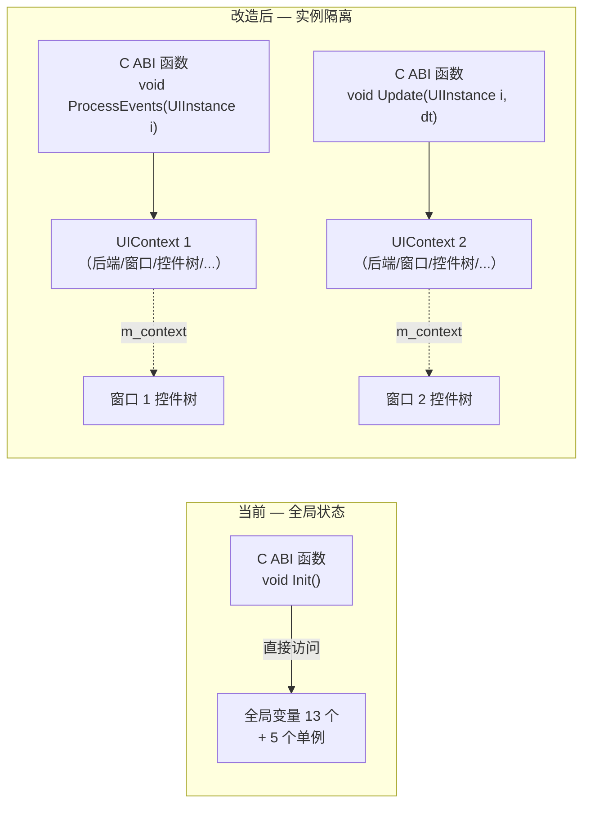
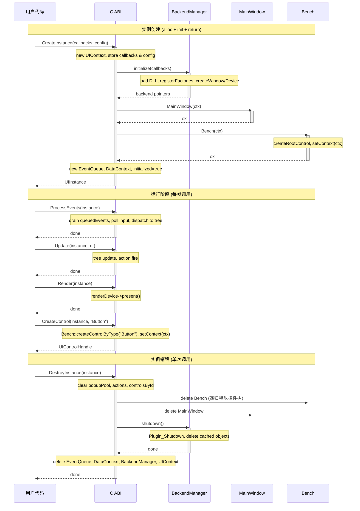
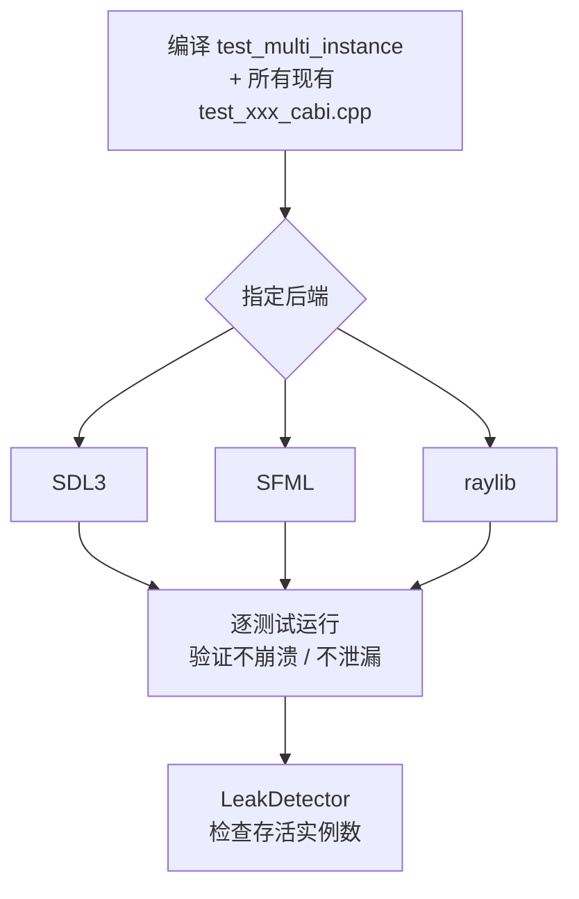

# C ABI 多实例支持改造设计

> 对应 Phase 16ii | 编制 2026-07-30 | 状态: **草案**

## 目录

1. [问题](#1-问题)
2. [全局状态清单](#2-全局状态清单)
3. [改造目标](#3-改造目标)
4. [架构对比](#4-架构对比)
5. [详细设计](#5-详细设计)
   - [5.1 UIContext — 实例上下文](#51-uicontext--实例上下文)
   - [5.2 C ABI 新签名](#52-c-abi-新签名)
   - [5.3 单例改造](#53-单例改造)
   - [5.4 Control 层适配](#54-control-层适配)
   - [5.5 宏重定义](#55-宏重定义)
   - [5.6 后端插件改造](#56-后端插件改造)
   - [5.7 Surface / Cursor 工厂](#57-surface--cursor-工厂)
   - [5.8 生命周期时序](#58-生命周期时序)
   - [5.9 错误处理与事务性回滚](#59-错误处理与事务性回滚)
   - [5.10 所有权模型](#510-所有权模型)
6. [实施清单](#6-实施清单)
7. [风险与注意事项](#7-风险与注意事项)

---

## 1. 问题

当前 C ABI 通过**文件作用域静态变量**和**类静态单例**共享状态，进程生命周期内只能存在一个 UICornerstone 实例。

```cpp
// src/UICornerstoneAPI.cpp — 13 个全局变量
namespace {
    const UIBackendCallbacks* g_callbacks = nullptr;
    Window* g_window = nullptr;
    bool g_initialized = false;
    // ... 共 13 个
}

// 5 个单例
BackendManager::instance()   → static BackendManager mgr
MainWindow::getInstance()    → static MainWindow instance
Bench::getInstance()         → static Bench instance
EventQueue::getInstance()    → static EventQueue instance
DataContext::getInstance()   → static shared_ptr<DataContext> s_instance
```

**实际限制**：

| 场景 | 结果 |
|------|------|
| 进程内创建两个 UI 窗口 | `UICornerstone_Init` 第二次直接返回 1，不生效 |
| 先 Init 再 Shutdown 再 Init | Shutdown 不重置标志，无法重新初始化 |
| 从两个线程同时操作 | 无锁，数据竞争 |

## 2. 全局状态清单

### 2.1 UICornerstoneAPI.cpp（实例上下文，13 项）

| 变量 | 类型 | 说明 |
|------|------|------|
| `g_callbacks` | `const UIBackendCallbacks*` | 后端回调表 |
| `g_window` | `Window*` | 窗口对象 |
| `g_renderDevice` | `RenderDevice*` | 渲染设备 |
| `g_inputBackend` | `InputBackend*` | 输入后端 |
| `g_textRenderer` | `TextRenderer*` | 文本渲染器 |
| `g_resourceProvider` | `CallbackResourceProvider*` | 资源提供者 |
| `g_initialized` | `bool` | 初始化标志 |
| `g_quit` | `bool` | 退出请求标志 |
| `g_viewport` | `SRect` | 视口矩形 |
| `g_actions` | `unordered_map<string, pair<回调,userData>>` | 动作注册表 |
| `g_controlsById` | `unordered_map<string, UIControlHandle>` | ID→控件映射 |
| `g_queuedEvents` | `queue<UIEvent>` | 注入事件队列 |
| `g_popupPool` | `vector<shared_ptr<Popup>>` | 弹窗生命周期池 |

### 2.2 单例类（5 个 → 改为实例持有）

| 类 | 持有状态 | 当前引用方式 |
|----|---------|-------------|
| `BackendManager` | 后端 API 表 + 4 个后端对象指针 | `BackendManager::instance()` |
| `MainWindow` | 窗口尺寸/位置、ResourceProvider、FocusManager | `MainWindow::getInstance()` → `MAINWIN` 宏 |
| `Bench` | 控件树根节点、控件列表 | `Bench::getInstance()` → `BENCH` 宏 |
| `EventQueue` | 事件队列 + 观察器映射表 | `EventQueue::getInstance()` |
| `DataContext` | 数据绑定映射表 | `DataContext::instance()` |

### 2.3 宏依赖（7 个宏，散布 ~20 个源文件）

```cpp
#define BENCH              (Bench::getInstance())
#define MAINWIN            (MainWindow::getInstance())
#define GET_RENDERDEVICE   (MAINWIN->getRenderDevice())
#define GET_TEXTRENDERER   (MAINWIN->getTextRenderer())
#define GET_INPUTBACKEND   (MAINWIN->getInputBackend())
#define GET_RESOURCEPROVIDER (MAINWIN->getResourceProvider())
#define GET_FOCUSMANAGER   (MAINWIN->getFocusManager())
```

### 2.4 后端插件缓存（3 个后端 × 4 个创建函数 = 12 个静态变量）

每个 `UIBackend_xxx.dll` 缓存在 `static` 变量中，创建第二个实例会覆盖第一个。

```cpp
// backend/sdl3/BackendPlugin.cpp
static Window* g_pluginWin = nullptr;
UIWindowHandle bridge_createWindow(...) {
    if (!g_pluginWin) g_pluginWin = new SDL3Window(...);
    return (UIWindowHandle)g_pluginWin;
}
```

### 2.5 ConstDef 全局常量（1 项，非 blocking 但需关注）

```cpp
// src/ConstDef.cpp
std::string g_pathPrefix = "assets/";
```

当前为进程级全局 `std::string`。多实例场景下，若所有实例共享同一资源根目录，可保持静态；若需不同，则迁入 `UIContext`。见 §7 风险 4。

## 3. 改造目标

1. **`CreateInstance` / `DestroyInstance`** — 进程内可创建多个独立实例
2. **`UIInstance` 显式参数** — 所有 C ABI 函数首参为 `UIInstance`，精确指向目标实例
3. **控件层 `m_context`** — 每个 Control 通过成员变量持有所属上下文
4. **无需过渡层** — 无用户依赖，C ABI 签名一次性改为新形式

## 4. 架构对比



## 5. 详细设计

### 5.1 UIContext — 实例上下文

新增头文件，聚合一个实例的全部状态：

```cpp
// include/UIContext.h
#pragma once
#include <string>
#include <unordered_map>
#include <queue>
#include <memory>
#include <functional>
#include "UICornerstoneAPI.h"

class Window;
class RenderDevice;
class InputBackend;
class TextRenderer;
class ResourceProvider;
class MainWindow;
class Bench;
class EventQueue;
class DataContext;
class FocusManager;
class Popup;
class BackendManager;

struct UIContext {
    // ── Backend 资源 ──
    const UIBackendCallbacks* callbacks = nullptr;
    Window*          window = nullptr;
    RenderDevice*    renderDevice = nullptr;
    InputBackend*    inputBackend = nullptr;
    TextRenderer*    textRenderer = nullptr;
    ResourceProvider* resourceProvider = nullptr;

    // ── 初始化状态 ──
    bool initialized = false;
    bool quit = false;

    // ── 视口 ──
    SRect viewport{0, 0, 1024, 768};

    // ── 原单例（由 UIContext 持有，非静态） ──
    BackendManager* backendManager = nullptr;
    MainWindow*     mainWindow = nullptr;
    Bench*          bench = nullptr;
    EventQueue*     eventQueue = nullptr;
    DataContext*    dataContext = nullptr;

    // ── 动作与控件查找 ──
    std::unordered_map<std::string,
        std::pair<UIActionCallback, void*>> actions;
    std::unordered_map<std::string, UIControlHandle> controlsById;

    // ── 注入事件队列 ──
    std::queue<UIEvent> queuedEvents;

    // ── 弹窗生命周期 ──
    std::vector<std::shared_ptr<Popup>> popupPool;

    // ── 资源路径（从 ConstDef 迁入，见 §7 风险 4） ──
    // std::string pathPrefix;

    // ── 初始化与销毁 ──
    bool initialize();
    void destroy();
};
```

`initialize()` 的实现（不接收外部参数，callbacks 已在创建时由 C ABI 填写）：

```cpp
// src/UIContext.cpp
bool UIContext::initialize() {
    backendManager = new BackendManager();
    if (!backendManager->initialize(callbacks)) {
        delete backendManager;
        backendManager = nullptr;
        return false;
    }
    window          = backendManager->window();
    renderDevice    = backendManager->renderDevice();
    inputBackend    = backendManager->inputBackend();
    textRenderer    = backendManager->textRenderer();

    mainWindow   = new MainWindow(this);
    bench        = new Bench(this);
    eventQueue   = new EventQueue();
    dataContext  = new DataContext();

    // resourceProvider 从 MainWindow 获取
    resourceProvider = mainWindow->getResourceProvider();

    initialized = true;
    quit = false;
    return true;
}
```

`destroy()` 逆序析构：

```cpp
void UIContext::destroy() {
    quit = true;
    popupPool.clear();
    controlsById.clear();
    actions.clear();

    delete dataContext;     dataContext = nullptr;
    delete eventQueue;      eventQueue = nullptr;
    delete bench;           bench = nullptr;
    delete mainWindow;      mainWindow = nullptr;

    if (backendManager) {
        backendManager->shutdown();
        delete backendManager;
        backendManager = nullptr;
    }

    window          = nullptr;
    renderDevice    = nullptr;
    inputBackend    = nullptr;
    textRenderer    = nullptr;
    resourceProvider = nullptr;
    callbacks       = nullptr;
    initialized     = false;
}
```

### 5.2 C ABI 新签名

句柄类型：

```c
// include/UICornerstoneAPI.h
typedef struct UIContext* UIInstance;
```

新增配置结构体（可选，未来扩展用）：

```c
typedef struct {
    const char* resourceRoot;       // 资源根目录，null→默认
    const char* windowTitle;        // 窗口标题，null→"UICornerstone"
    int windowWidth;                // 0→默认
    int windowHeight;               // 0→默认
    uint32_t reserved[8];           // 未来扩展预留
} UIInstanceConfig;

#define UI_INSTANCE_CONFIG_DEFAULT \
    { NULL, NULL, 0, 0, {0} }
```

实例生命周期——只有两个函数，没有独立的 Init/Shutdown：

```c
UICORNERSTONE_API UIInstance UICornerstone_CreateInstance(
    const UIBackendCallbacks* callbacks,
    const UIInstanceConfig* config);       // NULL → 全默认

UICORNERSTONE_API void UICornerstone_DestroyInstance(
    UIInstance instance);
```

所有功能函数新增 `UIInstance` 首参数，删除旧无参签名：

```c
// 主循环
UICORNERSTONE_API void UICornerstone_ProcessEvents(
    UIInstance instance);

UICORNERSTONE_API void UICornerstone_Update(
    UIInstance instance, double deltaTime);

UICORNERSTONE_API void UICornerstone_Render(
    UIInstance instance);

UICORNERSTONE_API void UICornerstone_Resize(
    UIInstance instance, int width, int height);

// 控件操作
UICORNERSTONE_API UIControlHandle UICornerstone_CreateControl(
    UIInstance instance, const char* type);

UICORNERSTONE_API void UICornerstone_AddChild(
    UIInstance instance, UIControlHandle parent, UIControlHandle child);

UICORNERSTONE_API void UICornerstone_RemoveChild(
    UIInstance instance, UIControlHandle parent, UIControlHandle child);

UICORNERSTONE_API void UICornerstone_DestroyControl(
    UIInstance instance, UIControlHandle control);

// 控件属性
UICORNERSTONE_API void UICornerstone_SetControlAttribute(
    UIInstance instance, UIControlHandle control,
    const char* key, const char* value);

// 事件
UICORNERSTONE_API void UICornerstone_PushUIEvent(
    UIInstance instance, UIEvent event);

UICORNERSTONE_API void UICornerstone_RegisterAction(
    UIInstance instance, const char* actionName,
    UIActionCallback callback, void* userData);

// 控件查找
UICORNERSTONE_API UIControlHandle UICornerstone_FindControlById(
    UIInstance instance, const char* id);
```

**`CreateInstance` 内部流程**：

```c
UIInstance UICornerstone_CreateInstance(
    const UIBackendCallbacks* callbacks,
    const UIInstanceConfig* config) {

    if (!callbacks) return NULL;

    auto* ctx = new UIContext();
    ctx->callbacks = callbacks;

    // 应用配置
    if (config) {
        // 将 config 中的字段写入 ctx（例如路径前缀、窗口尺寸等）
    }

    if (!ctx->initialize()) {
        delete ctx;
        return NULL;
    }

    return ctx;
}
```

**`DestroyInstance` 内部流程**：

```c
void UICornerstone_DestroyInstance(UIInstance instance) {
    if (!instance) return;
    instance->destroy();
    delete instance;
}
```

### 5.3 单例改造

每个单例取消 `static getInstance()`，改为普通类，由 `UIContext` 持有并管理生命周期。

#### BackendManager

```cpp
// include/BackendPlugin.h
class BackendManager {
public:
    BackendManager();
    ~BackendManager();

    bool initialize(const UIBackendCallbacks* callbacks);
    void shutdown();

    Window* window() const { return m_window; }
    RenderDevice* renderDevice() const { return m_renderDevice; }
    InputBackend* inputBackend() const { return m_inputBackend; }
    TextRenderer* textRenderer() const { return m_textRenderer; }

    // s_registeredAPI 保留为静态（进程级后端注册表，只读）
    static void registerBackend(const BackendAPI& api);
    static const BackendAPI& registeredAPI();

private:
    Window* m_window = nullptr;
    RenderDevice* m_renderDevice = nullptr;
    InputBackend* m_inputBackend = nullptr;
    TextRenderer* m_textRenderer = nullptr;

    static BackendAPI s_registeredAPI;  // 进程级，只读
};
```

**变化**：
- 构造函数不再调用 `initialize`
- `initialize/shutdown` 改为实例方法（原为类静态方法）
- `s_initialized` 移除，初始化状态由 `UIContext::initialized` 体现
- `s_registeredAPI` 仍为 static（后端 DLL 加载后写入一次，后续只读）

#### MainWindow / Bench

```cpp
// include/MainWindow.h
class MainWindow {
public:
    explicit MainWindow(UIContext* ctx);
    ~MainWindow();

    ResourceProvider* getResourceProvider() { return m_resourceProvider.get(); }
    FocusManager* getFocusManager() { return m_focusManager.get(); }
    // ...

private:
    UIContext* m_context;
    std::unique_ptr<ResourceProvider> m_resourceProvider;
    std::unique_ptr<FocusManager> m_focusManager;
};
```

```cpp
// include/Bench.h
class Bench {
public:
    explicit Bench(UIContext* ctx);
    ~Bench();

    Control* getRootControl() const { return m_rootControl; }

private:
    UIContext* m_context;
    Control* m_rootControl = nullptr;
};
```

#### EventQueue / DataContext

```cpp
// EventQueue.h — 去掉 getInstance()
class EventQueue {
public:
    void push(const UIEvent& event);
    UIEvent pop();
    bool empty() const;
};
```

```cpp
// DataContext.h — 去掉 s_instance
class DataContext {
public:
    // ...
};
```

### 5.4 Control 层适配

基类增加 `UIContext* m_context`：

```cpp
// include/ControlBase.h
class Control {
public:
    explicit Control(UIContext* ctx = nullptr);
    virtual ~Control() = default;

    UIContext* getContext() const { return m_context; }
    void setContext(UIContext* ctx) { m_context = ctx; }

protected:
    UIContext* m_context = nullptr;
};
```

控件树中的传播规则：

```cpp
// 方式 1：构造函数传入（推荐，显式）
auto* btn = new Button(ctx);

// 方式 2：AddChild 时从父控件继承
void Control::addChild(Control* child) {
    if (!child->m_context) {
        child->m_context = m_context;  // 继承父控件上下文
    }
    m_children.push_back(child);
}

// 方式 3：C ABI 层创建时由 UIContext 设置
// src/UICornerstoneAPI.cpp
UIControlHandle UICornerstone_CreateControl(
    UIInstance instance, const char* type) {
    auto* ctl = Bench::createControlByType(type);
    if (ctl && !ctl->getContext()) {
        ctl->setContext(instance);
    }
    return (UIControlHandle)ctl;
}
```

### 5.5 宏重定义

宏从读单例改为读 `m_context`。宏的作用域限定在 Control 派生类中。

```cpp
// 改造前
#define BENCH              (Bench::getInstance())
#define MAINWIN            (MainWindow::getInstance())
#define GET_RENDERDEVICE   (MAINWIN->getRenderDevice())
#define GET_TEXTRENDERER   (MAINWIN->getTextRenderer())
#define GET_INPUTBACKEND   (MAINWIN->getInputBackend())
#define GET_RESOURCEPROVIDER (MAINWIN->getResourceProvider())
#define GET_FOCUSMANAGER   (MAINWIN->getFocusManager())

// 改造后（ControlBase.h 中定义）
#define CONTEXT            (m_context)
#define BENCH              (CONTEXT->bench)
#define MAINWIN            (CONTEXT->mainWindow)
#define GET_RENDERDEVICE   (CONTEXT->renderDevice)
#define GET_TEXTRENDERER   (CONTEXT->textRenderer)
#define GET_INPUTBACKEND   (CONTEXT->inputBackend)
#define GET_RESOURCEPROVIDER (CONTEXT->resourceProvider)
#define GET_FOCUSMANAGER   (MAINWIN->getFocusManager())
```

所有使用了这些宏的 `.cpp` 文件**无需修改源码**，只需确保：
- 宏在 `ControlBase.h` 中定义，所有 Control 派生类包含该头文件
- 调用处位于 Control 成员函数内，自然持有 `m_context`

> 非 Control 的代码（如 `UICornerstoneAPI.cpp`、`MainWindow.cpp`），直接通过 `instance->xxx` 或 `m_context->xxx` 访问，不使用宏。

### 5.6 后端插件改造

#### 移除静态缓存

```cpp
// 改造前
static Window* g_pluginWin = nullptr;
UIWindowHandle bridge_createWindow(...) {
    if (!g_pluginWin) g_pluginWin = new SDL3Window(title, w, h, flags);
    return (UIWindowHandle)g_pluginWin;
}

// 改造后
UIWindowHandle bridge_createWindow(const char* title, int w, int h,
                                    uint32_t flags) {
    return (UIWindowHandle) new SDL3Window(title, w, h, flags);
}
```

#### 新增 destroy 桥接函数

原后端插件接口中可能不存在显式的 destroy 入口。需要为 Window/RenderDevice/InputBackend/TextRenderer 各新增一个 destroy 函数，或者在 `Plugin_Shutdown` 中完成清理。

方案选择：

| 方案 | 做法 | 复杂度 |
|------|------|--------|
| A. 新增 4 个 bridge_destroyXxx 回调 | 在 `BackendAPI` 结构体中增加 4 个函数指针，插件提供实现 | 中 |
| B. Plugin_Shutdown 批量销毁 | 插件内部跟踪所有已创建对象，Plugin_Shutdown 时一次性销毁 | 低（插件需维护对象列表） |
| C. BackendManager 直接 delete (C++ 侧) | 如果 Window/RenderDevice 等类定义在核心侧可见，直接 delete 即可（不跨 DLL 边界） | 低（但跨 DLL new/delete 不安全） |

**推荐方案 B**：插件内部维护已创建对象列表，`Plugin_Shutdown` 时统一销毁。这样插件 ABI 不变，且不跨 DLL new/delete。

```cpp
// 改造后插件示例
namespace {
    std::vector<SDL3Window*> s_windows;  // 模块内跟踪
}

UIWindowHandle bridge_createWindow(...) {
    auto* win = new SDL3Window(title, w, h, flags);
    s_windows.push_back(win);
    return (UIWindowHandle)win;
}

extern "C" void PLUGIN_EXPORT Plugin_Shutdown() {
    for (auto* w : s_windows) delete w;
    s_windows.clear();
}
```

若部分后端已有不等于 Plugin_Shutdown 中对窗口的清理逻辑，需确认并补齐。

#### 影响范围

3 个后端（SDL3 / SFML / raylib）× 4 个创建函数 = 12 个静态变量需移除，每个后端需维护各自的 `s_windows`/`s_devices` 等列表。

### 5.7 Surface / Cursor 工厂

`Surface::g_createFn` 和 `Cursor::g_createSystemFn` 是**进程级工厂函数指针**，由后端插件在加载时注册：

```cpp
// 在 BackendManager::initialize 中调用
Surface::registerFactories(backend->createSurface,
                           backend->loadSurfaceFile,
                           backend->loadSurfaceMem);
Cursor::registerFactories(backend->createSystemCursor,
                          backend->getDefaultCursor,
                          backend->setCurrentCursor);
```

由于工厂函数指针是 `static`，多次赋值等于最后一次生效。但实际上所有实例使用同一后端 DLL，工厂指针相同，**多次赋值幂等**。

**结论**：工厂保持静态（进程级），不做实例化改造。

### 5.8 生命周期时序

`UICornerstone_CreateInstance` 一次性完成 alloc + init + return。不拆分为独立的 Init 步骤。

#### 参与者说明

| 图中角色 | 对应实体 | 说明 |
|----------|---------|------|
| `User` | 用户代码 | 调用者 |
| `CAPI` | `UICornerstoneAPI.cpp` 中的 C ABI 函数 | **唯一的主动执行者**。UIContext 是被它读写的被动数据结构，不作为独立 participant |
| `BM` | `BackendManager` | 初始化阶段被创建的对象；销毁阶段被 `shutdown` |
| `MW` | `MainWindow` | 同上 |
| `B` | `Bench` | 同上 |

> `EventQueue` / `DataContext` 是轻量对象，不单独在图中展开，用 Note 概括。



### 5.9 错误处理与事务性回滚

`UIContext::initialize()` 是"全有或全无"的——中间任何一步失败，必须回滚全部已分配的资源。

```cpp
bool UIContext::initialize() {
    // 步骤 1: BackendManager
    backendManager = new BackendManager();
    if (!backendManager->initialize(callbacks)) {
        delete backendManager;
        backendManager = nullptr;
        return false;
    }

    // 缓存后端指针（此时后端已初始化成功）
    window          = backendManager->window();
    renderDevice    = backendManager->renderDevice();
    inputBackend    = backendManager->inputBackend();
    textRenderer    = backendManager->textRenderer();

    // 步骤 2: MainWindow
    mainWindow = new MainWindow(this);
    if (!mainWindow->getResourceProvider()) {
        // MainWindow 构造失败（例如资源加载失败）
        delete mainWindow;
        mainWindow = nullptr;
        goto rollback_bm;
    }
    resourceProvider = mainWindow->getResourceProvider();

    // 步骤 3: Bench
    bench = new Bench(this);
    if (!bench->getRootControl()) {
        delete bench;
        bench = nullptr;
        goto rollback_mw;
    }

    // 步骤 4: EventQueue / DataContext（轻量，不可能失败）
    eventQueue = new EventQueue();
    dataContext = new DataContext();

    initialized = true;
    return true;

rollback_mw:
    delete mainWindow;
    mainWindow = nullptr;
rollback_bm:
    backendManager->shutdown();
    delete backendManager;
    backendManager = nullptr;
    window = renderDevice = inputBackend = textRenderer = nullptr;
    return false;
}
```

### 5.10 所有权模型

```
UIContext (owner)
  ├── BackendManager*    → new/delete in initialize/destroy
  │     └── 后端对象 (Window, RenderDevice, ...) → 由 BackendManager::shutdown 释放
  ├── MainWindow*        → new/delete in initialize/destroy
  │     └── ResourceProvider (unique_ptr)  → auto
  │     └── FocusManager (unique_ptr)      → auto
  ├── Bench*             → new/delete in initialize/destroy
  │     └── Control 树 (raw ptr)           → Bench 管理析构
  ├── EventQueue*        → new/delete in initialize/destroy
  ├── DataContext*       → new/delete in initialize/destroy
  └── popupPool          → shared_ptr, clear() in destroy
```

**规则**：
- `UIContext` 是唯一 owner，持有所有子系统指针
- 子系统之间通过 `UIContext*` 互相引用（非拥有）
- 后端对象（Window/RenderDevice/InputBackend/TextRenderer）由 `BackendManager` 通过 `shutdown()` 释放
- 销毁顺序严格逆序：Bench → MainWindow → BackendManager → 最后 delete UIContext
- `g_controlsById` 和 `g_actions` 直接用容器值成员（非指针），destructor 自动清理

### 5.11 调试与诊断支持

多实例场景下日志交叉、状态混杂，需从实例标识、日志标记、断点辅助、泄漏检测四个维度提供支持。

#### 5.11.1 实例标识

每个 `UIInstance` 关联一个调试标签，在 `UIInstanceConfig` 中传入：

```c
typedef struct {
    uint32_t structSize;
    const char* debugLabel;     // 可选，如 "main_menu", "hud"
    const char* resourceRoot;
    const char* windowTitle;
    int windowWidth;
    int windowHeight;
    uint32_t reserved[6];
} UIInstanceConfig;
```

`UIContext` 增加自增 ID 和标签：

```cpp
struct UIContext {
    // ── 调试标识 ──
    uint32_t    instanceId = 0;         // 全局自增 ID
    std::string debugLabel;             // 用户自定义标签或 "Instance_<id>"

    // ... 其余字段不变
};
```

实现中维护一个全局原子计数器：

```cpp
// src/UIContext.cpp
#include <atomic>
static std::atomic<uint32_t> s_nextInstanceId{1};

bool UIContext::initialize() {
    instanceId = s_nextInstanceId++;
    if (debugLabel.empty()) {
        debugLabel = "Instance_" + std::to_string(instanceId);
    }
    // ...
}
```

#### 5.11.2 日志前缀

所有内部日志输出增加实例标签前缀。封装一个日志宏或辅助函数：

```cpp
// include/UIContext.h — 日志辅助
#define UI_LOG(instance, fmt, ...) \
    do { \
        if ((instance) && (instance)->debugLabel.size()) { \
            printf("[%s] " fmt "\n", (instance)->debugLabel.c_str(), ##__VA_ARGS__); \
        } \
    } while(0)

// 或支持级别
#define UI_LOGI(ctx, ...) UI_LOG(ctx, "INFO", __VA_ARGS__)
#define UI_LOGW(ctx, ...) UI_LOG(ctx, "WARN", __VA_ARGS__)
#define UI_LOGE(ctx, ...) UI_LOG(ctx, "ERROR", __VA_ARGS__)
```

输出示例：

```
[Instance_1] BackendManager: SDL3 window created (1024x768)
[Instance_2] BackendManager: SDL3 window created (800x600)
[Instance_1] Control: Button "OK" clicked
[Instance_2] Control: Button "Cancel" clicked
```

如果现有日志是裸 `printf`/`cout`，改造期间遇到一个改一个，不必一次改完。遗漏的日志在调试时自然就会发现——多实例下没有标签的日志一眼就能看出。

#### 5.11.3 实例注册表（调试器辅助）

维护一个全局的"存活实例表"，用于调试器 watch 和崩溃后分析：

```cpp
// src/UIContext.cpp — 调试用全局表
#include <vector>
#include <mutex>

#ifdef _DEBUG
static std::mutex s_registryMutex;
static std::vector<UIInstance> s_aliveInstances;

void registerInstance(UIInstance instance) {
    std::lock_guard lock(s_registryMutex);
    s_aliveInstances.push_back(instance);
}

void unregisterInstance(UIInstance instance) {
    std::lock_guard lock(s_registryMutex);
    std::erase(s_aliveInstances, instance);
}

// 在调试器中可以调用此函数列出所有存活实例
extern "C" __declspec(dllexport) int UICornerstone_Debug_GetAliveCount() {
    std::lock_guard lock(s_registryMutex);
    return (int)s_aliveInstances.size();
}

extern "C" __declspec(dllexport) UIInstance UICornerstone_Debug_GetAliveInstance(int index) {
    std::lock_guard lock(s_registryMutex);
    if (index >= 0 && index < (int)s_aliveInstances.size())
        return s_aliveInstances[index];
    return NULL;
}
#else
// Release: 注册表摘除，零开销
#define registerInstance(x)
#define unregisterInstance(x)
#endif
```

#### 5.11.4 泄漏检测

进程退出时若仍有未销毁的实例，自动断言或输出警告：

```cpp
// UIContext.cpp — 静态析构检查
struct LeakDetector {
    ~LeakDetector() {
        if (!s_aliveInstances.empty()) {
            printf("LEAK: %zu UICornerstone instance(s) not destroyed!\n",
                   s_aliveInstances.size());
            for (auto* inst : s_aliveInstances) {
                printf("  - %s (ID=%u)\n",
                       inst->debugLabel.c_str(),
                       inst->instanceId);
            }
            // Debug 下触发 break
            __debugbreak();
        }
    }
};
static LeakDetector s_leakCheck;
```

#### 5.11.5 窗口标题标记

如果后端允许，在窗口标题中追加实例标签（仅 Debug 构建）：

```cpp
// MainWindow.cpp 或 BackendManager
std::string title = config.windowTitle ? config.windowTitle : "UICornerstone";
#ifdef _DEBUG
    title += " [" + ctx->debugLabel + "]";
#endif
backend->createWindow(title.c_str(), width, height, flags);
```

各调试功能在 Release 构建中是否保留：

| 功能 | Debug | Release | 原因 |
|------|-------|---------|------|
| instanceId | 保留 | 保留 | 极小开销，用于日志 |
| debugLabel | 保留 | 保留 | 同上 |
| 日志前缀 | 保留 | 可选 | 通过日志级别控制 |
| 实例注册表 | 保留 | 摘除 | 全局锁 + vector，不安全 |
| 泄漏检测 | 保留 | 保留 | `s_aliveInstances` 在 Release 中已空，无开销 |

### 5.12 测试方案

#### 5.12.1 现有测试的改造

当前测试（`test_xxx.cpp`）依赖单例 `MAINWIN->run(&app)`。改造后必须适配为实例模式：

```cpp
// 改造前
class MyApp : public AppCallbacks {
    bool onInit() override { /* ... */ return true; }
    void onUpdate() override { BENCH->eventLoopEntry(); BENCH->update(); }
    void onRender() override { GET_RENDERDEVICE->clear(); BENCH->draw(); }
};
int main() {
    MyApp app;
    return MAINWIN->run(&app);
}

// 改造后
#include "UICornerstoneAPI.h"
int main() {
    UIBackendCallbacks* cb = GetUIBackendCallbacks();
    UIInstance inst = UICornerstone_CreateInstance(cb, NULL);
    // CreateInstance 内部完成 alloc + init，无需额外 Init

    // 帧循环（跑 60 帧后退出）
    for (int i = 0; i < 60; i++) {
        UICornerstone_ProcessEvents(inst);
        UICornerstone_Update(inst, 0.016);
        UICornerstone_Render(inst);
    }

    UICornerstone_DestroyInstance(inst);
    return 0;
}
```

所有现有测试（约 15 个 `test_xxx.cpp` + `test_xxx_cabi.cpp`）需按此模式改写。这是测试层面的最大工作量。

#### 5.12.2 新增：多实例 C ABI 测试

新建 `test/test_multi_instance.cpp`，专测多实例隔离性。编译为独立可执行文件，与现有测试并列。

##### 测试 1：双实例生命周期

```cpp
#include "UICornerstoneAPI.h"
#include <cstdio>
#include <cassert>

int main() {
    UIBackendCallbacks* cb = GetUIBackendCallbacks();
    assert(cb);

    // 创建实例 1
    UIInstance inst1 = UICornerstone_CreateInstance(cb, NULL);
    assert(inst1);
    // 创建实例 2（同时存活）
    UIInstance inst2 = UICornerstone_CreateInstance(cb, NULL);
    assert(inst2);

    // 两个实例各自的 handle 不同
    assert(inst1 != inst2);

    // 各自创建控件
    UIControlHandle btn1 = UICornerstone_CreateControl(inst1, "Button");
    UIControlHandle btn2 = UICornerstone_CreateControl(inst2, "Button");
    assert(btn1 != btn2);  // 控件 handle 也不相同

    // 独立帧循环（简化：各跑 2 帧）
    for (int i = 0; i < 2; i++) {
        UICornerstone_ProcessEvents(inst1);
        UICornerstone_Update(inst1, 0.016);
        UICornerstone_Render(inst1);

        UICornerstone_ProcessEvents(inst2);
        UICornerstone_Update(inst2, 0.016);
        UICornerstone_Render(inst2);
    }

    // 先销毁实例 2，再销毁实例 1（验证逆序不影响实例 1）
    UICornerstone_DestroyInstance(inst2);
    UICornerstone_DestroyInstance(inst1);

    printf("PASS: dual instance lifecycle\n");
    return 0;
}
```

**验证点**：不崩溃、不报泄漏、两个独立窗口正常显示。

##### 测试 2：实例间事件隔离

向实例 1 注入事件，验证实例 2 不受影响。

```cpp
UIEvent evt;
evt.type = UIEventType::Click;
evt.controlId = "btn1";
UICornerstone_PushUIEvent(inst1, evt);
// inst2 不应收到此事件
```
**验证点**：各自 `g_queuedEvents` 独立，不串扰。

##### 测试 3：实例间 Action 隔离

```cpp
int fired1 = 0, fired2 = 0;
UICornerstone_RegisterAction(inst1, "act", cb1, &fired1);
UICornerstone_RegisterAction(inst2, "act", cb2, &fired2);
// 触发 "act"，两个实例各自调用自己的回调
```
**验证点**：同名 action 在不同实例互不覆盖。

##### 测试 4：销毁再创建（资源泄漏）

```cpp
for (int i = 0; i < 100; i++) {
    UIInstance inst = UICornerstone_CreateInstance(cb, NULL);
    UICornerstone_DestroyInstance(inst);
}
// 验证 LeakDetector 报告 0 泄漏
```
**验证点**：反复 create/destroy 不累积泄漏。

##### 测试 5：空值容错

```cpp
UICornerstone_ProcessEvents(NULL);   // 不崩溃
UICornerstone_DestroyInstance(NULL); // 不崩溃
UICornerstone_CreateControl(NULL, "Button"); // 返回 NULL
```
**验证点**：所有 C ABI 函数对 `NULL` instance 安全。

#### 5.12.3 测试执行



执行方式遵循现有模式：编译后独立运行，人工验证窗口正常显示，自动检测崩溃和泄漏。

| 测试 | 自动化 | 人工验证 | 后端覆盖 |
|------|--------|---------|---------|
| 双实例生命周期 | 崩溃即失败 | 检查 2 个窗口正常 | SDL3 / SFML |
| 事件隔离 | 可断言验证 | — | SDL3 |
| Action 隔离 | 可断言验证 | — | SDL3 |
| 销毁再创建 | LeakDetector | — | 三个后端 |
| 空值容错 | 崩溃即失败 | — | 三个后端 |

## 6. 实施清单

| 序号 | 文件 | 操作 | 工作量 |
|------|------|------|--------|
| 1 | 新增 `include/UIContext.h` | 定义 `UIContext` 结构体 + `initialize()/destroy()` 声明 | 小 |
| 2 | 新增 `src/UIContext.cpp` | 实现 `initialize()`（事务性创建 BM/MW/Bench/EQ/DC）、`destroy()`（逆序析构） | 中 |
| 3 | `include/UICornerstoneAPI.h` | 新增 `UIInstance` typedef、`UIInstanceConfig` 结构体；所有函数增加 `UIInstance` 首参；新增 `CreateInstance`/`DestroyInstance`；删除 `Init`/`Shutdown` 及旧无参签名 | 小 |
| 4 | `src/UICornerstoneAPI.cpp` | 13 个全局变量移至 `UIContext`；删除 `Init`/`Shutdown`；所有函数实现从 `g_xxx` 改为 `instance->xxx` | 中 |
| 5 | `include/ControlBase.h` | Control 增加 `UIContext* m_context` 成员，构造函数可选接收 `UIContext*`；宏重定义 | 小 |
| 6 | 控件源码 ~20 个 .cpp 文件 | 宏定义变化，调用处代码不动；重新编译即可 | 零修改 |
| 7 | `include/BackendPlugin.h` | BackendManager 取消 singleton，构造函数/initialize/shutdown 改为实例方法 | 小 |
| 8 | `src/BackendManager.cpp` | 适配：移除 `s_initialized`；`initialize` 不再调用 `getInstance()` | 小 |
| 9 | `include/MainWindow.h` | 取消 singleton；构造函数接收 `UIContext*` | 小 |
| 10 | `src/MainWindow.cpp` | 适配：`MAINWIN` 宏不再可用，改为 `m_context->bench`/`m_context->eventQueue` | 小 |
| 11 | `include/Bench.h` | 取消 singleton；构造函数接收 `UIContext*` | 小 |
| 12 | `src/Bench.cpp` | 适配：Bench 持有 `UIContext* m_context` | 小 |
| 13 | `include/EventQueue.h` | 移除 `getInstance()` | 小 |
| 14 | `src/EventQueue.cpp` | 适配 | 小 |
| 15 | `include/DataContext.h` | 移除 `s_instance` | 小 |
| 16 | `src/DataContext.cpp` | 适配 | 小 |
| 17 | 后端插件 x3（~6 个文件） | 移除创建函数中的 `static` 缓存，每次都 new；插件维护对象列表，`Plugin_Shutdown` 统一 delete | 中 |
| 18 | `include/PlatformUtils.h` | 移除旧宏定义检查 | 小 |
| 19 | `src/ConstDef.cpp` | 若需要实例独立路径，将 `g_pathPrefix` 迁入 `UIContext`（见 §7） | 小 |
| 20 | 测试 | 测试 1: `CreateInstance`×1 → 完整运行 → `DestroyInstance`；测试 2: `CreateInstance`×2 → 两个独立窗口循环 → `DestroyInstance` | 中 |
| 21 | C++ Binding 适配 | `UICornerstone` 类的 `Impl` 中持有 `UIInstance` 成员 | 小 |

### 影响范围汇总

| 类别 | 文件数 | 修改性质 |
|------|--------|---------|
| 新增 | 2 | `UIContext.h/.cpp` |
| 核心修改 | 8 | `UICornerstoneAPI.h/.cpp`、`ControlBase.h`、`BackendPlugin.h`、`MainWindow.h/.cpp`、`Bench.h/.cpp` |
| 小修改 | 7 | `EventQueue.h/.cpp`、`DataContext.h/.cpp`、`BackendManager.cpp`、`PlatformUtils.h`、`ConstDef.cpp` |
| 后端插件 | ~6 | 3 个后端的创建/销毁逻辑 |
| 零修改 | ~20 | 控件业务 .cpp（宏自动适配） |
| 总改动文件 | ~43 | 含 2 个新增 |

## 7. 风险与注意事项

### 7.1 真实风险

#### 1. 后端插件 Plugin_Shutdown 覆盖不全

改动：创建函数从 `static` 缓存改为每次新建。这意味着：之前一个进程只 new 一次、进程退出时 OS 回收；现在每个 `DestroyInstance` 必须显式清理所有后端对象。

需逐后端确认 `Plugin_Shutdown` 的实现：

| 后端 | 创建函数 | 销毁路径 | 确认状态 |
|------|---------|---------|---------|
| SDL3 | `bridge_createWindow / Device / ...` | Plugin_Shutdown 中 delete？ | 待查 |
| SFML | 同上 | 同上 | 待查 |
| raylib | 同上 | 同上 | 待查 |

若某个后端的 Plugin_Shutdown 未清理创建对象（例如依赖析构函数自动释放），需追加清理逻辑。这是唯一可能破坏多实例正确性的风险。

#### 2. 控件构造期间 m_context 空指针

`Control` 在构造后、挂到控件树（`addChild`/`setContext`）之前，宏 `GET_RENDERDEVICE` 等读到 `m_context == nullptr` 会崩溃。

**缓解措施**：
- 宏中加 `assert(m_context)`（Debug 构建）
- Release 中 `if (m_context) { ... }` 跳过
- 所有 Control 构造函数在完成 `setContext` 前不调用依赖上下文的函数
- `addChild` 中自动 setContext，减少遗漏窗口

### 7.2 非风险（设计决策 / 已被方案规避）

| 议题 | 为什么不是风险 |
|------|--------------|
| `g_pathPrefix` | `UIInstanceConfig.resourceRoot` 已提供 per-instance 覆盖。全局 base path 是多实例的常态，不存在不确定性 |
| 线程安全 | 设计明确为"单线程 per instance"，是约束不是风险。所有内部不加锁是有意为之 |
| `g_controlsById` 隔离 | 13 个全局移入 UIContext 时自带隔离，无需额外处理。不存在跨实例 ID 查找的 API |
| 后端插件 ABI | 已选方案 B（Plugin_Shutdown 批量清理），不新增 bridge 回调，ABI 不变 |
| `UIInstanceConfig` 版本兼容 | structSize 字段是 C API 的惯例写法，确定性行为，不存在风险 |
| C++ Binding 适配 | C ABI 函数签名变化 → C++ Binding 同步更新。机械性变更，无不确定因素 |
