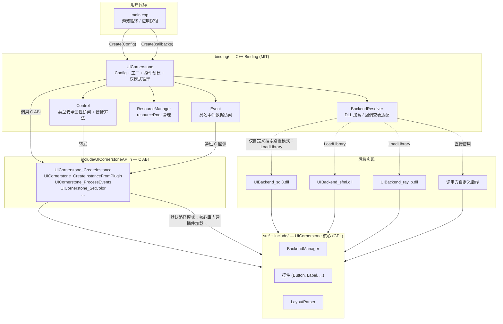
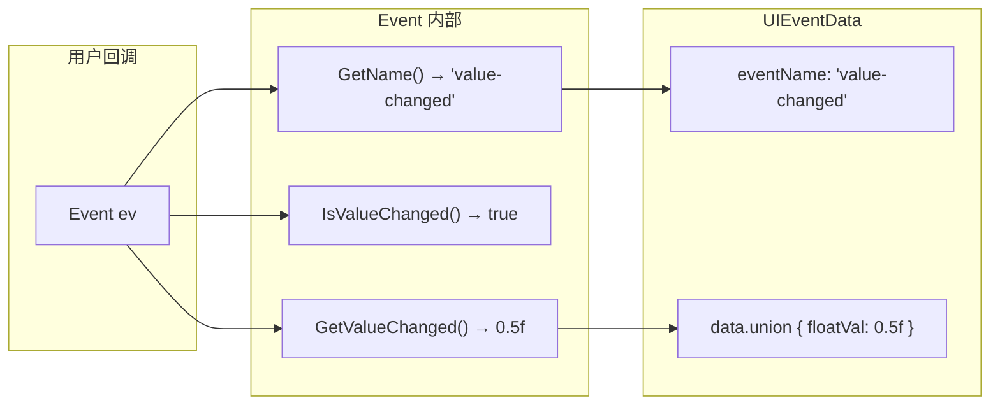
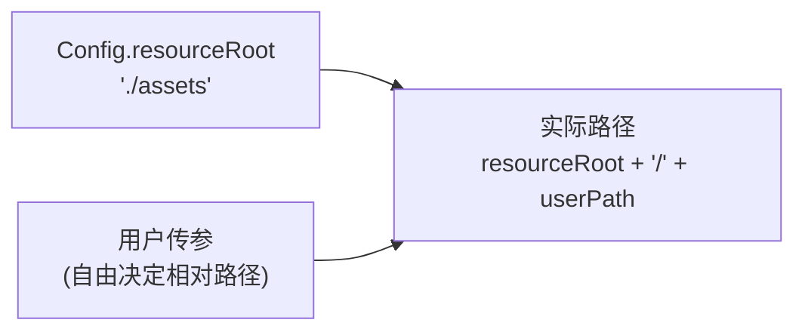
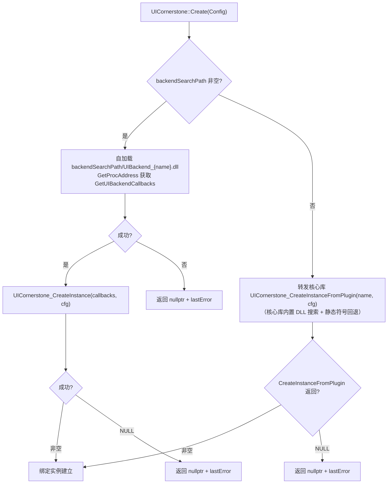
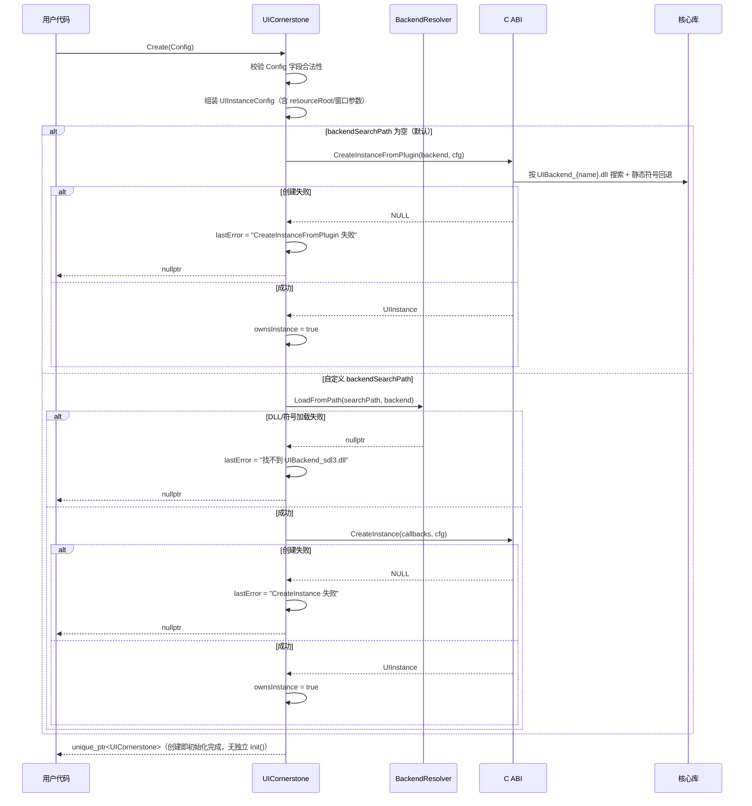
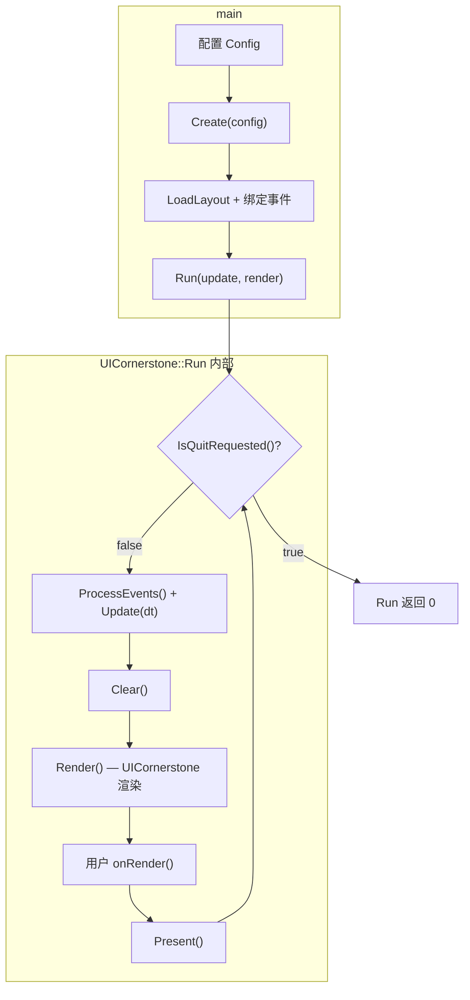
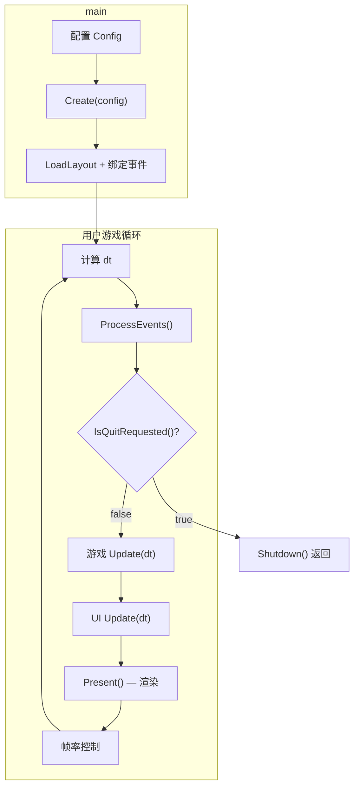

# CAPI C++ Binding 设计

> 对应 Phase 17 | 编制 2026-07-30 | 状态: **草案** | 修订 2026-08-01：对齐多实例改造后的 C ABI（UICornerstoneAPI.h 实测）| 修订 2026-08-04：按实施后代码（a0fcfa7/6064bd5）刷新——windowFlags 正式字段、菜单族/ScrollBar/TreeView/HandleControl 工厂已落地、Debug 辅助 4 件套、句柄归属校验、treeNode 访问器、UIInstanceConfig.debugLabel | 修订 2026-08-06：**P1-P13 全部实施并验证**（sdl3/sfml/raylib 三后端构建+冒烟通过）

## 目录

1. [动机](#1-动机)
2. [设计目标](#2-设计目标)
3. [方案分析](#3-方案分析)
   - [3.1 后端选择](#31-后端选择)
   - [3.2 资源路径](#32-资源路径)
   - [3.3 循环嵌入](#33-循环嵌入)
   - [3.4 目录放置与许可证](#34-目录放置与许可证)
4. [整体架构](#4-整体架构)
5. [详细设计](#5-详细设计)
   - [5.1 UICornerstone 主类](#51-uicornerstone-主类)
   - [5.2 Control 代理类](#52-control-代理类)
   - [5.3 事件系统](#53-事件系统)
    - [5.4 资源路径管理](#54-资源路径管理)
    - [5.5 后端管理](#55-后端管理)
    - [5.6 架构约束分析](#56-架构约束分析)
    - [5.7 Control 生命周期管理](#57-control-生命周期管理)
    - [5.8 RegisterAction 实例化重构](#58-registeraction-实例化重构)
    - [5.9 Impl 结构总览](#59-impl-结构总览)
    - [5.10 Create(Config) 全链路（含错误处理）](#510-createconfig-全链路含错误处理)
    - [5.11 Hosted Run 内部实现](#511-hosted-run-内部实现)
    - [5.12 Config 校验规则](#512-config-校验规则)
    - [5.13 CMake 构建集成](#513-cmake-构建集成)
    - [5.14 UIEvent 输入事件构造辅助](#514-uievent-输入事件构造辅助类型安全)
6. [文件布局与许可证](#6-文件布局与许可证)
7. [示例程序设计](#7-示例程序设计)
   - [7.1 sample_cpp_hosted](#71-sample_cpp_hosted--在-uicornerstone-循环中嵌入游戏逻辑)
   - [7.2 sample_cpp_embed](#72-sample_cpp_embed--在用户游戏循环中嵌入-uicornerstone)
8. [实施计划](#8-实施计划)
9. [与现有 C ABI 的关系](#9-与现有-c-abi-的关系)

---

## 1. 动机

现有 C API（`UICornerstoneAPI.h`）提供了一组纯 C 接口，可供 C、C#、Python 等语言调用。但对于 C++ 开发者，直接使用 C API 存在以下不足：

| 问题 | 表现 |
|------|------|
| **句柄模式** | `UIControlHandle` 是 `void*`，无类型安全，无 IDE 补全 |
| **字符串属性名** | `SetColor(ctl, "selected", ...)` — 拼错只在运行时暴露 |
| **回调原始** | C 函数指针 + `void* userData`，无 lambda/`std::function` 支持 |
| **生命周期手动** | 手动管理句柄生命周期，无 RAII |
| **零散全局函数** | 所有函数在全局命名空间，无封装，无上下文隔离 |

C++ binding 旨在消除这些摩擦，同时**不破坏**现有 C ABI 的兼容性，并允许用户自由修改 binding 源码。

## 2. 设计目标

1. **零开销抽象** — Binding 层为 inline 转发，不引入额外虚拟化或分配
2. **类型安全** — 结构体属性、枚举、回调均用 C++ 类型表达
3. **可配置后端** — 运行时选择后端，不依赖编译宏
4. **可配置资源** — 用户设定字体、图片、布局、DLL 的搜索路径
5. **双模式循环** — 支持"嵌入用户循环"和"托管用户逻辑"两种集成方式
6. **向后兼容** — Binding 完全基于现有 C ABI `extern "C"` 函数，不改变 C 接口
7. **独立许可证** — Binding 源码放置于独立目录，采用宽松许可证（如 MIT）

## 3. 方案分析

### 3.1 后端选择

**问题**：当前后端在编译时通过 `-DUICORNERSTONE_BACKEND=SDL3|SFML|RAYLIB` 选择。每个后端依赖不同的第三方 SDK，无法同时链接到同一二进制中。能否在运行时选择后端？

**选项对比**：

| 方案 | 运行时切换 | 额外依赖 | 复杂度 | 可行性 |
|------|-----------|---------|--------|--------|
| A. 静态编译多个后端 | ❌ | SDK 符号冲突 | 高 | 不可行 |
| B. 插件 DLL 加载 | ✅ | 需编译后端 DLL | 中 | ✅ 可行 |
| C. 调用方提供回调查表 | ✅ | 无 | 低 | ✅ 可行 |
| D. 条件编译 + 全链接 | ❌ | 链接器冲突 | 高 | 不可行 |

**决策**：C++ Binding 同时支持方案 B 和方案 C，**但方案 B 由核心库承担**（多实例改造后核心库已内置插件加载）：

- **方案 B（核心库自动管理，已内建）**：核心库提供 `UICornerstone_CreateInstanceFromPlugin(pluginName, config)`（UICornerstoneAPI.h:186），内部按 `UIBackend_<pluginName>.dll` 搜索并加载，失败时回退静态链接符号 `GetUIBackendCallbacks`。Binding 的 `Config::backend` 直接映射为 `pluginName`，**Binding 不再自研 DLL 加载器**（原 BackendResolver 的 DLL 搜索/加载逻辑删除，仅保留"自定义搜索路径"场景的加载）。
- **方案 C（回调查表）**：用户自行构造 `UIBackendCallbacks`，经 `UICornerstone_CreateInstance(callbacks, config)`（:177）传入。Binding 不参与后端生命周期管理。该模式同时覆盖"自定义 `backendSearchPath`"场景：`backendSearchPath` 非空时 Binding 自 `LoadLibrary(backendSearchPath + "/UIBackend_<name>.dll")` → `GetProcAddress("GetUIBackendCallbacks")` → 以回调查表模式调用 CreateInstance。

两种方案可共存于同一进程（不同实例可各自选择后端）。方案 B 适用于快速集成（无需 SDK），方案 C 适用于自定义后端或特殊加载需求。

### 3.2 资源路径

**问题**：`ConstDef::pathPrefix` 硬编码为 `Platform::GetBasePath() + "assets"`，`fontFiles` 映射表中的路径（如 `"fonts/Asul-Bold.ttf"`）相对此根目录。用户无法自定义资源存放位置。

**选项对比**：

| 方案 | 配置粒度 | 运行时修改 | 与现有兼容 | 易理解 |
|------|---------|-----------|-----------|-------|
| A. 单一根路径（推荐） | 粗 | ✅ | ✅ | ✅ |
| B. 多分类子路径 | 中等 | ✅ | ✅ | ❌ 路径重复陷阱 |
| C. 完全自定义 ResourceProvider | 细 | ❌（编译时） | ✅ | ❌ |
| D. 环境变量 | 粗 | ✅ | ❌ 不可控 | ✅ |

**决策**：采用方案 A（单一根路径）。用户只需设置一个 `resourceRoot`，所有资源路径以此为基础解析。`fontFiles` 表中的相对路径保持不变。

**传递链路（多实例改造后）**：资源根路径经 `UIInstanceConfig.resourceRoot` 字段直接传入核心库（UICornerstoneAPI.h:40；NULL → 核心库默认路径）——核心库 `MainWindow` 创建 `ResourceProvider` 时使用该路径。**无需新增 `UICornerstone_SetResourceRoot` C ABI 函数**（原方案作废）。Binding 侧 `ResourceManager` 只负责"用户可见的路径拼接 + 记录根路径"，路径解析语义：

用户代码：

```cpp
auto config = UICornerstone::Config{}
    .WithResourceRoot("C:/my_game_data");
// fontFiles 中的 "fonts/A.ttf" 解析为 "C:/my_game_data/fonts/A.ttf"
// 布局文件 "layouts/main.json" 解析为 "C:/my_game_data/layouts/main.json"
```

### 3.3 循环嵌入

**问题**：用户既可能希望将 UICornerstone 嵌入自己现有的游戏循环（Embedded），也可能希望让 UICornerstone 托管循环、自己只提供逻辑回调（Hosted）。

**选项对比**：

| 方案 | 循环所属 | 用户代码量 | 控制粒度 | 与 C ABI 关系 |
|------|---------|-----------|---------|--------------|
| A. 仅 Hosted（Run） | UICornerstone | ~5 行 | 低 | 完全封装 |
| B. 仅 Embedded（Tick） | 用户 | ~15 行 | 高 | 近 C ABI |
| C. 双模式（推荐） | 均可 | ~5-15 行 | 可调 | 同 C ABI |

**决策**：采用方案 C，双模式共存。Hosted 模式在内部调用 Embedded 模式的 tick API，两者共享同一实现核心。

### 3.4 目录放置与许可证

**问题**：C++ Binding 的 License 应与核心库不同。核心库是 GPL v3.0，Binding 源码需要更宽松的许可证以允许用户自由修改和集成。

**选项对比**：

| 方案 | 目录 | 许可证 | 与核心关系 |
|------|------|--------|-----------|
| A. 放在 `include/` 和 `src/` 内 | `include/cpp/` + `src/cpp/` | 与核心相同（GPL） | 紧密耦合 |
| B. 放在 `binding/` 下（推荐） | `binding/` | MIT | 独立，仅依赖 C ABI |
| C. 放在独立仓库 | 外部仓库 | MIT | 完全解耦 |

**决策**：采用方案 B。在项目根目录创建 `binding/` 目录，包含 C++ Binding 的全部源码、CMakeLists 和单独的 LICENSE 文件。Binding 仅依赖 `include/UICornerstoneAPI.h` 中定义的 C ABI 接口，不依赖核心库的内部头文件。

## 4. 整体架构



**层间依赖**：

```
用户代码 → binding/ (MIT) → include/UICornerstoneAPI.h (C ABI) → UICornerstone 核心 (GPL)
```

Binding 层仅依赖 C ABI 头文件中声明的 `extern "C"` 函数和 POD 结构体。不 `#include` 任何核心库的内部头文件（`ControlBase.h`、`Bench.h` 等）。

## 5. 详细设计

### 5.1 UICornerstone 主类

```cpp
// binding/include/UICornerstone.h

#include <string>
#include <memory>
#include <functional>
#include "UICornerstoneAPI.h"

class Control;

class UICornerstone {
public:
    struct Config {
        // 后端选择
        std::string backend = "sdl3";            // "sdl3" | "sfml" | "raylib"
        std::string backendSearchPath;            // DLL 搜索目录（空=核心库默认搜索顺序）

        // 资源根路径
        // 所有资源相对此路径解析：字体 → {root}/fonts/A.ttf、布局 → {root}/layouts/demo.json
        std::string resourceRoot   = "./assets";

        // 窗口参数
        std::string windowTitle    = "UICornerstone";
        int windowWidth  = 1024;
        int windowHeight = 768;
        // windowFlags：跨后端统一窗口标志（UIWindowFlags，值对齐 SDL_WINDOW_*），
        // 直接映射 UIInstanceConfig.windowFlags（UICornerstoneAPI.h:44）
        uint32_t windowFlags = 0;

        Config& WithBackend(const std::string& name)
            { backend = name; return *this; }
        Config& WithBackendSearchPath(const std::string& path)
            { backendSearchPath = path; return *this; }
        Config& WithResourceRoot(const std::string& root)
            { resourceRoot = root; return *this; }
        Config& WithWindow(const std::string& title, int w, int h)
            { windowTitle = title; windowWidth = w; windowHeight = h; return *this; }
        Config& WithWindowFlags(uint32_t flags)
            { windowFlags = flags; return *this; }
    };

    // 通过 Config 创建（默认路径 → CreateInstanceFromPlugin；自定义搜索路径 → 自加载 DLL + CreateInstance(callbacks)）
    static std::unique_ptr<UICornerstone> Create(const Config& config);

    // 通过回调查表创建（不管理后端生命周期，直接 CreateInstance(callbacks, config)）
    static std::unique_ptr<UICornerstone> Create(const UIBackendCallbacks* callbacks,
                                                 const Config& config = Config{});

    ~UICornerstone();

    // ── Hosted 模式 ──
    using FrameCallback = std::function<void(double deltaTime)>;
    using RenderCallback = std::function<void()>;

    int Run(FrameCallback update, RenderCallback onRender = nullptr);

    // ── Embedded 模式（Create 即完成初始化，无需独立 Init()）──
    void ProcessEvents();
    void Update(double deltaTime);
    void Render();
    void Present();
    bool IsQuitRequested() const;
    void Shutdown();

    // ── 子视口（多实例改造后新增，可选）──
    // 在实例窗口中创建子视口：共享后端，独立控制树/事件队列（C ABI: UICornerstone_CreateViewport(parent, UIRect)）
    std::unique_ptr<UICornerstone> CreateViewport(float x, float y, float w, float h);

    // ── 资源路径 ──
    void SetResourceRoot(const std::string& path);   // 仅影响 Binding 侧路径解析（核心库 config 已固化）
    std::string GetResourceRoot() const;

    // ── 布局 ──
    bool LoadLayout(const std::string& jsonContent);
    bool LoadLayoutFromFile(const std::string& filePath);
    Control FindControl(const std::string& id);

    // ── 控件工厂（编程式创建，不全依赖 JSON） ──
    Control CreateButton(const std::string& text,
                         float x, float y, float w, float h);
    Control CreateLabel(const std::string& text, float fontSize,
                        float x, float y, float w, float h);
    Control CreateCheckBox(const std::string& text,
                           float x, float y, float w, float h);
    Control CreateEditBox(float x, float y, float w, float h);
    Control CreateProgressBar(float x, float y, float w, float h);
    Control CreateSlider(float x, float y, float w, float h,
                         float min, float max, float value);
    Control CreatePanel(float x, float y, float w, float h);
    Control CreateTextArea(float x, float y, float w, float h);
    Control CreateWinFrame(const std::string& title,
                           float x, float y, float w, float h);
    Control CreateComboBox(float x, float y, float w, float h);
    Control CreateColorPicker(float x, float y, float w, float h,
                              const std::string& color);
    Control CreateNumericUpDown(float x, float y, float w, float h);
    Control CreateSplitter(float x, float y, float w, float h, int orientation);
    Control CreateImageButton(const std::string& normal,
                              const std::string& hover,
                              const std::string& pressed,
                              float x, float y, float w, float h);
    Control CreateDialog(const std::string& confirmText,
                         const std::string& cancelText,
                         float x, float y, float w, float h);

    // ── 控件工厂（多实例改造后补齐：菜单族 / 滚动条 / 树 / 句柄） ──
    // 组装顺序（对齐 C ABI 注释，UICornerstoneAPI.h:255-263）：
    //   panel = CreateMenuPanel(); item = CreateMenuItem("Open", 0);
    //   MenuPanelAddItem(panel, item); MenuItemSetSubMenu(item, subPanel);
    //   bar = CreateMenuBar(...); MenuBarAddMenu(bar, "File", panel);
    // type: 0=Normal, 1=Separator, 2=SubMenu
    // MenuItem 的 caption/checked/shortcut/click 走统一属性系统（事件名 "click"）
    Control CreateMenuBar(float x, float y, float w, float h);
    Control CreateMenuPanel();                                     // MenuPanel（弹层）
    Control CreateMenuItem(const std::string& caption, int type);  // 0=Normal,1=Separator,2=SubMenu
    void    MenuBarAddMenu(Control bar, const std::string& caption, Control panel);
    void    MenuPanelAddItem(Control panel, Control item);
    void    MenuPanelAddSeparator(Control panel);
    void    MenuItemSetSubMenu(Control item, Control subMenu);
    Control CreateScrollBar(float x, float y, float w, float h, int orientation);
    Control CreateTreeView(float x, float y, float w, float h);
    Control CreateHandleControl(Control target, float x, float y, float w, float h);

    // ── 视口 ──
    void SetViewport(float x, float y, float w, float h);
    UIRect GetViewport() const;

    // ── 事件注入（外部输入系统 → UICornerstone）──
    // UIEvent 为 type + data[128] 字节缓冲（UI_EVENT_* 宏布局），Binding 提供
    // 类型安全构造辅助（见 §5.14），避免用户手拼字节布局。
    void PushEvent(const UIEvent& event);
    void PushMouseButton(int button, float x, float y, bool down);
    void PushMouseMove(float x, float y);
    void PushMouseWheel(float dx, float dy, float x, float y);
    void PushKey(int keyCode, uint16_t mod, bool down);
    void PushTextInput(const std::string& text);    // UI_TEXT_MAX=32 字节上限

    // ── JSON 布局动作注册 ──
    // 为 JSON 布局中的 "events": { "onClick": "myAction" } 注册回调。
    using ActionCallback = std::function<void(Control)>;
    void RegisterAction(const std::string& name, ActionCallback callback);

    // ── 错误查询 ──
    const std::string& GetLastError() const;

    // ── 调试（多实例改造后新增，可选）──
    static int  DebugGetAliveCount();                    // Release 构建返回 0
    static UIInstance DebugGetAliveInstance(int index);  // Release 构建返回 NULL
    static UIInstance DebugGetActiveViewport(UIInstance instance);  // owner 的当前焦点视口
    static bool DebugIsControlFocused(UIInstance instance, UIControlHandle control);

    UICornerstone(const UICornerstone&) = delete;
    UICornerstone& operator=(const UICornerstone&) = delete;

private:
    explicit UICornerstone(UIInstance instance, bool ownsInstance);
    Control MakeControl(UIControlHandle h);

    struct Impl;
    std::unique_ptr<Impl> m_impl;
};
```

### 5.2 Control 代理类

```cpp
// binding/include/Control.h

#include <string>
#include <functional>
#include "UICornerstoneAPI.h"

class Control {
public:
    Control() = default;
    explicit Control(UIControlHandle handle);
    Control(std::shared_ptr<ControlState> state);   // MakeControl 内部路径

    // ── 属性设置 ──
    void SetColor(const char* prop, UIColor value);
    void SetStateColor(const char* prop, UIStateColor value);
    void SetBool(const char* prop, bool value);
    void SetInt(const char* prop, int value);
    void SetFloat(const char* prop, float value);
    void SetString(const char* prop, const std::string& value);
    void SetEnum(const char* prop, const std::string& value);
    void SetPtr(const char* prop, void* value);

    // ── 属性读取 ──
    UIColor     GetColor(const char* prop) const;
    UIStateColor GetStateColor(const char* prop) const;
    bool        GetBool(const char* prop) const;
    int         GetInt(const char* prop) const;
    float       GetFloat(const char* prop) const;
    std::string GetString(const char* prop) const;
    void*       GetPtr(const char* prop) const;

    // ── 枚举值读取（GetEnum 输出到栈 buffer，返回字符串）──
    std::string GetEnum(const char* prop) const;

    // ── 回调 ──
    template<typename Fn>
    void SetCallback(const char* event, Fn&& callback);

    // ── 便捷方法 ──
    void SetText(const std::string& text);
    std::string GetText() const;
    void SetVisible(bool visible);
    bool IsVisible() const;
    void SetEnabled(bool enabled);
    bool IsEnabled() const;
    void SetRect(float x, float y, float w, float h);
    UIRect GetRect() const;
    void AddChild(Control child);
    void Destroy();
    std::string GetId() const;

private:
    // 共享状态（§5.7.1）：句柄有效性追踪
    std::shared_ptr<ControlState> m_state;

    UIControlHandle RawHandle() const {
        return m_state ? m_state->handle : nullptr;
    }
};
```

> 注：`IsValid()` 基于 `m_state->alive`（§5.7.1/§5.7.2），`Handle()` 返回原始句柄（可能已失效）。`Control` 需访问 `Impl`（SetCallback 的 userData 注册表）——经 `ControlState` 持有所属 `UICornerstone::Impl*`（或回调函数指针）实现，见 §5.7.3。

### 5.3 事件系统

`UIEventData` 是**基于事件名辨别的联合体**：`eventName` 字段标记了 `data` union 中哪个成员有效。裸 C 调用时需要手动判断：

```c
void myHandler(UIControlHandle ctl, const UIEventData* ev, void* user) {
    if (strcmp(ev->eventName, "value-changed") == 0) {
        float val = ev->data.floatVal;  // 手动知道该读 floatVal
    }
}
```

C++ Binding 通过 `Event` 类将这种"手工辨别"封装为**具名推导访问器**，按事件名提供对应的类型安全取值路径：

```cpp
// binding/include/Event.h

#include "UICornerstoneAPI.h"

class Event {
public:
    explicit Event(const UIEventData* raw);

    // 事件名鉴别（所有事件的共同信息）
    std::string GetName() const;

    // ── 按事件类型划分的具名访问器 ──
    // 编译期类型安全：方法名自述含义，调用方不再面对 union

    // "click"（Button/Label/MenuItem）：无数据负载，仅事件本身
    bool IsClick() const;

    // "value-changed"：floatVal（Slider/ProgressBar）
    bool IsValueChanged() const;
    float GetValueChanged() const;

    // "value-changed"（NumericUpDown）：doubleVal
    double GetValueChangedDouble() const;

    // "text-changed"：strVal（EditBox/TextArea）
    bool IsTextChanged() const;
    std::string GetTextChanged() const;

    // "selection-changed"：selection { idx, val }（ComboBox）
    bool IsSelectionChanged() const;
    int  GetSelectedIndex() const;
    std::string GetSelectedValue() const;

    // "check-changed"：intVal（CheckBox 新 CheckState）
    bool IsCheckChanged() const;
    int  GetCheckState() const;

    // "color-changed"：颜色暂不通过 C ABI 回调传回（ColorPicker 用 GetColor 轮询）——
    // 此访问器保留但恒 false，文档注明语义
    bool IsColorChanged() const;
    UIColor GetChangedColor() const;

    // "position-changed"：floatVal（ScrollBar）
    bool IsPositionChanged() const;
    float GetPositionChanged() const;

    // "moved"：floatVal（Splitter）
    bool IsMoved() const;
    float GetMovedPosition() const;

    // "confirm" / "cancel" / "close"：无数据负载
    //   - "close"（Popup）：intVal = DialogResult 映射
    bool IsConfirm() const;
    bool IsCancel() const;
    bool IsClose() const;
    int  GetCloseResult() const;

    // "enter"（EditBox 回车）：无数据负载
    bool IsEnter() const;

    // "select" / "expand" / "collapse"：treeNode { id, userData }（UIEventData 联合体）
    bool IsSelect() const;
    bool IsExpand() const;
    bool IsCollapse() const;
    std::string GetNodeId() const;   // treeNode.id
    void* GetNodeUserData() const;   // treeNode.userData

    // ── 通用原始访问（必要时回退） ──
    const char* GetNameRaw() const { return m_raw ? m_raw->eventName : nullptr; }
    int     GetIntVal() const;
    float   GetFloatVal() const;
    double  GetDoubleVal() const;
    const char* GetStrVal() const;
    void*   GetPtrVal() const;

    // ── 原始数据（必要时回退） ──
    const UIEventData* Raw() const { return m_raw; }

private:
    const UIEventData* m_raw;
};
```

> 事件名/属性名字符串常量由 Binding 自带（`binding/include/EventNames.h`、`PropertyNames.h`）——
> Binding 只依赖 C ABI 头（MIT），**不得 include 核心库 GPL 头**（PropertyNames.h、EventTypes.h）。字符串值与核心库事件字典（CABI_Property_Design.md §6.9）保持一致。



**典型用法**（在 `Control::SetCallback` 的 lambda 中）：

```cpp
btn.SetCallback("value-changed", [](const Event& ev) {
    if (ev.IsValueChanged()) {
        float val = ev.GetValueChanged();
        // 直接读，不接触 union
    }
});
```

每个具名访问器内部实现类似：

```cpp
bool Event::IsValueChanged() const {
    return strcmp(m_raw->eventName, "value-changed") == 0;
}

float Event::GetValueChanged() const {
    // 可在 Debug 断言事件类型，快速暴露误用
    assert(IsValueChanged());
    return m_raw->data.floatVal;
}
```

### 5.4 资源路径管理

**解析规则**：Binding 对路径做简单拼接 `resourceRoot + "/" + userPath`，**不自动插入任何子目录前缀**。目录结构完全由用户在参数中控制。

```
resourceRoot = "./assets"

传参                      → 实际路径
─────────────────────────────────────────────
"btn.png"                 → ./assets/btn.png
"images/btn.png"          → ./assets/images/btn.png
"ui/icons/btn.png"        → ./assets/ui/icons/btn.png
"layouts/demo.json"       → ./assets/layouts/demo.json
```



**三种资源类型的路径出处**：

| 资源类型 | 路径来源 | 示例传参 |
|---------|---------|---------|
| 字体 | `ConstDef::fontFiles` 表已有 `"fonts/"` 前缀 | `"fonts/A.ttf"`（表自带） |
| 图片 | `CreateImageButton("normal", "hover", ...)` 参数 | `"btn.png"` 或 `"ui/btn.png"` |
| 布局 | `LoadLayoutFromFile(path)` 参数 | `"demo.json"` 或 `"layouts/demo.json"` |

用户统一改 `resourceRoot` 即可重定向所有资源。如需把图片移到别处而字体不动，直接在调用 `CreateImageButton` 时传不同的相对路径即可，无需额外配置项。

```cpp
// binding/include/ResourceManager.h

class ResourceManager {
public:
    explicit ResourceManager(const std::string& root);

    void SetRoot(const std::string& root);
    std::string GetRoot() const;

    // 统一路径解析（Binding 侧便捷 API）
    std::string Resolve(const std::string& relativePath) const;

private:
    std::string m_root;
};
```

> 核心库侧的 ResourceProvider 由 `UIInstanceConfig.resourceRoot` 驱动（§5.4 生效链路），Binding 的 `ResourceManager` 仅用于路径拼接查询与记录，不跨库传递。

#### resourceRoot 生效链路（多实例改造后）

资源根路径经 `UIInstanceConfig.resourceRoot` 在 `CreateInstance`/`CreateInstanceFromPlugin` 时传入核心库：

```
Config.resourceRoot = "./my_assets"
        │
        ▼
UICornerstone::Create(Config)
        │
        ├── BackendResolver：默认路径 → CreateInstanceFromPlugin("sdl3", cfg)
        │                   自定义搜索路径 → LoadLibrary + CreateInstance(callbacks, cfg)
        └── cfg.resourceRoot = "./my_assets"（UIInstanceConfig 字段）

核心库内部:
    MainWindow 构造函数:
        m_resourceProvider = ResourceProvider::createFilesystem(pathPrefix)
                                                    ▲
                                                    └── 由 UIInstanceConfig.resourceRoot 写入
```

```cpp
// UICornerstone::Create 中的关键步骤（伪代码）
std::unique_ptr<UICornerstone> UICornerstone::Create(const Config& config) {
    UIInstanceConfig cfg = UI_INSTANCE_CONFIG_DEFAULT;   // structSize 由宏填好
    cfg.resourceRoot = config.resourceRoot.c_str();
    cfg.windowTitle  = config.windowTitle.c_str();
    cfg.windowWidth  = config.windowWidth;
    cfg.windowHeight = config.windowHeight;

    UIInstance instance;
    if (config.backendSearchPath.empty()) {
        instance = UICornerstone_CreateInstanceFromPlugin(config.backend.c_str(), &cfg);
    } else {
        // 自定义搜索路径：自加载 DLL → 回调查表模式
        auto* callbacks = BackendResolver::LoadFromPath(
            config.backendSearchPath, config.backend);
        if (!callbacks) { m_impl->lastError = "..."; return nullptr; }
        instance = UICornerstone_CreateInstance(callbacks, &cfg);
    }
    if (!instance) { m_impl->lastError = "CreateInstance failed"; return nullptr; }
    // ...
}
```

> 注：`UI_INSTANCE_CONFIG_DEFAULT` 宏（UICornerstoneAPI.h:47）自动填充 `structSize`——Binding 必须使用该宏或显式填 `sizeof(UIInstanceConfig)`（版本兼容检查）。

### 5.5 后端管理（多实例改造后简化）



**默认模式（backendSearchPath 为空）**：直接转发 `UICornerstone_CreateInstanceFromPlugin(backend, cfg)`——核心库负责按 `UIBackend_{name}.dll` 搜索（插件目录 + 静态符号 `GetUIBackendCallbacks` 回退）。Binding 不接触 DLL。

**自定义搜索路径模式**：Binding 的 `BackendResolver` 仅在该模式下加载 DLL：
1. `backendSearchPath` + `UIBackend_{name}.dll`
2. `LoadLibrary` → `GetProcAddress("GetUIBackendCallbacks")`
3. 以回调查表模式调用 `UICornerstone_CreateInstance(callbacks, cfg)`

> 原设计中"exe 目录/plugins/PATH 搜索顺序"由核心库承担，Binding 不再重复实现。

### 5.6 架构约束分析

#### 5.6.1 多实例支持（多实例改造完成后已解除限制）

**现状（2026-08-01 实测）**：核心库 C ABI 已完成多实例改造并落地实施（提交 a0fcfa7/6064bd5）——`UICornerstone_CreateInstance(callbacks, config)` 一次完成 alloc+init（UICornerstoneAPI.h:178），返回 `UIInstance` 句柄（`struct UIContext*`，:34）；`DestroyInstance` 级联销毁子视口、owner 才 shutdown BackendManager（:183）；`CreateInstanceFromPlugin` 支持插件 DLL + 静态符号回退（:187，src/UICornerstoneAPI.cpp:377-414）；`CreateViewport(parent, rect)` 支持子视口（:193）。原"全局单实例（g_initialized）"限制**已不存在**。附加能力：`_DEBUG` 下句柄归属校验（跨实例误用断言，src/UICornerstoneAPI.cpp:79-116）、实例活跃注册表（析构守卫，UIContext.h:93-101）、Debug 辅助 4 件套（:220-226）。

**Binding 设计**：

```cpp
// binding/src/UICornerstone.cpp — Impl 结构（多实例版）

struct UICornerstone::Impl {
    Config config;
    UIInstance instance = nullptr;      // C ABI 实例句柄（唯一真源）
    bool ownsInstance = false;          // 由 Binding 创建（CreateInstance/CreateInstanceFromPlugin）
    uint64_t lastTicks = 0;
    std::string lastError;

    // Action 注册表（实例私有，非全局）
    std::unordered_map<std::string,
        std::shared_ptr<ActionCallback>> actions;

    // Backend 资源（仅自定义搜索路径模式持有）
    void* dllHandle = nullptr;

    // Control 生命周期追踪（weak_ptr 不保活，仅有效性登记）
    std::unordered_map<UIControlHandle, std::weak_ptr<ControlState>> liveControls;

    // 回调 userData 注册表（Impl 级持有，与 Control 生命周期解耦——见 §5.7.3）
    std::unordered_map<UIControlHandle,
        std::vector<std::shared_ptr<void>>> callbackUserData;
};
```

```cpp
// Create() 实现（多实例：无进程级单例限制，可创建多个实例）

std::unique_ptr<UICornerstone> UICornerstone::Create(const Config& config) {
    auto ui = std::unique_ptr<UICornerstone>(new UICornerstone());
    ui->m_impl->config = config;
    return ui;   // 实例真正创建发生在 ~/构造/首次使用时按需执行
}
```

> 多实例语义：每个 `UICornerstone` 对象 ↔ 一个 `UIInstance`（窗口或视口），可多个并存；`CreateViewport` 创建共享后端的子视口实例。实例生命周期由 `UICornerstone` 对象管理（析构时 `DestroyInstance`）。
>
> 实例的实际创建在构造时完成（直接调用 C ABI `CreateInstance`/`CreateInstanceFromPlugin`，见 §5.5/§5.10）；上例为简化示意——错误路径返回 nullptr 的场景由 `Create` 静态工厂在调用 C ABI 后检查结果实现。

#### 5.6.2 线程安全

**C ABI 假设**：所有函数必须在同一线程调用，不接受跨线程并发。核心库内部无锁。

**Binding 约束**：

```cpp
// UICornerstone 类注释
//
// 线程安全：
//   本类的所有方法（ProcessEvents / Update / Render / Present / Shutdown）
//   必须在同一线程调用。不得跨线程并发访问。
//   Create() 和 ~UICornerstone() 必须在同一线程调用。
```

**例外**：`PushEvent` 可以（在有限场景下）从其他线程调用，但需外部同步。当前版本不保证，记录为未来优化。

#### 5.6.3 错误处理策略

C ABI 用 `int` 返回值（1=成功，0=失败）报告错误。Binding 不抛出异常，延续同一风格，并通过 `lastError` 提供可查的错误描述：

```cpp
struct UICornerstone::Impl {
    // ...
    std::string lastError;
};

const std::string& UICornerstone::GetLastError() const {
    return m_impl->lastError;
}

// 内部辅助宏（Create 工厂用：失败返回 nullptr）
#define UI_CHECK_INIT(ui, expr, msg) \
    do { \
        if (!(expr)) { \
            ui->m_impl->lastError = msg; \
            return nullptr; \
        } \
    } while(0)

// 使用示例（多实例版）
std::unique_ptr<UICornerstone> UICornerstone::Create(const Config& config) {
    auto ui = std::unique_ptr<UICornerstone>(new UICornerstone());
    auto& impl = ui->m_impl;

    UI_CHECK_INIT(config, !config.backend.empty(), "backend name is empty");

    UIInstanceConfig cfg = UI_INSTANCE_CONFIG_DEFAULT;
    cfg.resourceRoot  = config.resourceRoot.c_str();
    cfg.windowTitle   = config.windowTitle.c_str();
    cfg.windowWidth   = config.windowWidth;
    cfg.windowHeight  = config.windowHeight;

    if (config.backendSearchPath.empty()) {
        // 默认：核心库插件加载
        impl->instance = UICornerstone_CreateInstanceFromPlugin(
            config.backend.c_str(), &cfg);
        if (!impl->instance) { impl->lastError = "CreateInstanceFromPlugin failed"; return nullptr; }
        impl->ownsInstance = true;
    } else {
        // 自定义搜索路径：自加载 DLL → 回调查表模式
        auto* callbacks = BackendResolver::LoadFromPath(
            config.backendSearchPath, config.backend);
        if (!callbacks) { impl->lastError = "Failed to load backend plugin: " + config.backend; return nullptr; }
        impl->instance = UICornerstone_CreateInstance(callbacks, &cfg);
        if (!impl->instance) { impl->lastError = "CreateInstance failed"; return nullptr; }
        impl->ownsInstance = true;
    }
    impl->initialized = true;
    return ui;
}
```

| 方法 | 错误指示 | 详情查询 |
|------|---------|---------|
| `Create(Config)` | 返回 `nullptr`（实例创建失败/后端加载失败） | `GetLastError()`（实例创建失败前，Binding 先缓存 lastError 于内部静态缓冲或打印） |
| `Create(callbacks)` | 返回 `nullptr`（callbacks 非法） | 同上 |
| `ProcessEvents()` | 返回 `void`；不指示窗口关闭 | 退出判断用 `IsQuitRequested()`（独立查询，:215） |
| `Run()` | 返回 1（内部循环异常退出） | 正常退出返回 0；创建失败在 `Create` 已返回 nullptr |
| `CreateXxx / FindControl` | 返回 `Control()`（空句柄） | `ctl.IsValid()` 判断 |
| `Control::SetXxx` | 静默失败 | 无（C ABI 返回 0 时忽略） |
| `PushEvent / RegisterAction` | 无返回值 | 无 |

### 5.7 Control 生命周期管理

#### 5.7.1 句柄有效性

C ABI 返回的 `UIControlHandle` 是一个裸指针 `void*`（实际是 `Control*`）。如果核心库销毁了控件（例如 Dialog `close()` 自动销毁），Binding 的 `Control` 对象变成悬挂句柄。

**防护设计**：引入 `ControlState` 共享状态对象，通过 `shared_ptr/weak_ptr` 追踪句柄有效性。

```cpp
// binding/src/ControlState.h (内部类)

struct ControlState {
    UIControlHandle handle;
    bool alive = true;
};

// binding/include/Control.h 更新
class Control {
public:
    Control() = default;
    explicit Control(UIControlHandle handle);

    bool IsValid() const;

    // ... 原有方法

private:
    std::shared_ptr<ControlState> m_state;

    UIControlHandle RawHandle() const {
        return m_state ? m_state->handle : nullptr;
    }
};
```

> 注：`callbackUserData` 不再存放在 `ControlState`（原设计缺陷，见 §5.7.3）——`std::function` 的生命周期由 `Impl` 统一管理，避免"Control 对象析构但 C 侧控件仍存活"时 userData 悬垂。

**工厂方法更新**——创建/查询 Control 时统一注册到 `Impl::liveControls`（`FindControl` 同样走 `MakeControl`，保证查到的 Control 与工厂创建的一致）：

```cpp
// binding/src/UICornerstone.cpp
Control UICornerstone::CreateButton(const std::string& text,
                                    float x, float y, float w, float h) {
    UIControlHandle h = UICornerstone_CreateButton(text.c_str(), x, y, w, h);
    return MakeControl(h);
}

Control UICornerstone::FindControl(const std::string& id) {
    UIControlHandle h = UICornerstone_FindControl(id.c_str());
    return MakeControl(h);
}

Control UICornerstone::MakeControl(UIControlHandle h) {
    if (!h) return Control();
    auto it = m_impl->liveControls.find(h);
    if (it != m_impl->liveControls.end()) {
        if (auto state = it->second.lock()) return Control(std::move(state));
        m_impl->liveControls.erase(it);   // 弱引用已死，重注册
    }
    auto state = std::make_shared<ControlState>();
    state->handle = h;
    m_impl->liveControls[h] = state;
    return Control(std::move(state));
}
```

**`Destroy()` 方法更新**——从注册表移除并触发 Impl 级 userData 清理：

```cpp
void Control::Destroy() {
    if (!m_state || !m_state->alive) return;

    UIControlHandle h = m_state->handle;

    // 清理 Impl 级 callback userData（见 §5.7.3）
    // 通知核心库销毁控件
    UICornerstone_DestroyControl(h);

    // 从注册表移除（weak_ptr 同时失效）
    // 标记失效
    m_state->alive = false;
    // Impl::NotifyControlDestroyed(h) —— 由 Destroy 与核心库自动销毁路径共用
}
```

**自动失效检测**：核心库在某些场景（如 Popup close）会自动销毁控件。Binding 在调用 C ABI 函数返回后检查句柄是否仍然有效。当前版本不做自动全量同步，而是通过 `UICornerstone_FindControl` 返回空来间接感知；`liveControls` 中的失效项由 `MakeControl` 命中 `weak_ptr::lock()` 失败时惰性清理（不累积泄漏）。

#### 5.7.2 Destroy 后的行为

| 方法 | 已销毁的 Control 上调用 |
|------|----------------------|
| `SetColor / SetText / SetCallback` 等 | 静默跳过（检查 `m_state->alive`） |
| `Destroy()` | 幂等，第二次调用无效果 |
| `GetId()` | 返回空字符串 |
| `IsValid()` | 返回 `false` |
| `Handle()` | 返回原始 `UIControlHandle`（可能已失效） |

#### 5.7.3 回调 userData 生命周期（原设计缺陷修复）

**原设计缺陷**：`callbackUserData` 存放在 `ControlState` 中，随 `Control` 对象析构释放。若用户写出：

```cpp
ui->CreateButton("OK", 0, 0, 100, 30)   // 临时 Control 析构 → state 释放
    .SetCallback([](Control& c){ ... }); // 回调中捕获的 userData 悬垂
```

且按钮仍存活于 C 侧，事件触发时 Binding 回调将访问已释放的 `std::function` → UB。

**修复**：userData 改由 `Impl::callbackUserData` 持有，与 `Control` 对象生命周期解耦：

```cpp
// binding/src/Impl.h
struct UICornerstone::Impl {
    // 回调 userData 注册表：C 侧控件存活期间持续有效
    std::unordered_map<UIControlHandle,
        std::vector<std::shared_ptr<void>>> callbackUserData;
};

// Control::SetCallback 实现（伪代码）
void Control::SetCallback(const ControlCallback& callback) {
    auto userData = std::make_shared<ControlCallback>(callback);
    auto& vec = m_impl->callbackUserData[m_state->handle];
    vec.push_back(userData);                       // 追加持有
    UICornerstone_SetCallback(m_state->handle,
        &ControlCallbackThunk, userData.get());
}

// 清理时机：
//   a) Control::Destroy()          → 通知 Impl 移除该句柄条目
//   b) C 侧自动销毁（Popup close 等）→ 下次事件分发经 handle 时惰性清理；
//      实例析构（~UICornerstone）    → 整体清空
```

> 注：同一句柄重复 SetCallback 会产生堆积（每次 push 一个 shared_ptr）。控制为：同句柄再次 SetCallback 时先移除旧条目（`vec` 中该句柄仅保留最新一个），避免无限增长。

#### 5.7.4 父-子销毁语义（明确约定）

核心库 `UICornerstone_DestroyControl` 只销毁传入句柄本身，**不递归销毁子控件**（子控件由父析构链或显式 Destroy 处理）。Binding 约定：

- `Control::Destroy()` 不级联——调用方自行管理子控件（与核心库语义一致，避免双层生命周期管理冲突）。
- 父被 C 侧销毁（如 Dialog 关闭）后，子句柄随之失效；子 `Control` 的 `IsValid()` 在下次 C ABI 调用返回后更新为 false（惰性感知），**不追踪父子关系**。

### 5.8 RegisterAction 实例化重构

`RegisterAction` 的注册表从全局 `static` 移到 `Impl` 中，保证多实例安全（设计上不引入全局变量）：

```cpp
// binding/src/UICornerstone.cpp

void UICornerstone::RegisterAction(const std::string& name,
                                   ActionCallback callback) {
    auto cb = std::make_shared<ActionCallback>(std::move(callback));
    m_impl->actions[name] = cb;

    // 注册 C 回调
    UICornerstone_RegisterAction(name.c_str(),
        [](UIControlHandle ctl, void* userData) {
            auto& fn = *static_cast<ActionCallback*>(userData);
            fn(Control(ctl));
        },
        cb.get());
}
```

### 5.9 Impl 结构总览

```cpp
// binding/src/Impl.h (内部)

#include <string>
#include <memory>
#include <functional>
#include <unordered_map>
#include <vector>

struct ControlState;

struct UICornerstone::Impl {
    Config config;
    UIInstance instance = nullptr;      // C ABI 实例句柄（唯一真源）
    bool ownsInstance = false;          // 由 Binding 创建（CreateInstance/CreateInstanceFromPlugin）
    bool initialized = false;
    uint64_t lastTicks = 0;
    std::string lastError;

    // Backend（仅自定义搜索路径模式持有 DLL）
    void* dllHandle = nullptr;

    // Resource（Binding 侧路径解析根；核心库侧由 UIInstanceConfig.resourceRoot 固化）
    std::string resourceRoot;

    // Action 注册表（实例私有）
    std::unordered_map<
        std::string,
        std::shared_ptr<std::function<void(Control)>>
    > actions;

    // Control 生命周期追踪
    std::unordered_map<
        UIControlHandle,
        std::weak_ptr<ControlState>
    > liveControls;

    // 回调 userData 注册表（Impl 级持有，见 §5.7.3）
    std::unordered_map<
        UIControlHandle,
        std::vector<std::shared_ptr<void>>
    > callbackUserData;
};
```

### 5.10 Create(Config) 全链路（含错误处理）



> 实例销毁：`~UICornerstone()` 时 `ownsInstance` 为 true 则调用 `UICornerstone_DestroyInstance(m_impl->instance)`（:182，级联销毁窗口/资源）；false 则仅解引用不销毁（视口实例共享后端，见 §5.6.1）。

### 5.11 Hosted Run 内部实现

```cpp
int UICornerstone::Run(FrameCallback update, RenderCallback onRender) {
    if (!m_impl->initialized) return 1;   // Create 失败时不会产生对象（返回 nullptr）

    m_impl->lastTicks = Platform::GetTicks();  // 首次 dt≈0，游戏逻辑自行处理首帧

    while (!IsQuitRequested()) {
        ProcessEvents();                  // void；窗口关闭经 IsQuitRequested() 感知

        uint64_t now = Platform::GetTicks();
        double dt = (now - m_impl->lastTicks) / 1000.0;
        m_impl->lastTicks = now;

        dt = std::min(dt, 0.1);  // 防止长时间挂起后的 dt 暴增（如调试断点）

        Update(dt);
        if (update) update(dt);

        UICornerstone_Clear();
        UICornerstone_Render();
        if (onRender) onRender();
        UICornerstone_Present();
    }

    Shutdown();
    return 0;
}
```

**首帧处理**：`lastTicks` 在进入 Run 前由构造函数置位，第一帧 dt ≈ 0。游戏逻辑的 update 回调需要处理 dt=0 的情况（跳过或正常处理）。

### 5.12 Config 校验规则

| 字段 | 校验 | 不通过时 |
|------|------|---------|
| `backend` | 非空 | `Create()` 返回 nullptr |
| `backendSearchPath` | 可选，空 → 核心库默认搜索顺序 | — |
| `resourceRoot` | 非空 | `Create()` 返回 nullptr |
| `windowTitle` | 非空（"UICornerstone" 默认） | 使用默认值 |
| `windowWidth / windowHeight` | > 0 | 使用默认值（0 → 核心库默认 1024x768） |
| `windowFlags` | 无校验 | 直接映射（UIInstanceConfig.windowFlags，:44；核心库按 structSize 守卫兼容旧客户端，src/UICornerstoneAPI.cpp:285-286） |

`windowFlags` 含义（跨后端统一标志，值对齐 SDL_WINDOW_*，核心库注释 :44）：

| 后端 | 常见 flags |
|------|-----------|
| SDL3 | `0x00000020` = 可调整大小，`0x00002000` = 高 DPI 支持 |
| SFML | 通常忽略 |
| Raylib | 通常忽略 |

Binding 不封装 flags 的符号常量，保持与核心库一致的裸值（`Config::WithWindowFlags`）。

### 5.13 CMake 构建集成

```cmake
# binding/CMakeLists.txt

cmake_minimum_required(VERSION 3.16)
project(UICornerstoneBinding)

# 引入导入目标：core 项目提供 UICornerstone_dll 导入库
# 用户需先构建核心库的 DLL 模式。
# 核心库 DLL 输出路径经 UICORNERSTONE_DLL_DIR 传入（默认 ../build/sdl3_dll）——
# 路径不硬编码，供外部构建系统/IDE 覆盖。
if(NOT DEFINED UICORNERSTONE_DLL_DIR)
    set(UICORNERSTONE_DLL_DIR "${CMAKE_SOURCE_DIR}/../build/sdl3_dll")
endif()

find_package(UICornerstone REQUIRED
    PATHS "${UICORNERSTONE_DLL_DIR}"
    NO_DEFAULT_PATH
)

add_library(uic_binding INTERFACE)
target_include_directories(uic_binding INTERFACE
    ${CMAKE_CURRENT_SOURCE_DIR}/include
)
target_link_libraries(uic_binding INTERFACE
    UICornerstone_dll
)

# 编译 binding 实现为静态库（内部转发逻辑）
add_library(uic_binding_impl STATIC
    src/UICornerstone.cpp
    src/Control.cpp
    src/Event.cpp
    src/ResourceManager.cpp
    src/BackendResolver.cpp
)
target_include_directories(uic_binding_impl PUBLIC include)
target_link_libraries(uic_binding_impl PUBLIC UICornerstone_dll)

# 示例可执行文件
add_subdirectory(samples)
```

### 5.14 UIEvent 输入事件构造辅助（类型安全）

C ABI 的 `UIEvent` 是 `UIEventType + data[128]` 字节缓冲，通过 `UI_EVENT_*` 便捷宏读写（UICornerstoneAPI.h:87-97：`UI_EVENT_MOUSE_X/Y`（float）、`UI_EVENT_BUTTON`（int, data+8）、`UI_EVENT_WHEEL_DELTA/X/Y`（float）、`UI_EVENT_KEY_CODE`（int）、`UI_EVENT_KEY_MOD`（uint16, data+4）、`UI_EVENT_TEXT`（data 即 char 缓冲 ≤ UI_TEXT_MAX=32）、`UI_EVENT_RESIZE_W/H`（int））。事件类型枚举 `UIEventType`（:63-76）：`UI_EVENT_MOUSE_MOVE/DOWN/UP/WHEEL/KEY_DOWN/KEY_UP/TEXT_INPUT/WINDOW_RESIZE/WINDOW_CLOSE/FOCUS_GAINED/LOST`。

Binding 提供类型安全构造函数，内部按上述宏布局填充字节：

```cpp
// binding/include/UIEventFactory.h（或并入 UICornerstone.h）

namespace UICornerstone::Input {

// 鼠标：UI_EVENT_MOUSE_DOWN/UP/MOVE（x,y 前 8 字节，button 在 data+8）
UIEvent MouseButton(int button, float x, float y, bool down);
UIEvent MouseMove(float x, float y);

// 滚轮：UI_EVENT_MOUSE_WHEEL（delta, x, y）
UIEvent MouseWheel(float dx, float dy, float x, float y);

// 键盘：UI_EVENT_KEY_DOWN/UP（keyCode 前 4 字节，mod 在 data+4）
UIEvent Key(int keyCode, uint16_t mod, bool down);

// 文本：UI_EVENT_TEXT_INPUT（data 即 char 缓冲，上限 UI_TEXT_MAX=32 字节）
UIEvent TextInput(const std::string& text);

// 窗口：UI_EVENT_WINDOW_RESIZE / WINDOW_CLOSE
UIEvent WindowResize(int w, int h);
UIEvent WindowClose();

}
```

> 实现要点：各构造函数内部按上表宏布局填充 `data[128]` 并设置 `type`。若后续 C ABI 新增强类型构造辅助，Binding 转为转发。事件名常量（`"click"` 等）由 Binding 自带常量表（EventNames.h），不引用核心库 GPL 头。

## 6. 文件布局与许可证

```
UIControls/
├── binding/                      ← C++ Binding 独立目录 (MIT)
│   ├── LICENSE                   ← MIT License（与核心 GPL 分开）
│   ├── CMakeLists.txt            ← Binding 构建配置
│   │
│   ├── include/                  ← Binding 公共头文件
│   │   ├── UICornerstone.h       ← 主类（应用入口）
│   │   ├── Control.h             ← 控件代理（属性访问）
│   │   ├── Event.h               ← 事件包装（类型安全回调数据）
│   │   └── EventNames.h          ← 事件/属性名字符串常量（MIT，不引用 GPL 头）
│   │
│   ├── src/                      ← Binding 实现
│   │   ├── UICornerstone.cpp     ← 主类（多实例工厂 + 双模式循环）
│   │   ├── Control.cpp           ← Control 属性转发
│   │   ├── Event.cpp             ← Event 事件数据解析
│   │   ├── UIEventFactory.cpp    ← UIEvent 输入事件构造辅助（§5.14）
│   │   ├── ResourceManager.h/.cpp← 资源路径管理（内部类）
│   │   └── BackendResolver.h/.cpp← 自定义搜索路径 DLL 加载（内部类）
│   │
│   ├── samples/                  ← Binding 示例
│   │   ├── CMakeLists.txt
│   │   ├── sample_cpp_hosted/    ← Hosted 模式
│   │   └── sample_cpp_embed/     ← Embedded 模式
│
├── include/                      ← 核心库公共头文件 (GPL)
│   └── UICornerstoneAPI.h        ← C ABI（Binding 的唯一 #include 依赖）
│
├── src/                          ← 核心库实现 (GPL)
├── samples/                      ← 核心库示例 (GPL)
├── doc/                          ← 文档
└── LICENSE                       ← GPL v3.0
```

**依赖关系**：

```
binding/ 只依赖 include/UICornerstoneAPI.h（通过 #include "UICornerstoneAPI.h"）
binding/ 不依赖 src/ 或 include/ 中的任何 C++ 内部头文件
binding/ 不链接 UICornerstone 核心库，只链接 UICornerstone.dll（导入库）
```

## 7. 示例程序设计

### 7.1 sample_cpp_hosted — 在 UICornerstone 循环中嵌入游戏逻辑

**文件**：`binding/samples/sample_cpp_hosted/main.cpp`

**结构**：



**代码**（~50 行，展示编程式 + JSON 布局两种控件创建方式）：

```cpp
#include "UICornerstone.h"
#include <cstdio>

static int g_clickCount = 0;

static void setupUI(UICornerstone& ui) {
    // 方式一：编程式创建控件
    auto root = ui.CreatePanel(0, 0, 800, 600);
    auto title = ui.CreateLabel("C++ Hosted Sample", 18, 20, 10, 760, 30);

    auto btn = ui.CreateButton("Click Me", 20, 60, 200, 80);
    btn.SetColor("background", {74, 144, 217, 255});
    btn.SetCallback("click", [&](const Event&) {
        g_clickCount++;
        auto status = ui.FindControl("status_label");
        status.SetText("Clicked: " + std::to_string(g_clickCount));
    });

    auto status = ui.CreateLabel("Click the button above", 14,
                                 20, 160, 400, 24);
    status.SetString("id", "status_label");

    root.AddChild(title);
    root.AddChild(btn);
    root.AddChild(status);

    // 方式二：JSON 布局（可选，适合复杂界面）
    // ui.LoadLayoutFromFile("demo_layout.json");
}

int main() {
    auto config = UICornerstone::Config{}
        .WithBackend("sdl3")
        .WithResourceRoot("./my_assets")
        .WithWindow("Hosted Sample", 800, 600);

    auto ui = UICornerstone::Create(config);
    if (!ui) return 1;

    setupUI(*ui);

    return ui->Run(
        [](double dt) { updateGameLogic(dt); },
        []()          { renderGame();         }
    );
}
```

### 7.2 sample_cpp_embed — 在用户游戏循环中嵌入 UICornerstone

**文件**：`binding/samples/sample_cpp_embed/main.cpp`

**结构**：



**代码**（~60 行，展示在用户循环中精确控制 UI 更新时机）：

```cpp
#include "UICornerstone.h"
#include <cstdio>

int main() {
    auto config = UICornerstone::Config{}
        .WithBackend("sdl3")
        .WithResourceRoot("./my_assets")
        .WithWindow("Embed Sample", 800, 600);

    auto ui = UICornerstone::Create(config);
    if (!ui) return 1;

    // Create 即完成初始化（UIInstance 已创建），无需独立 Init() 步骤

    // 混合使用工厂 + JSON 布局
    auto root = ui->CreatePanel(0, 0, 800, 600);

    auto label = ui->CreateLabel("Game UI Overlay", 16, 10, 10, 300, 24);
    label.SetColor("text", {255, 255, 255, 255});
    root.AddChild(label);

    // 也可以通过 JSON 加载复杂布局
    // ui->LoadLayoutFromFile("hud_layout.json");

    // 用户自己的游戏循环
    uint64_t lastTime = getTicks();
    bool running = true;
    while (running) {
        uint64_t now = getTicks();
        double dt = (now - lastTime) / 1000.0;
        lastTime = now;

        // 1. 处理 UI 事件（不阻塞，立即返回）；退出判断用 IsQuitRequested()
        ui->ProcessEvents();
        if (ui->IsQuitRequested()) break;

        // 2. 游戏逻辑更新
        updateGameLogic(dt);
        updateParticles(dt);

        // 3. UI 更新（布局、动画等）
        ui->Update(dt);

        // 4. 渲染：先游戏 → 后 UI（或先 UI → 后游戏，由用户决定）
        renderGameScene();        // 用户自己的渲染
        ui->Present();            // 内部 Clear → UI Render → Present

        limitFramerate(60);
    }

    ui->Shutdown();
    return 0;
}
```

## 8. 实施计划

| 阶段 | 内容 | 验收标准 | 状态 |
|------|------|---------|------|
| **P1** | `binding/` 目录结构 + CMakeLists + MIT LICENSE | `cmake -B build/binding` 识别 binding 子项目 | ✅ 2026-08-06 |
| **P2** | `UICornerstone` 主类骨架：Config + 多实例 Create（默认/自定义搜索路径两种）+ ~dtor | 两种 Create 均工作；实例销毁走 DestroyInstance；多实例并存 | ✅ 2026-08-06 |
| **P3** | `UIInstanceConfig` 组装（structSize/resourceRoot/窗口参数）+ CreateViewport 转发 | 窗口尺寸/标题/资源根生效；CreateViewport 返回子实例 | ✅ 2026-08-06 |
| **P4** | `Control` + `ControlState` 共享状态 + 悬挂句柄检测 | Destroy 后 IsValid=false，SetXxx 静默跳过 | ✅ 2026-08-06 |
| **P5** | 全部属性转发（含 SetPtr/GetPtr/GetEnum） | 控件 Set/Get 17 种属性操作正常 | ✅ 2026-08-06 |
| **P6** | `Event` 包装 + SetCallback `std::function` 桥接 + Impl 级 userData 注册表 | lambda 绑定后事件触发、数据读取正确；临时 Control 场景无悬垂 | ✅ 2026-08-06 |
| **P7** | 双模式循环：`Run()` + tick API（ProcessEvents/Update/Present/Shutdown）+ IsQuitRequested | dt 上限 0.1s，两种模式均 60fps 正常运行 | ✅ 2026-08-06 |
| **P8** | `BackendResolver`：自定义搜索路径 DLL 加载 + 错误分支 | 切换 backend="sfml" 换后端；找不到 DLL 时 lastError 有内容 | ✅ 2026-08-06 |
| **P9** | `Impl` 封装：actions 注册表从全局 static 迁入 + `GetLastError` | 无全局 static 容器；error 可查询 | ✅ 2026-08-06 |
| **P10** | 工厂补全：菜单族（MenuBar/MenuPanel/MenuItem + 4 辅助）、ScrollBar、TreeView、HandleControl | 各工厂创建成功且事件可达 | ✅ 2026-08-06 |
| **P11** | UIEvent 输入构造辅助（§5.14）+ PushEvent 转发 | 外部输入系统可经 PushEvent 注入 | ✅ 2026-08-06 |
| **P12** | `sample_cpp_hosted`：编程式创建 + `Run()` | 编译运行，按钮点击计数更新 Label | ✅ 2026-08-06 |
| **P13** | `sample_cpp_embed`：工厂创建 + 用户循环 + 分步渲染 | 编译运行，用户循环内 UI 交互正常 | ✅ 2026-08-06 |

> 依赖前置：P3 依赖核心库多实例 C ABI（**已完成**：a0fcfa7/6064bd5 提交）；P10 依赖核心库菜单族/ScrollBar/TreeView/HandleControl 工厂（**已存在**：UICornerstoneAPI.h:264-288，无缺口）；CreateImage/CreateAnimation 工厂待 Image/LuotiAni 控件化设计审核后并入 P5/P10。

## 9. 与现有 C ABI 的关系

```
C ABI 函数                        C++ Binding 封装
─────────────────────             ─────────────────────────────
UICornerstone_CreateInstance      Create(Config)/Create(callbacks)
UICornerstone_CreateInstanceFromPlugin  Create(Config) 默认路径模式
UICornerstone_DestroyInstance     ~UICornerstone() / Shutdown()
UICornerstone_CreateViewport      CreateViewport(x, y, w, h)
UICornerstone_ProcessEvents       ProcessEvents()
UICornerstone_Update(dt)          Update(dt)
UICornerstone_Render              Render()
UICornerstone_Clear / Present     Present()
UICornerstone_SetViewport         SetViewport(x, y, w, h)
UICornerstone_GetViewport         GetViewport()
UICornerstone_IsQuitRequested     IsQuitRequested()

── 控件工厂 ─────────────────────────────────────────────────
UICornerstone_CreateButton(...)   ui.CreateButton(text, x, y, w, h)
UICornerstone_CreateLabel(...)    ui.CreateLabel(text, fontSize, x, y, w, h)
UICornerstone_CreateCheckBox(...) ui.CreateCheckBox(text, x, y, w, h)
UICornerstone_CreateEditBox(...)  ui.CreateEditBox(x, y, w, h)
UICornerstone_CreatePanel(...)    ui.CreatePanel(x, y, w, h)
UICornerstone_CreateSlider(...)   ui.CreateSlider(x, y, w, h, min, max, val)
UICornerstone_CreateComboBox(...) ui.CreateComboBox(x, y, w, h)
UICornerstone_CreateProgressBar   ui.CreateProgressBar(x, y, w, h)
UICornerstone_CreateTextArea      ui.CreateTextArea(x, y, w, h)
UICornerstone_CreateWinFrame      ui.CreateWinFrame(title, x, y, w, h)
UICornerstone_CreateColorPicker   ui.CreateColorPicker(x, y, w, h, color)
UICornerstone_CreateNumericUpDown ui.CreateNumericUpDown(x, y, w, h)
UICornerstone_CreateSplitter      ui.CreateSplitter(x, y, w, h, orientation)
UICornerstone_CreateImageButton   ui.CreateImageButton(n, h, p, x, y, w, h)
UICornerstone_CreateDialog        ui.CreateDialog(confirm, cancel, x, y, w, h)

── 控件工厂（菜单族 / 滚动条 / 树 / 句柄，已存在 :264-288）──
UICornerstone_CreateMenuBar       ui.CreateMenuBar(x, y, w, h)
UICornerstone_CreateMenuPanel     ui.CreateMenuPanel()
UICornerstone_CreateMenuItem      ui.CreateMenuItem(caption, type)  // 0=Normal,1=Separator,2=SubMenu
UICornerstone_MenuBarAddMenu      ui.MenuBarAddMenu(bar, caption, panel)
UICornerstone_MenuPanelAddItem    ui.MenuPanelAddItem(panel, item)
UICornerstone_MenuPanelAddSeparator ui.MenuPanelAddSeparator(panel)
UICornerstone_MenuItemSetSubMenu  ui.MenuItemSetSubMenu(item, subMenu)
UICornerstone_CreateScrollBar     ui.CreateScrollBar(x, y, w, h, orientation)
UICornerstone_CreateTreeView      ui.CreateTreeView(x, y, w, h)
UICornerstone_CreateHandleControl ui.CreateHandleControl(target, x, y, w, h)

── 布局 ─────────────────────────────────────────────────────
UICornerstone_LoadLayout(json)    ui.LoadLayout(json)
UICornerstone_LoadLayoutFromFile  ui.LoadLayoutFromFile(path)
UICornerstone_FindControl(id)     ui.FindControl(id)

── 属性系统 ─────────────────────────────────────────────────
UICornerstone_SetColor(prop)      ctl.SetColor("prop", color)
UICornerstone_SetStateColor(prop) ctl.SetStateColor("prop", stateColor)
UICornerstone_SetBool(prop, v)    ctl.SetBool("prop", v) / SetVisible(bool)
UICornerstone_SetInt(prop, v)     ctl.SetInt("prop", v)
UICornerstone_SetFloat(prop, v)   ctl.SetFloat("prop", v)
UICornerstone_SetString(prop, s)  ctl.SetString("prop", s) / SetText(s)
UICornerstone_SetEnum(prop, s)    ctl.SetEnum("prop", s)
UICornerstone_SetPtr(prop, p)     ctl.SetPtr("prop", p)
UICornerstone_GetColor(prop)      ctl.GetColor("prop")
UICornerstone_GetBool(prop)       ctl.GetBool("prop")
UICornerstone_GetInt(prop)        ctl.GetInt("prop")
UICornerstone_GetFloat(prop)      ctl.GetFloat("prop")
UICornerstone_GetString(prop)     ctl.GetString("prop")
UICornerstone_GetEnum(prop)       ctl.GetEnum("prop")
UICornerstone_GetPtr(prop)        ctl.GetPtr("prop")
UICornerstone_SetCallback         ctl.SetCallback("event", lambda)

── 通用操作 ─────────────────────────────────────────────────
UICornerstone_SetRect             ctl.SetRect(x, y, w, h)
UICornerstone_GetRect             ctl.GetRect()
UICornerstone_AddChildControl     ctl.AddChild(child)
UICornerstone_DestroyControl      ctl.Destroy()
UICornerstone_GetControlId        ctl.GetId()

── 资源与配置 ───────────────────────────────────────────────
UIInstanceConfig.resourceRoot     Config::resourceRoot（Create 时传入，无 SetResourceRoot）
UIInstanceConfig.windowTitle/Width/Height  Config::WithWindow(...)
UIInstanceConfig.windowFlags      Config::WithWindowFlags(...)
UIInstanceConfig.debugLabel       Config 预留（调试标签，null → "Instance_<id>"）
UIInstanceConfig.structSize       宏 UI_INSTANCE_CONFIG_DEFAULT 自动填充

── Debug 辅助 ───────────────────────────────────────────────
UICornerstone_Debug_GetAliveCount     DebugGetAliveCount()（Release 返回 0）
UICornerstone_Debug_GetAliveInstance  DebugGetAliveInstance(i)（Release 返回 NULL）
UICornerstone_Debug_GetActiveViewport DebugGetActiveViewport(inst)
UICornerstone_Debug_IsControlFocused  DebugIsControlFocused(inst, ctl)

── 事件注入与动作注册 ─────────────────────────────────────
UICornerstone_PushUIEvent         ui.PushEvent(event)（§5.14 构造辅助）
UICornerstone_RegisterAction      ui.RegisterAction("name", lambda)
```

**兼容性保证**：

- C++ Binding 仅封装 C ABI，不替换、不绕过
- 同一进程中可混合使用 C ABI 和 C++ Binding（同一 UIInstance 句柄可同时被两者操作）
- `Control::Handle()` 暴露原始 `UIControlHandle`，需要时回退到 C API
- Binding 状态封装在 `UICornerstone::Impl`（多实例安全，见 §5.6.1）
- `include/UICornerstoneAPI.h` 是 Binding 的唯一头文件依赖（不 include 核心库 GPL 内部头）
- `UIEventData`（:349-361）的 `treeNode` 联合体由 `Event` 类按事件名解析（§5.3）
- 跨实例句柄误用：`_DEBUG` 下核心库断言失败（src/UICornerstoneAPI.cpp:79-116）——Binding 不做二次校验，以核心库为准
