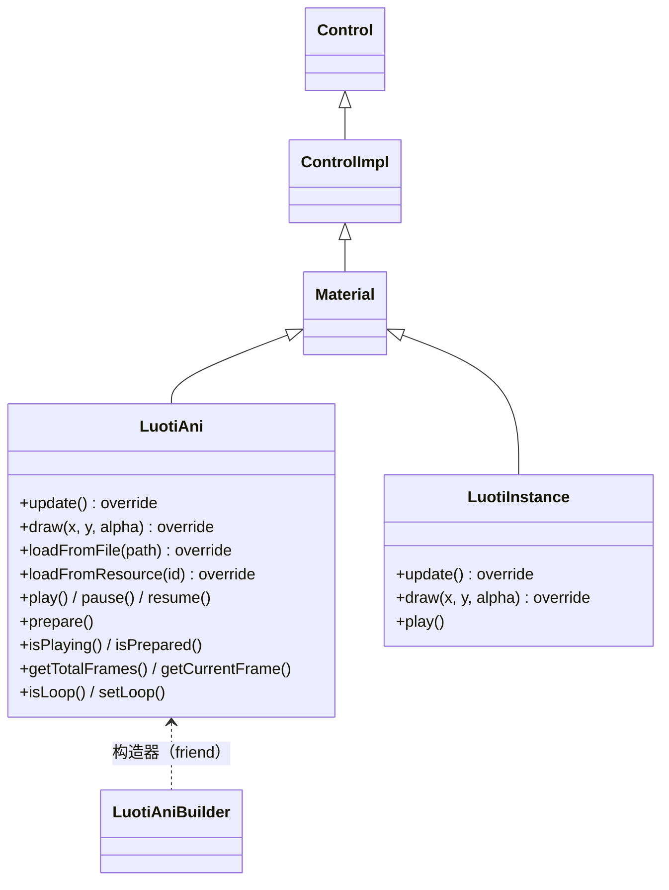
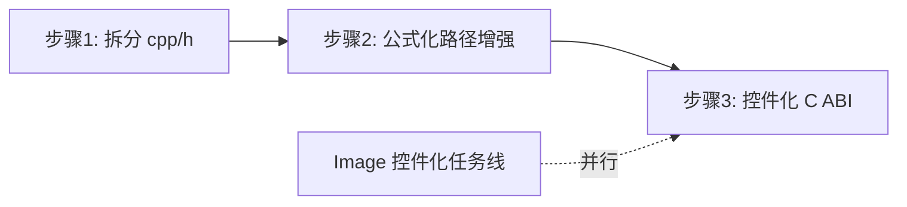

# LuotiAni 动画控件设计文档

> 状态：**待审核**（未审核通过前不做源码变更）

## 1. 概述

LuotiAni（动画引擎）是 `LuotiAni → Material → ControlImpl → Control` 体系下的**关键帧动画播放器**（LuotiAni.h:214），采用"JSON 描述 → 逐帧烘焙为 Surface 帧 → 运行时逐帧绘制"架构，运行时零插值计算。

本文档覆盖三项工作（按序实施，独立提交）：

| 步骤 | 内容 | 性质 |
|------|------|------|
| 1 | 拆分 `LuotiAni.cpp/.h`（header-only → 声明/实现分离） | 纯重构，行为不变 |
| 2 | 公式化路径增强（easing 缓动 + bezier/parabola/样条路径） | JSON 向后兼容新能力 |
| 3 | 控件化（C ABI 暴露独立动画控件） | 新接口 |

现状问题：LuotiAni 为 **header-only**（实现全部内联于 `include/LuotiAni.h`，915 行，含 json 解析/prepare 烘焙/矩阵运算），被 Button.cpp、UICornerstoneAPI.cpp、LayoutParser.cpp、test_button.cpp 四个编译单元重复编译；C ABI 无独立动画控件（唯一入口是 Button 的 `"animation"` 属性，Button.cpp:341-351，**绑定按钮**）；插值仅线性。

## 2. 现状分析

### 2.1 类族结构（已核实）



- **LuotiAni**（LuotiAni.h:214）：单实例播放器。成员 `m_isLoaded/m_isPrepared/m_isPlaying/m_loop/m_totalFrames/m_frameRate/m_frameMSDuration/m_frameToDraw/m_lastFrameMsTick`（:233-249）。
- **LuotiAniBuilder**（:815）：链式构造器（friend）。
- **LuotiInstance**（:853）：共享帧数据的多实例播放器（同一动画多处播放）。

### 2.2 关键实现锚点（已核实）

| 锚点 | 位置 | 说明 |
|------|------|------|
| `getTicks()` | :28 | `steady_clock` 毫秒，inline |
| `loadFromFile(fs::path)` | :417-419 | override，委托 `loadAniDesc`（JSON 加载，非纹理） |
| `loadFromResource(string)` | :421 | override，委托 `loadAniDesc`（资源 ID 版） |
| `loadAniDesc(fs::path)` | :423 | fopen + json 解析；错误路径 throw+printf（:426/:447，风格保留，§2.3-4） |
| overview 解析 | :487-495 | frameRate 校验（:488-490 throw）、totalFrames、`loop`（:495，`.at()` 严格解析） |
| `update()` | :549-571 | `deltaTick` 毫秒累进（:555-557）；非 loop 播放结束复位（:559-564）；**结束触发 Custom `EventName::AnimationEnded`**（:564，带 `m_id`） |
| `draw(float,float,uint8)` | :574-576 | override（Material 的带参虚函数），按当前帧绘制：`draw(m_frameToDraw, x, y, alpha)`（:575） |
| `play()` | :592-600 | **未 prepare 抛异常**（:593-595）；复位 `m_frameToDraw=0`（:598） |
| `prepare()` | :622-791 | 未加载抛异常（:622）；重复 prepare 检查（:625）；逐帧烘焙 canvas（:743 区域）；:791 `m_isPrepared=true` |
| 关键帧插值循环 | :732-739 | previousKeyFrame 遍历 + 逐帧求值——**当前全部线性** |
| `pause()/resume()` | :793-803 | resume 未 prepare 抛异常（:797-799） |
| 查询/设置 | :805-812 | `isPlaying/isPrepared/getTotalFrames/getCurrentFrame/isLoop/setLoop`——**无 setFrame** |
| SHAPE/TEXT 图层 | :663-668 | 解析支持，prepare 中 continue 跳过（未实现） |

### 2.3 JSON 动画格式（bombBlock.jsonc 实证）

```jsonc
{
    "overview": { "version": "0.0.1", "name": "...", "view": { "width": 512, "height": 512 },
                  "frameRate": 60, "totalFrames": 60, "loop": true },
    "layers": [
        { "name": "marker", "type": "image", "src": "animations/bombBlock/marker.svg",
          "width": 512, "height": 512, "opacity": 100, "blendMode": "blend",
          "keyFrames": [
              { "frame": 0, "operation": [
                    { "type": "translate", "tx": 0, "ty": 0 },
                    { "type": "scale", "sx": 1, "sy": 1 },
                    { "type": "rotate", "angle": 0, "cx": 256, "cy": 256 },
                    { "type": "opacity", "opacity": 100 },
                    { "type": "visible", "visible": true } ] },
              { "frame": 59, "operation": [ /* 同结构，angle: 360 */ ] }
          ] }
    ]
}
```

关键帧间插值：translate/scale/rotate/opacity **统一线性**（prepare 烘焙期完成）。

### 2.4 现状问题清单

1. **header-only 编译开销**：实现 + `nlohmann/json.hpp` 被 4 个编译单元重复编译；`#include "MainWindow.h"`（:20）为历史遗留（类内无任何使用）。
2. **C ABI 无独立动画控件**：动画仅能绑定 Button（`"animation"` 属性）或布局 JSON luotiAni 节点——loading/装饰/粒子等独立展示场景无入口。
3. **插值仅线性**：匀速直线动画无法表达缓动、曲线轨迹、抛体效果。
4. **错误路径 printf**：全文件 18 处 printf（:341/:347/:353/:426/:456/:462/:479/:489/:534/:594/:621/:626/:655/:671/:742/:764/:798/:903），均为 throw 前的错误提示（成对出现，含 luotiAni::play 等）——**属现有异常风格的一部分，本期保留**（与 throw C 字符串一并另行排期，拆分时不得删除，否则改变错误输出行为）。
5. **事件遮挡缺陷**：LuotiAni 不重写 `isContainsPoint`，继承 ControlImpl 的真实命中——作为上层控件会屏蔽下层兄弟事件（与 Image 控件化发现的缺陷同源，ControlBase.cpp:301 covered 检测只看 visible+isContainsPoint）。
6. **AnimationEnded 无消费者**：Custom 事件已触发（:564/:886），但全 src 无消费者，C ABI 回调链路缺失。
7. **内存**：prepare 烘焙 totalFrames 帧 RGBA canvas（60 帧 512×512 ≈ 63MB）。
8. **换动画状态不重置（现有代码缺陷，控件化必经路径）**：`loadAniDesc`/`parseJsonDesc` 不清 `m_isPrepared`/`m_frames`/`m_frameSurfaces`/`m_layers`——同一实例二次 `loadFromFile` 后 `m_isPrepared` 仍为 true，`prepare()` 早退（:625-628），m_frames 保留旧动画帧而 `m_totalFrames` 已是新值 → **错帧渲染甚至越界崩溃**（:582 `m_frames[frameNo]`）。现有用法（Button 属性、Builder）均一次性加载，从未触发；控件化 `animation` 属性可重复设置，**必须修复**（见 §6.5）。
9. **异常穿越 C ABI 边界（现有代码风险，控件化入口必须防护）**：`loadAniDesc`（fopen 失败 :426/:447、JSON 错误 :480/:489）与 `prepare`（资源缺失 :655 等）均 throw C 字符串——C ABI 工厂与属性分发若捕获则异常穿越 DLL 边界。现有 Button `"animation"` 属性（Button.cpp:341-351）已存在此风险，控件化新增入口须防护（见 §6.4）。
10. **play/pause/resume 三态语义**：`play()` 会**复位帧到 0 重播**（:598），`resume()` 才是从暂停处继续（:797-803）——`playing` 属性语义必须明确（见 §6.2）。
11. **帧 Actor 缩放快照缺陷（现有代码缺陷，已实证）**：prepare 时帧 Actor `make_shared<Actor>(this, true)`（:778）——`ControlImpl` 构造时从 parent 继承复合缩放（ControlBase.cpp:7-20，快照），但**帧 Actor 在手动数组 m_frames 中、不是控件树成员**（不走 addControl/setParent/updateChildScale 传播链）——之后 LuotiAni 自身缩放变化（setParent/换父/父链缩放）**不传导到帧 Actor**。实证：test_button g_button6（2x 缩放动画按钮，:140-150）——prepare 在 setLuotiAni（setParent 2x）**之前**（builder 链 :141-145 → :147），帧 Actor m_xxScale 停留在 1 → **动画实际按 1x 绘制**（按钮 2x 但动画不缩放）；测试未断言动画缩放尺寸，缺陷未被发现。修正见 §6.9。

### 2.5 决策依据

- 拆分是后续两步的接口稳定化前置，纯重构零风险；
- 公式化路径在烘焙期求值（运行时零开销），与现有架构天然兼容，JSON 缺省字段=现状线性（向后兼容）；
- 控件化与 Image 控件化同构（Material 体系、纯显示、事件透传），可复用已验证的设计模式（isContainsPoint=false 遮挡修正、工厂挂 bench、属性分发惯例）。

## 3. 总体方案与架构选择

### 3.1 步骤关系



- 步骤 1 与步骤 2/3 是先后依赖（2/3 基于拆分后的稳定接口）；
- 与 Image 控件化并行（isContainsPoint 各重各的，互不冲突；唯一交集是 test_button 回归，实施时协调）；
- `include/LuotiAni.h` 不在主设计 Session 未提交改动列表中，步骤 1/2 基线冲突面小；步骤 3 触碰 `UICornerstoneAPI.cpp/.h`（在该列表内）——**实施前必须对齐基线**。

### 3.2 方案对比

| 决策点 | 选项 | 结论 |
|--------|------|------|
| 拆分 | header-only 保持 vs 拆分 .cpp/.h | **拆分**：项目惯例（所有控件均 .h+.cpp）；编译隔离；隐藏实现细节 |
| 路径形状 | 仅 easing vs bezier+parabola vs 全支持 | **全支持**（用户确认）：bezier(2/3 次) + parabola + catmull-rom + easing |
| 创建即播放 | 自动播放 vs 显式控制 | **显式控制**（用户确认）：工厂只 load+prepare，播放经 `playing` 属性 |
| AnimationEnded 回调 | 本期实现 vs 不做 | **不做**（C ABI 回调链路缺失，超范围，列可选后续） |

## 4. 步骤 1：代码拆分（纯重构）

### 4.1 拆分范围

| 文件 | 改动 |
|------|------|
| `include/LuotiAni.h` | 保留类声明（LuotiAni/LuotiAniBuilder/LuotiInstance）与小型 inline 访问器（getTicks、isPlaying/isPrepared/getTotalFrames/getCurrentFrame/isLoop 等 getter）；方法仅声明 |
| `src/LuotiAni.cpp`（新建） | 全部实现：json 解析、prepare 烘焙、矩阵/插值、play/pause/resume/update/draw 等 |
| `CMakeLists.txt` | src 列表加入 `src/LuotiAni.cpp` |

### 4.2 清理项（仅限拆分相关内容）

- 移除 `#include "MainWindow.h"`（LuotiAni.h:20，无使用）；
- **保留**全部 throw 前 printf 错误提示（§2.3-4，属现有异常风格，删除会改变错误输出行为）；
- 抛 C 字符串异常的风格**保留**（范围控制，另行排期）；
- 头文件按 **UTF-8 with BOM** 保存（AGENTS.md 强制）。

### 4.3 验收标准

- 编译链接通过；test_button 无回归（含 g_button6 双倍缩放动画按钮）；
- **行为零变化**（纯搬移，不改任何逻辑）。

## 5. 步骤 2：公式化路径增强

### 5.1 JSON 格式扩展（operation 级新增可选字段，缺省=现状线性）

```jsonc
// easing：作用于本段所有属性的插值缓动（缺省 linear）
{ "type": "translate", "tx": 100, "ty": 50, "easing": "ease-in-out" }

// path：作用于本段位置轨迹（缺省直线）；起点=上一关键帧终点，终点=当前关键帧 (tx,ty)
{ "type": "translate", "tx": 100, "ty": 50,
  "path": { "type": "bezier", "c1x": 50, "c1y": -80, "c2x": 150, "c2y": 120 } }      // 三次（缺 c2x/c2y 为二次）

{ "type": "translate", "tx": 200, "ty": 0,
  "path": { "type": "parabola", "vx": 60, "vy": -30 } }                              // 抛体：初速向量 (vx,vy)

{ "type": "translate", "tx": 300, "ty": 0,
  "path": { "type": "catmull-rom",
            "points": [ { "x": 50, "y": -40 }, { "x": 150, "y": 80 }, { "x": 250, "y": -60 } ] } }
```

### 5.2 easing 集（字符串枚举）

| 值 | 公式（t∈[0,1]） |
|----|------|
| `linear`（缺省） | t |
| `ease-in` | t² |
| `ease-out` | 1-(1-t)² |
| `ease-in-out` | 3t²-2t³ |
| `quad` | t<0.5 ? 2t² : 1-(−2t+2)²/2 |
| `sine` | 1-cos(t·π/2) |
| `cubic-bezier(x1,y1,x2,y2)` | 显式贝塞尔缓动（参数需在 [0,1] 内合法） |

**非法值容错**：未知 easing 名 / cubic-bezier 参数非法 → **回退 `linear` + printf 警告**（先例：未知 operation type 即 printf 警告宽容跳过，:534）——不 throw、不改变动画播放能力。

### 5.3 path 形状

| type | 参数 | 求值 |
|------|------|------|
| 缺省（linear） | — | 段起点→终点直线 |
| `bezier` | `c1x/c1y`（二次）；`c1x/c1y/c2x/c2y`（三次） | 控制点**相对段起点** |
| `parabola` | `vx/vy` 初速向量 | 位置 = 起点 + (vx·t, vy·t + g·t²/2)，其中 g = 2·(end−start−v) 由终点坐标反解，**保证 t=1 精确到达终点**（vx/vy 决定轨迹形状，g 自动确定） |
| `catmull-rom` | `points[]` 中间过点 | 均匀参数化 Catmull-Rom，平滑经过所有点（含段端点） |

**非法值容错**：未知 path type → 回退直线 + printf 警告（同 §5.2 惯例，先例 :534）；缺字段（如 bezier 缺 c1x/c1y）→ 按二次 bezier 补零（控制点=段起点，等价直线）。

### 5.4 插值求值语义

```
t' = easing(t)                        // 时间重映射：本段所有属性的插值因子（缺省 linear 时 t'=t）
位置   = path(t')                      // translate 且声明 path 时（无 path 走线性插值 t'）
其他属性 = 起点 + (终点-起点) * t'       // scale/rotate/opacity
```

**统一时间重映射**：easing 先作用于时间 t（控制"运动速度曲线"），路径形状按重映射后的 t' 参数化（bezier/catmull-rom 数学性质：参数化重映射后仍严格在曲线上、t=1 仍精确到终点；parabola 同理）。easing 与 path 正交组合、顺序无关。求值全部发生在 prepare 烘焙期，**运行时零开销**（帧缓存不变）。

### 5.5 实现要点

- `src/LuotiAni.cpp` 新增内部模块：`EasingFunc` 表 + `PathEvaluator`（linear/bezier2/bezier3/parabola/catmull-rom）；
- **Operation 结构体扩展**：新增 easing/path 解析字段（operation 分发处 :530-541 解析扩展）——拆分时一并设计字段布局（拆分后结构体只在 .cpp 内部实现细节，不进 .h 公共接口）；
- prepare 插值循环（现 :732-739 区域）替换求值逻辑；JSON 解析（parseJsonDesc 的 operation 分发）扩展新字段；
- 测试调试接口（非 C ABI）：`OpData getFrameOpData(uint32_t layer, uint32_t frame) const`（prepare 后查询指定层指定帧的**完整插值结果**——位置/缩放/角度/透明度，覆盖位置与其余属性的全部断言；比只查位置的接口更通用）。

### 5.6 向后兼容保证

旧 JSON（无 easing/path 字段）逐帧插值数值与原线性结果**完全一致**（缺省路径=直线、缺省缓动=linear，求值公式退化一致）。

### 5.7 验收标准

新增 test_luotiani.cpp（注册到 `UI_TEST_EXECUTABLES`，test/CMakeLists.txt:100-112 列表，命名 test_luotiani）。测试 JSON 覆盖**全部新字段的组合面与边界面**，断言统一经调试接口 `getFrameOpData`（§5.5）：

| # | 用例 | 预期 |
|---|------|------|
| L1 | easing 各值（translate 线性路径） | 中间帧位置 = 线性插值 × t'（t' 为对应 easing 公式值） |
| L2 | bezier 二次/三次（无 easing） | 中间帧位置 = B(t)（贝塞尔公式值）；段终点精确到 (tx,ty) |
| L3 | parabola（无 easing） | 中间帧位置符合抛体轨迹；t=1 精确到终点（g 反解验证） |
| L4 | catmull-rom（无 easing） | 平滑经过全部过点（含段端点） |
| L5 | 向后兼容（旧 JSON） | 逐帧 OpData 与原线性结果**完全一致**（缺省字段退化验证） |
| L6 | **easing+path 组合** | 位置 = path(easing(t))——时间重映射链验证（§5.4 统一语义） |
| L7 | **easing 用于 scale/rotate/opacity** | 各属性中间帧数值 = 起点+(终点-起点)×t'（非位置属性断言） |
| L8 | **多关键帧多段混合** | 各段独立 easing/path 正确衔接（段起点=上一段终点） |
| L9 | 非法字段容错 | 未知 easing 名 / 非法 cubic-bezier 参数 / 未知 path type / bezier 缺控制点 → 回退缺省（linear）+ 不 throw（§5.2/§5.3 容错规则） |
| L10 | **全量现有资源回归** | subModules/assets/animations/ 下 11 个正式 .jsonc（排除 `* - 副本.jsonc` 与无动画的 lightBand）逐个 load+prepare：帧数=totalFrames、画布尺寸=view、全帧 OpData 数值有限（无 NaN/无穷）、60 帧冒烟播放不崩溃 |
| L11 | **缩放校准（步骤 3 后追加）** | 仿 g_button6 结构（builder 链 prepare 先行 → setLuotiAni 挂 2x 按钮）：绘制一次后经 `dynamic_cast<Actor*>`（帧 Actor）断言 getScaleXX()==2（§6.9 修复前为 1）；换 1x 父再绘制后断言==1 |

**资源清单**（已核实）：bombBlock / cyanBlock / darkGreenBlock / deepBlueBlock / grayBlock / greenBlock / pierceBlock / purpleBlock / redBlock / rotateBtn / yellowBlock（11 个正式 .jsonc）；排除：`bombBlock - 副本.jsonc`、`pierceBlock - 副本.jsonc`（素材作者遗留副本）、lightBand（仅 .svg 无动画描述）。

**L10 的定位**：步骤 2 完成后执行（依赖 OpData 调试接口与 test_luotiani 框架）——全量现有资源的向后兼容 + 病态数值回归。步骤 1（拆分）的保真由 test_button 的动画用例保证（rotateBtn 真实资源路径：LuotiAniBuilder + 资源 ID 加载 + 挂按钮播放）。

## 6. 步骤 3：控件化（C ABI 暴露）

### 6.1 C ABI 工厂

```c
// jsoncPath 为动画描述文件路径（相对路径经基路径拼接，同 Button.cpp:343-344）；
// 创建后不自动播放（显式经 SetBool("playing") 控制）
UICORNERSTONE_API UIControlHandle UICornerstone_CreateAnimation(
    UIInstance instance, const char* jsoncPath,
    float x, float y, float w, float h);
```

实现（仿 CreateImageButton / Button animation 惯例）：

```cpp
UIControlHandle UICornerstone_CreateAnimation(UIInstance instance,
    const char* jsoncPath, float x, float y, float w, float h)
{
    if (!instance || !instance->initialized) return nullptr;
    auto ani = std::make_shared<LuotiAni>(instance->bench);      // 构造不加载（与 Button.cpp:345 同款用法）
    ani->setRect(SRect(x, y, w, h));                             // w/h 传 0 时 prepare 回退到动画画布尺寸（:631-634）
    instance->bench->addControl(ani);                            // setContext 传播
    if (jsoncPath) {
        try {
            fs::path p(jsoncPath);
            if (p.is_relative()) p = fs::path(Platform::GetBasePath()) / p;
            ani->loadFromFile(p);                                // 委托 loadAniDesc（LuotiAni.h:417-419）
            ani->prepare();                                      // 烘焙帧
        } catch (...) {                                          // 异常边界防护（见 §6.4）
            instance->bench->removeControl(ani);
            return nullptr;
        }
    }
    ani->setVisible(true);
    return reinterpret_cast<UIControlHandle>(static_cast<Control*>(ani.get()));
}
```

声明插入位置：UICornerstoneAPI.h CreateImageButton 附近。

### 6.2 属性表

| 属性名 | 类型 | 语义 | 说明 |
|--------|------|------|------|
| `animation` | String | JSONC 路径（相对经基路径） | **只写不读**（LuotiAni 无持久路径字符串成员，同 Image 的 fs::path 悬垂问题）；重载 loadFromFile + prepare（**依赖 §6.5 换动画重置修复**）；失败返回 0（异常边界见 §6.4）；已播放中则从第 0 帧重播 |
| `playing` | Bool | 置 1=play()，置 0=pause() | 可读（isPlaying）；创建后默认 false（显式控制）。**语义：每次置 1 均为 `play()`（帧复位 0 重播，:598）**——play 与 resume 是两套语义（§2.3-10），属性不做暂停/恢复状态机，统一命令式重播 |
| `loop` | Bool | setLoop()（已有，LuotiAni.h:812） | 可读（isLoop） |
| `frame` | Int | 跳帧（新增 `setFrame`，见 §6.3） | 可读（getCurrentFrame，:810）；未 prepare 时设置返回 0 |

通用属性（rect/visible/enable 等）走 ControlImpl 既有实现。

**尺寸语义**：创建/设置时 w/h 传 0 → prepare 回退到 JSON `overview.view` 画布尺寸（:631-634），非纹理自然尺寸（与 Image 的"0=自然尺寸"不同源，勿混淆）。

### 6.3 C++ 侧新增（LuotiAni 类，实现放 src/LuotiAni.cpp）

```cpp
// 跳帧：仅当已 prepare 且帧号合法时生效；同时复位 m_lastFrameMsTick=getTicks()
// （否则 seek 后首次 update 会按累计 deltaTick 跳过帧，:555-557）
void setFrame(uint32_t frame);

// 事件命中：纯显示控件不参与事件命中与遮挡检测
// （同 Image 控件化 §6.2：ControlBase.cpp:301 covered 检测只看 visible+isContainsPoint、
//  不重写会屏蔽下层兄弟控件的事件）
bool isContainsPoint(float x, float y) override { return false; }

// 属性系统重写（惯例同 Button.cpp:335-353 strcmp 分发）：
int setStringProperty(const char* prop, const char* value) override;  // "animation"
int setBoolProperty(const char* prop, int value) override;            // "playing" / "loop"
int setIntProperty(const char* prop, int value) override;             // "frame"
int getBoolProperty(const char* prop, int& out) override;             // "playing" / "loop"
int getIntProperty(const char* prop, int& out) override;              // "frame"
```

PropertyNames 常量：`kAnimation` 已有（Button 使用）；新增 `kPlaying`/`kLoop`/`kFrame`。

### 6.4 异常边界策略（C ABI 侧，必须）

LuotiAni 的 `loadAniDesc`/`prepare` 均为 throw C 字符串风格（fopen 失败、JSON 错误、资源缺失，§2.3-9）——**C ABI 边界必须捕获**，否则异常穿越 DLL 边界（未定义行为）：

1. **工厂**（§6.1）：try/catch 包裹 loadFromFile+prepare，失败回滚（removeControl）+ 返回 nullptr；
2. **`animation` 属性**：setStringProperty 实现内 try/catch，失败返回 0（控件保留，状态不变——下一次设置仍可重试）；
3. **`playing` 属性**：置 1 时若未 prepare（isPrepared()==false）**返回 0 拒绝**（不调 play()，避免 throw）；
4. **`frame` 属性**：未 prepare 时返回 0 拒绝（setFrame 已按帧号合法性防御）。

注：现有 Button `"animation"` 属性（Button.cpp:341-351）无此防护、异常会穿越 SetString 边界——属既有风险，本设计**不修改 Button**（范围控制），但控件化入口从源头防护。

### 6.5 换动画状态重置（现有代码缺陷修复，控件化依赖）

`loadAniDesc`/`parseJsonDesc` 二次加载不清状态（§2.3-8）——`animation` 属性重复设置是控件化常态路径，**必须修复**：

`parseJsonDesc` 开头（重建前）增加状态重置：

```cpp
m_isPrepared = false;
m_frames.clear();
m_frameSurfaces.clear();
m_layers.clear();
m_frameToDraw = 0;
```

修复后二次 `loadFromFile` → prepare 正常重新烘焙（:625 早退判断通过新 m_isPrepared=false 正确跳过）。**本修复是步骤 3 的前置项**（无此修复 A6 换动画用例即错帧/越界）。

### 6.9 帧 Actor 缩放校准（现有代码缺陷修复，控件化依赖）

缩放传导机制核查结论（§2.3-11）：`ControlImpl` 构造（ControlBase.cpp:7-20）、`setParent`（:386-395）、`updateChildScale`（addControl 时，:411/:417）构成的复合缩放传播链**仅对控件树成员生效**；帧 Actor 在手动数组 `m_frames` 中，其 `m_xxScale` 是 prepare 时的构造快照，之后 LuotiAni 的缩放变化不传导。

**修正（最小）**：`LuotiAni::draw(uint32_t frameNo, ...)`（:578）绘制当前帧前，用 public 的 `updateChildScale`（ControlBase.h:341-346，帧 Actor m_xScale=1 → 校准值 = LuotiAni 复合缩放）校准：

```cpp
void draw(uint32_t frameNo, float x, float y, uint8_t alpha) {
    if (!m_visible) return;
    if (!m_isPrepared || m_frames.empty()) return;
    updateChildScale(m_frames[frameNo].get());   // 帧 Actor 缩放校准（非控件树成员，快照会陈旧）
    m_frames[frameNo]->draw(x, y, alpha);
}
```

- 每次绘制仅校准 1 个当前帧 Actor（O(1)），帧 Actor `m_xScale=1`（:778 构造默认）→ 校准后 = LuotiAni 当前复合缩放；
- 天然跟随父链缩放变化（prepare 后换父、父控件缩放变化、bench 缩放）——不再依赖时序；
- 绘制链验证：`Material::draw(void)` 传逻辑坐标（Material.cpp:37-39）→ 帧 Actor::draw 内 `mapToDrawRect`（ControlBase.cpp:169-175）按校准后缩放应用位置+尺寸 → 完整正确；
- **修复影响**：g_button6（2x 动画按钮）动画由 1x 变 2x（行为修正，测试未断言缩放尺寸、无回归）；控件化后独立动画控件在缩放父链下尺寸正确。

**本修复是步骤 3 的前置项**（控件化暴露独立控件后，缩放场景成为常态；不修复则缩放父链下动画尺寸失真）。

### 6.6 生命周期与渲染链（已核实）

- 渲染：`Material::draw(void)` 虚分发到 `LuotiAni::draw(float,float,uint8)`（:574），按 `m_frameToDraw` 绘制当前帧（:575）——挂树后标准控件树遍历即生效；**缩放**：帧 Actor 非控件树成员，每次绘制前经 `updateChildScale` 校准（§6.9）；
- 帧推进：依赖帧循环 `update()`（:549-571）毫秒驱动，无需 C ABI 额外驱动；
- 销毁：`UICornerstone_DestroyControl` 通用路径，无特殊处理；
- 多实例：LuotiAni 无 create()/两阶段链（不走 Actor 的两阶段），工厂顺序"addControl → loadFromFile+prepare"保证 provider 就绪（prepare 的 getImageFromResource 依赖 ResourceProvider，:342-354）；
- 非循环播放结束：`m_frameToDraw` 复位 0（:560-564）。

### 6.7 不做的事（范围界定）

- **`animation-ended` 回调**：事件已触发（:564 `EventName::AnimationEnded`，LuotiInstance 版 :886 `LuotiInstanceEnded`），但 C ABI 回调链路缺失（全 src 无 Custom 事件适配），超本期范围——列可选后续；
- **`speed` 属性**：LuotiAni 无速度系数支持（帧推进硬编码 `deltaTick / m_frameMSDuration`，:557），需引擎改动——列可选后续；
- **LuotiInstance 暴露**：共享帧数据多实例播放器已存在（:853），"同一动画多处播放"场景可后续独立暴露；**注：LuotiInstance::loadFromFile 为空实现（:869）**，未来暴露前需先实现其加载链路；
- **SHAPE/TEXT 图层实现**（:663-668 解析有、prepare 无）；
- **LayoutParser JSON 布局接入**（同 Image 控件化理由：parse 分发链属正交扩展 + 基线冲突风险）；
- **Button 现有 `"animation"` 属性的异常防护**（§6.4 注）——既有行为，不改（范围控制）。

### 6.8 验收标准

新增 test_animation_cabi.cpp（结构仿 test_winframe.cpp，命名 test_animation）：

| # | 用例 | 预期 |
|---|------|------|
| A1 | 工厂创建 | 句柄非空；GetRect 与创建参数一致 |
| A2 | 创建不播放 | isPlaying==false（GetBool("playing")==0） |
| A3 | 播放/暂停/重播 | SetBool("playing",1) 后帧推进；0 后停住；**再置 1 帧从 0 重播**（§6.2 语义） |
| A4 | loop 往返 | SetBool("loop")/GetBool 一致 |
| A5 | frame seek | SetInt("frame")/GetInt 一致；跳帧后首次 update 不跳变（§6.3 lastTick 复位） |
| A6 | 换动画 | SetString("animation") 换动画后**重新 prepare、帧正确（验证 §6.5 重置修复）**、播放中则从第 0 帧重播 |
| A7 | 事件遮挡修正 | Button 与 Animation 重叠两顺序点击，Button 回调均触发（验证 §2.3-5） |
| A8 | 渲染冒烟 | 60 帧 Update/Render 不崩溃 |
| A9 | 异常边界 | 无效路径创建 → 返回 nullptr 不崩溃（§6.4-1）；SetString("animation") 无效路径 → 返回 0、控件状态不变（§6.4-2）；未 prepare 时 SetBool("playing",1) → 返回 0（§6.4-3）；**用副本 jsonc（`bombBlock - 副本.jsonc`）作无效输入同断言**（风险 10） |
| A10 | 画布尺寸回退 | w/h=0 创建 → GetRect 返回 JSON overview.view 画布尺寸（§6.2 尺寸语义） |
| A11 | **增强 JSON 端到端** | C ABI 创建带 easing+path 的动画 JSON：句柄非空、SetBool("playing",1) 后帧推进；经 C++ 侧直接访问控件（`static_cast<LuotiAni*>` 用 getFrameOpData，仿 test_button 直接用 LuotiAniBuilder 的先例）断言中间帧符合 §5.4 统一语义 |
| A12 | **缩放跟随（L11 的 C ABI 面）** | C ABI 创建的动画挂入缩放父链（C++ 侧构造 2x 容器后 addControl 动画句柄控件，仿 g_button6 结构）→ 经 `dynamic_cast<Actor*>`（帧 Actor）断言 getScaleXX()==2（验证 §6.9 校准）；换 1x 父后再断言==1 |

回归：test_button（g_button6 动画按钮 + "animation" 属性路径）。

## 7. 文档同步

| 文档 | 改动 |
|------|------|
| `doc/LuotiAni_Design.md`（本文档） | 通过审核后移入"已审核" |
| `doc/CABI_Property_Design.md` | Animation 属性表（§6.2 内容） |
| `doc/UICornerstone_DLL_Design.md` | API 清单加 `UICornerstone_CreateAnimation` |
| `doc/CABI_MultiInstance_Design.md` | API 迁移表加 CreateAnimation 行；§6 实施清单加项 |
| `doc/guidelines/history.md` | 三步分别记录 |

## 8. 实施顺序与验收标准（汇总）

| 步骤 | 内容 | 验收标准 |
|------|------|----------|
| 1 | 拆分 LuotiAni.cpp/.h + CMakeLists + 移除 MainWindow include（**printf 错误提示保留**，§4.2） | 编译通过；test_button 无回归（rotateBtn 真实资源路径）；行为零变化 |
| 2 | 公式化路径：EasingFunc/PathEvaluator + Operation 结构扩展 + JSON 解析扩展 + prepare 插值替换 + 调试接口 getFrameOpData | test_luotiani L1-L10 全绿（含全量资源回归与非法值容错） |
| 3 | 控件化：**换动画状态重置修复（§6.5）** + **帧 Actor 缩放校准（§6.9）** + setFrame/isContainsPoint/属性重写 + **异常边界防护（§6.4）** + C ABI 工厂 + PropertyNames | test_animation_cabi A1-A12 全绿 + L11 全绿；test_button 无回归 |
| 4 | 文档同步 5 处 | 审核通过后合并 |

## 9. 风险与注意事项

1. **基线冲突（先决条件）**：工作区有主设计开发 Session 未提交改动（46 个 M + 3 个新文件）——步骤 3 触碰 `UICornerstoneAPI.cpp/.h`（在其列表内），**实施前必须对齐基线**；`include/LuotiAni.h` 不在该列表，步骤 1/2 冲突面小。
2. **回归交集**：test_button 是 Image 控件化（Actor rect 修正回归）与本文三步的公共回归面——两条任务线实施时协调顺序。
3. **内存**：prepare 烘焙 totalFrames 帧 RGBA canvas（60 帧 512×512 ≈ 63MB）——文档属性表注明建议低帧数/小画布。
4. **Catmull-Rom 均匀参数化**：密集控制点时可能轻微过冲，首版接受（后续可升级 centripetal 参数化）。
5. **`overview.at("loop")` 严格解析**（:495）：缺 loop 字段的 JSON 会抛 json 异常——现有资源均含该字段，保持现状（如需宽松化另行排期）。
6. **异常风格**：throw C 字符串 + 18 处 throw 前 printf 错误提示（§2.3-4）全部保留（删除会改变错误输出行为）；控件化入口的异常**在 C ABI 边界捕获**（§6.4），不扩散到内部实现。
7. **playing 与换动画时序**：`animation` 属性重载动画时（playing 状态）从第 0 帧重播（§6.2 已定义语义）。
8. **换动画重置修复（§6.5）是步骤 3 前置项**：无此修复 A6 换动画即错帧/越界（:582 按 m_totalFrames 索引旧 m_frames）。
9. **UICornerstoneAPI.cpp:28 现有 `#include "LuotiAni.h"` 为纯遗留**（当前无使用处）——控件化实现自然补上使用，无需清理。
10. **资源目录存在遗留副本文件**：`bombBlock - 副本.jsonc`、`pierceBlock - 副本.jsonc`（素材作者遗留，内容可能为旧版本/不可解析）——L10 全量回归必须按命名规则排除；lightBand 目录无 .jsonc（仅 svg，非动画资源）。若未来有"扫描整个资源目录"类需求（打包/校验脚本），需在规则中明确排除。L10 的加载路径也顺带验证：**副本文件若被加载应走异常边界路径（工厂返回 nullptr / 属性返回 0）而非崩溃**——可在 A9 中补充一条用副本文件作无效输入的用例。
11. **缩放校准（§6.9）是行为修正**：修复后 g_button6（2x 动画按钮）动画视觉从 1x 变为 2x——现有测试未断言动画缩放尺寸，无回归风险，但视觉变化需在 test_button 手动核对（g_button6 动画应与按钮同步 2x）。
12. **缩放与 Image 控件化的差异**：Actor 是控件树成员（addControl 时 updateChildScale 传播缩放），Image 无缩放问题；只有 LuotiAni 的帧 Actor（手动数组）需要 §6.9 校准——两任务线无冲突。
