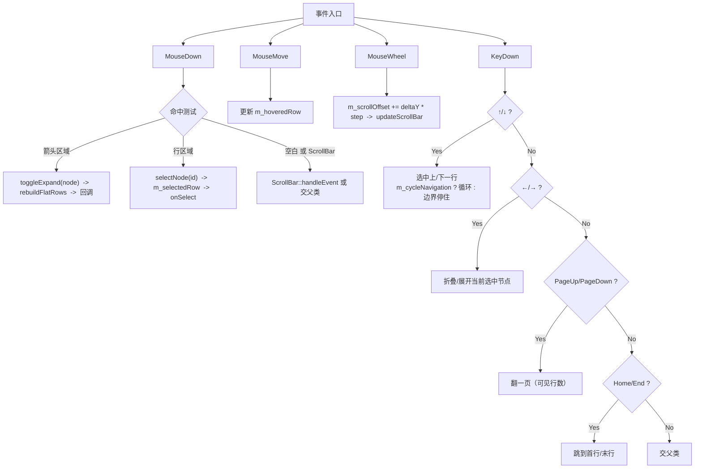

# TreeView 树形控件设计文档

## 1. 概述

TreeView（树形视图）以缩进层级展示树状数据，支持展开/折叠、节点选中、滚动和 JSON 布局定义。驱动需求来自 CornerstoneDesigner F2.2 的控件层次面板。

### 1.1 视觉结构

<svg xmlns="http://www.w3.org/2000/svg" viewBox="0 0 300 195" width="300" height="195">
  <rect x="0" y="0" width="300" height="195" rx="4" fill="#1A1A1A" stroke="#555" stroke-width="1"/>
  <text x="10" y="20" font-family="Arial,sans-serif" font-size="11" fill="#AAA">Control Tree</text>
  <line x1="6" y1="26" x2="294" y2="26" stroke="#444" stroke-width="0.5"/>
  <!-- Root Panel (selected) -->
  <rect x="6" y="30" width="284" height="24" rx="2" fill="#3A80C9" opacity="0.35"/>
  <text x="34" y="46" font-family="Arial,sans-serif" font-size="10" fill="#FFF">▸ Root Panel</text>
  <!-- SubPanel (expanded) -->
  <rect x="6" y="56" width="284" height="24" rx="2" fill="#2D2D2D"/>
  <text x="50" y="72" font-family="Arial,sans-serif" font-size="10" fill="#CCC">▾ SubPanel</text>
  <!-- btn1 -->
  <rect x="6" y="82" width="284" height="24" rx="2" fill="#2D2D2D"/>
  <text x="66" y="98" font-family="Arial,sans-serif" font-size="10" fill="#CCC">  ▸ Button (btn1)</text>
  <!-- subPanel2 -->
  <rect x="6" y="108" width="284" height="24" rx="2" fill="#2D2D2D"/>
  <text x="66" y="124" font-family="Arial,sans-serif" font-size="10" fill="#CCC">  ▸ Panel (subPanel2)</text>
  <!-- lbl1 -->
  <rect x="6" y="134" width="284" height="24" rx="2" fill="#2D2D2D"/>
  <text x="34" y="150" font-family="Arial,sans-serif" font-size="10" fill="#CCC">▸ Label (lbl1)</text>
  <!-- ScrollBar -->
  <rect x="294" y="6" width="4" height="185" rx="2" fill="#444"/>
  <rect x="294" y="30" width="4" height="60" rx="2" fill="#888"/>
</svg>

> 精确 SVG 在实现阶段可根据实际渲染结果微调。

---

## 2. 架构决策

### 2.1 基类选择

| 方案 | 优点 | 缺点 | 结论 |
|------|------|------|------|
| **A. 继承 `ControlImpl` + 组合 `ScrollBar`** | 无冗余接口；滚动条复用既有控件；与 ComboBox ListPanel 模式一致 | 需自行管理滚动条布局 | ✅ 选定 |
| B. 继承 `Panel` | 自带子控件管理 | Panel 的布局引擎不适用（TreeView 渲染平面行列表，不是子控件树）；`addControl` 语义冲突 | ❌ |
| C. 继承 `ScrollablePanel`（不存在，需新建） | 滚动开箱即用 | 新增一个复杂基类成本过高，仅为 TreeView 单一控件不值得 | ❌ |

### 2.2 节点渲染方式

| 方案 | 优点 | 缺点 | 结论 |
|------|------|------|------|
| **A. 展平行列表 + 自定义绘制** | 展开/折叠仅重建行数组（O(可见节点)）；大量节点无子控件开销；与 ComboBox ListPanel 同模式 | 需自行处理命中测试 | ✅ 选定 |
| B. 每个节点创建子 Control | 命中测试/事件自动路由 | 展开/折叠反复 create/destroy；1k 节点 -> 1k 子控件，性能差 | ❌ |

### 2.3 数据所有权

TreeView 通过 `vector<shared_ptr<TreeNode>>` 持有整棵树的所有权。同时维护 `unordered_map<string, shared_ptr<TreeNode>> m_nodeMap` 实现 O(1) 节点查找。`findNodeById` 直接查 map，`selectNode` 可先验证 id 存在性再重建行列表。

**map 代价**：
- **内存**：每节点 ~56 bytes（unordered_map 桶 + 节点），100k 节点多 ~5.6 MB
- **维护**：`rebuildFlatRows` 中顺便 `m_nodeMap[node->id] = node`，无额外渐进复杂度
- **id 重复**：后写入覆盖前者，与 `findNodeById` 返回首个匹配的行为一致

**`selectNode(id)` 受益方式**：

```cpp
bool TreeView::selectNode(const string& id) {
    if (m_nodeMap.find(id) == m_nodeMap.end())
        return false;  // O(1) 快速拒绝
    m_selectedId = id;
    rebuildFlatRows();  // 设置 m_selectedRow
    if (m_onSelect) m_onSelect(id);
    return true;
}
```

map 的 O(1) 存在性检查避免了对不存在的 id 执行全量 `rebuildFlatRows`。

### 2.4 滚动方案

直接复用 `ScrollBar` 控件，TreeView 自身设置 clipRect 限制绘制区域。与 ComboBox 列表滚动**完全相同**的模式：

```
ScrollBar::onValueChanged -> TreeView 更新 m_scrollOffset -> draw() 时 ClipRect + 偏移绘制
```

### 2.5 缺省展开

`setItems` 时依据 `m_defaultExpand` 批量设置所有节点的 `expanded` 状态，覆盖 TreeNode 自带的值。`expandNode`/`collapseNode` 独立操作不受影响。

### 2.6 焦点方案

TreeView 是一个可聚焦控件：

| 场景 | 行为 |
|------|------|
| **获得焦点** | `create()` 中设置 `m_tabStop = true`；`onFocus()` 调用 `invalidate()` 重绘 focus ring |
| **失去焦点** | 清除 `m_hoveredRow`（-1）、`invalidate()`；**不**清除 `m_selectedId`/`m_selectedRow`（选中状态持续可见，仅 focus ring 隐藏） |
| **键盘事件** | 仅在 `hasFocus()` 为 true 时处理 ↑↓←→/Home/End/PageUp/PageDown |
| **鼠标事件** | 不受焦点状态影响；点击行时自动 `setFocus()` |
| **Focus Ring** | `afterDraw()` 中使用 `dev->drawRect` 绘制虚线框（与现有其他控件一致） |
| **Tab 导航** | 遵循 `ControlImpl` 的 tab-stop 体系，Tab 键按 `tabIndex` 顺序跳入/跳出 |

```cpp
void TreeView::create() {
    ControlImpl::create();
    m_tabStop = true;
}

bool TreeView::handleEvent(shared_ptr<Event> event) {
    // 鼠标点击自动获取焦点
    if (event->m_type == EventType::MouseDown && event->mouseButton.button == MouseButton::Left) {
        if (!hasFocus()) setFocus();
        // ... 命中测试
    }
    // 键盘事件仅在焦点下处理
    if (event->m_type == EventType::KeyDown && hasFocus()) {
        // ↑/↓/←/→/PageUp/PageDown/Home/End
    }
}
```

✅ 与 `ControlImpl` 的焦点体系一致，无额外复杂度和遗漏。

### 2.7 性能与内存分析

#### 2.7.1 关键路径复杂度

| 操作 | 复杂度 | 说明 |
|------|--------|------|
| `draw()` | O(可见行) ≈ 20 | 直接跳到 `firstVisible`，无需遍历 0 ~ N-1 |
| `hitTestRow` | O(1) | 坐标直接计算行索引 |
| `rebuildFlatRows` | O(N) | 递归展平全部节点+构建 `m_nodeMap`，展开/折叠后执行 |
| `findNodeById` | O(1) | `m_nodeMap[id]` 直接查 |
| `selectNode(id)` | O(1) + O(N) | O(1) 检查 id 存在性，O(N) `rebuildFlatRows` 更新行索引 |

#### 2.7.2 单节点内存开销估算（64 位）

| 组件 | 大小 | 说明 |
|------|------|------|
| `TreeNode` 自身 | 72~96 bytes | `string`(×2, 共 64B) + `bool`(1B+padding) + `vector`(24B) |
| `string` id/label 堆数据 | 2 × (len + 1) bytes | SSO 短串 (<15 chars) 无堆分配；长串额外堆 |
| `vector<shared_ptr<TreeNode>>` | 24 + capacity × 16 | vector header 24B, 每个 `shared_ptr` 16B |
| `FlatRow`（仅展开节点） | 24 bytes | `shared_ptr`(16) + `int`(4) + padding(4) |
| `m_nodeMap` | ~56 bytes | unordered_map 桶 + 节点开销 |

**100k 节点估算：**

```
TreeNode:      100k × 80  ≈ 8.0 MB
id/label 数据: 100k × 40  ≈ 4.0 MB  (avg 20 chars)
children vec:  100k × 40  ≈ 4.0 MB  (avg 1 child)
FlatRow:       100k × 24  ≈ 2.4 MB  (全部展开)
m_nodeMap:     100k × 56  ≈ 5.6 MB
----------------------------------------------
总计:          ≈ 24.0 MB
```

**100k 节点、全部折叠时内存约 18 MB**。

#### 2.7.3 可扩展性边界

| 规模 | 瓶颈 | 结论 |
|------|------|------|
| ≤ **10 万** | draw()/hitTest O(可见行) | ✅ 当前方案无压力 |
| 10 万 ~ **100 万** | rebuildFlatRows O(N) 约 10ms, `selectNode` 重建略卡 | ⚠️ 可接受但展开/折叠有感知延迟 |
| **1000 万** | FlatRow 占 ~240 MB, rebuildFlatRows ~100ms | ❌ 超过 UI 帧预算 |
| **1 亿** | 内存超 2 GB，重建秒级 | ❌ 不可行，需虚拟滚动+按需加载架构 |

#### 2.7.4 内存优化方向（不变更架构）

| 优化 | 收益 | 影响 |
|------|------|------|
| `FlatRow` 只存 `TreeNode*` 裸指针而非 `shared_ptr` | 每行 -8 bytes | 需确保 TreeView 生命周期 > FlatRow |
| `TreeNode.children` 用 `InplaceVector` 替代 `vector` | 每节点 -12~20 bytes | 需实现固定容量小向量 |
| 短 id/label 利用 SSO（string 自带） | 无代码改动 | 已自动生效 |

以上优化均为微调，不改变 O(N) 复杂度上限。海量数据需换用虚拟滚动 + 按需加载架构。

---

## 3. 类设计

### 3.1 TreeNode

```cpp
struct TreeNode {
    string id;                           // 唯一标识
    string label;                        // 显示文本
    bool expanded = false;               // 初始展开状态
    vector<shared_ptr<TreeNode>> children;
    void* userData = nullptr;            // 自定义数据指针（用户管理生命周期）
};
```

不存储 `selected`/`indentLevel`——选中状态由 TreeView 统一管理，缩进层级在展平时动态计算。

`userData` 为裸指针，用户可通过 `setOnClearNode` 注册清理回调，在节点被释放或 TreeView 析构时处理资源。

### 3.2 TreeView 类

```cpp
class TreeView : public ControlImpl {
    friend class TreeViewBuilder;
public:
    using OnSelectHandler = function<void(const string& nodeId)>;
    using OnSelectDataHandler = function<void(const string& nodeId, void* userData)>;
    using OnExpandHandler = function<void(const string& nodeId)>;
    using OnCollapseHandler = function<void(const string& nodeId)>;
    using OnClearNodeHandler = function<void(void* userData)>;

private:
    // 数据
    vector<shared_ptr<TreeNode>> m_rootItems;
    unordered_map<string, shared_ptr<TreeNode>> m_nodeMap;

    // 展平行列表缓存
    struct FlatRow {
        shared_ptr<TreeNode> node;
        int depth;
    };
    vector<FlatRow> m_flatRows;

    // 选中/悬停
    string m_selectedId;
    int m_selectedRow = -1;
    int m_hoveredRow = -1;

    // 滚动
    shared_ptr<ScrollBar> m_scrollBar;
    float m_scrollOffset = 0;
    shared_ptr<ScrollBar> m_hScrollBar;
    float m_hScrollOffset = 0;

    // 视觉配置
    float m_indentWidth;
    float m_rowHeight;
    float m_lineSpacing = 0;         // 行间距（行与行之间的额外间隙）
    float m_arrowGap;                // 箭头 → 文本间距
    float m_contentWidth = 0;        // 内容最宽行（未缩放），用于水平滚动判断
    bool m_cycleNavigation = true;
    bool m_defaultExpand = false;

    // 字体
    FontName m_fontName;
    int m_fontSize;
    SharedFont m_font;

    // 颜色（可逐实例覆盖）
    SColor m_bgColor;
    SColor m_borderColor;
    SColor m_hoverColor;
    SColor m_selectedColor;
    SColor m_textColor;

    // 事件回调
    OnSelectHandler m_onSelect;
    OnSelectDataHandler m_onSelectData;
    OnExpandHandler m_onExpand;
    OnCollapseHandler m_onCollapse;
    OnClearNodeHandler m_onClearNode;

    void ensureFont();
    bool toggleExpand(const string& id);
    void rebuildFlatRows();
    int hitTestRow(float mx, float my);
    bool hitTestArrow(int row, float mx);
    void updateScrollBar();
    void ensureSelectedVisible();
    void drawArrow(RenderDevice* dev, float x, float y, bool expanded);
    float calcContentWidth();
    void clearNodeRecursive(const shared_ptr<TreeNode>& node);
    float getStride() const { return m_rowHeight + m_lineSpacing; }
    void syncStateColor();

public:
    TreeView(Control* parent, const SRect& rect,
             float xScale = 1.0f, float yScale = 1.0f);
    ~TreeView() override;
    void create() override;
    void draw() override;
    bool handleEvent(shared_ptr<Event> event) override;

    // ── CRUD ──
    void setItems(const vector<shared_ptr<TreeNode>>& items);
    const vector<shared_ptr<TreeNode>>& getItems() const;
    bool addChild(const string& parentId, shared_ptr<TreeNode> node);
    bool removeNode(const string& id);
    bool setNodeLabel(const string& id, const string& label);
    bool setNodeUserData(const string& id, void* userData);
    void clearItems();
    shared_ptr<TreeNode> findNodeById(const string& id);

    // ── 节点操作 ──
    bool expandNode(const string& id);
    bool collapseNode(const string& id);
    bool selectNode(const string& id);
    string getSelectedId() const;

    // ── 视觉配置 ──
    void setIndentWidth(float px);
    float getIndentWidth() const;
    void setRowHeight(float px);
    float getRowHeight() const;
    void setLineSpacing(float px);
    float getLineSpacing() const;
    void setArrowGap(float px);
    float getArrowGap() const;
    void setCycleNavigation(bool cycle);
    bool getCycleNavigation() const;
    void setDefaultExpand(bool expand);
    bool getDefaultExpand() const;

    // ── 字体 ──
    void setFont(FontName fontName);
    void setFontSize(int size);
    int getFontSize() const;
    FontName getFontName() const;
    Font* getFont() const;

    // ── 事件绑定 ──
    void setOnSelect(OnSelectHandler h);
    void setOnSelectData(OnSelectDataHandler h);
    void setOnExpand(OnExpandHandler h);
    void setOnCollapse(OnCollapseHandler h);
    void setOnClearNode(OnClearNodeHandler h);

    // ── 颜色定制 ──
    void setBgColor(const SColor& c);
    SColor getBgColor() const;
    void setBorderColor(const SColor& c);
    SColor getBorderColor() const;
    void setHoverColor(const SColor& c);
    SColor getHoverColor() const;
    void setSelectedColor(const SColor& c);
    SColor getSelectedColor() const;
    void setTextColor(const SColor& c);
    SColor getTextColor() const;

    // ── 公共常量 ──
    static constexpr float LEFT_PADDING = 4.0f;
    static constexpr float RIGHT_GAP = 4.0f;

    // ── 子控件访问 ──
    shared_ptr<ScrollBar> getScrollBar() const;
    shared_ptr<ScrollBar> getHScrollBar() const;
    int getFlatRowCount() const;
    int getSelectedRow() const;
};
```

### 3.3 TreeViewBuilder

```cpp
class TreeViewBuilder {
private:
    shared_ptr<TreeView> m_treeView;
public:
    TreeViewBuilder(Control* parent, const SRect& rect,
                    float xScale = 1.0f, float yScale = 1.0f);

    TreeViewBuilder& setItems(const vector<shared_ptr<TreeNode>>& items);
    TreeViewBuilder& setIndentWidth(float px);
    TreeViewBuilder& setRowHeight(float px);
    TreeViewBuilder& setLineSpacing(float px);
    TreeViewBuilder& setArrowGap(float px);
    TreeViewBuilder& setCycleNavigation(bool cycle);
    TreeViewBuilder& setDefaultExpand(bool expand);
    TreeViewBuilder& setOnSelect(TreeView::OnSelectHandler h);
    TreeViewBuilder& setOnSelectData(TreeView::OnSelectDataHandler h);
    TreeViewBuilder& setOnExpand(TreeView::OnExpandHandler h);
    TreeViewBuilder& setOnCollapse(TreeView::OnCollapseHandler h);
    TreeViewBuilder& setOnClearNode(TreeView::OnClearNodeHandler h);
    TreeViewBuilder& setFont(FontName fontName);
    TreeViewBuilder& setFontSize(int size);
    TreeViewBuilder& setBgColor(const SColor& c);
    TreeViewBuilder& setBorderColor(const SColor& c);
    TreeViewBuilder& setHoverColor(const SColor& c);
    TreeViewBuilder& setSelectedColor(const SColor& c);
    TreeViewBuilder& setTextColor(const SColor& c);
    TreeViewBuilder& setBackgroundStateColor(StateColor sc);
    TreeViewBuilder& setBorderStateColor(StateColor sc);
    TreeViewBuilder& setId(int id);

    shared_ptr<TreeView> build();
};
```

---

## 4. 交互逻辑



### 操作对照表

| 操作 | 行为 |
|------|------|
| **点击箭头** | `toggleExpand(node)` — 展开/折叠切换，重建行列表 |
| **点击行文本/空白** | `selectNode(id)` — 设置选中，触发 `onSelect` |
| **MouseWheel** | 滚动列表（3 行为一步），ScrollBar 联动 |
| **↑/↓** | 选中上/下一行；`m_cycleNavigation == true` 时到头循环，否则停在边界 |
| **←** | 折叠当前选中节点（如果展开） |
| **→** | 展开当前选中节点（如果有子节点） |
| **PageUp/PageDown** | 上/下翻一页（当前可见行数） |
| **Home/End** | 跳到首行/末行 |

---

## 5. 绘制规范

### 5.1 单行布局

```
  缩进 depth × indentWidth  [▸/▾]  箭头间隔  文本 Label
  ←─── 4 ───→               ←m_arrowGap→
```

- **多级缩进**：每级 `m_indentWidth` 像素（默认 16px），在箭头之前
- **展开箭头**：`▸`（折叠）/ `▾`（展开），三角填充，位于缩进之后、标签之前
- **箭头间隔**：`m_arrowGap`（默认 16px），包含箭头绘制区域 + 与文本的间距
- **选中行**：整行背景 `m_selectedColor`（默认 `TREEVIEW_SELECTED_COLOR`）
- **悬停行**：整行背景 `m_hoverColor`（默认 `TREEVIEW_HOVER_COLOR`）
- **行高**：默认 24px（通过 `setRowHeight` 配置）
- **行间距**：`m_lineSpacing`（默认 0），行与行之间的额外间隙；总步进 = `m_rowHeight + m_lineSpacing`
- **文本颜色**：`m_textColor`（默认 `TREEVIEW_TEXT_COLOR`）
- **背景色**：`m_bgColor`（默认 `TREEVIEW_BG_COLOR`）
- **边框色**：`m_borderColor`（默认 `TREEVIEW_BORDER_COLOR`）

### 5.2 绘制流程

```cpp
void TreeView::draw() {
    if (!m_visible) return;
    beforeDraw();  // 背景 + 边框

    auto* dev = getRenderDevice();
    dev->setDrawColor(m_bgColor);
    dev->fillRect(m_rect);
    dev->setDrawColor(m_borderColor);
    dev->drawRect(m_rect);

    updateScrollBar();
    SRect cr = getContentRect();
    cr.width -= vSb;
    cr.height -= hSb;
    dev->setClipRect(cr);

    float stride = getStride();  // = m_rowHeight + m_lineSpacing
    int firstVisible = max(0, (int)(m_scrollOffset / stride));
    float topY = cr.top - fmod(m_scrollOffset, stride);
    for (int i = firstVisible; i < (int)m_flatRows.size(); i++) {
        float y = topY + (i - firstVisible) * stride;
        if (y > cr.bottom()) break;

        if (i == m_selectedRow)
            dev->fillRect({cr.left, y, cr.width, m_rowHeight}, m_selectedColor);
        else if (i == m_hoveredRow)
            dev->fillRect({cr.left, y, cr.width, m_rowHeight}, m_hoverColor);

        float arrowX = cr.left + 4 + m_flatRows[i].depth * m_indentWidth;
        float labelX = arrowX + m_arrowGap;
        if (!m_flatRows[i].node->children.empty())
            drawArrow(dev, arrowX, y, m_flatRows[i].node->expanded);
        dev->drawText(m_flatRows[i].node->label, labelX, y + padding);
    }

    dev->clearClipRect();
    afterDraw();  // ScrollBar + focus ring
}
```

---

## 6. 展平与搜索

### 6.1 展平算法

```cpp
void TreeView::rebuildFlatRows() {
    m_flatRows.clear();
    m_nodeMap.clear();
    m_selectedRow = -1;
    function<void(const shared_ptr<TreeNode>&, int)> flatten;
    flatten = [&](const shared_ptr<TreeNode>& node, int depth) {
        m_nodeMap[node->id] = node;          // 构建 map，O(1) 单次插入
        m_flatRows.push_back({node, depth});
        if (node->id == m_selectedId)
            m_selectedRow = (int)m_flatRows.size() - 1;
        if (node->expanded)
            for (auto& child : node->children)
                flatten(child, depth + 1);
    };
    for (auto& root : m_rootItems)
        flatten(root, 0);
    updateScrollBar();
}
```

展开/折叠、`setItems`、`clearItems` 后均调用 `rebuildFlatRows()`。

`setItems` 内部会根据 `m_defaultExpand` 统一设置所有节点的 `expanded` 值，然后调用 `rebuildFlatRows`（该函数会一并重建 `m_nodeMap`）：

```cpp
void TreeView::setItems(const vector<shared_ptr<TreeNode>>& items) {
    m_rootItems = items;
    // 应用缺省展开/折叠
    function<void(shared_ptr<TreeNode>&)> applyDefault;
    applyDefault = [&](shared_ptr<TreeNode>& node) {
        if (!node->children.empty())
            node->expanded = m_defaultExpand;
        for (auto& child : node->children)
            applyDefault(child);
    };
    for (auto& root : m_rootItems)
        applyDefault(root);
    rebuildFlatRows();  // 同时重建 m_flatRows + m_nodeMap
}
```

### 6.2 按 id 查找

```cpp
shared_ptr<TreeNode> TreeView::findNodeById(const string& id) {
    auto it = m_nodeMap.find(id);
    return it != m_nodeMap.end() ? it->second : nullptr;
}
```

O(1) 查找，依赖 `rebuildFlatRows` 构建的 `m_nodeMap`。任何修改树结构的操作（`setItems`、`expandNode`、`collapseNode`）都会触发 `rebuildFlatRows`，map 始终保持同步，无需额外维护。

---

## 7. 滚动集成

与 ComboBox 列表相同的滚动模式——

```cpp
void TreeView::updateScrollBar() {
    if (!m_scrollBar) return;
    float contentH = m_flatRows.size() * m_rowHeight;
    float viewH = getContentRect().height;
    m_scrollBar->setRange(0, max(0.0f, contentH - viewH));
    m_scrollBar->setPageStep(viewH);
    m_scrollBar->setVisible(contentH > viewH);
}

// ScrollBar::onValueChanged -> m_scrollOffset = value -> draw()
```

---

## 8. JSON 布局格式

```json
{
  "type": "tree-view",
  "id": "controlTree",
  "rect": { "x": 0, "y": 24, "w": 200, "h": 300 },
  "scale": { "x": 1.0, "y": 1.0 },
  "indentWidth": 16,
  "rowHeight": 24,
  "cycleNavigation": true,
  "defaultExpand": false,
  "items": [
    {
      "id": "rootPanel", "label": "Root Panel", "expanded": true,
      "children": [
        { "id": "btn1", "label": "Button (btn1)" },
        { "id": "subPnl", "label": "Sub Panel", "expanded": false,
          "children": [
            { "id": "btn2", "label": "Nested" }
          ]
        }
      ]
    }
  ],
  "events": { "onSelect": "onTreeSelect" }
}
```

> 颜色通过主题系统（`applyCommonColors`）配置，`lineSpacing`、`arrowGap` 等字段暂未在 JSON 解析器中实现，需通过 C++ API 设置。

---

## 9. 常量定义

`ConstDef.h`：

```cpp
// ConstDef.h — 全局常量
static const float  TREEVIEW_INDENT_WIDTH;        // 16.0f
static const float  TREEVIEW_DEFAULT_ROW_HEIGHT;  // 24.0f
static const SColor TREEVIEW_BG_COLOR;            // (25, 25, 25, 255)
static const SColor TREEVIEW_BORDER_COLOR;        // (60, 60, 60, 255)
static const SColor TREEVIEW_SELECTED_COLOR;      // (58, 128, 201, 255)
static const SColor TREEVIEW_HOVER_COLOR;         // (48, 48, 48, 255)
static const SColor TREEVIEW_TEXT_COLOR;          // (220, 220, 220, 255)
static const int    TREEVIEW_SCROLL_STEP_LINES;   // 3

// TreeView.h — 类内静态常量
static constexpr float LEFT_PADDING = 4.0f;  // 内容左侧内边距
static constexpr float RIGHT_GAP   = 4.0f;  // 计入行宽，触发水平滚动条提前出现，确保内容与垂直滚动条之间有间隙
```

---

## 10. 边界与约束

- 仅单选（Phase 2 可扩展多选）
- 不实现虚拟化滚动（draw/hitTest 已 O(1) 跳转，10 万节点流畅；超 100 万建议异步加载架构）
- 不支持拖拽排序（Phase 2 功能）
- 不支持自定义节点图标（Phase 2 功能）
- `id` 在同一 TreeView 中必须唯一；重复 id 时 `findNodeById` 返回首个匹配
- `cycleNavigation`（JSON: `cycleNavigation`）控制键盘边界行为，默认 `true`
- `defaultExpand`（JSON: `defaultExpand`）控制新设 items 时的展开状态，默认 `false`
- 不支撑千万级以上数据（详见 §2.7 性能与内存分析）

---

## 11. 文件结构

```
include/TreeView.h         — TreeNode + TreeView + TreeViewBuilder
src/TreeView.cpp            — draw / handleEvent / rebuildFlatRows / scroll
src/LayoutParser.cpp        — 解析 "TreeView" type + items 递归定义
test/test_treeview.cpp         — 单元测试
test/test_treeview_cabi.cpp    — C ABI 集成测试（JSON 布局）
test/test_treeview_bench.cpp   — 性能与内存基准测试（独立，无后端依赖）
test/CMakeLists.txt             — test_treeview / test_treeview_bench 目标注册
doc/TreeView_Design.md          — 本文档
```

---

## 12. 测试内容

| 测试 | 方法 | 通过标准 |
|------|------|---------|
| 空树渲染 | 创建 TreeView，不设 items | 无崩溃，空白绘制 |
| 单节点 | 1 个根节点 | 显示一行，缩进正确 |
| 多层嵌套 | 20 层深度 | 每层缩进递增，不重叠 |
| 展开/折叠 | 点击箭头 | 子节点出现/隐藏，兄弟不受影响 |
| 缺省展开/折叠 | `setDefaultExpand(true)` / `setDefaultExpand(false)` 后 `setItems` | 全部展开/全部折叠 |
| 选中 | 点击行 | 高亮 + onSelect 回调参数与 nodeId 一致 |
| 键盘 ↑/↓ 循环 | `cycleNavigation=true`，↑ 到首行再按↑ | 跳到末行 |
| 键盘 ↑/↓ 不循环 | `cycleNavigation=false`，↑ 到首行再按↑ | 停在首行 |
| PageUp/PageDown | 翻页操作 | 选中行偏移（可见行数） |
| Home/End | 跳到首行/末行 | 选中行正确 |
| 滚动 | 200+ 节点 | ScrollBar 出现，滚动后渲染正确 |
| 焦点 | 点击后键盘事件生效；Tab 跳入/跳出 | 键盘事件仅在焦点下处理 |
| **2x 缩放** | `xScale=2.0, yScale=2.0` 创建 TreeView | 缩进、行高、箭头位置、文本全部翻倍 |
| JSON 解析 | 完整 JSON 定义（含 cycleNavigation / defaultExpand） | 树结构与配置与 JSON 一致 |
| **内存基准**（10 万节点，全部展开） | `test_treeview_bench` 构建 10 万节点树，测量工作集增量 | ≤ 30 MB（含 m_nodeMap，允许 ±20%） |
| **性能基准：rebuildFlatRows**（10 万节点） | 100 次迭代取均值 | ≤ 80 ms |
| **性能基准：findNodeById**（10 万节点，1000 次） | Map 与 DFS 对比 | Map ≤ 1 ms, DFS ≥ 1000 ms（验证 O(1) vs O(N)） |
| **性能基准：selectNode 无效 id**（10 万节点） | 传入不存在的 id + map 快速拒绝 | ≤ 0.01 ms（O(1) 拒绝，不触发 rebuildFlatRows） |
| **性能基准：draw 可见行**（10 万节点，滚动到末尾） | 模拟 firstVisible 跳转 vs 从头扫描 | firstVisible ≤ 0.01 ms/draw |
| **行命中测试**（10 万节点，滚动到末尾） | `hitTestRow` 直接计算行索引 | ≤ 0.01 ms |

---

---

## 13. 新增设计决策（v0.2）

### 13.1 为何不直接使用 Label 控件渲染树节点

| 方案 | 分析 | 结论 |
|------|------|------|
| **A. 自定义绘制（当前方案）** | 每行仅一条 `drawText` 调用；选中/悬停高亮 + 箭头 + 缩进全部一次性绘制；展开/折叠仅更新 `FlatRow` 数组，无需创建/销毁子控件 | ✅ 选定 |
| B. 每行创建一个 Label 子控件 | N 行产生 N 个子控件，1k 节点即 1k Label；展开/折叠需反复 create/destroy；缩放逻辑需在每个 Label 上重复配置；命中测试依赖子控件事件路由而非直接坐标计算 | ❌ 性能差、复杂度高 |

**核心矛盾**：TreeView 的节点是**平面列表中带有额外样式标记的文本行**，而非独立的交互控件。Label 是为独立文本块设计的完整控件（支持换行、富文本、事件等），用于每个 TreeView 行属于过度设计。

ComboBox 列表项也采用同样的自定义绘制方案，TreeView 与之一致。

### 13.2 水平滚动条

v0.2 新增水平滚动条，支持深度嵌套的内容横向滚动。

**架构**：
- `m_hScrollBar`：水平 ScrollBar，置于 TreeView 底部
- `m_hScrollOffset`：水平滚动偏移量（未缩放坐标）
- `m_contentWidth`：通过 `renderer->measureText()` 计算最宽行的像素宽度

**布局互斥算法**（两遍修正）：

```
Pass 1: vVis = contentH > viewH
Pass 1: hVis = contentW > viewW - (vVis ? SB : 0)
Pass 2: vVis = contentH > viewH - (hVis ? SB : 0)
Pass 2: hVis = contentW > viewW - (vVis ? SB : 0)
```

垂直条高度 = `viewH - (hVis ? SB : 0)`  
水平条宽度 = `viewW - (vVis ? SB : 0)`

**右侧间隙**：`RIGHT_GAP = 4px`，加在 `calcContentWidth()` 每行的内容宽度末尾（`rowW += RIGHT_GAP`），使内容"测量为更宽"——水平滚动条在内容距垂直滚动条 4px 内时提前出现，滚动 offset=0 时内容右侧自然留有间隙。不参与 clip rect 剪裁（`cr.width -= vSb` 无 RIGHT_GAP），也不出现在水平条宽度中。

### 13.3 子控件缩放传递规则

子控件（ScrollBar）创建时 `xScale`/`yScale` 固定传入 `1.0f`，不随父控件缩放。

**原因**：子控件的有效缩放倍数由构造链 `m_xxScale = childScale * parent->getScaleXX()` 自动叠加。若父控件已是 2x，再传入 `getScaleXX()=2`，子控件的实际缩放变为 `2 * 2 = 4`，导致尺寸翻倍。

ComboBox 的 ScrollBar 创建时同样传入 `1.0f, 1.0f`，保持一致。

### 13.4 缩放绘制规范

所有的屏幕位置数据存储为未缩放值，绘制时乘以对应轴缩放系数：

| 数据 | 存储单位 | 绘制时处理 |
|------|----------|-----------|
| `m_rowHeight` | 未缩放 | `m_rowHeight * getScaleYY()` |
| `m_indentWidth` | 未缩放 | `m_indentWidth * getScaleXX()` |
| `m_scrollOffset` | 未缩放 | `m_scrollOffset * scaleY`（行位置） |
| `m_hScrollOffset` | 未缩放 | `m_hScrollOffset * scaleX`（水平偏移） |
| 行内常量（4, 16 等） | 未缩放 | 乘以对应 `scaleX`/`scaleY` |
| `getFontHeight()` | 已缩放 | 直接使用，与 `scaledRowH` 比较居中 |
| `measureText()` | 已缩放 | `width / getScaleXX()` 转未缩放 |

命中测试反向操作：屏幕坐标先除以缩放再与未缩放数据比较。

### 13.5 文字垂直居中

文本在行内垂直居中：

```
textY = y + (scaledRowH - fontHeight) / 2
```

其中 `fontHeight = renderer->getFontHeight(m_font.get())` 为已缩放的字体像素高度，`scaledRowH = m_rowHeight * getScaleYY()` 为已缩放行高。

### 13.6 行间距（Line Spacing）

`m_lineSpacing` 控制行与行之间的额外间隙（默认 0）。

**设计要点**：
- 总步进 = `m_rowHeight + m_lineSpacing`，命中测试、滚动、绘制均以此为单位
- 绘制时高亮/选中背景只覆盖 `m_rowHeight`，间隙部分透明
- 文字和箭头在 `m_rowHeight` 区域内垂直居中
- 滚动条步进值也随 `getStride()` 联动

**受影响的函数**：

| 位置 | 变化 |
|------|------|
| `draw()`、`hitTestRow()`、`ensureSelectedVisible()` | `m_rowHeight` → `getStride()` |
| `updateScrollBar()` | `contentH = rows × getStride()` |
| 高亮区域 | 仍使用 `m_rowHeight`（间隙不参与高亮） |

### 13.7 箭头间隔（Arrow Gap）

`m_arrowGap` 控制从箭头绘制起点到文本标签起点的距离（默认 16px）。

受 `draw()` 中 `labelX = arrowX + m_arrowGap * scaleX`、`calcContentWidth` 和 `hitTestArrow` 影响。

### 13.8 自定义数据与清理回调

TreeNode 新增 `void* userData` 字段，TreeView 不管理其生命周期。

**OnSelectData**：选择回调时同时返回 `nodeId` 和 `userData`，比二次 `findNodeById` 更高效。

**OnClearNode**：当节点被释放时回调，让用户释放 `userData`。触发时机：
- `setItems()` 替换旧节点前
- `clearItems()`
- `~TreeView()` 析构

```cpp
void onClearNode(void* userData) {
    delete static_cast<MyData*>(userData);
}
```

**生命周期保证**：`clearNodeRecursive()` 在 `m_rootItems` 被清空/替换前递归遍历所有节点，确保 `OnClearNode` 在所有数据销毁前执行。

### 13.9 颜色定制

v0.2 将之前全部硬编码的全局常量改为可覆盖的实例成员：

| 成员 | 默认值 | 用途 |
|------|--------|------|
| `m_bgColor` | `TREEVIEW_BG_COLOR` | 控件背景填充 |
| `m_borderColor` | `TREEVIEW_BORDER_COLOR` | 控件边框 |
| `m_hoverColor` | `TREEVIEW_HOVER_COLOR` | 悬停行背景 |
| `m_selectedColor` | `TREEVIEW_SELECTED_COLOR` | 选中行背景 |
| `m_textColor` | `TREEVIEW_TEXT_COLOR` | 文本 + 箭头颜色 |

新增常量：
- `TREEVIEW_BG_COLOR(25, 25, 25, 255)`
- `TREEVIEW_BORDER_COLOR(60, 60, 60, 255)`

### 13.10 焦点环对齐修复

v0.1 中 TreeView 在 `draw()` 内直接用 `m_rect` 绘制自定义背景/边框，而 `beforeDraw()`/`afterDraw()` 的 StateColor 背景/边框和焦点环在 `m_frameDrawRect` 上绘制。当 `m_rect ≠ m_frameDrawRect`（有边框宽度时），自定义边框与焦点环位置偏移。

**修复方案**：移除 `draw()` 中的手动 `fillRect`/`drawRect`，改为通过 `syncStateColor()` 将 `m_bgColor`/`m_borderColor` 同步到 StateColor，让 `beforeDraw()` 和 `afterDraw()` 统一绘制。背景、边框、焦点环全部在 `m_frameDrawRect` 上，彻底对齐。

### 13.11 节点 CRUD API

| 操作 | API | 说明 |
|------|-----|------|
| 增 | `addChild(parentId, node)` | 追加子节点，自动展开父节点 |
| 删 | `removeNode(id)` | 删除节点，触发 `OnClearNode` 回调 |
| 改 | `setNodeLabel(id, label)` | 更新节点标签 |
| 改 | `setNodeUserData(id, data)` | 更新自定义数据 |
| 查 | `findNodeById(id)` | 查找节点 |
| 查 | `getItems()` | 获取根列表 |

`removeNode()` 内部递归查找父节点，从 `children` 中删除，同时自动清理选中状态和调用 `OnClearNode`。

### 13.12 构造辅助函数

`makeNode()` 和 `cloneNode()` 作为 `TreeView.h` 中的 inline 自由函数提供：

```cpp
auto node = makeNode("id", "label", true, { child1, child2 });

auto copy = cloneNode(src, "copy_", "Copy ");
```

`cloneNode` 支持独立的 id 前缀和 label 前缀。

---

**文档版本**：v0.2

**编写日期**：2026-07-24
